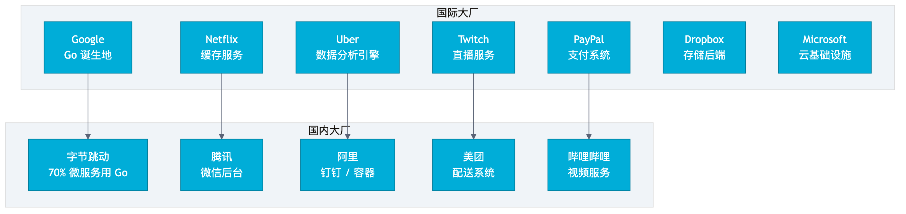
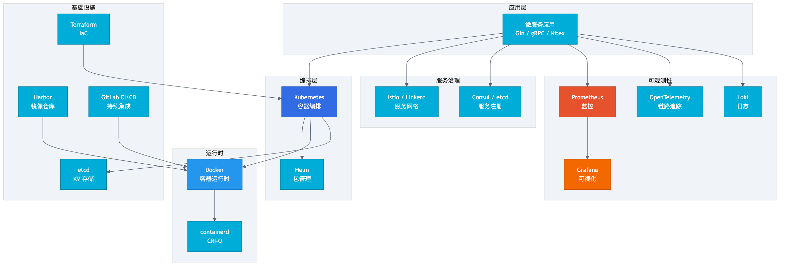
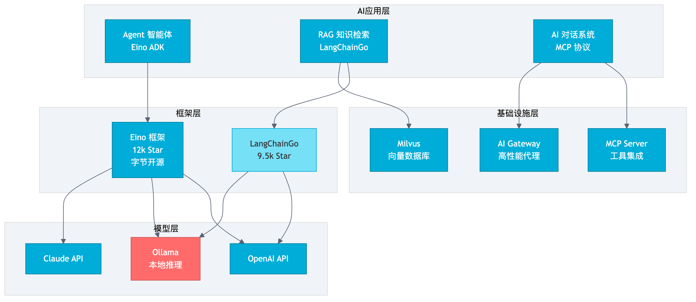
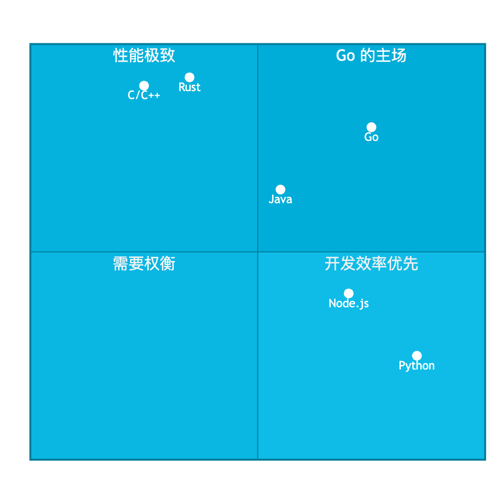
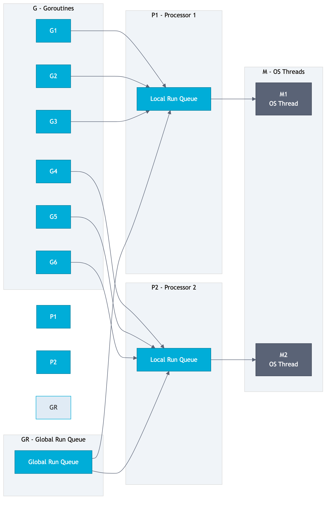
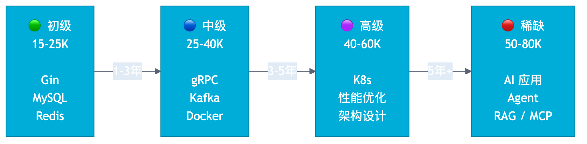

# 第 1 章 Go 为什么适合服务器开发

## 场景

2025 年，你在招聘平台搜索"后端开发"，发现一个有趣的现象：

- Java 岗位 10 万个，平均薪资 20K
- Go 岗位 2 万个，平均薪资 30K
- "Go + AI" 岗位 5000 个，平均薪资 45K

岗位数量 Java 是 Go 的 5 倍，但薪资 Go 是 Java 的 1.5 倍。

更值得关注的是，"Go + AI" 岗位虽然数量少，但薪资最高，增长最快。很多 JD 里写着：

> 熟悉 Go 语言，有 LLM 应用开发经验优先
> 了解 MCP 协议、Agent 开发
> 有高并发系统经验

这不是偶然。Go 正在从"云原生语言"进化为"AI 基础设施语言"。

本章回答三个问题：
1. 大厂为什么选 Go？
2. AI 时代，Go 的机会在哪里？
3. 你该如何规划 Go 工程师的成长路线？

---

## 1.1 大厂为什么选择 Go



### 1.1.1 国际大厂

**Google**

Go 诞生于 Google。2007 年，Rob Pike、Ken Thompson 和 Robert Griesemer 设计 Go 的初衷是解决 Google 内部大规模软件工程的问题：

- 编译速度慢
- 依赖管理混乱
- 并发编程复杂

今天，Google 内部大量服务用 Go 编写，包括 Kubernetes（后来开源，成为云原生事实标准）。

**Netflix**

Netflix 用 Go 替代 Java 构建缓存服务。原因是：

- Java GC 停顿导致延迟不稳定
- Go 的 Goroutine 模型更适合高并发缓存场景
- 部署简单，二进制文件小

**Uber**

Uber 用 Go 构建实时数据分析引擎 AresDB：

> AresDB is written in Go and powers real-time data analytics dashboards at Uber, enabling data-driven decisions at scale.

选择 Go 的原因：
- 低延迟（相比 Java 的 GC 停顿）
- 高并发（Goroutine 轻量级）
- 开发效率高（相比 C/C++）

**Twitch**

Twitch 服务数百万并发用户，用 Go 构建核心服务：

> Go's simplicity, safety, performance, and readability make it a good tool for the problems we encounter with serving live video and chat to our millions of users.

**PayPal & American Express**

支付系统对稳定性和性能要求极高。PayPal 和 American Express 都选择 Go：

- PayPal：用 Go 现代化支付系统
- American Express：用 Go 构建支付和奖励网络

### 1.1.2 国内大厂

**字节跳动**

字节是国内 Go 生态的最大推动者：

> 70% of microservices within ByteDance are written in Go.

字节不仅用 Go，还开源了 CloudWeGo 生态：

- **Kitex**：高性能 RPC 框架
- **Hertz**：高性能 HTTP 框架
- **CloudWeGo**：微服务套件

更重要的是，字节开源了 **Eino**（12k Star），这是 Go 生态中最重要的 AI 应用开发框架，后面会详细讲。

**腾讯**

- 微信后台大量使用 Go
- 腾讯云基础设施基于 Go

**阿里**

- 钉钉后台用 Go
- 阿里云容器服务用 Go

**美团**

美团配送调度系统用 Go，原因是：
- 高并发场景下性能优异
- 开发效率高于 C/C++
- 部署简单，适合容器化

**哔哩哔哩**

B 站视频服务用 Go，处理海量并发请求。

### 1.1.3 小结：大厂选 Go 的共同原因

| 原因 | 说明 |
|------|------|
| 性能 | 接近 C，远超 Java/Python |
| 并发 | Goroutine 模型，天然适合高并发 |
| 部署 | 静态编译，无依赖，容器友好 |
| 开发效率 | 语法简单，编译快，学习曲线平缓 |
| 生态 | 云原生生态完整，AI 生态正在崛起 |

---

## 1.2 云原生时代，Go 是事实标准

如果你打开云原生技术栈全景图，会发现一个惊人的事实：**核心组件几乎全是 Go 写的**。



**为什么云原生选择了 Go？**

1. **静态编译**：一个二进制文件，无运行时依赖，天然适合容器
2. **交叉编译**：`GOOS=linux GOARCH=amd64 go build`，一条命令编译出 Linux 二进制
3. **启动快**：毫秒级启动，适合容器弹性伸缩
4. **内存占用低**：比 Java 省内存，适合大规模部署
5. **并发性能好**：Goroutine 模型适合处理大量网络请求

Java 在云原生时代并不是没有机会（Spring Cloud 依然强大），但 Go 的优势在于：

- 启动速度：Go 毫秒级 vs Java 秒级
- 内存占用：Go 几十 MB vs Java 几百 MB
- 部署复杂度：Go 单文件 vs Java 需要 JRE

---

## 1.3 AI 时代，Go 正在成为基础设施语言

这是本章的重点。

很多人有一个误解：**AI = Python**。

确实，模型训练用 Python（PyTorch、TensorFlow），但 **AI 应用落地** 是另一回事。

### 1.3.1 AI 不只是 Python 的事

想象一个场景：

你的公司要上线一个 AI 客服系统，需求是：
- 支持 10 万并发用户
- 响应延迟 < 500ms
- 99.99% 可用性
- 需要对接多个 LLM（OpenAI、Claude、本地模型）

用 Python 写这个系统？

- Python 的 GIL 限制了并发
- Python 的部署复杂（依赖管理、虚拟环境）
- Python 的启动慢，不适合容器弹性伸缩

用 Go 写这个系统？

- Goroutine 天然支持高并发
- 静态编译，部署简单
- 毫秒级启动，适合弹性伸缩
- 低延迟，GC 停顿可控

**结论：Python 负责训练模型，Go 负责让 AI 产品跑起来。**

### 1.3.2 Go AI 生态全景



Go 的 AI 生态正在快速崛起：

**LLM 框架**

| 框架 | Star | 说明 |
|------|------|------|
| [LangChainGo](https://github.com/tmc/langchaingo) | 9.5k | LangChain 的 Go 实现 |
| [Eino](https://github.com/cloudwego/eino) | 12k | 字节开源的 AI 应用框架 |

**本地推理**

| 项目 | 说明 |
|------|------|
| [Ollama](https://github.com/ollama/ollama) | 本地运行 LLM，Go 写的 |

**AI 协议**

| 协议 | 说明 |
|------|------|
| MCP | Model Context Protocol，Anthropic 提出，GitHub 原生支持 |

MCP 是 AI 时代的"USB 接口"，让 AI 模型可以调用外部工具。用 Go 开发 MCP Server 是最佳选择之一。

**Agent 开发**

| 框架 | 说明 |
|------|------|
| Eino ADK | 字节开源的 Agent 开发套件 |
| LangChainGo Agents | LangChain 的 Agent 实现 |

**RAG 系统**

RAG（Retrieval-Augmented Generation）是企业 AI 的核心技术。Go 生态有：

- 向量数据库：Milvus（Go 写的）、Qdrant（Rust，但有 Go SDK）
- RAG 框架：Eino、LangChainGo

**AI Gateway**

高性能 LLM 代理层，用 Go 写是最佳选择：

- 高并发请求处理
- 流式响应转发
- 多模型路由

### 1.3.3 大厂 AI 基础设施为什么选 Go

**字节跳动**

字节不仅用 Go 写微服务，还用 Go 构建 AI 基础设施：

- **CloudWeGo**：微服务生态
- **Eino**：AI 应用框架，支持 Agent、RAG、多模型

Eino 的设计理念：

> Eino 是一个 Go 语言的 LLM 应用开发框架，借鉴了 LangChain 和 Google ADK 的设计，遵循 Go 语言惯例。

**为什么字节选 Go 做 AI 框架？**

1. **性能**：AI 推理服务需要低延迟，Go 的 GC 停顿可控
2. **并发**：AI Agent 需要并发调用多个工具，Go 的 Goroutine 天然适合
3. **部署**：AI 服务需要容器化部署，Go 的静态编译优势明显
4. **生态**：字节的微服务生态都是 Go，AI 服务需要无缝集成

### 1.3.4 AI 不会取代 Go 工程师，但会淘汰不会用 AI 的 Go 工程师

AI 编程工具正在改变开发方式：

- **GitHub Copilot**：代码补全
- **Cursor**：AI 编辑器
- **Claude Code**：AI 编程助手

这些工具不会取代工程师，但会提高效率。未来的 Go 工程师需要：

1. **会用 AI 工具提效**：用 AI 写代码、写测试、做 Code Review
2. **会开发 AI 应用**：用 Go 开发 LLM 应用、Agent、RAG 系统
3. **会构建 AI 基础设施**：AI Gateway、MCP Server、向量数据库

本书第九、十阶段专门讲 AI：

- **第九阶段：AI 辅助开发** — 用 AI 提效
- **第十阶段：Go 构建 AI 应用** — 用 Go 开发 AI 应用

---

## 1.4 Go 解决了什么问题

### 1.4.1 性能 vs 开发效率的平衡

| 语言 | 性能 | 开发效率 | 适用场景 |
|------|------|----------|----------|
| C/C++ | 极高 | 低 | 操作系统、游戏引擎 |
| Java | 高 | 中 | 企业应用、大数据 |
| Python | 低 | 高 | 数据分析、AI 训练 |
| Go | 高 | 高 | 云原生、微服务、AI 应用 |



Go 的定位很清晰：**在保持高开发效率的同时，提供接近 C 的性能**。

一个对比：

```go
// Go：编译一个大型项目，几秒钟
$ go build ./...
// 完成

// Java：编译一个大型项目，可能需要几分钟
$ mvn clean package
// 等待...

// C++：编译一个大型项目，可能需要几十分钟
$ make
// 等待...
```

Go 的编译速度极快，这是因为它的设计目标之一就是"快速编译"。

### 1.4.2 并发编程的简化

Java 的并发模型是"一请求一线程"，线程是重量级的：

```java
// Java：创建 10 万个线程，内存可能不够
for (int i = 0; i < 100000; i++) {
    new Thread(() -> {
        // 处理请求
    }).start();
}
```

Go 的并发模型是 Goroutine，轻量级的：

```go
// Go：创建 10 万个 Goroutine，轻松搞定
for i := 0; i < 100000; i++ {
    go func() {
        // 处理请求
    }()
}
```

一个 Goroutine 初始栈只有 2KB，可以轻松创建数百万个。



### 1.4.3 部署的简单性

Java 部署需要：
- 安装 JRE
- 配置环境变量
- 打包 WAR/JAR
- 配置应用服务器

Go 部署只需要：
- 编译一个二进制文件
- 复制到服务器
- 运行

```bash
# 交叉编译 Linux 二进制
$ GOOS=linux GOARCH=amd64 go build -o app

# 复制到服务器
$ scp app server:/opt/app/

# 运行
$ ./app
```

这就是 Go 适合容器化的原因：一个 Docker 镜像只需要几 MB。

```dockerfile
# Go 的 Dockerfile
FROM golang:1.21 AS builder
WORKDIR /app
COPY . .
RUN go build -o app

FROM alpine:latest
COPY --from=builder /app/app /app
CMD ["/app"]
# 最终镜像只有 10-20 MB

# Java 的 Dockerfile
FROM maven:3.8 AS builder
WORKDIR /app
COPY . .
RUN mvn package

FROM openjdk:17
COPY --from=builder /app/target/app.jar /app.jar
CMD ["java", "-jar", "/app.jar"]
# 最终镜像 200-500 MB
```

---

## 1.5 从招聘 JD 看 Go 工程师技能树

根据招聘平台数据，Go 工程师分为四个级别：

### 初级（15-25K）

**要求：**
- 熟悉 Go 语言基础
- 会用 Gin 框架
- 熟悉 MySQL、Redis
- 了解 HTTP 协议

**典型 JD：**
> 1-3 年经验，熟悉 Go 语言，熟练使用 Gin 框架，熟悉 MySQL 和 Redis，有 REST API 开发经验。

### 中级（25-40K）

**要求：**
- 熟悉微服务开发
- 会用 gRPC、Kafka
- 熟悉 Docker
- 了解分布式系统

**典型 JD：**
> 3-5 年经验，熟悉微服务架构，熟练使用 gRPC 和消息队列，熟悉 Docker 容器化，有高并发系统经验。

### 高级（40-60K）

**要求：**
- 熟悉 Kubernetes
- 会做性能优化
- 了解云原生生态
- 有架构设计能力

**典型 JD：**
> 5 年以上经验，熟悉 Kubernetes 和云原生生态，有性能优化经验，能独立设计系统架构，带领团队完成项目。

### 稀缺（50-80K）★ 新增

**要求：**
- 熟悉 Go + AI 应用开发
- 了解 LLM、Agent、RAG
- 熟悉 MCP 协议
- 有 AI 基础设施经验

**典型 JD：**
> 熟悉 Go 语言，有 LLM 应用开发经验，了解 Agent 设计模式和 RAG 技术，熟悉 MCP 协议，有高并发系统经验。



---

## 1.6 本书能帮你什么

本书《Go 服务器开发工程师实战：从业务系统到云原生平台》是一本面向 Go 后端工程师的实战指南。

### 内容结构

- **10 个阶段**：从基础到高级，循序渐进
- **76 章**：覆盖完整技术栈
- **4 个毕业项目**：实战检验

### 阶段概览

| 阶段 | 内容 | 目标 |
|------|------|------|
| 一 | Go 开发基础 | 开发简单业务服务 |
| 二 | Web 服务开发 | 独立开发业务系统 |
| 三 | 数据存储与缓存 | 掌握企业核心数据层 |
| 四 | 微服务开发 | 掌握企业级服务开发 |
| 五 | 云原生开发 | 达到高级 Go 工程师水平 |
| 六 | 可观测性与稳定性 | 具备生产环境运维能力 |
| 七 | Go 高并发与性能 | 成为高级开发工程师 |
| 八 | Go 源码思维 | 理解 Go 底层原理 |
| 九 | AI 辅助开发 | 提升开发效率 |
| 十 | Go 构建 AI 应用 | 具备 AI 应用开发能力 |

### 本书特色

1. **从真实业务场景开始** — 每章从一个真实问题出发
2. **先解决问题再讲原理** — 不做教科书式定义堆砌
3. **提供完整可运行代码** — 所有代码都可以直接运行
4. **使用生产环境案例** — 不是玩具示例
5. **给出最佳实践** — 告诉你怎么做最好
6. **给出故障排查方法** — 不只教你怎么写，更教你怎么排查问题
7. **面试题驱动** — 每章附带高频面试题

---

## 小结

本章回答了三个问题：

**1. 大厂为什么选 Go？**

- 性能接近 C，开发效率高
- Goroutine 模型适合高并发
- 静态编译，部署简单
- 云原生生态完整

**2. AI 时代，Go 的机会在哪里？**

- Python 负责训练模型，Go 负责让 AI 产品跑起来
- Go AI 生态正在崛起：LangChainGo、Eino、Ollama、MCP
- Go + AI 工程师是稀缺人才

**3. 你该如何规划 Go 工程师的成长路线？**

- 初级：Gin + MySQL + Redis
- 中级：gRPC + Kafka + Docker
- 高级：K8s + 性能优化 + 架构设计
- 稀缺：Go + AI 应用开发

本书将带你从初级走到高级，甚至触及稀缺级别。

---

## 面试题

**Q1：Go 语言适合做什么？**

A：Go 适合做服务器开发，特别是：
- Web 服务（Gin、Echo）
- 微服务（gRPC、Kitex）
- 云原生工具（Docker、K8s）
- AI 应用（LangChainGo、Eino）

**Q2：为什么大厂选择 Go 而不是 Java？**

A：
- Go 启动快，适合容器弹性伸缩
- Go 内存占用低，适合大规模部署
- Go 并发模型简单，开发效率高
- Go 编译快，迭代速度快

**Q3：AI 时代，Go 工程师的价值在哪里？**

A：
- AI 应用落地需要高并发、低延迟，这是 Go 的主场
- AI 基础设施（MCP Server、AI Gateway）需要高性能，Go 是最佳选择
- Go + AI 是稀缺技能，薪资高

**Q4：Go 和 Rust 怎么选？**

A：
- Go：开发效率高，适合业务开发、云原生、AI 应用
- Rust：性能极致，适合对性能要求极高的场景（数据库、浏览器引擎）
- 大多数场景，Go 的开发效率优势更明显

**Q5：初学者应该先学 Go 还是 Python？**

A：
- 如果你想做 AI 训练、数据分析，先学 Python
- 如果你想做后端开发、云原生、AI 应用，先学 Go
- 最好的选择：两个都学，Python 做 AI 训练，Go 做 AI 应用
