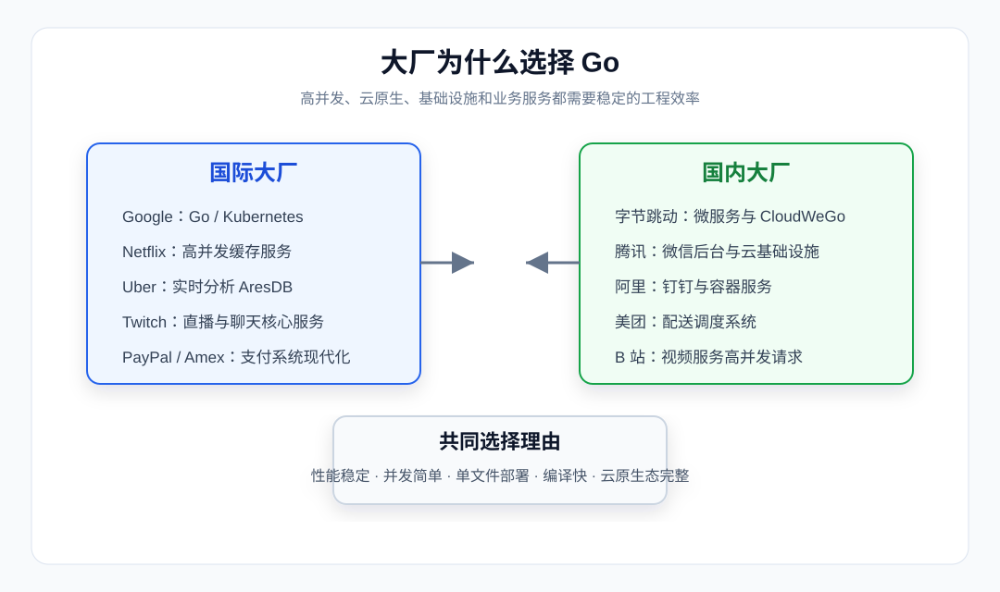
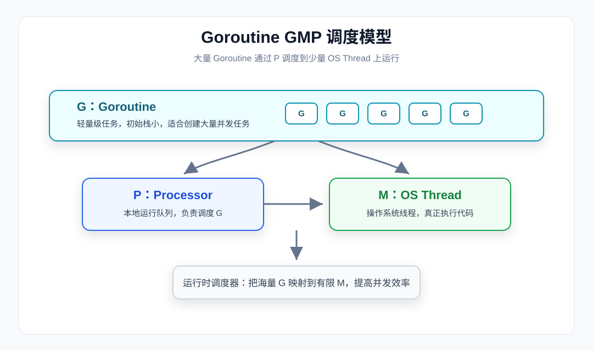
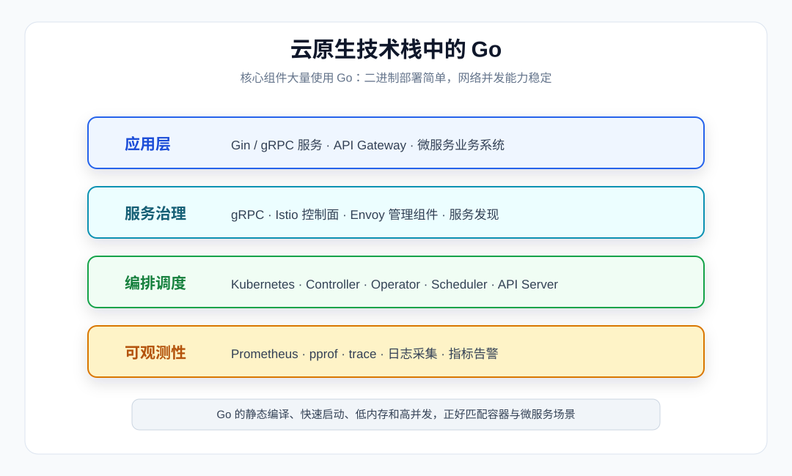
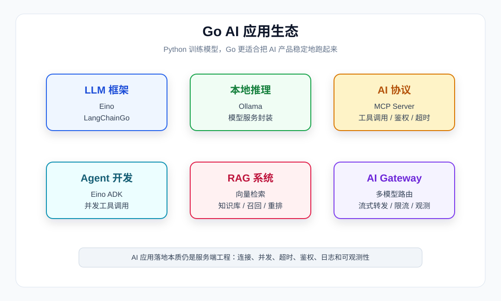
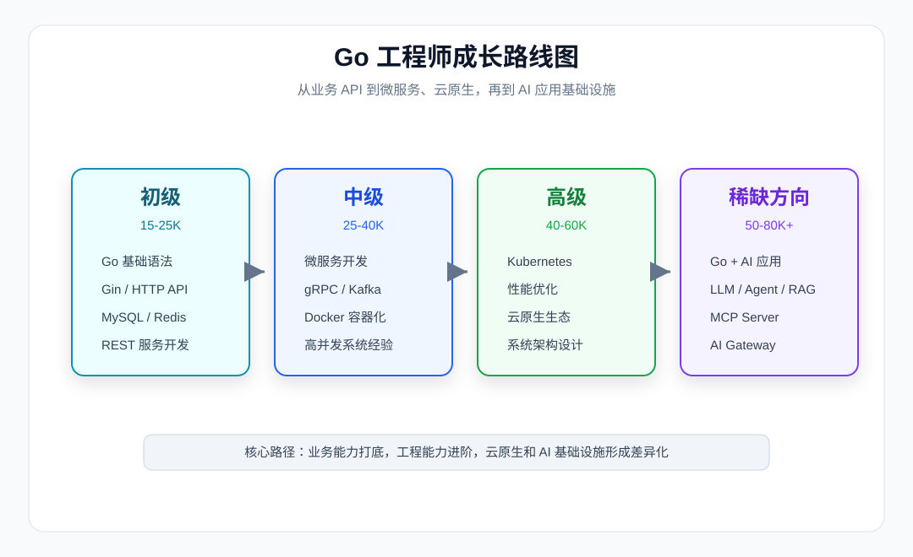

# 第 1 章 Go 为什么适合服务器开发

## 场景

你所在团队准备重构一个企业用户中心。

这个系统看起来不复杂：注册、登录、用户资料、权限校验、Token 管理。但上线后它会站在所有业务系统前面：

- 后台管理系统要调用它
- 订单、支付、库存服务要依赖它
- 移动端和 Web 端登录流量会打到它
- 后续还要接入审计日志、风控、AI 助手和内部 MCP 工具

Leader 让你做技术选型：Java、Node.js、Go 都能写这个服务，为什么最后选择 Go？

不是因为 Go 在所有指标上都第一，而是因为它在服务器开发里取得了很好的平衡：

- 性能足够好，延迟稳定，适合高并发 API
- 语法简单，团队新人能较快接手
- 单二进制部署，容器化和 CI/CD 友好
- 标准库 HTTP、测试、pprof、trace 等工具完整
- 云原生生态成熟，后续上 Kubernetes、Prometheus、gRPC 很顺

本章回答三个问题：

1. 用户中心这种服务为什么适合用 Go？
2. Go 在业务服务、云原生和 AI 应用中的位置是什么？
3. 本书会如何用一个用户管理服务串起第一阶段？

---

## 1.1 从用户中心技术选型开始

先看这个系统的核心诉求：

| 诉求 | 对技术栈的要求 |
|------|----------------|
| 登录接口流量高 | 并发处理能力稳定 |
| 被多个业务系统依赖 | 服务可用性和排障能力要强 |
| 后续要拆成微服务 | RPC、配置、观测、部署链路要顺 |
| 需要容器化部署 | 镜像小、启动快、发布简单 |
| 团队需要长期维护 | 代码可读、测试方便、工具链稳定 |

Java、Node.js、Go 都能完成这个任务，但侧重点不同：

| 维度 | Java | Node.js | Go |
|------|------|---------|----|
| 团队上手 | 中 | 高 | 高 |
| 高并发 API | 高 | 中 | 高 |
| 类型安全 | 高 | 中 | 高 |
| 部署复杂度 | 中 | 中 | 低 |
| 云原生适配 | 高 | 中 | 高 |
| 生态优势 | 企业应用、框架成熟 | 前端同构、快速迭代 | 后端服务、云原生、基础设施 |

如果团队已经有成熟 Java 体系，继续用 Java 没问题；如果团队以前端为主，Node.js 也有优势。但对于一个要长期运行、后续会上云原生、还要接入微服务和可观测性的用户中心，Go 的工程复杂度更低，性能和开发效率也比较均衡。

这就是本书选择 Go 作为主线语言的原因：它不是为了展示语法，而是为了把服务稳定地跑起来。

---

## 1.2 Go 适合服务器开发的核心原因



Go 的价值不是某一个特性特别惊艳，而是几个工程能力组合在一起很适合服务器开发。

### 1.2.1 编译快，部署简单

Go 编译后通常得到一个独立二进制文件，部署时不需要额外安装语言运行时。对于用户中心这类 API 服务，发布链路可以非常直接：

```bash
GOOS=linux GOARCH=amd64 go build -o user-center
scp user-center server:/opt/user-center/
./user-center
```

这对 CI/CD、Docker 镜像构建、灰度发布都很友好。

### 1.2.2 并发模型简单

Go 使用 goroutine 表达并发任务。你可以用同步写法处理请求、调用数据库、访问下游服务，而不必把业务逻辑拆成复杂回调。

```go
go func() {
    // 处理一个后台任务
}()
```

goroutine 初始栈很小，运行时会按需增长；阻塞 I/O 时，Go 调度器会把线程让给其他 goroutine 使用。对大多数后端服务来说，这种模型足够简单，也足够高效。



### 1.2.3 标准库适合写服务

Go 标准库里就有服务器开发常用能力：

- `net/http`：HTTP 服务和客户端
- `context`：超时、取消、请求链路传递
- `testing`：单元测试和基准测试
- `log/slog`：结构化日志
- `runtime/pprof`、`runtime/trace`：性能分析

这些能力让 Go 很适合作为服务器开发的起点。后面你再引入 Gin、MySQL、Redis、gRPC、Kafka，也是在这套基础能力之上扩展。

### 1.2.4 工程约束明确

Go 的语法不多，代码格式由 `gofmt` 统一，依赖由 Go Modules 管理。这些设计会减少团队协作中的无效争论。

对一个长期维护的服务来说，可读性、可测试性、可部署性往往比“语法表达力”更重要。

---

## 1.3 为什么云原生偏爱 Go

云原生生态中，很多核心项目都选择了 Go。不是因为其他语言不能做，而是 Go 的特性正好匹配云原生组件的需求。



云原生组件通常需要：

1. 以服务或命令行工具形式运行
2. 跨平台发布
3. 镜像体积可控
4. 启动速度快
5. 处理大量网络连接和 API 请求
6. 和 Kubernetes、Prometheus、gRPC 等生态集成

Go 在这些方面比较顺手：

- 静态编译，交付物简单
- 交叉编译方便
- 启动快，适合容器弹性伸缩
- 标准库网络能力完整
- 云原生生态成熟

Java 在云原生时代依然强大，特别是大型企业应用和 Spring 生态；Rust 在系统组件和极致性能场景也很有优势。Go 的优势在于：它在性能、开发效率和部署复杂度之间取得了很好的折中。

---

## 1.4 AI 时代 Go 的位置

很多人会把 AI 和 Python 直接画等号。这个判断只对了一半。

模型训练、数据分析、实验探索，Python 生态确实更强。但一个 AI 能力真正进入业务系统后，还要面对这些问题：

- 多模型路由
- 流式响应转发
- 工具调用
- 权限控制
- 请求超时
- 日志、监控、链路追踪
- 高并发 API 网关

这些问题本质上仍然是服务器工程问题。Go 的价值在于把 AI 能力服务化、平台化、工程化。



可以简单理解为：

| 场景 | 更常见选择 | 原因 |
|------|------------|------|
| 模型训练 | Python | PyTorch、TensorFlow、数据科学生态成熟 |
| AI 应用 API | Go / Java / Python | 取决于团队技术栈和性能要求 |
| AI Gateway | Go / Java / Rust | 关注并发、流式转发、稳定性 |
| MCP Server | Go / TypeScript / Python | 本质是服务端工具协议实现 |
| RAG 平台 | 多语言组合 | 检索、服务、任务调度可能用不同技术 |

Go 不是 AI 时代的唯一选择，但它很适合做 AI 应用背后的服务化基础设施。

---

## 1.5 Go 不适合什么场景

技术选型不能只讲优点。Go 很适合服务器开发，但不是所有场景都应该优先选 Go。

| 场景 | 更合适的选择 | 原因 |
|------|--------------|------|
| 模型训练、数据分析 | Python | 科学计算和机器学习生态更成熟 |
| 极致性能和内存控制 | Rust / C++ | 更细粒度的内存控制，无 GC |
| 强实时系统 | C / C++ / Rust | GC 语言不适合严格实时约束 |
| 大型传统企业应用 | Java | 框架、人才、历史系统和治理体系成熟 |
| 快速做前端同构应用 | Node.js / TypeScript | 前后端语言统一，生态丰富 |

所以，选择 Go 的前提不是“Go 比所有语言都好”，而是你的问题确实更看重服务端工程效率、并发处理、部署简单和云原生生态。

回到本章的企业用户中心：它是典型的后端服务，不需要极致底层控制，也不是模型训练任务；它更需要稳定、可维护、易部署。这就是 Go 合适的原因。

---

## 1.6 Go 服务器工程师能力模型



本书不是只教语法，而是按服务器开发工程师的成长路径设计。

### 入门：能写出可运行服务

你需要掌握：

- Go 基础语法
- `net/http` 或 Gin
- 基础错误处理
- 单元测试
- 基本工程结构

对应本书第一阶段：我们会从用户管理服务开始，把一个简单 API 跑起来。

### 进阶：能独立开发业务系统

你需要掌握：

- REST API 设计
- 配置管理
- 日志体系
- JWT 认证
- MySQL、Redis
- OpenAPI 文档

对应本书第二、三阶段：你会从简单 API 走向完整业务系统。

### 高级：能设计和治理服务

你需要掌握：

- gRPC
- Kafka
- 限流、熔断、降级
- Docker、Kubernetes
- CI/CD
- Prometheus、Grafana、OpenTelemetry

对应本书第四到第七阶段：你会从单体服务走向微服务和云原生。

### 扩展：能把 AI 能力接入业务

你需要理解：

- AI 辅助开发
- Prompt、Function Calling、Agent
- RAG
- MCP
- Go AI 应用框架

对应本书第九、十阶段：你会学习如何用 Go 把 AI 能力接入真实业务系统。

---

## 1.7 本书如何带你成长

本书《Go 服务器开发工程师实战：从业务系统到云原生平台》是一本面向 Go 后端工程师的实战指南。

### 内容结构

- **10 个阶段**：从基础到高级，循序渐进
- **76 章**：覆盖完整技术栈
- **4 个毕业项目**：实战检验

### 阶段概览

| 阶段 | 内容 | 目标 |
|------|------|------|
| 一 | Go 开发基础 | 开发简单业务服务 |
| 二 | Web 服务开发 | 独立开发业务系统 |
| 三 | 数据存储与缓存 | 掌握企业核心数据层 |
| 四 | 微服务开发 | 掌握企业级服务开发 |
| 五 | 云原生开发 | 达到高级 Go 工程师水平 |
| 六 | 可观测性与稳定性 | 具备生产环境运维能力 |
| 七 | Go 高并发与性能 | 成为高级开发工程师 |
| 八 | Go 源码思维 | 理解 Go 底层原理 |
| 九 | AI 辅助开发 | 提升开发效率 |
| 十 | Go 构建 AI 应用 | 具备 AI 应用开发能力 |

### 本书特色

1. **从真实业务场景开始** — 每章从一个真实问题出发
2. **先解决问题再讲原理** — 不做教科书式定义堆砌
3. **提供完整可运行代码** — 所有代码都可以直接运行
4. **使用生产环境案例** — 不是玩具示例
5. **给出最佳实践** — 告诉你怎么做最好
6. **给出故障排查方法** — 不只教你怎么写，更教你怎么排查问题
7. **面试题驱动** — 每章附带高频面试题

---

## 小结

本章从企业用户中心的技术选型出发，回答了“为什么用 Go 做服务器开发”。

核心结论是：

1. Go 适合服务器开发，不是因为它每项指标都第一，而是性能、开发效率、部署复杂度和工程约束比较均衡。
2. Go 在云原生生态中很常见，因为它适合写长期运行的服务、控制面组件和命令行工具。
3. AI 时代并不只有 Python。模型训练常用 Python，但 AI 能力服务化、平台化、工程化时，Go 也有位置。
4. Go 不是万能语言。模型训练、强实时、极致底层控制、大型传统企业系统，都可能有更合适的技术栈。
5. 本书会用“用户管理服务”作为第一阶段主线，带你从开发环境、核心语法、HTTP API、错误处理、接口设计、Context、测试一路走完。

下一章，我们先搭建 Go 开发环境和工具链，让这个用户管理服务能在本地稳定运行、测试和构建。

---

## 面试题

**Q1：为什么用户中心服务适合用 Go？**

A：
- 用户中心是典型高并发 API 服务，Go 的 goroutine 模型适合处理大量请求
- 用户中心需要长期运行，Go 的部署和观测工具链比较完整
- 用户中心后续可能接入 gRPC、Kubernetes、Prometheus，Go 云原生生态成熟
- Go 代码风格统一，适合团队长期维护

**Q2：Go 和 Java 怎么选？**

A：
- 如果团队已有成熟 Java 体系、业务大量依赖 Spring 生态，Java 是稳妥选择
- 如果服务更关注轻量部署、快速启动、云原生集成，Go 更有优势
- 技术选型不是语言对错，而是团队经验、系统约束、维护成本的综合结果

**Q3：Go 和 Node.js 怎么选？**

A：
- Node.js 适合前端团队快速做全栈应用，也适合 I/O 密集型业务
- Go 更适合类型约束强、长期维护、高并发、云原生部署的后端服务
- 如果用户中心要成为多个系统依赖的基础服务，Go 的工程约束会更有价值

**Q4：什么场景下不应该优先选 Go？**

A：
- 模型训练和数据分析，优先考虑 Python
- 强实时或极致底层性能场景，优先考虑 Rust/C/C++
- 大量历史系统和团队能力都在 Java 生态时，不必为了追新强行迁移

**Q5：AI 时代 Go 工程师的价值在哪里？**

A：
- 不只是调用模型 API，而是把 AI 能力接入真实业务系统
- 能处理超时、并发、鉴权、审计、观测、部署等工程问题
- 能构建 AI Gateway、MCP Server、RAG 服务等基础设施

---

## 参考资料

> 本章基于 **Go 1.23**（第8章为 Go 1.22）。语言行为随版本演进，以对应版本官方文档为准。

- Go 官方文档首页：https://go.dev/doc/
- Effective Go：https://go.dev/doc/effective_go
- Go 语言规范（The Go Programming Language Specification）：https://go.dev/ref/spec
- Go 博客：https://go.dev/blog/
