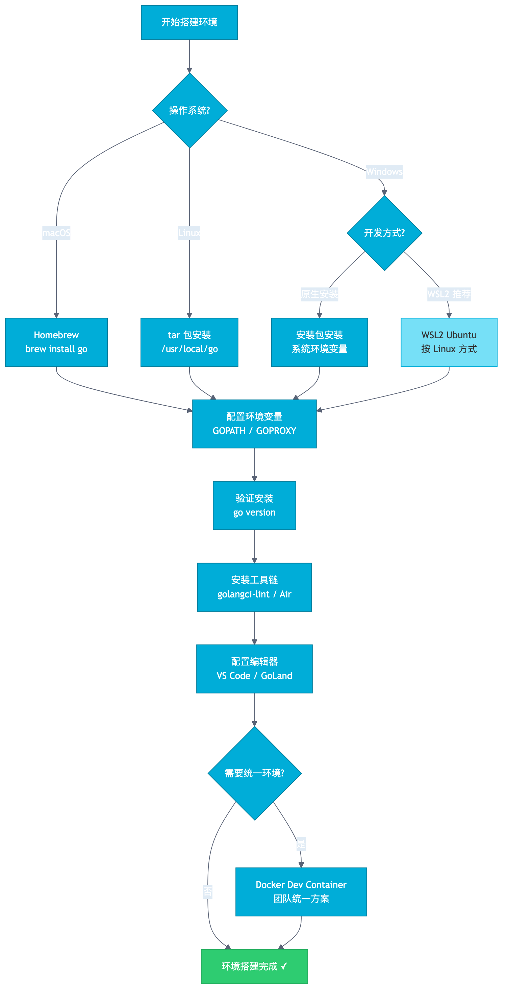
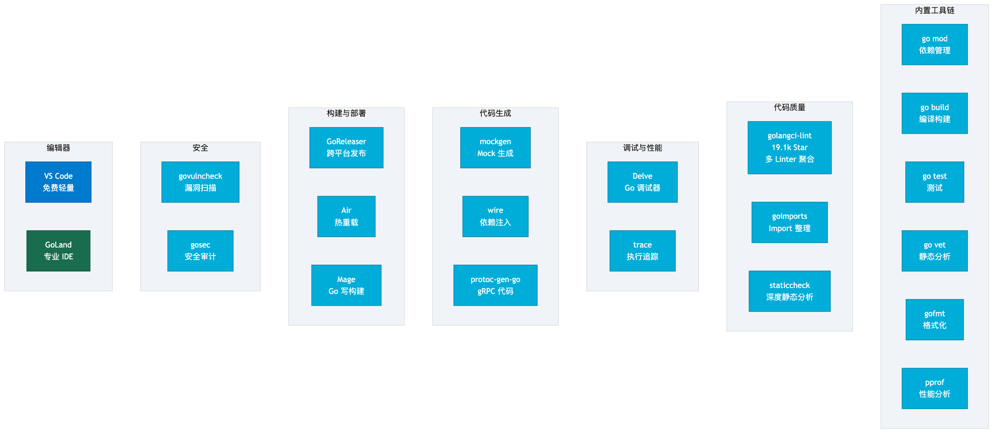
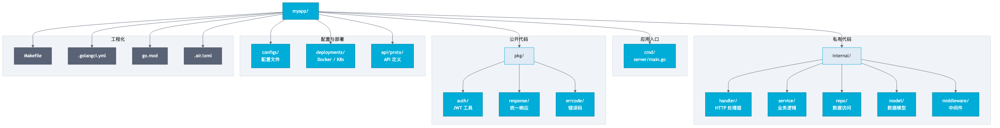
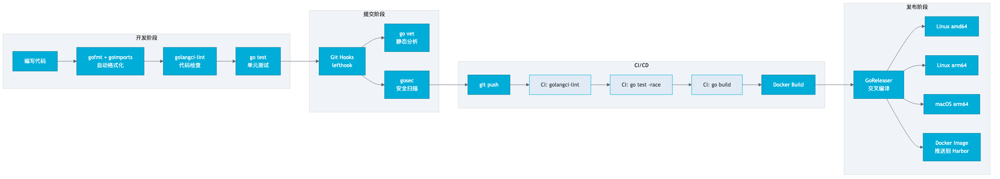

# 第 2 章 Go 开发环境与工具链

## 场景

你入职了一家互联网公司，Leader 对你说："用 Go 写个服务，明天上线。"

你打开电脑，发现：

- Go 装哪个版本？环境变量怎么配？
- 依赖管理用 go mod，但私有仓库怎么配？
- 代码格式不统一，同事写的风格各异
- 本地能跑，部署到 Linux 就报错
- 没有热重载，改一行代码要重启服务

这些问题不是技术问题，是**工程问题**。

本章解决一个核心问题：**如何搭建一个生产级的 Go 开发环境，并配齐工具链**。



---

## 2.1 开发环境搭建

### 2.1.1 macOS 环境

```bash
# 安装 Go（推荐用 Homebrew）
brew install go

# 验证安装
go version
# go version go1.23.0 darwin/arm64
```

配置环境变量（`~/.zshrc`）：

```bash
# Go 环境变量
export GOPATH=$HOME/go
export GOBIN=$GOPATH/bin
export PATH=$PATH:$GOBIN

# 国内代理（必须配置，否则下载依赖会超时）
export GOPROXY=https://goproxy.cn,direct
export GONOSUMDB=*.yourcompany.com

# 私有仓库（如果需要拉私有 Git 仓库的依赖）
export GOPRIVATE=git.yourcompany.com
```

```bash
# 使配置生效
source ~/.zshrc
```

### 2.1.2 Windows 环境

**方式一：安装包安装**

1. 下载 [Go 安装包](https://go.dev/dl/)
2. 双击安装，默认安装到 `C:\Program Files\Go`
3. 配置系统环境变量：
   - `GOPATH` = `C:\Users\你的用户名\go`
   - `Path` 追加 `%GOPATH%\bin`
   - `GOPROXY` = `https://goproxy.cn,direct`

```powershell
# 验证
go version
```

**方式二：WSL2 开发（推荐）**

Windows 上做 Go 开发，推荐用 WSL2：

```powershell
# PowerShell（管理员）
wsl --install -d Ubuntu
```

然后在 WSL2 里按 Linux 方式配置，体验一致。

### 2.1.3 Linux 环境（服务器）

```bash
# 下载
wget https://go.dev/dl/go1.23.0.linux-amd64.tar.gz

# 解压到 /usr/local
sudo rm -rf /usr/local/go
sudo tar -C /usr/local -xzf go1.23.0.linux-amd64.tar.gz

# 配置环境变量（/etc/profile 或 ~/.bashrc）
export PATH=$PATH:/usr/local/go/bin
export GOPATH=$HOME/go
export GOPROXY=https://goproxy.cn,direct

# 使配置生效
source ~/.bashrc

# 验证
go version
```

### 2.1.4 多版本管理

实际开发中可能需要切换 Go 版本。推荐用 `go install` 管理：

```bash
# 安装指定版本的 Go
go install golang.org/dl/go1.22.0@latest

# 下载该版本
go1.22.0 download

# 使用该版本
go1.22.0 version
```

也可以用 `gvm`（Go Version Manager）：

```bash
# 安装 gvm
bash < <(curl -s -S -L https://raw.githubusercontent.com/moovweb/gvm/master/binscripts/gvm-installer)

# 安装 Go 版本
gvm install go1.23.0 --binary
gvm use go1.23.0 --default
```

### 2.1.5 Docker 开发环境（统一方案）

团队开发最怕"我本地能跑"。用 Docker 统一开发环境是最可靠的方案：

```dockerfile
# Dockerfile.dev
FROM golang:1.23

# 安装 Air（热重载）
RUN go install github.com/air-verse/air@latest

WORKDIR /app

# 先拷贝依赖文件，利用 Docker 缓存
COPY go.mod go.sum ./
RUN go mod download

# 拷贝源码
COPY . .

CMD ["air", "-c", ".air.toml"]
```

```yaml
# docker-compose.dev.yml
services:
  app:
    build:
      context: .
      dockerfile: Dockerfile.dev
    ports:
      - "8080:8080"
    volumes:
      - .:/app
    environment:
      - GOPROXY=https://goproxy.cn,direct

```

```bash
# 一键启动开发环境
docker compose -f docker-compose.dev.yml up
```

### 2.1.6 环境对比

| 方案 | 优点 | 缺点 | 适用场景 |
|------|------|------|----------|
| 原生安装 | 简单直接 | 环境不一致 | 个人开发 |
| WSL2 | Windows 上 Linux 体验 | 需要额外配置 | Windows 开发 |
| Docker | 环境完全一致 | 启动稍慢 | 团队开发 |

---

## 2.2 Go 内置工具链

Go 自带一套完整的工具链，不需要额外安装。

### 2.2.1 go mod — 依赖管理

```bash
# 初始化模块
go mod init github.com/yourcompany/myapp

# 添加依赖（import 后自动执行）
go mod tidy

# 下载依赖
go mod download

# 查看依赖图
go mod graph
```

`go.mod` 文件解读：

```go
module github.com/yourcompany/myapp

go 1.23

require (
    github.com/gin-gonic/gin v1.9.1
    github.com/go-redis/redis/v9 v9.5.0
    gorm.io/gorm v1.25.7
)

require (
    // 间接依赖（不直接 import，但被直接依赖引用）
    github.com/mattn/go-isatty v0.0.19 // indirect
)
```

`go.sum` 文件记录依赖的哈希值，保证依赖的完整性和可重现性。

**私有仓库配置：**

```bash
# 方式一：环境变量
export GOPRIVATE=git.yourcompany.com

# 方式二：go 命令配置
go env -w GOPRIVATE=git.yourcompany.com

# Git 认证（确保能拉私有仓库）
git config --global url."https://your-token@git.yourcompany.com".insteadOf "https://git.yourcompany.com"
```

### 2.2.2 go build — 编译

```bash
# 编译当前目录
go build .

# 编译指定包
go build ./cmd/server

# 交叉编译 Linux
GOOS=linux GOARCH=amd64 go build -o myapp-linux ./cmd/server

# 交叉编译 ARM（如树莓派、ARM 服务器）
GOOS=linux GOARCH=arm64 go build -o myapp-arm64 ./cmd/server

# 交叉编译 Windows
GOOS=windows GOARCH=amd64 go build -o myapp.exe ./cmd/server

# 注入版本信息（-ldflags）
VERSION=$(git describe --tags --always)
go build -ldflags "-X main.version=$VERSION" -o myapp ./cmd/server

# 减小二进制体积（去掉调试信息）
go build -ldflags="-s -w" -o myapp ./cmd/server
```

`-ldflags` 常用参数：

| 参数 | 作用 |
|------|------|
| `-s` | 去掉符号表 |
| `-w` | 去掉 DWARF 调试信息 |
| `-X` | 设置字符串变量值 |

### 2.2.3 go test — 测试

```bash
# 运行当前包测试
go test .

# 运行所有测试
go test ./...

# 显示详细信息
go test -v ./...

# 运行指定测试函数
go test -v -run TestCreateUser ./internal/service

# 基准测试
go test -bench=. -benchmem ./...

# 测试覆盖率
go test -cover ./...

# 生成覆盖率报告
go test -coverprofile=coverage.out ./...
go tool cover -html=coverage.out -o coverage.html
```

### 2.2.4 go run / go install / go generate

| 命令 | 作用 | 适用场景 |
|------|------|----------|
| `go run` | 编译并立即运行 | 本地开发调试 |
| `go install` | 编译并安装到 `$GOBIN` | 安装 CLI 工具 |
| `go generate` | 执行代码生成指令 | 生成代码 |

```bash
# go run：快速运行，不产生二进制文件
go run ./cmd/server

# go install：安装工具到 $GOBIN
go install github.com/go-delve/delve/cmd/dlv@latest

# go generate：在代码中写注释，然后批量生成
# //go:generate mockgen -source=user.go -destination=mock_user.go
go generate ./...
```

### 2.2.5 go vet / gofmt

```bash
# go vet：静态分析，检查常见错误
go vet ./...

# gofmt：格式化代码
gofmt -w .

# gofmt：检查是否有未格式化的文件（CI 用）
gofmt -l .
```

`go vet` 能检查的问题：

- `fmt.Printf` 格式字符串与参数不匹配
- 不可达代码
- 结构体标签错误
- 复制锁（copy locks）
- 复合字面量中缺少字段名

### 2.2.6 Go 内置命令速查

| 命令 | 作用 | 常用场景 |
|------|------|----------|
| `go mod init` | 初始化模块 | 新建项目 |
| `go mod tidy` | 整理依赖 | 每次改完 import |
| `go mod download` | 下载依赖 | CI 构建 |
| `go build` | 编译 | 构建二进制 |
| `go run` | 编译并运行 | 本地调试 |
| `go test` | 运行测试 | 单元测试、基准测试 |
| `go install` | 安装工具 | 安装 CLI 工具 |
| `go generate` | 代码生成 | 生成 Mock 等 |
| `go vet` | 静态分析 | 代码检查 |
| `go fmt` | 格式化 | 代码格式化 |
| `go clean` | 清理缓存 | 清理构建缓存 |
| `go env` | 查看环境变量 | 排查环境问题 |
| `go doc` | 查看文档 | 查看包/函数文档 |
| `go get` | 获取依赖（已废弃） | 用 `go mod tidy` 替代 |

---

## 2.3 编辑器与 IDE

### 2.3.1 VS Code + Go 插件

**必装插件：**

| 插件 | 作用 |
|------|------|
| Go（官方） | 语法高亮、补全、跳转、重构 |
| gopls | Go 语言服务器（官方，Go 插件依赖它） |
| Go Test Explorer | 可视化运行测试 |
| GitLens | Git 增强 |

**推荐配置（`.vscode/settings.json`）：**

```json
{
    "go.useLanguageServer": true,
    "gopls": {
        "build.buildFlags": ["-tags=wireinject"],
        "formatting.localPrefix": "github.com/yourcompany/myapp",
        "ui.semanticTokens": true
    },
    "go.lintTool": "golangci-lint",
    "go.lintOnSave": "workspace",
    "go.lintFlags": ["--fast"],
    "go.testOnSave": false,
    "go.coverOnSingleTest": true,
    "editor.formatOnSave": true,
    "editor.codeActionsOnSave": {
        "source.organizeImports": "explicit"
    },
    "[go]": {
        "editor.defaultFormatter": "golang.go"
    },
    "[go.mod]": {
        "editor.defaultFormatter": "golang.go"
    }
}
```

### 2.3.2 GoLand（JetBrains）

GoLand 是 JetBrains 出品的专业 Go IDE，开箱即用：

**核心功能：**

- 智能代码补全和导航
- 内置调试器（基于 Delve）
- 数据库工具
- Docker/K8s 集成
- Git 集成
- 重构工具（提取函数、重命名等）
- 内置终端

### 2.3.3 对比与推荐

| 特性 | VS Code | GoLand |
|------|---------|--------|
| 价格 | 免费 | 付费（30 天试用） |
| 启动速度 | 快 | 较慢 |
| 内存占用 | 低 | 高 |
| 调试 | 需要配置 Delve | 开箱即用 |
| 重构 | 基础 | 强大 |
| 数据库 | 需要插件 | 内置 |
| 远程开发 | Dev Container / SSH | Gateway |
| 适合 | 轻量开发、远程开发 | 大型项目、企业开发 |

**建议：**

- 个人项目 / 轻量开发 → VS Code
- 公司项目 / 大型项目 → GoLand
- 远程服务器开发 → VS Code Remote SSH

---

## 2.4 第三方工具链



### 2.4.1 代码质量

**golangci-lint**（19.1k Star）

Go 生态最重要的代码质量工具，聚合了 100+ 个 linter。

```bash
# 安装
go install github.com/golangci/golangci-lint/v2/cmd/golangci-lint@latest

# 运行
golangci-lint run

# 指定目录
golangci-lint run ./cmd/...

# 修复
golangci-lint run --fix
```

配置文件（`.golangci.yml`）：

```yaml
run:
  timeout: 5m
  go: "1.23"

linters:
  enable:
    - gofmt        # 代码格式
    - goimports    # import 整理
    - govet        # 静态分析
    - errcheck     # 未检查的 error
    - staticcheck  # 静态检查
    - unused       # 未使用的代码
    - gosimple     # 简化代码
    - ineffassign  # 无效赋值
    - typecheck    # 类型检查
    - gocritic     # 代码风格
    - misspell     # 拼写检查
    - revive       # 可替代 golint
    - bodyclose    # HTTP body 未关闭
    - noctx        # HTTP 请求缺少 context
    - sqlclosecheck # SQL rows 未关闭

linters-settings:
  gocritic:
    enabled-tags:
      - performance
      - style
      - diagnostic
```

**goimports**

```bash
# 安装
go install golang.org/x/tools/cmd/goimports@latest

# 格式化并整理 import
goimports -w .
```

**staticcheck**

```bash
# 安装
go install honnef.co/go/tools/cmd/staticcheck@latest

# 运行
staticcheck ./...
```

### 2.4.2 调试与性能

**Delve — Go 调试器**

```bash
# 安装
go install github.com/go-delve/delve/cmd/dlv@latest

# 调试程序
dlv debug ./cmd/server

# 在 Delve 中常用命令：
# (dlv) break main.go:25      在第 25 行设断点
# (dlv) continue               继续执行
# (dlv) next                   单步执行（不进入函数）
# (dlv) step                   单步执行（进入函数）
# (dlv) print variable         打印变量值
# (dlv) goroutines             列出所有 goroutine
```

**pprof — 性能分析（内置）**

```bash
# 在代码中引入 pprof
import _ "net/http/pprof"

# 启动服务后，访问：
# CPU 分析
go tool pprof http://localhost:8080/debug/pprof/profile?seconds=30

# 内存分析
go tool pprof http://localhost:8080/debug/pprof/heap

# Goroutine 分析
go tool pprof http://localhost:8080/debug/pprof/goroutine

# 可视化（需要安装 graphviz）
go tool pprof -http=:8081 cpu.prof
```

**trace — 执行追踪（内置）**

```bash
# 获取 trace 数据
curl http://localhost:8080/debug/pprof/trace > trace.out

# 可视化
go tool trace trace.out
```

### 2.4.3 代码生成

**mockgen — Mock 生成**

```bash
# 安装
go install go.uber.org/mock/mockgen@latest

# 生成 Mock（source 模式）
mockgen -source=internal/service/user.go -destination=internal/service/mock/user_mock.go

# 生成 Mock（reflect 模式）
mockgen -destination=internal/service/mock/user_mock.go github.com/yourcompany/myapp/internal/service UserService
```

在代码中使用 `//go:generate` 指令：

```go
//go:generate mockgen -source=user.go -destination=mock/user_mock.go
type UserService interface {
    GetUser(ctx context.Context, id int64) (*User, error)
    CreateUser(ctx context.Context, user *User) error
}
```

```bash
# 批量生成
go generate ./...
```

**wire — 依赖注入（Google）**

```bash
# 安装
go install github.com/google/wire/cmd/wire@latest

# 生成依赖注入代码
wire ./cmd/server
```

**protoc-gen-go — gRPC 代码生成**

```bash
# 安装
go install google.golang.org/protobuf/cmd/protoc-gen-go@latest
go install google.golang.org/grpc/cmd/protoc-gen-go-grpc@latest

# 生成代码
protoc --go_out=. --go-grpc_out=. proto/user.proto
```

### 2.4.4 构建与部署

**GoReleaser — 跨平台发布**

```bash
# 安装
go install github.com/goreleaser/goreleaser/v2@latest

# 生成配置
goreleaser init

# 本地构建测试
goreleaser release --snapshot --clean
```

配置文件（`.goreleaser.yml`）：

```yaml
version: 2

builds:
  - id: myapp
    main: ./cmd/server
    binary: myapp
    env:
      - CGO_ENABLED=0
    goos:
      - linux
      - darwin
      - windows
    goarch:
      - amd64
      - arm64
    ldflags:
      - -s -w -X main.version={{.Version}}

archives:
  - format: tar.gz
    name_template: "{{ .ProjectName }}_{{ .Version }}_{{ .Os }}_{{ .Arch }}"
    format_overrides:
      - goos: windows
        format: zip

checksum:
  name_template: "checksums.txt"

changelog:
  sort: asc
  filters:
    exclude:
      - "^docs:"
      - "^test:"
```

**Air — 热重载开发**

```bash
# 安装
go install github.com/air-verse/air@latest

# 运行（自动监听文件变化，重新编译和重启）
air
```

配置文件（`.air.toml`）：

```toml
root = "."
tmp_dir = "tmp"

[build]
  bin = "./tmp/main"
  cmd = "go build -o ./tmp/main ./cmd/server"
  delay = 1000
  exclude_dir = ["tmp", "vendor", "testdata", "docs"]
  exclude_regex = ["_test.go"]
  include_ext = ["go", "tpl", "tmpl", "html"]
  kill_delay = "0s"
  send_interrupt = 3
  stop_on_error = true

[color]
  build = "yellow"
  main = "magenta"
  runner = "green"
  watcher = "cyan"

[log]
  time = false

[misc]
  clean_on_exit = true
```

**Mage — Makefile 替代（用 Go 写构建脚本）**

```bash
# 安装
go install github.com/magefile/mage@latest
```

```go
//go:build mage
// +build mage

package main

import (
    "github.com/magefile/mage/mg"
    "github.com/magefile/mage/sh"
)

type Build mg.Namespace

func (Build) Linux() error {
    return sh.RunV("env", "GOOS=linux", "GOARCH=amd64",
        "go", "build", "-o", "bin/myapp-linux", "./cmd/server")
}

func (Build) Darwin() error {
    return sh.RunV("env", "GOOS=darwin", "GOARCH=arm64",
        "go", "build", "-o", "bin/myapp-darwin", "./cmd/server")
}

type Test mg.Namespace

func (Test) Unit() error {
    return sh.RunV("go", "test", "-v", "-short", "./...")
}

func (Test) Integration() error {
    return sh.RunV("go", "test", "-v", "-run", "Integration", "./...")
}

type Lint mg.Namespace

func (Lint) Run() error {
    return sh.RunV("golangci-lint", "run", "./...")
}
```

```bash
# 使用
mage build:linux
mage test:unit
mage lint:run
```

### 2.4.5 安全

**govulncheck — 漏洞扫描（官方）**

```bash
# 安装
go install golang.org/x/vuln/cmd/govulncheck@latest

# 扫描项目
govulncheck ./...
```

**gosec — 安全审计**

```bash
# 安装
go install github.com/securego/gosec/v2/cmd/gosec@latest

# 扫描
gosec ./...

# 输出 HTML 报告
gosec -fmt=html -out=report.html ./...
```

---

## 2.5 Makefile — 统一构建入口

一个生产级 Go 项目 Makefile 模板：

```makefile
# 变量定义
APP_NAME := myapp
VERSION := $(shell git describe --tags --always --dirty)
BUILD_TIME := $(shell date '+%Y-%m-%d_%H:%M:%S')
LDFLAGS := -ldflags "-s -w -X main.version=$(VERSION) -X main.buildTime=$(BUILD_TIME)"

# Go 相关
GO := go
GOMOD := $(GO) mod
GOTEST := $(GO) test
GOBUILD := $(GO) build

# 默认目标
.PHONY: all
all: build

# 依赖管理
.PHONY: deps
deps:
	$(GOMOD) download
	$(GOMOD) tidy

# 开发（热重载）
.PHONY: dev
dev:
	air

# 构建
.PHONY: build
build:
	CGO_ENABLED=0 $(GOBUILD) $(LDFLAGS) -o bin/$(APP_NAME) ./cmd/server

# 交叉编译
.PHONY: build-linux
build-linux:
	CGO_ENABLED=0 GOOS=linux GOARCH=amd64 $(GOBUILD) $(LDFLAGS) -o bin/$(APP_NAME)-linux-amd64 ./cmd/server

.PHONY: build-arm64
build-arm64:
	CGO_ENABLED=0 GOOS=linux GOARCH=arm64 $(GOBUILD) $(LDFLAGS) -o bin/$(APP_NAME)-linux-arm64 ./cmd/server

# 测试
.PHONY: test
test:
	$(GOTEST) -v -short -race ./...

# 测试覆盖率
.PHONY: cover
cover:
	$(GOTEST) -coverprofile=coverage.out -covermode=atomic ./...
	$(GO) tool cover -html=coverage.out -o coverage.html

# 代码检查
.PHONY: lint
lint:
	golangci-lint run ./...

# 代码格式化
.PHONY: fmt
fmt:
	gofmt -w .
	goimports -w .

# 代码生成
.PHONY: generate
generate:
	$(GO) generate ./...

# 安全扫描
.PHONY: security
security:
	govulncheck ./...
	gosec ./...

# 清理
.PHONY: clean
clean:
	rm -rf bin/ tmp/ coverage.out

# Docker 构建
.PHONY: docker-build
docker-build:
	docker build -t $(APP_NAME):$(VERSION) .

# 帮助
.PHONY: help
help:
	@echo "Available targets:"
	@echo "  deps         - Download dependencies"
	@echo "  dev          - Run with hot reload"
	@echo "  build        - Build binary"
	@echo "  build-linux  - Cross compile for Linux"
	@echo "  build-arm64  - Cross compile for Linux ARM64"
	@echo "  test         - Run tests"
	@echo "  cover        - Run tests with coverage"
	@echo "  lint         - Run linters"
	@echo "  fmt          - Format code"
	@echo "  generate     - Generate code"
	@echo "  security     - Run security checks"
	@echo "  clean        - Clean build artifacts"
	@echo "  docker-build - Build Docker image"
```

---

## 2.6 项目结构规范



标准 Go 项目布局：

```
myapp/
├── cmd/                        # 应用入口
│   └── server/
│       └── main.go             # 程序入口
├── internal/                   # 私有代码（不可被外部 import）
│   ├── handler/                # HTTP 处理器
│   │   └── user.go
│   ├── service/                # 业务逻辑
│   │   └── user.go
│   ├── repo/                   # 数据访问层
│   │   └── user.go
│   ├── model/                  # 数据模型
│   │   └── user.go
│   └── middleware/             # 中间件
│       └── auth.go
├── pkg/                        # 公开代码（可被外部 import）
│   ├── auth/                   # JWT 工具
│   │   └── jwt.go
│   ├── response/               # 统一响应
│   │   └── response.go
│   └── errcode/                # 错误码
│       └── errcode.go
├── api/                        # API 定义
│   └── proto/                  # Protobuf 文件
│       └── user.proto
├── configs/                    # 配置文件
│   ├── config.yaml
│   └── config.example.yaml
├── scripts/                    # 脚本
│   └── init.sql
├── deployments/                # 部署相关
│   ├── Dockerfile
│   └── k8s/
│       ├── deployment.yaml
│       └── service.yaml
├── docs/                       # 文档
│   └── api.md
├── test/                       # 集成测试
│   └── user_test.go
├── .golangci.yml               # Lint 配置
├── .air.toml                   # Air 配置
├── .goreleaser.yml             # GoReleaser 配置
├── Makefile                    # 构建脚本
├── go.mod
├── go.sum
└── README.md
```

**关键原则：**

| 目录 | 作用 | 说明 |
|------|------|------|
| `cmd/` | 程序入口 | 每个子目录一个可执行文件 |
| `internal/` | 私有代码 | Go 编译器强制不可被外部 import |
| `pkg/` | 公开代码 | 可以被其他项目 import |
| `api/` | API 定义 | Proto、OpenAPI 等 |
| `configs/` | 配置文件 | 配置模板和示例 |
| `scripts/` | 脚本 | SQL 初始化、数据迁移等 |
| `deployments/` | 部署 | Docker、K8s 配置 |
| `test/` | 集成测试 | 跨包的集成测试 |

---

## 2.7 最佳实践

### 2.7.1 团队统一 Go 版本

在 `go.mod` 中指定最低 Go 版本：

```go
module github.com/yourcompany/myapp

go 1.23
```

在 CI 中固定版本：

```yaml
# .github/workflows/ci.yml
- uses: actions/setup-go@v5
  with:
    go-version: "1.23"
```

### 2.7.2 CI 集成 golangci-lint



```yaml
# .github/workflows/ci.yml
name: CI
on: [push, pull_request]

jobs:
  lint:
    runs-on: ubuntu-latest
    steps:
      - uses: actions/checkout@v4
      - uses: actions/setup-go@v5
        with:
          go-version: "1.23"
      - uses: golangci/golangci-lint-action@v6
        with:
          version: latest

  test:
    runs-on: ubuntu-latest
    steps:
      - uses: actions/checkout@v4
      - uses: actions/setup-go@v5
        with:
          go-version: "1.23"
      - run: go test -v -race -coverprofile=coverage.out ./...
      - uses: actions/upload-artifact@v4
        with:
          name: coverage
          path: coverage.out
```

### 2.7.3 Git Hooks — 提交前自动检查

```bash
# 安装 golangci-lint 作为 pre-commit hook
# 方式一：lefthook（推荐）
go install github.com/evilmartians/lefthook@latest
lefthook install
```

```yaml
# lefthook.yml
pre-commit:
  commands:
    lint:
      glob: "*.go"
      run: golangci-lint run --fix ./...
      stage_fixed: true
    format:
      glob: "*.go"
      run: gofmt -w {staged_files} && goimports -w {staged_files}
      stage_fixed: true

pre-push:
  commands:
    test:
      run: go test -short ./...
```

---

## 2.8 排障

### 2.8.1 依赖下载失败

**问题：** `go mod download` 超时

**原因：** 默认代理 `proxy.golang.org` 在国内无法访问

**解决：**

```bash
# 设置国内代理
go env -w GOPROXY=https://goproxy.cn,direct

# 验证
go env GOPROXY
# https://goproxy.cn,direct
```

### 2.8.2 私有仓库拉取失败

**问题：** `go mod tidy` 报错 `authentication required`

**原因：** 私有 Git 仓库需要认证

**解决：**

```bash
# 1. 设置 GOPRIVATE
go env -w GOPRIVATE=git.yourcompany.com

# 2. 配置 Git 认证
git config --global url."https://your-token@git.yourcompany.com".insteadOf "https://git.yourcompany.com"

# 3. 跳过校验（如果私有仓库没有 go.sum）
go env -w GONOSUMDB=git.yourcompany.com
go env -w GONOSUMCHECK=git.yourcompany.com
```

### 2.8.3 交叉编译踩坑

**问题：** 交叉编译后在 Linux 上运行报错 `exec format error`

**原因：** `GOOS` 或 `GOARCH` 设置错误

**解决：**

```bash
# 确认目标平台
uname -m
# x86_64 → amd64
# aarch64 → arm64

# 正确设置
GOOS=linux GOARCH=amd64 go build -o myapp ./cmd/server
```

**问题：** 交叉编译后报 `cgo` 相关错误

**原因：** 使用了 CGO，交叉编译默认禁用 CGO

**解决：**

```bash
# 方式一：确保代码不依赖 CGO
CGO_ENABLED=0 go build ./cmd/server

# 方式二：如果必须用 CGO，安装交叉编译工具链
# macOS 交叉编译到 Linux：
# 安装 FiloSottel/homebrew-musl-cross
brew install filosottile/musl-cross/musl-cross
CC=x86_64-linux-musl-gcc CGO_ENABLED=1 GOOS=linux go build ./cmd/server
```

### 2.8.4 CGO 相关问题

**问题：** `go build` 报错 `gcc: not found`

**原因：** 某些依赖包需要 CGO（如 `mattn/go-sqlite3`）

**解决：**

```bash
# 方式一：安装 gcc
# macOS
xcode-select --install

# Ubuntu
sudo apt-get install build-essential

# 方式二：禁用 CGO，使用纯 Go 替代
# 比如用 modernc.org/sqlite 替代 mattn/go-sqlite3
CGO_ENABLED=0 go build ./cmd/server
```

### 2.8.5 缓存问题

**问题：** 修改代码后运行结果不变

**原因：** Go 构建缓存

**解决：**

```bash
# 清理缓存
go clean -cache

# 或者强制重新编译
go build -a ./cmd/server
```

---

## 2.9 面试题

**Q1：go mod tidy 做了什么？**

A：
1. 扫描代码中所有 `import` 的包
2. 添加缺失的依赖到 `go.mod`
3. 删除未使用的依赖
4. 更新 `go.sum`

**Q2：GOPATH 和 Go Modules 的区别？**

A：

| 特性 | GOPATH | Go Modules |
|------|--------|------------|
| 依赖位置 | `$GOPATH/src` | 项目目录 + 模块缓存 |
| 版本管理 | 无 | 语义化版本 |
| 项目位置 | 必须在 `$GOPATH/src` | 任意位置 |
| 可重现构建 | 否 | 是（go.sum） |
| Go 1.16+ | 已废弃 | 默认启用 |

**Q3：交叉编译原理是什么？**

A：Go 编译器支持交叉编译，通过设置 `GOOS`（目标操作系统）和 `GOARCH`（目标架构）实现。Go 标准库为每个平台提供了对应的实现，编译时选择对应平台的代码。

限制：CGO 代码不能直接交叉编译，因为需要目标平台的 C 编译器。

**Q4：golangci-lint 和 go vet 的区别？**

A：
- `go vet`：Go 官方工具，检查有限（格式字符串、不可达代码等）
- `golangci-lint`：聚合 100+ 个 linter（包含 govet），并行运行，支持配置

生产项目建议用 `golangci-lint`，它已经包含了 `go vet`。

**Q5：`go build` 和 `go install` 的区别？**

A：
- `go build`：编译到当前目录或指定路径
- `go install`：编译并安装到 `$GOBIN`（默认 `$GOPATH/bin`）

安装 CLI 工具用 `go install`，构建项目用 `go build`。

---

## 工具链速查表

| 工具 | 安装命令 | 用途 |
|------|----------|------|
| golangci-lint | `go install github.com/golangci/golangci-lint/v2/cmd/golangci-lint@latest` | 代码质量 |
| goimports | `go install golang.org/x/tools/cmd/goimports@latest` | import 整理 |
| staticcheck | `go install honnef.co/go/tools/cmd/staticcheck@latest` | 静态分析 |
| Delve | `go install github.com/go-delve/delve/cmd/dlv@latest` | 调试器 |
| Air | `go install github.com/air-verse/air@latest` | 热重载 |
| GoReleaser | `go install github.com/goreleaser/goreleaser/v2@latest` | 跨平台发布 |
| mockgen | `go install go.uber.org/mock/mockgen@latest` | Mock 生成 |
| wire | `go install github.com/google/wire/cmd/wire@latest` | 依赖注入 |
| protoc-gen-go | `go install google.golang.org/protobuf/cmd/protoc-gen-go@latest` | gRPC 代码生成 |
| govulncheck | `go install golang.org/x/vuln/cmd/govulncheck@latest` | 漏洞扫描 |
| gosec | `go install github.com/securego/gosec/v2/cmd/gosec@latest` | 安全审计 |
| Mage | `go install github.com/magefile/mage@latest` | 构建脚本 |
| lefthook | `go install github.com/evilmartians/lefthook@latest` | Git Hooks |

---

## 小结

本章解决了一个核心问题：**如何搭建生产级 Go 开发环境并配齐工具链**。

**环境搭建：**
- macOS / Windows / Linux 三种原生安装方式
- Docker 方案统一团队环境
- 多版本管理应对不同项目

**内置工具链：**
- `go mod` 依赖管理
- `go build` 编译（含交叉编译）
- `go test` 测试
- `go vet` / `gofmt` 代码质量

**第三方工具链：**
- 代码质量：golangci-lint、goimports、staticcheck
- 调试性能：Delve、pprof、trace
- 代码生成：mockgen、wire、protoc-gen-go
- 构建部署：GoReleaser、Air、Mage
- 安全：govulncheck、gosec

**最佳实践：**
- Makefile 统一构建入口
- CI 集成 golangci-lint
- Git Hooks 提交前自动检查
