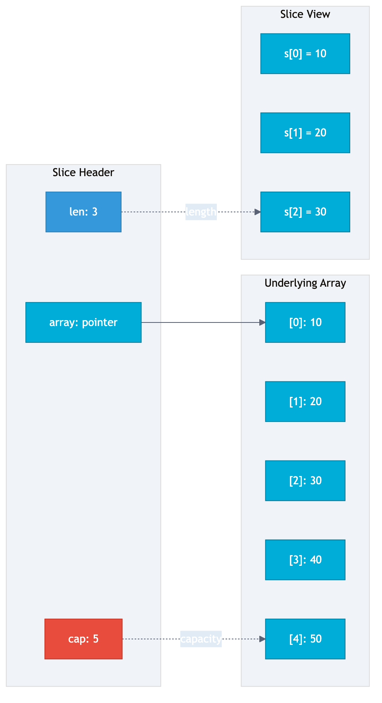
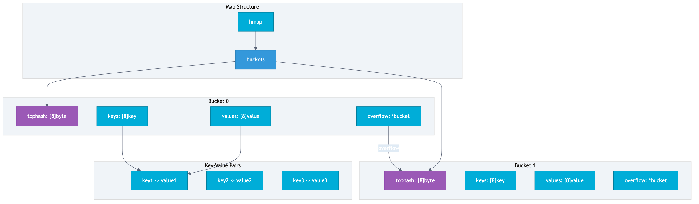
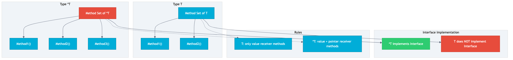

# 第 3 章 Go 核心语法

## 场景

Leader 对你说："写个命令行工具，统计日志文件里的错误数量，输出 Top 10。"

你打开代码，发现需要解决这些问题：

- 变量声明有 `:=` 和 `var` 两种，什么时候用哪个？
- 函数返回值可以命名？`defer` 是什么？
- 结构体没有继承，怎么复用代码？
- Slice 和数组有什么区别？
- Map 为什么并发读写会 panic？

本章系统讲解 Go 核心语法，每个知识点从"解决什么问题"出发。

> 所有代码都在 `03-go-syntax/` 目录下，每个 example 独立可运行。

---

## 3.1 变量与类型系统

> 代码：`example1-variables/main.go`

### 3.1.1 零值设计

Go 的变量声明后自动初始化为零值，不需要手动初始化。

```go
var i int      // 零值: 0
var s string   // 零值: ""
var b bool     // 零值: false
var p *int     // 零值: nil
var slice []int // 零值: nil
var m map[string]int // 零值: nil
```

**为什么这样设计？**

对比其他语言：

| 语言 | 未初始化变量 | 问题 |
|------|-------------|------|
| C | 未定义行为 | 可能崩溃、安全漏洞 |
| Java | null / 0 | NullPointerException |
| Go | 零值 | 安全、可预测 |

**零值的好处：**

1. **消除未初始化变量 bug**：变量声明即可用，不需要检查是否初始化
2. **简化代码**：不需要到处写 `if x == nil`
3. **安全默认值**：零值通常是合理的默认值

### 3.1.2 短变量声明 :=

```go
// 短变量声明，类型自动推断
name := "Alice"
age := 30

// 多变量声明
x, y := 1, 2
```

**`:=` vs `var` 的选择：**

| 场景 | 推荐 | 原因 |
|------|------|------|
| 函数内局部变量 | `:=` | 简洁 |
| 包级变量 | `var` | `:=` 只能用于函数内 |
| 需要显式类型 | `var` | `:=` 无法指定类型 |
| 零值初始化 | `var` | `var x int` 比 `x := 0` 更清晰 |

**作用域陷阱（shadowing）：**

```go
outer := "outer"
{
    outer := "inner" // 新的变量，遮蔽外层
    fmt.Println(outer) // "inner"
}
fmt.Println(outer) // "outer"（未变）
```

### 3.1.3 类型推断

```go
var x = 1          // int（推断）
var x int = 1      // int（显式）
x := 1             // int（推断）
```

**什么时候需要显式类型？**

```go
// 需要特定类型时
var pi float64 = 3.14159265358979  // 需要高精度

// 接口类型
var r io.Reader = os.Stdin
```

### 3.1.4 类型断言与类型开关

```go
var any interface{} = "hello world"

// 方式 1: 直接断言（失败会 panic）
str := any.(string)

// 方式 2: 安全断言（推荐）
if str, ok := any.(string); ok {
    fmt.Println(str)
}

// 方式 3: 类型开关
switch v := any.(type) {
case int:
    fmt.Printf("是 int: %d\n", v)
case string:
    fmt.Printf("是 string: %s\n", v)
default:
    fmt.Printf("未知类型: %T\n", v)
}
```

### 深入：Go 类型系统的设计哲学

**为什么没有类继承？**

继承的问题：
- 紧耦合：子类依赖父类实现
- 脆弱基类：父类修改影响所有子类
- 菱形继承：多重继承的复杂性

Go 的选择：**组合优于继承**

```go
// 不是继承，是组合
type Employee struct {
    BaseModel  // 嵌入
    Name string
}
```

**为什么接口是隐式实现？**

```go
// 不需要 implements 关键字
type Reader interface {
    Read(p []byte) (n int, err error)
}

// 只要实现了 Read 方法，就自动实现了 Reader
type File struct {}
func (f *File) Read(p []byte) (n int, err error) { ... }
// File 自动实现了 Reader
```

好处：
- 解耦：接口定义和使用分离
- 灵活：可以为已有类型添加接口实现
- 简单：没有 implements 关键字

---

## 3.2 控制流

> 代码：`example2-control-flow/main.go`

### 3.2.1 if 初始化语句

```go
// 传统写法
err := doSomething()
if err != nil {
    return err
}

// Go 推荐写法
if err := doSomething(); err != nil {
    return err
}
// err 只在这个 if 作用域内可见
```

**为什么这样设计？**

1. **减少变量泄漏**：err 不会污染外层作用域
2. **代码更紧凑**：声明和使用在同一行
3. **意图更清晰**：err 只用于错误检查

### 3.2.2 for 是唯一循环

Go 没有 `while`，`for` 可以替代所有循环。

```go
// 传统 for
for i := 0; i < 10; i++ { }

// while 替代
for condition { }

// 无限循环
for { }

// range 遍历
for i, v := range slice { }
for k, v := range map { }
for i, ch := range "string" { }
```

**range 的几种用法：**

```go
names := []string{"Alice", "Bob"}

// 获取索引和值
for i, name := range names { }

// 只获取索引
for i := range names { }

// 只获取值
for _, name := range names { }
```

### 3.2.3 switch 不需要 break

```go
switch day {
case 1:
    fmt.Println("Monday")
case 2:
    fmt.Println("Tuesday")
case 3:
    fmt.Println("Wednesday") // 自动 break
}
```

**为什么自动 break？**

- 99% 的 switch 都需要 break
- 忘记 break 是常见 bug
- 自动 break 更安全

**需要继续执行？用 `fallthrough`：**

```go
switch day {
case 3:
    fmt.Println("Wednesday")
    fallthrough // 强制执行下一个 case
case 4:
    fmt.Println("Thursday")
}
```

**类型开关：**

```go
switch v := any.(type) {
case int:
    fmt.Printf("int: %d\n", v)
case string:
    fmt.Printf("string: %s\n", v)
}
```

### 深入：Go 控制流的设计哲学

**为什么没有三元运算符？**

```go
// 其他语言
x := condition ? a : b

// Go：用 if-else
x := a
if !condition {
    x = b
}
```

Go 的设计者认为：
- 三元运算符容易嵌套，降低可读性
- if-else 更清晰
- Go 追求简单、一致

---

## 3.3 函数

> 代码：`example3-functions/main.go`

### 3.3.1 多返回值

```go
func divide(a, b float64) (float64, error) {
    if b == 0 {
        return 0, fmt.Errorf("division by zero")
    }
    return a / b, nil
}

result, err := divide(10, 3)
if err != nil {
    return err
}
```

**为什么不用异常？**

| 方式 | 优点 | 缺点 |
|------|------|------|
| 异常 | 代码简洁 | 控制流不清晰、性能差 |
| 多返回值 | 显式处理、性能好 | 代码稍长 |

Go 的选择：**显式错误处理**

```go
// 错误处理是一等公民
if err != nil {
    // 必须处理错误
}
```

**命名返回值：**

```go
func divide(a, b float64) (result float64, err error) {
    if b == 0 {
        err = fmt.Errorf("division by zero")
        return // 裸 return，返回命名变量
    }
    result = a / b
    return
}
```

使用场景：
- 返回值含义不明确时
- defer 需要修改返回值时

### 3.3.2 defer

defer 在函数返回时执行（LIFO 顺序）。

```go
func demo() {
    fmt.Println("1")
    defer fmt.Println("2")
    defer fmt.Println("3")
    fmt.Println("4")
}
// 输出: 1, 4, 3, 2
```

**使用场景：**

```go
// 1. 资源清理
file, _ := os.Open("file.txt")
defer file.Close()

// 2. 锁释放
mu.Lock()
defer mu.Unlock()

// 3. panic 恢复
defer func() {
    if r := recover(); r != nil {
        log.Printf("recovered: %v", r)
    }
}()
```

**defer 的陷阱：**

```go
// 陷阱 1：参数预计算
i := 0
defer fmt.Println(i) // 输出 0，不是 100
i = 100

// 陷阱 2：循环中的 defer
for _, f := range files {
    defer f.Close() // 所有 Close 在函数结束时执行
}
// 可能导致资源耗尽
```

### 3.3.3 闭包

```go
func counter() func() int {
    count := 0
    return func() int {
        count++
        return count
    }
}

c := counter()
fmt.Println(c()) // 1
fmt.Println(c()) // 2
fmt.Println(c()) // 3
```

**闭包陷阱：循环变量**

```go
// Go 1.22 之前：输出 3 3 3
// Go 1.22 之后：输出 0 1 2
for i := 0; i < 3; i++ {
    go func() {
        fmt.Println(i)
    }()
}
```

Go 1.22 修复了这个问题，循环变量每次迭代都是新的。

---

## 3.4 结构体与方法

> 代码：`example4-struct/main.go`

### 3.4.1 结构体定义

```go
type User struct {
    ID    int    `json:"id"`    // 字段标签
    Name  string `json:"name"`
    Email string `json:"email"`
}

// 创建方式
u1 := User{ID: 1, Name: "Alice"}  // 推荐：字段名初始化
u2 := User{1, "Alice", ""}         // 不推荐：顺序初始化
u3 := User{}                        // 零值
u4 := &User{ID: 4}                  // 指针
```

**字段标签（struct tag）：**

```go
type User struct {
    Name string `json:"name" xml:"name"`
}
```

用于序列化/反序列化。

### 3.4.2 方法

```go
// 值接收者：不会修改原始对象
func (u User) String() string {
    return fmt.Sprintf("User{%s}", u.Name)
}

// 指针接收者：可以修改原始对象
func (u *User) UpdateEmail(email string) {
    u.Email = email
}
```

**值接收者 vs 指针接收者：**

| 场景 | 推荐 | 原因 |
|------|------|------|
| 需要修改接收者 | 指针 | 值接收者修改的是副本 |
| 大结构体 | 指针 | 避免拷贝开销 |
| 并发安全 | 指针 | 配合 sync.Mutex |
| 其他 | 值 | 简单、安全 |

### 3.4.3 组合实现复用

```go
// 嵌入（组合）
type BaseModel struct {
    ID        int
    CreatedAt string
}

type Employee struct {
    BaseModel  // 嵌入
    Name string
}

emp := Employee{
    BaseModel: BaseModel{ID: 1},
    Name: "Alice",
}

// 直接访问嵌入字段
fmt.Println(emp.ID)        // 1
fmt.Println(emp.BaseModel.ID) // 1（等价）
```

### 深入：Go 的 OOP 哲学

**没有类，只有类型：**

```go
type User struct { }  // 不是类，是类型
```

**没有继承，只有组合：**

```go
// 不是继承
type Employee struct {
    Person  // 组合
}
```

**接口隐式实现：**

```go
// 不需要 implements
type Reader interface { Read() }
type File struct {}
func (f *File) Read() {} // 自动实现 Reader
```

---



## 3.5 Slice

> 代码：`example5-slice/main.go`

### 3.5.1 Slice 基础

```go
// 创建方式
s1 := []int{1, 2, 3}           // 字面量
s2 := make([]int, 3)           // len=3, cap=3
s3 := make([]int, 3, 5)        // len=3, cap=5
s4 := arr[1:4]                 // 从数组切割
```

**长度 vs 容量：**

- `len`：当前元素个数
- `cap`：底层数组的容量

### 3.5.2 append 的陷阱

```go
// 扩容策略
// cap < 256: 新容量 = 2 * 旧容量
// cap >= 256: 新容量 = 1.25 * 旧容量 + 192

s := make([]int, 0)
for i := 0; i < 10; i++ {
    s = append(s, i)
    fmt.Printf("len=%d, cap=%d\n", len(s), cap(s))
}
```

**共享底层数组问题：**

```go
a := make([]int, 0, 3)
b := append(a, 1)
c := append(a, 2)

// b 和 c 共享底层数组！
// c 的 append 覆盖了 b 的值
```

**如何避免：**

```go
// 使用 copy
src := []int{1, 2, 3}
dst := make([]int, len(src))
copy(dst, src)
```

### 3.5.3 Slice 的底层结构

```go
type slice struct {
    array unsafe.Pointer // 指向底层数组
    len   int            // 长度
    cap   int            // 容量
}
```

Slice 是一个结构体，包含：
- 指向底层数组的指针
- 长度
- 容量

**传值 vs 传引用：**

Slice 是传值的（拷贝 slice header），但底层数组是共享的。

---



## 3.6 Map

> 代码：`example6-map/main.go`

### 3.6.1 Map 基础

```go
// 创建方式
m1 := map[string]int{"Alice": 30}  // 字面量
m2 := make(map[string]int)          // make
var m3 map[string]int               // nil（不能写入）
```

**基本操作：**

```go
m := map[string]int{"Alice": 30}

// 读取
age := m["Alice"]           // 30
age = m["NotExist"]         // 0（零值）

// 检查 key 是否存在
if age, ok := m["Alice"]; ok {
    fmt.Println(age)
}

// 修改
m["Alice"] = 31

// 删除
delete(m, "Alice")
```

### 3.6.2 Map 的陷阱

**并发读写 panic：**

```go
// 错误：并发读写会 panic
m := make(map[string]int)
go func() { m["key"] = 1 }()  // 写
go func() { _ = m["key"] }()  // 读
// fatal error: concurrent map read and map write
```

**遍历顺序不确定：**

```go
m := map[string]int{"a": 1, "b": 2, "c": 3}
for k, v := range m {
    fmt.Println(k, v) // 顺序随机
}
```

### 3.6.3 sync.Map

```go
var sm sync.Map

sm.Store("key", "value")
v, ok := sm.Load("key")
sm.Delete("key")

// 遍历
sm.Range(func(key, value interface{}) bool {
    return true // 继续遍历
})
```

**什么时候用 sync.Map？**

- 并发读写
- 读多写少
- key 是稳定的

### 深入：Map 的底层结构

Map 底层是哈希表：

```go
type hmap struct {
    buckets    *bmap  // 哈希桶数组
    count      int    // 元素个数
    flags      uint8
    B          uint8  // 对数容量（2^B 个桶）
    // ...
}

type bmap struct {
    tophash  [8]byte   // 哈希高 8 位
    keys     [8]key    // 8 个 key
    values   [8]value  // 8 个 value
    overflow *bmap     // 溢出桶
}
```

**渐进式扩容：**

- 元素过多时触发扩容
- 不是一次性迁移，而是逐步迁移
- 避免长时间停顿

---



## 3.7 指针

> 代码：`example7-pointer/main.go`

### 3.7.1 指针基础

```go
i := 42
p := &i      // p 是指向 i 的指针

fmt.Println(*p) // 42（解引用）
*p = 100        // 修改 i 的值
fmt.Println(i)  // 100
```

### 3.7.2 为什么 Go 保留指针？

**性能：避免大结构体拷贝**

```go
type LargeStruct struct {
    data [1000]int // 8000 字节
}

// 值传递：拷贝 8000 字节
func process(s LargeStruct) { }

// 指针传递：只拷贝 8 字节
func process(s *LargeStruct) { }
```

**共享：多个变量指向同一数据**

```go
data := []int{1, 2, 3}
ref1 := &data
ref2 := &data

(*ref1)[0] = 99
fmt.Println(*ref2) // [99, 2, 3]
```

### 3.7.3 什么时候用指针？

| 场景 | 推荐 | 原因 |
|------|------|------|
| 方法需要修改接收者 | 指针 | 值接收者修改的是副本 |
| 大结构体 | 指针 | 避免拷贝开销 |
| 实现接口 | 看方法集 | *T 的方法集包含 T 的所有方法 |
| 其他 | 值 | 简单、安全 |

---

## 3.8 包与可见性

### 3.8.1 包的组织

```
project/
├── main.go          # package main
├── user/
│   └── user.go      # package user
└── order/
    └── order.go     # package order
```

- 一个目录一个包
- 包名通常和目录名相同

### 3.8.2 可见性规则

```go
package user

// 大写开头 = 导出（公开）
type User struct {
    ID   int    // 导出
    name string // 私有
}

func (u *User) GetName() string { return u.name } // 导出
func (u *User) setName(name string) { u.name = name } // 私有
```

**规则：**

- 大写开头：包外可见
- 小写开头：包内可见

### 3.8.3 init 函数

```go
package user

func init() {
    // 自动执行，用于初始化
    fmt.Println("user package initialized")
}
```

**使用场景：**

- 注册驱动
- 初始化配置
- 注册中间件

**陷阱：**

- 依赖顺序难以控制
- 测试困难
- 慎用

---

## 3.9 实战项目：日志分析工具

> 代码：`log-analyzer/`

### 需求

- 读文件（os.Open + bufio.Scanner）
- 解析日志行（strings.Split）
- 统计错误频率（map）
- 排序输出 Top 10（sort.Slice）

### 代码结构

```
log-analyzer/
├── main.go          # 入口，命令行参数解析
├── analyzer.go      # 分析逻辑
├── model.go         # 数据模型
├── testdata/
│   └── sample.log   # 测试日志
└── analyzer_test.go # 测试
```

### 运行

```bash
cd log-analyzer
go run . -file testdata/sample.log -top 5
```

### 输出

```
========================================
        Error Statistics Report
========================================
Total Errors: 20
----------------------------------------
Top 5 Errors:
  1. ERROR_TIMEOUT                 10
  2. ERROR_CONNECTION              4
  3. ERROR_AUTH                    4
  4. ERROR_VALIDATION              2
  5. ERROR_PERMISSION              1
========================================
```

### 核心代码

**model.go：数据模型**

```go
type LogEntry struct {
    Timestamp string
    Level     string
    Message   string
}

func ParseLogLine(line string) *LogEntry {
    // 解析日志行
}
```

**analyzer.go：分析逻辑**

```go
type Analyzer struct {
    counters map[string]int
    mu       sync.Mutex
}

func (a *Analyzer) AnalyzeLine(line string) {
    entry := ParseLogLine(line)
    if entry.Level != "ERROR" {
        return
    }
    errorType := extractErrorType(entry.Message)
    a.counters[errorType]++
}

func (a *Analyzer) TopN(n int) []ErrorStats {
    // 排序并返回 Top N
}
```

**main.go：入口**

```go
func main() {
    filePath := flag.String("file", "", "日志文件路径")
    topN := flag.Int("top", 10, "显示前 N 个错误")
    flag.Parse()

    file, _ := os.Open(*filePath)
    defer file.Close()

    analyzer := NewAnalyzer()
    analyzer.AnalyzeReader(file)
    analyzer.PrintReport(*topN)
}
```

---

## 3.10 最佳实践

1. **零值优先**：避免不必要的初始化
2. **短变量声明优先**：减少冗余
3. **指针接收者 vs 值接收者**：需要修改或大结构体用指针
4. **Slice 预分配容量**：`make([]T, 0, n)`
5. **Map 并发安全**：并发场景用 sync.Map 或加锁

---

## 3.11 排障

### Slice 共享底层数组

```go
a := []int{1, 2, 3}
b := a[1:3]
a[1] = 99
fmt.Println(b) // [99, 3]（b 也变了）
```

解决：使用 copy

### Map 并发读写 panic

```go
// fatal error: concurrent map read and map write
```

解决：使用 sync.Map 或 sync.RWMutex

### defer 参数预计算

```go
i := 0
defer fmt.Println(i) // 输出 0
i = 100
```

解决：使用闭包

```go
defer func() { fmt.Println(i) }() // 输出 100
```

### 闭包捕获循环变量

```go
// Go 1.22 之前：输出 3 3 3
for i := 0; i < 3; i++ {
    defer fmt.Println(i)
}
```

解决：Go 1.22 已修复，或手动传参

---

## 3.12 面试题

**Q1：`:=` 和 `var` 的区别？**

A：
- `:=` 只能用于函数内，自动推断类型
- `var` 可用于包级变量，可指定类型
- `var` 可以零值初始化

**Q2：defer 的执行顺序？**

A：LIFO（后进先出），类似栈

**Q3：Slice 的底层结构？**

A：slice header（pointer, len, cap）+ 底层数组

**Q4：Map 为什么并发不安全？**

A：哈希表并发读写会导致数据不一致，Go 选择 panic 而不是静默错误

**Q5：值接收者和指针接收者的区别？**

A：
- 值接收者：修改的是副本，不影响原始对象
- 指针接收者：修改原始对象

---

## 3.13 小结

本章系统讲解了 Go 核心语法：

1. **变量与类型**：零值设计、短变量声明、类型断言
2. **控制流**：if 初始化语句、for 循环、switch
3. **函数**：多返回值、defer、闭包
4. **结构体与方法**：组合、值/指针接收者
5. **Slice**：底层结构、append 陷阱
6. **Map**：并发安全、底层结构
7. **指针**：使用场景
8. **包与可见性**：大小写规则

下一章我们将学习第一个 HTTP 服务，把这些语法应用到实际项目中。
