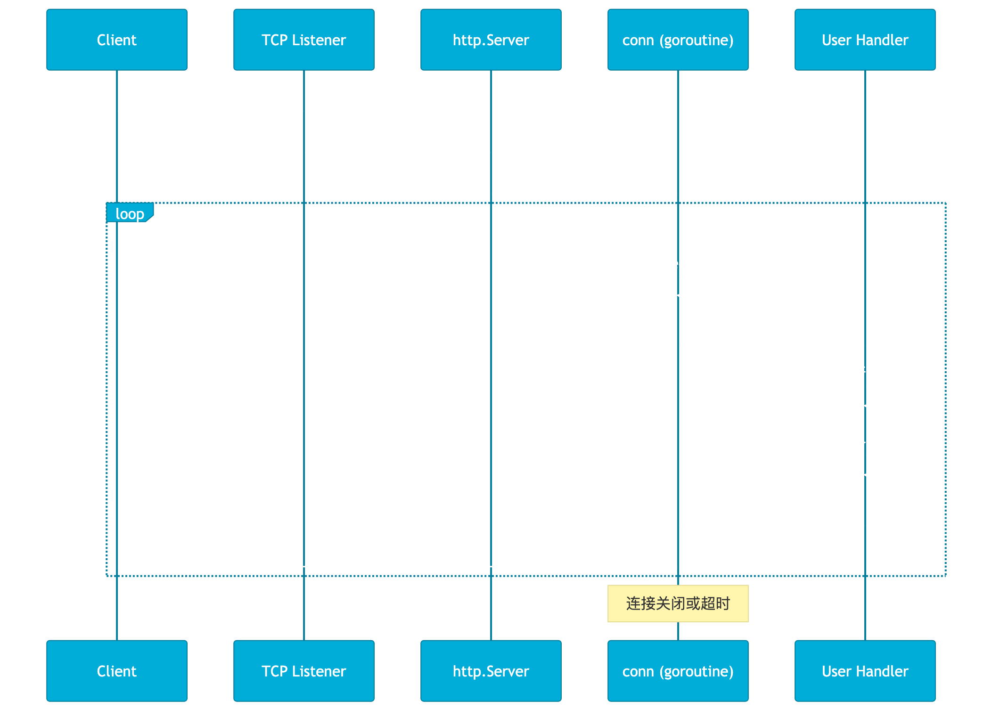
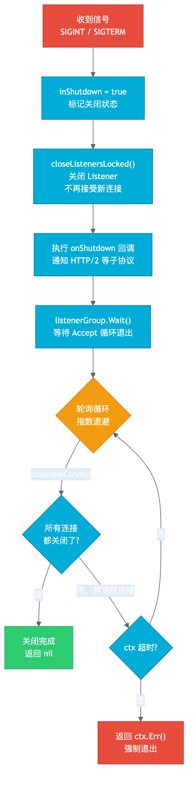

# 第 4 章 第一个 HTTP 服务

## 场景

前面我们已经完成了 Go 开发环境和语法基础，现在用户管理服务要开始对外提供接口。

Leader 对你说：

> “先不用 Gin，也不用数据库。用标准库做一版用户管理 API，能创建用户、查询用户、更新用户、删除用户，明天给前端联调。”

你打开 Go，发现 `net/http` 标准库只有 3 个核心概念：

- **Handler** — 处理请求
- **ServeMux** — 路由分发
- **ResponseWriter** — 写响应

就这些。没有 Controller、没有 Service 注解、没有 XML 配置。

你可能会问：**为什么 Go 的 HTTP 标准库这么简单？这 3 个概念背后藏着什么设计哲学？**

本章不只教你"怎么写"，更要讲清楚"为什么这样设计"。最后我们会把这些知识落到第一阶段项目的雏形：**用户管理 API**。

1. **怎么做** — 代码示例
2. **为什么这样做** — 设计决策
3. **源码怎么实现的** — 底层原理

> 所有代码都在 `04-first-http-server/` 目录下，每个 example 独立可运行。

---

## 4.1 最简 HTTP 服务

> 代码：`example1-hello/main.go`

```go
package main

import (
    "fmt"
    "net/http"
)

func helloHandler(w http.ResponseWriter, r *http.Request) {
    fmt.Fprintf(w, "Hello, Go HTTP Server!")
}

func main() {
    http.HandleFunc("/hello", helloHandler)
    http.ListenAndServe(":8080", nil)
}
```

运行：

```bash
cd example1-hello
go run main.go

# 另一个终端
curl http://localhost:8080/hello
# Hello, Go HTTP Server!
```

5 行代码，一个 HTTP 服务就跑起来了。但你知道背后发生了什么吗？

### 深入：ListenAndServe 源码

调用 `http.ListenAndServe(":8080", nil)` 后，内部发生了什么？



```
ListenAndServe(":8080", nil)
  │
  ├─ net.Listen("tcp", ":8080")     // 1. 创建 TCP 监听
  │
  └─ Serve(listener)                 // 2. 进入服务循环
       │
       └─ for {                       // 3. 无限循环
            conn := listener.Accept() //    接受新连接
            go c.serve(conn)          //    每个连接启动一个 goroutine
          }
```

**关键源码（简化版）：**

```go
// server.go
func (s *Server) Serve(l net.Listener) error {
    for {
        rw, err := l.Accept()      // 阻塞等待新连接
        if err != nil {
            // 临时错误则指数退避重试（5ms → 1s 封顶）
            if ne, ok := err.(net.Error); ok && ne.Temporary() {
                time.Sleep(sleepDuration)
                continue
            }
            return err
        }
        c := s.newConn(rw)         // 包装为 conn 结构体
        go c.serve(connCtx)        // 每个连接一个 goroutine！
    }
}
```

### 为什么每个连接一个 goroutine？

这是 Go HTTP 服务器的核心设计决策。对比其他方案：

| 模型 | 代表 | 并发能力 | 内存/连接 | 编程复杂度 |
|------|------|----------|-----------|------------|
| goroutine per conn | Go net/http | ~10 万 | ~2-8KB | 低 |
| thread per conn | Apache prefork | ~1000 | ~1-8MB | 中 |
| event loop | Node.js / Nginx | ~100 万 | ~0 | 高 |

**Go 的选择理由：**

1. **goroutine 极其轻量**：初始栈只有 2KB，可动态增长到 1GB。10 万连接只需 200MB 内存。
2. **用户态调度**：goroutine 切换 ~200ns，线程切换 ~1-10μs，快 50 倍。
3. **阻塞不浪费**：goroutine 阻塞在 I/O 时，调度器自动切换，零 CPU 浪费。
4. **编程简单**：同步写法，不需要 callback、async/await、状态机。

> **设计哲学：** 在编程简单性和并发能力之间取得最佳平衡。

### 指数退避重试

注意源码中的 `Temporary()` 错误处理。Accept 可能遇到临时错误（如文件描述符耗尽），直接退出会导致服务不可用。退避策略从 5ms 起步，最高 1s，避免 CPU 空转。

```go
// 指数退避：5ms → 10ms → 20ms → ... → 最高 1s
sleepDuration := 5 * time.Millisecond
if ne.Temporary() {
    time.Sleep(sleepDuration)
    sleepDuration *= 2
    if sleepDuration > maxBackoff {
        sleepDuration = maxBackoff
    }
}
```

---

## 4.2 路由与请求方法

> 代码：`example2-routes/main.go`

```go
mux := http.NewServeMux()

// Go 1.22+ 新语法：Method + Path + 通配符
mux.HandleFunc("GET /users/{id}", getUserHandler)
mux.HandleFunc("POST /users", createUserHandler)
mux.HandleFunc("PUT /users/{id}", updateUserHandler)
mux.HandleFunc("DELETE /users/{id}", deleteUserHandler)

// 多段通配符
mux.HandleFunc("GET /files/{path...}", getFileHandler)
```

运行：

```bash
cd example2-routes
go run main.go

# 测试
curl http://localhost:8080/users/123
# Getting user: 123

curl -X POST http://localhost:8080/users
# Creating user

curl http://localhost:8080/files/docs/readme.md
# Getting file: docs/readme.md
```

### Go 1.22 路由升级

Go 1.22 之前，ServeMux 功能很弱：
- 不支持 HTTP Method 区分
- 不支持路径参数
- 只能做前缀匹配

Go 1.22 重写了路由，支持：

| 模式 | 示例 | 说明 |
|------|------|------|
| 精确路径 | `/users/profile` | 只匹配该路径 |
| 子树匹配 | `/users/` | 匹配 `/users/` 及其下所有路径 |
| 单段通配符 | `/users/{id}` | 匹配 `/users/123`，`id=123` |
| 多段通配符 | `/files/{path...}` | 匹配 `/files/a/b/c` |
| 带 Method | `GET /users/{id}` | 只匹配 GET 请求 |
| 带 Host | `api.example.com/users` | 只匹配特定 Host |

### 深入：ServeMux 路由匹配源码

**为什么 Go 1.22 要重写路由？**

旧实现（Go 1.21 及之前）使用 `[]muxEntry` 切片线性扫描，O(n) 复杂度：

```go
// 旧实现（Go 1.21）
type ServeMux struct {
    mu    sync.RWMutex
    m     map[string]muxEntry   // 精确匹配
    es    []muxEntry            // 前缀匹配，需要线性扫描
}

func (mux *ServeMux) match(path string) (h Handler, pattern string) {
    // 1. 先查精确匹配 O(1)
    if e, ok := mux.m[path]; ok {
        return e.h, e.pattern
    }
    // 2. 再线性扫描前缀匹配 O(n)
    for _, e := range mux.es {
        if strings.HasPrefix(path, e.pattern) {
            return e.h, e.pattern
        }
    }
    return nil, ""
}
```

新实现使用**决策树**，O(k) 复杂度（k = 路径段数）：

```go
// 新实现（Go 1.22+）
type routingNode struct {
    pattern    *pattern
    handler    Handler
    children   map[string]*routingNode  // 子节点
    multiChild *routingNode             // {x...} 多段通配
    emptyChild *routingNode             // {x} 单段通配
}

func (n *routingNode) matchPath(path string) (*routingNode, []string) {
    seg, rest := firstSegment(path)

    // 优先级 1：字面量匹配（最具体）
    if child, ok := n.children[seg]; ok {
        if result, matches := child.matchPath(rest); result != nil {
            return result, matches
        }
    }
    // 优先级 2：单段通配符 {x}
    if n.emptyChild != nil {
        if result, matches := n.emptyChild.matchPath(rest); result != nil {
            return result, append(matches, seg)
        }
    }
    // 优先级 3：多段通配符 {x...}
    if n.multiChild != nil {
        return n.multiChild, []string{path}
    }
    return nil, nil
}
```

**为什么这样设计？**

1. **字面量 > 单通配符 > 多通配符**：直觉且安全。`/users/admin` 永远优先于 `/users/{id}`，不需要手动排序路由。
2. **树匹配 O(k)**：与路由总数无关，只和路径段数有关（通常 < 10）。
3. **冲突检测在注册时**：注册时就检测冲突并 panic，而不是运行时产生不可预期行为。

### DefaultServeMux 的利弊

```go
// 全局路由（简单但有坑）
http.HandleFunc("/hello", helloHandler)
http.ListenAndServe(":8080", nil)  // nil = DefaultServeMux

// 独立路由（生产环境推荐）
mux := http.NewServeMux()
mux.HandleFunc("/hello", helloHandler)
http.ListenAndServe(":8080", mux)
```

**DefaultServeMux 的问题：**

1. **全局状态 = 隐式耦合**：依赖的包可能在 `init()` 中注册路由，导致冲突
2. **无法多实例**：同一进程无法运行两个独立 HTTP 服务
3. **安全隐患**：如果业务服务使用 `DefaultServeMux`，`import _ "net/http/pprof"` 会把 `/debug/pprof/` 注册到同一个全局路由上，容易被误暴露

> **最佳实践：** 生产环境永远用独立 ServeMux。

---

## 4.3 JSON API 开发

> 代码：`example3-json-api/main.go`

```go
type User struct {
    ID    int    `json:"id"`
    Name  string `json:"name"`
    Email string `json:"email"`
}

type Response struct {
    Code    int         `json:"code"`
    Message string      `json:"message"`
    Data    interface{} `json:"data,omitempty"`
}

func writeJSON(w http.ResponseWriter, status int, resp Response) {
    w.Header().Set("Content-Type", "application/json")
    w.WriteHeader(status)
    json.NewEncoder(w).Encode(resp)
}

func createUserHandler(w http.ResponseWriter, r *http.Request) {
    var input struct {
        Name  string `json:"name"`
        Email string `json:"email"`
    }

    if err := json.NewDecoder(r.Body).Decode(&input); err != nil {
        writeJSON(w, http.StatusBadRequest, Response{
            Code: 400, Message: "invalid request body",
        })
        return
    }

    // ... 业务逻辑 ...

    writeJSON(w, http.StatusCreated, Response{
        Code: 0, Message: "user created", Data: user,
    })
}
```

运行：

```bash
cd example3-json-api
go run main.go

# 创建用户
curl -X POST http://localhost:8080/users \
  -H "Content-Type: application/json" \
  -d '{"name":"Alice","email":"alice@example.com"}'
# {"code":0,"message":"user created","data":{"id":1,"name":"Alice","email":"alice@example.com"}}

# 查询用户
curl http://localhost:8080/users/1
# {"code":0,"message":"success","data":{"id":1,"name":"Alice","email":"alice@example.com"}}
```

### 深入：ResponseWriter 为什么是接口？

注意 Handler 的参数：

```go
type Handler interface {
    ServeHTTP(ResponseWriter, *Request)
}
```

- **Request 是结构体**：HTTP 请求有固定语义（Method、URL、Header），所有实现共享
- **ResponseWriter 是接口**：因为 HTTP/1.x 和 HTTP/2 的实现完全不同

**为什么 ResponseWriter 必须是接口？**

1. **HTTP/1.x vs HTTP/2 实现不同**
   - HTTP/1.x：支持 `Hijacker`（WebSocket 需要接管底层连接）
   - HTTP/2：不支持 `Hijacker`（多路复用，没有独立连接可接管）

2. **可选能力通过类型断言暴露**
   ```go
   // 不是所有 ResponseWriter 都支持 Flush
   if flusher, ok := w.(http.Flusher); ok {
       flusher.Flush()  // SSE（Server-Sent Events）需要
   }

   // 不是所有 ResponseWriter 都支持 Hijack
   if hijacker, ok := w.(http.Hijacker); ok {
       conn, bufrw, _ := hijacker.Hijack()  // WebSocket 需要
   }
   ```

3. **中间件可以包装 ResponseWriter**
   ```go
   type responseRecorder struct {
       http.ResponseWriter           // 嵌入原始 ResponseWriter
       statusCode int                // 扩展：记录状态码
       body       *bytes.Buffer      // 扩展：缓存响应体
   }
   ```

4. **内部实现对外隐藏**
   ```go
   // server.go - 用户永远不直接接触这个结构体
   type response struct {
       conn          *conn
       req           *Request
       wroteHeader   bool
       cw            chunkWriter
       handlerHeader Header
       // ... 20+ 内部字段
   }
   ```

> **设计哲学：** 接口提供多态和可选能力，结构体提供固定语义和零成本访问。

---

## 4.4 中间件机制

> 代码：`example4-middleware/main.go`

```go
// 日志中间件
func loggingMiddleware(next http.Handler) http.Handler {
    return http.HandlerFunc(func(w http.ResponseWriter, r *http.Request) {
        start := time.Now()
        next.ServeHTTP(w, r)
        log.Printf("[%s] %s %s took %v", r.RemoteAddr, r.Method, r.URL.Path, time.Since(start))
    })
}

// 鉴权中间件
func authMiddleware(next http.Handler) http.Handler {
    return http.HandlerFunc(func(w http.ResponseWriter, r *http.Request) {
        token := r.Header.Get("Authorization")
        if token != "Bearer secret-token" {
            w.WriteHeader(http.StatusUnauthorized)
            return
        }
        next.ServeHTTP(w, r)
    })
}

// 组合中间件
handler := loggingMiddleware(authMiddleware(myHandler))
```

运行：

```bash
cd example4-middleware
go run main.go

# 公开接口（无需鉴权）
curl http://localhost:8080/public
# public endpoint

# 受保护接口（需要 Token）
curl http://localhost:8080/protected
# {"error":"missing authorization token"}

curl -H "Authorization: Bearer secret-token" http://localhost:8080/protected
# {"message":"access granted","userID":"user-123"}
```

### 深入：中间件的源码本质

中间件在 Go 源码层面**没有任何特殊支持** — 这恰恰是设计的精妙。

**本质：Handler 包装 Handler，嵌套函数调用。**

```go
// Handler 接口
type Handler interface {
    ServeHTTP(ResponseWriter, *Request)
}

// HandlerFunc 适配器：让函数也能实现 Handler
type HandlerFunc func(ResponseWriter, *Request)

func (f HandlerFunc) ServeHTTP(w ResponseWriter, r *http.Request) {
    f(w, r)
}
```

**中间件链的调用顺序：**

```go
// 注册：logging(auth(handler))
// 调用链：
//   logging.ServeHTTP
//     → auth.ServeHTTP
//       → handler.ServeHTTP
```

**为什么 Handler 接口只定义一个方法？**

1. **最小接口原则**：一个方法的接口意味着最大灵活性。任何类型只要有一个 `ServeHTTP` 方法就能成为 Handler。

2. **函数即一等公民**：`HandlerFunc` 适配器让函数和方法在接口层面统一。

3. **组合的无限可能**：单方法接口天然支持装饰器模式（中间件）。

**对比其他语言：**

| 语言 | 接口/模型 | 方法数 | 灵活性 |
|------|-----------|--------|--------|
| Go | Handler 接口 | 1 | 极高 |
| Java | Servlet 接口 | 4（init/service/destroy/getInfo） | 低 |
| Node.js | 函数式 | 0（无类型约束） | 高但无类型安全 |

**为什么 Go 不用管道模型（如 Koa.js 洋葱模型）？**

```
Koa.js 洋葱模型：
middleware1 → middleware2 → handler → middleware2 → middleware1

Go 嵌套模型：
middleware1 → middleware2 → handler
（每层自己决定是否调用 next，自己处理返回）
```

Go 的嵌套模型更简单：
- 没有"上游/下游"的概念混淆
- 每个中间件完全控制是否调用 `next`
- 没有框架级别的管道管理器开销
- 错误处理更直观（每层自己 recover）

> **设计哲学：** 简单即正义。不需要框架魔法，组合就够了。

---

## 4.5 优雅关闭

> 代码：`example5-graceful/main.go`

```go
srv := &http.Server{
    Addr:         ":8080",
    Handler:      mux,
    ReadTimeout:  15 * time.Second,
    WriteTimeout: 15 * time.Second,
    IdleTimeout:  60 * time.Second,
}

go func() {
    srv.ListenAndServe()
}()

// 监听系统信号
quit := make(chan os.Signal, 1)
signal.Notify(quit, syscall.SIGINT, syscall.SIGTERM)
<-quit

// 优雅关闭（带超时）
ctx, cancel := context.WithTimeout(context.Background(), 10*time.Second)
defer cancel()
srv.Shutdown(ctx)
```

运行：

```bash
cd example5-graceful
go run main.go

# 终端 1：发起慢请求
curl http://localhost:8080/slow

# 终端 2：发送关闭信号
# 按 Ctrl+C

# 观察：慢请求会完成，新请求会被拒绝
```

### 深入：Shutdown 源码



```go
func (s *Server) Shutdown(ctx context.Context) error {
    s.inShutdown.Store(true)       // 1. 标记正在关闭

    s.mu.Lock()
    s.closeListenersLocked()       // 2. 关闭 Listener，不再接受新连接
    for _, f := range s.onShutdown {
        go f()                     // 3. 执行回调（HTTP/2 等）
    }
    s.mu.Unlock()

    // 4. 指数退避轮询，关闭空闲连接
    for {
        if s.closeIdleConns() {    // 关闭所有空闲连接
            return nil             // 没有活跃连接了，完成
        }
        select {
        case <-ctx.Done():
            return ctx.Err()       // 超时！强制退出
        case <-timer.C:
            // 继续轮询
        }
    }
}
```

**关键设计：**

1. **不强制关闭活跃连接**：正在处理请求的连接可以继续完成，这是"优雅"的核心。

2. **指数退避轮询**：避免忙等消耗 CPU，初始 1ms 保证快速关闭，最大间隔避免长时间等待。

3. **StateNew 5 秒规则**：新连接如果 5 秒内没有发送请求，视为空闲关闭。防止慢速连接阻塞关闭。

4. **Context 超时**：Kubernetes 的 `terminationGracePeriodSeconds` 就是通过这个 context 实现的。

> **为什么不用 Close？** `Close()` 立即关闭所有连接，正在处理的请求会丢失。`Shutdown()` 等待活跃请求完成。

---

## 4.6 实战项目：用户管理 API

> 代码：`example6-user-api/`

这是第一阶段项目的第一版：只使用 `net/http` 和内存存储，不引入 Gin、MySQL、Redis。这样做的目的不是“拒绝框架”，而是先看清 HTTP 服务最小闭环：路由、请求解析、响应编码、中间件、优雅关闭和测试。

```
example6-user-api/
├── main.go          # 入口：组装各层、启动服务
├── model.go         # 数据模型
├── store.go         # 数据访问层（接口 + 内存实现）
├── handler.go       # HTTP 处理器层
├── middleware.go     # 中间件
├── handler_test.go  # Handler 测试
└── middleware_test.go # 中间件测试
```

### 分层架构

```
┌─────────────────────────────────────────┐
│  HTTP 层（handler.go）                   │
│  - 解析请求（JSON → struct）             │
│  - 构造响应（struct → JSON）             │
│  - 状态码设置                            │
├─────────────────────────────────────────┤
│  业务层（store.go 接口）                 │
│  - 业务逻辑                              │
│  - 不关心 HTTP                           │
├─────────────────────────────────────────┤
│  数据层（MemoryStore 实现）              │
│  - 数据存储                              │
│  - 可替换（MySQL、Redis 等）             │
└─────────────────────────────────────────┘
```

**为什么分层？**

1. **handler 只负责 HTTP 协议**：解析请求、构造响应、设置状态码
2. **store 只负责数据访问**：不关心 HTTP，可以独立测试
3. **可替换实现**：`MemoryStore` → `MySQLStore` → `RedisStore`，接口不变
4. **单元测试脱离 HTTP**：测试 store 不需要启动 HTTP 服务

运行：

```bash
cd example6-user-api
go run .

# 健康检查
curl http://localhost:8080/health

# 创建用户
curl -X POST http://localhost:8080/api/users \
  -H "Content-Type: application/json" \
  -d '{"name":"Alice","email":"alice@example.com"}'

# 查询所有用户
curl http://localhost:8080/api/users

# 查询单个用户
curl http://localhost:8080/api/users/1

# 更新用户
curl -X PUT http://localhost:8080/api/users/1 \
  -H "Content-Type: application/json" \
  -d '{"name":"Alice Updated"}'

# 删除用户
curl -X DELETE http://localhost:8080/api/users/1

# 运行测试
go test -v ./...
```

### 中间件顺序

```go
handler := ChainMiddleware(mux,
    recoveryMiddleware,    // 1. 最外层：捕获 panic
    loggingMiddleware,     // 2. 记录日志
    requestIDMiddleware,   // 3. 注入 RequestID
    corsMiddleware,        // 4. CORS 处理
)
```

**顺序很重要：**


1. **Recovery 最外层**：确保任何 panic 都能被捕获
2. **Logging 第二层**：记录所有请求，包括被后续中间件拒绝的
3. **RequestID 第三层**：后续中间件和 Handler 都能使用
4. **CORS 最内层**：只处理实际的业务请求

---

## 4.7 源码设计哲学总结

| 设计决策 | 核心原则 | 性能影响 |
|----------|----------|----------|
| Handler 只有一方法 | 最小接口 + 组合 | 接口调用开销极小，通常不是 HTTP 服务瓶颈 |
| ResponseWriter 是接口 | 多态 + 可选能力 | 一次间接跳转 |
| goroutine per conn | CSP 并发模型 | 初始栈约 2KB，阻塞 I/O 由运行时调度 |
| 决策树路由 | O(k) 匹配 | 与路由总数无关 |
| 中间件无特殊支持 | 简单即正义 | N 次接口调用 |
| DefaultServeMux | 零配置 | 无运行时开销 |
| Shutdown 轮询 | 不中断活跃请求 | 依赖超时控制，避免无限等待 |

---

## 4.8 最佳实践

1. **生产环境用独立 ServeMux**
   ```go
   mux := http.NewServeMux()
   srv := &http.Server{Handler: mux}
   ```

2. **中间件顺序：Recovery → 日志 → 鉴权 → 业务**

3. **优雅关闭必须配合 Context 超时**
   ```go
   ctx, cancel := context.WithTimeout(context.Background(), 10*time.Second)
   srv.Shutdown(ctx)
   ```

4. **生产环境谨慎暴露 pprof**
   ```go
   import "net/http/pprof"

   // 推荐：把 pprof 放到独立管理端口，并限制内网访问或加鉴权。
   go func() {
       mux := http.NewServeMux()
       mux.HandleFunc("/debug/pprof/", pprof.Index)
       mux.HandleFunc("/debug/pprof/cmdline", pprof.Cmdline)
       mux.HandleFunc("/debug/pprof/profile", pprof.Profile)
       mux.HandleFunc("/debug/pprof/symbol", pprof.Symbol)
       mux.HandleFunc("/debug/pprof/trace", pprof.Trace)
       _ = http.ListenAndServe("127.0.0.1:6060", mux)
   }()
   ```
   `net/http/pprof` 不是不能上生产，而是不能无保护地挂在公网业务端口上。线上排查 CPU、内存、goroutine 泄漏时，受控的 pprof 入口非常有价值。

5. **设置超时防止慢连接攻击**
   ```go
   srv := &http.Server{
       ReadHeaderTimeout: 5 * time.Second,
       ReadTimeout:       15 * time.Second,
       WriteTimeout:      15 * time.Second,
       IdleTimeout:       60 * time.Second,
   }
   ```

---

## 4.9 排障

### 端口被占用

```bash
# 查找占用端口的进程
lsof -i :8080

# 先确认进程归属，再优先发送 SIGTERM，让服务走优雅关闭
kill -TERM <PID>

# 如果进程无响应，确认没有正在处理的重要请求后再使用 SIGKILL
kill -KILL <PID>
```

### 请求超时但连接不释放

原因：没有设置 `ReadHeaderTimeout` / `ReadTimeout` / `WriteTimeout`

解决：
```go
srv := &http.Server{
    ReadHeaderTimeout: 5 * time.Second,
    ReadTimeout:       15 * time.Second,
    WriteTimeout:      15 * time.Second,
}
```

### goroutine 泄漏

原因：Handler 中启动了 goroutine 但没管理生命周期

```go
// 错误：goroutine 泄漏
func handler(w http.ResponseWriter, r *http.Request) {
    go func() {
        // 这个 goroutine 永远不会退出
        for {
            doSomething()
        }
    }()
}

// 正确：使用 context 控制生命周期
func handler(w http.ResponseWriter, r *http.Request) {
    ctx := r.Context()
    go func() {
        for {
            select {
            case <-ctx.Done():
                return
            default:
                doSomething()
            }
        }
    }()
}
```

### Shutdown 卡住

原因：有连接一直没关闭（如 WebSocket、长轮询）

解决：
```go
// 设置超时
ctx, cancel := context.WithTimeout(context.Background(), 10*time.Second)
defer cancel()

if err := srv.Shutdown(ctx); err != nil {
    // 超时后强制关闭
    srv.Close()
}
```

---

## 4.10 面试题

**Q1：Handler 接口为什么只定义一个方法？**

A：最小接口原则。一个方法意味着最大灵活性：
- 任何类型只要有 `ServeHTTP` 就能成为 Handler
- `HandlerFunc` 适配器让函数也能实现接口
- 单方法接口天然支持装饰器模式（中间件）

**Q2：goroutine per connection 模型在什么场景下会出问题？**

A：
- 连接数极高（>100 万）时，goroutine 栈的 GC 扫描会成为瓶颈
- 每个连接 2-8KB，100 万连接需要 2-8GB 内存
- 解决方案：使用连接池、限制最大连接数、或使用 event-driven 模型

**Q3：DefaultServeMux 为什么不适合生产环境？**

A：
- 全局状态 = 隐式耦合，依赖包的 `init()` 可能注册冲突路由
- 无法多实例，同一进程无法运行两个独立 HTTP 服务
- 安全隐患，使用 `DefaultServeMux` 时，`import _ "net/http/pprof"` 会把调试接口注册到全局路由

**Q4：Shutdown 和 Close 的区别？**

A：
- `Close()`：立即关闭所有连接，正在处理的请求会丢失
- `Shutdown()`：优雅关闭，等待活跃请求完成，只关闭空闲连接

**Q5：ResponseWriter 为什么是接口而不是结构体？**

A：
- HTTP/1.x 和 HTTP/2 实现完全不同
- 可选能力通过类型断言暴露（Flusher、Hijacker）
- 中间件可以包装 ResponseWriter（嵌入 + 扩展）

---

## 4.11 小结

本章从 5 行代码出发，深入讲解了 Go HTTP 服务器的设计哲学：

1. **最简服务**：`ListenAndServe` 背后是 goroutine per connection 模型
2. **路由匹配**：Go 1.22 决策树路由，O(k) 复杂度
3. **JSON API**：ResponseWriter 是接口，支持多态和可选能力
4. **中间件**：Handler 包装 Handler，组合无限可能
5. **优雅关闭**：Shutdown 等待活跃请求，不强制关闭
6. **分层架构**：handler / store 分离，可测试、可替换

> **核心思想：** Go 的 HTTP 标准库追求"简单但不简陋"。3 个核心概念（Handler、ServeMux、ResponseWriter）通过组合可以构建任意复杂的 HTTP 服务。

下一章我们会在这版用户管理 API 上继续补强错误处理：让参数错误、用户不存在、内部错误和 panic 都有清晰的错误码、HTTP 状态码和日志上下文。
