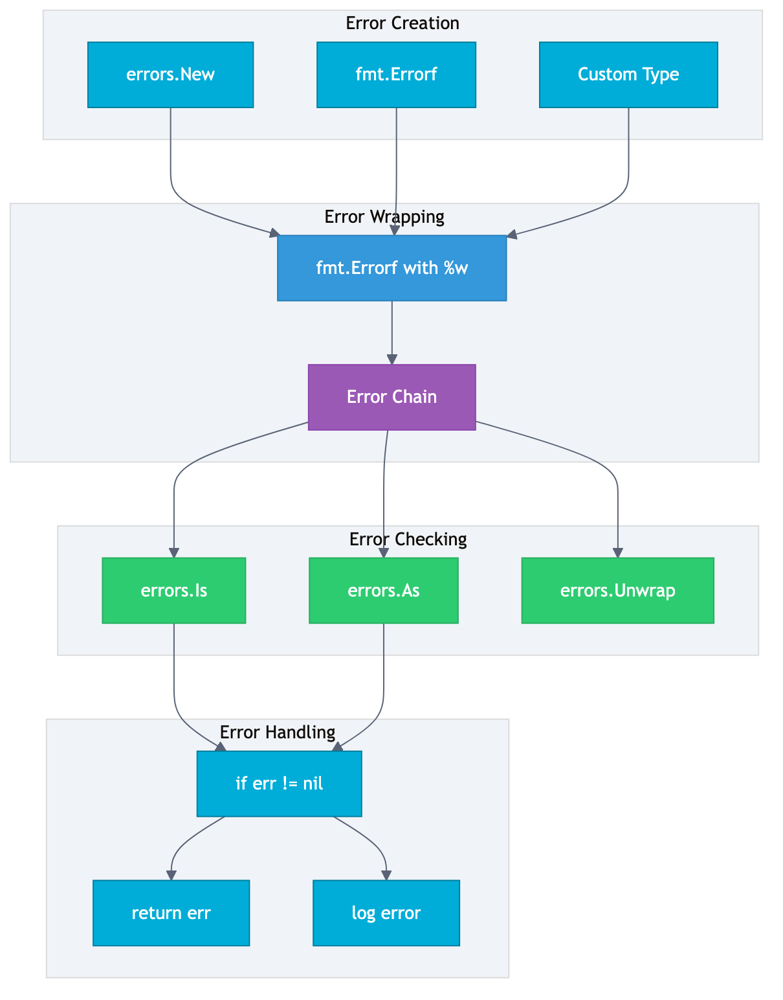
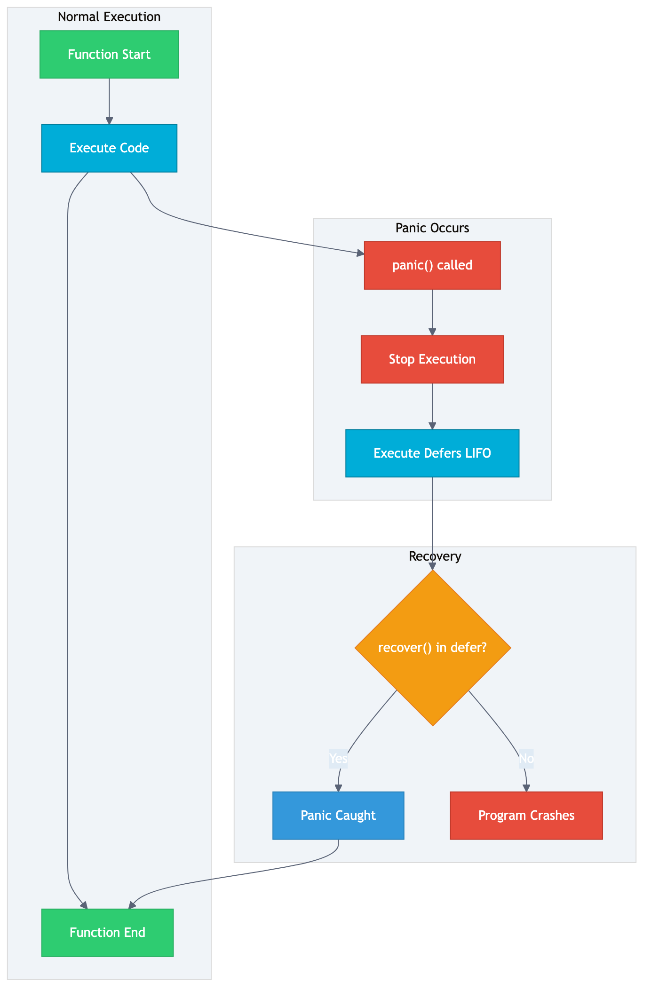
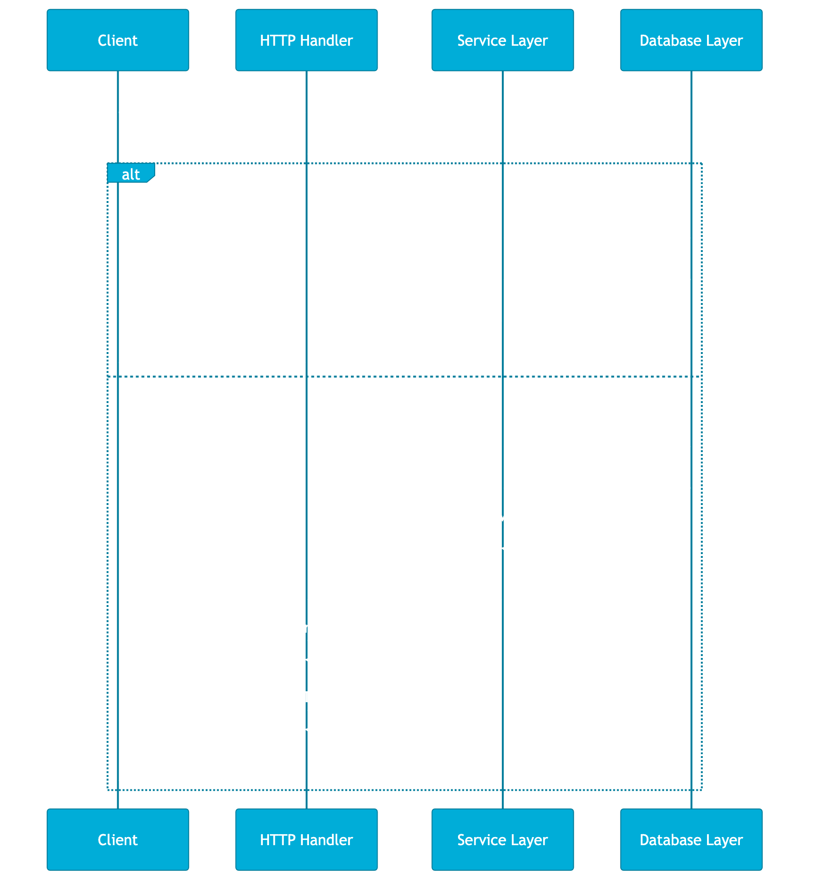

# 第 5 章 错误处理最佳实践

## 场景

你写了一个用户服务，运行了三个月，突然收到告警：大量请求返回 500 错误。

你打开日志，发现：
- 错误信息只有 "error"，不知道具体是什么错误
- 错误从数据库层传到服务层，再传到 API 层，每一层都丢失了上下文
- 不知道这个错误是参数错误、用户不存在、还是数据库崩溃
- 客户端收到 500，不知道是重试还是放弃

**错误处理不是写个 `if err != nil` 就完事了。**

本章解决四个问题：
1. Go 的错误处理哲学是什么？
2. 如何设计清晰的错误类型？
3. 如何在多层调用中保留错误上下文？
4. 如何设计统一的错误码体系？

> 所有代码都在 `05-error-handling/` 目录下，每个 example 独立可运行。

---

## 5.1 Go 的错误处理哲学

> 代码：`example1-basic/main.go`

### 5.1.1 error 接口

Go 的错误处理非常简单，`error` 就是一个接口：

```go
type error interface {
    Error() string
}
```

只有一个方法：返回错误信息字符串。

**为什么这么简单？**

对比其他语言：

| 语言 | 错误处理 | 复杂度 |
|------|----------|--------|
| Java | Exception 层次结构，checked/unchecked | 高 |
| Python | Exception 层次结构，try/except | 中 |
| Go | error 接口，if err != nil | 低 |

Go 的设计哲学：
- **错误是值**：可以像普通值一样传递、处理
- **显式处理**：没有异常机制，必须检查每个错误
- **简单一致**：所有错误都是 error 接口

### 5.1.2 创建错误

```go
// 方式 1：errors.New
err := errors.New("something went wrong")

// 方式 2：fmt.Errorf（支持格式化）
err := fmt.Errorf("failed to process user %d", 123)
```

### 5.1.3 基本错误处理

```go
// 模式 1：直接返回
if err := doSomething(); err != nil {
    return err
}

// 模式 2：错误包装
if err := doSomething(); err != nil {
    return fmt.Errorf("doSomething failed: %w", err)
}
```

### 深入：为什么 Go 不用异常？

**异常的问题：**

1. **控制流不清晰**：异常可以跨越多个函数调用，难以追踪
2. **性能差**：异常处理需要维护调用栈，影响性能
3. **容易忽略**：try/catch 可以捕获所有异常，导致错误被吞掉

**Go 的选择：**

```go
// 错误处理是一等公民
result, err := doSomething()
if err != nil {
    // 必须处理错误，不能忽略
    return fmt.Errorf("doSomething failed: %w", err)
}
```

**好处：**
- 错误处理在代码中随处可见，不会被忽略
- 控制流清晰，错误不会跨越函数边界
- 性能好，没有异常机制的开销

---

## 5.2 自定义错误类型

> 代码：`example2-custom/main.go`

### 5.2.1 哨兵错误（Sentinel Errors）

```go
// 全局哨兵错误
var (
    ErrNotFound     = errors.New("not found")
    ErrUnauthorized = errors.New("unauthorized")
    ErrForbidden    = errors.New("forbidden")
)

// 使用
func checkPermission(hasPermission bool) error {
    if !hasPermission {
        return fmt.Errorf("access denied: %w", ErrUnauthorized)
    }
    return nil
}

// 判断
if errors.Is(err, ErrUnauthorized) {
    fmt.Println("未授权访问")
}
```

**哨兵错误的适用场景：**
- 错误类型简单，不需要额外信息
- 需要在全局判断特定错误
- 标准库的 `io.EOF` 就是哨兵错误

### 5.2.2 自定义错误类型

当需要携带额外信息时，定义自己的错误类型：

```go
type ValidationError struct {
    Field   string
    Message string
}

func (e *ValidationError) Error() string {
    return fmt.Sprintf("validation failed: field=%s, message=%s", e.Field, e.Message)
}

// 使用
err := &ValidationError{
    Field:   "email",
    Message: "invalid format",
}

// 判断
var valErr *ValidationError
if errors.As(err, &valErr) {
    fmt.Printf("验证失败: field=%s\n", valErr.Field)
}
```

### 5.2.3 带上下文的错误类型

```go
type NotFoundError struct {
    Resource string
    ID       string
    Err      error
}

func (e *NotFoundError) Error() string {
    return fmt.Sprintf("%s not found: id=%s", e.Resource, e.ID)
}

func (e *NotFoundError) Unwrap() error {
    return e.Err
}
```

**Unwrap 方法的作用：**
- 支持错误链（error chain）
- 可以用 `errors.Is` 和 `errors.As` 检查内部错误

### 5.2.4 业务错误类型

```go
type BusinessError struct {
    Code    int    // 业务错误码
    Message string // 用户友好的错误信息
    Err     error  // 原始错误
}

func (e *BusinessError) Error() string {
    if e.Err != nil {
        return fmt.Sprintf("[%d] %s: %v", e.Code, e.Message, e.Err)
    }
    return fmt.Sprintf("[%d] %s", e.Code, e.Message)
}

func (e *BusinessError) Unwrap() error {
    return e.Err
}
```

---

## 5.3 错误包装与错误链

> 代码：`example3-wrapping/main.go`



### 5.3.1 错误包装（Wrapping）

Go 1.13 引入了错误包装，用 `%w` 格式化动词：

```go
// 数据库层
func findUserInDB(id string) (string, error) {
    if id == "999" {
        return "", fmt.Errorf("user %s: %w", id, ErrNotFound)
    }
    return "Alice", nil
}

// 服务层
func getUserFromService(id string) (string, error) {
    user, err := findUserInDB(id)
    if err != nil {
        return "", fmt.Errorf("getUserFromService failed: %w", err)
    }
    return user, nil
}

// 处理器层
func handleGetUser(id string) (string, error) {
    user, err := getUserFromService(id)
    if err != nil {
        return "", fmt.Errorf("handleGetUser failed: %w", err)
    }
    return user, nil
}
```

**错误链：**

```
handleGetUser failed: getUserFromService failed: user 999: not found
```

每一层都添加了自己的上下文，但原始错误 `ErrNotFound` 仍然可以被检测到。

### 5.3.2 errors.Is - 检查错误链

```go
_, err := handleGetUser("999")
if err != nil {
    // 检查错误链中是否包含 ErrNotFound
    if errors.Is(err, ErrNotFound) {
        fmt.Println("用户不存在")
    }
}
```

**errors.Is 的工作原理：**

```go
func Is(err, target error) bool {
    for {
        if err == target {
            return true
        }
        if x, ok := err.(interface{ Unwrap() error }); ok {
            err = x.Unwrap()
        } else {
            return false
        }
    }
}
```

递归解包错误链，检查是否包含目标错误。

### 5.3.3 errors.As - 提取错误类型

```go
_, err := handleGetUser("")
if err != nil {
    var valErr *ValidationError
    if errors.As(err, &valErr) {
        fmt.Printf("验证失败: field=%s\n", valErr.Field)
    }
}
```

**errors.As 的工作原理：**

```go
func As(err error, target interface{}) bool {
    for {
        if reflect.TypeOf(err).AssignableTo(reflect.TypeOf(target)) {
            reflect.ValueOf(target).Elem().Set(reflect.ValueOf(err))
            return true
        }
        if x, ok := err.(interface{ Unwrap() error }); ok {
            err = x.Unwrap()
        } else {
            return false
        }
    }
}
```

递归解包错误链，提取特定类型的错误。

### 5.3.4 %w vs %v 的区别

```go
// 使用 %w（可解包）
err1 := fmt.Errorf("layer1: %w", ErrNotFound)
err2 := fmt.Errorf("layer2: %w", err1)
errors.Is(err2, ErrNotFound) // true

// 使用 %v（不可解包）
err3 := fmt.Errorf("layer1: %v", ErrNotFound)
err4 := fmt.Errorf("layer2: %v", err3)
errors.Is(err4, ErrNotFound) // false
```

**规则：**
- `%w`：包装错误，保留错误链，支持 `errors.Is` 和 `errors.As`
- `%v`：格式化错误，丢失错误链，不支持错误检查

### 5.3.5 多错误解包（Go 1.20+）

Go 1.20 引入了多错误解包：

```go
type MultiError struct {
    Errors []error
}

func (e *MultiError) Error() string {
    return fmt.Sprintf("multiple errors: %d errors occurred", len(e.Errors))
}

// 实现 Unwrap 返回错误切片
func (e *MultiError) Unwrap() []error {
    return e.Errors
}

// 使用
err := &MultiError{
    Errors: []error{ErrNotFound, ErrUnauthorized},
}

errors.Is(err, ErrNotFound)     // true
errors.Is(err, ErrUnauthorized) // true
```

---

## 5.4 错误码设计

> 代码：`example4-errcode/main.go`

### 5.4.1 错误码规范

```go
// 错误码规范：
// 1xxxx - 通用错误
// 2xxxx - 用户相关
// 3xxxx - 订单相关
// 4xxxx - 支付相关

const (
    // 通用错误 1xxxx
    CodeSuccess      = 0
    CodeUnknown      = 10000
    CodeInvalidParam = 10001
    CodeUnauthorized = 10002
    CodeNotFound     = 10004

    // 用户错误 2xxxx
    CodeUserNotFound  = 20001
    CodeUserExists    = 20002
    CodePasswordWrong = 20003

    // 订单错误 3xxxx
    CodeOrderNotFound  = 30001
    CodeStockNotEnough = 30004

    // 支付错误 4xxxx
    CodePayFailed  = 40001
    CodePayTimeout = 40002
)
```

**设计原则：**
- 分段管理：不同业务模块用不同的错误码段
- 可读性：错误码要有意义，不要随意分配
- 可扩展：预留空间，方便后续添加

### 5.4.2 错误码映射

```go
var codeMessages = map[int]string{
    CodeSuccess:      "success",
    CodeInvalidParam: "invalid parameter",
    CodeUnauthorized: "unauthorized",
    CodeNotFound:     "not found",
    CodeUserNotFound: "user not found",
}

func GetMessage(code int) string {
    if msg, ok := codeMessages[code]; ok {
        return msg
    }
    return "unknown error"
}
```

### 5.4.3 HTTP 状态码映射

```go
func codeToHTTPStatus(code int) int {
    switch {
    case code == CodeSuccess:
        return 200
    case code >= 10000 && code < 20000:
        // 通用错误
        switch code {
        case CodeInvalidParam:
            return 400
        case CodeUnauthorized:
            return 401
        case CodeNotFound:
            return 404
        default:
            return 500
        }
    case code >= 20000 && code < 30000:
        return 400 // 用户错误
    case code >= 30000 && code < 40000:
        return 400 // 订单错误
    default:
        return 500
    }
}
```

### 5.4.4 统一响应结构

```go
type APIResponse struct {
    Code    int         `json:"code"`
    Message string      `json:"message"`
    Data    interface{} `json:"data,omitempty"`
}

func Success(data interface{}) APIResponse {
    return APIResponse{Code: CodeSuccess, Message: "success", Data: data}
}

func Error(code int, message string) APIResponse {
    return APIResponse{Code: code, Message: message}
}
```

**响应示例：**

```json
// 成功
{
    "code": 0,
    "message": "success",
    "data": {"id": "1", "name": "Alice"}
}

// 错误
{
    "code": 20001,
    "message": "user not found"
}
```

---

## 5.5 Panic 与 Recover

> 代码：`example5-panic/main.go`



### 5.5.1 panic 基础

```go
func demo() {
    defer fmt.Println("defer 1")
    defer fmt.Println("defer 2")
    
    panic("something terrible happened")
    
    fmt.Println("这行不会执行")
}
// 输出: defer 2, defer 1, panic
```

**panic 的行为：**
1. 立即停止当前函数的执行
2. 开始执行 defer 调用链（LIFO 顺序）
3. 如果 panic 没有被 recover，程序崩溃

### 5.5.2 recover 捕获 panic

```go
func demo() {
    defer func() {
        if r := recover(); r != nil {
            fmt.Printf("捕获到 panic: %v\n", r)
            fmt.Printf("堆栈信息:\n%s\n", debug.Stack())
        }
    }()
    
    panic("something went wrong")
}
```

**recover 的规则：**
- 只能在 defer 中调用
- 返回 panic 的值
- 如果没有 panic，返回 nil

### 5.5.3 什么时候用 panic

**场景 1：程序启动时的必要初始化**

```go
func main() {
    // 如果配置文件加载失败，程序无法运行
    config := loadConfig()
    if config == nil {
        panic("failed to load config")
    }
}
```

**场景 2：不应该发生的情况（编程错误）**

```go
func divide(a, b int) int {
    if b == 0 {
        panic("division by zero") // 除数为 0 是编程错误
    }
    return a / b
}
```

### 5.5.4 什么时候不用 panic

**不要用 panic 处理：**

1. **可预期的错误**
   ```go
   // 错误：文件不存在是可预期的
   file, err := os.Open("file.txt")
   if err != nil {
       panic(err) // 错误！
   }
   
   // 正确：用 error 处理
   if err != nil {
       return fmt.Errorf("open file failed: %w", err)
   }
   ```

2. **API 错误**
   ```go
   // 错误：参数验证失败
   func createUser(name string) {
       if name == "" {
           panic("name is required") // 错误！
       }
   }
   
   // 正确：返回 error
   func createUser(name string) error {
       if name == "" {
           return errors.New("name is required")
       }
       return nil
   }
   ```

3. **业务逻辑错误**
   ```go
   // 错误：库存不足
   if stock <= 0 {
       panic("out of stock") // 错误！
   }
   
   // 正确：返回业务错误
   if stock <= 0 {
       return &BusinessError{Code: CodeStockNotEnough, Message: "out of stock"}
   }
   ```

### 5.5.5 HTTP 服务器中的 recover

```go
func recoveryMiddleware(next http.Handler) http.Handler {
    return http.HandlerFunc(func(w http.ResponseWriter, r *http.Request) {
        defer func() {
            if err := recover(); err != nil {
                log.Printf("panic recovered: %v, stack: %s", err, debug.Stack())
                http.Error(w, "internal server error", http.StatusInternalServerError)
            }
        }()
        next.ServeHTTP(w, r)
    })
}
```

**每个 goroutine 都需要自己的 recover：**

```go
go func() {
    defer func() {
        if r := recover(); r != nil {
            log.Printf("goroutine panic: %v", r)
        }
    }()
    // goroutine 逻辑
}()
```

---

## 5.6 实战：HTTP 服务的错误处理

> 代码：`example6-http/main.go`



### 5.6.1 完整的错误处理流程

```
客户端请求
    ↓
HTTP 处理器
    ↓ 解析参数
    ↓ 调用服务层
    ↓
服务层
    ↓ 业务逻辑
    ↓ 调用数据层
    ↓
数据层
    ↓ 数据库操作
    ↓ 返回错误
    ↓
服务层
    ↓ 包装错误（添加上下文）
    ↓ 转换为业务错误
    ↓
HTTP 处理器
    ↓ 判断错误类型
    ↓ 转换为 HTTP 状态码
    ↓ 构造统一响应
    ↓
客户端收到响应
```

### 5.6.2 代码实现

```go
// 业务错误类型
type AppError struct {
    Code    int
    Message string
    Err     error
}

func (e *AppError) Error() string {
    if e.Err != nil {
        return fmt.Sprintf("[%d] %s: %v", e.Code, e.Message, e.Err)
    }
    return fmt.Sprintf("[%d] %s", e.Code, e.Message)
}

func (e *AppError) Unwrap() error {
    return e.Err
}

// HTTP 处理器
func handleGetUser(w http.ResponseWriter, r *http.Request) {
    id := r.URL.Query().Get("id")
    
    user, err := getUser(id)
    if err != nil {
        var appErr *AppError
        if errors.As(err, &appErr) {
            // 根据错误码返回不同的 HTTP 状态码
            status := http.StatusBadRequest
            if appErr.Code == CodeUserNotFound {
                status = http.StatusNotFound
            }
            writeJSON(w, status, appErr.ToResponse())
            return
        }
        writeJSON(w, http.StatusInternalServerError, ErrorResp(CodeUnknown, "internal error"))
        return
    }
    
    writeJSON(w, http.StatusOK, Success(user))
}
```

### 5.6.3 运行测试

```bash
cd example6-http
go run main.go

# 获取用户 - 成功
curl 'http://localhost:8080/api/user?id=1'
# {"code":0,"message":"success","data":{"id":"1","name":"Alice","email":"alice@example.com"}}

# 获取用户 - 不存在
curl 'http://localhost:8080/api/user?id=999'
# {"code":20001,"message":"user 999 not found"}

# 获取用户 - 参数错误
curl 'http://localhost:8080/api/user'
# {"code":10001,"message":"user id is required"}

# 模拟 panic
curl 'http://localhost:8080/api/panic'
# {"code":0,"message":"internal server error"}
```

---

## 5.7 最佳实践

### 5.7.1 错误处理原则

1. **尽早处理**：错误发生后立即处理，不要延迟
2. **保留上下文**：包装错误时添加有意义的上下文
3. **使用 %w**：用 `%w` 包装错误，保留错误链
4. **统一响应**：API 返回统一的错误格式
5. **日志记录**：在关键位置记录错误日志

### 5.7.2 错误处理模式

```go
// 模式 1：失败快速返回
func process(input string) (string, error) {
    if input == "" {
        return "", errors.New("empty input")
    }
    // 处理逻辑
    return result, nil
}

// 模式 2：错误包装
func handleRequest(req Request) error {
    result, err := process(req.Input)
    if err != nil {
        return fmt.Errorf("handleRequest failed: %w", err)
    }
    // 使用 result
    return nil
}

// 模式 3：重试
func processWithRetry(input string, maxRetries int) (string, error) {
    var lastErr error
    for i := 0; i < maxRetries; i++ {
        result, err := process(input)
        if err == nil {
            return result, nil
        }
        lastErr = err
    }
    return "", fmt.Errorf("all retries failed: %w", lastErr)
}
```

### 5.7.3 错误处理反模式

```go
// 反模式 1：忽略错误
result, _ := doSomething() // 错误！

// 反模式 2：错误信息不明确
if err != nil {
    return errors.New("error") // 错误！没有上下文
}

// 反模式 3：过度包装
func layer1() error {
    err := layer2()
    return fmt.Errorf("layer1: %w", err)
}
func layer2() error {
    err := layer3()
    return fmt.Errorf("layer2: %w", err)
}
// 错误链太长，难以阅读

// 反模式 4：panic 处理业务错误
if stock <= 0 {
    panic("out of stock") // 错误！
}
```

---

## 5.8 排障

### 5.8.1 错误信息丢失

**问题：** 错误从底层传到上层，信息越来越少

**原因：** 没有使用 `%w` 包装错误

```go
// 错误
return fmt.Errorf("failed: %v", err) // 丢失错误链

// 正确
return fmt.Errorf("failed: %w", err) // 保留错误链
```

### 5.8.2 errors.Is 返回 false

**问题：** `errors.Is(err, target)` 返回 false，但错误链中应该包含 target

**原因：**
1. 没有使用 `%w` 包装
2. 错误类型没有实现 `Unwrap` 方法

```go
// 错误
type MyError struct {
    Err error
}
func (e *MyError) Error() string { return "my error" }
// 没有 Unwrap 方法

// 正确
func (e *MyError) Unwrap() error { return e.Err }
```

### 5.8.3 panic 没有被 recover

**问题：** 程序崩溃，recover 没有捕获 panic

**原因：**
1. recover 不在 defer 中
2. goroutine 没有自己的 recover

```go
// 错误：recover 不在 defer 中
if r := recover(); r != nil { } // 不会捕获

// 正确
defer func() {
    if r := recover(); r != nil { }
}()
```

---

## 5.9 面试题

**Q1：Go 的错误处理和 Java 的异常有什么区别？**

A：
- Go 用 error 接口，Java 用 Exception 层次结构
- Go 显式处理（if err != nil），Java 用 try/catch
- Go 错误是值，可以像普通值一样传递
- Go 没有 checked exception，所有错误都必须显式处理

**Q2：errors.Is 和 errors.As 的区别？**

A：
- `errors.Is`：检查错误链中是否包含特定错误值
- `errors.As`：从错误链中提取特定类型的错误

**Q3：%w 和 %v 的区别？**

A：
- `%w`：包装错误，保留错误链，支持 errors.Is/As
- `%v`：格式化错误，丢失错误链

**Q4：什么时候用 panic？**

A：
- 程序启动时的必要初始化失败
- 不应该发生的情况（编程错误）
- 不要用 panic 处理可预期的错误

**Q5：如何设计错误码体系？**

A：
- 分段管理：不同业务模块用不同的错误码段
- 统一格式：错误码 + 错误消息
- HTTP 映射：错误码映射到 HTTP 状态码
- 统一响应：API 返回统一的错误格式

---

## 5.10 小结

本章系统讲解了 Go 错误处理的最佳实践：

1. **Go 的哲学**：错误是值，显式处理，简单一致
2. **自定义错误**：哨兵错误、自定义类型、业务错误
3. **错误包装**：%w 保留错误链，errors.Is/As 检查
4. **错误码设计**：分段管理、统一响应、HTTP 映射
5. **Panic/Recover**：只在必要时使用，不要处理业务错误
6. **实战**：HTTP 服务的完整错误处理流程

**核心原则：**
- 错误处理是一等公民，不要忽略
- 保留上下文，用 %w 包装
- 统一响应，客户端友好
- panic 只用于编程错误

下一章我们将学习 Interface 设计思想，深入理解 Go 的类型系统。
