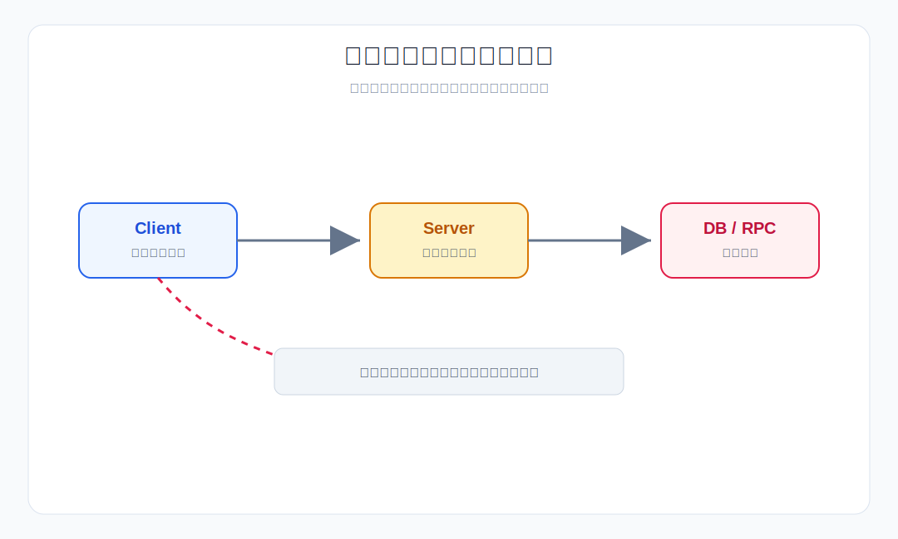
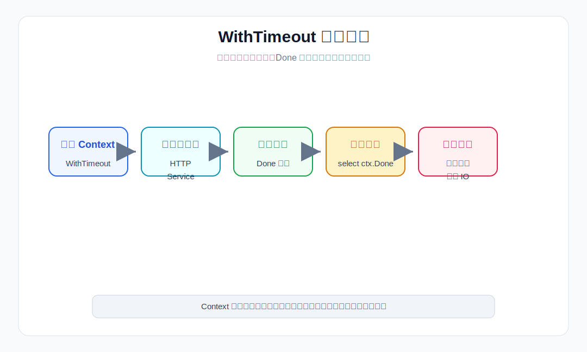
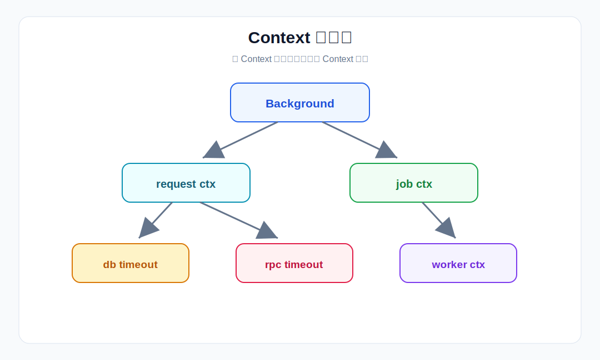
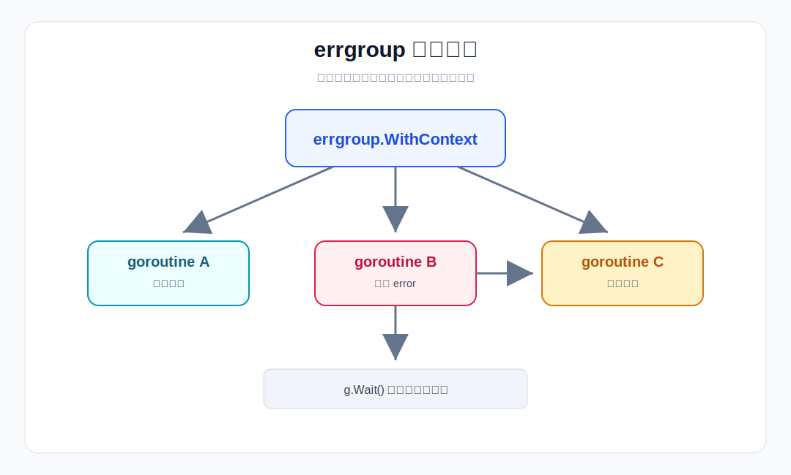
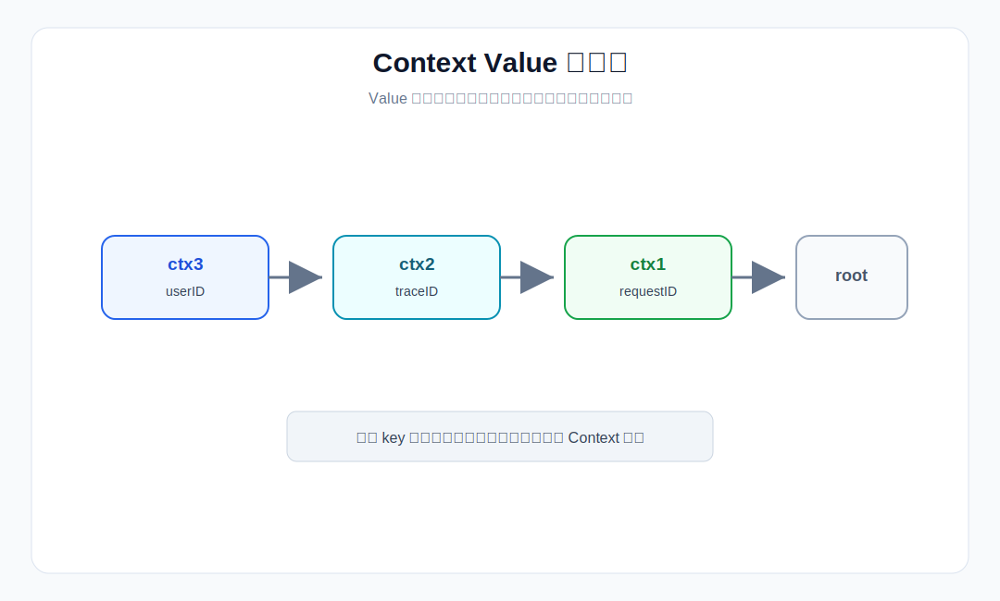

# 第 7 章 Context 使用规范

## 场景

上一章我们把用户管理 API 的存储层抽象成了接口，MemoryStore 可以无缝切换到 MySQL。

你把服务部署上线，跑了两天，运维找过来了：

> "你的用户查询接口，有时候一个请求要跑 30 秒。客户端早断了，服务端还在查数据库。goroutine 数量已经从 200 飙到 5 万了。"

你打开 pprof（第 2 章装的），发现大量 goroutine 卡在数据库查询上。

问题出在哪？

- 数据库慢查询时，客户端已经断开连接，但服务端不知道，还在傻等
- 一个请求调了 3 个下游服务，其中一个超时了，但另外两个还在跑
- 服务重启时，正在处理的请求被直接杀掉，用户看到 502

这三个问题的本质是一样的：**没有取消机制**。

Go 的标准答案是 `context` 包。但 context 也是 Go 里最容易被误用的包之一。

本章从上面三个真实问题出发，讲清楚：
1. Context 到底解决了什么问题
2. 源码层面它是怎么工作的
3. 怎么用才对，怎么用最容易踩坑

> 所有代码都在 `07-context/` 目录下，每个 example 独立可运行。

---

## 7.1 没有 Context 的世界

> 代码：`example1-no-context/main.go`

先写一个"有 bug"的版本，看看问题到底出在哪。

### 7.1.1 慢查询导致 goroutine 堆积

```go
// 模拟慢查询
func slowQuery(userID int) string {
    time.Sleep(10 * time.Second) // 模拟数据库慢查询
    return fmt.Sprintf("user-%d-data", userID)
}

// 没有 Context 的处理器
func handleRequest(userID int) {
    result := slowQuery(userID)
    fmt.Printf("查询完成: %s\n", result)
}

func main() {
    // 模拟 100 个请求
    for i := 0; i < 100; i++ {
        go handleRequest(i)
    }
    
    // 每 2 秒打印一次 goroutine 数量
    for i := 0; i < 15; i++ {
        time.Sleep(2 * time.Second)
        fmt.Printf("[%ds] goroutine 数量: %d\n", (i+1)*2, runtime.NumGoroutine())
    }
}
```

运行结果：

```
[2s] goroutine 数量: 103
[4s] goroutine 数量: 103
[6s] goroutine 数量: 103
[8s] goroutine 数量: 103
[10s] goroutine 数量: 103
[12s] goroutine 数量: 3  // 终于完成了
```

**问题**：100 个 goroutine 卡住 10 秒，期间什么都做不了。

### 7.1.2 问题根因



客户端断开连接后，服务端不知道，还在傻等数据库返回。

### 7.1.3 如果用 channel 手动实现取消

```go
func handleRequest(done chan struct{}, userID int) {
    resultCh := make(chan string, 1)
    
    go func() {
        result := slowQuery(userID)
        resultCh <- result
    }()
    
    select {
    case result := <-resultCh:
        fmt.Printf("查询完成: %s\n", result)
    case <-done:
        fmt.Println("请求取消")
        return
    }
}
```

问题：
- 每层都要传 `done` channel，代码很丑
- 没法传超时时间
- 没法传请求元数据（如 requestID）
- 多层嵌套时，取消逻辑复杂到无法维护

**结论：需要一个标准化的取消机制。这就是 Context。**

---

## 7.2 Context 接口与四种实现

### 7.2.1 Context 接口

```go
type Context interface {
    Deadline() (deadline time.Time, ok bool)
    Done() <-chan struct{}
    Err() error
    Value(key any) any
}
```

四个方法：

| 方法 | 作用 |
|------|------|
| `Deadline()` | 返回截止时间 |
| `Done()` | 返回一个 channel，Context 被取消时关闭 |
| `Err()` | 返回取消原因（超时或手动取消） |
| `Value(key)` | 获取绑定的值 |

### 7.2.2 常用 Context 创建方式

| 函数 | 用途 | 取消条件 |
|------|------|----------|
| `Background()` | 根 Context | 永远不会取消 |
| `TODO()` | 不确定用哪个时 | 永远不会取消 |
| `WithCancel()` | 手动取消 | 调用 `cancel()` |
| `WithTimeout()` | 超时取消 | 超时或调用 `cancel()` |
| `WithDeadline()` | 指定截止时间 | 到达 deadline 或调用 `cancel()` |
| `WithValue()` | 传递请求级元数据 | 跟随父 Context |

Go 1.20+ 还提供了 `WithCancelCause` / `Cause`，可以保留更明确的取消原因。业务代码里先把 `WithCancel`、`WithTimeout`、`WithValue` 用对，再看这些进阶 API。

### 7.2.3 解决第一个问题：慢查询

> 代码：`example2-cancel/main.go`

用 `WithTimeout` 包装数据库查询，超时自动取消：

```go
func slowQuery(ctx context.Context, userID int) (string, error) {
    select {
    case <-time.After(10 * time.Second):
        return fmt.Sprintf("user-%d-data", userID), nil
    case <-ctx.Done():
        return "", ctx.Err()
    }
}

func handleRequest(ctx context.Context, userID int) {
    ctx, cancel := context.WithTimeout(ctx, 3*time.Second)
    defer cancel()
    
    result, err := slowQuery(ctx, userID)
    if err != nil {
        fmt.Printf("请求 %d 失败: %v\n", userID, err)
        return
    }
    fmt.Printf("请求 %d 成功: %s\n", userID, result)
}
```

运行结果：

```
[2s] goroutine 数量: 103
[4s] goroutine 数量: 3  // 3 秒后全部取消
```



**关键**：`defer cancel()` 必须调用。即使超时最终会释放资源，请求提前完成时主动调用 `cancel`，可以更早停止 timer，并解除父子 Context 之间的引用。

---

## 7.3 Context 树与取消传播

### 7.3.1 Context 是一棵树

> 代码：`example3-tree/main.go`

Context 之间是父子关系，父节点取消，子节点全部取消。



```go
// 创建 Context 树
root := context.Background()

// 第一层：5 秒超时
ctx1, cancel1 := context.WithTimeout(root, 5*time.Second)
defer cancel1()

// 第二层：传递 requestID
ctx2 := context.WithValue(ctx1, "requestID", "req-123")

// 第三层：手动取消
ctx3, cancel3 := context.WithCancel(ctx2)
defer cancel3()
```

### 7.3.2 取消传播源码

关键源码（简化版）：

```go
// context.go
func (c *cancelCtx) cancel(err error) {
    c.mu.Lock()
    defer c.mu.Unlock()
    
    c.err = err
    close(c.done)  // 关闭 done channel，通知所有等待者
    
    for _, d := range c.children {
        d.cancel(false, err, true)  // 递归取消子节点
    }
    c.children = nil
}
```

**为什么这样设计？**

- `close(done)` 而不是 `send`：`close` 可以通知所有等待者，`send` 只能通知一个
- 递归取消：保证整棵子树都被清理
- `children` 置 `nil`：释放内存，允许 GC

### 7.3.3 解决第二个问题：并发调用下游

> 代码：`example4-errgroup/main.go`

一个请求查用户信息 + 查权限 + 查菜单，三个并发调用。权限查询失败后，仍在执行的菜单查询会收到取消信号并尽快退出。

```go
func main() {
    ctx, cancel := context.WithTimeout(context.Background(), 5*time.Second)
    defer cancel()
    
    g, ctx := errgroup.WithContext(ctx)
    
    var user, perm, menu string
    
    g.Go(func() error {
        var err error
        user, err = getUser(ctx, userID)
        return err
    })
    
    g.Go(func() error {
        var err error
        perm, err = getPermission(ctx, userID) // 这个会返回权限错误
        return err
    })
    
    g.Go(func() error {
        var err error
        menu, err = getMenu(ctx, userID)  // 这个会被取消
        return err
    })
    
    if err := g.Wait(); err != nil {
        fmt.Printf("整体失败: %v\n", err)
    }
}
```



**结果**：权限查询返回错误，`errgroup` 会取消派生出来的 `ctx`。已经完成的任务不会被“撤销”，仍在执行且监听 `ctx.Done()` 的任务会尽快退出。

---

## 7.4 Context 传值

### 7.4.1 正确用法：请求级别的元数据

> 代码：`example5-value/main.go`

`requestID`、`userID` 这种请求级别的信息，适合放在 Context 中。

类型安全的封装：

```go
type contextKey string

const requestIDKey contextKey = "requestID"

func WithRequestID(ctx context.Context, id string) context.Context {
    return context.WithValue(ctx, requestIDKey, id)
}

func RequestIDFromContext(ctx context.Context) string {
    id, ok := ctx.Value(requestIDKey).(string)
    if !ok || id == "" {
        return "unknown"
    }
    return id
}
```

使用：

```go
func middleware1(ctx context.Context) {
    fmt.Printf("中间件1: requestID=%s\n", RequestIDFromContext(ctx))
    
    ctx = WithUserID(ctx, 123)
    middleware2(ctx)
}

func middleware2(ctx context.Context) {
    fmt.Printf("中间件2: requestID=%s, userID=%d\n",
        RequestIDFromContext(ctx),
        UserIDFromContext(ctx))
}
```

### 7.4.2 错误用法

**不要这样做：**

```go
// 错误：把函数参数放 Context
func process(ctx context.Context, userID int) {
    ctx = context.WithValue(ctx, "userID", userID)  // 错！
    doSomething(ctx)
}

// 正确：直接传参
func process(ctx context.Context, userID int) {
    doSomething(ctx, userID)
}
```

```go
// 错误：把配置放 Context
ctx = context.WithValue(ctx, "dbConfig", config)

// 正确：用依赖注入
func NewService(db *sql.DB) *Service {
    return &Service{db: db}
}
```

```go
// 错误：把大对象放 Context
ctx = context.WithValue(ctx, "userData", largeObject)

// 正确：直接传
func handle(ctx context.Context, data *LargeObject) {
    // ...
}
```

### 7.4.3 源码：Value 查找

```go
func (c *valueCtx) Value(key any) any {
    if c.key == key {
        return c.val
    }
    return c.Context.Value(key)  // 递归向上查找
}
```



`Value` 沿着 Context 链向上查找，找到第一个匹配的 key 就返回。

**性能提醒**：每次 `Value` 调用都是一次链表遍历。不要放太多层。

---

## 7.5 HTTP 服务中的 Context

### 7.5.1 每个请求自带 Context

源码（`server.go`）：

```go
func (c *conn) readRequest(ctx context.Context) (w *response, err error) {
    // ...
    w = &response{
        req: req,
    }
    w.req.ctx = context.WithValue(ctx, ServerContextKey, c.server)
    // ...
}
```

每个 HTTP 请求都自带一个 Context。对服务端请求来说，这个 Context 会在客户端连接关闭、HTTP/2 请求被取消、或者 `ServeHTTP` 返回时取消。也就是说，Handler 里的数据库查询、HTTP 调用、后台 goroutine 只要使用 `r.Context()`，就能感知请求生命周期。

### 7.5.2 中间件传递 Context

> 代码：`example6-http/main.go`

```go
// requestID 中间件
func requestIDMiddleware(next http.Handler) http.Handler {
    return http.HandlerFunc(func(w http.ResponseWriter, r *http.Request) {
        requestID := r.Header.Get("X-Request-ID")
        if requestID == "" {
            requestID = fmt.Sprintf("req-%d", time.Now().UnixNano())
        }
        
        ctx := context.WithValue(r.Context(), requestIDKey, requestID)
        w.Header().Set("X-Request-ID", requestID)
        
        next.ServeHTTP(w, r.WithContext(ctx))
    })
}

// 日志中间件
func loggingMiddleware(next http.Handler) http.Handler {
    return http.HandlerFunc(func(w http.ResponseWriter, r *http.Request) {
        start := time.Now()
        requestID := RequestIDFromContext(r.Context())
        
        next.ServeHTTP(w, r)
        
        log.Printf("[%s] %s %s %v",
            requestID,
            r.Method,
            r.URL.Path,
            time.Since(start))
    })
}
```

不要在业务代码里直接写 `r.Context().Value(key).(string)`。一旦中间件顺序调整或漏挂 requestID 中间件，直接类型断言会 panic。生产代码应封装 `RequestIDFromContext`，取不到时返回默认值或 `ok=false`。

### 7.5.3 解决第三个问题：优雅关闭

```go
func main() {
    srv := &http.Server{
        Addr:              ":8080",
        Handler:           handler,
        ReadHeaderTimeout: 5 * time.Second,
        ReadTimeout:       5 * time.Second,
        WriteTimeout:      10 * time.Second,
    }
    
    // 优雅关闭
    go func() {
        sigCh := make(chan os.Signal, 1)
        signal.Notify(sigCh, syscall.SIGINT, syscall.SIGTERM)
        <-sigCh
        
        log.Println("收到关闭信号，开始优雅关闭...")
        
        ctx, cancel := context.WithTimeout(context.Background(), 30*time.Second)
        defer cancel()
        
        if err := srv.Shutdown(ctx); err != nil {
            log.Printf("关闭失败: %v", err)
        }
    }()
    
    if err := srv.ListenAndServe(); err != nil && err != http.ErrServerClosed {
        log.Fatalf("启动失败: %v", err)
    }
}
```

**流程**：
1. 收到 SIGINT/SIGTERM 信号
2. 停止接受新请求
3. 等待正在处理的请求完成（最多 30 秒）
4. 关闭服务

---

## 7.6 踩坑实录

### 7.6.1 忘记 defer cancel()

```go
// 错误
ctx, cancel := context.WithTimeout(context.Background(), 5*time.Second)
// 忘记 defer cancel()
// 后果：请求提前完成时，timer 和子 Context 引用不能及时释放

// 正确
ctx, cancel := context.WithTimeout(context.Background(), 5*time.Second)
defer cancel()
```

**源码解释**：`WithTimeout` 内部会注册 timer。超时或父 Context 取消时，资源最终会释放；但如果业务提前返回，不调用 `cancel` 就不能及时停止 timer、移除子节点引用。生产代码应养成“创建可取消 Context 后立即 `defer cancel()`”的习惯。

### 7.6.2 把 Context 存到 struct 里

```go
// 错误
type Worker struct {
    ctx context.Context  // 错！
}

// 正确
type Worker struct {
    // 不存 Context
}

func (w *Worker) Process(ctx context.Context) {
    // Context 作为参数传递
}
```

**为什么不行**：Context 的生命周期应该跟请求绑定，不是跟对象绑定。

### 7.6.3 传了 Context 但没用

```go
// 错误
func queryUser(ctx context.Context, db *sql.DB, id int) (*User, error) {
    row := db.QueryRow("SELECT name FROM users WHERE id = ?", id)  // 没用 ctx！
    // scan row...
}

// 正确
func queryUser(ctx context.Context, db *sql.DB, id int) (*User, error) {
    row := db.QueryRowContext(ctx, "SELECT name FROM users WHERE id = ?", id)  // 用 ctx
    // scan row...
}
```

### 7.6.4 Goroutine 没有监听取消

```go
// 错误
go func() {
    result := heavyWork()  // 可能跑 10 分钟
    ch <- result           // 但没人收了
}()

// 正确
go func(ctx context.Context) {
    result, err := heavyWork(ctx) // heavyWork 内部也要监听 ctx.Done()
    if err != nil {
        return
    }
    select {
    case ch <- result:
    case <-ctx.Done():
        return
    }
}(ctx)
```

---

## 7.7 最佳实践

### 7.7.1 Context 作为第一个参数

```go
// 正确
func Process(ctx context.Context, userID int) error {
    // ...
}

// 错误
func Process(userID int, ctx context.Context) error {
    // ...
}
```

### 7.7.2 必须调用 cancel

```go
ctx, cancel := context.WithTimeout(parent, timeout)
defer cancel()  // 必须调用
```

### 7.7.3 每个外部调用都要有超时

```go
// 数据库查询
ctx, cancel := context.WithTimeout(ctx, 3*time.Second)
defer cancel()
row := db.QueryRowContext(ctx, query)

// HTTP 调用
ctx, cancel := context.WithTimeout(ctx, 5*time.Second)
defer cancel()
req, err := http.NewRequestWithContext(ctx, "GET", url, nil)
if err != nil {
    return err
}
resp, err := http.DefaultClient.Do(req)
```

### 7.7.4 只传递请求元数据

```go
// 正确：传递 requestID、userID、traceID
ctx = context.WithValue(ctx, requestIDKey, requestID)

// 错误：传递函数参数、配置、大对象
ctx = context.WithValue(ctx, "userID", userID)  // 错！
```

### 7.7.5 使用类型安全的 key

```go
type contextKey string

const requestIDKey contextKey = "requestID"

func WithRequestID(ctx context.Context, id string) context.Context {
    return context.WithValue(ctx, requestIDKey, id)
}

func RequestIDFromContext(ctx context.Context) string {
    id, ok := ctx.Value(requestIDKey).(string)
    if !ok || id == "" {
        return "unknown"
    }
    return id
}
```

---

## 7.8 面试题

**Q1：Context 的作用是什么？**

A：
- 取消信号传播
- 超时控制
- 请求元数据传递

**Q2：为什么 Context 要作为第一个参数？**

A：
- Go 的约定
- 便于识别
- 便于传递

**Q3：WithCancel 和 WithTimeout 的区别？**

A：
- `WithCancel`：手动调用 `cancel()` 取消
- `WithTimeout`：超时自动取消，或手动调用 `cancel()` 取消

**Q4：如何避免 Goroutine 泄漏？**

A：
- 监听 `ctx.Done()`
- 使用 `select` 语句
- 及时退出

**Q5：Context 值传递的最佳实践？**

A：
- 只传递请求元数据（requestID、userID、traceID）
- 使用类型安全的 key
- 不要传递函数参数、配置、大对象

---

## 7.9 小结

本章从用户管理服务的三个真实问题出发，讲透了 Context 的设计哲学和使用规范：

1. **没有 Context 的世界**：goroutine 堆积、无法取消、无法传值
2. **Context 接口**：四个方法、四种实现
3. **取消传播**：Context 树、递归取消、errgroup
4. **值传递**：正确用法、错误用法、源码分析
5. **HTTP 服务**：请求自带 Context、中间件传递、优雅关闭
6. **踩坑实录**：忘记 cancel、存到 struct、传了没用、Goroutine 泄漏
7. **最佳实践**：五条核心规则

**核心原则**：

> Context 是 Go 并发编程的基石，它让取消信号能够优雅地传播到整个调用链。

下一章我们将学习单元测试基础，确保代码质量。
