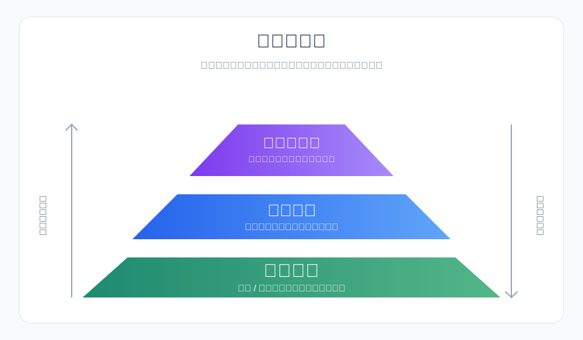
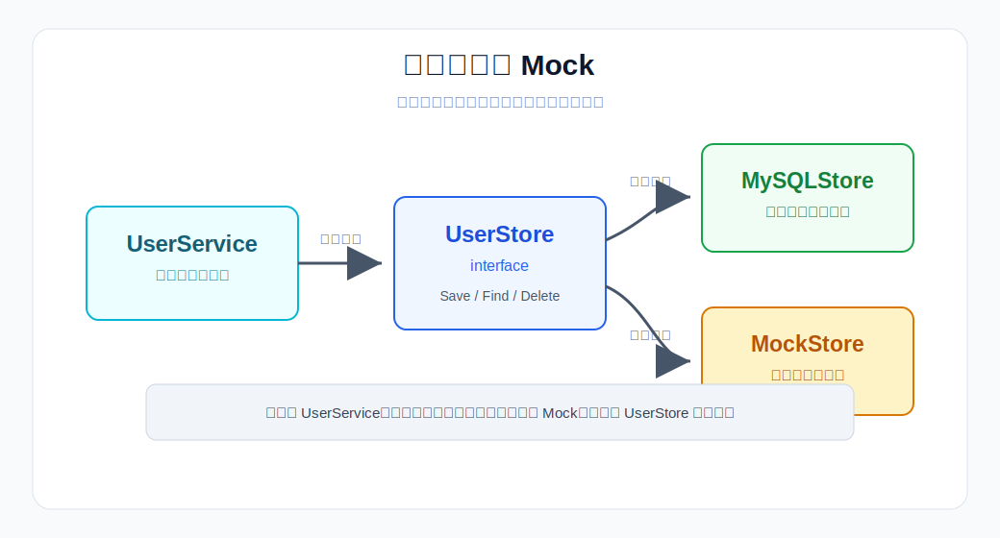
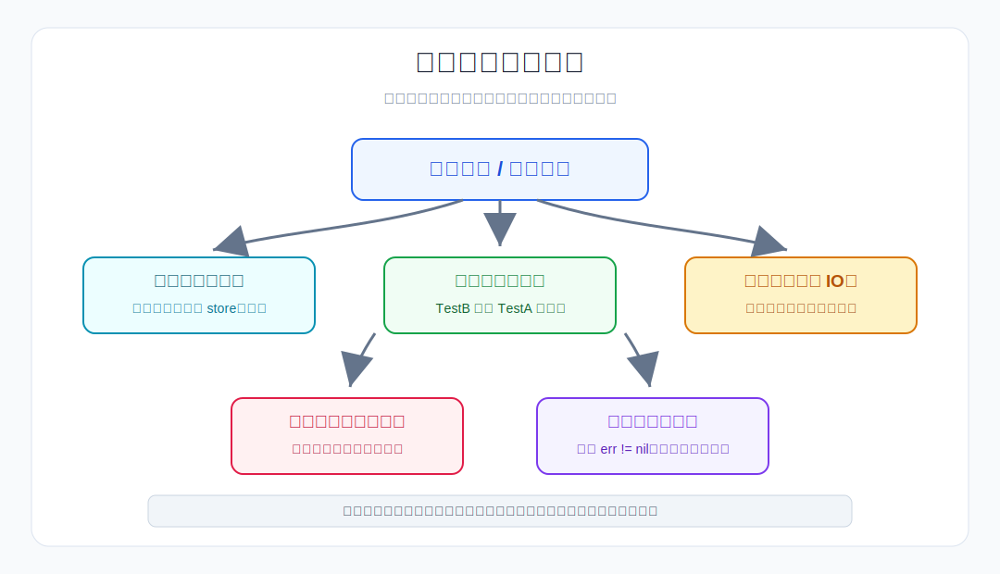

# 第 8 章 单元测试基础

## 场景

上一章我们用 Context 解决了超时和取消问题，用户管理服务上线运行稳定。

三个月后，新同事接到需求：给 `CreateUser` 加一个"用户名长度校验"功能。他改了几行代码，跑了一下 main 函数，看起来没问题，提交了。

两天后，线上告警：所有用户注册都返回 500。

排查发现：他改 `CreateUser` 时，不小心把邮箱格式校验的逻辑删了。测试环境没覆盖到这个场景，上线后脏数据直接写进了数据库。

你问他："你没有跑测试吗？"

他说："我们没有单元测试啊。"

这就是本章要解决的问题。

用户管理服务已经有了一些手动验证的流程，但没有自动化测试。每次改代码都是"盲改"——改了哪里、影响了什么、有没有引入新 bug，全靠人肉验证。

本章从上面的真实场景出发，讲清楚：
1. Go 的测试机制怎么用
2. 什么是表驱动测试，为什么 Go 社区推崇它
3. 如何用 Mock 隔离外部依赖
4. 测试覆盖率怎么看、怎么用
5. 并行测试和测试最佳实践

> 所有代码都在 `08-unit-testing/` 目录下，每个 example 独立可运行。

---

## 8.1 没有测试的代码

> 代码：`example1-basic/`

先看一个没有测试的场景。

### 8.1.1 一个"改坏了"的例子

假设 `CreateUser` 原来的逻辑是：

```go
func (s *UserService) CreateUser(name, email string) (*User, error) {
    if name == "" {
        return nil, ErrNameEmpty
    }
    if email == "" {
        return nil, ErrEmailEmpty
    }
    if !strings.Contains(email, "@") {
        return nil, ErrEmailInvalid
    }
    // ... 保存用户
}
```

新同事要加"用户名长度校验"，改完之后：

```go
func (s *UserService) CreateUser(name, email string) (*User, error) {
    if name == "" {
        return nil, ErrNameEmpty
    }
    // 新增：用户名长度校验
    if len(name) > 50 {
        return nil, ErrNameTooLong
    }
    // 不小心删掉了邮箱校验
    // if email == "" { ... }
    // if !strings.Contains(email, "@") { ... }

    // ... 保存用户
}
```

如果没有测试，这个 bug 要到线上才会被发现。

### 8.1.2 如果有测试

```go
func TestCreateUser_EmptyEmail(t *testing.T) {
    store := newMockStore()
    svc := NewUserService(store)

    _, err := svc.CreateUser("Alice", "")
    if err == nil {
        t.Fatal("Expected error for empty email")
    }
}

func TestCreateUser_InvalidEmail(t *testing.T) {
    store := newMockStore()
    svc := NewUserService(store)

    _, err := svc.CreateUser("Alice", "invalid-email")
    if err == nil {
        t.Fatal("Expected error for invalid email")
    }
}
```

只要跑了测试，改坏的瞬间就会报错：

```
--- FAIL: TestCreateUser_EmptyEmail (0.00s)
    user_test.go:12: Expected error for empty email
--- FAIL: TestCreateUser_InvalidEmail (0.00s)
    user_test.go:22: Expected error for invalid email
```

**测试的价值：在代码提交之前发现问题。**

### 8.1.3 测试金字塔



| 层级 | 说明 | 速度 | 数量 |
|------|------|------|------|
| 单元测试 | 测试单个函数/方法 | 毫秒级 | 最多 |
| 集成测试 | 测试多个模块协作 | 秒级 | 中等 |
| 端到端测试 | 测试完整用户流程 | 分钟级 | 最少 |

从投入产出来看，单元测试应该是最多的一层；集成测试用于验证模块协作；端到端测试覆盖关键链路即可，不适合替代大量单元测试。

本章聚焦**单元测试**：测试单个函数或方法的行为是否符合预期。

---

## 8.2 Go 测试基础

> 代码：`example1-basic/`

### 8.2.1 testing 包

Go 内置了 `testing` 包，不需要安装任何第三方库就能写测试。

测试文件命名规则：
- 文件名以 `_test.go` 结尾
- 测试函数以 `Test` 开头
- 参数是 `*testing.T`

```go
// user_test.go
package user

import "testing"

func TestCreateUser(t *testing.T) {
    // 测试逻辑
}
```

### 8.2.2 第一个测试

> 代码：`example1-basic/user_test.go`

为用户管理服务写第一个测试：

```go
func TestCreateUser(t *testing.T) {
    store := newMockStore()
    svc := NewUserService(store)

    user, err := svc.CreateUser("Alice", "alice@example.com")
    if err != nil {
        t.Fatalf("CreateUser failed: %v", err)
    }
    if user.ID == 0 {
        t.Error("User ID should not be 0")
    }
    if user.Name != "Alice" {
        t.Errorf("Expected name Alice, got %s", user.Name)
    }
    if user.Email != "alice@example.com" {
        t.Errorf("Expected email alice@example.com, got %s", user.Email)
    }
}
```

运行测试：

```bash
$ go test ./example1-basic/ -v
=== RUN   TestCreateUser
--- PASS: TestCreateUser (0.00s)
PASS
```

### 8.2.3 testing.T 常用方法

| 方法 | 作用 |
|------|------|
| `t.Log()` | 打印日志 |
| `t.Error()` | 标记失败，继续执行 |
| `t.Errorf()` | 格式化输出错误，继续执行 |
| `t.Fatal()` | 标记失败，立即停止当前测试 |
| `t.Fatalf()` | 格式化输出错误，立即停止当前测试 |

**`t.Error` vs `t.Fatal` 的选择：**

- 后续断言依赖前面的结果 → 用 `t.Fatal`（避免 panic）
- 多个独立断言，想看到所有失败 → 用 `t.Error`

```go
// 用 Fatal：后续断言依赖 user 不为 nil
user, err := svc.CreateUser("Alice", "alice@example.com")
if err != nil {
    t.Fatalf("CreateUser failed: %v", err) // 立即停止
}
// 如果上面用 t.Error，这里 user 可能是 nil，会 panic
if user.Name != "Alice" { ... }

// 用 Error：多个独立断言
if user.Name != "Alice" {
    t.Errorf("Expected name Alice, got %s", user.Name) // 继续执行
}
if user.Email != "alice@example.com" {
    t.Errorf("Expected email alice@example.com, got %s", user.Email) // 继续执行
}
```

### 8.2.4 子测试

当同一个函数需要多个测试场景时，用 `t.Run` 组织子测试：

```go
func TestCreateUser(t *testing.T) {
    t.Run("正常创建", func(t *testing.T) {
        // 测试正常场景
    })

    t.Run("邮箱重复", func(t *testing.T) {
        // 测试邮箱重复场景
    })

    t.Run("保存失败", func(t *testing.T) {
        // 测试存储层错误
    })
}
```

运行时会显示子测试名称：

```
=== RUN   TestCreateUser
=== RUN   TestCreateUser/正常创建
=== RUN   TestCreateUser/邮箱重复
=== RUN   TestCreateUser/保存失败
--- PASS: TestCreateUser (0.00s)
    --- PASS: TestCreateUser/正常创建 (0.00s)
    --- PASS: TestCreateUser/邮箱重复 (0.00s)
    --- PASS: TestCreateUser/保存失败 (0.00s)
```

还可以只运行某个子测试：

```bash
$ go test -run TestCreateUser/邮箱重复 -v
```

---

## 8.3 表驱动测试

> 代码：`example2-table-driven/`

表驱动测试是 Go 社区最推崇的测试模式。它的核心思想是：**用一个数据表描述所有测试场景，然后用一个循环执行**。

### 8.3.1 不用表驱动：重复代码

```go
func TestCreateUser_EmptyName(t *testing.T) {
    store := newMockStore()
    svc := NewUserService(store)
    _, err := svc.CreateUser("", "alice@example.com")
    if err == nil {
        t.Fatal("Expected error for empty name")
    }
}

func TestCreateUser_EmptyEmail(t *testing.T) {
    store := newMockStore()
    svc := NewUserService(store)
    _, err := svc.CreateUser("Alice", "")
    if err == nil {
        t.Fatal("Expected error for empty email")
    }
}

func TestCreateUser_InvalidEmail(t *testing.T) {
    store := newMockStore()
    svc := NewUserService(store)
    _, err := svc.CreateUser("Alice", "invalid")
    if err == nil {
        t.Fatal("Expected error for invalid email")
    }
}
```

问题：每个测试函数结构几乎一样，只是输入和预期不同。代码重复，新增场景要复制粘贴。

### 8.3.2 用表驱动：数据与逻辑分离

> 代码：`example2-table-driven/user_test.go`

```go
func TestCreateUser_TableDriven(t *testing.T) {
    tests := []struct {
        name       string
        inputName  string
        inputEmail string
        setup      func(*mockStore)
        wantErrIs       error
        wantErrContains string
        wantName        string
        wantEmail       string
    }{
        {
            name:       "正常创建",
            inputName:  "Alice",
            inputEmail: "alice@example.com",
            setup:      func(s *mockStore) {},
            wantName:   "Alice",
            wantEmail:  "alice@example.com",
        },
        {
            name:       "姓名为空",
            inputName:  "",
            inputEmail: "bob@example.com",
            setup:      func(s *mockStore) {},
            wantErrIs:  ErrNameEmpty,
        },
        {
            name:       "邮箱为空",
            inputName:  "Bob",
            inputEmail: "",
            setup:      func(s *mockStore) {},
            wantErrIs:  ErrEmailEmpty,
        },
        {
            name:       "邮箱格式错误",
            inputName:  "Bob",
            inputEmail: "invalid-email",
            setup:      func(s *mockStore) {},
            wantErrIs:  ErrEmailInvalid,
        },
        {
            name:       "邮箱已存在",
            inputName:  "Bob",
            inputEmail: "alice@example.com",
            setup: func(s *mockStore) {
                s.Save(&User{Name: "Alice", Email: "alice@example.com"})
            },
            wantErrContains: "email already exists",
        },
        {
            name:       "保存失败",
            inputName:  "Alice",
            inputEmail: "alice@example.com",
            setup: func(s *mockStore) {
                s.saveErr = errors.New("database error")
            },
            wantErrContains: "save user",
        },
    }

    for _, tt := range tests {
        t.Run(tt.name, func(t *testing.T) {
            store := newMockStore()
            tt.setup(store)
            svc := NewUserService(store)

            user, err := svc.CreateUser(tt.inputName, tt.inputEmail)

            if tt.wantErrIs != nil {
                if err == nil {
                    t.Fatalf("Expected error %v, got nil", tt.wantErrIs)
                }
                if !errors.Is(err, tt.wantErrIs) {
                    t.Errorf("Expected error %v, got %v", tt.wantErrIs, err)
                }
                return
            }
            if tt.wantErrContains != "" {
                if err == nil {
                    t.Fatalf("Expected error containing %q, got nil", tt.wantErrContains)
                }
                if !strings.Contains(err.Error(), tt.wantErrContains) {
                    t.Errorf("Expected error containing %q, got %q", tt.wantErrContains, err.Error())
                }
                return
            }

            if err != nil {
                t.Fatalf("Unexpected error: %v", err)
            }
            if user.Name != tt.wantName {
                t.Errorf("Expected name %q, got %q", tt.wantName, user.Name)
            }
            if user.Email != tt.wantEmail {
                t.Errorf("Expected email %q, got %q", tt.wantEmail, user.Email)
            }
        })
    }
}
```

### 8.3.3 表驱动测试的优势

| 优势 | 说明 |
|------|------|
| 新增场景简单 | 在 tests 切片里加一个 struct 即可 |
| 代码不重复 | 断言逻辑只写一次 |
| 场景一目了然 | 所有输入/输出在一个表格里 |
| 子测试自动命名 | `t.Run(tt.name, ...)` |

### 8.3.4 表驱动测试的设计原则

1. **每个场景独立**：每个 `t.Run` 创建独立的 store 和 service
2. **setup 函数**：用于准备测试数据或注入错误
3. **错误断言要明确**：业务哨兵错误用 `errors.Is`，包装错误的上下文用 `strings.Contains` 或自定义错误类型校验
4. **命名清晰**：`name` 字段要能说明这个场景在测什么

---

## 8.4 Mock 与依赖注入

> 代码：`example3-mock/`

### 8.4.1 为什么需要 Mock

`UserService` 依赖 `UserStore` 接口。如果测试时直接用 MySQL 实现：

- 测试依赖数据库，环境搭建复杂
- 测试速度慢（网络 IO）
- 测试不稳定（数据库可能挂）
- 无法模拟错误场景（数据库故障、超时等）

**Mock 的作用：用假的实现替代真实的依赖，让测试只关注被测逻辑。**

### 8.4.2 依赖注入



第 6 章我们已经做了依赖注入：

```go
type UserService struct {
    store UserStore // 依赖接口，而不是具体实现
}

func NewUserService(store UserStore) *UserService {
    return &UserService{store: store}
}
```

因为 `UserService` 依赖的是 `UserStore` 接口，我们可以传入任何实现了这个接口的对象——生产环境传真实数据库实现，测试环境传 Mock 实现。

### 8.4.3 手写 Mock

> 代码：`example3-mock/user_test.go`

```go
type mockStore struct {
    users     map[int]*User
    saveErr   error
    findErr   error
    deleteErr error
}

func newMockStore() *mockStore {
    return &mockStore{users: make(map[int]*User)}
}

func (m *mockStore) Save(user *User) error {
    if m.saveErr != nil {
        return m.saveErr
    }
    if user.ID == 0 {
        user.ID = len(m.users) + 1
    }
    m.users[user.ID] = user
    return nil
}

func (m *mockStore) FindByID(id int) (*User, error) {
    if m.findErr != nil {
        return nil, m.findErr
    }
    user, ok := m.users[id]
    if !ok {
        return nil, fmt.Errorf("%w: id=%d", ErrUserNotFound, id)
    }
    return user, nil
}

func (m *mockStore) FindByEmail(email string) (*User, error) {
    if m.findErr != nil {
        return nil, m.findErr
    }
    for _, u := range m.users {
        if u.Email == email {
            return u, nil
        }
    }
    return nil, fmt.Errorf("%w: email=%s", ErrUserNotFound, email)
}

func (m *mockStore) Delete(id int) error {
    if m.deleteErr != nil {
        return m.deleteErr
    }
    if _, ok := m.users[id]; !ok {
        return fmt.Errorf("%w: id=%d", ErrUserNotFound, id)
    }
    delete(m.users, id)
    return nil
}
```

### 8.4.4 Mock 的使用

```go
func TestCreateUser_StoreErrors(t *testing.T) {
    tests := []struct {
        name    string
        setup   func(*mockStore)
        wantErrContains string
    }{
        {
            name: "查找邮箱失败",
            setup: func(s *mockStore) {
                s.findErr = errors.New("database connection error")
            },
            wantErrContains: "check email",
        },
        {
            name: "保存失败",
            setup: func(s *mockStore) {
                s.saveErr = errors.New("database write error")
            },
            wantErrContains: "save user",
        },
    }

    for _, tt := range tests {
        t.Run(tt.name, func(t *testing.T) {
            store := newMockStore()
            tt.setup(store)
            svc := NewUserService(store)

            _, err := svc.CreateUser("Alice", "alice@example.com")
            if err == nil {
                t.Fatal("Expected error, got nil")
            }
            if !strings.Contains(err.Error(), tt.wantErrContains) {
                t.Errorf("Expected error containing %q, got %q", tt.wantErrContains, err.Error())
            }
        })
    }
}
```

### 8.4.5 Mock 的分类

| 类型 | 说明 | 适用场景 |
|------|------|----------|
| 手写 Mock | 手动实现接口 | 接口简单，逻辑可控 |
| mockgen | 自动生成 Mock 代码 | 接口复杂，方法多 |
| testify/mock | 第三方 Mock 框架 | 需要调用验证等功能 |

**建议**：接口方法少于 5 个时手写 Mock；方法多时用 `mockgen` 自动生成。

---

## 8.5 测试覆盖率

> 代码：`example4-coverage/`

### 8.5.1 查看覆盖率

```bash
$ go test ./example4-coverage/ -cover
ok      github.com/go-book/unit-testing/example4-coverage    0.004s    coverage: 81.5% of statements
```

### 8.5.2 生成覆盖率报告

```bash
$ go test ./example4-coverage/ -coverprofile=coverage.out
$ go tool cover -func=coverage.out
```

输出：

```
github.com/go-book/unit-testing/example4-coverage/user.go:33:  CreateUser     100.0%
github.com/go-book/unit-testing/example4-coverage/user.go:55:  GetUser        100.0%
github.com/go-book/unit-testing/example4-coverage/user.go:63:  DeleteUser      75.0%
total:                                                          (statements)    81.5%
```

### 8.5.3 生成 HTML 报告

```bash
$ go tool cover -html=coverage.out -o coverage.html
```

浏览器打开 `coverage.html`，红色标记的是未覆盖的代码行。

### 8.5.4 覆盖率的正确理解

| 认知 | 说明 |
|------|------|
| 覆盖率 100% ≠ 没有 bug | 只说明代码被执行了，不说明断言是否正确 |
| 覆盖率低 = 有风险 | 大量代码没被测试覆盖 |
| 覆盖率是参考指标 | 不要为了追求数字而写无意义的断言 |

**建议**：核心业务逻辑覆盖率 > 80%，工具函数 > 70%。

---

## 8.6 测试最佳实践

### 8.6.1 测试命名规范

测试命名没有唯一标准，关键是团队统一、失败时能快速看懂。常见格式是：`Test函数名_场景_预期结果`。

```go
func TestCreateUser_EmptyName_ReturnError(t *testing.T) { ... }
func TestCreateUser_DuplicateEmail_ReturnError(t *testing.T) { ... }
func TestCreateUser_Success_ReturnUser(t *testing.T) { ... }
```

或者用子测试：

```go
func TestCreateUser(t *testing.T) {
    t.Run("EmptyName_ReturnError", func(t *testing.T) { ... })
    t.Run("DuplicateEmail_ReturnError", func(t *testing.T) { ... })
    t.Run("Success_ReturnUser", func(t *testing.T) { ... })
}
```

如果场景较多，更推荐 `TestCreateUser` 加 `t.Run`。这样测试函数数量不会膨胀，失败输出也会带上具体场景名。

### 8.6.2 AAA 模式

Arrange（准备）→ Act（执行）→ Assert（断言）

```go
func TestGetUser_Success(t *testing.T) {
    // Arrange：准备数据
    store := newMockStore()
    svc := NewUserService(store)
    created, _ := svc.CreateUser("Alice", "alice@example.com")

    // Act：执行被测方法
    user, err := svc.GetUser(created.ID)

    // Assert：断言结果
    if err != nil {
        t.Fatalf("GetUser failed: %v", err)
    }
    if user.Name != "Alice" {
        t.Errorf("Expected name Alice, got %s", user.Name)
    }
}
```

### 8.6.3 测试数据工厂

当测试数据构造重复时，用工厂函数简化：

```go
func newTestUser() *User {
    return &User{Name: "TestUser", Email: "test@example.com"}
}

func TestCreateUser(t *testing.T) {
    store := newMockStore()
    svc := NewUserService(store)

    user := newTestUser()
    result, err := svc.CreateUser(user.Name, user.Email)
    // ...
}
```

### 8.6.4 并行测试

> 代码：`example5-parallel/`

用 `t.Parallel()` 让测试并行执行，加快测试速度：

```go
func TestCreateUser_Parallel(t *testing.T) {
    tests := []struct {
        name       string
        inputName  string
        inputEmail string
        wantErr    error
    }{
        {"正常创建_Alice", "Alice", "alice@example.com", nil},
        {"正常创建_Bob", "Bob", "bob@example.com", nil},
        {"姓名为空", "", "charlie@example.com", ErrNameEmpty},
        {"邮箱格式错误", "Dave", "invalid-email", ErrEmailInvalid},
    }

    for _, tt := range tests {
        t.Run(tt.name, func(t *testing.T) {
            t.Parallel() // 标记为并行测试

            store := newMockStore()
            svc := NewUserService(store)

            _, err := svc.CreateUser(tt.inputName, tt.inputEmail)

            if tt.wantErr != nil {
                if !errors.Is(err, tt.wantErr) {
                    t.Errorf("Expected error %v, got %v", tt.wantErr, err)
                }
                return
            }
            if err != nil {
                t.Fatalf("Unexpected error: %v", err)
            }
        })
    }
}
```

**并行测试注意事项**：

1. 每个子测试必须有独立的状态（不能共享 store）
2. 循环变量要捕获（Go 1.22 之前需要 `tt := tt`）
3. 如果 Mock 不是线程安全的，需要加锁

### 8.6.5 测试辅助函数

当断言逻辑重复时，抽取辅助函数：

```go
func assertUserEqual(t *testing.T, got, want *User) {
    t.Helper() // 标记为辅助函数，错误报告时显示调用位置
    if got.Name != want.Name {
        t.Errorf("Name: got %q, want %q", got.Name, want.Name)
    }
    if got.Email != want.Email {
        t.Errorf("Email: got %q, want %q", got.Email, want.Email)
    }
}

func TestGetUser(t *testing.T) {
    store := newMockStore()
    svc := NewUserService(store)
    created, _ := svc.CreateUser("Alice", "alice@example.com")

    user, err := svc.GetUser(created.ID)
    if err != nil {
        t.Fatalf("GetUser failed: %v", err)
    }

    assertUserEqual(t, user, &User{Name: "Alice", Email: "alice@example.com"})
}
```

`t.Helper()` 的作用：当断言失败时，错误信息显示的是调用 `assertUserEqual` 的位置，而不是辅助函数内部。

### 8.6.6 常用测试工具

除了 `go test`，Go 还提供了一些日常很常用的测试能力。

| 工具 | 作用 |
|------|------|
| `go test -run TestCreateUser` | 只运行名称匹配的测试 |
| `go test -run TestCreateUser/邮箱重复` | 只运行某个子测试 |
| `go test -count=1 ./...` | 禁用测试缓存，强制重新运行 |
| `go test -race ./...` | 开启数据竞争检测 |
| `t.Cleanup(fn)` | 测试结束后自动清理资源 |
| `t.TempDir()` | 创建测试专用临时目录，结束后自动删除 |
| `t.Setenv(key, value)` | 设置环境变量，测试结束后自动恢复 |

示例：

```go
func TestLoadConfig(t *testing.T) {
    dir := t.TempDir()
    t.Setenv("CONFIG_DIR", dir)

    db := openTestDB(t)
    t.Cleanup(func() {
        db.Close()
    })

    // 执行测试...
}
```

---

## 8.7 常见陷阱与排障



排查测试问题时，可以先判断它属于哪一类：是否共享状态、是否依赖执行顺序、是否访问真实 IO、是否依赖时间或随机数。

### 8.7.1 测试依赖全局状态

```go
// 错误示例：共享全局 store
var globalStore = newMockStore()

func TestCreateUser_A(t *testing.T) {
    svc := NewUserService(globalStore)
    svc.CreateUser("Alice", "alice@example.com")
}

func TestCreateUser_B(t *testing.T) {
    svc := NewUserService(globalStore)
    // globalStore 里已经有 Alice 了！
    // 如果测试依赖"空 store"，就会失败
}
```

**解决**：每个测试创建独立的 store。

### 8.7.2 测试之间有顺序依赖

```go
// 错误示例：TestB 依赖 TestA 的结果
func TestA(t *testing.T) {
    // 创建用户
}

func TestB(t *testing.T) {
    // 假设 TestA 已经创建了用户
    // 如果 TestA 没跑或失败了，TestB 也会失败
}
```

**解决**：每个测试独立，不依赖其他测试的执行结果。

### 8.7.3 测试太慢

```go
// 错误示例：测试里真的去连数据库
func TestCreateUser(t *testing.T) {
    db, _ := sql.Open("mysql", "root:password@/testdb")
    store := NewMySQLStore(db)
    svc := NewUserService(store)
    // 每次测试都要等数据库连接...
}
```

**解决**：用 Mock 替代真实依赖。

### 8.7.4 测试不稳定（Flaky Test）

```go
// 错误示例：依赖时间
func TestTokenExpiry(t *testing.T) {
    token := createToken()
    time.Sleep(1 * time.Second) // 等 1 秒
    if !token.IsExpired() {
        t.Error("Token should be expired")
    }
}
```

问题：这个测试依赖真实时间和调度。机器负载、定时器精度、边界条件变化，都可能让测试偶尔失败或变慢。

**解决**：注入时间源，而不是用 `time.Now()`。

```go
type Clock interface {
    Now() time.Time
}

type realClock struct{}
func (c realClock) Now() time.Time { return time.Now() }

type mockClock struct {
    now time.Time
}
func (c mockClock) Now() time.Time { return c.now }
```

### 8.7.5 排障清单

| 问题 | 排查方向 |
|------|----------|
| 测试偶尔失败 | 是否依赖时间、随机数、并发顺序 |
| 测试在 CI 失败，本地通过 | 是否依赖本地环境（文件路径、数据库） |
| 测试互相影响 | 是否共享全局状态 |
| 测试太慢 | 是否有真实 IO（网络、数据库） |
| 覆盖率很高但有 bug | 断言是否太弱（只检查了 err != nil） |

---

## 8.8 实战：为用户管理服务补全测试

> 代码：`example3-mock/`

综合本章所学，为用户管理服务的三个核心方法补全测试。

### 8.8.1 测试清单

| 方法 | 场景 | 预期 |
|------|------|------|
| `CreateUser` | 正常创建 | 返回用户，无错误 |
| `CreateUser` | 姓名为空 | 返回 `ErrNameEmpty` |
| `CreateUser` | 邮箱为空 | 返回 `ErrEmailEmpty` |
| `CreateUser` | 邮箱格式错误 | 返回 `ErrEmailInvalid` |
| `CreateUser` | 邮箱已存在 | 返回错误 |
| `CreateUser` | 存储层查找失败 | 返回包装错误 |
| `CreateUser` | 存储层保存失败 | 返回包装错误 |
| `GetUser` | 正常获取 | 返回用户 |
| `GetUser` | 用户不存在 | 返回错误 |
| `GetUser` | 无效 ID | 返回错误 |
| `DeleteUser` | 正常删除 | 无错误 |
| `DeleteUser` | 用户不存在 | 返回错误 |
| `DeleteUser` | 无效 ID | 返回错误 |

### 8.8.2 完整测试代码

> 代码：`example3-mock/user_test.go`

```go
func TestCreateUser_Success(t *testing.T) {
    store := newMockStore()
    svc := NewUserService(store)

    user, err := svc.CreateUser("Alice", "alice@example.com")
    if err != nil {
        t.Fatalf("CreateUser failed: %v", err)
    }
    if user.Name != "Alice" {
        t.Errorf("Expected name Alice, got %s", user.Name)
    }
    if user.Email != "alice@example.com" {
        t.Errorf("Expected email alice@example.com, got %s", user.Email)
    }
}

func TestCreateUser_ValidationErrors(t *testing.T) {
    tests := []struct {
        name       string
        inputName  string
        inputEmail string
        wantErr    error
    }{
        {"姓名为空", "", "alice@example.com", ErrNameEmpty},
        {"邮箱为空", "Alice", "", ErrEmailEmpty},
        {"邮箱格式错误", "Alice", "invalid-email", ErrEmailInvalid},
    }

    for _, tt := range tests {
        t.Run(tt.name, func(t *testing.T) {
            store := newMockStore()
            svc := NewUserService(store)

            _, err := svc.CreateUser(tt.inputName, tt.inputEmail)
            if !errors.Is(err, tt.wantErr) {
                t.Errorf("Expected error %v, got %v", tt.wantErr, err)
            }
        })
    }
}

func TestCreateUser_StoreErrors(t *testing.T) {
    tests := []struct {
        name    string
        setup   func(*mockStore)
        wantErrContains string
    }{
        {
            name: "查找邮箱失败",
            setup: func(s *mockStore) {
                s.findErr = errors.New("database connection error")
            },
            wantErrContains: "check email",
        },
        {
            name: "保存失败",
            setup: func(s *mockStore) {
                s.saveErr = errors.New("database write error")
            },
            wantErrContains: "save user",
        },
    }

    for _, tt := range tests {
        t.Run(tt.name, func(t *testing.T) {
            store := newMockStore()
            tt.setup(store)
            svc := NewUserService(store)

            _, err := svc.CreateUser("Alice", "alice@example.com")
            if err == nil {
                t.Fatal("Expected error, got nil")
            }
            if !strings.Contains(err.Error(), tt.wantErrContains) {
                t.Errorf("Expected error containing %q, got %q", tt.wantErrContains, err.Error())
            }
        })
    }
}

func TestGetUser(t *testing.T) {
    store := newMockStore()
    svc := NewUserService(store)

    created, _ := svc.CreateUser("Alice", "alice@example.com")

    user, err := svc.GetUser(created.ID)
    if err != nil {
        t.Fatalf("GetUser failed: %v", err)
    }
    if user.ID != created.ID {
        t.Errorf("Expected ID %d, got %d", created.ID, user.ID)
    }
}

func TestGetUser_InvalidID(t *testing.T) {
    store := newMockStore()
    svc := NewUserService(store)

    _, err := svc.GetUser(0)
    if err == nil {
        t.Error("Expected error for ID 0")
    }

    _, err = svc.GetUser(-1)
    if err == nil {
        t.Error("Expected error for negative ID")
    }
}

func TestDeleteUser(t *testing.T) {
    store := newMockStore()
    svc := NewUserService(store)

    created, _ := svc.CreateUser("Alice", "alice@example.com")

    err := svc.DeleteUser(created.ID)
    if err != nil {
        t.Fatalf("DeleteUser failed: %v", err)
    }

    _, err = svc.GetUser(created.ID)
    if err == nil {
        t.Error("Expected error after deletion")
    }
}

func TestDeleteUser_InvalidID(t *testing.T) {
    store := newMockStore()
    svc := NewUserService(store)

    err := svc.DeleteUser(0)
    if err == nil {
        t.Error("Expected error for ID 0")
    }
}
```

运行测试：

```bash
$ go test ./example3-mock/ -v
=== RUN   TestCreateUser_Success
--- PASS: TestCreateUser_Success (0.00s)
=== RUN   TestCreateUser_ValidationErrors
=== RUN   TestCreateUser_ValidationErrors/姓名为空
=== RUN   TestCreateUser_ValidationErrors/邮箱为空
=== RUN   TestCreateUser_ValidationErrors/邮箱格式错误
--- PASS: TestCreateUser_ValidationErrors (0.00s)
=== RUN   TestCreateUser_StoreErrors
=== RUN   TestCreateUser_StoreErrors/查找邮箱失败
=== RUN   TestCreateUser_StoreErrors/保存失败
--- PASS: TestCreateUser_StoreErrors (0.00s)
=== RUN   TestGetUser
--- PASS: TestGetUser (0.00s)
=== RUN   TestGetUser_InvalidID
--- PASS: TestGetUser_InvalidID (0.00s)
=== RUN   TestDeleteUser
--- PASS: TestDeleteUser (0.00s)
=== RUN   TestDeleteUser_InvalidID
--- PASS: TestDeleteUser_InvalidID (0.00s)
PASS
```

---

## 小结

本章回答了五个问题：

**1. Go 的测试机制怎么用？**

- 测试文件以 `_test.go` 结尾
- 测试函数以 `Test` 开头，参数是 `*testing.T`
- `t.Error` 标记失败继续执行，`t.Fatal` 标记失败立即停止
- `t.Run` 组织子测试

**2. 什么是表驱动测试？**

- 用数据表描述所有测试场景
- 用一个循环执行所有场景
- 新增场景只需加一行数据

**3. 如何用 Mock 隔离外部依赖？**

- 依赖接口而不是具体实现
- 手写 Mock 实现接口
- 通过 setup 函数注入错误

**4. 测试覆盖率怎么看？**

- `go test -cover` 查看覆盖率
- `go tool cover -func` 查看函数级覆盖率
- 覆盖率是参考指标，不是目标

**5. 测试有哪些最佳实践？**

- AAA 模式：Arrange → Act → Assert
- 每个测试独立，不依赖全局状态
- 用 `t.Parallel()` 加速测试
- 用 `t.Helper()` 标记辅助函数

从下一章开始，我们进入第二阶段：Web 服务开发。你会用 Gin 框架把用户管理服务变成一个真正的 HTTP API。

---

## 面试题

**Q1：Go 的测试文件有什么命名规则？**

A：
- 文件名以 `_test.go` 结尾
- 测试函数以 `Test` 开头，后面跟大写字母或下划线
- 测试文件不需要在 `main` 包里，可以和被测文件在同一个包

**Q2：什么是表驱动测试？为什么 Go 推崇？**

A：
- 表驱动测试是用一个数据结构（通常是切片）描述所有测试场景，然后用循环执行
- Go 推崇的原因：语法简洁，新增场景方便，场景一目了然
- 配合 `t.Run` 可以实现子测试，每个场景独立命名

**Q3：如何 Mock 外部依赖？**

A：
- 定义接口，让业务逻辑依赖接口而不是具体实现
- 手写 Mock 实现接口，或者用 `mockgen` 自动生成
- 在测试中传入 Mock 实现，替代真实的数据库、网络等依赖

**Q4：测试覆盖率 100% 意味着没有 bug 吗？**

A：
- 不是。覆盖率只说明代码被执行了，不说明断言是否正确
- 可能代码执行了，但断言太弱（比如只检查了 `err != nil`，没检查具体错误类型）
- 覆盖率是参考指标，不是目标

**Q5：`t.Parallel()` 有什么注意事项？**

A：
- 每个并行测试必须有独立的状态，不能共享变量
- 循环变量要正确捕获（Go 1.22 之前需要 `tt := tt`）
- 如果 Mock 不是线程安全的，需要加锁
- 并行测试的输出顺序不确定

**Q6：如何避免测试之间的相互影响？**

A：
- 每个测试创建独立的依赖（独立的 store、独立的 service）
- 不依赖全局变量或全局状态
- 不依赖其他测试的执行顺序或结果
- 用 `t.Cleanup()` 清理资源
