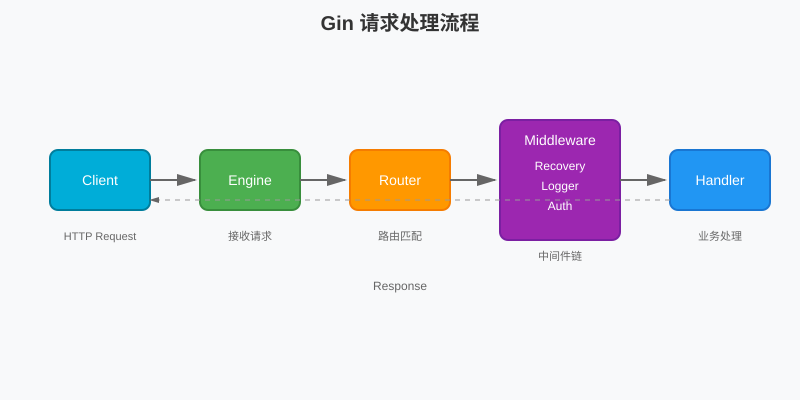
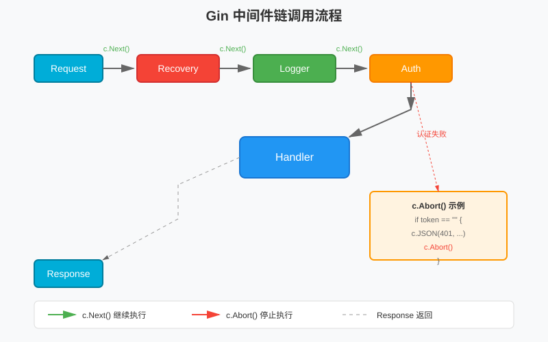
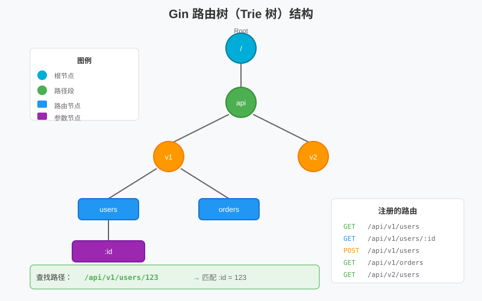

# 第 9 章 Gin 框架实战

## 场景：从标准库用户 API 到 Gin 后台 API

第一阶段我们用 `net/http` 标准库实现了用户管理 API。服务能跑，但 Leader 说："团队其他人都在用 Gin，你也切过来吧。"

为什么要升级？因为标准库版本有 5 个明显的痛点。

## 问题：标准库版本的 5 个痛点

回顾第一阶段的用户管理 API，这些代码是不是很熟悉？

**痛点 1：路径参数手动解析**

```go
// 标准库：手动切字符串
path := "/api/users/123"
parts := strings.Split(path, "/")
id := parts[len(parts)-1]
```

**痛点 2：查询参数手动转换**

```go
// 标准库：手动解析和转换
pageStr := r.URL.Query().Get("page")
page, _ := strconv.Atoi(pageStr)
```

**痛点 3：JSON 绑定手动解码**

```go
// 标准库：手动解码
var req CreateUserReq
if err := json.NewDecoder(r.Body).Decode(&req); err != nil {
    http.Error(w, err.Error(), http.StatusBadRequest)
    return
}
```

**痛点 4：中间件链式调用复杂**

```go
// 标准库：手动包装
handler := loggingMiddleware(authMiddleware(handler))
```

**痛点 5：路由分组需要手动拼接**

```go
// 标准库：手动拼接路径
http.HandleFunc("/api/v1/users", usersHandler)
http.HandleFunc("/api/v1/orders", ordersHandler)
```

Gin 就是为了解决这些问题而生的。本章我们会用 Gin 重写后台管理系统 API，一步步解决这些痛点。

> 所有代码都在 `09-gin-framework/` 目录下，每个 example 独立可运行。

---

## 实现一：搭建 Gin 服务骨架

> 代码：`example1-hello/main.go`

**解决问题**：用最少的代码启动一个 HTTP 服务。

```go
package main

import (
    "net/http"
    "github.com/gin-gonic/gin"
)

func main() {
    r := gin.Default()

    r.GET("/hello", func(c *gin.Context) {
        c.JSON(http.StatusOK, gin.H{
            "message": "Hello, Gin!",
        })
    })

    r.Run(":8080")
}
```

运行：

```bash
cd example1-hello
go run main.go

# 另一个终端
curl http://localhost:8080/hello
# {"message":"Hello, Gin!"}
```

**对比标准库版本：**

```go
// 标准库版本
func helloHandler(w http.ResponseWriter, r *http.Request) {
    w.Header().Set("Content-Type", "application/json")
    w.WriteHeader(http.StatusOK)
    json.NewEncoder(w).Encode(map[string]string{"message": "Hello!"})
}

func main() {
    http.HandleFunc("/hello", helloHandler)
    http.ListenAndServe(":8080", nil)
}
```

**Gin 的优势：**
- `c.JSON()` 自动设置 Content-Type
- `gin.H` 快速构造 JSON
- `r.GET()` 声明式路由
- `gin.Default()` 自带 Recovery 和 Logger 中间件

这段代码适合快速体验 Gin。正式服务不要只依赖 `r.Run()`，后面的用户管理 API 会使用 `gin.New()`、自定义中间件、`http.Server` 超时配置和优雅退出。

---

## 实现二：路由分组与版本管理

> 代码：`example6-group/main.go`

**解决问题**：优雅地组织路由，支持版本管理和分组中间件。

### 路由分组

```go
// API v1
v1 := r.Group("/api/v1")
{
    v1.GET("/users", listUsers)
    v1.POST("/users", createUser)
}

// API v2
v2 := r.Group("/api/v2")
{
    v2.GET("/users", listUsersV2)
}
```

### 分组中间件

```go
// 需要认证的接口
api := r.Group("/api")
api.Use(Auth())
{
    api.GET("/users", listUsers)
    api.POST("/users", createUser)
}

// 管理后台（需要认证 + 管理员角色）
admin := r.Group("/admin")
admin.Use(Auth(), AdminRole())
{
    admin.GET("/dashboard", dashboard)
    admin.GET("/settings", settings)
}
```

**对比标准库：**

```go
// 标准库：手动拼接路径
http.HandleFunc("/api/v1/users", usersHandler)
http.HandleFunc("/api/v2/users", usersHandlerV2)
```

Gin 的 `Group()` 方法让路由组织更清晰，分组中间件自动应用到组内所有路由。

---

## 实现三：请求绑定与参数校验

> 代码：`example4-binding/main.go`

**解决问题**：自动解析请求参数并校验。

### JSON 绑定

```go
type CreateUserReq struct {
    Name  string `json:"name" binding:"required,min=2,max=50"`
    Email string `json:"email" binding:"required,email"`
    Age   int    `json:"age" binding:"gte=0,lte=150"`
}

r.POST("/users", func(c *gin.Context) {
    var req CreateUserReq
    if err := c.ShouldBindJSON(&req); err != nil {
        c.JSON(http.StatusBadRequest, gin.H{"error": err.Error()})
        return
    }
    // 使用 req
})
```

```bash
# 成功
curl -X POST http://localhost:8080/users \
  -H "Content-Type: application/json" \
  -d '{"name":"Alice","email":"alice@example.com","age":30}'

# 失败：缺少必填字段
curl -X POST http://localhost:8080/users \
  -H "Content-Type: application/json" \
  -d '{"name":"Alice"}'
# {"error":"Key: 'CreateUserReq.Email' Error:Field validation for 'Email' failed..."}
```

### 验证规则

| 规则 | 说明 | 示例 |
|------|------|------|
| `required` | 必填 | `binding:"required"` |
| `email` | 邮箱格式 | `binding:"email"` |
| `min` / `max` | 最小/最大长度 | `binding:"min=2,max=50"` |
| `gte` / `lte` | 大于等于/小于等于 | `binding:"gte=0,lte=150"` |
| `omitempty` | 空值时跳过验证 | `binding:"omitempty,email"` |

### 不同 Content-Type

```go
// JSON body
c.ShouldBindJSON(&req)

// Query parameters
c.ShouldBindQuery(&req)

// URL path parameters
c.ShouldBindUri(&req)

// Form data
c.ShouldBind(&req)
```

**对比标准库：**

```go
// 标准库：手动解码和校验
var req CreateUserReq
if err := json.NewDecoder(r.Body).Decode(&req); err != nil {
    http.Error(w, err.Error(), http.StatusBadRequest)
    return
}
if req.Name == "" {
    http.Error(w, "name is required", http.StatusBadRequest)
    return
}
```

Gin 的 `ShouldBindJSON()` 一行代码完成解码和校验。

---

## 实现四：统一响应与错误处理

**解决问题**：统一的响应格式，便于客户端处理。

### 统一响应结构

```go
type Response struct {
    Code    int         `json:"code"`
    Message string      `json:"message"`
    Data    interface{} `json:"data,omitempty"`
}

// 成功响应
c.JSON(http.StatusOK, Response{
    Code:    0,
    Message: "success",
    Data:    user,
})

// 错误响应
c.JSON(http.StatusBadRequest, Response{
    Code:    10001,
    Message: "invalid parameter",
})
```

注意：`http.StatusBadRequest` 是 HTTP 状态码，`Code: 10001` 是业务错误码。客户端可以先看 HTTP 状态判断请求是否成功，再看业务错误码做精确处理。

### 为什么要统一响应格式？

1. **客户端可以统一处理**：所有接口返回相同结构
2. **错误码可判断**：通过 `code` 字段判断业务状态
3. **便于日志追踪**：统一格式便于日志分析

### 错误处理示例

```go
// 参数错误
c.JSON(http.StatusBadRequest, Response{
    Code:    10001,
    Message: "invalid request body",
})

// 资源不存在
c.JSON(http.StatusNotFound, Response{
    Code:    20001,
    Message: "user not found",
})

// 内部错误
c.JSON(http.StatusInternalServerError, Response{
    Code:    10000,
    Message: "internal server error",
})
```

---

## 实现五：中间件链路

> 代码：`example3-middleware/main.go`

**解决问题**：优雅地实现日志、认证、CORS 等横切关注点。

### 中间件基础

```go
func Logger() gin.HandlerFunc {
    return func(c *gin.Context) {
        start := time.Now()
        
        // 处理请求
        c.Next()
        
        // 记录日志
        latency := time.Since(start)
        log.Printf("%s %s %v", c.Request.Method, c.Request.URL.Path, latency)
    }
}

// 使用
r.Use(Logger())
```

### 中间件执行顺序



```go
// 全局中间件
r.Use(gin.Recovery())  // 1. Panic 恢复
r.Use(Logger())         // 2. 请求日志

// 路由组中间件
api := r.Group("/api")
api.Use(Auth())         // 3. 认证
{
    api.GET("/users", listUsers)
}
```



### `c.Next()` vs `c.Abort()`

```go
func Auth() gin.HandlerFunc {
    return func(c *gin.Context) {
        token := c.GetHeader("Authorization")
        if token == "" {
            c.JSON(http.StatusUnauthorized, gin.H{"error": "unauthorized"})
            c.Abort()  // 停止执行后续中间件和 Handler
            return
        }
        c.Next()  // 继续执行
    }
}
```

### 常用中间件

**Recovery（panic 恢复）：**

```go
r.Use(gin.Recovery())
```

**Logger（请求日志）：**

```go
r.Use(gin.Logger())
```

**CORS（跨域）：**

```go
func CORS() gin.HandlerFunc {
    return func(c *gin.Context) {
        c.Header("Access-Control-Allow-Origin", "*")
        c.Header("Access-Control-Allow-Methods", "GET, POST, PUT, DELETE")
        c.Header("Access-Control-Allow-Headers", "Content-Type, Authorization")
        
        if c.Request.Method == "OPTIONS" {
            c.AbortWithStatus(http.StatusOK)
            return
        }
        c.Next()
    }
}
```

**对比标准库：**

```go
// 标准库：手动包装
handler := loggingMiddleware(authMiddleware(corsMiddleware(handler)))
```

Gin 的 `Use()` 方法让中间件注册更清晰，执行顺序更直观。

---

## 实现六：用户管理 CRUD

> 代码：`example7-admin-api/`

**解决问题**：用 Gin 实现完整的用户管理 API。

### 项目结构

```
example7-admin-api/
├── main.go              # 服务启动、超时配置、优雅退出
├── router.go            # 路由注册，便于测试复用
├── router_test.go       # HTTP 接口测试
├── handler/
│   └── user.go          # 用户处理器
├── model/
│   └── user.go          # 数据模型
├── store/
│   └── memory.go        # 内存存储
├── middleware/
│   ├── logger.go        # 日志中间件
│   └── recovery.go      # 恢复中间件
└── response/
    └── response.go      # 统一响应
```

### 生产启动骨架

快速体验可以使用 `gin.Default()` 和 `r.Run(":8080")`。正式服务建议显式创建 `http.Server`：

```go
srv := &http.Server{
    Addr:              ":8080",
    Handler:           r,
    ReadHeaderTimeout: 5 * time.Second,
    ReadTimeout:       10 * time.Second,
    WriteTimeout:      10 * time.Second,
    IdleTimeout:       60 * time.Second,
}

go func() {
    if err := srv.ListenAndServe(); err != nil && err != http.ErrServerClosed {
        log.Fatalf("server failed: %v", err)
    }
}()

quit := make(chan os.Signal, 1)
signal.Notify(quit, syscall.SIGINT, syscall.SIGTERM)
<-quit

ctx, cancel := context.WithTimeout(context.Background(), 5*time.Second)
defer cancel()
_ = srv.Shutdown(ctx)
```

### 用户管理 CRUD

**创建用户：**

```bash
curl -X POST http://localhost:8080/api/v1/users \
  -H "Content-Type: application/json" \
  -d '{"name":"Alice","email":"alice@example.com"}'
# {"code":0,"message":"success","data":{"id":1,"name":"Alice","email":"alice@example.com"}}
```

**查询用户列表：**

```bash
curl "http://localhost:8080/api/v1/users?page=1&size=10"
# {"code":0,"message":"success","data":[...],"total":1,"page":1,"size":10}
```

**更新用户：**

```bash
curl -X PUT http://localhost:8080/api/v1/users/1 \
  -H "Content-Type: application/json" \
  -d '{"name":"Alice Updated"}'
```

**删除用户：**

```bash
curl -X DELETE http://localhost:8080/api/v1/users/1
```

### 错误处理

**参数错误：**

```bash
curl -X POST http://localhost:8080/api/v1/users \
  -H "Content-Type: application/json" \
  -d '{"name":"A"}'
# {"code":10001,"message":"Name must be at least 2 characters"}
```

**资源不存在：**

```bash
curl http://localhost:8080/api/v1/users/999
# {"code":20001,"message":"user not found"}
```

---

## 扩展：文件上传如何安全落地

> 代码：`example5-upload/main.go`

**解决问题**：安全地处理文件上传。

### 单文件上传

```go
const (
    uploadDir   = "uploads"
    maxFileSize = 8 << 20 // 8 MB
)

var allowedExts = map[string]bool{
    ".jpg": true, ".jpeg": true, ".png": true,
    ".pdf": true, ".txt": true,
}

func validateUploadFile(filename string, size int64) (string, error) {
    if size <= 0 || size > maxFileSize {
        return "", fmt.Errorf("file size must be between 1 byte and 8 MB")
    }
    ext := strings.ToLower(filepath.Ext(filepath.Base(filename)))
    if !allowedExts[ext] {
        return "", fmt.Errorf("unsupported file type")
    }
    return ext, nil
}

func newUploadName(ext string) string {
    buf := make([]byte, 8)
    if _, err := rand.Read(buf); err != nil {
        return fmt.Sprintf("%d%s", time.Now().UnixNano(), ext)
    }
    return fmt.Sprintf("%d-%s%s", time.Now().UnixNano(), hex.EncodeToString(buf), ext)
}

r.POST("/upload", func(c *gin.Context) {
    file, err := c.FormFile("file")
    if err != nil {
        c.JSON(http.StatusBadRequest, gin.H{"code": 10001, "message": "file is required"})
        return
    }

    ext, err := validateUploadFile(file.Filename, file.Size)
    if err != nil {
        c.JSON(http.StatusBadRequest, gin.H{"code": 10001, "message": err.Error()})
        return
    }

    filename := newUploadName(ext)
    savePath := filepath.Join(uploadDir, filename)

    if err := c.SaveUploadedFile(file, savePath); err != nil {
        c.JSON(http.StatusInternalServerError, gin.H{"code": 10000, "message": "save failed"})
        return
    }

    c.JSON(http.StatusOK, gin.H{
        "code":    0,
        "message": "file uploaded",
        "data": gin.H{
            "filename": filepath.Base(file.Filename),
            "size":     file.Size,
            "saved_as": savePath,
        },
    })
})
```

```bash
curl -X POST http://localhost:8080/upload \
  -F "file=@test.txt"
```

### 多文件上传

```go
r.POST("/upload/multi", func(c *gin.Context) {
    form, err := c.MultipartForm()
    if err != nil {
        c.JSON(http.StatusBadRequest, gin.H{"code": 10001, "message": "invalid form data"})
        return
    }

    files := form.File["files"]
    savedFiles := make([]gin.H, 0, len(files))

    for _, file := range files {
        ext, err := validateUploadFile(file.Filename, file.Size)
        if err != nil {
            c.JSON(http.StatusBadRequest, gin.H{
                "code":    10001,
                "message": fmt.Sprintf("%s: %s", filepath.Base(file.Filename), err.Error()),
            })
            return
        }

        savePath := filepath.Join(uploadDir, newUploadName(ext))
        if err := c.SaveUploadedFile(file, savePath); err != nil {
            c.JSON(http.StatusInternalServerError, gin.H{
                "code":    10000,
                "message": fmt.Sprintf("failed to save %s", filepath.Base(file.Filename)),
            })
            return
        }

        savedFiles = append(savedFiles, gin.H{
            "filename": filepath.Base(file.Filename),
            "size":     file.Size,
            "saved_as": savePath,
        })
    }

    c.JSON(http.StatusOK, gin.H{"code": 0, "message": "files uploaded", "data": savedFiles})
})
```

### 文件大小限制

```go
// 限制上传文件大小（默认 32MB）
r.MaxMultipartMemory = 8 << 20 // 8 MB
```

### 安全建议

1. **限制文件大小**：防止大文件攻击
2. **校验文件类型**：只允许特定格式
3. **清理原始文件名**：只把 `filepath.Base(file.Filename)` 用于展示，不用于真实保存路径
4. **重命名文件**：用服务端生成的随机文件名，避免冲突和路径遍历
5. **创建专用目录**：启动时使用 `os.MkdirAll(uploadDir, 0755)` 确保存储目录存在
6. **生产存储**：不要存储在 Web 可访问目录，大文件优先上传到对象存储

---

## 原理：Gin 路由树与中间件链

现在我们已经会用 Gin 了，但 Gin 是怎么做到这么快的？中间件的执行顺序到底是什么？参数绑定背后做了什么？

### Gin 路由树



Gin 使用 **Trie 树**（前缀树）存储路由，而不是 map。

**为什么用 Trie 树？**

1. **前缀共享**：`/api/users` 和 `/api/orders` 共享 `/api/` 前缀
2. **快速查找**：O(k) 复杂度，k 为路径长度
3. **通配符支持**：`:id` 和 `*filepath`

**路由节点结构：**

```go
// tree.go
type node struct {
    path      string        // 节点路径（如 "users"）
    indices   string        // 子节点的首字符索引（如 "uo" 表示有 users 和 orders 两个子节点）
    children  []*node       // 子节点数组
    handlers  HandlersChain // 处理器链（中间件 + Handler）
    priority  uint32        // 优先级（用于优化查找顺序）
    nType     nodeType      // 节点类型：static/param/catchAll
    wildChild bool          // 是否有通配符子节点
}
```

**路由查找过程（`getValue` 方法）：**

```go
// tree.go（简化版）
func (n *node) getValue(path string, params *Params) (handlers HandlersChain, tsr bool) {
walk:
    for {
        // 1. 检查前缀匹配
        if len(path) > len(n.path) {
            if path[:len(n.path)] != n.path {
                return nil, false  // 不匹配
            }
            path = path[len(n.path):]  // 去掉已匹配的前缀
        }
        
        // 2. 查找子节点
        idxc := path[0]
        for i, c := range []byte(n.indices) {
            if c == idxc {
                n = n.children[i]
                continue walk  // 继续匹配下一个节点
            }
        }
        
        // 3. 处理参数节点
        if n.wildChild {
            n = n.children[len(n.children)-1]
            
            switch n.nType {
            case param:
                // 查找参数结束位置（/ 或路径结尾）
                end := 0
                for end < len(path) && path[end] != '/' {
                    end++
                }
                
                // 保存参数值
                if params != nil {
                    *params = append(*params, Param{
                        Key:   n.path[1:],  // 去掉 ':'
                        Value: path[:end],
                    })
                }
                
                // 继续匹配剩余路径
                if end < len(path) {
                    path = path[end:]
                    n = n.children[0]
                    continue walk
                }
                
                return n.handlers, false
                
            case catchAll:
                // 保存通配符参数
                if params != nil {
                    *params = append(*params, Param{
                        Key:   n.path[2:],  // 去掉 '*'
                        Value: path,
                    })
                }
                return n.handlers, false
            }
        }
        
        // 4. 完全匹配
        if path == n.path {
            return n.handlers, false
        }
        
        return nil, false
    }
}
```

**查找示例：**

假设注册了以下路由：
- `/api/users`
- `/api/users/:id`
- `/api/orders`

查找 `/api/users/123`：

```
1. 从根节点开始
2. 匹配 "api"，进入 api 节点
3. 匹配 "users"，进入 users 节点
4. 剩余路径 "/123"，检查子节点
5. 发现参数节点 ":id"，匹配 "123"
6. 保存参数 {Key: "id", Value: "123"}
7. 返回 handlers
```

**`indices` 的优化：**

`indices` 是一个字符串，存储所有子节点的首字符。例如：

```go
node.indices = "uo"  // 表示有两个子节点，首字符分别是 'u' 和 'o'
```

查找时，通过遍历 `indices` 快速定位子节点，避免遍历整个 `children` 数组。

### 中间件链源码

Gin 的中间件链看似简单，但源码实现很精巧。让我们看看 `c.Next()` 和 `c.Abort()` 是怎么工作的。

**Context 结构体中的关键字段：**

```go
// context.go
type Context struct {
    handlers HandlersChain  // 处理器链（中间件 + Handler）
    index    int8           // 当前执行到的位置
    // ...
}

const abortIndex int8 = math.MaxInt8 >> 1  // 63
```

**`Next()` 的实现：**

```go
// context.go
func (c *Context) Next() {
    c.index++
    for c.index < int8(len(c.handlers)) {
        c.handlers[c.index](c)
        c.index++
    }
}
```

**执行过程：**

1. `index` 从 -1 开始
2. 每次调用 `Next()`，`index` 递增
3. 执行 `handlers[index]`（当前中间件或 Handler）
4. 循环直到所有处理器执行完毕

**`Abort()` 的实现：**

```go
// context.go
func (c *Context) Abort() {
    c.index = abortIndex  // 设置为 63
}

func (c *Context) IsAborted() bool {
    return c.index >= abortIndex
}
```

**为什么设置为 63？**

- `abortIndex` 是一个很大的值（63）
- 设置后，`Next()` 的循环条件 `c.index < len(c.handlers)` 不再满足
- 后续处理器不会被执行

**完整执行流程：**

```
请求进入
  ↓
index = -1
  ↓
调用 Next()
  ↓
index = 0，执行 handlers[0]（Recovery 中间件）
  ↓
Recovery 调用 Next()
  ↓
index = 1，执行 handlers[1]（Logger 中间件）
  ↓
Logger 调用 Next()
  ↓
index = 2，执行 handlers[2]（Auth 中间件）
  ↓
Auth 调用 Next()
  ↓
index = 3，执行 handlers[3]（业务 Handler）
  ↓
Handler 执行完毕，返回
  ↓
Auth 继续执行（记录日志等）
  ↓
Logger 继续执行
  ↓
Recovery 继续执行
  ↓
响应返回
```

**如果 Auth 失败：**

```
Auth 中间件
  ↓
调用 c.Abort()
  ↓
index = 63
  ↓
Auth 返回
  ↓
Logger 的 Next() 循环结束（63 >= len(handlers)）
  ↓
Logger 返回
  ↓
Recovery 的 Next() 循环结束
  ↓
响应返回（401）
```

**设计亮点：**

1. **简洁**：只需要一个 `index` 字段就能控制整个链
2. **高效**：没有递归调用，只是简单的循环
3. **灵活**：中间件可以在 `Next()` 前后执行逻辑（前置/后置处理）
4. **安全**：`Abort()` 不会中断当前处理器，只阻止后续处理器

### 参数绑定源码

参数绑定是 Gin 的核心功能之一。让我们看看 `ShouldBindJSON()` 背后发生了什么。

**调用链：**

```
c.ShouldBindJSON(&req)
  ↓
c.ShouldBindWith(obj, binding.JSON)
  ↓
binding.JSON.Bind(req, obj)
  ↓
json.Unmarshal(body, obj)
  ↓
validate(obj)
```

**JSON 绑定的实现：**

```go
// binding/json.go
type jsonBinding struct{}

func (jsonBinding) Bind(req *http.Request, obj any) error {
    if req == nil || req.Body == nil {
        return errors.New("invalid request")
    }
    return decodeJSON(req.Body, obj)
}

func decodeJSON(r io.Reader, obj any) error {
    // 1. 创建 JSON decoder
    decoder := json.NewDecoder(r)
    
    // 2. 解码 JSON 到结构体
    if err := decoder.Decode(obj); err != nil {
        return err
    }
    
    // 3. 验证结构体
    return validate(obj)
}
```

**验证过程：**

```go
// binding/binding.go
func validate(obj any) error {
    if Validator == nil {
        return nil
    }
    return Validator.ValidateStruct(obj)
}
```

Gin 默认使用 `go-playground/validator` 库进行验证。这个库会：

1. **反射遍历结构体字段**：检查每个字段的 `binding` tag
2. **执行验证规则**：如 `required`、`email`、`min`、`max` 等
3. **收集错误信息**：如果有多个字段验证失败，会返回所有错误

**性能开销：**

参数绑定有两个主要开销：

1. **JSON 解码**：使用反射将 JSON 映射到结构体
2. **验证**：使用反射遍历字段并执行验证规则

**优化建议：**

1. **避免在循环中绑定**：每次绑定都会创建新的 decoder
2. **使用 `ShouldBindBodyWith`**：如果需要多次绑定同一个请求体
3. **自定义验证器**：对于复杂验证，可以自定义验证逻辑

### 性能对比

| 框架 | 路由匹配 | 内存占用 | QPS |
|------|----------|----------|-----|
| Gin | Trie 树 | 低 | 高 |
| 标准库 | ServeMux 匹配规则 | 低 | 中高 |
| Echo | Radix 树 | 中 | 高 |
| Fiber | Radix 树 | 中 | 极高 |

**为什么 Gin 这么快？**

1. 路由树按路径前缀组织，动态参数匹配成本低
2. `Context` 对象复用，减少请求处理过程中的临时分配
3. 中间件链用数组和索引推进，避免复杂的递归调度
4. JSON 编解码可以按项目需要切换实现，但不要默认假设所有环境都启用了特定高性能库

性能结论要结合 Go 版本、路由数量、中间件数量、JSON 大小和部署环境压测。Gin 的优势是工程效率和性能平衡，而不是所有场景都天然最快。

---

## 最佳实践

1. **路由分组要清晰**
   ```go
   api := r.Group("/api/v1")
   admin := r.Group("/admin")
   ```

2. **中间件顺序：Recovery → Logger → Auth → Business**
   ```go
   r.Use(gin.Recovery())
   r.Use(gin.Logger())
   r.Use(Auth())
   ```

3. **参数验证用 binding tag**
   ```go
   type Req struct {
       Email string `json:"email" binding:"required,email"`
   }
   ```

4. **统一响应格式**
   ```go
   type Response struct {
       Code    int         `json:"code"`
       Message string      `json:"message"`
       Data    interface{} `json:"data,omitempty"`
   }
   ```

5. **错误处理要分层**
   - Handler 层：参数验证错误
   - Service 层：业务逻辑错误
   - Store 层：数据访问错误
   - 客户端响应：返回稳定业务文案，不直接暴露 `err.Error()`

6. **配置可信代理**
   ```go
   r.SetTrustedProxies([]string{"10.0.0.0/8"})
   ```
   如果服务部署在 Nginx、Ingress 或负载均衡后面，要明确哪些代理可信，避免错误使用 `ClientIP()`。

7. **核心接口要有 HTTP 测试**
   ```go
   req := httptest.NewRequest(http.MethodPost, "/api/v1/users", body)
   w := httptest.NewRecorder()
   r.ServeHTTP(w, req)
   ```
   至少覆盖成功创建、参数错误、资源不存在、业务冲突这几类路径。

---

## 排障

### 路由冲突

**问题：**

```
panic: wildcard route ':id' conflicts with existing children in path '/api/users/:id'
```

**原因：**

```go
r.GET("/api/users/:id", handler1)
r.GET("/api/users/new", handler2)  // 冲突！
```

**解决：**

```go
// 方式 1：调整顺序
r.GET("/api/users/new", handler2)
r.GET("/api/users/:id", handler1)

// 方式 2：使用不同路径
r.GET("/api/users/:id", handler1)
r.POST("/api/users/create", handler2)
```

### 中间件不生效

**问题：** 中间件没有执行

**原因：**

```go
// 错误：路由注册在 Use 之前
r.GET("/api/users", handler)
r.Use(Auth())  // 不生效！

// 正确：Use 在路由之前
r.Use(Auth())
r.GET("/api/users", handler)
```

### 参数绑定失败

**问题：** `ShouldBindJSON` 返回错误

**原因 1：** Content-Type 不匹配

```bash
# 错误：没有设置 Content-Type
curl -X POST http://localhost:8080/users -d '{"name":"Alice"}'

# 正确
curl -X POST http://localhost:8080/users \
  -H "Content-Type: application/json" \
  -d '{"name":"Alice"}'
```

**原因 2：** 字段名不匹配

```go
type Req struct {
    UserName string `json:"user_name"` // JSON 字段名是 user_name
}

// 请求
{"userName": "Alice"} // 错误！应该是 user_name
```

---

## 面试题

**Q1：Gin 的路由是怎么实现的？为什么快？**

A：
- 使用 Trie 树（前缀树）存储路由
- 路由匹配 O(k)，k 为路径长度
- 前缀共享，内存占用低
- 复用 `Context`，减少请求处理过程中的临时分配

**Q2：`c.Next()` 和 `c.Abort()` 的区别？**

A：
- `c.Next()`：继续执行后续中间件和 Handler
- `c.Abort()`：停止执行后续中间件和 Handler

**Q3：`ShouldBind` 和 `Bind` 的区别？**

A：
- `ShouldBind`：绑定失败返回 error，不自动响应
- `Bind`：绑定失败自动返回 400 错误

推荐用 `ShouldBind`，可以自定义错误处理。

**Q4：Gin 中间件的执行顺序？**

A：
1. 全局中间件（`r.Use()`）
2. 路由组中间件（`group.Use()`）
3. Handler

顺序：Recovery → Logger → Auth → Handler

**Q5：如何处理路由冲突？**

A：
- 调整路由注册顺序（具体路径在前）
- 使用不同路径
- 避免通配符和具体路径冲突

---

## 小结

本章从标准库的 5 个痛点出发，用 Gin 重写了后台管理系统 API：

1. **搭建服务骨架**：5 行代码启动，对比标准库
2. **路由分组与版本管理**：`Group()` 方法优雅组织路由
3. **请求绑定与参数校验**：`ShouldBindJSON()` 一行完成解码和校验
4. **统一响应与错误处理**：统一的 Response 结构
5. **中间件链路**：Recovery、Logger、Auth、CORS
6. **用户管理 CRUD**：完整的增删改查
7. **文件上传**：安全处理文件上传
8. **原理分析**：Trie 树路由、中间件链、参数绑定源码

**核心优势：**

- **路由快**：Trie 树 O(k) 匹配
- **开发快**：声明式路由、参数绑定、中间件
- **生态好**：社区活跃、插件丰富

下一章我们将学习 REST API 设计规范，让 API 更规范、更易用。
