# 第 10 章 REST API 设计规范

## 场景

第 9 章我们用 Gin 重构了后台管理系统 API，实现了统一响应格式和错误处理。进入真实团队协作后，你又接手了一批早期遗留接口，前端同事在联调时提了一堆意见：

> "你们这个接口设计太随意了。有的用 GET 删除，有的用 POST 查询，分页参数一会儿 page 一会儿 offset，URL 命名也不规范，我封装请求库都不知道怎么统一处理。"

你打开代码一看，确实有问题：
- `GET /api/v1/users/delete?id=1` — 用 GET 做删除
- `POST /api/v1/users/search` — 用 POST 做查询
- `GET /api/v1/getUser/:id` — URL 里带动词
- 分页参数一会儿 `page/size`，一会儿 `offset/limit`

Leader 说："先把 API 规范化，不然前端没法统一封装。"

本章以用户管理服务为主线，把这些遗留接口逐个修正，最终产出一套规范的 REST API。

---

## 问题：当前 API 的 5 个不规范

先列出团队早期遗留 API 的具体问题：

1. **URL 命名混乱**
   - `GET /api/v1/getUser/:id` — URL 里带动词
   - `POST /api/v1/deleteUser` — 用 POST + 动词做删除

2. **HTTP 方法滥用**
   - `GET /api/v1/users/delete?id=1` — GET 做删除
   - `POST /api/v1/users/search` — POST 做查询

3. **分页参数不统一**
   - 用户列表用 `page/size`
   - 订单列表用 `offset/limit`
   - 日志列表用 `pageNum/pageSize`

4. **没有版本管理**
   - 直接在 `/api/users` 上改字段
   - 前端不知道什么时候该适配新接口

5. **缺少幂等性设计**
   - 重复提交会创建多条记录
   - 网络重试会导致数据不一致

---

## 10.1 URL 设计规范

### 10.1.1 资源命名：名词复数

- **用名词，不用动词**：`/users` 而不是 `/getUsers`
- **用复数**：`/users` 而不是 `/user`
- **小写 + 连字符**：`/user-profiles` 而不是 `/userProfiles`

### 10.1.2 资源层级

- **一对一**：`/users/1/profile`
- **一对多**：`/users/1/orders`
- **最多两层**，超过用查询参数

### 10.1.3 修正前后对比

```
修正前：
  GET  /api/v1/getUser/:id
  POST /api/v1/deleteUser
  GET  /api/v1/user_list

修正后：
  GET    /api/v1/users/:id
  DELETE /api/v1/users/:id
  GET    /api/v1/users
```

---

## 10.2 HTTP 方法语义

### 10.2.1 五种方法的正确用法

| 方法 | 语义 | 幂等 | 安全 | 示例 |
|------|------|------|------|------|
| GET | 查询 | 是 | 是 | `GET /users/1` |
| POST | 创建 | 否 | 否 | `POST /users` |
| PUT | 全量更新 | 是 | 否 | `PUT /users/1` |
| PATCH | 部分更新 | 否 | 否 | `PATCH /users/1` |
| DELETE | 删除 | 是 | 否 | `DELETE /users/1` |

### 10.2.2 幂等性

**什么是幂等**：多次请求结果一样。

- GET/PUT/DELETE 幂等：多次请求结果一样
- POST 不幂等：每次创建新用户

**为什么幂等性重要？**

- 网络超时后客户端会重试
- 如果 DELETE 不幂等，重试会报错（资源已删除）
- 如果 POST 不幂等，重试会创建多条记录

**解决方案：**

- POST 创建：客户端传 `Idempotency-Key`，服务端用它去重
- 业务唯一键：如订单号、邮箱、外部流水号
- 数据库唯一索引：把重复写入挡在存储层

```bash
curl -X POST http://localhost:8080/api/v1/users \
  -H "Content-Type: application/json" \
  -H "Idempotency-Key: create-user-202607020001" \
  -d '{"name":"Alice","email":"alice@example.com"}'
```

同一个 `Idempotency-Key` 重试时，服务端应返回第一次创建的资源，不能重复创建。生产环境通常会把幂等键、请求摘要、响应结果和过期时间存到 Redis 或数据库。

DELETE 的幂等性强调“删除后的资源状态一致”。第一次删除可以返回 204，重复删除可以继续返回 204，也可以返回 404，但不能把资源恢复或产生新的副作用。

### 10.2.3 安全性

- GET 安全：不修改资源
- 其他方法不安全：会修改资源

**为什么 GET 必须安全？**

- 浏览器预加载、爬虫、CDN 缓存都会发 GET
- 如果 GET 会修改资源，会导致数据被意外修改

### 10.2.4 PUT vs PATCH

- **PUT**：全量替换，必须传所有字段
- **PATCH**：部分更新，只传要改的字段

**选择建议：**

- 如果客户端只传部分字段，用 PATCH
- 如果客户端传完整对象，用 PUT

PUT 的服务端实现不要写成“字段非空才更新”，否则它就变成了 PATCH。比如用户资源包含 `name` 和 `email`，PUT 请求体必须同时包含这两个字段：

```json
{
  "name": "Alice Updated",
  "email": "alice.updated@example.com"
}
```

PATCH 才适合只传部分字段：

```json
{
  "name": "Alice Updated"
}
```

### 10.2.5 修正前后对比

```
修正前：
  GET  /api/v1/users/delete?id=1    ← GET 做删除
  POST /api/v1/users/search          ← POST 做查询

修正后：
  DELETE /api/v1/users/1             ← DELETE 做删除
  GET    /api/v1/users?name=Alice    ← GET 做查询
```

---

## 10.3 状态码深化

> 第 9 章讲了 200/400/404/500，本章补充其他常用状态码

### 10.3.1 成功状态码

| 状态码 | 含义 | 使用场景 |
|--------|------|----------|
| 200 | OK | GET 成功、PUT/PATCH 成功 |
| 201 | Created | POST 创建成功 |
| 204 | No Content | DELETE 成功 |

**为什么 POST 返回 201？**

- 明确告诉客户端"资源已创建"
- 响应头可以包含 `Location` 指向新资源

**为什么 DELETE 返回 204？**

- 资源已删除，没有内容返回
- 减少网络传输

### 10.3.2 客户端错误状态码

| 状态码 | 含义 | 使用场景 |
|--------|------|----------|
| 400 | Bad Request | 参数格式错误 |
| 401 | Unauthorized | 未认证（未登录） |
| 403 | Forbidden | 无权限（已登录但没权限） |
| 404 | Not Found | 资源不存在 |
| 409 | Conflict | 资源冲突（如邮箱已存在） |
| 422 | Unprocessable Entity | 参数格式正确但语义错误 |
| 429 | Too Many Requests | 限流 |

**401 vs 403：**

- 401：未认证（没登录）
- 403：已认证但无权限（登录了但没权限）

**400 vs 422：**

- 400：参数格式错误（如 JSON 格式错误）
- 422：参数格式正确但语义错误（如业务规则不满足）

本书示例统一把请求参数解析失败、字段校验失败都返回 400，并用业务错误码 `10001` 区分参数错误。部分团队会把字段校验错误返回 422，这也可以，但必须全局一致，不要同一类错误有时 400、有时 422。

### 10.3.3 服务端错误状态码

| 状态码 | 含义 | 使用场景 |
|--------|------|----------|
| 500 | Internal Server Error | 服务器内部错误 |
| 502 | Bad Gateway | 网关错误 |
| 503 | Service Unavailable | 服务不可用 |
| 504 | Gateway Timeout | 网关超时 |

### 10.3.4 状态码使用原则

1. **用对状态码**：不要所有响应都返回 200
2. **状态码 + 业务错误码**：HTTP 状态码表示请求是否成功，业务错误码表示业务状态
3. **保持一致**：同一个接口，成功时状态码固定

---

## 10.4 分页、过滤、排序

### 10.4.1 分页

**页码分页：**

```
GET /api/v1/users?page=1&size=10
```

**游标分页（大数据量推荐）：**

```
GET /api/v1/users?cursor=abc123&size=10
```

**对比：**

| 方式 | 优点 | 缺点 | 适用场景 |
|------|------|------|----------|
| 页码分页 | 可以跳页 | 数据量大时慢 | 小数据量 |
| 游标分页 | 性能好 | 不能跳页 | 大数据量、无限滚动 |

### 10.4.2 过滤

- 精确匹配：`?status=active`
- 范围查询：`?created_after=2024-01-01`
- 模糊查询：`?name=Alice`
- 多值查询：`?status=active,pending`

### 10.4.3 排序

- 单字段：`?sort=created_at&order=desc`
- 多字段：`?sort=created_at,-name`（`-` 表示降序）

### 10.4.4 统一参数命名

**统一规范：**

- 分页：`page/size` 或 `cursor/size`
- 排序：`sort/order`
- 过滤：字段名直接作为参数

**为什么不用 offset/limit？**

- `page/size` 更直观（第几页，每页多少条）
- `offset/limit` 需要客户端计算偏移量

---

## 10.5 版本管理

### 10.5.1 URL 版本（推荐）

```
/api/v1/users
/api/v2/users
```

**优点：**

- 简单直观
- 便于缓存
- 便于文档管理

**缺点：**

- URL 不够干净

### 10.5.2 Header 版本

```
Accept: application/vnd.myapp.v1+json
```

**优点：**

- URL 干净

**缺点：**

- 不够直观
- 缓存复杂

### 10.5.3 版本策略

1. **新版本上线，旧版本保留 6 个月**
2. **旧版本返回 `Deprecation` header**
   ```
   Deprecation: true
   Sunset: Wed, 01 Jan 2025 00:00:00 GMT
   ```
3. **文档明确标注废弃时间**
4. **监控旧版本调用量**

---

## 10.6 原理：REST 架构风格

### 10.6.1 REST 是什么

- **REST**：Representational State Transfer（表述性状态转移）
- Roy Fielding 2000 年论文提出
- 不是协议，是架构风格

### 10.6.2 REST 六大约束

1. **客户端-服务器分离**：前后端分离
2. **无状态**：每个请求包含所有信息
3. **可缓存**：响应可以缓存
4. **统一接口**：URL + HTTP 方法 + 状态码
5. **分层系统**：可以有中间层（网关、CDN）
6. **按需代码（可选）**：服务器可以返回可执行代码

### 10.6.3 Richardson 成熟度模型



- **Level 0**：RPC 风格（一个 URL，一个方法）
  ```
  POST /api/getUsers
  POST /api/deleteUser
  ```

- **Level 1**：资源标识（每个资源一个 URL）
  ```
  GET /api/users
  POST /api/users
  ```

- **Level 2**：HTTP 方法（用对 GET/POST/PUT/DELETE）
  ```
  GET    /api/users
  POST   /api/users
  PUT    /api/users/1
  DELETE /api/users/1
  ```

- **Level 3**：HATEOAS（响应中包含链接）
  ```json
  {
    "id": 1,
    "name": "Alice",
    "links": [
      {"rel": "self", "href": "/api/users/1"},
      {"rel": "orders", "href": "/api/users/1/orders"}
    ]
  }
  ```

### 10.6.4 我们做到了 Level 几？

- **大多数项目做到 Level 2 就够了**
- Level 3（HATEOAS）实现成本高，收益有限
- 只有 API 需要高度自描述时才用 Level 3

---

## 10.7 实战：规范化用户 API

> 代码：`example8-rest-api/`

项目结构：

```
example8-rest-api/
├── main.go              # 服务启动、超时配置、优雅退出
├── router.go            # 路由注册，便于测试复用
├── router_test.go       # REST 行为测试
├── handler/
│   └── user.go          # 用户处理器
├── model/
│   └── user.go          # 请求和响应模型
├── store/
│   └── memory.go        # 内存存储，演示过滤、排序、幂等键
├── middleware/
│   └── logger.go        # 请求日志
└── response/
    └── response.go      # 统一响应和错误码
```

和第 9 章一样，正式服务使用 `http.Server` 配置超时和优雅退出，路由注册放到 `router.go`，这样测试可以直接复用真实路由。

### 10.7.1 规范化后的接口列表

| 方法 | 路径 | 状态码 | 说明 |
|------|------|--------|------|
| GET | /api/v1/users | 200 | 用户列表（分页） |
| GET | /api/v1/users/:id | 200 | 用户详情 |
| POST | /api/v1/users | 201 | 创建用户 |
| PUT | /api/v1/users/:id | 200 | 全量更新 |
| PATCH | /api/v1/users/:id | 200 | 部分更新 |
| DELETE | /api/v1/users/:id | 204 | 删除用户 |

### 10.7.2 curl 测试命令

```bash
# 创建用户（201 Created）
curl -X POST http://localhost:8080/api/v1/users \
  -H "Content-Type: application/json" \
  -H "Idempotency-Key: create-user-202607020001" \
  -d '{"name":"Alice","email":"alice@example.com"}'
# HTTP 201
# {"code":0,"message":"created","data":{"id":1,"name":"Alice","email":"alice@example.com"}}

# 查询列表（分页 + 过滤）
curl "http://localhost:8080/api/v1/users?page=1&size=10&name=Alice"
# HTTP 200
# {"code":0,"data":[...],"pagination":{"page":1,"size":10,"total":1}}

# 全量更新（200 OK）
curl -X PUT http://localhost:8080/api/v1/users/1 \
  -H "Content-Type: application/json" \
  -d '{"name":"Alice Updated","email":"alice.updated@example.com"}'
# HTTP 200

# 部分更新（200 OK）
curl -X PATCH http://localhost:8080/api/v1/users/1 \
  -H "Content-Type: application/json" \
  -d '{"name":"Alice Updated"}'
# HTTP 200

# 删除（204 No Content）
curl -X DELETE http://localhost:8080/api/v1/users/1
# HTTP 204（无响应体）

# 参数错误（400 Bad Request）
curl -X POST http://localhost:8080/api/v1/users \
  -H "Content-Type: application/json" \
  -d '{"name":"A"}'
# HTTP 400
# {"code":10001,"message":"validation failed","errors":[{"field":"Name","message":"must be at least 2 characters"}]}

# 资源不存在（404 Not Found）
curl http://localhost:8080/api/v1/users/999
# HTTP 404
# {"code":20001,"message":"user not found"}
```

---

## 10.8 最佳实践

1. **URL 用名词复数，不用动词**
2. **用对 HTTP 方法**：GET 查询、POST 创建、PUT 全量更新、PATCH 部分更新、DELETE 删除
3. **用对状态码**：200/201/204 成功、4xx 客户端错误、5xx 服务端错误
4. **统一分页参数**：`page/size` 或 `cursor/size`
5. **统一排序参数**：`sort/order`
6. **URL 版本管理**：`/api/v1/`
7. **列表返回分页信息**：`pagination: {page, size, total}`
8. **POST 创建返回 201**，DELETE 删除返回 204
9. **POST 重试要设计幂等键**：使用 `Idempotency-Key` 或业务唯一键去重
10. **错误响应保持稳定**：客户端看稳定业务文案和错误码，底层错误写日志
11. **PUT 和 PATCH 语义分开**：PUT 全量替换，PATCH 部分更新
12. **核心接口写 HTTP 测试**：覆盖 201、204、400、404、409、幂等重试

---

## 10.9 排障

### 10.9.1 浏览器 OPTIONS 预检请求

- CORS 跨域时，浏览器先发 OPTIONS
- 需要正确响应 OPTIONS 请求

### 10.9.2 PUT 和 PATCH 的选择

- 如果客户端只传部分字段，用 PATCH
- 如果客户端传完整对象，用 PUT

### 10.9.3 204 响应体为空

- DELETE 返回 204 时，不要写响应体
- 有些客户端框架会报错

### 10.9.4 幂等性问题

- 重复提交会创建多条记录
- 解决：用 `Idempotency-Key`、业务唯一键或数据库唯一索引去重

### 10.9.5 PUT 没有真正全量替换

**问题：** PUT 请求只更新非空字段。

**原因：** 服务端把 PUT 写成了 PATCH。

**解决：**

- PUT 使用完整请求结构体，字段缺失直接校验失败
- Store 层用请求体完整覆盖资源字段
- 只想改部分字段时使用 PATCH

---

## 10.10 面试题

**Q1：REST 和 RPC 的区别？**

A：
- REST：面向资源，用 URL 标识资源，用 HTTP 方法表示操作
- RPC：面向动作，URL 表示动作（如 `/getUsers`）

**Q2：PUT 和 PATCH 的区别？**

A：
- PUT：全量替换，必须传所有字段
- PATCH：部分更新，只传要改的字段

**Q3：幂等性是什么？哪些方法是幂等的？**

A：
- 幂等：多次请求结果一样
- GET/PUT/DELETE 幂等，POST 不幂等
- POST 创建接口如果需要支持安全重试，可以使用 `Idempotency-Key` 或业务唯一键

**Q4：什么时候用 HATEOAS？**

A：
- 大多数项目不需要
- 只有 API 需要高度自描述时才用
- 实现成本高，收益有限

**Q5：401 和 403 的区别？**

A：
- 401：未认证（没登录）
- 403：已认证但无权限（登录了但没权限）

---

## 10.11 小结

本章从第 9 章的用户 API 出发，逐个修正不规范的 API 设计：

1. **URL 设计**：名词复数、资源层级
2. **HTTP 方法**：GET/POST/PUT/PATCH/DELETE 的正确用法、幂等性、安全性
3. **状态码深化**：201/204/401/403/409/422/429
4. **分页过滤排序**：统一参数命名
5. **版本管理**：URL 版本 vs Header 版本
6. **REST 原理**：六大约束、成熟度模型
7. **工程落地**：幂等键、稳定错误响应、HTTP 测试、生产启动骨架

**核心原则：**

> REST API 的设计目标是：让客户端只看 URL 和 HTTP 方法，就知道这个接口是干什么的。

下一章我们将学习配置管理，让服务支持多环境配置。

---

## 参考资料

> 本章基于 **Go 1.23**、Gin v1.10.0。API 与默认行为随版本变化，以对应版本官方文档为准。

- REST/HTTP 语义 RFC 9110：https://www.rfc-editor.org/rfc/rfc9110
- PATCH 方法 RFC 5789：https://www.rfc-editor.org/rfc/rfc5789
- Sunset header RFC 8594：https://www.rfc-editor.org/rfc/rfc8594
- API 版本管理参考：https://cloud.google.com/apis/design/versioning
- Gin 官方文档：https://gin-gonic.com/docs/
- net/http：https://pkg.go.dev/net/http
