# 第 11 章 配置管理

## 场景

第 10 章我们把用户 API 规范化了。现在要部署上线，问题来了：

- 开发环境连本地 MySQL，测试环境连测试库，生产环境连生产库
- 数据库密码不能写在代码里，更不能提交到 Git
- 运营同事说："改个端口号还要重新编译，能不能不重启就生效？"

你打开代码，发现所有配置都是硬编码的：

```go
db, _ := sql.Open("mysql", "root:123456@tcp(127.0.0.1:3306)/myapp")
srv := &http.Server{Addr: ":8080"}
```

Leader 说："先把配置抽出来，支持多环境，密码用环境变量。"

本章解决三个问题：
1. 如何管理多环境配置？
2. 如何保护敏感信息？
3. 如何支持配置热更新？

---

## 问题：硬编码配置的 4 个痛点

1. **环境切换靠改代码**
   - 开发、测试、生产三套配置，每次切换要改代码重新编译

2. **敏感信息泄露**
   - 数据库密码写在代码里，提交到 Git，所有人都能看到

3. **配置散落各处**
   - 端口在 main.go，数据库连接在 db.go，Redis 地址在 cache.go
   - 改一个配置要找遍整个项目

4. **修改配置要重启**
   - 改个日志级别要重新编译部署

---

## 11.1 配置文件格式选择

### 11.1.1 常见格式对比

| 格式 | 优点 | 缺点 | 适用场景 |
|------|------|------|----------|
| JSON | 通用、解析快 | 不支持注释 | API 交互 |
| YAML | 可读性好、支持注释 | 缩进敏感 | 配置文件（推荐） |
| TOML | 结构清晰 | Go 生态支持弱 | Rust 项目 |
| env | 简单 | 不支持嵌套 | 环境变量 |

### 11.1.2 为什么选 YAML

```yaml
server:
  port: 8080
  read_timeout: 5s

database:
  host: 127.0.0.1
  port: 3306
  user: root
  password: ""  # 通过 DB_PASSWORD 环境变量注入
  name: myapp

log:
  level: info
  format: json
```

- 支持注释，方便说明配置项
- 层级清晰，可读性好
- Go 生态支持好（Viper、go-yaml）

---

## 11.2 Viper 配置库

> 代码：`example1-viper/`

### 11.2.1 为什么用 Viper

- Go 生态常用的配置库
- 支持 YAML/JSON/TOML/env
- 支持环境变量覆盖
- 支持配置热更新

### 11.2.2 基本使用

```go
// 设置配置文件名（不带扩展名）
viper.SetConfigName("config")
// 设置配置文件类型
viper.SetConfigType("yaml")
// 添加配置文件搜索路径
viper.AddConfigPath(".")
viper.AddConfigPath("/etc/myapp/")

// 读取配置文件
if err := viper.ReadInConfig(); err != nil {
    log.Fatal(err)
}

// 读取配置项
port := viper.GetInt("server.port")
dbHost := viper.GetString("database.host")
```

### 11.2.3 配置优先级

```
命令行参数 > 环境变量 > 配置文件 > 默认值
```

### 11.2.4 环境变量绑定

```go
viper.SetEnvPrefix("MYAPP")
viper.SetEnvKeyReplacer(strings.NewReplacer(".", "_"))
viper.AutomaticEnv()
viper.BindEnv("server.port")                  // MYAPP_SERVER_PORT
viper.BindEnv("database.password", "DB_PASSWORD")
```

注意：`AutomaticEnv()` 只负责读取环境变量，不会自动把结构体里的 `server.port` 可靠映射到 `SERVER_PORT`。嵌套配置要配合 `SetEnvKeyReplacer` 或显式 `BindEnv`。

### 11.2.5 运行示例

```bash
cd example1-viper
go run main.go

# 输出：
# Using config file: /path/to/config.yaml
# App Name: myapp
# Server Port: 8080
# Database Host: 127.0.0.1
```

---

## 11.3 结构化配置

> 代码：`example2-struct/`

### 11.3.1 用结构体代替 magic string

```go
type Config struct {
    Server   ServerConfig   `mapstructure:"server"`
    Database DatabaseConfig `mapstructure:"database"`
    Log      LogConfig      `mapstructure:"log"`
}

type ServerConfig struct {
    Port         int           `mapstructure:"port"`
    ReadTimeout  time.Duration `mapstructure:"read_timeout"`
    WriteTimeout time.Duration `mapstructure:"write_timeout"`
}

type DatabaseConfig struct {
    Host     string `mapstructure:"host"`
    Port     int    `mapstructure:"port"`
    User     string `mapstructure:"user"`
    Password string `mapstructure:"password"`
    Name     string `mapstructure:"name"`
}
```

### 11.3.2 加载到结构体

```go
var cfg Config
if err := viper.Unmarshal(&cfg); err != nil {
    log.Fatal(err)
}

// 使用配置
fmt.Printf("Port: %d\n", cfg.Server.Port)
fmt.Printf("DSN: %s\n", cfg.Database.DSN())
```

### 11.3.3 配置验证

```go
func (c *Config) Validate() error {
    if c.Server.Port <= 0 || c.Server.Port > 65535 {
        return fmt.Errorf("invalid port: %d", c.Server.Port)
    }
    if c.Database.Host == "" {
        return errors.New("database host is required")
    }
    return nil
}

// 加载并验证
cfg, err := Load()
if err != nil {
    log.Fatal(err)
}
```

### 11.3.4 为什么用结构体

1. **类型安全**：编译时检查，避免拼写错误
2. **IDE 支持**：自动补全、跳转
3. **文档化**：结构体本身就是文档
4. **验证方便**：可以集中验证

---

## 11.4 多环境配置

> 代码：`example3-multi-env/`

### 11.4.1 配置文件拆分

```
configs/
├── config.yaml          # 公共配置
├── config.dev.yaml      # 开发环境
├── config.test.yaml     # 测试环境
└── config.prod.yaml     # 生产环境
```

### 11.4.2 环境切换

```bash
# 通过环境变量切换
APP_ENV=dev go run main.go
APP_ENV=test go run main.go
APP_ENV=prod go run main.go
```

### 11.4.3 配置合并策略

```go
env := os.Getenv("APP_ENV")
if env == "" {
    env = "dev"
}

// 加载公共配置
viper.SetConfigName("config")
viper.ReadInConfig()

// 合并环境配置（覆盖公共配置）
viper.SetConfigName("config." + env)
viper.MergeInConfig()
```

### 11.4.4 配置示例

**config.yaml（公共配置）**：
```yaml
app:
  name: myapp

server:
  port: 8080

database:
  host: 127.0.0.1
  name: myapp
```

**config.dev.yaml（开发环境）**：
```yaml
app:
  env: dev

database:
  user: root
  password: root123
  name: myapp_dev

log:
  level: debug
```

**config.prod.yaml（生产环境）**：
```yaml
app:
  env: prod

database:
  host: prod-db.example.com
  user: prod_user
  password: ${DB_PASSWORD}
  name: myapp_prod

log:
  level: warn
```

---

## 11.5 敏感信息保护

### 11.5.1 环境变量注入

```yaml
database:
  password: ${DB_PASSWORD}
```

```go
viper.AutomaticEnv()
```

### 11.5.2 .env 文件（开发环境）

```bash
# .env
DB_PASSWORD=secret123
REDIS_PASSWORD=redis456
```

### 11.5.3 .gitignore 保护

```gitignore
# 敏感配置文件
.env
config.prod.yaml
config.test.yaml
```

### 11.5.4 生产环境的安全方案

| 方案 | 适用场景 | 说明 |
|------|----------|------|
| 环境变量 | 通用 | 最简单，K8s 原生支持 |
| K8s Secret | K8s 部署 | 加密存储，自动挂载 |
| Vault | 企业级 | 动态密钥、审计、轮转 |
| 云厂商 KMS | 云上部署 | AWS KMS / 阿里云 KMS |

### 11.5.5 最佳实践

1. **开发环境**：.env 文件 + .gitignore
2. **测试环境**：环境变量或 K8s Secret
3. **生产环境**：K8s Secret 或 Vault
4. **永远不要**：把密码提交到 Git

---

## 11.6 配置热更新

> 代码：`example4-watch/`

### 11.6.1 Viper WatchConfig

```go
viper.WatchConfig()
viper.OnConfigChange(func(e fsnotify.Event) {
    log.Printf("Config changed: %s", e.Name)
    viper.Unmarshal(&cfg)
})
```

### 11.6.2 线程安全的配置管理

```go
type ConfigManager struct {
    mu  sync.RWMutex
    cfg *Config
}

func (cm *ConfigManager) Get() *Config {
    cm.mu.RLock()
    defer cm.mu.RUnlock()
    return cm.cfg
}

func (cm *ConfigManager) Update(cfg *Config) {
    cm.mu.Lock()
    defer cm.mu.Unlock()
    cm.cfg = cfg
}
```

### 11.6.3 热更新的适用场景

| 适合热更新 | 不适合热更新 |
|-----------|-------------|
| 日志级别 | 数据库连接 |
| 功能开关 | 端口号 |
| 限流阈值 | 安全配置 |

### 11.6.4 热更新的风险

- **配置生效不一致**：部分请求用旧配置，部分用新配置
- **数据库连接变更**：旧连接池不会自动关闭
- **建议**：关键配置变更还是重启服务

### 11.6.5 运行示例

```bash
cd example4-watch
go run main.go

# 另一个终端修改 config.yaml
echo "log:\n  level: debug" > config.yaml

# 观察日志输出
# Config file changed: config.yaml
# Config reloaded: log.level=debug
```

---

## 11.7 实战：给后台管理系统加配置

> 代码：`example5-admin-config/`

### 11.7.1 项目结构

```
example5-admin-config/
├── main.go
├── config/
│   ├── config.go          # 配置结构体
│   └── config.yaml        # 配置文件
├── handler/
│   └── user.go
├── model/
│   └── user.go
├── store/
│   └── memory.go
├── middleware/
│   └── logger.go
└── response/
    └── response.go
```

### 11.7.2 配置文件

```yaml
app:
  name: admin-api
  env: dev
  version: 1.0.0

server:
  host: 0.0.0.0
  port: 8080
  read_timeout: 5s
  write_timeout: 10s

database:
  host: 127.0.0.1
  port: 3306
  user: root
  password: secret123
  name: admin_db
  max_open_conns: 100
  max_idle_conns: 10

redis:
  host: 127.0.0.1
  port: 6379
  password: ""
  db: 0

log:
  level: info
  format: json
  output: stdout
```

### 11.7.3 使用配置

```go
// 加载配置
cfg, err := config.Load()
if err != nil {
    log.Fatalf("Failed to load config: %v", err)
}

// 创建服务器
srv := &http.Server{
    Addr:         cfg.Server.Addr(),
    ReadTimeout:  cfg.Server.ReadTimeout,
    WriteTimeout: cfg.Server.WriteTimeout,
}
```

### 11.7.4 运行示例

```bash
cd example5-admin-config
go run main.go

# 输出：
# Starting admin-api v1.0.0 [dev]
# Server: 0.0.0.0:8080
# Database: root:secret123@tcp(127.0.0.1:3306)/admin_db
# Redis: 127.0.0.1:6379 (db=0)
# Log: level=info format=json
# Server is running on 0.0.0.0:8080
```

---

## 11.8 原理：Viper 是怎么工作的

### 11.8.1 配置加载流程



```
1. 搜索配置文件（多个路径）
2. 解析文件（YAML/JSON/TOML）
3. 合并环境变量
4. 合并命令行参数
5. 按优先级返回
```

### 11.8.2 为什么用 mapstructure

- Viper 内部用 `map[string]interface{}` 存储配置
- `mapstructure` 库负责把 map 转换为结构体
- 支持嵌套结构、类型转换、默认值

```go
// Viper 内部存储
allSettings := map[string]interface{}{
    "server": map[string]interface{}{
        "port": 8080,
    },
}

// mapstructure 转换为结构体
var cfg Config
mapstructure.Decode(allSettings, &cfg)
```

---

## 11.9 最佳实践

1. **用 YAML 做配置文件**
2. **用结构体定义配置**：不用 magic string
3. **环境变量覆盖**：敏感信息用环境变量
4. **配置验证**：启动时验证配置合法性
5. **多环境拆分**：公共配置 + 环境配置
6. **热更新要谨慎**：只用于非关键配置
7. **不要提交敏感配置**：.gitignore 保护

---

## 11.10 排障

### 11.10.1 配置文件找不到

**问题**：`Config file not found`

**原因**：路径不对或文件名错误

**解决**：
```go
// 打印实际使用的配置文件
fmt.Printf("Using config: %s\n", viper.ConfigFileUsed())

// 添加多个搜索路径
viper.AddConfigPath(".")
viper.AddConfigPath("./config")
viper.AddConfigPath("/etc/myapp/")
```

### 11.10.2 环境变量不生效

**问题**：设置了环境变量但没覆盖配置

**原因**：没调用 `AutomaticEnv()` 或前缀不对

**解决**：
```go
viper.AutomaticEnv()
viper.SetEnvPrefix("MYAPP")  // MYAPP_SERVER_PORT
```

### 11.10.3 热更新不生效

**问题**：修改配置文件但没触发更新

**原因**：`fsnotify` 没正确安装或文件权限问题

**解决**：
```bash
go get github.com/fsnotify/fsnotify
```

---

## 11.11 面试题

**Q1：为什么用 Viper 而不是自己解析 YAML？**

A：
- Viper 支持多格式、多来源、优先级合并
- 支持环境变量覆盖
- 支持热更新
- 自己实现这些功能工作量大

**Q2：配置优先级是什么？**

A：
命令行参数 > 环境变量 > 配置文件 > 默认值

**Q3：敏感信息怎么保护？**

A：
- 开发环境：.env 文件 + .gitignore
- 生产环境：环境变量 / K8s Secret / Vault

**Q4：配置热更新有什么风险？**

A：
- 配置生效不一致
- 数据库连接变更不会自动关闭旧连接
- 建议：关键配置变更还是重启

**Q5：mapstructure 是什么？**

A：
- 把 `map[string]interface{}` 转换为结构体的库
- 支持嵌套、类型转换、tag 映射

---

## 11.12 小结

本章从硬编码配置的痛点出发，用 Viper 实现了完整的配置管理：

1. **配置文件格式**：YAML 最适合配置
2. **Viper 配置库**：多格式、多来源、优先级
3. **结构化配置**：用结构体代替 magic string
4. **多环境配置**：公共配置 + 环境配置
5. **敏感信息保护**：环境变量 + .gitignore
6. **配置热更新**：WatchConfig + OnConfigChange
7. **实战**：给后台管理系统加配置

**核心原则：**

> 配置和代码分离，敏感信息不进 Git，多环境靠配置文件切换。

下一章我们将学习日志体系设计，让服务可观测。

---

## 参考资料

> 本章基于 **Go 1.23**、Gin v1.10.0、Viper v1.18.2。API 与默认行为随版本变化，以对应版本官方文档为准。

- Viper：https://github.com/spf13/viper
- Gin 官方文档：https://gin-gonic.com/docs/
- net/http：https://pkg.go.dev/net/http
