# 第 12 章 日志体系设计

## 场景

第 11 章我们把配置管理做好了。现在服务要上线，运维说："日志必须规范化，不然出了问题没法排查。"

你打开代码，发现日志是这样的：

```go
fmt.Println("user created:", user.ID)
log.Printf("database error: %v", err)
log.Println("request received")
```

问题很明显：
- 没有日志级别，info 和 error 混在一起
- 没有结构化，没法用日志系统查询
- 没有 requestID，没法追踪一个请求的完整链路
- 没有统一格式，有的用 fmt，有的用 log

Leader 说："用 zap 做结构化日志，加上 requestID，输出 JSON 格式。"

本章解决四个问题：
1. 为什么需要结构化日志？
2. 如何设计日志级别？
3. 如何追踪请求链路？
4. 如何收集和分析日志？

---

## 问题：当前日志的 4 个痛点

1. **没有日志级别**
   - 所有日志混在一起，没法过滤
   - 生产环境想看 error，结果全是 info

2. **没有结构化**
   - `fmt.Println("user:", user.ID, "name:", user.Name)`
   - 没法用日志系统查询和聚合

3. **没有请求追踪**
   - 一个请求经过多个服务，日志散落在各处
   - 出了问题不知道是哪个请求

4. **没有统一格式**
   - 有的用 `fmt.Println`，有的用 `log.Printf`
   - 日志格式不一致，解析困难

---

## 12.1 为什么需要结构化日志

### 12.1.1 非结构化日志的问题

```
2024/01/15 10:23:45 user created: 123
2024/01/15 10:23:46 database error: connection refused
2024/01/15 10:23:47 request received from 192.168.1.1
```

问题：
- 没法用 `jq` 解析
- 没法用 Elasticsearch 查询
- 没法按字段过滤

### 12.1.2 结构化日志的优势

```json
{"level":"info","ts":"2024-01-15T10:23:45Z","msg":"user created","user_id":123}
{"level":"error","ts":"2024-01-15T10:23:46Z","msg":"database error","error":"connection refused"}
{"level":"info","ts":"2024-01-15T10:23:47Z","msg":"request received","client_ip":"192.168.1.1"}
```

优势：
- 可以用 `jq` 解析
- 可以用 Elasticsearch 查询
- 可以按字段过滤和聚合

### 12.1.3 查询示例

```bash
# 查询所有 error 日志
cat app.log | jq 'select(.level == "error")'

# 查询某个用户的日志
cat app.log | jq 'select(.user_id == 123)'

# 查询某个请求的完整链路
cat app.log | jq 'select(.request_id == "abc-123")'
```

---

## 12.2 Zap 日志库

> 代码：`example1-zap/`

### 12.2.1 为什么用 Zap

- Uber 开源（20k Star）
- 性能最好（比 logrus 快 10 倍）
- 支持结构化日志
- 支持日志级别
- 零分配设计

### 12.2.2 基本使用

```go
logger, _ := zap.NewProduction()
defer logger.Sync()

logger.Info("user created",
    zap.Int("user_id", 123),
    zap.String("name", "Alice"),
)
```

### 12.2.3 日志级别

```go
logger.Debug("debug message")   // 开发调试
logger.Info("info message")     // 正常信息
logger.Warn("warn message")     // 警告
logger.Error("error message")   // 错误
logger.Fatal("fatal message")   // 致命错误（程序退出）
```

**级别选择建议：**

| 级别 | 使用场景 | 生产环境 |
|------|----------|----------|
| Debug | 开发调试、详细追踪 | 关闭 |
| Info | 正常业务流程 | 开启 |
| Warn | 警告但不影响服务 | 开启 |
| Error | 错误需要处理 | 开启 |
| Fatal | 致命错误程序退出 | 开启 |

### 12.2.4 运行示例

```bash
cd example1-zap
go run main.go

# 输出：
# {"level":"info","ts":"2024-01-15T10:23:45Z","caller":"main.go:10","msg":"user created","user_id":123,"name":"Alice"}
```

---

## 12.3 日志配置

> 代码：`example2-config/`

### 12.3.1 开发环境：人类可读

```go
config := zap.Config{
    Level:       zap.NewAtomicLevelAt(zap.DebugLevel),
    Development: true,
    Encoding:    "console",  // 人类可读
    EncoderConfig: zap.NewDevelopmentEncoderConfig(),
    OutputPaths:      []string{"stdout"},
    ErrorOutputPaths: []string{"stderr"},
}
```

输出：
```
2024-01-15T10:23:45.123+0800    INFO    main.go:10    user created    {"user_id": 123, "name": "Alice"}
```

### 12.3.2 生产环境：机器可读

```go
config := zap.Config{
    Level:       zap.NewAtomicLevelAt(zap.InfoLevel),
    Development: false,
    Encoding:    "json",  // JSON 格式
    EncoderConfig: zap.NewProductionEncoderConfig(),
    OutputPaths:      []string{"stdout"},
    ErrorOutputPaths: []string{"stderr"},
}
```

输出：
```json
{"level":"info","ts":"2024-01-15T10:23:45.123+0800","caller":"main.go:10","msg":"user created","user_id":123,"name":"Alice"}
```

### 12.3.3 从配置文件加载

```go
var cfg zap.Config
if err := viper.UnmarshalKey("log", &cfg); err != nil {
    log.Fatal(err)
}
logger, _ := cfg.Build()
```

### 12.3.4 配置文件示例

```yaml
log:
  level: info
  format: json
  development: false
```

---

## 12.4 请求追踪

> 代码：`example3-requestid/`

### 12.4.1 为什么需要 RequestID

- 一个请求经过多个服务
- 出了问题需要追踪完整链路
- 需要知道哪些日志属于同一个请求

### 12.4.2 生成 RequestID

```go
func RequestIDMiddleware() gin.HandlerFunc {
    return func(c *gin.Context) {
        requestID := c.GetHeader("X-Request-ID")
        if requestID == "" {
            requestID = uuid.New().String()
        }
        c.Set("request_id", requestID)
        c.Header("X-Request-ID", requestID)
        c.Next()
    }
}
```

### 12.4.3 日志中携带 RequestID

```go
logger.Info("user created",
    zap.String("request_id", requestID),
    zap.Int("user_id", 123),
)
```

输出：
```json
{"level":"info","ts":"...","msg":"user created","request_id":"abc-123","user_id":123}
```

### 12.4.4 使用 Context 传递

```go
type contextKey string
const requestIDKey contextKey = "request_id"

func WithRequestID(ctx context.Context, requestID string) context.Context {
    return context.WithValue(ctx, requestIDKey, requestID)
}

func RequestIDFromContext(ctx context.Context) string {
    id, _ := ctx.Value(requestIDKey).(string)
    return id
}
```

### 12.4.5 追踪示例

```bash
# 发起请求
curl -H "X-Request-ID: custom-123" http://localhost:8080/api/v1/users

# 查询该请求的所有日志
cat app.log | jq 'select(.request_id == "custom-123")'
```

---

## 12.5 日志中间件

> 代码：`example4-middleware/`

### 12.5.1 请求日志中间件

```go
func LoggerMiddleware(logger *zap.Logger) gin.HandlerFunc {
    return func(c *gin.Context) {
        start := time.Now()
        path := c.Request.URL.Path
        method := c.Request.Method
        
        c.Next()
        
        latency := time.Since(start)
        statusCode := c.Writer.Status()
        clientIP := c.ClientIP()
        requestID := c.GetString("request_id")
        
        logger.Info("request",
            zap.String("request_id", requestID),
            zap.String("method", method),
            zap.String("path", path),
            zap.Int("status", statusCode),
            zap.Duration("latency", latency),
            zap.String("client_ip", clientIP),
        )
    }
}
```

### 12.5.2 错误日志中间件

```go
func RecoveryMiddleware(logger *zap.Logger) gin.HandlerFunc {
    return func(c *gin.Context) {
        defer func() {
            if err := recover(); err != nil {
                requestID := c.GetString("request_id")
                
                logger.Error("panic recovered",
                    zap.String("request_id", requestID),
                    zap.Any("error", err),
                    zap.String("stack", string(debug.Stack())),
                )
                
                c.AbortWithStatusJSON(500, gin.H{"error": "internal server error"})
            }
        }()
        c.Next()
    }
}
```

### 12.5.3 中间件顺序

```go
r.Use(RecoveryMiddleware(logger))  // 1. 错误恢复
r.Use(RequestIDMiddleware())       // 2. 请求 ID
r.Use(LoggerMiddleware(logger))    // 3. 请求日志
```

**顺序很重要：**
- Recovery 必须在最前面，才能捕获所有 panic
- RequestID 必须在 Logger 前面，这样日志才能携带 requestID

---

## 12.6 日志收集

### 12.6.1 日志输出到文件

```go
config := zap.Config{
    OutputPaths: []string{"stdout", "/var/log/myapp/app.log"},
}
```

### 12.6.2 日志轮转（lumberjack）

```go
import "gopkg.in/natefinch/lumberjack.v2"

logger := zap.New(zapcore.NewCore(
    zapcore.NewJSONEncoder(zap.NewProductionEncoderConfig()),
    zapcore.AddSync(&lumberjack.Logger{
        Filename:   "/var/log/myapp/app.log",
        MaxSize:    100,  // MB
        MaxBackups: 3,
        MaxAge:     28,   // days
    }),
    zap.InfoLevel,
))
```

**配置说明：**
- `MaxSize`：单个日志文件最大大小（MB）
- `MaxBackups`：保留的旧日志文件数量
- `MaxAge`：保留的天数

### 12.6.3 日志收集架构



**架构说明：**
1. 应用输出日志到 stdout/stderr
2. Filebeat/Promtail 收集日志
3. 发送到 Elasticsearch/Loki
4. 通过 Kibana/Grafana 查询和可视化

### 12.6.4 日志查询示例

```bash
# 查询某个 requestID 的所有日志
curl 'http://elasticsearch:9200/logs/_search?q=request_id:abc-123'

# 查询某个用户的错误日志
curl 'http://elasticsearch:9200/logs/_search?q=user_id:123 AND level:error'

# 统计错误数量
curl 'http://elasticsearch:9200/logs/_search?q=level:error'
```

---

## 12.7 实战：给后台管理系统加日志

> 代码：`example5-admin-logger/`

### 12.7.1 项目结构

```
example5-admin-logger/
├── main.go
├── config/
│   ├── config.go          # 配置结构
│   └── config.yaml        # 配置文件
├── logger/
│   └── logger.go          # 日志初始化
├── handler/
│   └── user.go            # 用户处理器
├── middleware/
│   ├── logger.go          # 请求日志
│   └── recovery.go        # 错误日志
├── model/
│   └── user.go            # 用户模型
├── store/
│   └── memory.go          # 内存存储
└── response/
    └── response.go        # 统一响应
```

### 12.7.2 日志配置

```yaml
log:
  level: info
  format: json
  development: false
```

### 12.7.3 日志初始化

```go
func NewLogger(cfg config.LogConfig) (*zap.Logger, error) {
    var level zapcore.Level
    if err := level.UnmarshalText([]byte(cfg.Level)); err != nil {
        level = zapcore.InfoLevel
    }

    encoderConfig := zap.NewProductionEncoderConfig()
    encoderConfig.EncodeTime = zapcore.ISO8601TimeEncoder
    encoderConfig.EncodeLevel = zapcore.CapitalLevelEncoder

    var encoder zapcore.Encoder
    if cfg.Format == "console" || cfg.Development {
        encoder = zapcore.NewConsoleEncoder(encoderConfig)
    } else {
        encoder = zapcore.NewJSONEncoder(encoderConfig)
    }

    core := zapcore.NewCore(encoder, zapcore.AddSync(os.Stdout), level)
    logger := zap.New(core, zap.AddCaller(), zap.AddStacktrace(zapcore.ErrorLevel))

    return logger, nil
}
```

### 12.7.4 运行示例

```bash
cd example5-admin-logger
go run main.go

# 输出：
# {"level":"info","ts":"...","msg":"application starting","app":"admin-api","version":"1.0.0","env":"dev","addr":"0.0.0.0:8080"}
# {"level":"info","ts":"...","msg":"store initialized","type":"memory"}
# {"level":"info","ts":"...","msg":"request started","request_id":"abc-123","method":"POST","path":"/api/v1/users","client_ip":"127.0.0.1"}
# {"level":"info","ts":"...","msg":"user created","request_id":"abc-123","user_id":1,"name":"Alice","email":"alice@example.com"}
# {"level":"info","ts":"...","msg":"request completed","request_id":"abc-123","method":"POST","path":"/api/v1/users","status":201,"latency":"1.234ms","client_ip":"127.0.0.1","body_size":123}
```

---

## 12.8 原理：Zap 为什么快

### 12.8.1 零分配设计

```go
// 非结构化日志（慢）
log.Printf("user: %d, name: %s", user.ID, user.Name)

// Zap 结构化日志（快）
logger.Info("user created",
    zap.Int("user_id", user.ID),
    zap.String("name", user.Name),
)
```

**为什么快？**
- `zap.Int()`、`zap.String()` 返回的是值类型，不是接口
- 避免了反射和类型断言
- 编译时确定类型

### 12.8.2 避免反射

```go
// Logrus（慢）
log.WithFields(log.Fields{
    "user_id": user.ID,
    "name":    user.Name,
}).Info("user created")

// Zap（快）
logger.Info("user created",
    zap.Int("user_id", user.ID),
    zap.String("name", user.Name),
)
```

**对比：**
- Logrus 使用 `map[string]interface{}`，需要反射
- Zap 使用类型化方法，零反射

### 12.8.3 性能对比

| 库 | 操作 | 耗时 | 分配 |
|----|------|------|------|
| Zap | Info | 1μs | 0 |
| Logrus | Info | 10μs | 5 |
| 标准库 | Printf | 5μs | 2 |

**结论：** Zap 比 Logrus 快 10 倍，零分配。

---

## 12.9 最佳实践

1. **用结构化日志**：JSON 格式，便于查询
2. **统一日志级别**：debug/info/warn/error/fatal
3. **携带 requestID**：追踪请求链路
4. **开发环境用 console**：人类可读
5. **生产环境用 json**：机器可读
6. **日志轮转**：避免磁盘写满
7. **不要记录敏感信息**：密码、token 等

---

## 12.10 排障

### 12.10.1 日志丢失

**问题**：程序崩溃，日志没输出

**原因**：没调用 `logger.Sync()`

**解决**：
```go
defer logger.Sync()
```

### 12.10.2 日志太多

**问题**：日志文件增长太快

**原因**：日志级别太低，或日志太多

**解决**：
- 生产环境用 info 级别
- 用日志轮转（lumberjack）

### 12.10.3 requestID 丢失

**问题**：日志里没有 requestID

**原因**：中间件顺序不对，或没正确传递

**解决**：
- RequestID 中间件要在最前面
- 使用 Context 传递

---

## 12.11 面试题

**Q1：为什么用 Zap 而不是标准库 log？**

A：
- Zap 支持结构化日志
- Zap 性能更好（零分配）
- Zap 支持日志级别
- Zap 支持多种输出格式

**Q2：日志级别怎么选？**

A：
- Debug：开发调试，生产环境关闭
- Info：正常信息，生产环境默认
- Warn：警告，需要关注但不影响服务
- Error：错误，需要立即处理
- Fatal：致命错误，程序退出

**Q3：为什么需要 RequestID？**

A：
- 追踪请求链路
- 关联同一个请求的所有日志
- 排查问题时快速定位

**Q4：日志怎么收集？**

A：
- 应用输出到 stdout/stderr
- Filebeat/Promtail 收集到 Elasticsearch/Loki
- Kibana/Grafana 查询和可视化

**Q5：Zap 为什么快？**

A：
- 零分配设计
- 避免反射
- 类型化方法
- 编译时优化

---

## 12.12 小结

本章从非结构化日志的痛点出发，用 Zap 实现了完整的日志体系：

1. **结构化日志**：JSON 格式，便于查询
2. **Zap 日志库**：高性能、零分配
3. **日志配置**：开发环境 console，生产环境 json
4. **请求追踪**：RequestID 中间件
5. **日志中间件**：请求日志、错误日志
6. **日志收集**：Filebeat + Elasticsearch
7. **实战**：给后台管理系统加日志

**核心原则：**

> 日志是服务的眼睛，结构化日志让问题可追踪、可分析。

下一章我们将学习 JWT 认证，让服务支持用户认证。

---

## 参考资料

> 本章基于 **Go 1.25**、Gin v1.12.0、Viper v1.21.0、zap v1.28.0。API 与默认行为随版本变化，以对应版本官方文档为准。

- zap：https://pkg.go.dev/go.uber.org/zap
- lumberjack：https://pkg.go.dev/gopkg.in/natefinch/lumberjack.v2
- Viper：https://github.com/spf13/viper
- Gin 官方文档：https://gin-gonic.com/docs/
