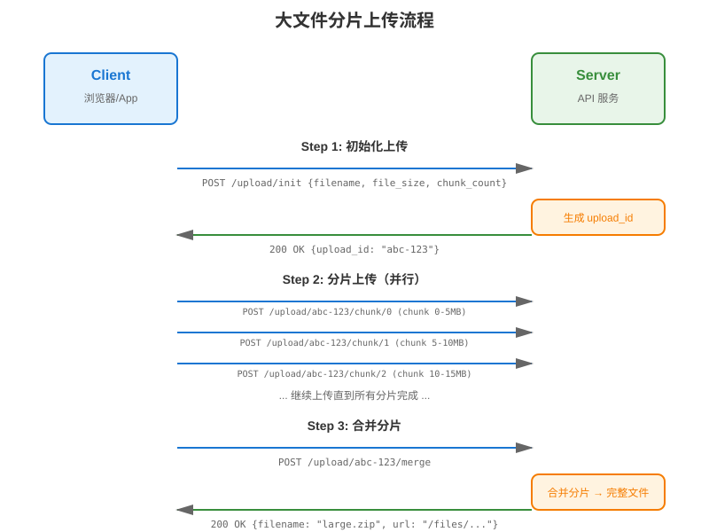
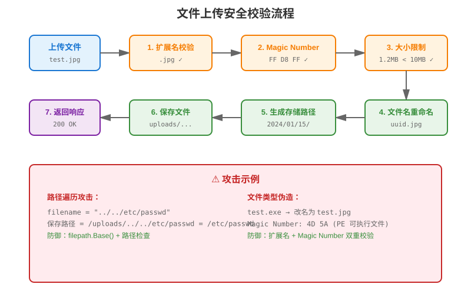

# 第 14 章 文件上传服务

## 场景

第 13 章我们把认证做好了。产品经理又提需求了：

> "后台管理系统要支持头像上传、附件上传，还要能预览图片。用户说上传大文件经常失败，能不能支持断点续传？"

你打开代码，发现文件上传有很多坑：
- 上传的文件名怎么防止路径遍历攻击？
- 怎么限制文件类型和大小？
- 上传后的文件存在哪里？本地还是对象存储？
- 图片上传后怎么生成缩略图？
- 大文件上传超时怎么办？

Leader 说："先把基本功能做好，安全放在第一位，后续再考虑分片上传。"

本章解决五个问题：
1. 如何安全地接收文件？
2. 如何防止恶意文件上传？
3. 文件存储在哪里？
4. 图片如何处理？
5. 大文件怎么上传？

---

## 问题：文件上传的 5 个安全痛点

1. **路径遍历攻击**
   - `filename = "../../etc/passwd"` → 覆盖系统文件

2. **恶意文件上传**
   - 上传 `.php`、`.jsp` 文件 → 执行恶意代码
   - 上传带病毒的文件

3. **文件类型伪造**
   - 改扩展名为 `.jpg`，实际是 `.exe`
   - MIME 类型可以伪造

4. **文件大小限制**
   - 上传超大文件 → 磁盘写满
   - 上传太多文件 → 磁盘空间耗尽

5. **文件名冲突**
   - 多个用户上传同名文件 → 覆盖
   - 文件名包含特殊字符 → 安全问题

---

## 14.1 基本文件上传

> 代码：`example1-basic/`

### 14.1.1 Gin 文件上传

先看一个常见反例：

```go
func uploadHandler(c *gin.Context) {
    file, err := c.FormFile("file")
    if err != nil {
        c.JSON(400, gin.H{"error": "file is required"})
        return
    }
    
    // 反例：直接拼接用户提交的文件名
    if err := c.SaveUploadedFile(file, "./uploads/"+file.Filename); err != nil {
        c.JSON(500, gin.H{"error": "failed to save file"})
        return
    }
    
    c.JSON(200, gin.H{
        "filename": file.Filename,
        "size":     file.Size,
    })
}
```

这段代码能跑，但不能进生产：`file.Filename` 来自客户端，可能包含 `../../etc/passwd`，也可能和已有文件重名。安全版至少要做到服务端生成文件名、限制大小、限制类型、保存前创建目录：

```go
func uploadHandler(c *gin.Context) {
    file, err := c.FormFile("file")
    if err != nil {
        response.BadRequest(c, "file is required")
        return
    }
    if file.Size > 10<<20 {
        response.BadRequest(c, "file too large")
        return
    }

    ext := strings.ToLower(filepath.Ext(filepath.Base(file.Filename)))
    if !allowedExts[ext] {
        response.BadRequest(c, "file type not allowed")
        return
    }

    filename := uuid.NewString() + ext
    savePath := filepath.Join("uploads", filename)
    if err := c.SaveUploadedFile(file, savePath); err != nil {
        response.InternalError(c, "failed to save file")
        return
    }

    response.Success(c, gin.H{"filename": filename, "size": file.Size})
}
```

### 14.1.2 运行示例

```bash
cd example1-basic
go run main.go

# 上传文件
curl -X POST http://localhost:8080/api/v1/upload \
  -F "file=@test.txt"
```

---

## 14.2 安全校验

> 代码：`example2-security/`

### 14.2.1 文件名安全处理

```go
func sanitizeFilename(filename string) string {
    // 1. 去除路径信息
    filename = filepath.Base(filename)
    
    // 2. 去除特殊字符
    filename = regexp.MustCompile(`[^\w\.\-]`).ReplaceAllString(filename, "_")
    
    // 3. 生成唯一文件名
    ext := filepath.Ext(filename)
    name := uuid.New().String() + ext
    
    return name
}
```

### 14.2.2 文件类型校验

```go
// 白名单校验
var allowedTypes = map[string]bool{
    "image/jpeg": true,
    "image/png":  true,
    "image/gif":  true,
    "application/pdf": true,
}

// 检查 MIME 类型
func validateFileType(file *multipart.FileHeader) error {
    // 1. 检查扩展名
    ext := strings.ToLower(filepath.Ext(file.Filename))
    if !allowedExts[ext] {
        return fmt.Errorf("file type not allowed")
    }
    
    // 2. 检查文件头（Magic Number）
    f, err := file.Open()
    if err != nil {
        return err
    }
    defer f.Close()
    
    buffer := make([]byte, 512)
    n, err := f.Read(buffer)
    if err != nil && err != io.EOF {
        return err
    }
    if n == 0 {
        return fmt.Errorf("empty file")
    }
    mimeType := http.DetectContentType(buffer[:n])
    
    if !allowedTypes[mimeType] {
        return fmt.Errorf("file content not allowed")
    }
    
    return nil
}
```

### 14.2.3 文件大小限制

```go
// 全局限制
r.MaxMultipartMemory = 8 << 20 // 8 MB

// 单个文件限制
if file.Size > 10<<20 { // 10 MB
    c.JSON(400, gin.H{"error": "file too large"})
    return
}
```

### 14.2.4 运行示例

```bash
cd example2-security
go run main.go

# 上传合法文件
curl -X POST http://localhost:8080/api/v1/upload \
  -F "file=@test.jpg"
# {"filename":"abc-123.jpg","size":12345}

# 上传非法文件
curl -X POST http://localhost:8080/api/v1/upload \
  -F "file=@test.exe"
# {"error":"file type not allowed"}

# 上传过大文件
curl -X POST http://localhost:8080/api/v1/upload \
  -F "file=@large.zip"
# {"error":"file too large"}
```

---

## 14.3 文件存储

> 代码：`example3-storage/`

### 14.3.1 本地存储

```go
type LocalStorage struct {
    basePath string
}

func (s *LocalStorage) Save(file *multipart.FileHeader) (string, error) {
    // 生成唯一文件名
    filename := s.generateFilename(file.Filename)
    
    // 创建目录
    dir := filepath.Dir(filename)
    os.MkdirAll(dir, 0755)
    
    // 保存文件
    if err := c.SaveUploadedFile(file, filepath.Join(s.basePath, filename)); err != nil {
        return "", err
    }
    
    return filename, nil
}
```

### 14.3.2 目录结构

```
uploads/
├── 2024/
│   └── 01/
│       └── 15/
│           ├── abc-123.jpg
│           └── def-456.pdf
└── temp/
```

### 14.3.3 存储接口

```go
type FileStorage interface {
    Save(file *multipart.FileHeader) (string, error)
    Get(filename string) (io.ReadCloser, error)
    Delete(filename string) error
}
```

### 14.3.4 运行示例

```bash
cd example3-storage
go run main.go

# 上传文件
curl -X POST http://localhost:8080/api/v1/upload \
  -F "file=@test.jpg"
# {"filename":"2024/01/15/abc-123.jpg","url":"/api/v1/files/2024/01/15/abc-123.jpg"}
```

---

## 14.4 图片处理

> 代码：`example4-image/`

### 14.4.1 生成缩略图

```go
import "github.com/nfnt/resize"

func generateThumbnail(src string, dst string, width, height uint) error {
    // 打开原图
    file, err := os.Open(src)
    if err != nil {
        return err
    }
    defer file.Close()
    
    img, _, err := image.Decode(file)
    if err != nil {
        return err
    }
    
    // 生成缩略图
    thumb := resize.Thumbnail(width, height, img, resize.Lanczos3)
    
    // 保存缩略图
    out, err := os.Create(dst)
    if err != nil {
        return err
    }
    defer out.Close()
    
    return jpeg.Encode(out, thumb, nil)
}
```

### 14.4.2 图片压缩

```go
func compressImage(src string, dst string, quality int) error {
    file, _ := os.Open(src)
    defer file.Close()
    
    img, _, _ := image.Decode(file)
    
    out, _ := os.Create(dst)
    defer out.Close()
    
    return jpeg.Encode(out, img, &jpeg.Options{Quality: quality})
}
```

### 14.4.3 运行示例

```bash
cd example4-image
go run main.go

# 上传图片
curl -X POST http://localhost:8080/api/v1/upload \
  -F "file=@photo.jpg"
# {
#   "filename": "abc-123.jpg",
#   "url": "/api/v1/files/abc-123.jpg",
#   "thumbnail": "/api/v1/files/thumb-abc-123.jpg"
# }
```

---

## 14.5 文件下载

> 代码：`example5-download/`

### 14.5.1 文件下载接口

```go
func downloadHandler(c *gin.Context) {
    filename := strings.TrimPrefix(c.Param("filepath"), "/")
    
    // 安全检查
    if !isValidFilename(filename) {
        response.BadRequest(c, "invalid filename")
        return
    }
    
    fullPath, err := safePath(uploadDir, filename)
    if err != nil {
        response.BadRequest(c, "invalid filename")
        return
    }
    
    // 检查文件是否存在
    if _, err := os.Stat(fullPath); os.IsNotExist(err) {
        response.NotFound(c, "file not found")
        return
    }
    
    c.File(fullPath)
}
```

### 14.5.2 文件预览

```go
// 图片预览
r.GET("/api/v1/files/:filename", func(c *gin.Context) {
    filename := strings.TrimPrefix(c.Param("filepath"), "/")
    fullPath, err := safePath(uploadDir, filename)
    if err != nil {
        response.BadRequest(c, "invalid filename")
        return
    }
    c.File(fullPath)
})
```

`safePath` 必须确认最终路径仍然在上传目录内：

```go
func safePath(baseDir, name string) (string, error) {
    if !isValidFilename(name) {
        return "", fmt.Errorf("invalid filename")
    }
    baseAbs, _ := filepath.Abs(baseDir)
    fullAbs, _ := filepath.Abs(filepath.Join(baseAbs, filepath.Clean(name)))
    rel, err := filepath.Rel(baseAbs, fullAbs)
    if err != nil || rel == "." || strings.HasPrefix(rel, "..") || filepath.IsAbs(rel) {
        return "", fmt.Errorf("invalid path")
    }
    return fullAbs, nil
}
```

### 14.5.3 运行示例

```bash
cd example5-download
go run main.go

# 下载文件
curl http://localhost:8080/api/v1/files/abc-123.jpg -o downloaded.jpg

# 浏览器预览
open http://localhost:8080/api/v1/files/abc-123.jpg
```

---

## 14.6 大文件上传

> 代码：`example6-large/`

### 14.6.1 分片上传流程



```
1. 客户端计算文件 SHA-256
2. 请求初始化上传（返回 upload_id）
3. 客户端分片上传（每片 5MB）
4. 服务端接收分片
5. 所有分片上传完成
6. 客户端请求合并
7. 服务端合并分片
```

### 14.6.2 初始化上传

```go
type InitUploadReq struct {
    Filename   string `json:"filename"`
    FileSize   int64  `json:"file_size"`
    ChunkCount int    `json:"chunk_count"`
    Sha256     string `json:"sha256"`
}

type InitUploadResp struct {
    UploadID string `json:"upload_id"`
}

func initUploadHandler(c *gin.Context) {
    var req InitUploadReq
    if err := c.ShouldBindJSON(&req); err != nil {
        response.ValidationError(c, err)
        return
    }
    if req.FileSize <= 0 || req.ChunkCount <= 0 || req.ChunkCount > 10000 {
        response.BadRequest(c, "invalid upload metadata")
        return
    }
    
    uploadID := uuid.New().String()
    
    // 创建临时目录
    os.MkdirAll(filepath.Join(tempDir, uploadID), 0755)
    
    // 保存上传信息
    saveUploadInfo(uploadID, currentUserID(c), req)
    
    c.JSON(200, InitUploadResp{UploadID: uploadID})
}
```

### 14.6.3 上传分片

```go
func uploadChunkHandler(c *gin.Context) {
    uploadID := c.Param("upload_id")
    chunkIndex, err := strconv.Atoi(c.Param("chunk_index"))
    if err != nil {
        response.BadRequest(c, "invalid chunk index")
        return
    }
    
    info := getUploadInfo(uploadID)
    if info.UserID != currentUserID(c) || chunkIndex < 0 || chunkIndex >= info.ChunkCount {
        response.BadRequest(c, "invalid chunk")
        return
    }

    file, err := c.FormFile("chunk")
    if err != nil {
        response.BadRequest(c, "chunk is required")
        return
    }
    if file.Size > maxChunkSize {
        response.BadRequest(c, "chunk too large")
        return
    }
    
    // 保存分片
    chunkPath := filepath.Join(tempDir, uploadID, strconv.Itoa(chunkIndex))
    c.SaveUploadedFile(file, chunkPath)
    
    c.JSON(200, gin.H{"message": "chunk uploaded"})
}
```

### 14.6.4 合并分片

```go
func mergeChunksHandler(c *gin.Context) {
    uploadID := c.Param("upload_id")
    
    // 获取上传信息
    info := getUploadInfo(uploadID)
    
    // 合并分片
    finalPath, _ := safePath(uploadDir, info.Filename)
    if err := mergeChunks(uploadID, info.ChunkCount, finalPath); err != nil {
        response.InternalError(c, "merge failed")
        return
    }
    if sha256File(finalPath) != info.Sha256 {
        response.BadRequest(c, "checksum mismatch")
        return
    }
    
    // 清理临时文件
    os.RemoveAll(filepath.Join(tempDir, uploadID))
    
    c.JSON(200, gin.H{"filename": info.Filename})
}
```

### 14.6.5 运行示例

```bash
cd example6-large
go run main.go

# 1. 初始化上传
curl -X POST http://localhost:8080/api/v1/upload/init \
  -H "Content-Type: application/json" \
  -d '{"filename":"large.zip","file_size":104857600,"chunk_count":20,"sha256":"..."}'
# {"upload_id":"abc-123"}

# 2. 上传分片
curl -X POST http://localhost:8080/api/v1/upload/abc-123/chunk/0 \
  -F "chunk=@chunk0"

# 3. 合并分片
curl -X POST http://localhost:8080/api/v1/upload/abc-123/merge
# {"filename":"large.zip"}
```

---

## 14.7 实战：给后台管理系统加文件上传

> 代码：`example7-admin-upload/`

### 14.7.1 项目结构

```
example7-admin-upload/
├── main.go
├── config/
│   ├── config.go
│   └── config.yaml
├── handler/
│   ├── user.go
│   └── file.go          # 文件上传
├── storage/
│   └── local.go         # 本地存储
├── middleware/
│   └── auth.go
└── uploads/             # 上传目录
```

### 14.7.2 配置文件

```yaml
upload:
  max_size: 10485760     # 10 MB
  allowed_types:
    - image/jpeg
    - image/png
    - image/gif
    - application/pdf
  storage_path: ./uploads

jwt:
  access_secret: ""      # 通过 JWT_ACCESS_SECRET 注入
  refresh_secret: ""     # 通过 JWT_REFRESH_SECRET 注入
```

### 14.7.3 运行示例

```bash
cd example7-admin-upload
export JWT_ACCESS_SECRET="change-me-access-secret-32-bytes-min"
export JWT_REFRESH_SECRET="change-me-refresh-secret-32-bytes-min"
go run main.go

# 上传头像
curl -X POST http://localhost:8080/api/v1/users/1/avatar \
  -H "Authorization: Bearer <token>" \
  -F "file=@avatar.jpg"
# {"code":0,"message":"success","data":{"url":"/api/v1/files/2024/01/15/abc-123.jpg"}}

# 上传附件
curl -X POST http://localhost:8080/api/v1/attachments \
  -H "Authorization: Bearer <token>" \
  -F "file=@document.pdf"
# {"code":0,"message":"success","data":{"filename":"document.pdf","url":"/api/v1/files/..."}}
```

---

## 14.8 原理：文件上传的安全机制

### 14.8.1 路径遍历攻击



**攻击示例：**
```
filename = "../../etc/passwd"
保存路径 = /uploads/../../etc/passwd = /etc/passwd
```

**防御：**
```go
// 1. 使用 filepath.Base 去除路径
filename = filepath.Base(filename)

// 2. 检查最终路径
baseAbs, _ := filepath.Abs(uploadDir)
finalAbs, _ := filepath.Abs(filepath.Join(baseAbs, filepath.Clean(filename)))
rel, err := filepath.Rel(baseAbs, finalAbs)
if err != nil || rel == "." || strings.HasPrefix(rel, "..") || filepath.IsAbs(rel) {
    return fmt.Errorf("invalid path")
}
```

### 14.8.2 文件类型检测

**三种检测方式：**

| 方式 | 可靠性 | 说明 |
|------|--------|------|
| 扩展名 | 低 | 可以伪造 |
| MIME 类型 | 中 | 可以伪造 |
| Magic Number | 高 | 文件头签名 |

**推荐组合：**
```go
// 1. 检查扩展名
if !allowedExts[ext] {
    return error
}

// 2. 检查 Magic Number
mimeType := http.DetectContentType(buffer)
if !allowedTypes[mimeType] {
    return error
}
```

### 14.8.3 文件存储策略

**本地存储 vs 对象存储：**

| 特性 | 本地存储 | 对象存储（S3/OSS） |
|------|----------|-------------------|
| 成本 | 低 | 中 |
| 扩展性 | 差 | 好 |
| 性能 | 高 | 中 |
| 可靠性 | 差 | 好 |
| 适用场景 | 小项目 | 生产环境 |

---

## 14.9 最佳实践

1. **文件名必须重命名**：用 UUID 或时间戳
2. **白名单校验文件类型**：扩展名 + Magic Number
3. **限制文件大小**：防止磁盘写满
4. **存储目录不可执行**：防止恶意代码执行
5. **定期清理临时文件**：防止磁盘空间耗尽
6. **使用 HTTPS**：防止文件被篡改
7. **记录上传日志**：便于审计

---

## 14.10 排障

### 14.10.1 上传失败

**问题**：`file too large`

**原因**：
- 文件超过限制
- Nginx 配置限制

**解决**：
```nginx
# Nginx 配置
client_max_body_size 10M;
```

### 14.10.2 文件类型被拒绝

**问题**：`file type not allowed`

**原因**：
- 文件类型不在白名单
- Magic Number 检测失败

**解决**：
- 检查白名单配置
- 检查文件是否损坏

### 14.10.3 文件名冲突

**问题**：文件被覆盖

**原因**：
- 文件名没有重命名

**解决**：
- 使用 UUID 重命名
- 或添加时间戳

---

## 14.11 面试题

**Q1：如何防止路径遍历攻击？**

A：
- 使用 `filepath.Base()` 去除路径信息
- 检查最终路径是否在允许目录内
- 文件名重命名

**Q2：如何检测文件类型？**

A：
- 扩展名检测（不可靠）
- MIME 类型检测（不可靠）
- Magic Number 检测（可靠）
- 推荐组合使用

**Q3：大文件上传怎么优化？**

A：
- 分片上传
- 断点续传
- 并行上传
- 秒传（优先用 SHA-256 去重；MD5 只能用于低风险去重场景）

**Q4：文件存储选本地还是对象存储？**

A：
- 小项目：本地存储
- 生产环境：对象存储（S3/OSS）
- 考虑扩展性、可靠性、成本

**Q5：如何防止恶意文件上传？**

A：
- 白名单校验文件类型
- 限制文件大小
- 存储目录不可执行
- 杀毒扫描

---

## 14.12 小结

本章从文件上传的安全痛点出发，实现了完整的文件上传服务：

1. **基本上传**：Gin 文件上传
2. **安全校验**：文件名、类型、大小
3. **文件存储**：本地存储、目录结构
4. **图片处理**：缩略图、压缩
5. **文件下载**：下载、预览
6. **大文件上传**：分片上传
7. **实战**：给后台管理系统加文件上传

**核心原则：**

> 文件上传是安全风险最高的功能之一，必须严格校验、重命名、限制大小。

下一章我们将学习 OpenAPI 与 Swagger，让 API 有文档。
