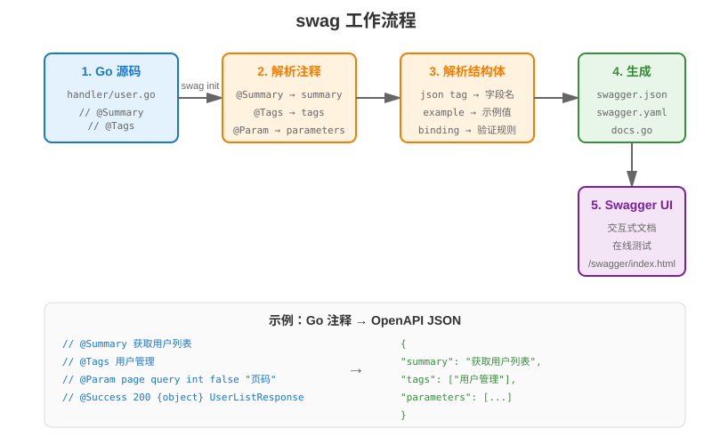

# 第 15 章 OpenAPI 与 Swagger

## 场景

第 14 章我们把文件上传做好了。前端同事找过来了：

> "你们接口文档呢？每次联调都要看代码，参数类型全靠猜，字段名一会儿驼峰一会儿下划线，太痛苦了。"

你打开代码，发现确实没有文档：
- 接口参数是什么类型？不知道
- 返回值长什么样？不知道
- 哪些字段是必填的？不知道
- 错误码有哪些？不知道

Leader 说："用 Swagger 自动生成 API 文档，前端不用再问你了。"

本章解决四个问题：
1. 什么是 OpenAPI 规范？
2. 如何在 Gin 中集成 Swagger？
3. 如何自动生成文档？
4. 如何让文档保持最新？

---

## 问题：没有文档的 4 个痛点

1. **联调效率低**
   - 前端每次都要问：这个参数是什么类型？
   - 后端每次都要解释：返回值长什么样

2. **接口不一致**
   - 代码改了，文档没改
   - 前端按旧文档调用，线上报错

3. **测试困难**
   - 没有文档，测试不知道有哪些接口
   - 手动构造请求参数，容易出错

4. **新人上手慢**
   - 新来的同事不知道有哪些接口
   - 看代码理解接口，效率低

---

## 15.1 OpenAPI 规范

### 15.1.1 什么是 OpenAPI

- 前身：Swagger Specification
- 2016 年捐给 Linux 基金会，改名 OpenAPI
- 截至 2025-09-19，OpenAPI 最新发布版是 3.2.0

本章要区分两个概念：

- **OpenAPI**：接口文档规范
- **Swagger**：围绕接口文档的一组工具，比如 Swagger UI

Go 项目里常用的 `swaggo/swag` 会根据 Go 注释生成 Swagger 2.0 格式的文档。也就是说，本章会先用 OpenAPI 3.x 说明规范思想，但配套代码生成出来的 `swagger.json` 里仍然会看到：

```json
{
  "swagger": "2.0",
  "definitions": {},
  "securityDefinitions": {}
}
```

这不是错误，而是工具产物格式不同。真正重要的是：接口路径、参数、响应模型、认证方式必须和代码保持一致。

### 15.1.2 OpenAPI 文档结构

```yaml
openapi: 3.0.3
info:
  title: Admin API
  version: 1.0.0
paths:
  /api/v1/users:
    get:
      summary: 获取用户列表
      parameters:
        - name: page
          in: query
          schema:
            type: integer
      responses:
        '200':
          description: 成功
          content:
            application/json:
              schema:
                $ref: '#/components/schemas/UserListResponse'
components:
  schemas:
    UserListResponse:
      type: object
      properties:
        code:
          type: integer
        data:
          type: array
          items:
            $ref: '#/components/schemas/User'
```

### 15.1.3 核心概念

| 概念 | 说明 |
|------|------|
| paths | 接口路径 |
| operations | HTTP 方法（get/post/put/delete） |
| parameters | 参数（query/path/header） |
| requestBody | 请求体 |
| responses | 响应 |
| schemas | 数据模型 |
| security | 认证方式 |

---

## 15.2 Swagger UI

> 代码：`example1-swagger-ui/`

### 15.2.1 什么是 Swagger UI

- 把 OpenAPI 文档渲染成交互式网页
- 可以直接在页面上测试接口
- 不需要写前端代码

### 15.2.2 在 Gin 中集成

```go
import swaggerFiles "github.com/swaggo/files"
import ginSwagger "github.com/swaggo/gin-swagger"

// 注册 Swagger 路由
r.GET("/swagger/*any", ginSwagger.WrapHandler(swaggerFiles.Handler))
```

注意：这一步只是把 Swagger UI 页面挂到 Gin 路由上。页面要真正显示接口，还必须生成 `docs` 包，并在 `main.go` 中导入：

```go
import _ "github.com/go-book/openapi/example6-admin-docs/docs"
```

### 15.2.3 运行示例

`example1-swagger-ui` 只演示路由注册。完整可运行的文档闭环看本章最后的 `example6-admin-docs`。

```bash
cd example1-swagger-ui
go run main.go

# 浏览器打开
open http://localhost:8080/swagger/index.html
```

---

## 15.3 swag 注释生成

> 代码：`example2-annotations/`

### 15.3.1 什么是 swag

- 通过 Go 注释生成 OpenAPI 文档
- 不需要手写 YAML
- 代码即文档

### 15.3.2 安装 swag

开发机可以全局安装：

```bash
go install github.com/swaggo/swag/cmd/swag@latest
```

本章配套代码也在 `tools.go` 中固定了 `swag` 工具依赖，因此可以不安装全局命令，直接通过 Go 模块运行：

```bash
go run github.com/swaggo/swag/cmd/swag init -g main.go -o docs --parseDependency --parseInternal
```

### 15.3.3 添加注释

```go
// @Summary 获取用户列表
// @Description 获取用户列表，支持分页
// @Tags 用户管理
// @Accept json
// @Produce json
// @Param page query int false "页码" default(1)
// @Param size query int false "每页数量" default(10)
// @Success 200 {object} response.ListResponse
// @Failure 400 {object} response.ErrorResponse
// @Router /api/v1/users [get]
func listUsersHandler(c *gin.Context) {
    // ...
}
```

### 15.3.4 生成文档

```bash
go run github.com/swaggo/swag/cmd/swag init -g main.go -o docs --parseDependency --parseInternal

# 生成文件：
# docs/docs.go
# docs/swagger.json
# docs/swagger.yaml
```

### 15.3.5 运行示例

```bash
cd example2-annotations
go run github.com/swaggo/swag/cmd/swag init -g main.go -o docs
go run main.go

# 浏览器打开
open http://localhost:8080/swagger/index.html
```

---

## 15.4 数据模型定义

> 代码：`example3-models/`

### 15.4.1 结构体注释

```go
// User 用户模型
// @Description 用户信息
type User struct {
    ID    int    `json:"id" example:"1"`
    Name  string `json:"name" example:"Alice"`
    Email string `json:"email" example:"alice@example.com"`
}
```

### 15.4.2 嵌套结构体

```go
// UserListResponse 用户列表响应
type UserListResponse struct {
    Code       int        `json:"code" example:"0"`
    Message    string     `json:"message" example:"success"`
    Data       []User     `json:"data"`
    Pagination Pagination `json:"pagination"`
}
```

### 15.4.3 枚举类型

```go
// UserRole 用户角色
// @Enum admin, user, guest
type UserRole string

const (
    RoleAdmin UserRole = "admin"
    RoleUser  UserRole = "user"
    RoleGuest UserRole = "guest"
)
```

---

## 15.5 认证文档

> 代码：`example4-auth/`

### 15.5.1 Bearer Token 认证

```go
// @Security BearerAuth
func protectedHandler(c *gin.Context) {
    // ...
}
```

```go
// @securityDefinitions.apikey BearerAuth
// @in header
// @name Authorization
// @description Bearer {token}
```

### 15.5.2 在 Swagger UI 中测试

1. 点击 "Authorize" 按钮
2. 输入 Token：`Bearer eyJhbGci...`
3. 点击 "Authorize"
4. 测试受保护的接口

---

## 15.6 文档分组

> 代码：`example5-groups/`

### 15.6.1 按模块分组

```go
// @Tags 用户管理
// @Summary 获取用户列表

// @Tags 文件管理
// @Summary 上传文件
```

### 15.6.2 Swagger UI 中的效果

- 用户管理
  - GET /api/v1/users
  - POST /api/v1/users
- 文件管理
  - POST /api/v1/upload
  - GET /api/v1/files/{filename}

---

## 15.7 实战：给后台管理系统加文档

> 代码：`example6-admin-docs/`

### 15.7.1 项目结构

```
example6-admin-docs/
├── main.go
├── docs/                  # 生成的文档
│   ├── docs.go
│   ├── swagger.json
│   └── swagger.yaml
├── handler/
│   ├── user.go           # 用户接口（带注释）
│   ├── file.go           # 文件接口（带注释）
│   └── auth.go           # 认证接口（带注释）
├── model/
│   └── user.go           # 数据模型（带注释）
└── response/
    └── response.go       # 响应结构（带注释）
```

### 15.7.2 生成流程

```bash
# 1. 写代码（带注释）
# 2. 生成文档
make docs

# 3. 启动服务
go run main.go

# 4. 查看文档
open http://localhost:8080/swagger/index.html
```

### 15.7.3 Makefile 自动化

```makefile
.PHONY: docs check-docs test run clean help

SWAG ?= go run github.com/swaggo/swag/cmd/swag

docs:
	$(SWAG) init -g main.go -o docs --parseDependency --parseInternal
	@echo "Swagger docs generated"

.PHONY: check-docs
check-docs: docs
	@test -f docs/swagger.json
	@grep -q '"/api/v1/users"' docs/swagger.json
	@grep -q '"/api/v1/login"' docs/swagger.json
	@echo "Swagger docs checked"

.PHONY: test
test:
	go test ./...

.PHONY: run
run: docs
	go run main.go
```

这里的 `check-docs` 很关键。曾经最常见的问题不是 Swagger UI 打不开，而是页面能打开，`paths` 却是空的。CI 至少要检查核心接口是否已经进入 `swagger.json`。

---

## 15.8 原理：swag 是怎么工作的

### 15.8.1 解析流程



```
1. 扫描 Go 源码
2. 解析注释（@Summary、@Tags 等）
3. 解析结构体（json tag、example）
4. 生成 Swagger JSON/YAML
5. Swagger UI 渲染
```

### 15.8.2 注释解析

```go
// @Summary 获取用户列表
//     ↓
// "summary": "获取用户列表"

// @Param page query int false "页码" default(1)
//     ↓
// "parameters": [{
//   "name": "page",
//   "in": "query",
//   "type": "integer",
//   "required": false,
//   "default": 1
// }]
```

### 15.8.3 为什么代码即文档

- 文档和代码在同一个文件
- 改代码时必须改注释
- CI 检查文档是否最新

---

## 15.9 最佳实践

1. **每个接口都要有注释**：@Summary、@Tags、@Param、@Success、@Failure
2. **响应模型要具体**：不要只写 `interface{}`，否则 Swagger UI 里看不到 `data` 的真实结构
3. **结构体字段加 example**：前端知道填什么值
4. **错误响应要完整**：列出所有可能的业务错误码
5. **CI 自动生成并检查文档**：`make check-docs` 至少确认核心路径不为空
6. **文档版本和 API 版本一致**：`info.version` 和 URL 中的 `/v1/` 对应
7. **生产环境关闭 Swagger**：默认不暴露 `/swagger/*any`，需要时用认证或 IP 白名单保护

---

## 15.10 排障

### 15.10.1 文档不更新

**问题**：改了注释，文档没变

**原因**：没重新运行 `swag init`

**解决**：
```bash
make docs
```

如果怀疑生成结果是空的，直接检查：

```bash
grep '"/api/v1/users"' docs/swagger.json
```

### 15.10.2 结构体没显示

**问题**：Swagger UI 中看不到数据模型

**原因**：结构体没有被任何接口引用

**解决**：
```go
// 在接口注释中引用
// @Success 200 {object} model.User
```

### 15.10.3 认证按钮不显示

**问题**：Swagger UI 没有 Authorize 按钮

**原因**：没加 `@Security` 注释

**解决**：
```go
// 在 main.go 中加安全定义
// @securityDefinitions.apikey BearerAuth
// @in header
// @name Authorization

// 在接口中引用
// @Security BearerAuth
```

### 15.10.4 Swagger UI 打开了，但没有接口

**问题**：页面能打开，但是接口列表为空

**原因**：
- 没有导入生成的 `docs` 包
- `swag init` 扫描目录不对
- handler 注释没有被生成命令解析到

**解决**：
```go
import _ "github.com/go-book/openapi/example6-admin-docs/docs"
```

```bash
go run github.com/swaggo/swag/cmd/swag init -g main.go -o docs --parseDependency --parseInternal
make check-docs
```

### 15.10.5 生成命令提示缺少 go.sum

**问题**：执行 `go run github.com/swaggo/swag/cmd/swag` 时提示缺少 `go.sum` 条目

**原因**：项目只依赖了 Swagger 运行时库，没有固定 CLI 工具依赖。

**解决**：在模块根目录保留 `tools.go`，然后执行：

```bash
go mod tidy
make docs
```

---

## 15.11 面试题

**Q1：OpenAPI 和 Swagger 的关系？**

A：
- Swagger 是规范 + 工具集
- OpenAPI 是规范（Swagger 2.0 改名 OpenAPI）
- Swagger UI 是渲染工具

**Q2：为什么用 swag 而不是手写 YAML？**

A：
- 代码即文档，不容易过时
- 自动生成，减少手动错误
- 和代码一起版本管理

**Q3：生产环境要不要开 Swagger？**

A：
- 不建议：暴露接口信息，有安全风险
- 如果必须开：加认证、限制 IP

**Q4：如何让文档和代码保持一致？**

A：
- CI 中运行 `make check-docs`
- 检查 `swagger.json` 是否包含核心接口路径
- 检查生成文件是否有未提交变化
- 有变化或核心路径缺失就构建失败

**Q5：OpenAPI 3.0 和 2.0 的区别？**

A：
- 3.0 支持组件复用（components）
- 3.0 支持多种认证方式
- 3.0 支持 request body 独立定义
- `swaggo/swag` 常见产物仍是 Swagger 2.0 格式，字段名是 `definitions`、`securityDefinitions`

---

## 15.12 小结

本章从没有文档的痛点出发，用 Swagger 实现了完整的 API 文档：

1. **OpenAPI 规范**：文档结构、核心概念
2. **Swagger UI**：交互式文档页面
3. **swag 注释**：代码即文档
4. **数据模型**：结构体注释、枚举类型
5. **认证文档**：Bearer Token
6. **文档分组**：按模块组织
7. **实战**：给后台管理系统加文档，并用 `make check-docs` 防止生成空文档

**核心原则：**

> 正确的 API 文档不是写出来的，是从代码中生成出来的。

下一章我们将学习接口版本管理，让 API 平滑升级。

---

## 参考资料

> 本章基于 **Go 1.25**、Gin v1.12.0、swaggo/swag v1.16.6。API 与默认行为随版本变化，以对应版本官方文档为准。

- OpenAPI 规范：https://spec.openapis.org/
- OpenAPI 3.2.0 发布说明：https://github.com/OAI/OpenAPI-Specification/releases
- swaggo/swag：https://github.com/swaggo/swag
- Gin 官方文档：https://gin-gonic.com/docs/
