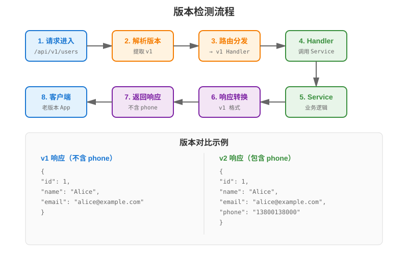

# 第 16 章 接口版本管理

## 场景

第 15 章我们把 API 文档做好了。产品经理又提需求了：

> "用户详情里的 `name` 要拆成 `first_name` 和 `last_name`，注册接口也要新增必填的 `phone` 字段，但是老版本 App 还在用，不能直接改。"

你打开代码，发现这是个两难问题：
- 直接改接口 → 老客户端全挂
- 不改接口 → 新功能没法上
- 新建接口 → 代码重复，维护困难

Leader 说："做接口版本管理，v1 和 v2 共存，给老客户端留迁移时间。"

本章解决四个问题：
1. 为什么要做接口版本管理？
2. 有哪几种版本管理方式？
3. 如何在 Gin 中实现多版本共存？
4. 如何优雅地废弃旧版本？

---

## 问题：不改版本的 4 个后果

1. **破坏性变更**
   - 删了字段 → 老客户端解析失败
   - 改了字段类型 → 老客户端崩溃
   - 改了 URL → 老客户端 404
   - 新增必填请求字段 → 老客户端提交失败

注意：只是在响应里新增一个可选字段，通常不需要升级大版本。多数 JSON 客户端会忽略未知字段，这属于兼容性变更。真正需要版本管理的是删除字段、改字段类型、改字段语义、新增必填请求字段这类破坏性变更。

2. **不敢改接口**
   - 想优化接口，但怕影响老客户端
   - 代码越写越丑，技术债堆积

3. **新旧代码混杂**
   - 一个接口里写一堆 if-else 兼容老版本
   - 代码可读性差，维护困难

4. **用户不配合升级**
   - 通知用户升级，用户不理
   - 强制升级，用户流失

---

## 16.1 版本管理方式对比

### 16.1.1 三种常见方式

| 方式 | 示例 | 优点 | 缺点 |
|------|------|------|------|
| URL 路径 | /api/v1/users | 直观、易缓存 | URL 变长 |
| Header | X-API-Version: v1 或 Accept: vnd.app.v1+json | URL 干净 | 不直观、测试成本高 |
| Query 参数 | ?version=1 | 灵活 | 容易忘记传 |

### 16.1.2 为什么选 URL 路径

- 直观：一看 URL 就知道版本
- 易缓存：CDN 可以按 URL 缓存
- 易测试：curl 直接测试
- 适合内部系统和后台管理 API：运维、测试、网关日志都容易识别

也要知道：不同公司会选不同方式。GitHub 当前使用 `X-GitHub-Api-Version` Header，Stripe 使用 `Stripe-Version` Header，Twitter/X 的 v2 API 使用 URL 路径。选型没有银弹，本书的后台管理系统优先使用 URL 路径版本，是因为它最直观、最容易教学和排障。

---

## 16.2 URL 路径版本

> 代码：`example1-url-version/`

### 16.2.1 基本实现

```go
// v1 路由组
v1 := r.Group("/api/v1")
{
    v1.GET("/users", listUsersV1)
}

// v2 路由组
v2 := r.Group("/api/v2")
{
    v2.GET("/users", listUsersV2)
}

func normalizeVersion(version string) string {
    version = strings.TrimPrefix(strings.ToLower(version), "api-")
    if version == "1" || version == "2" {
        return "v" + version
    }
    return version
}
```

### 16.2.2 运行示例

为了让响应差异直观，示例中 v2 会多返回 `phone`。但真正需要升级大版本的原因，是 v2 创建用户时把 `phone` 变成了必填请求字段；如果只是在响应里新增可选字段，通常不需要新版本。

```bash
# v1 版本（不含 phone）
curl http://localhost:8080/api/v1/users
# [{"id":1,"name":"Alice","email":"alice@example.com"}]

# v2 版本（包含 phone）
curl http://localhost:8080/api/v2/users
# [{"id":1,"name":"Alice","email":"alice@example.com","phone":"13800138000"}]
```

---

## 16.3 多版本共存

> 代码：`example2-multi-version/`

### 16.3.1 共享业务逻辑

```go
// 共享的 Service 层
type UserService struct {
    store *store.MemoryStore
}

// v1 Handler 调用 Service
func listUsersV1(c *gin.Context) {
    users := userService.List()
    c.JSON(200, toV1Response(users))  // 转换为 v1 格式
}

// v2 Handler 调用 Service
func listUsersV2(c *gin.Context) {
    users := userService.List()
    c.JSON(200, toV2Response(users))  // 转换为 v2 格式
}
```

### 16.3.2 响应格式转换

```go
// v1 响应（不含 phone）
func toV1Response(users []*model.User) []gin.H {
    result := make([]gin.H, len(users))
    for i, u := range users {
        result[i] = gin.H{
            "id":    u.ID,
            "name":  u.Name,
            "email": u.Email,
        }
    }
    return result
}

// v2 响应（包含 phone）
func toV2Response(users []*model.User) []gin.H {
    result := make([]gin.H, len(users))
    for i, u := range users {
        result[i] = gin.H{
            "id":    u.ID,
            "name":  u.Name,
            "email": u.Email,
            "phone": u.Phone,
        }
    }
    return result
}
```

---

## 16.4 版本中间件

> 代码：`example3-middleware/`

### 16.4.1 自动版本检测

后台管理系统推荐 URL 路径版本，但有些内部调用方会希望用 Header 指定版本。中间件可以做统一识别：

```go
// 版本中间件
func VersionMiddleware() gin.HandlerFunc {
    return func(c *gin.Context) {
        // 1. 从 URL 获取版本
        version := c.Param("version")
        
        // 2. 从 Header 获取版本
        if version == "" {
            version = c.GetHeader("X-API-Version")
        }
        
        // 3. 默认 v1
        if version == "" {
            version = "v1"
        }
        
        c.Set("api_version", normalizeVersion(version))
        c.Next()
    }
}
```

### 16.4.2 两种入口共用分发逻辑

```go
// URL 版本：/api/v1/users、/api/v2/users
r.GET("/api/:version/users", func(c *gin.Context) {
    listUsers(c, userService)
})

// Header 版本：/api/users + X-API-Version: v2
r.GET("/api/users", func(c *gin.Context) {
    listUsers(c, userService)
})

func listUsers(c *gin.Context, userService *UserService) {
    version := c.GetString("api_version")

    switch version {
    case "v1":
        listUsersV1(c)
    case "v2":
        listUsersV2(c)
    default:
        c.JSON(400, gin.H{
            "code":    10001,
            "message": "unsupported api version",
        })
    }
}
```

这样下面两种请求都能命中：

```bash
curl http://localhost:8080/api/v2/users
curl -H 'X-API-Version: v2' http://localhost:8080/api/users
```

---

## 16.5 废弃策略

> 代码：`example4-deprecation/`

### 16.5.1 返回废弃头

```go
func listUsersV1(c *gin.Context) {
    // 设置废弃头
    c.Header("Deprecation", "true")
    c.Header("Sunset", "Thu, 01 Apr 2027 00:00:00 GMT")
    c.Header("Link", `<https://api.example.com/api/v2/users>; rel="successor-version"`)
    
    // 返回数据
    users := userService.List()
    c.JSON(200, toV1Response(users))
}
```

### 16.5.2 废弃中间件

```go
// 废弃中间件
func DeprecationMiddleware(version, sunsetDate string) gin.HandlerFunc {
    return func(c *gin.Context) {
        c.Header("Deprecation", "true")
        c.Header("Sunset", sunsetDate)
        c.Header("Warning", `299 - "This API version is deprecated"`)
        log.Printf("deprecated_api_used version=%s method=%s path=%s",
            version, c.Request.Method, c.FullPath())
        c.Next()
    }
}

// 使用
v1 := r.Group("/api/v1")
v1.Use(DeprecationMiddleware("v1", "Thu, 01 Apr 2027 00:00:00 GMT"))
```

### 16.5.3 废弃时间线

```
第 1 阶段：通知（返回 Deprecation 头）
  ↓
第 2 阶段：统计（日志和指标记录旧版本调用）
  ↓
第 3 阶段：限制（返回 429 限流）
  ↓
第 4 阶段：下线（返回 410 Gone）
```

---

## 16.6 实战：给后台管理系统加版本管理

> 代码：`example5-admin-version/`

### 16.6.1 项目结构

```
example5-admin-version/
├── main.go
├── handler/
│   ├── v1/              # v1 版本处理器
│   │   └── user.go
│   └── v2/              # v2 版本处理器
│       └── user.go
├── service/
│   └── user.go          # 共享业务逻辑，带并发保护
├── model/
│   └── user.go
└── middleware/
    └── version.go       # 废弃头和旧版本调用日志
```

### 16.6.2 路由注册

```go
// v1 路由
v1 := r.Group("/api/v1")
v1.Use(middleware.DeprecationMiddleware("v1", "Thu, 01 Apr 2027 00:00:00 GMT"))
{
    v1.GET("/users", v1handler.ListUsers)
    v1.POST("/users", v1handler.CreateUser)
}

// v2 路由
v2 := r.Group("/api/v2")
{
    v2.GET("/users", v2handler.ListUsers)
    v2.POST("/users", v2handler.CreateUser)
}
```

### 16.6.3 运行示例

```bash
# v1 版本（含废弃头）
curl -i http://localhost:8080/api/v1/users
# HTTP/1.1 200 OK
# Deprecation: true
# Sunset: Thu, 01 Apr 2027 00:00:00 GMT
# [{"id":1,"name":"Alice","email":"alice@example.com"}]

# v2 版本
curl http://localhost:8080/api/v2/users
# [{"id":1,"name":"Alice","email":"alice@example.com","phone":"13800138000"}]

# v1 创建用户：不要求 phone
curl -X POST http://localhost:8080/api/v1/users \
  -H 'Content-Type: application/json' \
  -d '{"name":"Charlie","email":"charlie@example.com"}'

# v2 创建用户：phone 是必填字段
curl -X POST http://localhost:8080/api/v2/users \
  -H 'Content-Type: application/json' \
  -d '{"name":"Charlie","email":"charlie@example.com","phone":"13700137000"}'
```

服务端日志会记录旧版本调用，方便统计迁移进度：

```text
deprecated_api_used version=v1 method=GET path=/api/v1/users client_ip=127.0.0.1
```

---

## 16.7 原理：版本路由的实现机制

### 16.7.1 Gin 路由树

```
/
├── api/
│   ├── v1/
│   │   └── users → handler v1
│   └── v2/
│       └── users → handler v2
```

### 16.7.2 版本检测流程



```
1. 请求进入
2. 解析 URL 路径
3. 提取版本号（v1/v2）
4. 路由到对应 Handler
5. Handler 调用共享 Service
6. 转换为对应版本的响应格式
7. 返回响应
```

### 16.7.3 什么时候使用 Header 版本

Header 版本不是错，只是不适合作为本书后台管理系统的默认方案。

适合 Header 版本的场景：

- SaaS 平台希望 URL 长期稳定
- API Gateway 已经统一解析版本 Header
- 客户端 SDK 统一封装了版本选择

不适合初学项目的原因：

- URL 看不出版本，排障需要看 Header
- curl、Postman、网关日志都要额外配置
- CDN 或代理缓存必须显式处理 `Vary` Header

---

## 16.8 最佳实践

1. **URL 路径版本**：/api/v1/users, /api/v2/users
2. **共享业务逻辑**：Service 层不区分版本
3. **响应格式转换**：Handler 层负责转换
4. **提前通知废弃**：返回 Deprecation 头
5. **记录旧版本调用**：日志统计，评估影响
6. **给足迁移时间**：至少 6 个月
7. **文档标注版本**：OpenAPI/Swagger 中明确 v1、v2 的接口差异
8. **做兼容性测试**：用测试固定 v1 响应，避免维护 v2 时误伤老客户端

---

## 16.9 排障

### 16.9.1 版本路由冲突

**问题**：v1 和 v2 路由冲突

**原因**：路由注册顺序不对

**解决**：
```go
// 先注册具体版本
v1 := r.Group("/api/v1")
v2 := r.Group("/api/v2")

// 不要注册通配符
// r.Group("/api/:version")  // 会和 v1/v2 冲突
```

### 16.9.2 旧版本忘记废弃

**问题**：旧版本一直在用，没人升级

**原因**：没有返回废弃头，用户不知道

**解决**：
```go
v1.Use(DeprecationMiddleware("v1", "Thu, 01 Apr 2027 00:00:00 GMT"))
```

### 16.9.3 代码重复

**问题**：v1 和 v2 代码重复太多

**原因**：没有共享 Service 层

**解决**：
```go
// 共享 Service
service := NewUserService()

// v1 Handler
func listUsersV1(c *gin.Context) {
    users := service.List()
    c.JSON(200, toV1Response(users))
}

// v2 Handler
func listUsersV2(c *gin.Context) {
    users := service.List()
    c.JSON(200, toV2Response(users))
}
```

### 16.9.4 Header 版本不生效

**问题**：传了 `X-API-Version: v2`，结果仍然返回 v1

**原因**：只注册了 `/api/:version/users`，请求 `/api/users` 根本不会进入 handler。

**解决**：同时注册 Header 入口：

```go
r.GET("/api/:version/users", listUsers)
r.GET("/api/users", listUsers)
```

### 16.9.5 旧版本下线后还被调用

**问题**：已经过了 Sunset 日期，仍有客户端调用 v1

**原因**：只有响应头，没有统计、告警和下线策略。

**解决**：

```go
if retired {
    c.JSON(http.StatusGone, gin.H{
        "code":    10010,
        "message": "api version retired, please migrate to v2",
    })
    return
}
```

---

## 16.10 面试题

**Q1：为什么要做接口版本管理？**

A：
- 避免破坏性变更影响老客户端
- 允许接口演进，不堆积技术债
- 给客户端迁移时间

**Q2：URL 路径版本和 Header 版本的区别？**

A：
- URL 路径：直观、易缓存、易测试
- Header：URL 干净、但不直观、难缓存
- 推荐 URL 路径版本

**Q3：如何优雅地废弃旧版本？**

A：
- 返回 Deprecation 头
- 返回 Sunset 头（下线时间）
- 日志记录旧版本调用
- 用指标统计调用量，迁移完成后再返回 410 Gone
- 给足迁移时间（至少 6 个月）

**Q4：多版本共存如何避免代码重复？**

A：
- 共享 Service 层（业务逻辑）
- Handler 层负责响应格式转换
- 不要为每个版本写一套业务逻辑

**Q5：什么时候应该升级版本？**

A：
- 删除字段
- 修改字段类型
- 修改字段语义
- 修改 URL 结构
- 新增必填字段

只新增响应里的可选字段，通常不需要升级大版本。

---

## 16.11 小结

本章从接口升级的痛点出发，实现了完整的接口版本管理：

1. **版本管理方式**：URL 路径、Header、Query 参数
2. **URL 路径版本**：最推荐的方式
3. **多版本共存**：共享业务逻辑，转换响应格式
4. **版本中间件**：自动检测版本
5. **废弃策略**：Deprecation 头 + Sunset 头 + 旧版本调用统计
6. **实战**：给后台管理系统加版本管理

**核心原则：**

> 接口版本管理不是技术问题，是产品问题。给足迁移时间，比技术实现更重要。

---

## 第二阶段总结

恭喜你完成了第二阶段的学习！回顾一下我们学到了什么：

1. **Gin 框架实战**：路由、中间件、参数绑定
2. **REST API 设计规范**：URL、HTTP 方法、状态码
3. **配置管理**：Viper、多环境、热更新
4. **日志体系设计**：Zap、结构化日志、请求追踪
5. **JWT 认证**：登录、Token、RBAC 权限
6. **文件上传服务**：安全校验、存储、图片处理
7. **OpenAPI 与 Swagger**：自动生成 API 文档
8. **接口版本管理**：多版本共存、废弃策略

**你现在可以：**
- 独立开发一个完整的后台管理系统 API
- 设计规范的 REST API
- 实现认证、权限、文件上传等功能
- 自动生成 API 文档
- 管理接口版本

**下一步：**
第三阶段我们将学习数据存储与缓存，包括 MySQL、Redis、MongoDB。
