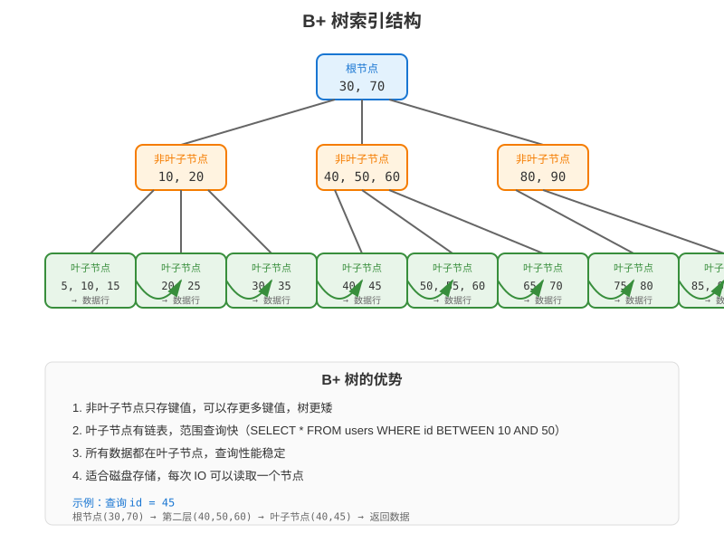

# 第 17 章 MySQL 设计原则

## 场景

第二阶段我们做完了后台管理系统，但所有数据都存在内存里。产品经理说：

> "服务一重启数据就没了，这怎么上线？赶紧接数据库。"

你打开代码，发现现在的存储层是这样的：

```go
type MemoryStore struct {
    users map[int]*User
}
```

问题很明显：
- 数据不持久化，重启就丢
- 不支持复杂查询（分页、过滤、排序）
- 不支持事务（创建用户 + 创建角色要一起成功）
- 单机内存有限，数据量大了扛不住

Leader 说："用 MySQL，先学会怎么设计表。"

本章解决五个问题：
1. 为什么要用 MySQL？
2. 表怎么设计才合理？
3. 数据类型怎么选？
4. 索引怎么加？
5. 怎么避免常见的坑？

---

## 问题：内存存储的 4 个痛点

1. **数据不持久化**
   - 服务重启 → 数据全丢
   - 容器重启 → 数据全丢

2. **不支持复杂查询**
   - 分页：`SELECT * FROM users LIMIT 10 OFFSET 20`
   - 过滤：`WHERE status = 'active' AND created_at > '2024-01-01'`
   - 排序：`ORDER BY created_at DESC`

3. **不支持事务**
   - 创建用户 + 创建角色 → 要么一起成功，要么一起失败
   - 转账：A 扣钱 + B 加钱 → 原子性

4. **扩展性差**
   - 单机内存有限
   - 无法做主从复制、读写分离

---

## 17.1 为什么选 MySQL

### 17.1.1 关系型数据库 vs NoSQL

| 特性 | MySQL | MongoDB | Redis |
|------|-------|---------|-------|
| 数据模型 | 表（行+列） | 文档（JSON） | Key-Value |
| 事务 | 完整 ACID 事务 | 支持多文档事务，但使用成本更高 | MULTI/EXEC 保证命令顺序执行，不提供传统数据库式回滚 |
| 查询 | SQL | 文档查询 | 命令 |
| 适用场景 | 结构化数据 | 灵活数据 | 缓存 |

### 17.1.2 MySQL 的优势

- 成熟稳定：20+ 年历史
- 生态完善：工具、驱动、ORM 丰富
- 性能优秀：InnoDB 引擎
- 社区活跃：文档、教程多

### 17.1.3 什么时候考虑其他存储

- 数据模型高度灵活、天然以聚合文档读取 → 可以考虑 MongoDB
- 需要低延迟缓存、计数器、分布式协调 → 可以考虑 Redis
- 图遍历是核心查询 → 可以考虑 Neo4j
- 高吞吐时序写入和时间窗口聚合 → 可以考虑专用时序数据库

这不是非此即彼。生产系统经常以 MySQL 保存核心业务数据，再用 Redis 做缓存，用 Elasticsearch 做搜索。

---

## 17.2 MySQL 基础

> 代码：`example1-basic/`

### 17.2.1 连接 MySQL

```go
import (
    "database/sql"
    _ "github.com/go-sql-driver/mysql"
)

db, err := sql.Open("mysql", "user:password@tcp(localhost:3306)/dbname")
if err != nil {
    log.Fatal(err)
}
defer db.Close()

// 测试连接
if err := db.Ping(); err != nil {
    log.Fatal(err)
}
```

### 17.2.2 CRUD 操作

```go
// 创建
result, err := db.Exec("INSERT INTO users (name, email) VALUES (?, ?)", "Alice", "alice@example.com")
if err != nil {
    return err
}

// 查询
row := db.QueryRow("SELECT id, name, email FROM users WHERE id = ?", 1)
var user User
if err := row.Scan(&user.ID, &user.Name, &user.Email); err != nil {
    if errors.Is(err, sql.ErrNoRows) {
        return ErrUserNotFound
    }
    return err
}

// 更新
if _, err := db.Exec("UPDATE users SET name = ? WHERE id = ?", "Alice Updated", 1); err != nil {
    return err
}

// 删除
if _, err := db.Exec("DELETE FROM users WHERE id = ?", 1); err != nil {
    return err
}
```

### 17.2.3 运行示例

```bash
# 如果本机没有 MySQL，可以先启动一个本地容器
docker run --name go-book-mysql \
  -e MYSQL_ROOT_PASSWORD=root \
  -p 3306:3306 \
  -d mysql:8.0

cd example1-basic
go run main.go
```

---

## 17.3 表设计原则

### 17.3.1 三大范式

**第一范式（1NF）**：一列保存一个业务值，不保存重复组

```sql
-- 错误：多个手机号塞进一个字符串
CREATE TABLE users (
    phone_numbers VARCHAR(255)  -- "13800138000,13900139000"
);

-- 正确：一行表示一个手机号
CREATE TABLE user_phones (
    id BIGINT PRIMARY KEY AUTO_INCREMENT,
    user_id BIGINT NOT NULL,
    phone VARCHAR(20) NOT NULL
);
```

“不可再分”取决于业务语义。只用于展示和寄送的完整地址可以作为一个字段；需要按省市统计时，再拆成结构化字段。

**第二范式（2NF）**：联合主键下，非主键字段依赖完整主键

```sql
-- 错误：学生姓名只依赖 student_id，课程名只依赖 course_id
CREATE TABLE enrollments (
    student_id BIGINT,
    course_id BIGINT,
    student_name VARCHAR(50),
    course_name VARCHAR(100),
    score DECIMAL(5, 2),
    PRIMARY KEY (student_id, course_id)
);

-- 正确：基础信息拆到各自主表，选课表只保存完整关系的属性
CREATE TABLE students (
    id BIGINT PRIMARY KEY,
    name VARCHAR(50) NOT NULL
);

CREATE TABLE courses (
    id BIGINT PRIMARY KEY,
    name VARCHAR(100) NOT NULL
);

CREATE TABLE enrollments (
    student_id BIGINT,
    course_id BIGINT,
    score DECIMAL(5, 2),
    PRIMARY KEY (student_id, course_id)
);
```

**第三范式（3NF）**：消除传递依赖

```sql
-- 错误：department_name 依赖 department_id，而不是直接依赖 employee id
CREATE TABLE employees (
    id BIGINT PRIMARY KEY,
    name VARCHAR(50),
    department_id BIGINT,
    department_name VARCHAR(100)
);

-- 正确：部门信息单独维护
CREATE TABLE departments (
    id BIGINT PRIMARY KEY,
    name VARCHAR(100) NOT NULL
);

CREATE TABLE employees (
    id BIGINT PRIMARY KEY,
    name VARCHAR(50),
    department_id BIGINT
);
```

订单明细中的商品名、成交单价通常是交易快照，即使它们看起来可以从商品表查询，也应该保留，避免商品改名或调价后破坏历史订单。这属于有业务理由的反范式。

### 17.3.2 反范式的场景

**什么时候不遵守范式？**

1. **读多写少**：冗余字段减少 JOIN
2. **性能要求高**：避免复杂查询

```sql
-- 范式：订单表只存用户ID
CREATE TABLE orders (
    id INT PRIMARY KEY,
    user_id INT,
    total DECIMAL(10, 2)
);

-- 反范式：订单表冗余用户名（减少 JOIN）
CREATE TABLE orders (
    id INT PRIMARY KEY,
    user_id INT,
    user_name VARCHAR(50),  -- 冗余
    total DECIMAL(10, 2)
);
```

### 17.3.3 表设计最佳实践

1. **主键按规模选择**：中小表可用自增 INT，长期增长或跨系统数据优先 BIGINT
2. **默认使用 NOT NULL**：只有业务上确实允许缺失的字段才使用 NULL
3. **用合适的字符集**：`utf8mb4`（支持 emoji）
4. **添加审计字段**：`created_at`、`updated_at`
5. **软删除按业务使用**：需要审计和恢复时保留 `deleted_at`，临时数据可以物理删除
6. **分布式 ID 谨慎使用**：UUID、雪花 ID 要结合写入顺序、存储空间和全局唯一需求选择

```sql
CREATE TABLE users (
    id BIGINT PRIMARY KEY AUTO_INCREMENT,
    name VARCHAR(50) NOT NULL,
    email VARCHAR(100) NOT NULL,
    status TINYINT NOT NULL DEFAULT 1,  -- 0:禁用 1:启用
    created_at DATETIME NOT NULL DEFAULT CURRENT_TIMESTAMP,
    updated_at DATETIME NOT NULL DEFAULT CURRENT_TIMESTAMP ON UPDATE CURRENT_TIMESTAMP,
    deleted_at DATETIME NULL
) ENGINE=InnoDB DEFAULT CHARSET=utf8mb4;
```

---

## 17.4 数据类型选择

### 17.4.1 整数类型

| 类型 | 字节 | 范围 | 适用场景 |
|------|------|------|----------|
| TINYINT | 1 | 有符号 -128 ~ 127 | 状态、枚举 |
| SMALLINT | 2 | 有符号 -32768 ~ 32767 | 小范围计数 |
| INT | 4 | 有符号 -2^31 ~ 2^31-1 | 一般计数 |
| BIGINT | 8 | 有符号 -2^63 ~ 2^63-1 | 长期增长主键、订单 ID |

```sql
-- 错误：用 BIGINT 存状态
CREATE TABLE users (
    status BIGINT  -- 浪费空间
);

-- 正确：用 TINYINT 存状态
CREATE TABLE users (
    status TINYINT  -- 0:禁用 1:启用
);
```

### 17.4.2 字符串类型

| 类型 | 说明 | 适用场景 |
|------|------|----------|
| CHAR(n) | 固定长度 | 国家码、固定长度哈希 |
| VARCHAR(n) | 可变长度 | 用户名、邮箱 |
| TEXT | 大文本 | 文章内容 |

```sql
-- 只面向中国大陆手机号时，可以使用 CHAR(11)
CREATE TABLE users (
    phone CHAR(11)
);

-- 面向国际用户时，推荐给国家码和格式预留空间
CREATE TABLE users (
    phone VARCHAR(20)  -- 例如 +8613800138000
);
```

字段类型首先服务于业务语义，不要为了节省几个字节把未来扩展空间锁死。

### 17.4.3 时间类型

| 类型 | 字节 | 范围 | 适用场景 |
|------|------|------|----------|
| DATE | 3 | 1000-01-01 ~ 9999-12-31 | 生日 |
| DATETIME | 5 | 1000-01-01 00:00:00 ~ 9999-12-31 23:59:59 | 业务时间、创建时间 |
| TIMESTAMP | 4 | 1970-01-01 00:00:00 ~ 2038-01-19 03:14:07 | 更新时间 |

```sql
-- 推荐：用 DATETIME
CREATE TABLE users (
    created_at DATETIME NOT NULL DEFAULT CURRENT_TIMESTAMP
);
```

### 17.4.4 金额类型

```sql
-- 错误：用 FLOAT（精度丢失）
CREATE TABLE orders (
    total FLOAT  -- 1.005 → 1.0049999
);

-- 正确：用 DECIMAL
CREATE TABLE orders (
    total DECIMAL(10, 2)  -- 精确到分
);
```

---

## 17.5 索引设计

### 17.5.1 索引的作用

```sql
-- 没有索引：全表扫描
SELECT * FROM users WHERE email = 'alice@example.com';
-- 扫描 100 万行

-- 有索引：索引查找
SELECT * FROM users WHERE email = 'alice@example.com';
-- 扫描 1 行
```

### 17.5.2 索引类型

**主键索引**：唯一 + 非空

```sql
CREATE TABLE users (
    id INT PRIMARY KEY  -- 自动创建主键索引
);
```

**唯一索引**：唯一

```sql
CREATE TABLE users (
    email VARCHAR(100) UNIQUE  -- 唯一索引
);
```

**普通索引**：加速查询

```sql
CREATE TABLE users (
    name VARCHAR(50),
    INDEX idx_name (name)  -- 普通索引
);
```

**联合索引**：多字段

```sql
CREATE TABLE users (
    id BIGINT PRIMARY KEY AUTO_INCREMENT,
    status TINYINT,
    created_at DATETIME,
    INDEX idx_status_created_id (status, created_at DESC, id DESC)  -- 联合索引
);
```

### 17.5.3 索引设计原则

1. **先写出核心查询，再设计索引**：同时考虑 WHERE、ORDER BY、LIMIT
2. **高区分度字段适合单列索引**：例如 email
3. **联合索引遵循最左前缀原则**
4. **避免过多索引**（每个索引都要维护）
5. **低区分度字段结合查询模式判断**：status 单列索引收益可能低，但 `(status, created_at)` 可能很有效
6. **用 EXPLAIN 验证**：不要只凭经验判断索引是否生效

```sql
-- 收益通常较低：只给 status 建单列索引
CREATE INDEX idx_status ON users(status);

-- 后台常见查询：按状态筛选，并按创建时间倒序
SELECT id, username, email
FROM users
WHERE status = 1 AND deleted_at IS NULL
ORDER BY created_at DESC, id DESC
LIMIT 20;

-- 根据查询模式设计联合索引
CREATE INDEX idx_users_status_deleted_created_id
ON users(status, deleted_at, created_at DESC, id DESC);
```

### 17.5.4 索引失效的场景

```sql
-- 1. 对索引字段使用函数
SELECT * FROM users WHERE YEAR(created_at) = 2024;  -- 索引失效

-- 2. 隐式类型转换
SELECT * FROM users WHERE phone = 13800138000;  -- phone 是 VARCHAR，传入 INT

-- 3. LIKE 以通配符开头
SELECT * FROM users WHERE name LIKE '%Alice%';  -- 索引失效

-- 4. OR 两侧缺少合适索引
SELECT * FROM users WHERE name = 'Alice' OR email = 'alice@example.com';  -- 可能退化
```

“索引失效”不是简单的语法黑名单。MySQL 优化器会根据统计信息、数据量和成本选择执行计划，最终要以 `EXPLAIN` 和实际扫描行数为准。

---

## 17.6 实战：给用户管理系统加 MySQL

> 代码：`example2-admin-mysql/`

### 17.6.1 建表

```sql
CREATE TABLE users (
    id BIGINT PRIMARY KEY AUTO_INCREMENT,
    username VARCHAR(50) NOT NULL,
    email VARCHAR(100) NOT NULL,
    password_hash VARCHAR(255) NOT NULL,
    phone VARCHAR(20) NULL,
    status TINYINT NOT NULL DEFAULT 1,
    created_at DATETIME NOT NULL DEFAULT CURRENT_TIMESTAMP,
    updated_at DATETIME NOT NULL DEFAULT CURRENT_TIMESTAMP ON UPDATE CURRENT_TIMESTAMP,
    deleted_at DATETIME NULL,

    active_username VARCHAR(50)
        GENERATED ALWAYS AS (IF(deleted_at IS NULL, username, NULL)) STORED,
    active_email VARCHAR(100)
        GENERATED ALWAYS AS (IF(deleted_at IS NULL, email, NULL)) STORED,

    UNIQUE INDEX uk_users_active_username (active_username),
    UNIQUE INDEX uk_users_active_email (active_email),
    INDEX idx_users_status_deleted_created_id (
        status, deleted_at, created_at DESC, id DESC
    ),
    INDEX idx_users_deleted_created_id (
        deleted_at, created_at DESC, id DESC
    )
) ENGINE=InnoDB DEFAULT CHARSET=utf8mb4;
```

不能简单地给 `(email, deleted_at)` 建唯一索引。MySQL 唯一索引允许出现多个 NULL，无法可靠约束“所有未删除用户的 email 唯一”。生成列把未删除记录的 email 映射出来，软删除后则变成 NULL，这样既保证活跃用户唯一，也允许重新注册已删除邮箱。

### 17.6.2 项目结构

```
example2-admin-mysql/
├── main.go
├── handler/
│   └── user.go
├── model/
│   └── user.go
├── store/
│   ├── mysql.go          # MySQL 存储
│   └── mysql_test.go     # 查询构造和 NULL 处理测试
└── migrations/
    └── 001_create_users.sql
```

### 17.6.3 MySQL 存储实现

```go
type MySQLStore struct {
    db *sql.DB
}

func (s *MySQLStore) List(
    ctx context.Context,
	req *model.ListUsersRequest,
) ([]*model.User, int, error) {
    page := req.Page
    if page <= 0 {
        page = 1
    }
    size := req.Size
    if size <= 0 {
        size = 10
    }
    offset := (page - 1) * size
    
    // 查询总数
    var total int
    err := s.db.QueryRowContext(
        ctx,
        "SELECT COUNT(*) FROM users WHERE deleted_at IS NULL",
    ).Scan(&total)
    if err != nil {
        return nil, 0, err
    }
    
    // 查询列表
    rows, err := s.db.QueryContext(
        ctx,
        `SELECT id, username, email, phone, status, created_at
         FROM users
         WHERE deleted_at IS NULL
         ORDER BY created_at DESC, id DESC
         LIMIT ? OFFSET ?`,
        size, offset,
    )
    if err != nil {
        return nil, 0, err
    }
    defer rows.Close()
    
    users := make([]*model.User, 0)
    for rows.Next() {
        var user model.User
        var phone sql.NullString
        if err := rows.Scan(
            &user.ID,
            &user.Username,
            &user.Email,
            &phone,
            &user.Status,
            &user.CreatedAt,
        ); err != nil {
            return nil, 0, err
        }
        if phone.Valid {
            phoneValue := phone.String
            user.Phone = &phoneValue
        }
        users = append(users, &user)
    }
    if err := rows.Err(); err != nil {
        return nil, 0, err
    }
    
    return users, total, nil
}
```

创建用户时先在 handler 中生成密码哈希：

```go
passwordHash, err := bcrypt.GenerateFromPassword(
    []byte(req.Password),
    bcrypt.DefaultCost,
)
if err != nil {
    return err
}

user, err := store.Create(ctx, &req, string(passwordHash))
```

数据库字段命名为 `password_hash`，用于提醒维护者这里保存的是不可逆哈希，而不是可解密密文或明文密码。

### 17.6.4 运行示例

```bash
cd example2-admin-mysql

# 启动本地 MySQL 8.0
docker run --name go-book-mysql \
  -e MYSQL_ROOT_PASSWORD=root \
  -p 3306:3306 \
  -d mysql:8.0

# 等待 MySQL 就绪后初始化数据库
mysql -u root -p < migrations/001_create_users.sql

# 配置连接串
export MYSQL_DSN='root:root@tcp(localhost:3306)/admin_db?charset=utf8mb4&parseTime=true&loc=Local'

# 运行测试
go test ./...

# 启动服务
go run main.go

# 测试
curl http://localhost:8080/api/v1/users
```

创建用户时，handler 会使用 bcrypt 生成 `password_hash`，数据库中不保存明文密码。`MYSQL_DSN` 由环境变量提供，不要把生产账号密码硬编码到仓库。

---

## 17.7 原理：InnoDB 索引结构

### 17.7.1 B+ 树



```
非叶子节点：只存键值
叶子节点：存键值 + 数据 + 链表指针

优势：
- 非叶子节点可以存更多键值，树更矮
- 叶子节点有链表，范围查询快
```

### 17.7.2 聚簇索引 vs 二级索引

**聚簇索引**：叶子节点存整行数据

```sql
-- 主键索引是聚簇索引
SELECT * FROM users WHERE id = 1;
-- 直接返回数据
```

**二级索引**：叶子节点存主键值

```sql
-- email 索引是二级索引
SELECT * FROM users WHERE email = 'alice@example.com';
-- 1. 查 email 索引，得到 id = 1
-- 2. 查主键索引，得到整行数据（回表）
```

### 17.7.3 覆盖索引

```sql
-- 查询字段都在索引中，不需要回表
SELECT id, email FROM users WHERE email = 'alice@example.com';
-- 直接返回，不需要查主键索引
```

---

## 17.8 最佳实践

1. **表设计**：先保证数据一致性，再根据真实查询做有限反范式
2. **主键**：单库优先自增 BIGINT；分布式 ID 要考虑写入顺序和索引空间
3. **字段**：默认 NOT NULL，允许缺失的业务字段在 Go 中使用指针或 `sql.Null*`
4. **密码**：只保存 bcrypt/Argon2 等密码哈希，不保存明文密码
5. **索引**：围绕核心 SQL 设计联合索引，并用 EXPLAIN 验证
6. **软删除**：同时考虑唯一键、查询条件、数据归档和恢复策略
7. **连接池**：设置最大连接数、空闲连接数和连接生命周期
8. **请求取消**：使用 `QueryContext`、`ExecContext` 传递超时和客户端取消
9. **审计字段**：统一 `created_at`、`updated_at`、`deleted_at`

---

## 17.9 排障

### 17.9.1 查询慢

**问题**：查询很慢

**原因**：没有索引或索引失效

**解决**：
```sql
-- 查看执行计划
EXPLAIN ANALYZE
SELECT id, username, email
FROM users
WHERE active_email = 'alice@example.com';

-- 迁移文件中的唯一索引同时承担邮箱查询
SHOW INDEX FROM users WHERE Key_name = 'uk_users_active_email';
```

### 17.9.2 插入慢

**问题**：批量插入很慢

**原因**：每条 INSERT 都是事务

**解决**：
```go
// 错误：每条都提交
for _, user := range users {
    if _, err := db.ExecContext(ctx, "INSERT INTO users ...", user); err != nil {
        return err
    }
}

// 正确：一个事务批量提交
tx, err := db.BeginTx(ctx, nil)
if err != nil {
    return err
}
defer tx.Rollback()

for _, user := range users {
    if _, err := tx.ExecContext(ctx, "INSERT INTO users ...", user); err != nil {
        return err
    }
}
if err := tx.Commit(); err != nil {
    return err
}
```

### 17.9.3 死锁

**问题**：事务死锁

**原因**：多个事务互相等待

**解决**：
- 按相同顺序访问资源
- 减小事务粒度
- 设置超时时间
- 对确认可重试的死锁做有限次数重试，并加入随机退避

### 17.9.4 NULL 扫描失败

**问题**：查询可选手机号时报错：

```text
converting NULL to string is unsupported
```

**原因**：数据库字段允许 NULL，但 Go 使用普通 `string` 接收。

**解决**：

```go
var phone sql.NullString
if err := rows.Scan(&phone); err != nil {
    return err
}
if phone.Valid {
    user.Phone = &phone.String
}
```

### 17.9.5 软删除后无法重新注册

**问题**：用户已经软删除，但使用相同邮箱注册仍然提示唯一键冲突。

**原因**：唯一索引直接建在 `email` 上，软删除不会释放唯一键。

**解决**：使用只映射未删除记录的生成列：

```sql
active_email VARCHAR(100)
    GENERATED ALWAYS AS (
        IF(deleted_at IS NULL, email, NULL)
    ) STORED,
UNIQUE INDEX uk_users_active_email (active_email)
```

---

## 17.10 面试题

**Q1：自增 BIGINT 和 UUID 主键怎么选？**

A：
- 自增 BIGINT：存储紧凑、写入有序、InnoDB 聚簇索引友好
- 随机 UUID：可能增加页分裂和索引空间，但适合跨系统生成全局唯一 ID
- 如果必须使用 UUID，优先使用有时间顺序的 UUID，或用紧凑二进制格式存储
- 选择取决于单库还是分布式、是否允许暴露连续 ID、写入规模和运维成本

**Q2：什么是回表？**

A：
- 二级索引叶子节点存主键值
- 需要再查主键索引得到整行数据
- 这个过程叫回表

**Q3：什么是覆盖索引？**

A：
- 查询字段都在索引中
- 不需要回表
- 性能更好

**Q4：联合索引的最左前缀原则是什么？**

A：
- 联合索引 (a, b, c)
- 查询条件必须包含 a
- 可以用 a、a+b、a+b+c
- 不能用 b、c、b+c

**Q5：什么时候索引会失效？**

A：
- 对索引字段使用函数
- 隐式类型转换
- LIKE 以 % 开头
- OR 条件（可能失效）

最终要通过 EXPLAIN、扫描行数和真实数据分布判断，不能只背规则。

**Q6：数据库字段允许 NULL，Go 应该怎么接收？**

A：
- 可以使用 `sql.NullString`、`sql.NullInt64` 等类型
- API 模型也可以使用指针表达“没有值”
- 不要直接把数据库 NULL 扫描到普通 string 或 int

---

## 17.11 小结

本章从内存存储的痛点出发，学习了 MySQL 的设计原则：

1. **为什么选 MySQL**：关系型数据库的优势
2. **表设计原则**：三范式、反范式、最佳实践
3. **数据类型选择**：整数、字符串、时间、金额
4. **索引设计**：索引类型、设计原则、失效场景
5. **实战**：给用户管理系统加 MySQL
6. **原理**：B+ 树、聚簇索引、覆盖索引

**核心原则：**

> 好的表设计是性能的基础，索引是查询的加速器。

下一章我们将学习 SQL 优化，让查询更快。
