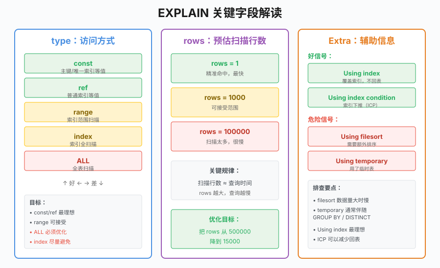
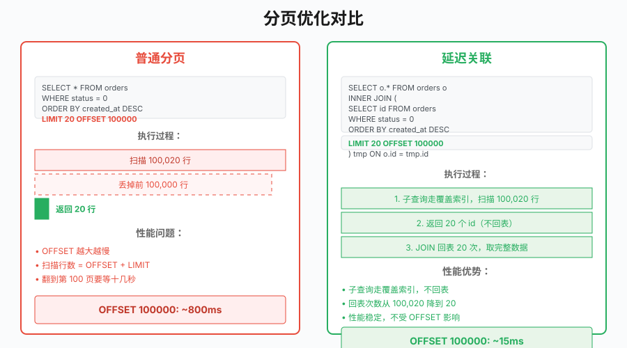
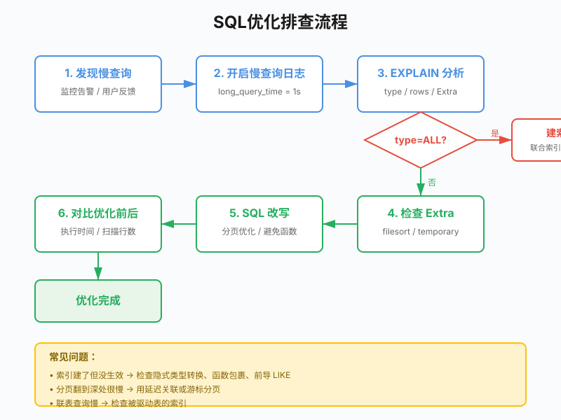

# 第 18 章 SQL优化

## 场景

订单查询接口上线三个月，数据量从 1 万涨到 50 万。产品经理说：

> "最近翻页特别慢，翻到第 100 页要等十几秒，用户都在投诉。"

你打开代码，发现查询 SQL 长这样：

```sql
SELECT * FROM orders
WHERE status = 0 AND created_at > '2025-01-01'
ORDER BY created_at DESC
LIMIT 20 OFFSET 1000;
```

这条 SQL 在数据量小时跑得飞快，现在却越来越慢。Leader 说：

> "先定位慢在哪里，再优化。"

本章解决四个问题：
1. 怎么找到慢查询？
2. 为什么索引建了却没生效？
3. 分页翻到深处为什么慢？
4. 怎么系统地优化 SQL？

---

## 18.1 定位慢查询

### 18.1.1 慢查询日志

MySQL 默认不记录慢查询。生产环境要主动开启：

```sql
-- 查看当前配置
SHOW VARIABLES LIKE 'slow_query%';
SHOW VARIABLES LIKE 'long_query_time';

-- 临时开启（重启失效）
SET GLOBAL slow_query_log = ON;
SET GLOBAL long_query_time = 0.5;  -- 超过 500ms 记录
SET GLOBAL log_queries_not_using_indexes = ON;
```

生产环境建议设成 1 秒，避免日志量太大。配置完跑一遍查询，去日志目录看：

```bash
# 默认位置在数据目录
tail -100 /var/lib/mysql/$(hostname)-slow.log
```

慢查询日志会记录查询时间、锁时间、扫描行数、SQL 原文。信息够全，但不够直观。

### 18.1.2 EXPLAIN 分析

`EXPLAIN` 是分析慢查询的主力工具：

```sql
EXPLAIN SELECT * FROM orders
WHERE status = 0 AND created_at > '2025-01-01'
ORDER BY created_at DESC
LIMIT 20 OFFSET 1000\G
```

输出长这样：

```
           id: 1
  select_type: SIMPLE
        table: orders
         type: ALL
possible_keys: NULL
          key: NULL
      key_len: NULL
          ref: NULL
         rows: 498732
        Extra: Using where; Using filesort
```

一眼就能看出问题：

- **type = ALL**：全表扫描，没有用到索引
- **rows ≈ 50 万**：扫描了几乎所有行
- **Extra 有 filesort**：数据量一大，文件排序就来了

#### EXPLAIN 关键字段



**type**：访问方式，从好到差排：

| type | 含义 | 什么时候出现 |
|------|------|-------------|
| const | 主键或唯一索引等值查询 | `WHERE id = 1` |
| ref | 普通索引等值查询 | `WHERE status = 0` |
| range | 索引范围扫描 | `WHERE created_at > '...'` |
| index | 索引全扫描 | 比 ALL 好一点 |
| ALL | 全表扫描 | 能避免就避免 |

**Extra**：辅助信息，关注几个危险信号：

| Extra | 含义 |
|-------|------|
| Using filesort | 需要额外排序，数据量大时很慢 |
| Using temporary | 用了临时表，通常伴随 GROUP BY 或 DISTINCT |
| Using index | 覆盖索引，理想情况 |
| Using index condition | 索引下推（ICP），MySQL 5.6+ 新特性 |

**rows**：预估扫描行数。这列很关键——扫描行数和查询时间基本成正比。

---

## 18.2 索引优化

### 18.2.1 建联合索引

上面的查询，status 和 created_at 都没索引。建一个联合索引：

```sql
ALTER TABLE orders ADD INDEX idx_status_created (status, created_at);
```

再跑一次 EXPLAIN：

```
         type: range
 possible_keys: idx_status_created
          key: idx_status_created
         rows: 15234
        Extra: Using where; Backward index scan
```

type 从 `ALL` 变成 `range`（`status = 0` 等值 + `created_at > '...'` 范围，走复合索引的范围扫描），扫描行从 50 万降到 1.5 万。响应时间从 15 秒降到了 200ms 左右。

注意 Extra 里**没有** `Using filesort`——`ORDER BY created_at DESC` 直接用索引顺序满足了。原因见下一节。

> `SELECT *` 需要回表取全部列，所以 Extra 不会是 `Using index`（覆盖索引）。想看到 `Using index`，得让查询列全部落在索引里，见 18.2.3。

### 18.2.2 联合索引最左前缀与排序

为什么 `ORDER BY created_at DESC` 不需要 filesort？关键在联合索引 `(status, created_at)` 的物理顺序：先按 status 排，status 相同再按 created_at 排。

查询里 `status = 0` 是**等值**条件，锁定 status=0 这一段后，这段内的记录天然就是按 created_at 有序的。所以：

- 排序方向和索引一致时（`ORDER BY created_at ASC`），正向扫描即可
- 排序方向相反时（`ORDER BY created_at DESC`），MySQL 8.0 做**反向索引扫描**（Backward index scan），同样无需 filesort

这就是"等值列放前、排序/范围列放后"的价值：等值前缀不打断后续列的有序性，索引能同时服务过滤和排序。

反过来，什么时候会触发 filesort？当排序列不是紧跟在等值前缀之后时。比如：

```sql
-- 索引 (status, created_at)，却按未进索引的 amount 排序
SELECT * FROM orders WHERE status = 0 ORDER BY amount DESC;
-- Extra: Using where; Using filesort  ← 索引管不到 amount 的顺序
```

所以现在的 `(status, created_at)` 对这条业务查询已是最优：既命中 `status = 0 AND created_at > ?` 的过滤，又满足了 `created_at` 的排序。

### 18.2.3 覆盖索引

如果查询只需要 id 和 order_no，可以建一个覆盖索引：

```sql
ALTER TABLE orders ADD INDEX idx_status_created_cover (status, created_at, id, order_no);

SELECT id, order_no FROM orders
WHERE status = 0 AND created_at > '2025-01-01'
ORDER BY created_at DESC
LIMIT 20;
```

EXPLAIN 的 Extra 会出现 `Using index`，表示查询字段都在索引中，不需要回表。

覆盖索引的性能提升很明显，但代价是索引变大。只在高频查询且字段不多的场景下使用。

### 18.2.4 索引下推（ICP）

MySQL 5.6 引入，在存储引擎层就过滤掉不符合条件的行，减少回表次数。

```sql
-- 联合索引 (status, created_at)
SELECT * FROM orders WHERE status = 0 AND created_at > '2025-01-01';
```

没有 ICP 时，存储引擎查出 status=0 的所有记录，全部回表，Server 层再过滤 created_at。有 ICP 时，存储引擎直接按 `(status, created_at)` 两个条件过滤，只回表符合条件的结果。

Extra 里出现 `Using index condition` 就是 ICP 生效了。

---

## 18.3 SQL 改写

### 18.3.1 分页优化

当用户翻到很后面：

```sql
SELECT * FROM orders
WHERE status = 0
ORDER BY created_at DESC
LIMIT 20 OFFSET 100000;
```

MySQL 需要扫描 100020 行，然后丢掉前 100000 行。翻的页越深越慢。

这个问题的本质是：LIMIT OFFSET 根本没有跳过数据，它只是假装跳过了。



**延迟关联**

思路很简单——先查主键，再 JOIN 回表拿完整数据：

```sql
SELECT o.* FROM orders o
INNER JOIN (
    SELECT id FROM orders
    WHERE status = 0
    ORDER BY created_at DESC
    LIMIT 20 OFFSET 100000
) tmp ON o.id = tmp.id
ORDER BY o.created_at DESC;
```

子查询只走了 idx_status_created 的覆盖索引，不需要回表。拿到 20 个主键后再去聚簇索引捞完整行。回表次数从 100020 次降到了 20 + 20 次。

实测效果：OFFSET 100000 时，普通写法 800ms，延迟关联 15ms。

**游标分页**

如果业务允许，更好的方案是游标分页（cursor-based pagination）。不做 OFFSET，而是记住上一页最后一条记录的 created_at：

```sql
SELECT * FROM orders
WHERE status = 0 AND created_at < '2025-03-15 10:30:00'
ORDER BY created_at DESC
LIMIT 20;
```

这种写法天生走索引，无论翻到多深都是恒定的性能。缺点是不能随意跳页码，适合"加载更多"这种场景。

### 18.3.2 避免隐式类型转换

```sql
-- order_no 是 VARCHAR，但传了数字
SELECT * FROM orders WHERE order_no = 123456;
```

MySQL 会把 `order_no` 隐式转成数字，导致索引失效。等同于 `CAST(order_no AS SIGNED) = 123456`。

解决办法：代码里传字符串。

### 18.3.3 避免函数包裹索引列

```sql
-- 不走索引
SELECT * FROM orders WHERE DATE(created_at) = '2025-03-15';

-- 走索引
SELECT * FROM orders WHERE created_at >= '2025-03-15 00:00:00' AND created_at < '2025-03-16 00:00:00';
```

函数包裹索引列会让优化器放弃索引。不只是 `DATE()`，`LEFT()`、`YEAR()`、`SUBSTR()` 都一样。

### 18.3.4 前导通配符 LIKE

```sql
-- 不走索引
SELECT * FROM orders WHERE order_no LIKE '%20250315%';

-- 走索引（如果 order_no 有索引）
SELECT * FROM orders WHERE order_no LIKE '20250315%';
```

前导通配符让 B+Tree 无法按序定位，只能全扫描。业务上如果必须做模糊搜索，考虑走搜索引擎或倒排索引。

### 18.3.5 索引列参与运算

```sql
-- 不走索引
SELECT * FROM orders WHERE id + 1 = 1000;

-- 走索引
SELECT * FROM orders WHERE id = 999;
```

把索引列单独放在等号一边，不要在它上面做运算。

---

## 18.4 实战：订单查询优化

> 代码：`18-sql/example2-pagination/`

### 18.4.1 建表和数据准备

```sql
CREATE TABLE orders (
    id BIGINT AUTO_INCREMENT PRIMARY KEY,
    order_no VARCHAR(64) NOT NULL DEFAULT '',
    user_id BIGINT NOT NULL DEFAULT 0,
    status TINYINT NOT NULL DEFAULT 0 COMMENT '0:待处理 1:已处理 2:已完成',
    total_amount DECIMAL(10,2) NOT NULL DEFAULT 0.00,
    created_at DATETIME NOT NULL DEFAULT CURRENT_TIMESTAMP,
    updated_at DATETIME NOT NULL DEFAULT CURRENT_TIMESTAMP ON UPDATE CURRENT_TIMESTAMP,
    INDEX idx_status_created (status, created_at)
) ENGINE=InnoDB DEFAULT CHARSET=utf8mb4;
```

插入 50 万行测试数据后，先不加索引，看看慢查询的样子：

```sql
-- 没有索引时，全表扫描
EXPLAIN SELECT * FROM orders
WHERE status = 0 AND created_at > '2025-01-01'
ORDER BY created_at DESC
LIMIT 20 OFFSET 1000\G
```

输出：

```
         type: ALL
         rows: 498732
        Extra: Using where; Using filesort
```

加上索引后再看：

```sql
ALTER TABLE orders ADD INDEX idx_status_created (status, created_at);

EXPLAIN SELECT * FROM orders
WHERE status = 0 AND created_at > '2025-01-01'
ORDER BY created_at DESC
LIMIT 20 OFFSET 1000\G
```

输出：

```
         type: range
         rows: 15234
        Extra: Using where; Backward index scan
```

### 18.4.2 Go 代码对比

```go
// 普通分页
func normalPagination(db *sql.DB, offset int) ([]Order, error) {
    rows, err := db.Query(`
        SELECT id, order_no, user_id, status, total_amount, created_at
        FROM orders
        WHERE status = 0
        ORDER BY created_at DESC
        LIMIT 20 OFFSET ?`, offset)
    if err != nil {
        return nil, err
    }
    defer rows.Close()
    
    var orders []Order
    for rows.Next() {
        var o Order
        rows.Scan(&o.ID, &o.OrderNo, &o.UserID, &o.Status, &o.TotalAmount, &o.CreatedAt)
        orders = append(orders, o)
    }
    return orders, nil
}

// 延迟关联分页
func deferredJoinPagination(db *sql.DB, offset int) ([]Order, error) {
    rows, err := db.Query(`
        SELECT o.id, o.order_no, o.user_id, o.status, o.total_amount, o.created_at
        FROM orders o
        INNER JOIN (
            SELECT id FROM orders
            WHERE status = 0
            ORDER BY created_at DESC
            LIMIT 20 OFFSET ?
        ) tmp ON o.id = tmp.id
        ORDER BY o.created_at DESC`, offset)
    if err != nil {
        return nil, err
    }
    defer rows.Close()
    
    var orders []Order
    for rows.Next() {
        var o Order
        rows.Scan(&o.ID, &o.OrderNo, &o.UserID, &o.Status, &o.TotalAmount, &o.CreatedAt)
        orders = append(orders, o)
    }
    return orders, nil
}
```

### 18.4.3 运行示例

```bash
cd 18-sql/example2-pagination

# 启动本地 MySQL 8.0
docker run --name go-book-mysql \
  -e MYSQL_ROOT_PASSWORD=root \
  -p 3306:3306 \
  -d mysql:8.4

# 等待 MySQL 就绪后初始化数据库
mysql -u root -p < migrations/001_setup.sql

# 配置连接串
export MYSQL_DSN='root:root@tcp(localhost:3306)/go_book_sql?charset=utf8mb4&parseTime=true'

# 运行测试
go test ./...

# 启动服务
go run main.go

# 测试分页
curl "http://localhost:8080/api/v1/orders?page=1&size=20"
curl "http://localhost:8080/api/v1/orders?page=100&size=20"
```

---

## 18.5 原理：优化器成本模型

优化器选索引不是看哪个顺眼，而是**成本估算**。

MySQL 优化器的成本模型考虑两个维度：

1. **IO 成本**：从磁盘读取数据页的成本。`rows` 越大，IO 成本越高。
2. **CPU 成本**：在内存中处理数据的成本。排序、分组、连接都要算。

优化器会枚举可能的索引路径，估算每个路径的总成本，选最小的那个。

```sql
-- 看优化器算出来的成本
SHOW STATUS LIKE 'Last_query_cost';
```

返回的是一个浮点数，代表大概的页访问次数。

所以优化器为什么有时候"选错"索引？

- **统计信息不准**：`ANALYZE TABLE` 可以刷新
- **回表成本被低估**：一张表有 5 个非聚簇索引，每个索引返回的行数比实际大，优化器可能选了一个要大量回表的索引
- **排序成本没算对**：WHERE 条件很高效，但 ORDER BY 需要 filesort，优化器可能更倾向走另一个能排序的索引

---

## 18.6 最佳实践

### 18.6.1 排查流程



遇到慢查询，按这个顺序排查：

1. 开慢查询日志，拿到出问题的 SQL
2. `EXPLAIN` 分析扫描行数和访问类型
3. 看 Extra 有没有 `Using filesort` / `Using temporary`
4. 建索引或改 SQL
5. 对比优化前后的执行时间

### 18.6.2 索引设计清单

- 每个索引覆盖高频查询场景，不建"可能用得上"的索引
- 一张表的索引控制在 5 个以内，太多影响写入性能
- 联合索引把等值条件放前面，范围条件放后面
- 用小表验证索引效果，不要等上线才发现

### 18.6.3 日常代码规范

- 业务代码禁止 `SELECT *`，按需取列
- 批量操作用 batch，单条 INSERT 循环要杜绝
- WHERE 条件里的索引列不做运算、不套函数

---

## 18.7 排障

### 18.7.1 索引没走，但明明建了

**问题**：`status` 列有索引，`WHERE status = '0'` 却不走索引。

**原因**：`status` 是 INT，查询条件传了字符串。MySQL 的隐式类型转换让索引失效。

**解决**：代码里传 INT 类型。

### 18.7.2 联表查询特别慢

**问题**：

```sql
SELECT * FROM orders o
LEFT JOIN order_items oi ON o.id = oi.order_id
ORDER BY o.created_at DESC
LIMIT 20;
```

`EXPLAIN` 发现驱动表扫描 50 万行，被驱动表走全表扫描。

**原因**：`order_items.order_id` 没有索引。

**解决**：加索引后，type 变成 ref，查询时间从 12 秒降到 80ms。

### 18.7.3 明明加了 LIMIT 还是慢

**问题**：翻到第 100 页时，`LIMIT 20 OFFSET 1980` 扫描了 2000 行然后丢掉 1980 行。

**原因**：OFFSET 1980 需要扫描 2000 行。

**解决**：改成游标分页或延迟关联。

---

## 18.8 面试题

**Q1：联合索引 (a, b, c)，以下查询哪些能用上索引？**

```sql
WHERE a = 1 AND b = 2 AND c = 3        -- 全用到
WHERE a = 1 AND b > 2 AND c = 3        -- a 和 b 用到，c 用不到（范围后中断）
WHERE b = 2 AND c = 3                  -- 用不到（跳过了 a）
WHERE a = 1 ORDER BY b                 -- a 等值查询，b 索引排序
WHERE a = 1 ORDER BY c                 -- a 等值查询，c 索引排序要 filesort
```

**Q2：分页翻到很深的时候，性能瓶颈在哪？**

A：OFFSET 100000 需要扫描 100020 行然后丢掉前 100000 行。扫描行数和翻页深度成正比。延迟关联或游标分页可以解决。

**Q3：一条 SQL 执行慢，排查思路是什么？**

A：先看是不是网络问题或锁等待（`SHOW PROCESSLIST`），再看有没有慢查询日志，然后 `EXPLAIN` 分析扫描行数和索引使用情况，针对性优化。

**Q4：什么是覆盖索引？**

A：查询字段都在索引中，不需要回表。EXPLAIN 的 Extra 会出现 `Using index`。

**Q5：什么是索引下推？**

A：MySQL 5.6 引入，在存储引擎层就过滤掉不符合条件的行，减少回表次数。EXPLAIN 的 Extra 会出现 `Using index condition`。

---

## 18.9 小结

本章从订单查询变慢的问题出发，学习了 SQL 优化的方法：

1. **定位慢查询**：慢查询日志、EXPLAIN 分析
2. **索引优化**：联合索引、覆盖索引、索引下推
3. **SQL 改写**：分页优化、避免隐式转换、避免函数包裹
4. **实战**：订单查询优化对比
5. **原理**：优化器成本模型
6. **最佳实践**：排查流程、索引设计清单

**核心原则：**

> SQL 优化这件事，说白了就是减少扫描行数。用好 EXPLAIN，看懂 type、rows、Extra 三列，就已经解决了 80% 的问题。

下一章我们将学习事务与锁，让并发操作更安全。

---

## 参考资料

> 本章基于 **MySQL 8.4 LTS**、**Go 1.25**、go-sql-driver/mysql v1.10.0。索引/锁/优化器行为与部分语法（如降序索引、DATETIME 存储）在不同 MySQL 版本间有差异，以对应版本官方文档为准。

- MySQL 8.4 参考手册首页：https://dev.mysql.com/doc/refman/8.4/en/
- EXPLAIN 输出格式：https://dev.mysql.com/doc/refman/8.4/en/explain-output.html
- ORDER BY 优化（filesort / backward index scan）：https://dev.mysql.com/doc/refman/8.4/en/order-by-optimization.html
- 索引下推 ICP：https://dev.mysql.com/doc/refman/8.4/en/index-condition-pushdown-optimization.html
- 慢查询日志：https://dev.mysql.com/doc/refman/8.4/en/slow-query-log.html
