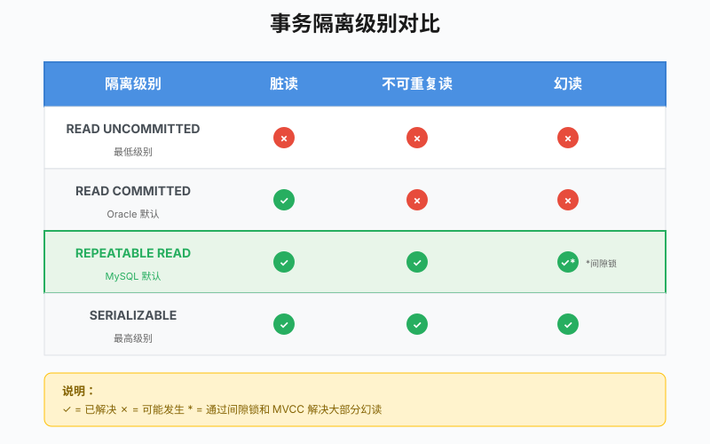
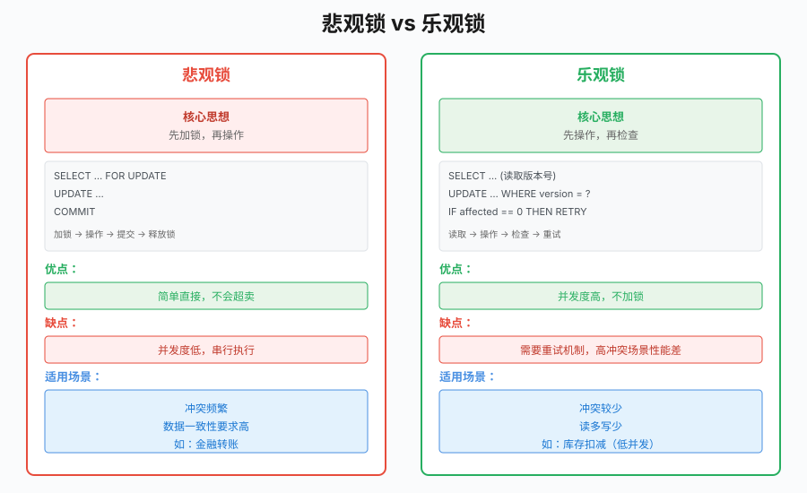
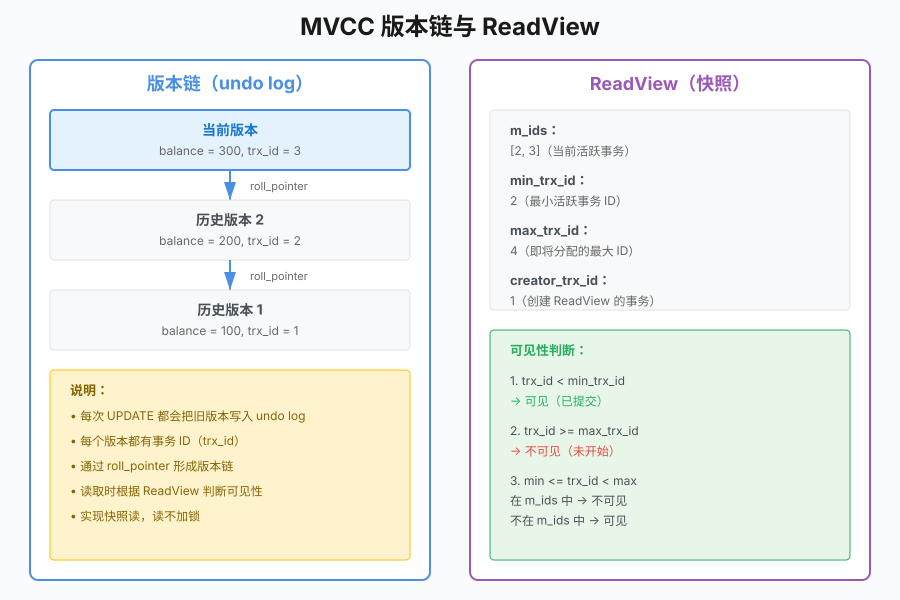

# 第 19 章 事务与锁

## 场景

转账功能上线第一天，就出事了。

产品经理打来电话：

> "有个用户投诉，A 账户扣了 100 块，但 B 账户没收到。查了日志发现服务中途重启了。"

你打开代码，发现转账逻辑长这样：

```go
// 扣钱
db.Exec("UPDATE accounts SET balance = balance - 100 WHERE user_id = 'A'")

// 加钱（服务在这里重启了）
db.Exec("UPDATE accounts SET balance = balance + 100 WHERE user_id = 'B'")
```

问题很明显：两步操作没有原子性，中间断了就出问题了。

Leader 说：

> "用事务，保证要么都成功，要么都不执行。"

本章解决四个问题：
1. 事务怎么用？
2. 并发操作会有什么问题？
3. 锁是怎么工作的？
4. 库存扣减怎么防超卖？

---

## 19.1 事务基础

### 19.1.1 ACID 特性

事务有四个特性，合称 ACID：

| 特性 | 含义 | 转账场景 |
|------|------|----------|
| **A**tomicity（原子性） | 要么全成功，要么全失败 | 扣钱和加钱必须同时成功或同时失败 |
| **C**onsistency（一致性） | 事务和约束共同保证业务不变量 | 转账前后总金额不变，余额不能为负 |
| **I**solation（隔离性） | 并发事务互不干扰 | A 转账时，B 不能同时操作同一账户 |
| **D**urability（持久性） | 提交后数据永久保存 | 转账成功后，重启服务数据不丢 |

### 19.1.2 Go 中的事务

```go
// 开启事务，并把请求上下文传给数据库驱动
tx, err := db.BeginTx(ctx, nil)
if err != nil {
    return err
}

// 确保回滚
defer tx.Rollback()

// 执行操作
_, err = tx.Exec("UPDATE accounts SET balance = balance - 100 WHERE user_id = ?", "A")
if err != nil {
    return err
}

_, err = tx.Exec("UPDATE accounts SET balance = balance + 100 WHERE user_id = ?", "B")
if err != nil {
    return err
}

// 提交事务
return tx.Commit()
```

关键点：
- `defer tx.Rollback()` 作为失败路径的兜底
- 如果 `Commit()` 成功，后续 `Rollback()` 只会返回 `sql.ErrTxDone`，不会撤销已提交的数据
- 如果中途出错，`Rollback()` 会撤销所有操作

### 19.1.3 转账案例

> 代码：`19-sql/example1-transaction/`

```go
// amountCents 使用“分”表示金额，避免 float64 的精度问题。
func Transfer(ctx context.Context, db *sql.DB, from, to string, amountCents int64) error {
    if from == to {
        return fmt.Errorf("转出账户和收款账户不能相同")
    }
    if amountCents <= 0 {
        return fmt.Errorf("转账金额必须大于 0")
    }

    tx, err := db.BeginTx(ctx, nil)
    if err != nil {
        return err
    }
    defer tx.Rollback()

    // 扣钱
    result, err := tx.ExecContext(ctx, 
        "UPDATE accounts SET balance = balance - ? WHERE user_id = ? AND balance >= ?",
        amountCents, from, amountCents)
    if err != nil {
        return err
    }
    if affected, err := result.RowsAffected(); err != nil {
        return err
    } else if affected != 1 {
        return fmt.Errorf("转出账户不存在或余额不足")
    }

    // 加钱
    result, err = tx.ExecContext(ctx,
        "UPDATE accounts SET balance = balance + ? WHERE user_id = ?",
        amountCents, to)
    if err != nil {
        return err
    }
    if affected, err := result.RowsAffected(); err != nil {
        return err
    } else if affected != 1 {
        return fmt.Errorf("收款账户不存在")
    }

    return tx.Commit()
}
```

运行示例：

```bash
cd 19-sql/example1-transaction

# 启动 MySQL
docker run --name go-book-mysql \
  -e MYSQL_ROOT_PASSWORD=root \
  -p 3306:3306 \
  -d mysql:8.0

# 初始化数据
mysql -u root -p < migrations/001_accounts.sql

# 运行
export MYSQL_DSN='root:root@tcp(localhost:3306)/go_book_transaction?charset=utf8mb4'
go run main.go
```

---

## 19.2 并发问题

事务解决了单线程的原子性问题，但多线程并发时还有新问题。

### 19.2.1 脏读

**场景**：事务 A 读到了事务 B 未提交的数据。

```
时间线：
T1: B 开始事务，修改 balance = 50（未提交）
T2: A 读取 balance，得到 50
T3: B 回滚，balance 恢复为 100
T4: A 再次读取 balance，得到 100

问题：A 在 T2 读到了脏数据
```

### 19.2.2 不可重复读

**场景**：同一事务内，两次读取结果不同。

```
时间线：
T1: A 开始事务，读取 balance = 100
T2: B 修改 balance = 200 并提交
T3: A 再次读取 balance，得到 200

问题：A 在同一事务内读到不同的值
```

### 19.2.3 幻读

**场景**：同一事务内，两次查询行数不同。

```
时间线：
T1: A 查询所有 balance > 50 的记录，得到 10 条
T2: B 插入一条 balance = 100 的记录并提交
T3: A 再次查询，得到 11 条

问题：A 在同一事务内看到"幻影"记录
```

### 19.2.4 隔离级别

MySQL 提供四种隔离级别，解决不同的并发问题：

| 隔离级别 | 脏读 | 不可重复读 | 范围查询的幻读 |
|----------|:----:|:----------:|:--------------:|
| READ UNCOMMITTED | 可能 | 可能 | 可能 |
| READ COMMITTED | 不会 | 可能 | 可能 |
| **REPEATABLE READ** | 不会 | 快照读通常不会 | 快照读不会，锁定读依赖范围锁 |
| SERIALIZABLE | 不会 | 不会 | 不会 |

这里要区分两种读取：

- **快照读**：普通 `SELECT`，由 MVCC 提供一致性视图。
- **锁定读**：`SELECT ... FOR UPDATE` 或 `SELECT ... FOR SHARE`，读取当前版本并申请锁。

在 InnoDB 中，REPEATABLE READ 会结合 MVCC 和 next-key lock 保护常见范围查询，但具体锁定范围仍取决于索引和执行计划。

查看和设置隔离级别：

```sql
-- 查看当前隔离级别
SELECT @@transaction_isolation;

-- 设置隔离级别（会话级别）
SET SESSION transaction_isolation = 'REPEATABLE-READ';
```



---

## 19.3 锁机制

### 19.3.1 锁的类型

**共享锁（S 锁）**：读锁，多个事务可以同时持有

```sql
SELECT * FROM accounts WHERE user_id = 'A' FOR SHARE;
```

**排他锁（X 锁）**：写锁，独占

```sql
SELECT * FROM accounts WHERE user_id = 'A' FOR UPDATE;
```

兼容性矩阵：

|  | S 锁 | X 锁 |
|--|:----:|:----:|
| S 锁 | ✓ | ✗ |
| X 锁 | ✗ | ✗ |

### 19.3.2 行锁 vs 表锁

InnoDB 的记录锁基于索引。以下情况可能锁住大量索引记录，使并发度显著下降：

1. **没有合适索引**：扫描范围变大，可能锁住大量记录
2. **索引区分度低**：需要结合执行计划判断实际扫描范围
3. **范围查询**：在特定隔离级别下可能锁住记录和索引间隙

```sql
-- 有索引，走行锁
UPDATE accounts SET balance = 100 WHERE user_id = 'A';

-- 没有合适索引，可能扫描并锁住大量记录
UPDATE accounts SET balance = 100 WHERE name = 'Alice';
```

### 19.3.3 间隙锁

REPEATABLE READ 级别下，InnoDB 会锁住索引之间的"间隙"，防止幻读。

```sql
-- 假设 id 是主键，表中存在 id = 1, 5, 10
SELECT * FROM accounts WHERE id BETWEEN 5 AND 10 FOR UPDATE;

-- 可能锁住命中的记录以及访问范围内的索引间隙
-- 其他事务插入范围内的新记录时可能被阻塞
```

实际锁定范围取决于索引、查询条件、执行计划和隔离级别，不能只根据 SQL 文本判断。

### 19.3.4 死锁

**场景**：两个事务互相等待对方释放锁。

```
事务 A：持有行 1 的锁，等待行 2 的锁
事务 B：持有行 2 的锁，等待行 1 的锁
```

MySQL 的死锁检测：

```sql
-- 查看死锁检测和锁等待超时配置
SHOW VARIABLES LIKE 'innodb_deadlock_detect';
SHOW VARIABLES LIKE 'innodb_lock_wait_timeout';

-- 查看最近的死锁信息
SHOW ENGINE INNODB STATUS;

-- MySQL 8.0 还可以查看当前锁等待
SELECT * FROM performance_schema.data_lock_waits;
```

解决死锁的方法：
1. **按相同顺序访问资源**：所有事务都先锁行 1，再锁行 2
2. **减小事务粒度**：事务越短，持锁时间越短
3. **设置超时**：`innodb_lock_wait_timeout`
4. **重试机制**：捕获死锁错误，有限次数重试

---

## 19.4 实战：库存扣减

> 代码：`19-sql/example2-inventory/`

### 19.4.1 问题场景

电商秒杀，库存只有 10 件，但并发请求有 100 个。

```go
// 错误：没有并发控制
func DeductStock(db *sql.DB, productID string) error {
    // 查询库存
    var stock int
    db.QueryRow("SELECT stock FROM products WHERE id = ?", productID).Scan(&stock)
    
    if stock <= 0 {
        return fmt.Errorf("库存不足")
    }
    
    // 扣减库存（这里可能超卖）
    _, err := db.Exec("UPDATE products SET stock = stock - 1 WHERE id = ?", productID)
    return err
}
```

问题：多个请求同时读到 stock = 1，都判断库存充足，都去扣减，结果超卖。

### 19.4.2 悲观锁方案

```go
func DeductStockPessimistic(ctx context.Context, db *sql.DB, productID string) error {
    tx, err := db.BeginTx(ctx, nil)
    if err != nil {
        return err
    }
    defer tx.Rollback()

    // 加锁查询
    var stock int
    err = tx.QueryRowContext(ctx,
        "SELECT stock FROM products WHERE id = ? FOR UPDATE",
        productID).Scan(&stock)
    if err != nil {
        return err
    }

    if stock <= 0 {
        return fmt.Errorf("库存不足")
    }

    // 扣减库存
    _, err = tx.ExecContext(ctx,
        "UPDATE products SET stock = stock - 1 WHERE id = ?", productID)
    if err != nil {
        return err
    }

    return tx.Commit()
}
```

优点：简单直接，不会超卖
缺点：并发度低，串行执行

### 19.4.3 乐观锁方案

```go
func DeductStockOptimistic(ctx context.Context, db *sql.DB, productID string) error {
    for retry := 0; retry < 3; retry++ {
        // 查询库存和版本号
        var stock, version int
        err := db.QueryRowContext(ctx,
            "SELECT stock, version FROM products WHERE id = ?",
            productID).Scan(&stock, &version)
        if err != nil {
            return err
        }

        if stock <= 0 {
            return fmt.Errorf("库存不足")
        }

        // 带版本号更新
        result, err := db.ExecContext(ctx,
            "UPDATE products SET stock = stock - 1, version = version + 1 WHERE id = ? AND version = ?",
            productID, version)
        if err != nil {
            return err
        }

        affected, err := result.RowsAffected()
        if err != nil {
            return err
        }
        if affected > 0 {
            return nil
        }

        // 版本号冲突，重试
    }
    return fmt.Errorf("更新失败，请重试")
}
```

优点：并发度高，不加锁
缺点：需要重试机制，高冲突场景性能差



### 19.4.4 对比

| 方案 | 并发度 | 实现复杂度 | 适用场景 |
|------|:------:|:----------:|----------|
| 悲观锁 | 低 | 简单 | 冲突频繁、数据一致性要求高 |
| 乐观锁 | 高 | 中等 | 冲突较少、读多写少 |

---

## 19.5 原理：MVCC

### 19.5.1 什么是 MVCC

MVCC（Multi-Version Concurrency Control）是多版本并发控制。

核心思想：读不加锁，通过版本号实现快照读。

- **快照读**：读取数据的某个历史版本
- **当前读**：读取数据的最新版本，并加锁

```sql
-- 快照读（不加锁）
SELECT * FROM accounts WHERE user_id = 'A';

-- 当前读（加锁）
SELECT * FROM accounts WHERE user_id = 'A' FOR UPDATE;
```

### 19.5.2 undo log

每次 UPDATE 操作都会把旧版本数据写到 undo log。

```
T1: balance = 100
T2: UPDATE balance = 200  →  undo log 记录 balance = 100
T3: UPDATE balance = 300  →  undo log 记录 balance = 200
```

undo log 形成一条版本链，每个版本都有事务 ID。

### 19.5.3 ReadView

事务开始时生成一个 ReadView，包含：

- **m_ids**：当前活跃（未提交）的事务 ID 列表
- **min_trx_id**：m_ids 中的最小值
- **max_trx_id**：系统即将分配的最大事务 ID
- **creator_trx_id**：创建该 ReadView 的事务 ID

读取时，按以下规则判断版本可见性：

1. 版本事务 ID < min_trx_id → 可见
2. 版本事务 ID >= max_trx_id → 不可见
3. min_trx_id <= 版本事务 ID < max_trx_id：
   - 在 m_ids 中 → 不可见
   - 不在 m_ids 中 → 可见



---

## 19.6 最佳实践

### 19.6.1 事务要短

```go
// 错误：事务中包含 RPC 调用
func Transfer(ctx context.Context, db *sql.DB, from, to string, amountCents int64) error {
    tx, _ := db.BeginTx(ctx, nil)
    defer tx.Rollback()

    // 扣钱
    tx.ExecContext(ctx, "UPDATE accounts SET balance = balance - ? WHERE user_id = ?", amountCents, from)

    // RPC 调用（耗时几秒）
    resp, _ := http.Get("https://api.example.com/notify")
    resp.Body.Close()
    
    // 加钱
    tx.ExecContext(ctx, "UPDATE accounts SET balance = balance + ? WHERE user_id = ?", amountCents, to)

    return tx.Commit()
}
```

问题：RPC 调用期间持锁，其他事务被阻塞。

正确做法：把 RPC 调用移到事务外面。

### 19.6.2 避免在事务中做耗时操作

- 不要在事务中调用外部 API
- 不要在事务中做复杂的计算
- 不要在事务中等待用户输入

### 19.6.3 合理选择隔离级别

- 不要只按“性能好”或“严格一致”选择隔离级别，要结合快照读、锁定读和业务不变量验证。
- MySQL 默认通常是 **REPEATABLE READ**；切换到 READ COMMITTED 前，应评估范围查询、锁等待和复制链路。

### 19.6.4 死锁重试机制

```go
func WithRetry(ctx context.Context, fn func() error) error {
    for i := 0; i < 3; i++ {
        err := fn()
        if err == nil {
            return nil
        }
        // 检查是否是死锁错误
        if isDeadlockError(err) {
            delay := time.Duration(i+1) * 100 * time.Millisecond
            timer := time.NewTimer(delay)
            select {
            case <-ctx.Done():
                timer.Stop()
                return ctx.Err()
            case <-timer.C:
            }
            continue
        }
        return err
    }
    return fmt.Errorf("重试失败")
}
```

---

## 19.7 排障

### 19.7.1 事务没生效

**问题**：转账还是出现扣钱成功但加钱失败的情况。

**原因**：忘了调用 `Commit()`、中途错误被忽略，或者实际操作绕过了事务对象。

**解决**：

```go
// 推荐：Rollback 作为失败路径兜底，Commit 成功后不会撤销数据
tx, _ := db.Begin()
defer tx.Rollback()
tx.Exec("UPDATE ...")
err := tx.Commit()
if err != nil {
    return err
}
```

### 19.7.2 死锁频繁发生

**问题**：日志中出现大量 `Deadlock found when trying to get lock`。

**原因**：多个事务以不同顺序访问资源。

**解决**：
1. 统一访问顺序
2. 减小事务粒度
3. 增加重试机制

### 19.7.3 长事务导致主从延迟

**问题**：主库正常，但从库延迟越来越大。

**原因**：长事务可能长时间持有锁、延迟 undo 清理，并放大大事务对复制和恢复链路的影响；不能简单归因于“从库被锁住”。

**解决**：
1. 拆分大事务
2. 批量操作分批执行
3. 监控长事务：`SHOW PROCESSLIST`

---

## 19.8 面试题

**Q1：ACID 分别是什么？**

A：
- **A**tomicity（原子性）：事务中的操作要么全成功，要么全失败
- **C**onsistency（一致性）：事务执行前后，数据状态合法
- **I**solation（隔离性）：并发事务互不干扰
- **D**urability（持久性）：提交后数据永久保存

**Q2：隔离级别有哪些？MySQL 默认是哪个？**

A：
- READ UNCOMMITTED：可能脏读、不可重复读、幻读
- READ COMMITTED：解决脏读，但可能出现不可重复读和范围查询幻读
- **REPEATABLE READ**（默认）：普通快照读保持一致视图，锁定读可能通过 next-key lock 保护范围
- SERIALIZABLE：串行化，解决所有问题，但性能最差

**Q3：什么是 MVCC？**

A：
- MVCC 是多版本并发控制
- 通过 undo log 保存数据的多个版本
- 通过 ReadView 判断版本的可见性
- 实现快照读，读不加锁

**Q4：悲观锁和乐观锁的区别？**

A：
- **悲观锁**：先加锁再操作，适合冲突频繁的场景
- **乐观锁**：先操作再检查，适合冲突较少的场景
- 悲观锁用 `FOR UPDATE`，乐观锁用版本号

**Q5：什么是间隙锁？**

A：
- 间隙锁是索引范围锁的一部分，通常出现在 REPEATABLE READ 下的锁定范围查询
- 它可能阻止其他事务在范围内插入记录
- 实际效果取决于索引、执行计划、隔离级别和读取方式

---

## 19.9 小结

本章从转账失败的案例出发，学习了事务与锁：

1. **事务基础**：ACID 特性、Go 中的事务用法
2. **并发问题**：脏读、不可重复读、幻读、隔离级别
3. **锁机制**：共享锁、排他锁、行锁、表锁、间隙锁、死锁
4. **实战**：库存扣减的悲观锁和乐观锁方案
5. **原理**：MVCC 的实现机制
6. **最佳实践**：事务要短、避免耗时操作、死锁重试

**核心原则：**

> 事务提供原子性边界，MVCC 和锁共同影响并发隔离。写代码时要同时关注业务不变量、访问顺序和失败重试。

下一章我们将学习 GORM 最佳实践，让数据库操作更简单。

---

## 参考资料

> 本章基于 **MySQL 8.0**、**Go 1.23**。索引/锁/优化器行为与部分语法（如降序索引、DATETIME 存储）在不同 MySQL 版本间有差异，以对应版本官方文档为准。

- MySQL 8.0 参考手册首页：https://dev.mysql.com/doc/refman/8.0/en/
- 事务隔离级别：https://dev.mysql.com/doc/refman/8.0/en/innodb-transaction-isolation-levels.html
- InnoDB 锁（gap / next-key）：https://dev.mysql.com/doc/refman/8.0/en/innodb-locking.html
- InnoDB 死锁：https://dev.mysql.com/doc/refman/8.0/en/innodb-deadlocks.html
- 一致性非锁定读（MVCC）：https://dev.mysql.com/doc/refman/8.0/en/innodb-consistent-read.html
