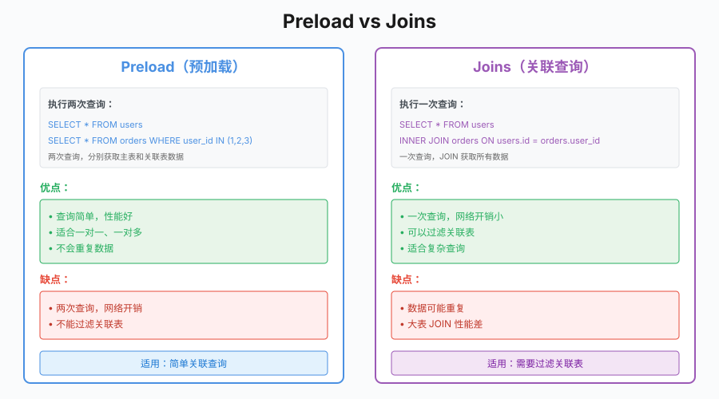

# 第20章 GORM最佳实践

## 场景

第17章我们用 `database/sql` 实现了用户管理系统，代码长这样：

```go
// 查询用户
rows, err := db.QueryContext(ctx, `
    SELECT id, username, email, phone, status, created_at
    FROM users
    WHERE deleted_at IS NULL
    ORDER BY created_at DESC, id DESC
    LIMIT ? OFFSET ?`,
    size, offset)
if err != nil {
    return nil, 0, err
}
defer rows.Close()

users := make([]*model.User, 0)
for rows.Next() {
    var user model.User
    var phone sql.NullString
    if err := rows.Scan(
        &user.ID,
        &user.Username,
        &user.Email,
        &phone,
        &user.Status,
        &user.CreatedAt,
    ); err != nil {
        return nil, 0, err
    }
    if phone.Valid {
        phoneValue := phone.String
        user.Phone = &phoneValue
    }
    users = append(users, &user)
}
```

问题很明显：
- 手动处理 `sql.NullString`
- 手动遍历 `rows.Next()`
- 手动 `Scan` 每个字段
- SQL 字符串拼接容易出错

Leader 说：
> "用 GORM，但别踩坑。"

本章解决五个问题：
1. GORM 怎么用？
2. 关联关系怎么处理？
3. 事务和钩子怎么用？
4. N+1 查询怎么避免？
5. 生产环境有什么注意事项？

---

## 20.1 GORM 基础

### 20.1.1 为什么用 ORM

原生 SQL 的问题：
- **样板代码多**：每次都要 `rows.Next()` + `Scan`
- **类型转换麻烦**：`NULL` 值要用 `sql.NullString`
- **维护成本高**：SQL 散落在代码各处
- **类型不安全**：字段名拼错编译不报错

ORM 的优势：
- **减少样板代码**：一行代码完成 CRUD
- **模型约束更集中**：结构体字段、标签和关联关系集中在模型层
- **可维护性**：数据访问逻辑集中管理
- **屏蔽部分方言差异**：常规 CRUD 改动小，复杂 SQL 仍要关注数据库特性

### 20.1.2 初始化连接

> 代码：`20-gorm/example1-basic/`

```go
import (
    "gorm.io/driver/mysql"
    "gorm.io/gorm"
    "gorm.io/gorm/logger"
)

// 初始化连接
db, err := gorm.Open(mysql.Open(dsn), &gorm.Config{
    Logger: logger.Default.LogMode(logger.Info),
})
if err != nil {
    log.Fatal("连接失败:", err)
}

// 获取底层 *sql.DB
sqlDB, err := db.DB()
if err != nil {
    log.Fatal(err)
}

// 配置连接池
sqlDB.SetMaxIdleConns(10)           // 最大空闲连接数
sqlDB.SetMaxOpenConns(100)          // 最大打开连接数
sqlDB.SetConnMaxLifetime(time.Hour) // 连接最大生命周期
```

连接池参数说明：
- `MaxIdleConns`：空闲连接数，太少会频繁创建连接
- `MaxOpenConns`：最大连接数，超过会阻塞
- `ConnMaxLifetime`：连接生命周期，避免长连接问题

### 20.1.3 模型定义

```go
type User struct {
    ID        uint           `gorm:"primaryKey"`
    Username  string         `gorm:"size:50;not null"`
    Email     string         `gorm:"size:100;not null"`
    Password  string         `gorm:"column:password_hash;size:255;not null"`
    Phone     *string        `gorm:"size:20"`
    Status    int8           `gorm:"default:1;comment:0:禁用 1:启用"`
    CreatedAt time.Time
    UpdatedAt time.Time
    DeletedAt gorm.DeletedAt `gorm:"index"` // 软删除
}

// 指定表名
func (User) TableName() string {
    return "users"
}
```

如果用户表使用软删除，不建议直接在 `username`、`email` 上声明 `uniqueIndex`。第17章已经讲过：软删除后唯一键不会自动释放，MySQL 可以用生成列约束“未删除用户唯一”。

标签说明：
- `primaryKey`：主键
- `size:50`：字段长度
- `not null`：非空约束
- `uniqueIndex`：唯一索引
- `column:xxx`：指定列名
- `default:1`：默认值
- `index`：普通索引

---

## 20.2 CRUD 操作

### 20.2.1 创建

```go
// 单条创建
user := User{
    Username: "alice",
    Email:    "alice@example.com",
    Password: "hashed_password",
}
result := db.Create(&user)
if result.Error != nil {
    return result.Error
}
fmt.Println(user.ID) // 创建后的 ID

// 批量创建
users := []User{
    {Username: "bob", Email: "bob@example.com", Password: "xxx"},
    {Username: "charlie", Email: "charlie@example.com", Password: "xxx"},
}
if err := db.Create(&users).Error; err != nil {
    return err
}

// 批量创建（指定批次大小）
if err := db.CreateInBatches(&users, 100).Error; err != nil {
    return err
}
```

### 20.2.2 查询

```go
// 查询单条
var user User
if err := db.First(&user, 1).Error; err != nil { // WHERE id = 1
    return err
}
if err := db.First(&user, "username = ?", "alice").Error; err != nil {
    return err
}

// 查询多条
var users []User
if err := db.Find(&users, "status = ?", 1).Error; err != nil {
    return err
}

// 条件查询
if err := db.Where("status = ? AND created_at > ?", 1, time.Now().AddDate(0, -1, 0)).
    Find(&users).Error; err != nil {
    return err
}

// 分页查询
var total int64
if err := db.Model(&User{}).Where("status = ?", 1).Count(&total).Error; err != nil {
    return err
}
if err := db.Where("status = ?", 1).
    Order("created_at DESC, id DESC").
    Offset(0).
    Limit(20).
    Find(&users).Error; err != nil {
    return err
}
```

### 20.2.3 更新

```go
// 更新所有字段（包括零值）
db.Save(&user)

// 更新零值或清空字段，使用 map 或 Select
db.Model(&user).Updates(map[string]interface{}{
    "status": 0,
    "phone":  nil,
})
db.Model(&user).
    Select("Status", "Phone").
    Updates(User{Status: 0, Phone: nil})
db.Model(&user).Update("status", 0)

// 跳过钩子和更新时间
db.Model(&user).UpdateColumns(User{Status: 0})
```

`Save` vs `Updates`：
- `Save`：更新所有字段，包括零值
- `Updates`：传结构体时只更新非零字段；传 `map` 时会更新零值和 `nil`

### 20.2.4 删除

```go
// 软删除（设置 deleted_at）
db.Delete(&user, 1)

// 物理删除
db.Unscoped().Delete(&user, 1)

// 查询包含软删除的记录
db.Unscoped().Find(&users)
```

---

## 20.3 关联关系

### 20.3.1 一对一

```go
type User struct {
    ID      uint
    Name    string
    Profile Profile // 一对一
}

type Profile struct {
    ID     uint
    UserID uint
    Bio    string
}

// 查询时预加载
var user User
db.Preload("Profile").First(&user, 1)
```

### 20.3.2 一对多

```go
type User struct {
    ID     uint
    Name   string
    Orders []Order // 一对多
}

type Order struct {
    ID     uint
    UserID uint
    Total  decimal.Decimal
}

// 查询时预加载
var user User
db.Preload("Orders").First(&user, 1)
```

### 20.3.3 多对多

```go
type User struct {
    ID    uint
    Name  string
    Roles []Role `gorm:"many2many:user_roles"`
}

type Role struct {
    ID   uint
    Name string
}

// 查询时预加载
var user User
db.Preload("Roles").First(&user, 1)
```

### 20.3.4 N+1 查询问题

**问题场景**：

```go
// 错误：N+1 查询
var users []User
db.Find(&users) // 1 次查询
for _, user := range users {
    db.Model(&user).Association("Orders").Find(&user.Orders) // 每个用户 1 次查询
}
// 总共 1 + N 次查询
```

**解决方案**：

```go
// 正确：Preload
var users []User
db.Preload("Orders").Find(&users) // 2 次查询
// SELECT * FROM users
// SELECT * FROM orders WHERE user_id IN (1, 2, 3, ...)
```



**Preload vs Joins**：

```go
// Preload：两次查询
db.Preload("Orders").Find(&users)

// Joins：适合过滤或聚合，结果通常扫描到 DTO
type UserOrderStat struct {
    UserID     uint
    Username   string
    OrderCount int64
}

var stats []UserOrderStat
db.Table("users").
    Select("users.id AS user_id, users.username, COUNT(orders.id) AS order_count").
    Joins("LEFT JOIN orders ON orders.user_id = users.id").
    Group("users.id, users.username").
    Scan(&stats)
```

选择建议：
- `Preload`：适合一对一、一对多、多对多，把关联数据装回结构体
- `Joins`：适合过滤、排序、聚合关联表，通常扫描到 DTO，不要把一对多 `Joins` 当成 `Preload` 的等价替代

---

## 20.4 事务与钩子

### 20.4.1 事务

```go
// 自动事务
err := db.Transaction(func(tx *gorm.DB) error {
    // 扣钱
    if err := tx.Model(&User{}).Where("id = ?", 1).
        Update("balance", gorm.Expr("balance - ?", 100)).Error; err != nil {
        return err
    }
    
    // 加钱
    if err := tx.Model(&User{}).Where("id = ?", 2).
        Update("balance", gorm.Expr("balance + ?", 100)).Error; err != nil {
        return err
    }
    
    return nil // 返回 nil 自动提交，返回 error 自动回滚
})

// 手动事务
tx := db.Begin()
defer func() {
    if r := recover(); r != nil {
        tx.Rollback()
        panic(r)
    }
}()

if err := tx.Error; err != nil {
    return err
}

// 操作...
if err := tx.Commit().Error; err != nil {
    return err
}
```

### 20.4.2 钩子

```go
type OutboxEvent struct {
    ID        uint
    Topic     string
    EventKey  string
    Body      string
    CreatedAt time.Time
}

// BeforeCreate：只做轻量校验
func (u *User) BeforeCreate(tx *gorm.DB) (err error) {
    if u.Username == "" {
        return errors.New("用户名不能为空")
    }
    return nil
}

// AfterCreate：创建后
func (u *User) AfterCreate(tx *gorm.DB) (err error) {
    // 只写事务内事件，不直接调用外部系统
    return tx.Create(&OutboxEvent{
        Topic:    "user.created",
        EventKey: strconv.FormatUint(uint64(u.ID), 10),
        Body:     fmt.Sprintf(`{"email":%q}`, u.Email),
    }).Error
}

// BeforeUpdate：更新前
func (u *User) BeforeUpdate(tx *gorm.DB) (err error) {
    // 记录变更日志
    return nil
}
```

### 20.4.3 钩子的坑

**问题 1**：钩子中调用其他模型操作

```go
// 错误：用“先查再写”替代唯一约束
func (u *User) BeforeCreate(tx *gorm.DB) (err error) {
    var count int64
    tx.Model(&User{}).Where("email = ?", u.Email).Count(&count) // 并发下仍可能重复
    if count > 0 {
        return errors.New("邮箱已存在")
    }
    return nil
}
```

更稳的做法是依赖数据库唯一约束，再把 duplicate key 错误转换成业务错误。密码哈希这类业务动作也建议放在 Service 层完成，避免 Hook 在批量导入或更新时重复加密。

**问题 2**：钩子影响性能和事务语义

```go
// 避免在钩子中做耗时操作
func (u *User) AfterCreate(tx *gorm.DB) (err error) {
    // 错误：同步调用外部 API
    callExternalAPI(u) // 阻塞创建
    
    // 错误：直接开 goroutine
    go callExternalAPI(u) // 事务回滚后消息也可能已经发出

    // 正确：写入 outbox_events，由后台任务在事务提交后发送
    return tx.Create(&OutboxEvent{Topic: "user.created"}).Error
}
```

---

## 20.5 实战：订单系统数据层

> 代码：`20-gorm/example2-order-system/`

### 20.5.1 模型设计

```go
// 用户
type User struct {
    ID        uint           `gorm:"primaryKey"`
    Username  string         `gorm:"size:50;not null"`
    Email     string         `gorm:"size:100;not null"`
    Balance   decimal.Decimal `gorm:"type:decimal(10,2);default:0"`
    Version   int             `gorm:"default:0"`
    CreatedAt time.Time
    UpdatedAt time.Time
    DeletedAt gorm.DeletedAt `gorm:"index"`
    Orders    []Order        `gorm:"foreignKey:UserID"`
}

// 订单
type Order struct {
    ID        uint            `gorm:"primaryKey"`
    OrderNo   string          `gorm:"size:64;not null;uniqueIndex"`
    UserID    uint            `gorm:"not null;index"`
    Status    int8            `gorm:"default:0;comment:0:待支付 1:已支付 2:已完成"`
    Total     decimal.Decimal `gorm:"type:decimal(10,2);not null"`
    CreatedAt time.Time
    UpdatedAt time.Time
    User      User            `gorm:"foreignKey:UserID"`
    Items     []OrderItem     `gorm:"foreignKey:OrderID"`
}

// 订单明细
type OrderItem struct {
    ID        uint            `gorm:"primaryKey"`
    OrderID   uint            `gorm:"not null;index"`
    ProductID uint            `gorm:"not null"`
    Quantity  int             `gorm:"not null"`
    Price     decimal.Decimal `gorm:"type:decimal(10,2);not null"`
}
```

### 20.5.2 Repository 模式

```go
// 接口定义
type UserRepository interface {
    Create(ctx context.Context, user *User) error
    GetByID(ctx context.Context, id uint) (*User, error)
    List(ctx context.Context, req ListUsersRequest) ([]*User, int64, error)
}

type ListUsersRequest struct {
    Page int
    Size int
}

// 实现
type userRepository struct {
    db *gorm.DB
}

func NewUserRepository(db *gorm.DB) UserRepository {
    return &userRepository{db: db}
}

func (r *userRepository) Create(ctx context.Context, user *User) error {
    return r.db.WithContext(ctx).Create(user).Error
}

func (r *userRepository) GetByID(ctx context.Context, id uint) (*User, error) {
    var user User
    err := r.db.WithContext(ctx).First(&user, id).Error
    if err != nil {
        return nil, err
    }
    return &user, nil
}

func (r *userRepository) List(ctx context.Context, req ListUsersRequest) ([]*User, int64, error) {
    if req.Page <= 0 {
        req.Page = 1
    }
    if req.Size <= 0 {
        req.Size = 20
    }
    if req.Size > 100 {
        req.Size = 100
    }

    var users []*User
    var total int64
    
    query := r.db.WithContext(ctx).Model(&User{})
    
    if err := query.Count(&total).Error; err != nil {
        return nil, 0, err
    }
    
    err := query.Order("created_at DESC, id DESC").
        Offset((req.Page - 1) * req.Size).
        Limit(req.Size).
        Find(&users).Error
    
    return users, total, err
}
```

### 20.5.3 并发安全：乐观锁

```go
type User struct {
    ID      uint
    Balance decimal.Decimal `gorm:"type:decimal(10,2)"`
    Version int             `gorm:"default:0"` // 版本号
}

// 扣减余额（乐观锁）
func (r *userRepository) DeductBalance(ctx context.Context, userID uint, amount decimal.Decimal) error {
    if amount.LessThanOrEqual(decimal.Zero) {
        return errors.New("扣减金额必须大于 0")
    }

    for i := 0; i < 3; i++ {
        var user User
        if err := r.db.WithContext(ctx).First(&user, userID).Error; err != nil {
            return err
        }
        
        if user.Balance.Cmp(amount) < 0 {
            return errors.New("余额不足")
        }
        
        result := r.db.WithContext(ctx).
            Model(&User{}).
            Where("id = ? AND version = ?", userID, user.Version).
            Updates(map[string]interface{}{
                "balance": gorm.Expr("balance - ?", amount),
                "version": gorm.Expr("version + 1"),
            })
        
        if result.Error != nil {
            return result.Error
        }
        
        if result.RowsAffected > 0 {
            return nil // 更新成功
        }
        
        timer := time.NewTimer(time.Duration(i+1) * 50 * time.Millisecond)
        select {
        case <-ctx.Done():
            timer.Stop()
            return ctx.Err()
        case <-timer.C:
        }
    }
    return errors.New("更新失败，请重试")
}
```

---

## 20.6 原理：GORM 如何工作

### 20.6.1 Statement 构建

下面是简化后的伪代码，用来说明 GORM 的执行链路，不是逐行对应的真实源码：

```go
// GORM 内部流程
db.Where("name = ?", "alice").Find(&users)

// 1. 构建 Statement
stmt := &gorm.Statement{DB: db}
stmt.Parse(&User{})
stmt.AddClause(clause.Where{
    Exprs: []clause.Expression{
        clause.Eq{Column: "name", Value: "alice"},
    },
})
stmt.AddClause(clause.From{})

// 2. 生成 SQL
builder := strings.Builder{}
stmt.Build("SELECT", "FROM", "WHERE")
sql := builder.String() // SELECT * FROM users WHERE name = 'alice'

// 3. 执行查询
stmt.Conn.QueryRowContext(ctx, sql, args...)
```

### 20.6.2 Callback 机制

GORM 的钩子通过 Callback 机制实现：

```go
// 注册钩子
db.Callback().Create().Before("gorm:create").Register("my_plugin:before_create", beforeCreate)

// 执行流程
db.Create(&user)
// 1. 执行 Before Create 回调
// 2. 执行 gorm:create
// 3. 执行 After Create 回调
```

### 20.6.3 性能开销

不要记固定比例。GORM 的性能差距取决于模型字段数量、关联数量、SQL 复杂度、数据库驱动、日志级别和业务数据量，应该用业务基准测试确认。

GORM 的性能开销主要来自：
- 反射：解析结构体标签
- SQL 生成：构建 SQL 语句
- 结果映射：将结果映射到结构体

---

## 20.7 最佳实践

### 20.7.1 查询优化

```go
// 错误：Select *
db.Find(&users)

// 正确：指定字段
db.Select("id", "username", "email").Find(&users)

// 大批量操作
db.CreateInBatches(&users, 100) // 分批插入

// 复杂查询用 Raw，但仍然只取需要的列并检查错误
err := db.Raw(`
    SELECT id, username, email
    FROM users
    WHERE created_at > ?
    ORDER BY id DESC
    LIMIT 10`,
    time.Now().AddDate(0, -1, 0)).
    Scan(&users).Error
```

### 20.7.2 日志配置

```go
// 开发环境：开启详细日志
db, err := gorm.Open(mysql.Open(dsn), &gorm.Config{
    Logger: logger.Default.LogMode(logger.Info),
})

// 生产环境：只记录慢查询
db, err := gorm.Open(mysql.Open(dsn), &gorm.Config{
    Logger: logger.New(
        log.New(os.Stdout, "\r\n", log.LstdFlags),
        logger.Config{
            SlowThreshold: time.Second, // 慢查询阈值
            LogLevel:      logger.Warn,
            Colorful:      false,
        },
    ),
})
```

### 20.7.3 连接池调优

```go
sqlDB, err := db.DB()
if err != nil {
    return err
}

// 根据 MySQL max_connections、实例规格和服务副本数调整
sqlDB.SetMaxIdleConns(20)           // 空闲连接数
sqlDB.SetMaxOpenConns(80)           // 最大连接数
sqlDB.SetConnMaxLifetime(30 * time.Minute) // 连接生命周期

// 监控连接池
stats := sqlDB.Stats()
fmt.Printf("OpenConnections: %d\n", stats.OpenConnections)
fmt.Printf("InUse: %d\n", stats.InUse)
fmt.Printf("Idle: %d\n", stats.Idle)
```

---

## 20.8 排障

### 20.8.1 N+1 查询

**问题**：查询用户列表时，每个用户都查询一次订单

```go
// 错误
var users []User
db.Find(&users)
for _, user := range users {
    db.Model(&user).Association("Orders").Find(&user.Orders) // N 次查询
}

// 正确
var users []User
db.Preload("Orders").Find(&users) // 2 次查询
```

### 20.8.2 软删除后关联查询出错

**问题**：历史订单需要展示下单用户，但用户已经被软删除，默认 `Preload` 查不到用户信息。

```go
// 错误
var order Order
db.Preload("User").First(&order, 1) // order.User 可能为空

// 需要展示历史订单归属：显式包含软删除用户
var order Order
db.Preload("User", func(db *gorm.DB) *gorm.DB {
    return db.Unscoped() // 包含软删除
}).First(&order, 1)

// 只展示活跃用户：使用默认作用域即可
db.Preload("User").First(&order, 1)
```

### 20.8.3 事务中死锁

**问题**：两个事务互相等待

```go
// 事务 A
tx := db.Begin()
tx.Model(&User{}).Where("id = ?", 1).Update("balance", 100)
tx.Model(&User{}).Where("id = ?", 2).Update("balance", 200)
tx.Commit()

// 事务 B（同时执行）
tx := db.Begin()
tx.Model(&User{}).Where("id = ?", 2).Update("balance", 200)
tx.Model(&User{}).Where("id = ?", 1).Update("balance", 100)
tx.Commit()

// 解决：统一访问顺序
// 所有事务都先访问 id = 1，再访问 id = 2
```

---

## 20.9 面试题

**Q1：ORM 的优缺点？**

A：
- 优点：减少样板代码、类型安全、可维护性好
- 缺点：复杂查询不灵活、运行时才暴露部分字段错误、关联查询容易隐藏性能问题

**Q2：GORM 的软删除怎么实现？**

A：
- 模型中定义 `DeletedAt gorm.DeletedAt` 字段
- 调用 `Delete` 时设置 `deleted_at` 而不是物理删除
- 查询时自动过滤 `deleted_at IS NULL`

**Q3：N+1 查询问题怎么解决？**

A：
- 使用 `Preload` 预加载关联数据
- 一对多优先使用 `Preload`
- `Joins` 更适合过滤、排序、聚合，通常扫描到 DTO

**Q4：`Save` 和 `Updates` 的区别？**

A：
- `Save`：更新所有字段（包括零值），传入的是完整记录
- `Updates`：**用结构体**时只更新非零字段（零值被忽略，易漏更新）；**用 `map`** 时按 map 的键更新，能写入零值和 nil。改零值优先用 map

**Q5：GORM 的性能开销主要来自哪里？**

A：
- 反射：解析结构体标签
- SQL 生成：构建 SQL 语句
- 结果映射：将结果映射到结构体

---

## 20.10 小结

本章从原生 SQL 的痛点出发，学习了 GORM 的最佳实践：

1. **GORM 基础**：初始化、模型定义、CRUD 操作
2. **关联关系**：一对一、一对多、多对多、N+1 查询
3. **事务与钩子**：自动事务、手动事务、生命周期钩子
4. **实战**：订单系统数据层、Repository 模式、乐观锁
5. **原理**：Statement 构建、Callback 机制、性能开销
6. **最佳实践**：查询优化、日志配置、连接池调优
7. **排障**：N+1 查询、软删除、死锁

**核心原则：**

> GORM 让数据访问更简单，但要理解其原理，避免踩坑。Preload 解决 N+1，Repository 模式提高可维护性。

下一章我们将学习 Redis 基础，让缓存更简单。

---

## 参考资料

> 本章基于 **MySQL 8.0**、**Go 1.23**、**GORM v1.25.1**。索引/锁/优化器行为与部分语法（如降序索引、DATETIME 存储）在不同 MySQL 版本间有差异，以对应版本官方文档为准。

- GORM 官方文档：https://gorm.io/docs/
- GORM 性能优化：https://gorm.io/docs/performance.html
- MySQL 8.0 参考手册首页：https://dev.mysql.com/doc/refman/8.0/en/
- InnoDB 索引 / B+ 树：https://dev.mysql.com/doc/refman/8.0/en/innodb-index-types.html
- 事务隔离级别：https://dev.mysql.com/doc/refman/8.0/en/innodb-transaction-isolation-levels.html
