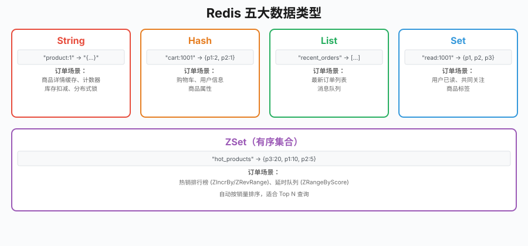
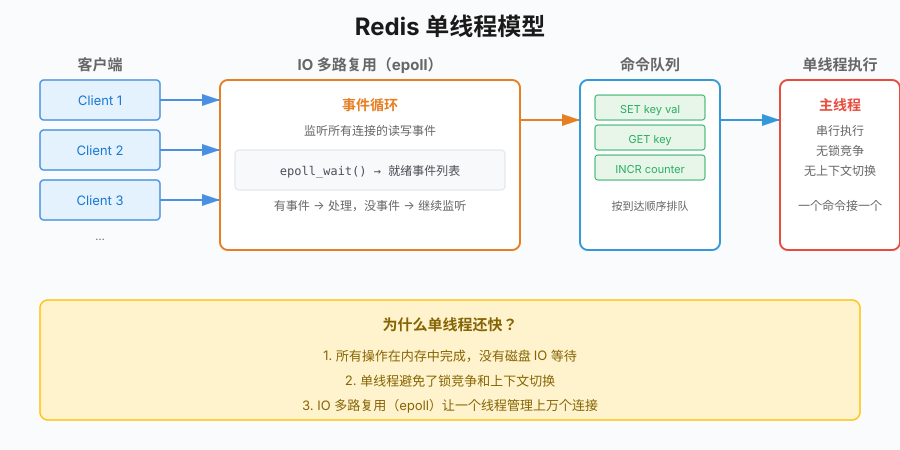

# 第21章 Redis基础

## 场景

订单系统上线后，商品详情、热销榜这类高频读请求全打到 MySQL。

Leader 说：

> "商品详情页每秒请求 5000 次，MySQL 连接池扛不住了，响应从 10ms 涨到 200ms。热点数据别每次都查库，上 Redis。"

你打开代码，发现商品详情查询长这样：

```go
func GetProductDetail(db *sql.DB, productID string) (*Product, error) {
    var product Product
    err := db.QueryRow("SELECT * FROM products WHERE id = ?", productID).Scan(...)
    if err != nil {
        return nil, err
    }
    return &product, nil
}
```

每次请求都查一次 MySQL，商品信息又没怎么变过，缓存下来能省 90% 的数据库查询。

但在此之前，先搞清楚 Redis 是什么、怎么用、有哪些数据结构。

本章解决四个问题：
1. Redis 解决什么问题？
2. Go 怎么连接 Redis？
3. Redis 有哪些数据类型？分别用在什么场景？
4. 使用 Redis 有什么注意事项？

---

## 21.1 为什么用 Redis

### 21.1.1 内存 vs 磁盘

MySQL 数据存在磁盘上，查询需要从磁盘加载到内存，再返回给客户端。Redis 所有数据都在内存里，读写都在内存完成，没有磁盘 IO 的开销。

| 对比 | MySQL | Redis |
|------|-------|-------|
| 存储介质 | 磁盘（最终落盘） | 内存 |
| 读写速度 | 毫秒级 | 微秒级 |
| 数据模型 | 关系型表 | KV 结构 |
| 查询方式 | SQL | 命令 |
| 容量 | 大（TB 级） | 小（GB 级，取决于内存） |

> 表中"微秒级/毫秒级"是数量级对比，非精确值。实际延迟取决于命令复杂度、数据量、网络和硬件。想量化自己环境的性能，用官方压测工具 `redis-benchmark`，别直接引用书里的数字。

### 21.1.2 适用场景

- **缓存**：热点数据加速，减少数据库压力
- **计数器**：PV/UV、库存、点赞数
- **排行榜**：ZSet 的有序特性
- **消息队列**：List 的 LPUSH/BRPOP
- **分布式锁**：SETNX + Lua 脚本
- **限流**：滑动窗口、令牌桶

### 21.1.3 什么时候别用 Redis

- 数据量远超内存，又不想花太多钱买内存
- 需要复杂查询和 JOIN
- 跨节点强一致：单实例读写本身是强一致的，但一旦上主从（读写分离），复制是**异步**的，从库可能读到旧值。对一致性敏感的读要打到主库，或干脆别用缓存

---

## 21.2 Go 连接 Redis

> 代码：`21-redis/example1-basic/`

### 21.2.1 启动 Redis

```bash
# 启动本地 Redis
docker run --name go-book-redis \
  -p 6379:6379 \
  -d redis:8-alpine
```

### 21.2.2 初始化客户端

```go
import (
    "github.com/redis/go-redis/v9"
)

rdb := redis.NewClient(&redis.Options{
    Addr:     "localhost:6379",
    Password: "", // 没有密码
    DB:       0,  // 默认数据库
    PoolSize: 10, // 连接池大小；不显式设置时，go-redis v9 默认是 10 × GOMAXPROCS
})

// 测试连接
pong, err := rdb.Ping(ctx).Result()
if err != nil {
    log.Fatal("连接失败:", err)
}
fmt.Println(pong) // PONG
```

> **协议版本**：go-redis v9 在较新版本中把 `Options.Protocol` 的默认值从 2（RESP2）改成了 3（RESP3）。绝大多数命令两者行为一致；只有用到客户端缓存（client-side caching）、push 通知等 RESP3 特性时才有区别。老服务端或需要完全对齐 RESP2 行为时显式设 `Protocol: 2`。

### 21.2.3 连接池配置

```go
rdb := redis.NewClient(&redis.Options{
    Addr:         "localhost:6379",
    PoolSize:     10,              // 连接池大小
    MinIdleConns: 5,               // 最小空闲连接
    MaxIdleConns: 10,              // 最大空闲连接
    ConnMaxLifetime: time.Hour,    // 连接生命周期
    ConnMaxIdleTime: 30 * time.Minute, // 空闲超时
    ReadTimeout:  3 * time.Second, // 读超时
    WriteTimeout: 3 * time.Second, // 写超时
})
```

### 21.2.4 Context 传参

Redis 命令都支持 `ctx` 参数，用于超时控制和请求取消：

```go
ctx, cancel := context.WithTimeout(context.Background(), 3*time.Second)
defer cancel()

val, err := rdb.Get(ctx, "key").Result()
if err == redis.Nil {
    fmt.Println("key 不存在")
} else if err != nil {
    fmt.Println("查询失败:", err)
} else {
    fmt.Println("值:", val)
}
```

---

## 21.3 五大核心数据类型

> 代码：`21-redis/example2-datatypes/`

### 21.3.1 String

**特点**：最简单的 KV 结构，value 最大 512MB。

**订单场景**：商品详情缓存、计数器

```go
// 商品详情缓存
func CacheProductDetail(ctx context.Context, rdb *redis.Client, productID string, detail string) error {
    return rdb.Set(ctx, "product:"+productID, detail, 10*time.Minute).Err()
}

func GetProductDetail(ctx context.Context, rdb *redis.Client, productID string) (string, error) {
    return rdb.Get(ctx, "product:"+productID).Result()
}

// 计数器：商品浏览量
func IncrementViews(ctx context.Context, rdb *redis.Client, productID string) (int64, error) {
    return rdb.Incr(ctx, "views:"+productID).Result()
}
```

String 除了 Set/Get，还有几个常用命令：

```go
// MSET/MGET：批量操作
rdb.MSet(ctx, "key1", "val1", "key2", "val2")
vals, _ := rdb.MGet(ctx, "key1", "key2").Result()

// INCR/DECR：计数器（原子操作）
rdb.Incr(ctx, "counter") // +1
rdb.IncrBy(ctx, "counter", 10) // +10
rdb.Decr(ctx, "counter") // -1

// SETNX：分布式锁前置知识
rdb.SetNX(ctx, "lock:product:1", "locked", 10*time.Second)
```

### 21.3.2 Hash

**特点**：可以存对象的多个字段，适合存储和更新结构体数据。

**订单场景**：购物车、用户信息

```go
// 购物车：用户 ID 为 key，商品 ID 为 field，数量为 value
func AddToCart(ctx context.Context, rdb *redis.Client, userID, productID string, quantity int) error {
    return rdb.HIncrBy(ctx, "cart:"+userID, productID, int64(quantity)).Err()
}

func GetCart(ctx context.Context, rdb *redis.Client, userID string) (map[string]string, error) {
    return rdb.HGetAll(ctx, "cart:"+userID).Result()
}

func RemoveFromCart(ctx context.Context, rdb *redis.Client, userID, productID string) error {
    return rdb.HDel(ctx, "cart:"+userID, productID).Err()
}
```

Hash 常用命令：

```go
// 设置单个字段
rdb.HSet(ctx, "user:1", "name", "alice")
rdb.HSet(ctx, "user:1", "age", 25)

// 设置多个字段
rdb.HSet(ctx, "user:1", map[string]interface{}{
    "name": "alice",
    "age":  25,
})

// 获取字段
name, _ := rdb.HGet(ctx, "user:1", "name").Result()

// 获取所有字段
all, _ := rdb.HGetAll(ctx, "user:1").Result()
```

### 21.3.3 List

**特点**：有序列表，支持两端插入，适合消息队列、最新列表。

**订单场景**：最新订单列表、消息队列

```go
// 最新订单列表
func AddRecentOrder(ctx context.Context, rdb *redis.Client, orderID string) error {
    // LPUSH 插入到列表头部
    return rdb.LPush(ctx, "recent_orders", orderID).Err()
}

func GetRecentOrders(ctx context.Context, rdb *redis.Client, count int64) ([]string, error) {
    // LRANGE 取前 N 个
    return rdb.LRange(ctx, "recent_orders", 0, count-1).Result()
}

// 消息队列：生产者
func EnqueueOrder(ctx context.Context, rdb *redis.Client, orderJSON string) error {
    return rdb.LPush(ctx, "order_queue", orderJSON).Err()
}

// 消息队列：消费者（阻塞读取）
func DequeueOrder(ctx context.Context, rdb *redis.Client, timeout time.Duration) (string, error) {
    result, err := rdb.BRPop(ctx, timeout, "order_queue").Result()
    if err != nil {
        return "", err
    }
    return result[1], nil // BRPop 返回 [key, value]
}
```

> ⚠️ List 做队列胜在简单，但 `BRPOP` 一旦弹出、消费者还没处理完就崩溃，消息就丢了——它没有 ACK、没有重试、没有消费组。只适合能容忍偶发丢消息的场景（如非关键通知）。订单这类要求可靠投递的，用 Redis Stream 或专业 MQ（Kafka，见后续章节），别用 List。

List 常用命令：

```go
// LPUSH：左插入
rdb.LPush(ctx, "list", "a", "b", "c")

// RPUSH：右插入
rdb.RPush(ctx, "list", "d", "e")

// LPOP：左弹出
val, _ := rdb.LPop(ctx, "list").Result()

// RPOP：右弹出
val, _ := rdb.RPop(ctx, "list").Result()

// LRANGE：范围查询
vals, _ := rdb.LRange(ctx, "list", 0, -1).Result() // 全部

// LLEN：列表长度
length, _ := rdb.LLen(ctx, "list").Result()

// BRPOP：阻塞右弹出
result, _ := rdb.BRPop(ctx, 5*time.Second, "list").Result()
```

### 21.3.4 Set

**特点**：无序、去重、支持集合运算（交集、并集、差集）。

**订单场景**：用户已读商品、共同关注、标签

```go
// 用户已读商品
func MarkProductRead(ctx context.Context, rdb *redis.Client, userID, productID string) error {
    return rdb.SAdd(ctx, "read:"+userID, productID).Err()
}

func GetReadProducts(ctx context.Context, rdb *redis.Client, userID string) ([]string, error) {
    return rdb.SMembers(ctx, "read:"+userID).Result()
}

func IsProductRead(ctx context.Context, rdb *redis.Client, userID, productID string) (bool, error) {
    return rdb.SIsMember(ctx, "read:"+userID, productID).Result()
}

// 集合运算：找出 A、B 两个用户都浏览过的商品（兴趣交集）
// 每个用户的浏览记录是一个 Set：viewed:<userID>
func CommonViewedProducts(ctx context.Context, rdb *redis.Client, userA, userB string) ([]string, error) {
    // SINTER 对多个 key 求交集，单 key 才用 SMembers
    return rdb.SInter(ctx, "viewed:"+userA, "viewed:"+userB).Result()
}

// 差集：A 看过、但 B 没看过的商品（可作为给 B 的推荐候选）
func RecommendFrom(ctx context.Context, rdb *redis.Client, fromUser, toUser string) ([]string, error) {
    return rdb.SDiff(ctx, "viewed:"+fromUser, "viewed:"+toUser).Result()
}
```

Set 常用命令：

```go
// 添加元素
rdb.SAdd(ctx, "set", "a", "b", "c")

// 移除元素
rdb.SRem(ctx, "set", "a")

// 判断是否存在
exists, _ := rdb.SIsMember(ctx, "set", "a").Result()

// 获取所有元素
members, _ := rdb.SMembers(ctx, "set").Result()

// 集合运算
rdb.SInter(ctx, "set1", "set2")  // 交集
rdb.SUnion(ctx, "set1", "set2")  // 并集
rdb.SDiff(ctx, "set1", "set2")   // 差集
```

### 21.3.5 ZSet（有序集合）

**特点**：带权重的 Set，每个元素关联一个 score，自动按 score 排序。

**订单场景**：热销排行榜、延迟队列

```go
// 热销排行榜
func AddProductSale(ctx context.Context, rdb *redis.Client, productID string, quantity float64) error {
    return rdb.ZIncrBy(ctx, "hot_products", quantity, productID).Err()
}

func GetHotProducts(ctx context.Context, rdb *redis.Client, top int64) ([]string, error) {
    // ZRevRange：按 score 从高到低取
    return rdb.ZRevRange(ctx, "hot_products", 0, top-1).Result()
}

func GetHotProductsWithScore(ctx context.Context, rdb *redis.Client, top int64) ([]redis.Z, error) {
    // ZRevRangeWithScores：带分数
    return rdb.ZRevRangeWithScores(ctx, "hot_products", 0, top-1).Result()
}

// 延迟队列：订单超时自动取消
func AddTimeoutOrder(ctx context.Context, rdb *redis.Client, orderID string, timeoutAt time.Time) error {
    score := float64(timeoutAt.Unix())
    return rdb.ZAdd(ctx, "timeout_orders", redis.Z{
        Score:  score,
        Member: orderID,
    }).Err()
}

func GetTimeoutOrders(ctx context.Context, rdb *redis.Client, now time.Time) ([]string, error) {
    // 取出 score 在 [0, now] 区间的订单，即所有已超时的
    // ZRangeByScore 必须同时给 Min 和 Max，否则区间不成立
    return rdb.ZRangeByScore(ctx, "timeout_orders", &redis.ZRangeBy{
        Min:   "0",
        Max:   fmt.Sprintf("%d", now.Unix()),
        Count: 100,
    }).Result()
}
```

ZSet 常用命令：

```go
// 添加元素
rdb.ZAdd(ctx, "zset", redis.Z{Score: 100, Member: "a"})

// 增加分数
rdb.ZIncrBy(ctx, "zset", 10, "a")

// 按分数范围查询
rdb.ZRangeByScore(ctx, "zset", &redis.ZRangeBy{
    Min: "0",
    Max: "100",
})

// 按排名查询（从高到低）
rdb.ZRevRange(ctx, "zset", 0, 9) // 前 10 名

// 获取排名
rank, _ := rdb.ZRank(ctx, "zset", "a").Result() // 从低到高
revRank, _ := rdb.ZRevRank(ctx, "zset", "a").Result() // 从高到低

// 删除元素
rdb.ZRem(ctx, "zset", "a")

// 获取分数
score, _ := rdb.ZScore(ctx, "zset", "a").Result()
```



---

## 21.4 过期与淘汰

### 21.4.1 过期时间

```go
// 设置过期时间
rdb.Set(ctx, "key", "value", 10*time.Minute) // 创建时设置
rdb.Expire(ctx, "key", 10*time.Minute)       // 对已有 key 设置
rdb.ExpireAt(ctx, "key", time.Now().Add(10*time.Minute)) // 指定时间点

// 查看 TTL
ttl, _ := rdb.TTL(ctx, "key").Result() // 剩余时间
fmt.Println(ttl) // 10m0s

// 移除过期时间
rdb.Persist(ctx, "key")
```

### 21.4.2 过期删除策略

Redis 用两种策略配合来删除过期 key：

1. **惰性删除**：每次访问 key 时检查是否过期，过期就删
2. **定期删除**：后台周期性任务（默认每秒运行 `hz`=10 次）随机抽查一批设置了过期时间的 key，删除其中已过期的

所以即使 key 过期了，也不会立刻消失。如果内存不够，还有淘汰策略兜底。

> 定期删除的频率由 `hz` 参数控制（默认 10），每次抽查的数量和清理力度由 Redis 内部算法决定，不同版本略有差异，具体见官方文档 [Key expiration](https://redis.io/docs/latest/develop/use/keyspace/#how-redis-expires-keys)。

### 21.4.3 内存淘汰策略

```bash
# 查看当前策略
CONFIG GET maxmemory-policy

# 设置策略
CONFIG SET maxmemory-policy allkeys-lru
```

8 种淘汰策略：

| 策略 | 说明 |
|------|------|
| noeviction | 不淘汰，写操作返回错误 |
| allkeys-lru | 淘汰最近最少使用的 key |
| allkeys-lfu | 淘汰最不经常使用的 key |
| volatile-lru | 在设置了过期时间的 key 中淘汰最近最少使用的 |
| volatile-lfu | 在设置了过期时间的 key 中淘汰最不经常使用的 |
| allkeys-random | 随机淘汰 |
| volatile-random | 在设置了过期时间的 key 中随机淘汰 |
| volatile-ttl | 淘汰过期时间最近的 key（即将过期的） |

生产环境建议 `allkeys-lru`，除非你知道自己在做什么。

---

## 21.5 Pipeline 与批量操作

> 代码：`21-redis/example3-pipeline/`

每次 Redis 命令都有网络往返（RTT）。批量操作时，用 Pipeline 可以减少网络开销。

```go
// 错误：逐条发送
for i := 0; i < 1000; i++ {
    rdb.Set(ctx, fmt.Sprintf("key:%d", i), i, 0)
}
// 1000 次网络往返

// 正确：Pipeline
pipe := rdb.Pipeline()
for i := 0; i < 1000; i++ {
    pipe.Set(ctx, fmt.Sprintf("key:%d", i), i, 0)
}
_, err := pipe.Exec(ctx)
// 1 次网络往返
```

Pipeline 和事务的区别：

```go
// Pipeline：批量发送，不保证原子性
pipe := rdb.Pipeline()
pipe.Incr(ctx, "counter")
pipe.Incr(ctx, "counter")
pipe.Exec(ctx) // 两次 INCR 一起发送

// 事务：MULTI/EXEC，保证原子性
tx := rdb.TxPipeline()
tx.Incr(ctx, "counter")
tx.Incr(ctx, "counter")
tx.Exec(ctx) // 两次 INCR 在一个事务中执行
```

---

## 21.6 原理：Redis 为什么快

### 21.6.1 单线程模型

Redis 的核心处理逻辑是单线程的。所有命令在同一个线程中串行执行，没有锁竞争，没有上下文切换开销。

```go
// 串行执行
CLIENT 1: SET key value
CLIENT 2: GET key
CLIENT 3: INCR counter
```

三个命令按到达顺序排队，依次执行，不会同时修改同一份数据。

### 21.6.2 IO 多路复用

单线程怎么处理多个客户端连接？靠 IO 多路复用（epoll/kqueue）。

```
客户端连接 → 事件循环（epoll） → 命令队列 → 串行执行 → 返回结果
```

- epoll 监听所有连接的读写事件
- 有事件就处理，没有就继续监听
- 一个线程管理上万个连接

### 21.6.3 内存数据结构

Redis 的数据结构经过专门优化：

- **String**：SDS（Simple Dynamic String），避免 C 字符串的缓冲区溢出问题
- **Hash**：元素少且值小时用 listpack（Redis 7.0 起；6.x 及更早为 ziplist），超过阈值转 hashtable
- **ZSet**：元素少时用 listpack，较大时用跳表（skiplist）+ hashtable，范围查询 O(log n)



### 21.6.4 上生产前必知的边界

本章聚焦 Redis 的基础用法。真正把 Redis 用到生产，下面这些边界必须提前了解（细节可查官方文档，本书后续章节也会涉及）：

- **持久化**：Redis 是内存数据库，进程重启数据默认丢失。靠 RDB（定时快照）和 AOF（追加写日志）落盘，二者可组合。用作缓存可关，用作数据存储必开。
- **主从与高可用**：单实例挂了服务就断。生产用主从复制 + 哨兵（Sentinel）做自动故障转移，或用 Cluster 做分片 + 高可用。复制是异步的，主从间存在短暂数据延迟。
- **认证与 ACL**：默认无密码、监听全网卡的 Redis 是重大安全隐患，多次出现过被入侵挖矿的事故。生产必须配 `requirepass`，Redis 6+ 建议用 ACL 做按用户细粒度授权，并关闭或重命名 `FLUSHALL`、`CONFIG` 等危险命令。
- **内存监控**：内存是 Redis 的命脉。用 `INFO memory` 看 `used_memory`，配好 `maxmemory` 和淘汰策略，对大 key、内存增长设告警，避免 OOM。

---

## 21.7 最佳实践

### 21.7.1 key 命名规范

```go
// 推荐：项目名:模块名:业务ID
"order:product:123"
"order:user:456:cart"

// 不推荐：无意义的 key
"a"
"123"
"abc"
```

### 21.7.2 避免大 key

大 key 指 value 很大的 key（超过 10MB 或包含大量元素）。

```go
// 错误：一个 key 存所有数据
rdb.LPush(ctx, "all_orders", orders...) // 可能有几十万个

// 正确：拆分
rdb.LPush(ctx, "orders:202501", orders...) // 按月拆分
```

### 21.7.3 设置过期时间

```go
// 错误：缓存类数据永不过期，改了数据库缓存也不会更新，还会一直占内存
rdb.Set(ctx, "product:1", detail, 0)

// 正确：缓存类数据根据业务设置 TTL
rdb.Set(ctx, "product:1", detail, 10*time.Minute)
```

> 例外：确实需要长期存在的数据（如库存计数器、分布式锁的持有标记）可以不设 TTL，但要靠业务逻辑显式删除，并纳入内存监控。本章示例中的计数器、排行榜为演示方便未设 TTL，生产中应根据业务补上或纳入定期清理。

### 21.7.4 连接池参数

```go
rdb := redis.NewClient(&redis.Options{
    PoolSize:     10,   // 根据并发量调整；不显式设置时默认 10 × GOMAXPROCS
    MinIdleConns: 5,    // 避免频繁创建连接
    ReadTimeout:  3 * time.Second,
    WriteTimeout: 3 * time.Second,
})
```

> go-redis v9 的默认 `PoolSize` 是 `10 × GOMAXPROCS`（不是早期版本的固定 10）。生产环境不要照搬这个默认值——Redis 单实例通常只需要几十个连接，连接过多反而增加服务端负担。按下游 Redis 容量和实际 QPS 显式设置，并监控 `PoolStats().Timeouts`。

---

## 21.8 排障

### 21.8.1 连接池耗尽

**问题**：应用报错 `redis: connection pool timeout`（等待空闲连接超时）

**原因**：并发请求数长期超过 `PoolSize`，连接被占满，新请求拿不到连接。注意区别于 `dial tcp: cannot assign requested address`——后者通常是本机端口耗尽（连接没复用、频繁新建）。

**排查**：

```go
stats := rdb.PoolStats()
fmt.Printf("总连接数: %d\n", stats.TotalConns) // 池中当前连接总数
fmt.Printf("空闲连接: %d\n", stats.IdleConns)  // 可立即复用的空闲连接
fmt.Printf("命中/未命中: %d/%d\n", stats.Hits, stats.Misses) // Misses 高说明常要新建连接
fmt.Printf("等待超时次数: %d\n", stats.Timeouts) // 关键指标：>0 说明发生过拿连接超时
```

> `PoolStats` 没有"当前等待队列长度"字段，判断池是否吃紧看 `Timeouts` 是否增长、`Misses` 是否偏高。`StaleConns` 是被移除的陈旧连接数，和耗尽无关，别拿它当等待数看。

**解决**：增大 `PoolSize`，或优化代码减少单次请求持有连接的时间（避免在持有连接时做慢操作）。

### 21.8.2 大 key 阻塞

**问题**：Redis 响应突然变慢，CPU 飙升

**原因**：某个 key 数据量很大，操作它时阻塞了事件循环

**排查**：

```bash
# 查找大 key
redis-cli --bigkeys

# 查看慢查询
redis-cli SLOWLOG GET 10
```

**解决**：拆分大 key，或者用 SCAN 替代 KEYS。

### 21.8.3 缓存和 DB 不一致

**问题**：用户看到的数据和数据库里的不一致

**原因**：缓存更新失败，或者过期时间太长

**解决**：先写 DB，再删缓存（Cache-Aside 模式）。详细方案见下一章。

---

## 21.9 面试题

**Q1：Redis 为什么快？**

A：
1. 内存存储，没有磁盘 IO
2. 单线程模型，没有锁竞争
3. IO 多路复用（epoll），单线程管理大量连接
4. 数据结构经过专门优化（SDS、跳表等）

**Q2：Redis 有哪些数据类型？分别用在什么场景？**

A：
- String：缓存、计数器
- Hash：对象存储
- List：消息队列、最新列表
- Set：去重、集合运算
- ZSet：排行榜、延时队列

**Q3：Redis 的过期策略是什么？**

A：
- 惰性删除：访问时检查是否过期
- 定期删除：每秒随机检查 20 个 key，删除过期的

**Q4：Redis 的淘汰策略有哪些？**

A：
- 8 种策略，主要用的有 noeviction、allkeys-lru、allkeys-lfu
- 生产环境建议 allkeys-lru

**Q5：Pipeline 和事务的区别？**

A：
- Pipeline：批量发送命令，减少网络开销，不保证原子性
- 事务（MULTI/EXEC）：保证原子性，所有命令顺序执行

---

## 21.10 小结

本章从订单系统的性能问题出发，学习了 Redis 的基础：

1. **为什么用 Redis**：内存存储、微秒级响应
2. **连接配置**：Redis 客户端初始化、连接池
3. **五大数据类型**：String、Hash、List、Set、ZSet
4. **过期与淘汰**：TTL、删除策略、淘汰策略
5. **Pipeline**：批量操作减少网络开销
6. **原理**：单线程模型、IO 多路复用
7. **最佳实践**：key 命名、大 key、过期时间
8. **生产边界**：持久化、主从/哨兵/Cluster、认证与 ACL、内存监控

**核心原则：**

> Redis 是内存数据库，速度快，但内存贵。线上必须设置过期时间，控制 key 大小，选择合适的淘汰策略；上生产前还要补齐持久化、高可用和访问安全。

下一章我们将学习 Redis 缓存设计，解决缓存穿透、击穿、雪崩等实际问题。

---

## 参考资料

> 本章基于 **Redis 8**、**Go 1.25**、go-redis v9.22.0。命令行为、编码方式和默认参数在不同版本间可能有差异，以对应版本官方文档为准。

- Redis 官方文档 · 数据类型总览：https://redis.io/docs/latest/develop/data-types/
- Redis 官方文档 · Key 过期与删除机制：https://redis.io/docs/latest/develop/use/keyspace/
- Redis 官方文档 · 内存淘汰策略（LRU/LFU/maxmemory）：https://redis.io/docs/latest/develop/reference/eviction/
- Redis 官方文档 · 持久化（RDB/AOF）：https://redis.io/docs/latest/operate/oss_and_stack/management/persistence/
- Redis 官方文档 · 复制与哨兵（Replication / Sentinel）：https://redis.io/docs/latest/operate/oss_and_stack/management/replication/
- Redis 官方文档 · ACL 与安全：https://redis.io/docs/latest/operate/oss_and_stack/management/security/acl/
- Redis 官方文档 · Pipelining：https://redis.io/docs/latest/develop/use/pipelining/
- Redis 官方文档 · 单线程与性能：https://redis.io/docs/latest/develop/reference/
- go-redis 官方文档：https://redis.uptrace.dev/
- go-redis 源码（`PoolStats` 字段定义）：https://github.com/redis/go-redis