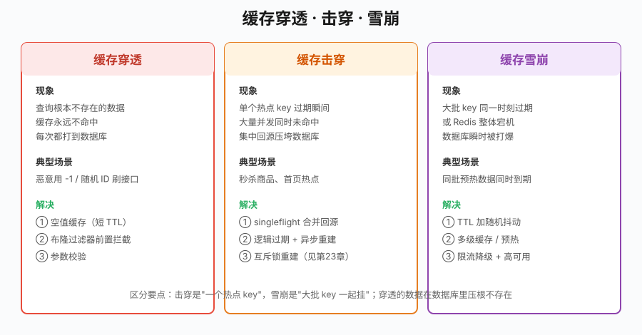
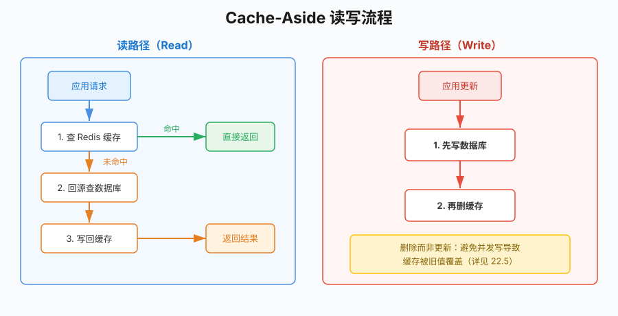
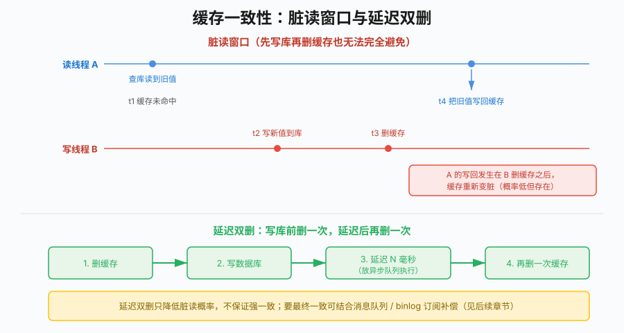

# 第22章 Redis缓存设计

## 场景

你负责的电商商品详情页，日常 QPS 三四千，大促预热后冲到两万。第21章我们已经把商品信息缓存进了 Redis，MySQL 的压力降了下来，一切看起来很好。

直到某个周五晚上的大促开场：

- 监控告警，MySQL 连接数瞬间打满，CPU 100%，大量慢查询；
- Redis 命中率从 98% 掉到 60%；
- 商品详情页大面积超时，下单转化率暴跌。

复盘发现，问题不在 Redis 本身，而在缓存的用法。有人用脚本刷不存在的商品 ID，缓存挡不住，全打到了库上；一个爆款商品的缓存刚好过期，几万请求同时回源；预热时给一批商品设了相同的过期时间,到点集体失效……

这一章要解决的，就是把"能用的缓存"变成"扛得住大促的缓存"。

## 问题

第21章末尾我们留了个尾巴：缓存和数据库不一致怎么办?这一章把缓存在生产环境真正会遇到的四类问题一次讲透:

1. **缓存穿透**:查询数据库里根本不存在的数据,缓存永远不命中,每次都打到库上。
2. **缓存击穿**:某个热点 key 过期的一瞬间,大量并发请求同时未命中,集中回源压垮数据库。
3. **缓存雪崩**:大批 key 在同一时刻集体过期(或 Redis 整体宕机),数据库瞬时被打爆。
4. **缓存一致性**:更新了数据库,缓存里还是旧值,用户读到脏数据。

它们的成因和解法各不相同,下图先建立整体印象:



> 本章所有示例在 `03-数据存储与缓存/22-redis-cache/` 下,基于 go-redis v9。为了让代码不依赖真实 MySQL 也能跑,数据层用一个带 30ms 模拟延迟和查询计数的内存实现(`store` 包)代替第20章的 GORM,缓存逻辑与生产完全一致——把 `store.ProductStore` 换成基于 `*gorm.DB` 的实现即可。
>
> 运行前先起一个 Redis:
>
> ```bash
> docker run --name go-book-redis -p 6379:6379 -d redis:8-alpine
> ```

## 22.1 Cache-Aside 模式

在讲那四个问题前,先把最主流的缓存模式立起来:**Cache-Aside(旁路缓存)**。它不是什么高深理论,而是绝大多数业务缓存的默认写法。

规则只有两条:

- **读**:先查缓存,命中直接返回;未命中回源数据库,再把结果写回缓存。
- **写**:先更新数据库,再**删除**缓存(不是更新缓存)。



读路径的核心实现:

```go
// Get 读路径：Cache-Aside。
func (c *ProductCache) Get(ctx context.Context, id int64) (*store.Product, error) {
	key := c.key(id)

	// 1. 先查缓存
	data, err := c.rdb.Get(ctx, key).Bytes()
	if err == nil {
		var p store.Product
		if err := json.Unmarshal(data, &p); err != nil {
			return nil, fmt.Errorf("反序列化缓存失败: %w", err)
		}
		return &p, nil // 命中
	}
	if !errors.Is(err, redis.Nil) {
		// 注意：Redis 出错时不宜直接失败，生产中应记录日志后降级去查数据库，
		// 否则 Redis 抖动会把流量全部拒绝。这里返回错误是为了让示例行为清晰。
		return nil, fmt.Errorf("读缓存失败: %w", err)
	}

	// 2. 未命中，回源数据库
	p, err := c.db.GetByID(ctx, id)
	if err != nil {
		return nil, err
	}

	// 3. 写回缓存
	buf, _ := json.Marshal(p)
	if err := c.rdb.Set(ctx, key, buf, c.ttl).Err(); err != nil {
		log.Printf("写回缓存失败 key=%s: %v", key, err) // 不影响本次返回
	}
	return p, nil
}
```

这里有个新手常踩的坑:`redis.Nil`。go-redis 用 `redis.Nil` 这个哨兵错误表示"key 不存在",它和"Redis 连接出错"是两回事。判断命中与否必须用 `errors.Is(err, redis.Nil)` 精确区分,否则要么把不存在当成错误,要么把网络故障当成未命中。

写路径先写库再删缓存:

```go
func (c *ProductCache) Update(ctx context.Context, p *store.Product) error {
	if err := c.db.Update(ctx, p); err != nil { // 1. 先写数据库
		return err
	}
	return c.rdb.Del(ctx, c.key(p.ID)).Err() // 2. 再删缓存
}
```

运行 `example1-cache-aside`,能直观看到缓存的价值（具体耗时因机器、网络略有波动,以下为典型输出）:

```
=== 连续读取同一商品 5 次 ===
第 1 次: 机械键盘 耗时 37ms
第 2 次: 机械键盘 耗时 1ms
第 3 次: 机械键盘 耗时 0s
第 4 次: 机械键盘 耗时 1ms
第 5 次: 机械键盘 耗时 1ms
数据库查询次数: 1（只有第一次回源）

=== 更新商品后缓存失效 ===
更新后读到: 机械键盘(改) 价格 25900 分
数据库查询次数: 3（1 次更新 + 1 次回源 + 1 次写后读）
```

5 次读取只查了 1 次数据库,后 4 次全部命中缓存（耗时 0~1ms，远低于回源的 30ms+）。为什么写路径是"删缓存"而不是"更新缓存"?为什么是"先写库"而不是"先删缓存"?这两个问题留到 22.5 一致性小节专门分析,那里才是真正的坑。

## 22.2 缓存穿透

**穿透**指查询一个数据库里根本不存在的数据。因为查不到,缓存里永远不会有这个 key,于是每次请求都绕过缓存直达数据库。正常业务偶尔发生无所谓,怕的是有人拿 `id=-1`、随机大整数刷你的接口,把数据库当筛子捅。

### 22.2.1 空值缓存

最简单的办法:数据库也查不到时,往缓存里写一个**空值占位符**,并给一个较短的 TTL。后续对同一个不存在 key 的请求就被这个空值挡住了。

```go
const nullValue = "__NULL__"

// 回源
p, err := c.db.GetByID(ctx, id)
if errors.Is(err, store.ErrNotFound) {
	// 关键：数据库也查不到时，缓存一个短 TTL 空值，挡住后续穿透。
	c.rdb.Set(ctx, key, nullValue, c.nullTTL)
	return nil, store.ErrNotFound
}
```

读的时候要先判断命中的是不是空值:

```go
if string(data) == nullValue {
	return nil, store.ErrNotFound // 命中空值缓存
}
```

两个细节决定它是否好用:

- **TTL 要短**(示例用 1 分钟)。空值不是真数据,长期占内存没意义;更重要的是,万一这个 ID 后来真被创建了,短 TTL 能让它尽快回源到真实值,避免长时间"误杀"。
- 空值缓存挡不住**每次都用不同 ID** 的攻击——每个新 ID 仍会穿透一次。要根治这种,得靠布隆过滤器。

运行 `example2-penetration` 的方案一:

```
=== 方案一：空值缓存 ===
第 1 次查询 id=999: product not found
第 2 次查询 id=999: product not found
第 3 次查询 id=999: product not found
数据库查询次数: 1（只穿透了 1 次，之后被空值缓存挡住）
```

### 22.2.2 布隆过滤器

布隆过滤器(Bloom Filter)是一种空间效率极高的概率型数据结构,它能回答"这个元素**一定不存在**还是**可能存在**"。用在缓存穿透上刚好:布隆说"不存在"就一定不存在,可以直接拒绝,绝不会漏掉真实数据(无假阴性);它只可能把不存在的说成"可能存在"(有假阳性),但那顶多是放一次请求过去,不影响正确性。

原理是一个位数组加 k 个哈希函数:插入元素时把它哈希到的 k 个位都置 1;查询时如果有任何一位是 0,就一定没插入过。

Redis 的 bitmap(SETBIT/GETBIT)天然适合实现它,不需要额外的 RedisBloom 模块:

```go
// Add 把 id 加入布隆过滤器：把 k 个位置全部置 1。
func (b *BloomFilter) Add(ctx context.Context, id int64) error {
	pipe := b.rdb.Pipeline()
	for _, off := range b.offsets(id) {
		pipe.SetBit(ctx, b.key, off, 1)
	}
	_, err := pipe.Exec(ctx)
	return err
}

// MightContain 判断 id 是否可能存在：k 个位全为 1 才返回 true。
func (b *BloomFilter) MightContain(ctx context.Context, id int64) (bool, error) {
	offs := b.offsets(id)
	pipe := b.rdb.Pipeline()
	cmds := make([]*redis.IntCmd, len(offs))
	for i, off := range offs {
		cmds[i] = pipe.GetBit(ctx, b.key, off)
	}
	if _, err := pipe.Exec(ctx); err != nil {
		return false, err
	}
	for _, cmd := range cmds {
		if cmd.Val() == 0 {
			return false, nil // 有一位是 0，一定不存在
		}
	}
	return true, nil // 全 1，可能存在（有假阳性）
}
```

k 次 SETBIT/GETBIT 用 Pipeline 合并成一次网络往返,这是第21章 Pipeline 的直接应用。至于 k 个哈希位置,这里用**双哈希**(Kirsch-Mitzenmacher)技巧,由一个 64 位哈希拆出两个 32 位基础哈希组合而成,省去维护 k 个独立哈希函数:

```go
func (b *BloomFilter) offsets(id int64) []int64 {
	h := fnv.New64a()
	var buf [8]byte
	for i := 0; i < 8; i++ {
		buf[i] = byte(id >> (8 * i))
	}
	h.Write(buf[:])
	sum := h.Sum64()
	h1, h2 := uint32(sum), uint32(sum>>32)

	res := make([]int64, b.hashes)
	for i := 0; i < b.hashes; i++ {
		combined := h1 + uint32(i)*h2
		res[i] = int64(uint64(combined) % b.bits)
	}
	return res
}
```

在读路径最前面加一道布隆拦截:

```go
if c.useBloom {
	exists, err := c.bloom.MightContain(ctx, id)
	if err != nil {
		log.Printf("布隆过滤器查询失败，降级放行: %v", err)
	} else if !exists {
		return nil, store.ErrNotFound // 一定不存在，连缓存都不查
	}
}
```

运行方案二:

```
=== 方案二：布隆过滤器 ===
查询 id=1: <nil>
查询 id=999: product not found
查询 id=12345: product not found
数据库查询次数: 1（只有存在的 id=1 回源，不存在的被布隆挡在缓存之前）
```

`id=999`、`id=12345` 都被布隆挡在了缓存和数据库之前,数据库查询数为 1(只有真实存在的 `id=1` 回源)。

**空值缓存 vs 布隆过滤器怎么选?**

| 维度 | 空值缓存 | 布隆过滤器 |
|------|---------|-----------|
| 实现复杂度 | 极低 | 中等 |
| 挡随机 ID 攻击 | 差(每个新 ID 穿一次) | 好(一次拦截) |
| 内存占用 | 每个空 key 一条 | 固定位数组,省内存 |
| 删除元素 | 天然支持(TTL) | 标准布隆不支持删除 |
| 假阳性 | 无 | 有(可调) |

经验法则:数据集有限、写少读多,空值缓存足够简单好用;数据量大、存在恶意穿透风险,上布隆过滤器,并在数据写入时同步维护它。两者也可以叠加。

## 22.3 缓存击穿

**击穿**和穿透只差一个字,却是完全不同的问题:击穿的数据**真实存在**,只是某个**热点 key 恰好过期**的一瞬间,成百上千的并发请求同时发现缓存没了,一起涌向数据库回源。数据库前一秒还好好的,过期这一刻被瞬时并发打崩。

先看没有任何保护时的惨状。`example3-breakdown` 用 100 个 goroutine 同时读一个刚被删掉的热点 key（并发调度时序会导致每次运行数值有波动）:

```
=== 无保护：100 并发同时未命中 ===
数据库查询次数: 10（大量并发在缓存写回前穿透到数据库）
```

100 个并发里有数十个在第一个请求写回缓存之前就已经查了库——这还只是本地低延迟（约 30ms 回源），真实网络、真实数据库下会更严重。

### 22.3.1 singleflight 合并回源

Go 官方扩展库 `golang.org/x/sync/singleflight` 专门解决这个:对同一个 key 的并发调用,只让**一个** goroutine 真正执行,其余的等待并共享它的结果。

```go
func (c *ProductCache) GetWithSingleflight(ctx context.Context, id int64) (*store.Product, error) {
	key := c.key(id)
	if data, err := c.rdb.Get(ctx, key).Bytes(); err == nil {
		var p store.Product
		_ = json.Unmarshal(data, &p)
		return &p, nil
	} else if !errors.Is(err, redis.Nil) {
		return nil, err
	}

	// key 相同的并发调用会被合并，Do 内的回源只执行一次。
	v, err, _ := c.sf.Do(key, func() (interface{}, error) {
		p, err := c.db.GetByID(ctx, id)
		if err != nil {
			return nil, err
		}
		buf, _ := json.Marshal(p)
		c.rdb.Set(ctx, key, buf, c.ttl)
		return p, nil
	})
	if err != nil {
		return nil, err
	}
	return v.(*store.Product), nil
}
```

同样 100 并发:

```
=== singleflight：100 并发同时未命中 ===
数据库查询次数: 1（并发被合并为极少数几次回源）
```

数十次穿透骤降到 1 次。`singleflight.Do` 的第三个返回值 `shared bool` 表示结果是否被多个调用者共享,可用于监控合并效果。

一个要点:singleflight 只在**单个进程内**合并。多实例部署时,每个实例仍会各自回源一次——通常这已经足够(N 个实例 = N 次,而不是 N×并发),要做到跨进程只回源一次,得用分布式锁,那是第23章的内容。

### 22.3.2 逻辑过期

singleflight 仍会让第一批请求短暂阻塞等待回源。对"绝对不能卡"的超热点数据,可以用**逻辑过期**:key 在 Redis 里**永不设置物理 TTL**,而是把过期时间戳写进 value 里。读到已逻辑过期的数据时,**先返回旧值保证秒回**,再在后台异步重建。

```go
type logicalValue struct {
	Product  *store.Product `json:"product"`
	ExpireAt int64          `json:"expire_at"` // 逻辑过期时间（Unix 毫秒）
}

func (c *LogicalCache) Get(ctx context.Context, id int64) (*store.Product, error) {
	data, err := c.rdb.Get(ctx, c.key(id)).Bytes()
	// ...（省略 redis.Nil 未预热时的同步回源）...

	var lv logicalValue
	_ = json.Unmarshal(data, &lv)

	if time.Now().UnixMilli() < lv.ExpireAt {
		return lv.Product, nil // 未逻辑过期，直接返回
	}

	// 已逻辑过期：先返回旧值，后台异步重建（同一 key 只触发一次）。
	go c.rebuild(id)
	return lv.Product, nil
}

func (c *LogicalCache) rebuild(id int64) {
	c.sf.Do(c.key(id), func() (interface{}, error) { // 用 singleflight 保证只重建一次
		ctx, cancel := context.WithTimeout(context.Background(), 3*time.Second)
		defer cancel()
		p, err := c.db.GetByID(ctx, id)
		if err != nil {
			return nil, err
		}
		return nil, c.set(ctx, id, p)
	})
}
```

写入时物理 TTL 传 0(永不过期),过期判断完全交给 value 里的时间戳:

```go
func (c *LogicalCache) set(ctx context.Context, id int64, p *store.Product) error {
	lv := logicalValue{Product: p, ExpireAt: time.Now().Add(c.logicalTTL).UnixMilli()}
	buf, _ := json.Marshal(lv)
	return c.rdb.Set(ctx, c.key(id), buf, 0).Err() // 物理 TTL=0
}
```

运行结果:

```
=== 逻辑过期：热点数据永不物理过期 ===
数据库查询次数: 2（1 次预热 + 100 并发下后台仅触发 1 次异步重建，请求都拿旧值秒回）
```

100 个并发请求**一个都没阻塞**,全部拿到旧值立即返回,后台只重建了一次。代价是:会有短暂时间窗口读到旧值(容忍最终一致);且需要保证热点数据一直在缓存里(通常配合预热)。

singleflight 和逻辑过期不是二选一:前者适合绝大多数场景,简单且强一致;后者用于"宁可读旧值也不能卡"的极端热点。

## 22.4 缓存雪崩

**雪崩**是击穿的规模化版本:不是一个热点 key 过期,而是**大批 key 在同一时刻集体失效**,或者 Redis 整个宕机,导致海量请求同时压向数据库。

最常见的诱因很隐蔽:预热。上线时用一个循环把几万个商品灌进缓存,全设了相同的 TTL(比如 `1*time.Hour`),一小时后它们在同一秒集体过期。

### 22.4.1 TTL 加随机抖动

解法朴素但有效——给每个 key 的 TTL 加一个随机抖动,把过期时间打散:

```go
func jitterTTL(base time.Duration) time.Duration {
	// 在 base 上叠加 0~10% 的随机抖动，避免大批 key 同时过期。
	jitter := time.Duration(rand.Int63n(int64(base) / 10))
	return base + jitter
}

c.rdb.Set(ctx, key, buf, jitterTTL(c.ttl))
```

原本集中在同一秒的过期,被摊到了一段时间窗口里,数据库的回源压力从一根尖刺变成一条平缓的曲线。运行 `example5-avalanche` 能直观看到差别:

```
=== 固定 TTL（雪崩隐患）===
1000 个 key 的过期时间跨度: 1h0m0s ~ 1h0m0s（跨度 0s）

=== 抖动 TTL（削平回源尖刺）===
1000 个 key 的过期时间跨度: 1h0m0s ~ 1h5m59s（约 6 分钟窗口）
```

固定 TTL 下 1000 个 key 的过期时间完全重合(跨度 0);加了抖动后被打散到约 6 分钟的窗口里。

### 22.4.2 多级防线

TTL 抖动只解决"同时过期",解决不了"Redis 整体宕机"。生产上要多管齐下:

- **缓存预热**:上线或大促前主动把热点数据加载进缓存,别等第一个用户来触发回源。
- **多级缓存**:本地缓存(如 `sync.Map` / freecache)+ Redis 两级,Redis 挂了本地还能扛一部分。
- **限流降级**:回源路径上加限流器(如令牌桶),Redis 不可用时只放少量请求回源重建,其余快速失败或返回兜底数据,保护数据库不被打死。
- **Redis 高可用**:哨兵或 Cluster,避免单点。

雪崩的本质是"数据库没有能力承接全部流量",所以核心思路始终是:**别让流量一下子全压到库上**。

## 22.5 缓存一致性

现在回到 22.1 埋下的两个问题,这也是缓存设计里最容易出错、面试最爱问的地方:**为什么删缓存而不是更新缓存?为什么先写库而不是先删缓存?**

### 22.5.1 为什么是"删除"而不是"更新"

如果写操作去**更新**缓存,两个并发写就可能交错:

```
写 A：更新库为 v1
写 B：更新库为 v2
写 B：更新缓存为 v2
写 A：更新缓存为 v1   ← 缓存最终是 v1，但库是 v2，脏了
```

删除就没这个问题:两次写都只是"删掉",下一次读自然回源到数据库的最新值。此外,如果缓存值需要复杂计算才能得到,每次写都更新缓存是浪费——很多写进来的数据根本没人读。**删除是惰性的,更新是激进的**,惰性在读多写少的缓存场景几乎总是更优。

### 22.5.2 为什么是"先写库"而不是"先删缓存"

假设**先删缓存,再写库**:

```
写线程：删缓存
读线程：未命中，查库读到旧值
读线程：把旧值写回缓存   ← 缓存又变回旧值
写线程：写库为新值        ← 库是新值，缓存是旧值，长期不一致
```

删缓存和写库之间的空隙,被一个并发读趁虚而入,把旧值又填了回来。而且这个脏值会一直存在到下次过期。

**先写库,再删缓存**能大幅降低这种概率,但坦白说——它也不能 100% 避免:



如上图,存在一个极窄的窗口:读线程 A 在写线程 B 写库之前就查到了旧值,却在 B 删缓存**之后**才把旧值写回。这需要"读比写还慢"且时序恰好错开,概率极低,但理论上存在。

### 22.5.3 延迟双删

针对上面那个窄窗口,**延迟双删**是常见缓解手段:写库前删一次,写库后**延迟一小段时间再删一次**,把"可能被并发读回填的旧值"清掉。

```go
func (c *ProductCache) UpdateDoubleDelete(ctx context.Context, p *store.Product) error {
	key := c.key(p.ID)
	c.rdb.Del(ctx, key)                    // 第一次删
	if err := c.db.Update(ctx, p); err != nil {
		return err
	}
	// 第二次删：延迟执行，覆盖写库期间被并发读回填的旧值。
	// 生产中应放到延迟队列/异步任务里，避免阻塞写请求。
	time.AfterFunc(c.delayDelay, func() {
		bg, cancel := context.WithTimeout(context.Background(), 3*time.Second)
		defer cancel()
		if err := c.rdb.Del(bg, key).Err(); err != nil {
			log.Printf("延迟双删第二次删除失败 key=%s: %v", key, err)
		}
	})
	return nil
}
```

延迟时间要略大于"一次读操作(查库+写缓存)的耗时",经验值几百毫秒到 1 秒。

必须清醒认识到它的边界:**延迟双删只降低不一致的概率,不提供强一致保证**。而且它还漏了一个更现实的问题——**如果删缓存本身失败了怎么办?**(比如那一刻 Redis 抖动)。

### 22.5.4 删除失败与最终一致(思路)

要让缓存和数据库达到**最终一致**,核心是保证"删缓存"这个动作最终一定成功。生产中的主流思路(本章只讲设计,不展开实现):

- **重试 + 消息队列**:删缓存失败时,把待删的 key 投递到消息队列(如 Kafka),由消费者重试删除直到成功。这样把"删缓存"从同步操作变成了带重试保障的异步操作。
- **订阅 binlog**:用 Canal 之类的工具订阅 MySQL 的 binlog,数据库一旦有变更就自动触发删缓存。好处是缓存失效逻辑与业务代码解耦,业务只管写库,缓存一致性由订阅链路兜底。

这两种方案都引入了额外的中间件和分布式协调,属于更大的话题。真正需要跨进程互斥重建缓存时,还会用到**分布式锁**——这正是下一章(第23章 Redis分布式锁)的主题。

一个务实的结论:大多数业务对缓存的要求是**最终一致**,而非强一致。Cache-Aside(先写库再删缓存)+ 合理 TTL 已经能满足绝大部分场景;对一致性更敏感的,再叠加延迟双删或 binlog 订阅。**别为了理论上的强一致,给系统架构强行加上它扛不动的复杂度。**

## 22.6 原理:并发时序的本质

前面的方案看着零散,但它们背后是同一套思维方式:**把缓存问题还原成并发时序问题来分析**。

缓存的本质是数据库的一份**异步副本**。只要副本和主本之间存在时间差,就必然存在窗口期,窗口期内的并发操作就可能产生不一致。所有缓存设计,本质上都是在回答两个问题:

1. **窗口有多大?** —— TTL 抖动缩小"集体过期"窗口;延迟双删缩小"回填旧值"窗口;逻辑过期干脆用旧值填满窗口。
2. **窗口期内谁能进来?** —— singleflight 限制"同时回源"的人数;布隆过滤器限制"能进到回源路径"的请求;限流降级限制"能压到数据库"的流量。

理解了这一层,你就不会去死记"穿透用布隆、击穿用锁、雪崩加抖动"这种口诀,而是能根据具体场景推导出合适的方案。

再看两个常被误解的原理点:

- **删缓存为什么比更新缓存更安全?** 因为删除是幂等的、无序敏感的:无论多少个并发写、以什么顺序删,结果都是"缓存为空",下次读回源到库的最新值。而更新缓存的结果依赖写入顺序,并发下顺序无法保证(见 22.5.1)。
- **逻辑过期为什么能扛住击穿?** 因为它把"缓存失效"从一个**硬边界**(到点 key 消失,所有人未命中)变成了**软状态**(key 一直在,只是标记为旧)。请求永远能拿到值,回源被挪到后台且被 singleflight 收敛,数据库前的洪峰自然被削平。

## 22.7 最佳实践

- **一定给缓存设 TTL,并加随机抖动**。永不过期的缓存 = 内存泄漏 + 集体过期风险。空值缓存用更短的 TTL。
- **key 命名带业务前缀和版本**,如 `product:v1:1001`。结构变更时改版本号,老缓存自然淘汰,不用手动清。(延续第21章 21.7.1 的 key 规范。)
- **缓存的值要能容忍缺失**。缓存是加速手段不是数据源,任何时候 Redis 挂了,业务应能降级回源(哪怕慢),而不是直接报错。读缓存出错时记录日志并回源,别把 Redis 抖动放大成业务故障。（本章示例为让错误路径清晰,在 Redis 出错时直接 return err;生产代码应去掉这一分支的 early-return,让流程回落到数据库,或配合限流保护后端。）
- **序列化选型**。JSON 可读性好、跨语言,是默认之选;对性能极致敏感的超大流量场景,可换 msgpack、protobuf 等更紧凑的格式,减小内存和网络开销。
- **监控命中率**。命中率是缓存健康度的第一指标。命中率骤降往往是雪崩或 key 设计问题的先兆,应接入监控告警。
- **热点数据主动预热**,尤其大促前。别把冷启动的回源压力留给第一批真实用户。
- **控制缓存粒度**。缓存整个大对象还是拆成多个小 key,取决于读写模式。大 key 会阻塞(见第21章 21.8.2),过细的 key 又增加请求数,权衡取舍。

## 22.8 排障

**命中率骤降**

先看是"个别 key"还是"整体"。整体骤降多半是雪崩(集体过期/Redis 重启丢数据)或 key 命名变更导致老缓存失效;个别热点未命中则可能是击穿。用 `INFO stats` 看 `keyspace_hits` / `keyspace_misses` 算命中率:

```bash
redis-cli info stats | grep keyspace
```

**缓存与数据库不一致**

排查顺序:① 确认写路径是"先写库再删缓存"而非其他组合;② 检查删缓存是否可能失败(Redis 抖动、超时)且没有重试;③ 是否存在"先删缓存再写库"的历史代码;④ 主从架构下,是否读到了尚未同步新值的从库(第21章 21.1 提过复制是异步的)。

**热点 key 发现**

Redis 自带热 key 探测(需 4.0+,采样统计):

```bash
redis-cli --hotkeys
```

或结合 `MONITOR`(仅限临时排查,生产慎用,会显著影响性能)观察高频访问的 key,针对性地做逻辑过期或多级缓存。

**缓存内存暴涨**

多半是空值缓存/临时 key 没设 TTL,或大 key 堆积。用 `redis-cli --bigkeys` 扫大 key,用 `INFO memory` 看内存趋势,配合 `maxmemory` + 合理的淘汰策略(第21章 21.4.3)兜底。

## 22.9 面试题

**1. 缓存穿透、击穿、雪崩有什么区别?分别怎么解决?**

穿透是查**不存在**的数据,缓存挡不住,解决靠空值缓存 + 布隆过滤器;击穿是**单个热点 key** 过期瞬间并发回源,解决靠 singleflight/互斥锁 + 逻辑过期;雪崩是**大批 key** 同时过期或 Redis 宕机,解决靠 TTL 随机抖动 + 预热 + 多级缓存 + 限流降级 + 高可用。记忆锚点:穿透=数据不存在,击穿=一个 key,雪崩=一批 key。

**2. 更新数据时,为什么是删缓存而不是更新缓存?**

因为并发写更新缓存可能因执行顺序错乱导致缓存被旧值覆盖(库是新值缓存是旧值);删除是幂等的,无论并发怎么交错,结果都是缓存为空、下次读回源到最新值。另外删除是惰性的,避免为没人读的数据白白计算并写入缓存。

**3. 先写库再删缓存,还是先删缓存再写库?**

先写库再删缓存。先删缓存再写库时,删库空隙里的并发读会把旧值回填缓存,导致长期不一致;先写库再删缓存把这个窗口收得极窄。但它也不能 100% 保证一致,极端时序下仍可能短暂脏读。

**4. 什么是延迟双删?它能保证强一致吗?**

写库前删一次缓存,写库后延迟一小段时间再删一次,用于清掉写库期间被并发读回填的旧值。它只**降低**不一致概率,**不保证强一致**,且没解决"删缓存失败"的问题。要最终一致需结合消息队列重试或 binlog 订阅。

**5. 怎么保证缓存和数据库的最终一致性?**

核心是保证"删缓存"最终一定成功:删失败时投递消息队列重试;或用 Canal 订阅 binlog,由变更事件驱动删缓存,与业务解耦。绝大多数业务要的是最终一致而非强一致,Cache-Aside + 合理 TTL 已经够用,别过度设计。

**6. 布隆过滤器为什么能防穿透?它的缺陷是什么?**

布隆过滤器能确定"元素一定不存在"(无假阴性),因此可以在查缓存和数据库之前直接拒绝不存在的请求。缺陷:有假阳性(把不存在误判为可能存在,但只是多放一次请求,不影响正确性);标准布隆不支持删除元素;需要在数据写入时同步维护,且要预估容量。

## 22.10 小结

这一章把缓存从"能用"推进到了"抗压":

- **Cache-Aside** 是缓存的默认模式:读时回源写回,写时先写库再删缓存。
- **穿透**(查不存在数据)用空值缓存 + 布隆过滤器;布隆用 Redis bitmap 就能手写,靠"一定不存在"的特性前置拦截。
- **击穿**(热点 key 过期)用 singleflight 合并回源,极端热点用逻辑过期让请求永不阻塞。
- **雪崩**(大批 key 同时失效)用 TTL 随机抖动 + 预热 + 多级缓存 + 限流降级。
- **一致性**优先选先写库再删缓存,配合延迟双删降低脏读概率;要最终一致靠 MQ 重试或 binlog 订阅兜底。
- 所有方案背后是同一套思维:**把缓存问题还原成并发时序问题**,控制窗口大小和窗口内的并发。

我们多次提到,跨进程只回源一次、互斥重建缓存需要**分布式锁**。第21章也已埋下 `SETNX` 的伏笔。下一章我们就来实现一个生产可用的 Redis 分布式锁,把它讲透。

---

## 参考资料

> 本章基于 **Go 1.25**、go-redis v9.22.0、golang.org/x/sync v0.22.0。缓存模式为通用设计,与具体语言无关;API 签名以对应版本官方文档为准。

- go-redis 官方文档：https://redis.uptrace.dev/
- go-redis GitHub：https://github.com/redis/go-redis
- Redis 官方文档：https://redis.io/docs/latest/
- Redis 位图（Bitmaps）：https://redis.io/docs/latest/develop/data-types/bitmaps/
- Redis SETBIT 命令：https://redis.io/docs/latest/commands/setbit/
- singleflight 包文档：https://pkg.go.dev/golang.org/x/sync/singleflight
- Bloom filter（Kirsch-Mitzenmacher 双哈希论文）：https://www.eecs.harvard.edu/~michaelm/postscripts/rsa2008.pdf
- Canal（MySQL binlog 订阅）：https://github.com/alibaba/canal
