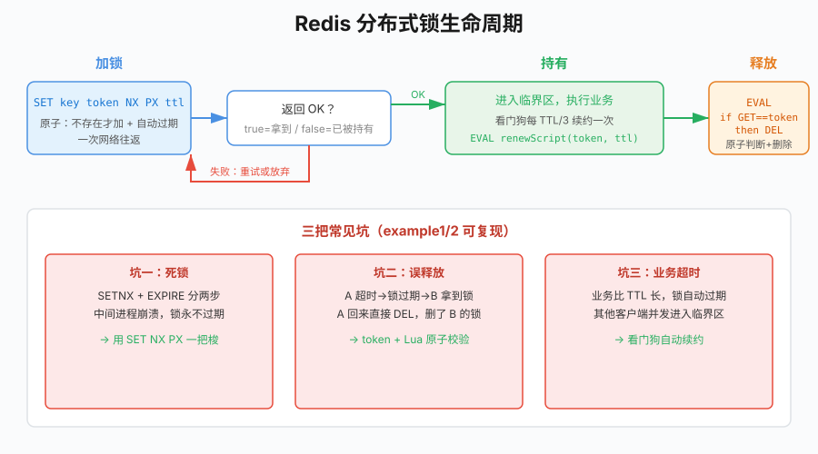

# 第23章 Redis分布式锁

## 场景

第22章我们遇到过一个边界:`singleflight` 只在单进程内合并回源。多实例部署时,比如线上跑了 8 个 Pod,热点 key 过期的瞬间,每个 Pod 都会有一个请求回源到 MySQL——8 次,而不是 N×并发,但对极致热点的秒杀库存来说,8 次也可能超卖。

再看一个更直接的场景:秒杀活动,一件爆款商品库存 10 件,1000 个用户同时点抢购。扣减库存的逻辑如果不加互斥,"查库存 → 判断 > 0 → 扣减"这三步被并发穿插,库存就被扣成负数(超卖),或者同一件商品被卖给两个人。

单机场景用 Go 自带的 `sync.Mutex` 就能解决。但线上是多实例的——`sync.Mutex` 只在一个进程内生效,不同 Pod 之间互不相认。这就需要**分布式锁**:让所有实例看到同一把锁,谁持有谁进临界区。

第21章我们已经用过 `SETNX` 做互斥的雏形,第22章也承诺本章"把分布式锁讲透"。这一章就把一把生产可用的 Redis 分布式锁从零写出来,并把它踩过的坑全部过一遍。

## 问题

网上关于 Redis 分布式锁的文章常给人一种印象:`SETNX` 一行代码就搞定。真实生产里,你会遇到这几个必须解决的问题:

1. **死锁**:加锁后进程崩溃、没来得及释放,锁就永远留在 Redis 里。有人会加 `EXPIRE`,但 `SETNX` 和 `EXPIRE` 是两条命令,中间崩溃照样死锁。
2. **误释放**:A 持锁后业务执行超时,锁自动过期;B 拿到锁;这时 A 终于执行完去 `DEL`,把 B 的锁删了。B 在业务上仍以为自己持有锁。
3. **业务超时**:锁的 TTL 设多长都不合适——设短了业务没跑完锁就过期,设长了崩溃后要等很久。
4. **可重入 / 续约 / 主从切换**:复杂场景的额外需求(本章会给边界,但不做银弹)。

这一章的目标就是把这四个坑一个个填上,最终得到一个生产可用的锁实现,并诚实说明它**解决不了**什么。



> 本章所有示例在 `03-数据存储与缓存/23-redis-lock/` 下,基于 go-redis v9.7.3。`mutex` 包是最终可复用的锁实现,example1~4 逐步演示坑与修复。
>
> 运行前先起 Redis:
>
> ```bash
> docker run --name go-book-redis -p 6379:6379 -d redis:7-alpine
> ```

## 23.1 朴素实现与死锁

最直觉的写法就是 `SETNX`(SET if Not eXists):key 不存在才写入,返回 1 表示拿到锁,0 表示已被别人持有。用完了 `DEL` 掉。

```go
// 错误：只 SETNX 不过期，进程崩溃后锁永久泄漏
ok, _ := rdb.SetNX(ctx, key, "client-a", 0).Result()
// 执行业务...
rdb.Del(ctx, key)
```

问题很明显:如果拿到锁的进程在"执行业务"过程中挂了(Panic、OOM、被 `kill -9`、机器宕机),`DEL` 永远不执行,这把锁就永远存在,其他进程再也拿不到,形成**死锁**。

有人会想到加个过期时间:

```go
// 错误：SETNX 和 EXPIRE 是两条命令，中间崩溃依然死锁
rdb.SetNX(ctx, key, "client-a", 0)
// 在这里崩溃，EXPIRE 没执行，锁照样永不过期
rdb.Expire(ctx, key, 10*time.Second)
```

**这是最常见的错**:分成两步,第一步和第二步之间的窗口里进程一挂,锁还是永不过期。Redis 单线程执行命令,但两条命令之间客户端依然可能出事。

运行 `example1-deadlock` 直接复现:

```
=== 错误写法：SETNX 后、EXPIRE 前进程崩溃 ===
SETNX 成功: true
进程崩溃（模拟：跳过 EXPIRE）
当前锁 TTL: -1ns（-1 表示永不过期）
client-b 试图加锁: false（false=拿不到，锁已泄漏）
```

`TTL` 返回 `-1` 表示这个 key 没有过期时间,会一直存在。client-b 永远拿不到锁。

**修复**:Redis 从 2.6.12 起,`SET` 命令原生支持 `NX` 和 `PX`/`EX` 选项,加锁和设置过期是一条原子命令——

```go
// 正确：原子加锁 + 过期时间，一次网络往返
ok, err := rdb.SetNX(ctx, key, owner, 10*time.Second).Result()
```

go-redis 的 `SetNX(ctx, key, value, expiration)` 内部就是 `SET key value NX PX <ms>`,要么整条命令成功(拿到锁并设了 TTL),要么整条失败(没拿到锁),中间没有任何"先加锁再设 TTL"的窗口。即使加锁成功后进程立刻崩溃,TTL 到期 Redis 也会自动释放锁。

运行 `example1-deadlock` 对比:

```
=== 正确写法：SET NX PX 原子加锁 ===
SETNX+TTL 原子加锁成功: true
当前锁 TTL: 10s（崩溃后也会自动释放）
```

## 23.2 误释放与唯一持有者标识

原子加锁解决了死锁,但下一个坑藏在释放时。看这个场景:

1. 客户端 A 拿到锁,TTL 10 秒。
2. A 的业务因为 GC / 慢查询 / 网络阻塞执行了 11 秒,第 10 秒锁自动过期。
3. 客户端 B 在第 10.1 秒拿到同一把锁。
4. A 在第 11 秒终于执行完,调用 `DEL key`——**把 B 的锁删了**。
5. 客户端 C 在第 11.1 秒又能拿到锁。此时 B 还在临界区,C 也进了临界区,互斥被破坏。

问题出在:锁的值只是一个随便的字符串(比如 `"client-a"`),"谁上的锁"这件事没有校验。释放时必须确认"这把锁是我加的"才能删。

**解法**:锁的 value 不是随便的标识,而是一个**全局唯一 token**(UUID/随机串),加锁时写入,释放时用 Lua 脚本原子地"先判断 value 是不是自己,是才删"。

Lua 脚本的必要性:`GET` + `DEL` 如果分成两条命令,中间同样可能被其他命令插入(刚判断是自己,B 的锁恰好过期,C 抢到锁,然后你 DEL 把 C 的删了)。Lua 在 Redis 里**原子执行**,整个脚本不被其他命令打断。

```go
const unlockScript = `
if redis.call("get", KEYS[1]) == ARGV[1] then
	return redis.call("del", KEYS[1])
else
	return 0
end
`

res, err := rdb.Eval(ctx, unlockScript, []string{key}, myToken).Result()
```

`example2-misrelease` 复现了误删和修复:

```
=== 错误释放：不校验持有者直接 DEL ===
A 拿到锁，开始执行业务...
锁已过期，B 拿到锁: true
A 执行完 DEL key，把 B 的锁删了！
B 的锁还在吗？存在=false（0 表示被误删）

=== 正确释放：Lua 校验持有者 ===
A 用旧 token 释放：n=0（0=没删到，B 的锁安全）
B 的锁还在吗？存在=true（1 表示安全）
B 用自己的 token 释放：n=1（1=删除成功）
```

A 用旧 token 释放时,Lua 发现 GET 返回的是 `"token-b"` 不是 `"token-a"`,直接返回 0 不动 key,B 的锁安然无恙。

token 生成用密码学随机数即可:

```go
func randomToken() string {
	var b [16]byte
	_, _ = rand.Read(b[:])
	return hex.EncodeToString(b[:])
}
```

16 字节随机 hex 是 32 个十六进制字符,碰撞概率在工程上完全可以忽略。

## 23.3 业务超时与看门狗续约

原子加锁 + 唯一 token 解决了死锁和误释放,但还有一个纠结:**TTL 设多长合适?**

- 设短了(比如 5 秒):业务稍微抖一下(慢 SQL、GC),锁就过期了,其他客户端进入临界区,互斥被破坏。
- 设长了(比如 5 分钟):真出崩溃,要等 5 分钟锁才释放,恢复时间太长。

这不是调参能解决的,而是思路问题:**TTL 不应该是"业务预计执行时间",而应该是"崩溃后兜底的最大恢复时间"**。具体做法是**看门狗(watchdog)**:

- 锁的 TTL 设成一个安全的固定值(比如 10 秒,崩溃后最多等 10 秒)。
- 拿到锁的客户端起一个后台 goroutine,每隔 `TTL/3`(比如 3 秒)检查"锁还在不在我手上",在就续约(PEXPIRE 延长 TTL)。
- 业务正常执行期间,锁一直被续,永不过期;业务结束就停掉看门狗,然后释放锁。
- 如果客户端真的崩溃,看门狗也死了,没人续约,TTL 到点自动释放。

续约也必须走 Lua,校验持有者一致才续:

```go
const renewScript = `
if redis.call("get", KEYS[1]) == ARGV[1] then
	return redis.call("pexpire", KEYS[1], ARGV[2])
else
	return 0
end
`
```

完整的看门狗封装:

```go
func (m *Mutex) RunWatchdog(ctx context.Context) (stop func(), errCh <-chan error) {
	ctx, cancel := context.WithCancel(ctx)
	ch := make(chan error, 1)

	go func() {
		ticker := time.NewTicker(m.renew) // 默认 TTL/3
		defer ticker.Stop()
		for {
			select {
			case <-ctx.Done():
				return
			case <-ticker.C:
				if err := m.Renew(ctx); err != nil {
					ch <- err // 续约失败（锁已过期/被抢占）
					return
				}
			}
		}
	}()
	return cancel, ch
}
```

使用方式:

```go
lock := mutex.New(rdb, key, mutex.WithTTL(10*time.Second))
if err := lock.Lock(ctx); err != nil { return err }
stop, errCh := lock.RunWatchdog(ctx)
defer stop()        // 业务结束停看门狗
defer lock.Unlock(ctx)

// ...执行业务，哪怕执行 10 分钟也不会丢锁...
```

`example3-mutex` 跑了一个真实的长任务演示看门狗:

```
=== 看门狗自动续约 ===
业务开始执行（10s），看门狗每 ~1.3s 续约一次
  业务运行中，锁 TTL ≈ 3s（持续续约，不会过期）
  业务运行中，锁 TTL ≈ 4s（持续续约，不会过期）
  业务运行中，锁 TTL ≈ 3s（持续续约，不会过期）
  业务运行中，锁 TTL ≈ 4s（持续续约，不会过期）
  业务运行中，锁 TTL ≈ 3s（持续续约，不会过期）
业务结束，锁已释放
```

TTL 只有 4 秒,业务跑了 10 秒,但锁一直被续,从未过期。一旦进程崩溃,看门狗跟着死,锁最多 4 秒后自动释放。

`errCh` 用来通知业务"续约失败了"——这通常意味着锁已经过期被别人拿走了,你的临界区已经不安全,此时业务层要考虑回滚/失败返回。

## 23.4 实战:秒杀防超卖

把前面的锁用到订单系统的秒杀场景:商品库存 10 件,100 个用户并发抢购。

为了让示例独立可跑,这里用 Redis 的 GET/SET 模拟库存扣减(生产中对应 MySQL 的 `UPDATE ... WHERE stock > 0`),并故意用"先查库存再 SET"的非原子写法把并发问题暴露出来。

无锁版本的惨状:

```
=== 无锁：100 并发抢购 10 件商品 ===
成功下单: 100 件，剩余库存: 7（耗时 40ms）
结果：超卖！100 个并发都"看到库存大于 0"然后扣减，最终下单数远超库存
```

100 个并发全部"看到库存 > 0 然后扣减",互相覆盖,结果 10 件的库存被下了 100 单——典型超卖(在更复杂的业务里多步操作还会把库存扣成负数)。加上分布式锁串行化扣减:

```go
lock := mutex.New(rdb, "lock:"+stockKey, mutex.WithTTL(2*time.Second))

// 抢不到锁短暂自旋重试（最多等 200ms）
for attempt := 0; attempt < 20; attempt++ {
	if err := lock.Lock(ctx); err == nil { break }
	time.Sleep(10 * time.Millisecond)
}
defer lock.Unlock(ctx)

// 临界区：查库存 + 扣减
n, _ := rdb.Get(ctx, stockKey).Int()
if n > 0 {
	rdb.Set(ctx, stockKey, n-1, 0)
	atomic.AddInt64(&success, 1)
}
```

运行结果:

```
=== 加分布式锁 + 短重试：100 并发抢购 10 件商品 ===
成功下单: 10 件，剩余库存: 0（耗时 230ms）
结果：库存刚好用完，没有超卖
```

10 件商品,100 并发,不多不少正好下 10 单,库存归零。代价是 230ms 串行化执行(每个用户扣减约 5ms 业务 + 网络往返);生产里这个 5ms 换成真实的 MySQL 事务,延迟会相应上升,但**正确性**有了保证。

几点生产经验:

- **重试要有上限和退避**。不能无限自旋,也不能把 Redis 打爆;10ms 间隔 + 最多等 TTL 量级通常够。
- **临界区要尽量短**。锁持有的时间决定了吞吐,能拿到锁外做的事就拿出去。
- **锁的粒度要小**。秒杀场景按商品 id 加锁(`lock:seckill:stock:<sku_id>`),不是整个活动一把锁。
- **不是所有扣减都需要锁**。Redis 的 `DECR` 本身是原子的,单纯"扣减并判断 ≥0"可以直接用:

  ```go
  n, _ := rdb.Decr(ctx, stockKey).Result()
  if n < 0 {
      rdb.Incr(ctx, stockKey) // 不够，回滚
      return soldOut
  }
  ```

  只有当临界区里有**多个步骤**(查库存 + 写订单 + 扣优惠券 + ...)必须原子时,才上分布式锁。

## 23.5 原理:为什么是 Lua

前面两次用到 Lua:释放锁和续约。为什么必须 Lua,而不能在客户端用 GET 再 DEL/PEXPIRE?

Redis 执行命令是**单线程串行**的,但"客户端发两条命令"在 Redis 视角里是两个独立的事件,中间完全可能插入别的客户端的命令。以释放锁为例,没有 Lua 时的时序:

```
客户端 A: GET key → "token-a"   （我自己的，可以删）
                              ← 恰好锁过期、客户端 B 抢到
                              ← 客户端 B: SET key token-b NX PX 10000 → OK
客户端 A: DEL key             ← A 把 B 的锁删了！
客户端 C: SET key token-c NX PX 10000 → OK  （互斥破坏）
```

Lua 脚本在 Redis 中作为一个**不可分割的整体**执行:`EVAL` 把整个脚本发到服务端,服务端执行期间不响应任何其他命令(因为单线程),直到脚本返回才处理下一个事件。上面那个"判断 → 删除"之间被插入的窗口被彻底消除。

go-redis 会在第一次 `Eval` 后自动缓存脚本的 SHA1,后续调用会尝试 `EVALSHA`,如果脚本没被清除(SCRIPT FLUSH)就用 SHA1 执行,否则回退到传完整脚本——调用方不用关心。

理解了"原子性"这个需求,你就不会疑惑"为什么要用 Lua 这么绕",也能举一反三:任何"先读再写"的复合操作要原子,都用 Lua。

## 23.6 锁的边界与 Redlock

前面实现的是**单 Redis 实例**的锁。它已经足够应对绝大多数场景,但要诚实面对它的边界:

**单点故障**。如果 Redis 主节点挂了,且锁还没同步到从节点(异步复制),主从切换后新主上没有这把锁,另一个客户端就能拿到锁,互斥被破坏。这是 Redis 分布式锁最常被质疑的一点。

对这个问题的两个常见态度:

1. **务实派**:绝大多数业务场景这个窗口概率极低(故障已经是小概率,再叠加"故障时恰好锁被持有+恰好没复制+恰好另一个客户端抢"的联合概率,工程上可接受),单实例锁 + 看门狗足够用。出现问题靠业务层幂等兜底(订单重复就幂等去重,库存扣错就对账补偿)。
2. **严谨派**:用 **Redlock**(Redis 作者 antirez 提出的多主算法):在 N 个互相独立的 Redis 主节点(通常 5 个)上分别加锁,超过半数(N/2+1)加锁成功才算拿到锁,且总耗时小于锁 TTL。它降低了单点故障下锁丢失的概率,但代价是部署复杂、时钟依赖、社区对其正确性有争议(Martin Kleppmann 与 antirez 那场著名的辩论)。

本书的建议是:**先用单实例锁,真正遇到跨机房/强一致需求时再评估 Redlock**。Go 生态里 `github.com/go-redsync/redsync/v4` 是 Redlock 的成熟实现,引入即可,不建议自己手写多节点算法。

其他常被问到的边界,一句话回答:

- **可重入**:同一个 token 再次加锁时判断是自己就放行,计数 +1,释放时 -1 到 0 才真正删。需要可重入就在 value 里存计数,绝大多数业务不需要。
- **锁续期失败怎么办**:通过 `errCh` 通知业务,业务视情况回滚/终止。这是锁真的丢了的信号,临界区已经不安全。
- **锁 + 事务**:别把数据库事务放在锁内执行太久,锁只是保证并发互斥,不替代事务本身的 ACID。

## 23.7 最佳实践

- **加锁必须原子**:`SET key value NX PX ttl`(go-redis `SetNX` 已封装),禁止 `SETNX` + `EXPIRE` 两步。
- **value 必须是唯一 token**,释放/续约用 Lua 校验,绝不能直接 `DEL`。
- **TTL 是崩溃兜底,不是业务超时**;长任务用看门狗续约,TTL 设成可接受的崩溃恢复时间(经验值 5~30 秒)。
- **看门狗间隔取 TTL/3**(留足重试余量),`ctx` 与业务绑定,业务结束立即 `stop()`。
- **重试要有限**:次数/时间/退避三要素齐全;拿不到锁就是拿不到,快速失败比死等好。
- **临界区尽量短、粒度尽量小**;能用原子命令(`DECR`、`INCRBY`、Lua)解决的不要上锁。
- **锁 key 命名规范**:`lock:<业务>:<资源标识>`,例 `lock:seckill:stock:1001`。
- **为锁失败买单**:业务上要有幂等和补偿,锁不是银弹,最终一致靠业务兜底。

## 23.8 排障

**所有客户端都拿不到锁**

多半是历史进程崩溃且用了无 TTL 的锁。`redis-cli --scan --pattern 'lock:*' | xargs redis-cli TTL` 找出 `-1`(永不过期)的锁,确认业务已无持有者后手动 `DEL`。然后排查代码是否有 `SetNX` expiration=0 的写法。

**锁意外丢失,临界区被并发进入**

排查顺序:① TTL 是否太短、业务是否发生长 GC/慢查询导致锁过期;② 看门狗是否被意外停止(业务 `ctx` 提前 cancel);③ 是否发生了 Redis 主从切换且锁未同步;④ 释放逻辑有没有直接 DEL 而非 Lua 校验。用 `GET lock:xxx` 看当前持有者 token 是否符合预期。

**续约失败("lock not held")**

说明在续约间隔期间锁已经不属于自己了——要么过期了(业务比 TTL/3 慢太多,看门狗来不及续),要么被别人抢走。检查 `m.renew` 间隔是否过大、业务是否有长时间阻塞。出现这个错误必须把它当成"临界区已被侵入"的信号处理,业务要中止或回滚。

**Redis 抖动大面积超时**

加锁/释放/Lua 脚本都走网络,需要合理的超时和重试。加锁一般用短超时(几十毫秒),失败快速回退;对业务关键路径,不要让 Redis 不可用变成整个服务不可用,降级方案要准备好(限流、走本地 singleflight、返回稍后重试)。

**热点锁导致 Redis QPS 飙升**

超热点资源(比如"全站只有一把的活动锁")会把 Redis 单实例打满。拆粒度(`lock:sku:<id>` 而非 `lock:seckill`),或在 Redis 锁之上叠加本地 singleflight 先在进程内合并。

## 23.9 面试题

**1. 为什么 Redis 分布式锁不能直接用 SETNX + DEL?**

SETNX 不带过期时间,进程崩溃会死锁;加 EXPIRE 又分成两步,中间崩溃照样死锁。必须用 SET NX PX(go-redis SetNX)一条命令原子完成加锁+过期。另外 DEL 不校验持有者,业务超时后会误删别人的锁——必须用唯一 token + Lua 原子校验释放。

**2. 释放锁为什么要用 Lua 脚本?GET 之后 DEL 不行吗?**

不行。GET 和 DEL 是两条命令,中间 Redis 会处理其他客户端的请求。时序:你 GET 到自己的 token,但锁恰好过期、别人抢到锁,你再 DEL 就把别人的锁删了。Lua 脚本在 Redis 里原子执行,GET 判断和 DEL 之间不被任何命令插入。

**3. 看门狗是干什么的?为什么不直接把 TTL 设长点?**

TTL 是崩溃兜底:设长了崩溃恢复慢,设短了业务超时锁丢失。看门狗让锁在业务正常执行期间自动续约(每 TTL/3 用 Lua PEXPIRE 续一次),业务结束就停;进程崩溃则看门狗也死,TTL 到期自动释放。长 TTL 解决不了"业务执行时间不可预测"和"崩溃恢复时间要短"的矛盾。

**4. Redlock 是什么?你会用吗?**

Redlock 是 antirez 提出的多主 Redis 分布式锁算法,在 5 个独立主节点上加锁,过半数成功才认为拿到锁,降低单点故障下锁丢失的概率。但它依赖时钟、部署复杂、学界对其正确性有争议。务实建议:单实例锁 + 看门狗覆盖绝大多数场景,真正需要多机房强一致再评估;Go 里用 redsync 即可,不自己实现。

**5. 锁过期了业务还没执行完怎么办?**

这是分布式锁的本质弱点。看门狗把概率压低,但不能 100% 消除(比如长时间 GC 暂停)。解决思路:① 业务上设计幂等,即使并发进入也不产生脏数据;② 续约失败通过 errCh 主动中止业务;③ 极端场景考虑 fencing token(每次加锁返回递增编号,下游资源校验编号拒绝旧持有者写入)。

**6. Redis 分布式锁能用在什么场景,不能用在什么场景?**

适合:跨实例的互斥、秒杀库存串行化、缓存回源合并、定时任务防重复执行。不适合:对一致性要求极高、无法容忍极小概率失效的场景(比如跨机房金融扣款),这类场景应选 ZooKeeper/etcd 等基于共识协议的锁,或直接靠数据库事务/状态机兜底。

## 23.10 小结

这一章我们从零写了一把生产可用的 Redis 分布式锁:

- **原子加锁**用 `SetNX`(SET NX PX)避免死锁。
- **唯一 token + Lua 释放**避免误删别人的锁。
- **看门狗续约**解决"业务时间不可预测 vs 崩溃要快恢复"的矛盾。
- 用秒杀防超卖的例子验证了锁的有效性,看到了无锁超卖和加锁正确扣减的对比。
- 诚实交代了单实例锁在主从切换下的边界,以及 Redlock 的取舍。

核心认知:分布式锁不是银弹。它把"互斥"这个问题做得足够好,但**不能替你兜底业务一致性**——幂等、对账、补偿依然要在业务层做好。这和第22章"别为了理论上的强一致给系统加扛不动的复杂度"一脉相承。

下一章我们转向另一类常用的 NoSQL:**MongoDB 实战**,处理订单系统里像订单变更历史、用户操作日志这种结构灵活、写入频繁、不适合关系模型的数据。

---

## 参考资料

> 本章基于 **Go 1.23**、go-redis v9.7.3、Redis 7。锁实现遵循 Redis 官方 SET NX 语义与 Lua 原子性保证。

- go-redis 官方文档：https://redis.uptrace.dev/
- Redis SET 命令（NX/XX/PX/EX 选项）：https://redis.io/docs/latest/commands/set/
- Redis EVAL 命令：https://redis.io/docs/latest/commands/eval/
- Redis 分布式锁官方推荐模式：https://redis.io/docs/latest/develop/use/patterns/distributed-locks/
- Redlock 算法原文（antirez）：https://redis.io/docs/latest/develop/use/patterns/distributed-locks/#the-redlock-algorithm
- Martin Kleppmann 对 Redlock 的批评：https://martin.kleppmann.com/2016/02/08/how-to-do-distributed-locking.html
- redsync（Go Redlock 实现）：https://github.com/go-redsync/redsync
