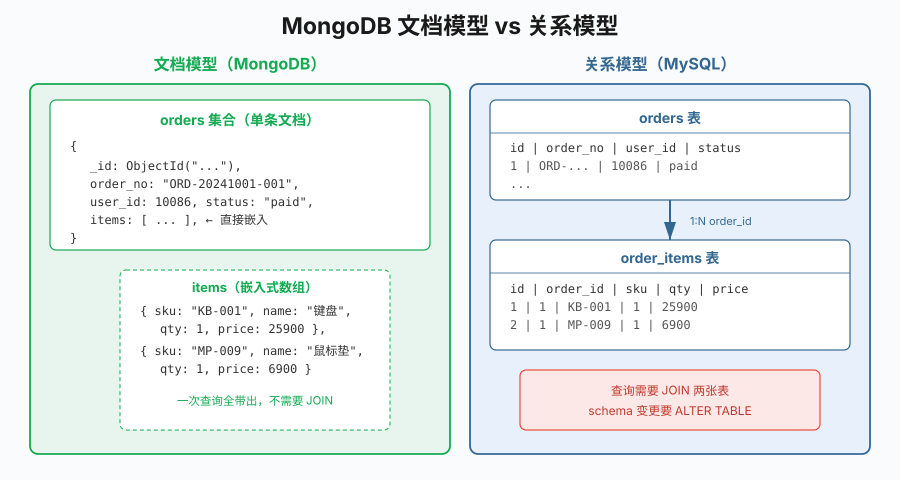

# 第24章 MongoDB实战

## 场景

订单系统里有两类数据让 MySQL 很别扭:

- **订单变更流水**:一条订单从创建、支付、发货、签收、退款,中间会产生十几条事件,每种事件带的字段不一样——支付事件带支付渠道、发货事件带快递单号、退款事件带退款原因。用关系表你得设计一张极宽的表留一堆 NULL 列,或拆成 N 张子表再外键关联。
- **订单明细**:一个订单头带 N 条明细,查订单详情必然要 JOIN。做分析的时候按用户/按商品聚合统计金额,SQL 写起来长,数据量大了 JOIN 性能也成问题。

这类**结构不固定、写入频繁、整体读取**的数据,正是 MongoDB 的舒适区。这一章把 MongoDB 作为订单系统的补充存储实战一把:用它存订单事件流水,演示 CRUD、索引、聚合、嵌入式文档、事务,并诚实地讲清楚它**不适合**干什么。

## 问题

把一个新存储加进技术栈之前,必须回答清楚这几个问题:

1. MongoDB 的"文档模型"到底比关系模型好在哪?什么时候好?
2. 驱动怎么用?Go 里 CRUD 怎么写,和 GORM 差别多大?
3. 性能靠什么?MongoDB 也要建索引吗,怎么知道索引起没起作用?
4. 复杂统计怎么做?有没有对应 SQL 的 GROUP BY / JOIN?
5. 不是说 NoSQL 不支持事务吗?我要同时扣库存+建订单还原子怎么办?
6. 边界在哪?什么场景**别用** MongoDB?

这一章用 5 个可独立运行的 example 逐个回答。



> 本章所有示例在 `03-数据存储与缓存/24-mongodb/` 下,基于 MongoDB 8.0 和 Go 官方驱动 v2 (`go.mongodb.org/mongo-driver/v2`)。前 4 个 example 用普通单机 Mongo 即可运行;example5 事务需要副本集,启动命令见 example5 文件头。
>
> 本地启动(前 4 个 example):
>
> ```bash
> docker run --name go-book-mongo -p 27017:27017 -d mongo:8.0
> ```
>
> 事务演示需要副本集模式,见 example5。

## 24.1 CRUD 基础

MongoDB 的概念对照:

| 关系型 | MongoDB |
|--------|---------|
| database | database |
| table | collection |
| row | document (BSON) |
| column | field |
| primary key | `_id` (默认 ObjectId) |
| JOIN | 嵌入式文档 / `$lookup` |

连接用 `mongo.Connect`,不再传 context(驱动 v2 的变化),操作 CRUD 都要带 `context.Context` 控制超时:

```go
uri := getenv("MONGO_URI", "mongodb://localhost:27017")
client, err := mongo.Connect(options.Client().ApplyURI(uri))
defer client.Disconnect(ctx)
client.Ping(ctx, nil)
```

插入用 `InsertOne` / `InsertMany`,文档用带 `bson` tag 的 Go 结构体映射;`_id` 留空时驱动自动生成 `ObjectID`:

```go
type OrderEvent struct {
	ID        bson.ObjectID          `bson:"_id,omitempty"`
	OrderID   string                 `bson:"order_id"`
	EventType string                 `bson:"event_type"`
	UserID    int64                  `bson:"user_id"`
	Amount    int64                  `bson:"amount"`
	CreatedAt time.Time              `bson:"created_at"`
	Extra     map[string]interface{} `bson:"extra,omitempty"` // 扩展字段
}

coll := client.Database("shop").Collection("order_events")
insertRes, _ := coll.InsertOne(ctx, OrderEvent{
	OrderID: "ORD-1001", EventType: "paid", UserID: 10086, Amount: 29900,
	CreatedAt: time.Now(),
	Extra:     map[string]interface{}{"pay_method": "alipay"},
})
objID := insertRes.InsertedID.(bson.ObjectID)
```

查询用 bson 构造 filter,`bson.M` 是 `map[string]interface{}` 的别名,`bson.D` 是有序切片(排序/命令用);更新用 `$set` 部分更新,不会像 MySQL 行覆盖那样有风险:

```go
// 查询
var got OrderEvent
coll.FindOne(ctx, bson.M{"order_id": "ORD-1001"}).Decode(&got)

// 部分更新：$set 只改指定字段，其他字段不动
coll.UpdateOne(ctx, bson.M{"_id": objID},
	bson.M{"$set": bson.M{"amount": 25900, "extra.coupon": "NEW10"}})
```

`bson.M{"extra.coupon": "NEW10"}` 这种**点表示法**可以直接操作嵌套字段,这是文档模型很顺手的地方。

运行 `example1-crud`:

```
=== 插入单条 ===
插入成功 _id=...
=== 查询 ===
查到: ORD-1001 事件=paid 金额=29900 extra.pay_method=alipay
=== 更新 ===
更新后: 金额=25900 extra.coupon=NEW10
=== 查询 user_id=10086 的事件，按时间倒序 ===
  01:21:57 | paid | 25900 分
  00:21:57 | created | 89900 分
  22:21:57 | cancelled | 5000 分
=== 删除 ===
剩余文档数: 3
```

和 GORM 比有几个直观差别:

- **没有"模型迁移"**:新字段直接写,不用 `ALTER TABLE`。
- **BSON 不是 JSON**:BSON 是二进制编码,支持日期、二进制、ObjectId、Decimal、正则等类型,比 JSON 更紧凑也更快。
- **`_id` 默认索引**:插入即建主键索引,这是唯一默认的索引。

## 24.2 索引与执行计划

和 MySQL 一样,MongoDB 没索引就是全集合扫描(叫 `COLLSCAN`,对应 MySQL 的 `type=ALL`)。集合一大查询会慢到不可用。建索引是性能的第一抓手。

### 24.2.1 建索引

```go
// 单字段索引，1=升序 -1=降序
coll.Indexes().CreateOne(ctx, mongo.IndexModel{
	Keys: bson.D{{Key: "user_id", Value: 1}},
})

// 复合索引：等值+排序场景用，遵循 ESR 规则(Equality→Sort→Range)
coll.Indexes().CreateOne(ctx, mongo.IndexModel{
	Keys: bson.D{
		{Key: "user_id", Value: 1},    // 等值在前
		{Key: "created_at", Value: -1}, // 排序在后
	},
})

// 唯一索引：防重复
coll.Indexes().CreateOne(ctx, mongo.IndexModel{
	Keys:    bson.D{{Key: "order_id", Value: 1}},
	Options: options.Index().SetUnique(true),
})

// TTL 索引：到期自动删除（和 Redis TTL 类似）
coll.Indexes().CreateOne(ctx, mongo.IndexModel{
	Keys:    bson.D{{Key: "created_at", Value: 1}},
	Options: options.Index().SetExpireAfterSeconds(3600),
})
```

`example2-index` 灌了 5000 条测试数据,对比建索引前后的执行计划:

```
=== 没索引：全表扫描 ===
stage=COLLSCAN（无索引时遍历整个集合）

=== 创建单字段索引：user_id ===
stage=IXSCAN（命中 user_id 索引）
```

执行计划里 `COLLSCAN` = 全表扫描,`IXSCAN` = 走索引,和 MySQL 的 `EXPLAIN` 里 `type=ALL` vs `type=ref/range` 一个意思。Go 里通过 `RunCommand` 发 `explain` 命令拿计划,递归取叶子阶段即可(详见 example2 `explain`/`findLeafStage` 辅助函数)。

### 24.2.2 索引选型经验

- **等值查询建单字段索引**:`find({user_id: 10086})` 建 `user_id:1`。
- **等值 + 排序建复合索引**:`find({user_id:...}).sort({created_at:-1})` 建 `{user_id:1, created_at:-1}`,方向要和查询一致。
- **唯一性约束用唯一索引**:比业务代码里"先查再插"可靠,并发下不会双写。
- **日志/事件过期用 TTL 索引**:比定时清理任务省事,MongoDB 后台线程每 60 秒扫一次,精度到分钟级。
- **点表示法可直接给嵌套字段建索引**:对嵌入式数组字段 `items.sku` 建索引可以直接按子字段查询(MongoDB 会自动展开数组,叫 multikey index)。

有一个和 MySQL 一致的规律:**单字段索引的方向(1 或 -1)对查询无影响**——B-tree 可以双向遍历,升序降序都走索引。但**复合索引里的方向组合要和查询的 sort 顺序匹配**;比如索引是 `{user_id:1, created_at:-1}`,查询用 `.sort({user_id:1, created_at:1})` 排序就用不上这个索引(方向反了),需要再建一个方向匹配的索引。MongoDB 的 B-tree 叶子节点之间没有 InnoDB 那样的双向链表,反向扫描代价更高,所以方向匹配很重要。

## 24.3 聚合管道

SQL 的 `GROUP BY / SUM / HAVING / JOIN`,MongoDB 用**聚合管道**(`aggregate`):数据像流水一样经过一系列 stage,每个 stage 变换一次。常用 stage:

| Stage | SQL 等价 | 作用 |
|-------|---------|------|
| `$match` | WHERE | 过滤 |
| `$group` | GROUP BY | 分组聚合 |
| `$sort` | ORDER BY | 排序 |
| `$lookup` | LEFT JOIN | 跨集合关联 |
| `$project` | SELECT | 字段裁剪 |
| `$limit` / `$skip` | LIMIT/OFFSET | 分页 |

### 24.3.1 按用户分组统计

```go
// 等价 SQL:
// SELECT user_id, COUNT(*), SUM(amount) FROM order_events
// WHERE event_type='paid' GROUP BY user_id ORDER BY total_spend DESC
pipeline := mongo.Pipeline{
	{{Key: "$match", Value: bson.D{{Key: "event_type", Value: "paid"}}}},
	{{Key: "$group", Value: bson.D{
		{Key: "_id", Value: "$user_id"},                  // 分组键
		{Key: "order_count", Value: bson.D{{Key: "$sum", Value: 1}}},
		{Key: "total_spend", Value: bson.D{{Key: "$sum", Value: "$amount"}}},
	}}},
	{{Key: "$sort", Value: bson.D{{Key: "total_spend", Value: -1}}}},
}
cur, _ := coll.Aggregate(ctx, pipeline)
```

注意 `$` 前缀:`$user_id` 是指文档的 `user_id` 字段,`$sum` 是聚合操作符,别和字符串值混淆。

`example3-aggregation` 输出:

```
=== 按用户聚合成交统计 ===
  user=10087  订单=2 笔  总消费=2048.00 元
  user=10086  订单=2 笔  总消费=1198.00 元
  user=10088  订单=1 笔  总消费=129.00 元
```

### 24.3.2 $lookup 跨集合关联

```go
{{Key: "$lookup", Value: bson.D{
	{Key: "from", Value: "users"},         // 关联到哪个集合
	{Key: "localField", Value: "_id"},    // 本地字段（这里 _id 是 user_id）
	{Key: "foreignField", Value: "uid"},  // 对方字段
	{Key: "as", Value: "user"},           // 输出数组字段名
}}},
```

`$lookup` 相当于 LEFT JOIN,结果放到一个数组字段里(因为可能匹配多条)。和 MySQL JOIN 不同的是,MongoDB 的关联在应用层聚合阶段做,数据量大时性能不如关系型数据库的 JOIN,这是它的一个边界。

### 24.3.3 时间维度聚合

MongoDB 5.0+ 有 `$dateTrunc` 可以按天/周/月截断时间戳,写按日/按周统计非常简洁:

```go
{{Key: "$group", Value: bson.D{
	{Key: "_id", Value: bson.D{{Key: "$dateTrunc", Value: bson.D{
		{Key: "date", Value: "$created_at"}, {Key: "unit", Value: "day"},
	}}}},
	{Key: "daily", Value: bson.D{{Key: "$sum", Value: "$amount"}}},
}}},
```

输出:

```
=== 按天统计成交金额 ===
  2026-07-30  成交 2177.00 元
  2026-07-31  成交 1198.00 元
```

## 24.4 文档模型的灵活性

MongoDB 真正的杀手锏是**schema-on-read**:字段不强制、可嵌套、不同文档字段可以不同。对审计日志、用户行为、事件流这类"结构跟着业务走"的数据非常自然。

### 24.4.1 多态文档

同一个集合里不同 action 的 detail 字段可以结构完全不同:

```go
AuditEvent{UserID: 10086, Action: "login", Detail: LoginDetail{IP:"1.2.3.4", Device:"iOS"}}
AuditEvent{UserID: 10086, Action: "order_create", Detail: OrderDetail{OrderID:"ORD-1", Amount:29900}}
AuditEvent{UserID: 10087, Action: "refund", Detail: RefundDetail{OrderID:"ORD-2", Reason:"尺寸不符"}}
```

关系型里要么一张宽表大量 NULL,要么每种事件一张表再加外键——MongoDB 里就是一个集合,读的时候按 action 过滤然后 Decode 到对应的结构体。`example4-schema` 演示了这种异构写入和查询。

### 24.4.2 嵌入式文档

订单头+明细的关系,关系型要 `orders` + `order_items` 两张表,JOIN 才能取完整订单。MongoDB 里把明细直接作为数组嵌进订单文档:

```go
type Order struct {
	OrderNo string      `bson:"order_no"`
	UserID  int64       `bson:"user_id"`
	Amount  int64       `bson:"amount"`
	Items   []OrderItem `bson:"items"`  // 直接嵌入
}
```

一次查询就把整个订单带明细都取出来,不需要 JOIN,读取性能远高于多次往返或关系 JOIN。对"整体读写"的聚合根(订单、工单、博客文章)这是巨大的优势。对点表示法 `items.sku` 建索引还能按子字段反查订单:

```go
orders.Find(ctx, bson.M{"items.sku": "KB-001"}) // 查包含某 SKU 的所有订单
```

运行结果:

```
=== 嵌入式文档：订单+明细，一次查询全部返回 ===
  订单: ORD-20241001-001  总金额: 32800 分
    - 机械键盘 x 1 = 25900 分
    - 鼠标垫 x 1 = 6900 分
=== 查询包含 SKU=KB-001 的所有订单 ===
  命中: ORD-20241001-001
```

### 24.4.3 稀疏字段

只有支付成功事件才有 `pay_method`,只有发货才有 `tracking_no`——MongoDB 里不存在的字段就不存、不占空间,不需要 ALTER TABLE 加列。点表示法查 `{"pay_method":"alipay"}` 只匹配有这个字段的文档。

### 24.4.4 什么时候别嵌入

嵌入式不是银弹。两个场景慎用:

- **子文档数量无限增长**:比如一个商品的所有评论可能上百万,全部嵌入商品文档会产生大 key,应单独建集合并引用。
- **子文档要被单独查询/统计**:比如要独立统计"某天发了多少快递",那就把运单拆出来建独立集合。

经验法则:**是整体就嵌入,是关系就引用**。订单明细跟订单是"强整体",适合嵌入;评论、运单和商品是"关系",适合引用。

## 24.5 多文档事务

"NoSQL 不支持事务"是过时认知。MongoDB 从 4.0 起支持副本集上的多文档 ACID 事务,4.2 起支持分片集群事务。**前提是必须跑在副本集(或分片集群)上**,单机 `mongod` 不开副本集无法开启事务——这也是很多人踩坑的地方。

下面的例子演示"扣库存+建订单"必须原子:

```go
func createOrderInTxn(ctx context.Context, client *mongo.Client,
	products, orders *mongo.Collection, sku string, qty int, user int64) error {

	sess, err := client.StartSession()
	if err != nil { return err }
	defer sess.EndSession(ctx)

	_, err = sess.WithTransaction(ctx, func(sc context.Context) (interface{}, error) {
		// 注意：事务里的所有操作都要用 sc（session context），不是原来的 ctx
		var p Product
		products.FindOne(sc, bson.M{"sku": sku}).Decode(&p)
		if p.Stock < qty {
			return nil, fmt.Errorf("库存不足") // 返回 error 自动回滚
		}
		products.UpdateOne(sc,
			bson.M{"sku": sku, "stock": bson.M{"$gte": qty}}, // 条件更新防并发
			bson.M{"$inc": bson.M{"stock": -qty}})
		orders.InsertOne(sc, Order{SKU: sku, Qty: qty, ...})
		return nil, nil
	})
	return err
}
```

关键点:

- 事务里的 CRUD 必须用 `WithTransaction` 回调里传入的 `sc`(session context),否则操作不在事务里。
- 回调返回 `error` 自动回滚,返回 `nil` 自动提交;驱动自带重试逻辑。
- 事务有超时默认 60 秒,长事务会持锁影响吞吐,应尽量短。

启动 MongoDB 时要加 `--replSet rs0` 并 `rs.initiate()`(见 example5 文件头)。运行结果:

```
=== 成功事务：扣库存+建订单 ===
结果: err=<nil>
事务后库存: 1; 订单数: 1

=== 失败事务：库存不足，全部回滚 ===
结果: err=库存不足: stock=1 need=5
回滚后库存: 1（应仍为 1，没被扣成负数）
订单数: 1（仍为 1，没产生废订单）

=== 业务返回错误触发回滚 ===
结果: err=模拟业务校验失败
回滚后库存: 1（应仍为 1）
```

**诚实地讲**:MongoDB 事务的性能开销比 MySQL InnoDB 事务大(涉及副本集 oplog 复制、预备提交等),且跨分片事务性能进一步下降。它的价值不是"替代关系型事务",而是**让偶尔需要原子操作的文档场景不必切回 MySQL**。核心业务(订单、支付)的强事务还是 MySQL 更擅长,MongoDB 事务用于辅助数据(事件、日志、统计)的原子保证。

## 24.6 原理:BSON 与文档存储

MongoDB 的几个关键设计决定了它的优势和局限:

**BSON 文档**。BSON 是二进制 JSON 扩展,支持日期、二进制、ObjectId、Decimal128、正则等类型;带长度前缀可快速跳过字段;解析比 JSON 快得多。文档是自描述的,没有表结构也能读,这是 schema 灵活的根源。

**WiredTiger 存储引擎**。MongoDB 3.2+ 默认用 WiredTiger,支持文档级锁、MVCC、快照读、压缩(snappy/zstd)、内置缓存,和 InnoDB 同级别。**文档级锁**意味着写入同一文档才冲突,写入不同文档互不阻塞,高写入吞吐的来源。

**索引 B-tree**。和 MySQL InnoDB 的 B+tree 类似(MongoDB 是 B-tree,叶子节点间无链表),复合索引、唯一索引、TTL、地理空间、文本索引都支持。索引是 MongoDB 性能的核心,慢查询第一时间看 `explain` 是不是 `COLLSCAN`。

**副本集 oplog**。副本集主节点把写操作记录到 oplog (capped collection),从节点拉取重放,默认异步复制;写关注(writeConcern)可以要求写多数节点才返回,代价是延迟上升。事务依赖 oplog 做原子提交。

不展开源码(AGENTS.md 要求源码≤30%),但要知道:**MongoDB 的强项是文档灵活性和写入吞吐,不是跨文档事务和复杂 JOIN**。选它当主力数据库要充分理解这些取舍。

## 24.7 最佳实践

- **优先嵌入,必要时引用**。聚合根整体读写用嵌入,独立实体/无限增长用引用。
- **写操作必须带条件**:`UpdateOne` 带条件 filter(库存扣减带 `"stock": {"$gte": qty}`)防止并发下越界,别用"先查再改"。
- **所有查询都要有索引**。上线前跑 `explain`,不允许 `COLLSCAN` 进生产。
- **用唯一索引保证业务唯一**,别在代码里先查后插——并发下两条请求同时查不到,会双写。
- **TTL 索引清理过期数据**(日志、会话、验证码),别自己写定时任务。
- **连接池参数**:`maxPoolSize` 默认 100,高并发可调大,但要和 MongoDB 端 `maxIncomingConnections`(默认 65536)匹配。
- **写关注合理配置**:日志/统计用 `w:1`(主写完即返)快;订单/支付用 `w:majority`(多数副本确认)安全。
- **避免大文档**:单文档上限 16MB,超过就拆。
- **ObjectID 天然含时间**:`objID.Timestamp()` 直接拿到创建时间,很多场景不需要单独存 `created_at`。

## 24.8 排障

**慢查询定位**

开启慢查询日志(单位毫秒):

```javascript
db.setProfilingLevel(1, 100)  // 记录超过 100ms 的查询
db.system.profile.find().sort({ts:-1}).limit(5).pretty()
```

看 `planSummary` 字段,出现 `COLLSCAN` 就是缺索引。Go 里也可以用 `coll.Find(...).Explain(ctx)` 拿 `executionStats.executionTimeMillis`。

**连接池耗尽**

症状:大量 `connection pool check out timeout`。排查:`db.serverStatus().connections` 看当前连接数、客户端是否忘记 `Close()`、`maxPoolSize` 是否过小。长时间运行的 `cursor` 要记得关闭或 `All()` 完。

**事务报错 "Transaction numbers are only allowed on a replica set member"**

说明你连的是单机 `mongod`,没开副本集。要么启动时加 `--replSet rs0` 并 `rs.initiate()`,要么把事务相关代码改成非事务写法(用条件更新兜底)。开发环境用 `mongo:8.0 --replSet rs0` 起容器即可。

**TTL 索引不删数据**

TTL 删除是后台线程每 60 秒跑一次,不会精确到秒;另外 `expireAfterSeconds:0` 表示"用字段值作为过期时间点",字段必须是 Date 类型。如果你存的是时间戳数字,TTL 不会生效。

**聚合内存超限**

`$group`/`$sort` 等阻塞 stage 默认单阶段内存上限 100MB,超了报错(MongoDB 6+ 错误码 `QueryExceededMemoryLimitNoDiskUseAllowed`)。加 `allowDiskUse: true` 允许溢出落盘:

```go
coll.Aggregate(ctx, pipeline, options.Aggregate().SetAllowDiskUse(true))
```

生产里优先优化 pipeline(先 $match 过滤再 group),别靠落盘硬扛。

## 24.9 面试题

**1. MongoDB 和 MySQL 各适合什么场景?**

MySQL 适合强事务、关系清晰、复杂 JOIN 的核心业务(订单、支付、账户);MongoDB 适合结构灵活、整体读写、写入频繁、水平扩展需求强的数据(事件流水、审计日志、内容、IoT 数据、用户画像)。不互斥,订单系统里 MySQL 存订单+账户,MongoDB 存事件流水,是常见组合。

**2. MongoDB 嵌入式文档和引用各适合什么情况?**

子文档是父文档的"一部分"且一起读、数量有限(订单明细、文章段落)用嵌入;子文档是独立实体、要被单独查询/统计、数量无限增长(评论、运单、访问日志)用引用(存 `_id` 关联)。

**3. MongoDB 的索引有哪些?和 MySQL 索引有什么异同?**

都用 B-tree(MongoDB 是 B-tree,MySQL InnoDB 是 B+tree),都支持单字段、复合、唯一索引。MongoDB 额外有 TTL 索引(自动过期)、地理空间索引(2d/2dsphere)、文本索引、多键索引(自动展开数组);复合索引的 ESR 规则和 MySQL 类似;不同点:MongoDB 文档型嵌套字段可以用点表示法建索引,不需要 JOIN 就能查子字段。

**4. MongoDB 支持事务吗?有什么前提?**

4.0+ 支持副本集多文档 ACID 事务,4.2+ 支持分片集群事务。前提是必须跑在副本集/分片集群上,单机 mongod 不支持。性能开销比 MySQL 大,适合作为补充而非主力事务方案。事务里所有操作必须用 session context。

**5. $lookup 等于 JOIN 吗?**

$lookup 类似 LEFT OUTER JOIN,但在聚合阶段执行,性能依赖文档数量,大表关联比 MySQL JOIN 慢。它不是关系型意义上的 JOIN,不要把 MongoDB 当关系库写复杂多表关联。

**6. 什么是 BSON?为什么不用 JSON?**

BSON 是二进制 JSON 扩展,支持日期、ObjectId、二进制、Decimal 等 JSON 没有的类型;带长度前缀解析快;类型化存储比文本紧凑。MongoDB 网络传输和磁盘存储都是 BSON,只有展示时才序列化成 JSON。

## 24.10 小结

这一章把 MongoDB 作为订单系统的补充存储走通了全流程:

- **CRUD** 用 `mongo-driver/v2`、`bson.M/D` 构造 filter,带 `bson` tag 的结构体做文档映射。
- **索引**是性能第一抓手,用 `explain` 看 `COLLSCAN/IXSCAN`,复合索引遵循 ESR 规则,唯一索引/TTL 索引解决业务问题。
- **聚合管道**用 `$match/$group/$sort/$lookup` 替代 SQL 的 GROUP BY/JOIN,`$dateTrunc` 让时间维度统计很简洁。
- **文档模型**的核心优势是嵌入和多态:订单+明细整体读、异构事件一个集合装、稀疏字段不占空间。
- **多文档事务**4.0+ 可用,前提是副本集,回调返回 error 自动回滚,但性能开销大,别当主力事务。
- 选型要**务实**:核心强事务用 MySQL,事件/日志/内容用 MongoDB,两个库组合而不是替代。

第三阶段"数据存储与缓存"到这里就完整了:MySQL/GORM 解决结构化核心数据,Redis 做缓存/分布式锁,MongoDB 存灵活文档,各取所长。下阶段我们会进入**微服务基础设施**:gRPC、Kafka、Docker 与 Kubernetes,把单体服务拆成可扩展的分布式系统。

---

## 参考资料

> 本章基于 **MongoDB 8.0**、**Go 1.25**、`go.mongodb.org/mongo-driver/v2` v2.8.0。v1 版驱动已 deprecated,新项目直接用 v2。

- MongoDB 官方手册：https://www.mongodb.com/docs/manual/
- MongoDB CRUD 操作：https://www.mongodb.com/docs/manual/crud/
- 索引策略：https://www.mongodb.com/docs/manual/applications/indexes/
- 聚合管道：https://www.mongodb.com/docs/manual/aggregation/
- 多文档事务：https://www.mongodb.com/docs/manual/core/transactions/
- Go 驱动 v2 文档：https://pkg.go.dev/go.mongodb.org/mongo-driver/v2
- TTL 索引：https://www.mongodb.com/docs/manual/core/index-ttl/
