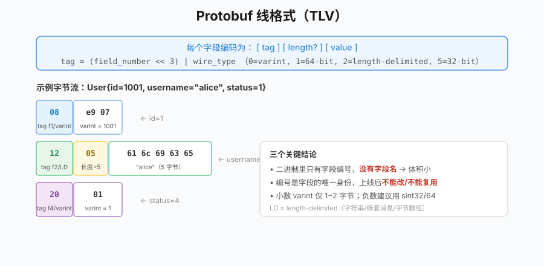
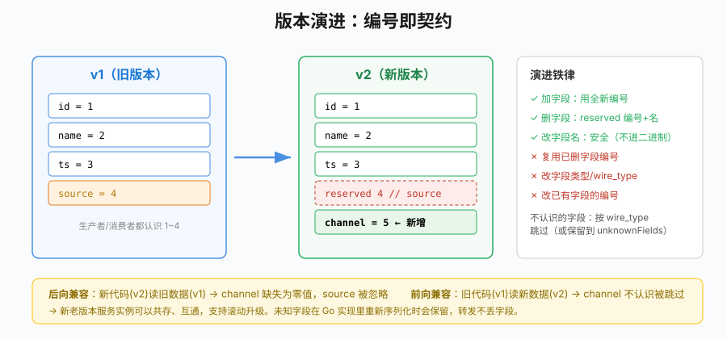

# 第26章 Protocol Buffers

## 场景

上一章我们用 gRPC 跑通了服务间调用,但真正决定契约质量的是 `.proto` 文件。团队里常见这些问题:

> "订单服务改了个字段名,结果库存服务反序列化出来全是零值,排查了半天才发现字段编号被人动过。"

> "这个字段到底是 `string` 还是 `*string`?前端传空字符串和不传,后端区分不了。"

> "消息里加了个支付方式,银行卡/微信/积分同时存在,数据脏得一塌糊涂。"

这些都不是 gRPC 的问题,是 Protocol Buffers(简称 protobuf)没用对。本章解决五个问题:

1. protobuf 为什么比 JSON 小、快?
2. 字段编号、线格式是什么,为什么编号不能乱改?
3. 怎么演进契约才不破坏前后兼容?
4. oneof、optional、enum、map、Timestamp 这些高级类型怎么用?
5. 生产环境有哪些坑?

> 代码:`26-protobuf/`,三个 example 演示线格式、版本演进、高级类型。

---

## 问题

JSON 作为服务间数据交换格式的问题:

- **体积大、解析慢**:字段名每次都重复传,数字当字符串,需要词法分析
- **没有强制契约**:字段拼错、类型对不上,运行时才发现
- **演进靠约定**:加字段、删字段全靠口头沟通,没有编译器帮你检查
- **类型表达力弱**:没有枚举、没有"多选一"、区分不了"零值"和"未设置"

protobuf 用一份 `.proto` 契约解决这些:强类型、二进制编码、编译器生成多语言代码、内置兼容规则。但它有学习成本——**字段编号、兼容规则是必须理解的核心**,用错了会导致静默的数据错乱(不报错,但值全错),这比直接报错更危险。

---

## 实现

### 26.1 线格式:为什么小和快

> 代码:`26-protobuf/example1-wire/`

protobuf 消息是一串 **tag-length-value** 的紧凑二进制。每个字段编码成:

```
[tag][value]
```

其中 tag 本身是一个 varint,值为 `(字段编号 << 3) | wire_type`。wire_type 标识值的编码方式(0=varint,1=64位,2=长度分隔,5=32位)。

```go
u := &modelpb.User{Id: 1001, Username: "alice", Email: "alice@example.com", Status: 1}

pbBytes, _ := proto.Marshal(u)
jsonBytes, _ := json.Marshal(map[string]any{...})

fmt.Printf("protobuf: %d 字节  %x\n", len(pbBytes), pbBytes)
fmt.Printf("JSON:     %d 字节  %s\n", len(jsonBytes), jsonBytes)
```

输出:

```
protobuf: 31 字节  08e9071205616c6963651a11...2001
JSON:     69 字节  {"email":"alice@example.com","id":1001,...}
体积比:   protobuf 约为 JSON 的 45%
```

逐字节拆解完整的 31 字节流(`08 e9 07 | 12 05 616c696365 | 1a 11 616c696365406578616d706c652e636f6d | 20 01`):

**字段 1 `id = 1001`**(varint)

```
08 e9 07
```

- `08` = `0b00001000`:低 3 位 `000` 是 wire_type=0(varint),高位 `00001` 是字段编号 1
- `e9 07` 是 varint。每个字节最高位(MSB)表示"是否还有后续字节",取低 7 位拼接:
  - `e9` = `1110 1001` → MSB=1,数据位 `110 1001`
  - `07` = `0000 0111` → MSB=0(结束),数据位 `000 0111`
  - 小端序拼接:`000 0111` ++ `110 1001` = `0b1111101001` = **1001**

**字段 2 `username = "alice"`**(length-delimited)

```
12 05 61 6c 69 63 65
```

- `12` = `0b00010010`:wire_type=2(长度分隔),字段编号 2
- `05` = 长度 5
- 后 5 字节 `61 6c 69 63 65` 即 ASCII `"alice"`

**字段 3 `email = "alice@example.com"`**(length-delimited)

```
1a 11 61 6c 69 63 65 40 65 78 61 6d 70 6c 65 2e 63 6f 6d
```

- `1a` = `0b00011010`:wire_type=2,字段编号 3
- `11` = 十进制 17,即字符串长度(17 个 ASCII 字符)
- 后 17 字节是 `"alice@example.com"`

**字段 4 `status = 1`**(varint)

```
20 01
```

- `20` = `0b00100000`:wire_type=0,字段编号 4
- `01` = varint 值 1

**为什么字段名不出现?** 因为二进制里只存字段编号(1、2、3、4),字段名只在生成的代码和 JSON 映射里用。这也是为什么**编号一旦上线就不能改**——它是字段在数据里的唯一身份。

整数用 varint 变长编码:小数字(如 1、1001)只占 1-2 字节,大数字才占更多。`int32 status=1` 的值 1 只编码为 `01` 一个字节。

> 注意:wire_type 的选择决定了编码。`int32`/`int64` 是 varint,负数会被当无符号 64 位处理(占 10 字节),所以**可能为负的整数字段推荐用 `sint32`/`sint64`**(ZigZag 编码,负数也紧凑)。



> **图解**：每个字段先编码 tag，再按 wire type 编码值；tag 同时携带字段编号和 wire type。线上数据依赖字段编号而非字段名，所以已发布字段不能随意改号。

### 26.2 版本演进与兼容性

> 代码:`26-protobuf/example2-evolution/`(含 `proto/evolve/v1` 和 `v2` 两个版本)

protobuf 的兼容能力来自一个简单规则:**解析时按字段编号匹配,不认识的编号要么忽略要么保留,认识的编号缺失就用零值**。

看一个真实演进。v1 的事件契约:

```proto
// v1
message Event {
  string id = 1;
  string name = 2;
  int64 ts = 3;
  string source = 4;
}
```

业务要把 `source` 升级成 `channel`,于是有了 v2:

```proto
// v2
message Event {
  string id = 1;
  string name = 2;
  int64 ts = 3;
  reserved 4;          // 废弃的编号 4 永远占住
  reserved "source";   // 废弃的字段名也占住
  string channel = 5;  // 新字段必须用新编号
}
```

三句关键的话:

1. **新字段只能用新编号**。`channel` 用 5,绝不能复用 4。
2. **删字段要 `reserved`**。把编号和名字都 reserve,防止以后有人不小心又用 4 定义别的字段——那样旧数据里的 `source` 值会被错误地解析进新字段。
3. **旧字段的编号永远不能换类型**。编号 4 从 `string` 改成 `int32`,线格式会冲突。要改类型就用新编号。

example2 用两个**不同的 Go 类型**(v1、v2)互转同一段字节,验证双向兼容:

```go
// A) v1 生产者 -> v2 消费者（后向兼容：新代码读旧数据）
wire, _ := proto.Marshal(&v1.Event{Id: "evt-1", Name: "user.signup", Source: "web"})
var got v2.Event
proto.Unmarshal(wire, &got)
// got.Channel == ""（新字段缺失，零值）；source 的数据被忽略

// B) v2 生产者 -> v1 消费者（前向兼容：旧代码读新数据）
wire2, _ := proto.Marshal(&v2.Event{Id: "evt-2", Channel: "app"})
var got2 v1.Event
proto.Unmarshal(wire2, &got2)
// got2.Source == ""（v1 不认识 channel，忽略）；它认识的字段照常读到
```

```
A) v1->v2: id=evt-1 name=user.signup channel=""
   source 字段编号在 v2 被 reserved，数据被安全忽略
B) v2->v1: id=evt-2 name=order.paid source=""
   channel 是 v1 不认识的字段，被静默忽略
```

**前向兼容(旧代码读新数据)能成立的前提**:旧客户端不认识的字段,Go 实现会把它放进 `unknownFields` 并在重新 Marshal 时保留(example2 场景 C 验证了这点),不会因为多了字段就报错。这让**滚动升级**成为可能:新老版本服务实例可以共存、互通。



> **图解**：新增字段分配新编号，删除字段把编号标记为 `reserved`，旧消费者忽略未知字段。保持编号不变，才能让新旧版本按同一份二进制契约通信。

兼容/破坏性变更速查:

| 变更 | 兼容? | 说明 |
|---|---|---|
| 加新字段(新编号) | ✅ | 旧客户端读到零值 |
| 删字段 + `reserved` | ✅ | 编号被占住,不会被复用 |
| 改字段名 | ✅ | 名字不进二进制,只影响代码 |
| 加 `optional` 到已有字段 | ⚠️ | 基本兼容,但区分"未设置"的语义变了 |
| 复用已删字段的编号 | ❌ | 旧数据会被错误解析 |
| 改字段类型(wire_type 变了) | ❌ | 解析错乱或报错 |
| 改字段编号 | ❌ | 等同删旧加新但没 reserve |
| 改 oneof 字段 | ⚠️ | 见 26.3,要谨慎 |

### 26.3 高级类型

> 代码:`26-protobuf/example3-onetof/`、`proto/advanced/payment.proto`

#### 26.3.1 oneof:表达"多选一"

支付方式只能是银行卡、微信、积分中的**一种**,如果用三个独立可选字段,代码里就要手动保证互斥,容易出脏数据。`oneof` 让编译器保证同一时刻只有一个被设置:

```proto
oneof method {
  Card pay_card = 5;
  WeChat pay_wechat = 6;
  Points pay_points = 7;
}
```

生成的 Go 代码里,`Method` 是一个接口,赋值会自动覆盖之前的值:

```go
p := &advpb.Payment{
    Method: &advpb.Payment_PayCard{PayCard: &advpb.Payment_Card{Last4: "4242", Brand: "visa"}},
}
describe(p) // card: visa/4242

// 换成积分支付，card 自动被清空
p.Method = &advpb.Payment_PayPoints{PayPoints: &advpb.Payment_Points{PointsUsed: 500}}
describe(p) // points used: 500

func describe(p *advpb.Payment) {
    switch m := p.Method.(type) {
    case *advpb.Payment_PayCard:
        // ...
    case *advpb.Payment_PayWechat:
        // ...
    }
}
```

> 注意命名:oneof 字段名不要和内部消息名重名,否则生成的 Go 类型会出现 `Payment_Card`(消息)和 `Payment_Card_`(oneof 包装器)撞名。本例用 `pay_card`/`pay_wechat` 避开,生成 `Payment_PayCard` 这样清晰的包装类型。

#### 26.3.2 optional:区分"没传"和"传了零值"

proto3 标量字段默认没有 presence(存在性):一个 `string` 字段读出来是 `""`,你无法知道是对方没传还是传了空串。加 `optional` 后生成指针类型:

```proto
optional string remark = 8;
```

```go
empty := &advpb.Payment{OrderId: "NO-002"}
fmt.Println(empty.Remark != nil) // false——没传

empty.Remark = strPtr("")
fmt.Println(empty.Remark != nil, *empty.Remark) // true ""——显式传了空串
```

**什么时候用 optional**:更新接口里需要区分"不修改这个字段"和"把这个字段清空"时。普通查询/展示字段不需要,别滥用(指针会让代码变啰嗦)。

#### 26.3.3 enum:枚举零值必须是"未指定"

```proto
enum Status {
  STATUS_UNSPECIFIED = 0; // 零值，不能是业务状态
  STATUS_PAID = 1;
  STATUS_REFUNDED = 2;
}
```

proto3 枚举零值必须是 0,而且约定是 `XXX_UNSPECIFIED`。原因:新字段缺省时读到零值,如果零值是个真实业务状态(比如 `STATUS_PAID=0`),缺省数据会被误判成"已支付",这是严重 bug。让零值表示"没设置",业务代码强制显式判断。

#### 26.3.4 其他常用类型

```proto
import "google/protobuf/timestamp.proto";

google.protobuf.Timestamp paid_at = 3;  // 时间，别用 int64 存时间戳
map<string, string> metadata = 9;       // map，value 不能是另一个 map
```

- 时间一律用 `google.protobuf.Timestamp`,Go 侧是 `timestamppb.New(t)` / `ts.AsTime()`,不要用裸 `int64` 时间戳(时区、单位全靠约定)
- `map<K,V>` 适合天然键值对的扩展字段;但如果需要有序、需要保留未知字段、或 value 是复杂结构,用 `repeated` 自定义键值消息更可控
- 金额用 `int64`(分)或字符串,**绝不用 float/double**

---

## 原理

### 26.4.1 为什么编号是核心

protobuf 的编码里**没有字段名,只有编号**。这带来两个结果:

1. **体积小**:不用重复传 `"username"` 这 8 个字符,只传编号 2
2. **编号即契约**:解析器看到编号 2、wire_type 2,就知道该按字符串读;编号对不上类型就读错

所以编号的稳定性比字段名重要得多。改字段名是安全的(生成的代码方法名变了,但线格式不变);改编号是灾难。

编号范围:

- `1 ~ 15`:单字节 tag,留给**高频、常驻**的字段(如 id、status)
- `16 ~ 2047`:两字节 tag,普通字段
- `19000 ~ 19999`:protobuf 保留,不能用
- 编号一旦在生产数据里出现,就永久属于那个语义

### 26.4.2 兼容的底层机制

兼容不是魔法,就三条规则在起作用:

1. **按编号匹配**:解析器遍历二进制里的每个字段,编号在当前 message 里有定义、wire_type 对得上就读,否则跳过
2. **跳过未知字段**:不认识的编号,根据 wire_type 知道它占多长,直接跳过(offset 前进),不会报错
3. **缺失字段用零值**:消息里没有某个编号,生成的字段就是零值(0/""/false/nil)

Go 实现还会把未知字段存在 `unknownFields` 里,重新 Marshal 时原样写回。这保证了"v1 读 v2 数据、再转发出去"时新字段不丢——对中间代理(网关、service mesh)特别重要。

### 26.4.3 proto2 vs proto3

本书用 proto3,简单说区别:

- proto3 取消了 `required`/`optional`(后期又加回了 `optional`),字段默认无 presence
- proto3 枚举零值强制是第一个枚举值
- proto3 移除了字段默认值自定义、groups 等老特性
- proto2 仍在维护,但新项目一律 proto3

不需要纠结,新代码用 proto3,需要显式 presence 就用 `optional` 或包装类型(`google.protobuf.StringValue` 等)。

---

## 最佳实践

### 26.5.1 契约组织

- **一个 service / 一个领域一个 `.proto` 文件**,不要把所有消息塞一个大文件
- 包名带版本:`package order.v1;`,为未来不兼容大版本留空间(虽然大多时候用字段演进就够了)
- `option go_package` 一定写,格式 `"导入路径;包名"`,包名建议带 `pb` 后缀避免和业务包重名
- **生成的代码提交到仓库**,CI 里检查 diff;不要每次构建都重新生成(需要装 protoc 和插件,构建环境不一致)
- 注释写在字段上,它就是契约文档;用 `//` 而不是 `/* */`

### 26.5.2 演进纪律

- 删字段:同时 `reserved 编号;` 和 `reserved "名字";`
- 加字段:用没用过的最小编号,别跳号、别图吉利跳大编号
- 需要"彻底重构字段语义"时,宁可新开一个 message(如 `EventV2`)或新 package,不要在原 message 上硬改类型
- 上线前在 CI 跑 [buf breaking](https://buf.dev/product) 这类工具,自动检测破坏性变更(比 code review 可靠)
- 枚举新增值是兼容的,但要确认消费者有 default 分支处理未知值

### 26.5.3 字段类型选择

- 金额:`int64`(分)或 `string`,不要 float
- 时间:`google.protobuf.Timestamp`
- 经纬度:不要用两个 float 传,用嵌套 message 或明确单位
- 可能为负的整数:`sint32`/`sint64`(负数 varint 编码省空间)
- 大整数:超过 2^53 的 ID 不要让它转 JSON 给前端(JS number 精度丢失),用 string
- 列表用 `repeated`,天然键值对用 `map`,需要互斥用 `oneof`,需要 presence 用 `optional`

### 26.5.4 不要把 protobuf 当万能序列化

- protobuf 不是自描述的:没有 `.proto` 就看不懂二进制,调试不如 JSON 直观。日志、CLI 输出考虑用 `prototext` 或 `protojson`
- 不适合给浏览器直接用:走 gRPC-Web 或在网关转 JSON
- 不要为了省那点体积在业务代码里手写二进制,用生成的代码

---

## 排障

### 26.6.1 反序列化后字段全是零值

最常见的原因:

1. **字段编号对不上**:客户端和服务端用了不同版本的 `.proto`,同一个编号在两边是不同字段。检查双方 `protoc` 生成的代码是否来自同一份 proto
2. **JSON 字段名用错**:用 `protojson` 而不是标准 `encoding/json`(后者用 Go 结构体字段名,protobuf 的 JSON 名是 snake_case)
3. **用了 `proto3` 但期望 presence**:标量字段读零值不代表对方传了,需要 `optional`

### 26.6.2 `cannot parse invalid wire-format data`

通常是数据本身被破坏或拿错了 buffer:

- 把一个 protobuf 消息的字节当另一个消息解析(类型/版本错配)
- 字节在传输中被截断(HTTP 分帧问题、缓冲区没读全)
- 手动拼接字节出错。用 `proto.Marshal` 生成,不要手拼

### 26.6.3 枚举收到了未知数值

新版本加了枚举值,旧客户端不认识。这是兼容的,旧客户端会保留原始数值。**消费者必须有 default 分支**,不要假设枚举值只在你知道的范围内。

### 26.6.4 oneof 字段莫名其妙被清空

oneof 是互斥的,后赋值的会覆盖前面的。如果你想同时表达多个支付方式组合,那就不该用 oneof——用重复消息或独立字段。

### 26.6.5 "改了字段名后调用方报错"

字段名不影响线格式,但会影响**生成代码的方法名/类型名**。如果调用方是从同一份 proto 重新生成代码的,改字段名会导致编译错误(这是好事,逼你改引用)。要避免:字段名谨慎取,真要改就配合大版本升级。

---

## 面试题

**Q1:protobuf 为什么比 JSON 体积小?**

A:字段用编号(1-15 单字节)代替字段名,不重复传名字;整数用 varint 变长编码,小数字只占 1-2 字节;数字按二进制存而非字符串;整体是 TLV 二进制结构,没有 JSON 的引号、括号。

**Q2:为什么 protobuf 的字段编号上线后不能改?**

A:编号是字段在二进制里的唯一身份,字段名不进数据。改编号等于让旧数据的某个编号在新 schema 里指向完全不同的字段,反序列化会静默错乱。删字段必须 `reserved` 编号,防止被复用。

**Q3:protobuf 怎么做到前后兼容的?**

A:解析时按编号匹配:认识的字段读取,不认识的根据 wire_type 跳过(或保留到 unknownFields),缺失的字段用零值。因此加字段(新编号)前向/后向都兼容;前提是编号不复用、类型不擅自改。

**Q4:oneof 解决什么问题?和多个 optional 字段有什么区别?**

A:oneof 在协议层保证"多个字段同一时刻只有一个被设置",编译器强制互斥,生成的是接口类型需要 type switch。多个 optional 字段可以同时存在,要靠业务代码保证互斥,容易出脏数据。

**Q5:proto3 里怎么区分"字段没传"和"传了零值"?**

A:给字段加 `optional`,生成指针类型(如 `*string`),`nil` 表示没传,非 nil 表示传了(哪怕是空串)。普通标量字段没有 presence,读不到就只能拿到零值。枚举零值同理,所以约定零值是 `XXX_UNSPECIFIED`。

**Q6:sint32 和 int32 有什么区别?**

A:都用 varint 编码,但 int32 把负数当无符号 64 位处理(固定占 10 字节),sint32 用 ZigZag 编码把负数映射成小的正整数(如 -1→1、1→2),负数也只占少量字节。可能为负的字段用 sint。

---

## 小结

本章从 gRPC 契约的实际痛点出发,讲清了 Protocol Buffers 的核心:

1. **线格式**:tag-length-value、字段编号、varint,这是理解一切的基础
2. **版本演进**:加字段用新编号、删字段要 reserved、类型编号不能乱改,兼容靠"按编号匹配 + 跳过未知 + 零值"
3. **高级类型**:oneof 表达互斥、optional 表达存在性、enum 零值约定、Timestamp/map 的正确用法
4. **原理**:编号为什么是核心、兼容机制怎么实现
5. **最佳实践与排障**:契约组织、演进纪律、类型选择、常见故障

**核心原则:**

> 在 protobuf 里,**字段编号比字段名重要得多**。把 `.proto` 当成团队间的正式契约管理:加字段用新编号、删字段必 reserved、破坏性变更走新版本,用 buf 这类工具在 CI 卡死。类型选对(oneof/optional/enum/Timestamp),数据质量问题会少一大半。

下一章我们把 gRPC 服务真正"注册"起来,讲服务注册发现。

---

## 参考资料

> 本章基于 **Go 1.25**、**google.golang.org/protobuf v1.36.11**、`protoc` libprotoc 28,syntax proto3。生成代码和 API 以对应版本官方文档为准。

- Protocol Buffers 官方指南(proto3):https://protobuf.dev/programming-guides/proto3/
- 编码原理(Encoding):https://protobuf.dev/programming-guides/encoding/
- 版本兼容规则:https://protobuf.dev/programming-guides/proto3/#updating
- Buf:Protobuf 的 lint / 破坏性检查工具:https://buf.dev/docs/
- Go 生成代码参考:https://protobuf.dev/reference/go/go-generated/
- google 标准类型(Timestamp 等):https://protobuf.dev/reference/protobuf/google.protobuf/
