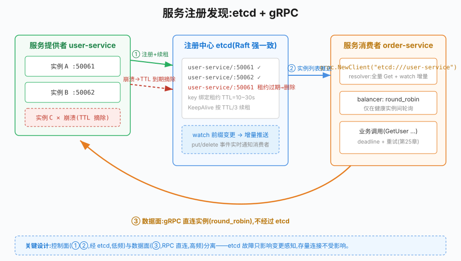

# 第27章 服务注册发现

## 场景

上一章的 gRPC 客户端是这样调用的:

```go
conn, _ := grpc.NewClient("localhost:50051", ...)
```

地址写死在配置里。服务一上 K8s、一做多实例,问题就来了:

> "user-service 扩容到 5 个实例,每个 Pod IP 都不一样,订单服务的配置文件改了又改。"

> "某个实例半夜 OOM 挂了,第二天才发现——订单服务还在往那个 IP 发请求,超时重试把 P99 拉高了 200ms。"

> "滚动升级时新旧实例交替,客户端拿着旧连接一直报 Unavailable。"

这些问题的共同根因:**调用方不知道"现在有哪些健康的实例"**。这就是服务注册发现要解决的问题。

本章解决五个问题:

1. 服务注册发现的本质是什么?
2. 怎么用 etcd 实现注册 + 心跳 + 自动摘除?
3. 发现端怎么动态感知实例上下线?
4. gRPC 怎么和注册中心集成,实现负载均衡?
5. 生产环境有哪些坑(脑裂、雪崩、TTL 调优)?

> 代码:`27-servicediscovery/`,三个可运行 example,基于 etcd v3.5+ 与 `go.etcd.io/etcd/client/v3` v3.6。
>
> ```bash
> docker run -d --name go-book-etcd -p 2379:2379 \
>   quay.io/coreos/etcd:v3.5.16 etcd \
>   --advertise-client-urls http://0.0.0.0:2379 --listen-client-urls http://0.0.0.0:2379
> ```

---

## 问题

硬编码实例地址的痛点:

- **扩缩容要改配置**:实例列表是静态的,弹性伸缩时人工介入
- **故障感知滞后**:实例挂了,调用方还往死 IP 发请求,直到有人手动摘除
- **发布窗口不可用**:滚动升级期间,新旧实例交替,静态配置无法跟随

业界标准解法是**注册中心**(registry),它提供三个原语:

1. **注册(register)**:服务启动时上报"我叫 user-service,我的地址是 10.0.0.1:8080"
2. **健康检查(health check)**:持续证明自己活着;失联后被自动摘除
3. **发现(discover)**:调用方按名字查询当前健康实例列表,并能感知变化

常见选型:

| 系统 | 一致性 | 特点 | 适用 |
|---|---|---|---|
| **etcd** | Raft 强一致 | KV + watch + 租约,K8s 的事实基础 | 中小规模、云原生栈 |
| Consul | Raft | 多数据中心、DNS 接口 | 混合基础设施 |
| Nacos | AP/CP 可切 | 配置中心+注册一体、阿里系 | Java 生态混合团队 |
| Kubernetes Service | 内置 | 集群内天然服务发现 | 纯 K8s 环境 |

本书选 **etcd**:Go 原生、与 gRPC 有官方 resolver 集成、K8s 底层同款,学一套通两边。

---

## 实现

### 27.1 注册:租约 + 保活 + 自动摘除

> 代码:`27-servicediscovery/example1-register/`、`registry/registry.go`

etcd 没有内置"心跳",但提供了更优雅的原语:**租约(lease)**。

- 创建租约时指定 TTL(如 5 秒)
- 把 key 绑定到租约:租约活着,key 就在;租约到期,key 被 etcd **自动删除**
- `KeepAlive` API 让客户端自动续租(约每 TTL/3 一次)

于是"健康检查 = 进程活着并续租"。进程崩溃 → 没人续租 → TTL 到期 → key 自动消失 → 调用方自然摘除,**不需要任何人写"下线"逻辑**。

```go
func Register(ctx context.Context, client *clientv3.Client,
    info ServiceInfo, ttl int64) (*Registrar, error) {

	// 1. 创建租约(TTL 秒)
	grant, err := client.Grant(ctx, ttl)
	if err != nil {
		return nil, fmt.Errorf("创建租约: %w", err)
	}

	// 2. 用官方 endpoints.Manager 写入:key = <name>/<addr>,与官方 gRPC resolver 兼容
	em, err := endpoints.NewManager(client, info.Name)
	if err != nil {
		return nil, err
	}
	key := fmt.Sprintf("%s/%s", info.Name, info.Addr)
	err = em.AddEndpoint(ctx, key, endpoints.Endpoint{Addr: info.Addr},
		clientv3.WithLease(grant.ID)) // 绑定租约:key 生命周期 = 租约生命周期
	if err != nil {
		return nil, fmt.Errorf("写入注册信息: %w", err)
	}

	// 3. 启动自动续租;必须消费返回的 channel,续租才会持续
	keepCh, err := client.KeepAlive(ctx, grant.ID)
	if err != nil {
		return nil, fmt.Errorf("启动续租: %w", err)
	}
	go func() {
		for range keepCh {
		}
	}()

	return &Registrar{client: client, em: em, key: key, leaseID: grant.ID}, nil
}

// Deregister 优雅下线:删 endpoint 并撤销租约,不等 TTL 自然过期
func (r *Registrar) Deregister(ctx context.Context) error {
	if err := r.em.DeleteEndpoint(ctx, r.key); err != nil {
		return err
	}
	_, err := r.client.Revoke(ctx, r.leaseID)
	return err
}
```

两种下线方式对应两种场景:

- **优雅停机**:发 SIGTERM 后先从网关注册中心 `Deregister`(流量立即停止进入),再退出进程
- **进程崩溃**:来不及执行任何代码,靠租约 TTL 兜底,TTL 秒后自动摘除

example1 验证完整生命周期:

```bash
$ go run ./example1-register -role=register   # 注册,2 秒后主动下线
$ go run ./example1-register -role=list       # 已看不到

$ go run ./example1-register -role=crash      # 注册后立刻 panic
$ go run ./example1-register -role=list       # 崩溃后立刻查:还在(TTL 未到)
$ sleep 6 && go run ./example1-register -role=list   # 6 秒后:被自动摘除
```

### 27.2 发现:watch 动态感知上下线

> 代码:`27-servicediscovery/example2-watch/`、`registry/watcher.go`

只拉一次列表是不够的——实例随时可能上下线。etcd 的 **watch** 让你订阅前缀下的所有变更,增量推送,不用轮询。

```go
// NewWatcher:立即拉一次全量,之后 watch 前缀感知增量变化
func NewWatcher(ctx context.Context, client *clientv3.Client, name string) (*Watcher, error) {
	w := &Watcher{name: name, client: client, ch: make(chan struct{}, 1)}
	if err := w.refresh(ctx); err != nil { // 全量:Get <name>/ WithPrefix
		return nil, err
	}
	go w.loop()
	return w, nil
}

func (w *Watcher) loop() {
	for {
		ctx := context.Background()
		resp, err := w.client.Get(ctx, w.name+"/", clientv3.WithPrefix())
		if err != nil {
			time.Sleep(time.Second)
			continue
		}
		_ = w.refresh(ctx)
		w.notify()

		// 从当前 revision + 1 起 watch,不漏事件也不重复
		dch := w.client.Watch(ctx, w.name+"/",
			clientv3.WithPrefix(),
			clientv3.WithRev(resp.Header.Revision+1))
		for range dch { // 任何 put/delete 都触发;channel 关闭则重连重建
			_ = w.refresh(ctx)
			w.notify()
		}
	}
}
```

两个细节值得注意:

- **Get 后从 `Header.Revision+1` 开始 watch**:全量快照和增量流无缝衔接,既不漏掉 watch 建立前的变更,也不重复处理已有的
- **通知合并(debounce)**:批量上下线会触发连续事件,`notify` 用带缓冲 channel + 非阻塞发送把风暴合并成一次,消费方只需重新拉取列表

example2 的效果(两个终端):

```bash
$ go run ./example2-watch -role=watch
[14:08:38] 检测到变化 实例(1):[10.0.1.1:9090]   # 另一个终端注册了
[14:08:40] 检测到变化 实例(0):[]                  # Ctrl+C 下线,Deregister 生效
```

### 27.3 gRPC 集成:etcd resolver + round_robin

> 代码:`27-servicediscovery/example3-grpc-resolver/`

上面两节的 registry/watcher 是理解原理用的"手写版"。生产中 gRPC 有官方集成:`go.etcd.io/etcd/client/v3/naming/resolver` 提供了标准的 gRPC resolver.Builder,配合 gRPC 内置的 round_robin 策略,客户端只需写一个服务名。

```go
cli, _ := clientv3.New(clientv3.Config{Endpoints: []string{"localhost:2379"}})

// 构造 etcd resolver,scheme 为 "etcd"
builder, _ := etcdresolver.NewBuilder(cli)

// 目标地址不再是 host:port,而是 etcd:///<服务名>
conn, err := grpc.NewClient(
	"etcd:///user-service",
	grpc.WithResolvers(builder),
	grpc.WithTransportCredentials(insecure.NewCredentials()),
	// 启用 round_robin:在解析出的多个实例间轮询
	grpc.WithDefaultServiceConfig(`{"loadBalancingConfig":[{"round_robin":{}}]}`),
)
```

注意一个**关键兼容点**(也是最容易踩的坑):官方 resolver 监听的 key 前缀是 `<服务名>/<addr>`(没有前导 `/services/`),value 是它的 JSON 格式。所以**注册端必须也用官方的 `endpoints.Manager` 写入**(27.1 已经这么做了)。如果自己发明 key 布局,resolver 会永远解析出空列表,表现为所有请求 `DeadlineExceeded`——而且没有任何显式报错指向根因。

example3 端到端验证(三个终端):

```bash
$ go run ./example3-grpc-resolver -role=server -addr=:50061
$ go run ./example3-grpc-resolver -role=server -addr=:50062
$ go run ./example3-grpc-resolver -role=client
第 1 次调用 -> 用户=alice(实例 localhost:50062)
第 2 次调用 -> 用户=alice(实例 localhost:50061)
第 3 次调用 -> 用户=alice(实例 localhost:50062)   # round_robin 在轮询
...
```

kill 掉实例 :50061,等租约 TTL 到期后再次调用:

```bash
第 3 次调用 -> 用户=alice(实例 localhost:50062)   # 流量全部落到存活实例
第 4 次调用 -> 用户=alice(实例 localhost:50062)
```

全程无需改任何配置、无需重启客户端——这就是注册发现的核心价值。

---

## 原理

### 27.4.1 注册发现的完整链路



> **图解**：提供者向 etcd 注册并续约，消费者通过 resolver/watch 更新可用地址，再由 gRPC 在健康实例间选路。etcd 负责控制面发现，实际 RPC 数据流不经过 etcd。

一次完整的调用经过四个角色:

1. **服务提供者**启动时把 `<名字, 地址>` 写入注册中心,并维持租约
2. **注册中心(etcd)**存储实例列表;租约到期自动删除失联实例
3. **服务消费者**通过 resolver 拉取列表并 watch 变更
4. **负载均衡器**(gRPC 内置)在多个健康实例间分发请求

关键设计:**控制面和数据面分离**。注册中心只在"实例列表变化时"介入(控制面),日常的每一次 RPC 都由客户端直连服务实例(数据面),不经过注册中心——所以 etcd 挂了,存量连接照常工作,只是无法感知新的上下线。这是它和传统"经 LB 转发每个请求"模式的本质区别。

### 27.4.2 租约与 KeepAlive 的实现

etcd 租约是服务端对象:`Grant(ttl)` 创建后,服务端开始倒计时;`Revoke` 提前销毁;TTL 到期自动销毁并**级联删除所有绑定的 key**。

`KeepAlive` 客户端行为:

- 每 TTL/3(默认)发送一次续租(`LeaseKeepAlive` RPC)
- 续租响应里带新 TTL,循环往复
- 连接断开自动重试;ctx 取消则停止续租,剩余 TTL 自然过期

为什么用 TTL/3 的频率?续租失败有两次重试机会才到 TTL,容忍单次网络抖动。反过来,**TTL 不要设太短**:网络闪断 + 几次续租失败的组合可能误杀健康实例(见排障 27.6.3)。

### 27.4.3 gRPC resolver API

gRPC 把"服务名 → 地址列表"抽象成 resolver 接口:

```
grpc.NewClient("etcd:///user-service")
        │ 解析 target:scheme=etcd, endpoint=user-service
        ▼
resolver.Builder(etcd).Build()          ← etcd naming/resolver 提供
        │ Get user-service/ 全量 + watch 增量
        ▼
cc.UpdateState(Endpoints: [...])         ← 推给 gRPC 内核
        │
        ▼
loadBalancingPolicy(round_robin)
        │ 在 endpoints 间轮询
        ▼
建立/复用 subConnection → 发送 RPC
```

理解这个链路的意义:

- **换注册中心 = 换 Builder**:Consul/Nacos 都有对应实现,业务代码里的 `etcd:///<name>` 改个 scheme 即可
- **watch 是增量的**:实例列表变化不会触发全量重连,gRPC 只对变化的地址建/断 subConnection
- **round_robin 只是策略之一**:还有 pick_first(默认)、地址权重、一致性哈希(需第三方 balancer)

### 27.4.4 为什么不用 DNS

DNS 也能做服务发现(K8s Service 就是),但有两个局限:记录有缓存 TTL,摘除不及时;只有 A 记录,没有元数据和主动通知。etcd 这类方案用 watch 补上了实时性,用 KV 补上了元数据。两者不是对立——K8s 集群内直接用 Service/DNS 就够了,跨集群或需要细粒度流量管理时才需要独立注册中心。

---

## 最佳实践

### 27.5.1 TTL 与优雅停机

```go
sig := make(chan os.Signal, 1)
signal.Notify(sig, syscall.SIGINT, syscall.SIGTERM)
<-sig // 等待停止信号

// 先从注册中心下线(流量立即停),再做清理
dctx, cancel := context.WithTimeout(context.Background(), 2*time.Second)
defer cancel()
_ = reg.Deregister(dctx)

// 然后处理存量请求、关闭连接、退出
srv.GracefulStop()
```

- **先 Deregister 再 GracefulStop**:让 LB/watcher 尽早摘除你,减少打到临终实例的请求
- TTL 建议 **10~30 秒**:太短容易误杀(网络抖动),太长故障感知慢。K8s 环境配合 readinessProbe 可以更短
- 崩溃兜底靠 TTL,优雅路径靠 Deregister,**两条腿都要有**

### 27.5.2 注册信息设计

- key 用 `<service>/<addr>`,与官方工具链兼容;不要发明私有前缀(27.3 的坑)
- value 里可以放元数据(版本号、可用区、权重),但**别放大对象**——etcd 默认单值上限 1.5MB,且大 value 会拖慢 watch 广播。放实例 IP、版本号足够了
- 服务名用小写加连字符(`user-service`),和 K8s Service 命名对齐

### 27.5.3 客户端容错

- **不要只依赖 watch 推送**:watch 断连期间上下线会丢事件,定期全量刷新(如每 30 秒)做兜底
- 对 `Unavailable` 的实例,gRPC 会自动标记并绕开(pick_first/round_robin 都有此逻辑),但应用层仍要设 deadline + 重试(第25章)
- 多机房部署时,优先同可用区实例:可以在 resolver/balancer 层按 metadata 过滤,避免跨机房流量

### 27.5.4 注册中心自身的高可用

- etcd 集群部署 3 或 5 节点(Raft 多数派),挂掉少数节点不影响读写
- 客户端配置多个 Endpoints,clientv3 自动故障转移
- 记住 27.4.1 的结论:etcd 全挂只影响"变更感知",存量连接不受影响——所以它挂了不要慌,先恢复集群,而不是重启所有服务

---

## 排障

### 27.6.1 resolver 解析出空列表,全部 DeadlineExceeded

最常见根因:**注册端 key 布局和 resolver 期望不一致**(见 27.3)。排查步骤:

```bash
# 1. 看 key 是否存在、前缀对不对(resolver 监听 <name>/ 无前导斜杠)
etcdctl get user-service --prefix

# 2. 看 value 是否为官方 JSON 格式(含 "Addr" 字段)
etcdctl get user-service/localhost:50061
# {"Op":0,"Addr":"localhost:50061","Metadata":null}
```

如果 key 在 `/services/user-service/...` 而 resolver 找 `user-service/`,永远匹配不上。

### 27.6.2 实例明明活着,却被频繁摘除又重新出现

"注册→摘除→再注册"循环,通常是**续租失败**:

- 网络抖动/防火墙切断长连接,KeepAlive 重试期间 TTL 到期
- 进程 CPU 打满或 GC 卡死,KeepAlive goroutine 得不到调度
- TTL 设得太短(如 2s),一次抖动就够误杀

解决:加大 TTL、检查进程负载、确认客户端到 etcd 的网络质量。KeepAlive 日志里有 `keep alive loop` 相关 warning 可作为证据。

### 27.6.3 崩溃的实例迟迟不被摘除

- TTL 设置过大(如 300s):故障感知要等整个 TTL 过期
- 进程没死透但已不续租:检查是否僵尸进程持有连接
- etcd 集群本身异常:看 `etcdctl endpoint health`

### 27.6.4 watch 收不到变更事件

- 确认 watch 的前缀和写入的 key 一致(前导斜杠问题同 27.6.1)
- watch 从历史 revision 开始时报 `required revision has been compacted`:etcd 定期 compaction 清理旧版本,从"当前 revision+1"开始 watch 即可(参考 watcher.go 的写法),不要硬编码一个很久以前的 revision
- 客户端与 etcd 之间有代理/LB 且空闲超时过短:watch 是长连接流,代理可能在无数据的几分钟内掐断它;调大空闲超时或靠自动重连兜底

### 27.6.5 滚动发布瞬间大量报错 Unavailable

新实例刚启动、旧实例已下线,客户端还没感知到新实例。缓解:

- 发布脚本**先等新实例 ready 并注册成功,再停旧实例**(滚动而非先删后建)
- 客户端对 Unavailable 做有限重试(带退避),覆盖几秒的窗口期
- K8s 里用 preStop hook + readinessGates 让下线动作平滑

---

## 面试题

**Q1:服务注册发现解决什么问题?核心三原语是什么?**

A:解决动态环境下"调用方如何知道有哪些健康实例"。三原语:注册(上报名字和地址)、健康检查(证明存活,失联自动摘除)、发现(按名查询并可订阅变化)。没有它,扩缩容和故障摘除都要人工介入。

**Q2:etcd 没有"心跳",它是怎么做健康检查的?**

A:用租约(lease)。key 绑定一个带 TTL 的租约,客户端 KeepAlive 自动续租;进程崩溃后续租停止,TTL 到期 etcd 级联删除绑定 key。优雅停机则主动 Revoke 租约立即下线。

**Q3:gRPC 怎么和注册中心集成?**

A:实现标准的 resolver.Builder:Build 时拉取全量地址并通过 ClientConn.UpdateState 上报,同时 watch 变更增量更新。客户端在 NewClient 时传入 builder,target 写成 `scheme:///服务名`,配合 round_robin 等 balancer 在多实例间负载均衡。etcd 官方提供了现成的 naming/resolver。

**Q4:注册中心挂了,正在运行的服务会受什么影响?**

A:控制面和数据面分离——存量连接完全不受影响,RPC 不经过注册中心;影响的是"变更感知":新实例上不了线、故障实例摘不掉、新建连接拿不到地址列表。所以要尽快恢复注册中心,而不是重启业务服务。这也解释了为什么客户端要做本地快照/缓存兜底。

**Q5:TTL 设多长时间合适?设短了和设长了各有什么问题?**

A:经验值 10~30 秒。太短:网络抖动或进程短暂卡顿时续租失败,健康实例被误杀(表现为反复上下线);太长:真故障的摘除时间等于整个 TTL,流量持续打向死实例。KeepAlive 按 TTL/3 续租,给了两次重试容忍度。

**Q6:watch 和轮询相比有什么优势?有什么坑?**

A:优势:增量推送,实时性高,无需客户端高频轮询,etcd 侧压力小。坑:watch 是基于 revision 的长连接,要注意 compaction 导致的"revision 已压缩"错误(watch 起点要用当前 revision+1);连接可能被中间设备掐断,必须处理断连重连;断连期间的变更有丢失风险,重要场景用定期全量刷新兜底。

---

## 小结

本章从"硬编码实例地址"的痛点出发,实现了完整的服务注册发现:

1. **注册**:租约 + KeepAlive,进程崩溃 TTL 兜底自动摘除,优雅停机主动 Deregister
2. **发现**:Get 全量 + watch 增量,从当前 revision 无缝衔接,通知合并防风暴
3. **gRPC 集成**:官方 etcd resolver + round_robin,客户端只写服务名;注册端必须用官方 endpoints.Manager 的 key 布局
4. **原理**:控制面/数据面分离、resolver/balancer 抽象、租约实现机制
5. **最佳实践与排障**:TTL 调优、优雅停机顺序、key 布局兼容、误杀与摘除延迟的排查

**核心原则:**

> 注册发现的本质是把"实例拓扑"从静态配置变成动态事实。两条纪律:注册端的 key 布局跟官方工具链保持一致(否则 resolver 静默失效);下线要走"先 Deregister 再停机"的顺序,崩溃场景靠 TTL 兜底。选型上,etcd 强一致适合中小规模,K8s 集群内可直接用内置 Service,不必为了注册中心而引入注册中心。

下一章讲配置中心,把"配置"也变成可动态管理的数据。

---

## 参考资料

> 本章基于 **Go 1.25**、**go.etcd.io/etcd/client/v3 v3.6.8**、etcd server v3.5.16、**google.golang.org/grpc v1.83.0**。API 以对应版本官方文档为准。

- etcd 官方文档:https://etcd.io/docs/
- clientv3 API 参考:https://pkg.go.dev/go.etcd.io/etcd/client/v3
- 官方 gRPC resolver(naming/resolver):https://pkg.go.dev/go.etcd.io/etcd/client/v3/naming/resolver
- gRPC resolver / balancer 设计:https://github.com/grpc/grpc-go/blob/master/doc/resolution.md
- etcd 租约(lease)文档:https://etcd.io/docs/v3.5/learning/design-client/#leases-and-keep-alive
- etcd 操作手册(运维/compaction):https://etcd.io/docs/v3.5/op-guide/
