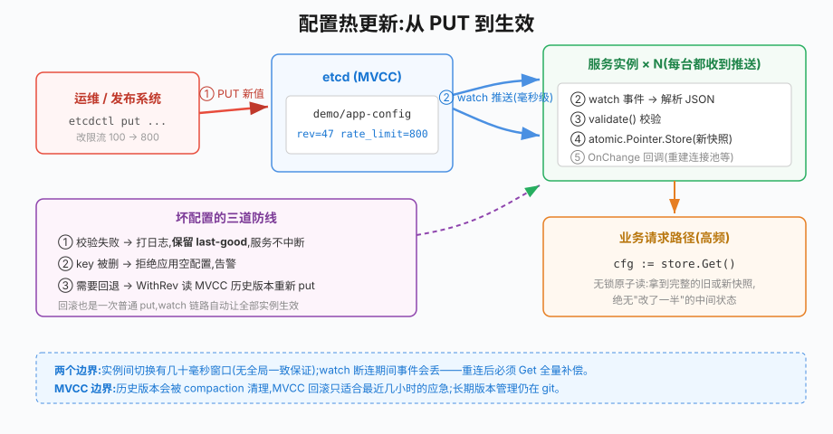

# 第28章 配置中心

## 场景

订单服务的配置散落在各处:数据库 DSN 在环境变量里,限流阈值在代码常量里,超时时间在 YAML 文件里。平时相安无事,直到:

> "大促前想把限流从 1000 调到 1500,要改配置、走发布、滚动重启 20 个 Pod,半小时没了。"

> "有人改了 YAML 里的超时忘了重启,一半实例新配置一半旧配置,排查了一下午。"

> "误把测试库 DSN 发到生产,服务起不来才发现——配置没有校验,更没有回滚。"

这三个问题分别对应配置中心的三个核心能力:**热更新、全局一致、版本化与回滚**。

本章解决五个问题:

1. 配置中心和"配置文件 + 环境变量"的本质区别是什么?
2. 配置怎么组织(key 设计、多环境)?
3. 热更新怎么实现,业务代码怎么无锁地读到最新配置?
4. 坏配置发出去怎么兜底(校验 + last-good)?
5. 改错了怎么回滚?

> 代码:`28-configcenter/`,基于 etcd(与第27章同一套基础设施)与 `go.etcd.io/etcd/client/v3` v3.6。
>
> ```bash
> docker run -d --name go-book-etcd -p 2379:2379 \
>   quay.io/coreos/etcd:v3.5.16 etcd \
>   --advertise-client-urls http://0.0.0.0:2379 --listen-client-urls http://0.0.0.0:2379
> ```

---

## 问题

传统配置管理的痛点:

- **改配置 = 重启**:配置在启动时读一次就固化,任何调整都要走发布流程
- **一致性靠运气**:多实例的配置文件可能不同步,"半新旧"状态难以察觉
- **没有校验**:一个手滑的 `-5` 或拼错的 DSN 直接进生产
- **没有历史**:改坏了想回滚,只能翻 git 记录手工恢复

按变更频率给配置分类,决定它们该住在哪里:

| 类别 | 变更频率 | 例子 | 存放 |
|---|---|---|---|
| 构建期配置 | 永不变 | 代码版本、编译参数 | 二进制本身 |
| 部署期配置 | 每次发布 | 监听端口、资源限额 | 环境变量 / 启动参数(K8s Env/ConfigMap) |
| **运行期配置** | 随时可能调 | 限流阈值、开关、超时、日志级别 | **配置中心** |

配置中心只管第三类——**需要不重启就生效的动态配置**。别把所有配置都塞进配置中心:静态配置放那里只会增加故障面(etcd 挂了连端口都读不到)。

---

## 实现

### 28.1 基础:加载与默认值兜底

> 代码:`28-configcenter/example1-basic/`、`configstore/store.go`

配置以 JSON 存在 etcd 的一个 key 里(如 `demo/app-config`)。应用启动时的加载逻辑有一个关键设计:**etcd 读不到就用本地默认值,并把它回写进 etcd**——保证 etcd 是唯一事实来源,同时应用离线也能起来。

```go
type AppConfig struct {
	DBDSN     string `json:"db_dsn"`
	RateLimit int    `json:"rate_limit"` // 每秒允许的请求数
	TimeoutMS int    `json:"timeout_ms"`
	LogLevel  string `json:"log_level"`
}

// validate 启动与热更新共用一套校验:坏配置无论何时进来都进不了内存
func validate(cfg *AppConfig) error {
	if cfg.RateLimit <= 0 || cfg.RateLimit > 100000 {
		return fmt.Errorf("rate_limit 必须在 (0,100000],当前 %d", cfg.RateLimit)
	}
	if cfg.TimeoutMS < 10 || cfg.TimeoutMS > 60000 {
		return fmt.Errorf("timeout_ms 必须在 [10,60000],当前 %d", cfg.TimeoutMS)
	}
	switch cfg.LogLevel {
	case "debug", "info", "warn", "error":
	default:
		return fmt.Errorf("非法 log_level %q", cfg.LogLevel)
	}
	return nil
}

// configstore.New 的初始化逻辑:
//   1. Get 一次全量;key 不存在 → 写入 defaults 并使用之
//   2. 反序列化后先过 validate,再进入内存
//   3. 启动 watch,后续变更自动热更新
```

注意**校验函数在启动和热更新两条路径上是同一个**:启动时坏配置让进程起不来(fail fast),运行中坏配置被拒绝(见 28.2)。一套规则两处生效,这是配置质量的第一道防线。

### 28.2 核心:watch 热更新与 last-good 兜底

> 代码:`28-configcenter/example2-hotreload/`

热更新的完整链路:etcd watch 到 put 事件 → 反序列化成结构体 → 校验 → **原子替换**内存中的配置指针 → 触发 OnChange 回调(重建连接池等联动)。

`configstore` 包的关键实现只有三块:

```go
type Store[T any] struct {
	key      string
	current  atomic.Pointer[T]   // 无锁快照读的核心
	onChange []func(old, new *T)
	lastGood *T                  // 最近一份通过校验的配置
}

// 业务侧读取:Get() 永远返回完整的某一代配置,
// 要么是旧的要么是新的,绝不可能是"改了一半"的中间状态
func (s *Store[T]) Get() *T { return s.current.Load() }

// watch 收到变更:
//   解析失败 / 校验失败 → 打日志,保留 last-good,服务不中断
//   key 被删除         → 视为危险操作,拒绝应用空配置
func (s *Store[T]) apply(next *T) error {
	if s.validate != nil {
		if err := s.validate(next); err != nil {
			return fmt.Errorf("配置校验失败: %w", err)
		}
	}
	old := s.current.Load()
	s.current.Store(next)
	s.lastGood = next
	for _, fn := range s.onChange {
		fn(old, next)
	}
	return nil
}
```

三个设计点:

- **atomic.Pointer 无锁读**:高频请求路径读配置零开销、零竞争;写路径(变更)低频且串行
- **整份替换,不做字段级 patch**:配置是一代一代的整体快照,避免并发下字段不一致
- **OnChange 回调**:有些配置不能"换个值"就完事,比如连接池大小变了要真的重建池子,回调就是干这个的

实际效果(example2,两个终端):

```bash
# 终端 A:应用持续打印当前生效配置
$ go run ./example2-hotreload -role=app
处理请求中... 当前限流=100 超时=500ms
>>> 配置变更: rate_limit 100 -> 800          # 终端 B 改了配置
处理请求中... 当前限流=800 超时=100ms          # 立即生效,没重启

# 终端 B 写入非法配置 rate_limit=-5:
[config] demo/rl-config 变更被拒绝,继续使用 last-good 配置: 配置校验失败: rate_limit 非法: -5

# 终端 B 删除了 key:
[config] 警告: demo/rl-config 被删除!拒绝应用空配置,保持 last-good
```

### 28.3 版本与回滚:etcd MVCC 天然的配置版本库

> 代码:`28-configcenter/example3-rollback/`

etcd 是 MVCC 存储,**每次修改产生新的 revision,旧版本的值在 compaction 之前一直可查**(`Get` 加 `WithRev(rev)`)。这等于免费送了一个带历史的配置版本库。

```go
// 从当前 revision 往前找"上一个不同内容"的版本
for rev := cur.Kvs[0].ModRevision - 1; rev >= cur.Kvs[0].CreateRevision; rev-- {
	resp, _ := cli.Get(ctx, key, clientv3.WithRev(rev))
	if len(resp.Kvs) > 0 && string(resp.Kvs[0].Value) != currentVal {
		prev = resp.Kvs[0].Value
		break
	}
}
cli.Put(ctx, key, string(prev)) // 回滚 = 把旧值重新写入
```

example3 完整演示"发布坏配置 → 回滚":

```bash
$ go run ./example3-rollback -role=init    # v1: rate_limit=100
$ go run ./example3-rollback -role=break   # v2: rate_limit=99999 手滑改错
$ go run ./example3-rollback -role=show
当前(mod_revision=46): {"rate_limit":99999,...}
--- 历史版本(MVCC) ---
rev=46: {"rate_limit":99999,...}
rev=45: {"rate_limit":100,...}

$ go run ./example3-rollback -role=rollback
已恢复。注意:恢复本身也是一次新写入、产生新 revision,watch 它的服务会自动热更新
```

最后一行值得咀嚼:**回滚操作和普通修改走同一条链路**,所有 watch 这个 key 的服务会像收到正常变更一样热更新回旧版——不需要额外的"下发回滚指令"机制。

但要清楚 MVCC 的边界:**compaction 会清理旧版本**。etcd 的 auto-compaction 默认**关闭**,需要显式配置 `--auto-compaction-mode=periodic --auto-compaction-retention=<时长>` 才启用;periodic 模式下 retention 设为 1h 或更短时按该周期压缩、超过 1h 则每小时压缩一次。所以"历史可查"不是无条件的——没配 auto-compaction 时历史会无限累积占满空间(触发 quota 告警),配了则只保留最近一个窗口。它适合"最近几小时内的应急回滚",不能替代 git 里对配置模板的长期版本管理。生产级实践是:配置模板进 git(有评审、有审计),渲染后的运行值进配置中心(有热更新、有短期回滚窗口)。

---

## 原理

### 28.4.1 热更新的数据流



一次配置变更从产生到生效的完整路径:

1. 运维/发布系统 `PUT` 新值到 etcd(或经管理界面)
2. etcd 把 put 事件通过 watch 流推给所有订阅的服务实例——**毫秒级广播**,不需要实例轮询
3. 每个实例的 Store 收到事件:解析 → 校验 → 原子替换 → OnChange 联动
4. 业务请求路径在下一个读取点就用到新配置

失效顺序没有全局保证:20 个实例会在几十毫秒内陆续切换,存在短暂"部分实例新配置"的窗口。对绝大多数动态配置(限流、超时)这无关紧要;如果业务要求严格一致切换,需要应用层自己实现版本号确认(barrier),复杂度陡增——先问要不要。

### 28.4.2 为什么用 atomic.Pointer 而不是 mutex

读多写极少的场景(每秒百万次读、每天几次写),两种方案:

- **mutex**:每次读都要加锁,高频路径上锁竞争会体现在 P99 上;实现简单
- **atomic.Pointer**:读是无操作级别的原子加载,写用 CAS/Store 替换整个对象

选 atomic.Pointer 的本质原因是**把"读一致性"问题转化为"对象不可变"问题**:每次变更构造一份全新的完整配置对象,读者要么看到旧对象、要么看到新对象,永远完整。代价是变更时要深拷贝构造新对象——低频路径完全可接受。

### 28.4.3 watch 的断线与补偿

watch 是基于 revision 的长连接流,两个必须处理的边界:

- **断连丢事件**:连接被网络设备掐断期间发生的变更是收不到的。所以 watch 循环里断连后要重新 Get 全量再续 watch(参考 configstore/watchLoop 和第27章 watcher.go 的写法)
- **revision compaction**:etcd 定期压缩旧 revision,拿一个被压缩的 revision 去 watch 会报 `required revision has been compacted`。正确姿势永远是"Get 拿当前 revision → 从 revision+1 开始 watch"

---

## 最佳实践

### 28.5.1 key 组织与多环境

```
/{app}/{env}/{service}/config        # 例:order/prod/user-service/config
/{app}/{env}/{service}/config/meta   # 可选:版本号、最后修改人
```

- **环境隔离用 key 前缀而不是独立 etcd 集群**:dev/staging/prod 共用一套 etcd 时,靠前缀隔离 + IAM 控制写权限;安全要求高的环境独立部署 etcd
- 一个服务一个 key(JSON 整体),不要一个字段一个 key:字段级拆分会让 watch 通知碎片化、原子替换失去意义
- 大团队建议直接上 Nacos/Apollo 这类带管理界面的系统;etcd 方案适合中小团队和云原生栈

### 28.5.2 变更纪律

- **所有热更新配置必须有校验函数**,且校验逻辑与启动时共用
- 高危配置(如数据库 DSN)不要走热更新:让它留在部署期配置里,改了就重启——重启本身就是一层保护
- 配置变更是生产操作:接审计日志(谁、何时、改了什么)、重要变更走评审;etcd 侧可以用中间件记录或对接受发布系统
- 灰度:先改一个实例观察,再全量。简单做法是给 key 加实例级覆盖(如 `config/host-10-0-0-1`),实例启动时优先读自己的覆盖 key

### 28.5.3 应用侧防御

- 启动失败策略要分清:**配置缺失但有 defaults** 可以起;**配置解析失败/校验不过**应该 fail fast——带病上线比起不来更糟
- OnChange 回调里的动作要幂等、要快(重建池子可以,做重迁移不行);慢动作丢异步队列
- 监控三个指标:配置热更新次数、被拒绝的坏变更数、watch 断连次数——后两者突增说明有人手滑或基础设施不稳

### 28.5.4 选型参考

| 方案 | 适用 | 注意点 |
|---|---|---|
| etcd + 自建 store(本章) | 中小团队、Go 技术栈、已有 etcd | 自建要补齐审计、权限、界面 |
| Consul KV | 多数据中心 | 与注册发现同套基础设施 |
| Nacos / Apollo | 大团队、多语言、要管理界面 | Java 生态运维成本 |
| K8s ConfigMap + 热挂载 | 已在 K8s | 原生不支持热更新语义,需应用自行 watch 文件 |

---

## 排障

### 28.6.1 改了配置但服务不生效

按链路排查:

```bash
# 1. 确认值真的写进去了(key 是否拼错)
etcdctl get demo/app-config

# 2. 确认 watch 通不通:开第二个终端改配置,看第一个终端有无反应
etcdctl put demo/app-config '{"...":"..."}'

# 3. 应用日志找 [config] 行:
#    "已热更新"        → 生效了,检查业务代码是否用了旧快照
#    "变更被拒绝"      → 校验没过,看具体原因
#    什么都没有        → watch 断了,查应用到 etcd 的网络
```

业务侧常见错误:把 `store.Get()` 的返回缓存成了局部变量长期使用——快照只代表"当时",要用就现取。

### 28.6.2 服务启动时报配置解析失败

日志里会带 key 和原始 value(参考 configstore.New 的错误包装)。常见原因:

- value 不是合法 JSON(手工编辑多了逗号/注释——JSON 不支持注释)
- 结构体字段 tag 与 JSON 键名不匹配
- 类型不匹配(如 JSON 里是字符串 `"800"`,结构体是 int)

### 28.6.3 watch 频繁断连

- 客户端与 etcd 之间有 LVS/NGINX 且空闲超时短:watch 流大部分时间静默,容易被掐;调大空闲超时,或依赖自动重连+全量补偿
- etcd 集群不稳定:看 `endpoint health` 与集群日志
- 应用侧确认 watchLoop 有重连逻辑(configstore 已内置)

### 28.6.4 回滚时提示"没有可回滚的历史版本"

该 key 的历史 revision 已被 compaction 清理。应急:从 git 里的配置模板恢复;长期:把"保留最近 N 小时的历史"纳入 etcd 运维参数(auto-compaction-retention),并明确 MVCC 回滚只是短期应急手段。

### 28.6.5 删除 key 引发的事故

误删配置 key 后,不同实现的反应可能截然不同:有的回退默认值(行为突变),有的拒绝应用(保持现状)。configstore 选择后者并在日志告警。给 etcd 加权限控制(生产 key 只有发布系统能写删)才是根治之道。

---

## 面试题

**Q1:配置中心和配置文件/环境变量的本质区别?**

A:三点:运行期可变更(watch 推送,不重启生效)、集中一致(所有实例读同一事实来源)、有治理能力(校验、版本、回滚、审计)。静态配置放配置中心反而扩大故障面,应按"构建期/部署期/运行期"分类放置。

**Q2:怎么实现配置热更新时业务无感知?**

A:核心是"整份替换 + 无锁读"。配置建模为不可变对象,变更时构造新对象,atomic.Pointer.Store 原子替换;业务 Get() 要么拿到旧对象要么新对象,不存在中间状态。需要联动动作(重建连接池)走 OnChange 回调。

**Q3:新配置发出去发现有 bug,怎么办?**

A:三层防线:事前——校验函数挡住明显非法值,灰度单实例先行;事中——last-good 兜底,坏配置被拒服务不中断;事后——利用 etcd MVCC 历史(WithRev 读旧版本)一键回滚,且回滚本身也是一次 put,watch 链路自动让全部实例热更新回旧版。

**Q4:watch 和轮询怎么选?watch 有什么坑?**

A:watch 是增量推送,实时性好、etcd 压力小,是首选。坑:断连期间的变更会丢(必须重连后重新 Get 全量);revision 可能被 compaction(起点必须是当前 revision+1);长连接可能被中间设备掐断(要有自动重建)。轮询可作为最简单的兜底方案,间隔别太短。

**Q5:为什么读配置用 atomic.Pointer 而不是 mutex?**

A:读多写极少。mutex 每次读都加锁,高频路径锁竞争影响延迟;atomic.Pointer 读是原子 load 近乎零开销。配合不可变快照模型,一致性问题转化为对象整体替换问题。若读写都不频繁,mutex 也完全够用——按实际频率选择。

**Q6:哪些配置不适合放配置中心热更新?**

A:高危且低频变更的:数据库连接串、密钥类、影响进程生命周期的(端口)。这类放部署期配置,变更即重启,让"重启"充当变更的保护性验证。适合热更新的是高频调优项:限流阈值、超时、开关、日志级别。

---

## 小结

本章从"改配置要重启"的痛点出发,实现了轻量级配置中心:

1. **分类放置**:运行期动态配置才进配置中心,静态配置留给环境变量/K8s
2. **加载兜底**:etcd 缺省时用本地默认值并回写,fail fast 于非法启动配置
3. **热更新**:watch 推送 + 校验 + atomic.Pointer 整份替换 + OnChange 联动
4. **坏配置防线**:last-good 兜底,删除保护,校验逻辑启动/更新共用
5. **版本回滚**:etcd MVCC 天然历史,WithRev 应急回滚,回滚即普通 put 自动全网生效
6. **边界认知**:MVCC 历史会被 compaction,长期版本管理仍在 git

**核心原则:**

> 配置中心的全部价值在于"把变更从发布流程中解放出来,同时不失控"。失控的三种典型:没有校验(坏值直达生产)、没有 last-good(坏值中断服务)、没有回滚(坏了回不去)。这三道防线建好之前,宁可少用热更新。

下一章进入 Kafka 消息队列——当一次请求要做的事情太多、太慢、太多方关心时,就该异步了。

---

## 参考资料

> 本章基于 **Go 1.25**、**go.etcd.io/etcd/client/v3 v3.6.8**、etcd server v3.5.16。API 以对应版本官方文档为准。

- etcd 官方文档:https://etcd.io/docs/
- clientv3 API:https://pkg.go.dev/go.etcd.io/etcd/client/v3
- etcd MVCC 与 watch 设计:https://etcd.io/docs/v3.5/learning/design-api/
- Apollo 配置中心设计(开放源码视角):https://www.apolloconfig.com/
- Nacos 文档:https://nacos.io/docs/latest/overview/
