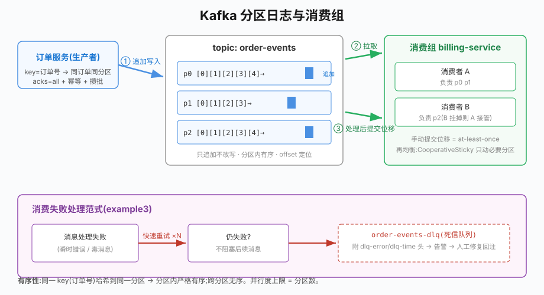

# 第29章 Kafka消息队列

## 场景

订单系统目前是同步调用链:下单 → 扣库存 → 发短信 → 加积分,全部在请求里串行执行:

> "大促时短信通道抖了 2 秒,下单接口全跟着超时。发个短信而已,凭什么阻塞用户下单?"

> "积分服务发布 10 分钟,这 10 分钟的下单全报错——可积分晚几分钟到账根本无所谓。"

> "运营想看实时成交大盘,我们只能让他们轮询数据库,把主库都拖慢了。"

这三个问题的共同解法:**把"不要求立即完成"的事情从主链路里拆出来,通过消息队列异步传递**。Kafka 是这个领域的事实标准。

本章解决五个问题:

1. 什么时候该上消息队列?哪些事情不该异步?
2. Kafka 的分区模型是什么?为什么它这么快?
3. 生产者怎么保证不丢消息?
4. 消费组怎么工作?再均衡什么时候发生、有什么坑?
5. 消费失败了怎么办(重试、死信队列)?

> 代码:`29-kafka/`,三个 example,基于 **apache/kafka**(KRaft 模式,无需 ZooKeeper)与 **franz-go** v1.21。
>
> ```bash
> docker run -d --name go-book-kafka -p 9092:9092 \
>   -e KAFKA_NODE_ID=1 -e KAFKA_PROCESS_ROLES=broker,controller \
>   -e KAFKA_LISTENERS=PLAINTEXT://0.0.0.0:9092,CONTROLLER://0.0.0.0:9093 \
>   -e KAFKA_ADVERTISED_LISTENERS=PLAINTEXT://localhost:9092 \
>   -e KAFKA_CONTROLLER_LISTENER_NAMES=CONTROLLER \
>   -e KAFKA_CONTROLLER_QUORUM_VOTERS=1@localhost:9093 \
>   -e KAFKA_OFFSETS_TOPIC_REPLICATION_FACTOR=1 apache/kafka:latest
> ```

---

## 问题

同步链路的痛点:

- **可用性被最弱环节拖累**:下游任何一家抖动,主接口跟着抖
- **峰值容量按最贵环节规划**:为了扛住下单峰值,短信/积分也得扩容
- **数据无法复用**:同一份"订单已创建"事实,每个下游都要主链路显式调用一次

Kafka 的解法是**以持久化日志为中心的发布订阅**:

- 生产者把事件追加(append)到 topic,不关心谁消费
- 消费者按自己的节奏拉取,互不影响;新消费者可以从头回放历史
- 主链路只负责"下单成功 + 发一条事件",耗时操作全部旁路化

但消息队列不是银弹,它引入了新的复杂度:**最终一致性**(下游有延迟)、**至少一次语义**(可能重复,消费端要幂等)、**运维成本**(Kafka 集群本身需要运维)。强一致要求的场景(扣款)不要用 MQ 异步解决。

---

## 实现

### 29.1 生产者与消费者:最小可用闭环

> 代码:`29-kafka/example1-producer-consumer/`

先建 topic(3 分区),再跑生产与消费:

```go
// 建 topic:kadm 是 franz-go 的管理客户端
admin := kadm.NewClient(cl)
admin.CreateTopic(ctx, 3 /*分区*/, 1 /*副本*/, nil, "order-events")
```

**生产者**——注意两个决定可靠性的细节:

```go
cl, err := kgo.NewClient(
	kgo.SeedBrokers(brokers),
	kgo.DefaultProduceTopic("order-events"),
)
// acks=all 与幂等生产者都是 franz-go 的默认值:
//   - acks=all:等所有 ISR 副本落盘才确认,broker 宕机不丢消息
//   - 幂等生产者:broker 去重,重试不会产生重复写入

for i := 1; i <= 10; i++ {
	key := fmt.Sprintf("NO-2024-%04d", i) // 订单号做 key

	cl.Produce(ctx,
		&kgo.Record{Key: []byte(key), Value: []byte(event)},
		func(r *kgo.Record, err error) {
			// 异步回调:发送成功带 partition/offset,失败要处理(重试/告警)
		})
}

// Produce 是异步攒批发送,退出前必须 Flush 确认全部落盘
if err := cl.Flush(ctx); err != nil {
	log.Fatal(err)
}
```

**key 决定分区**:Kafka 对 key 做哈希选分区,同一 key 的消息永远在同一分区,**分区内严格有序**。所以"同一订单的状态流转"用订单号做 key,就能保证下游看到的顺序正确;不带 key 则轮询分发,吞吐更均匀但无序。

**消费者**——手动提交位移,实现 at-least-once:

```go
cl, err := kgo.NewClient(
	kgo.SeedBrokers(brokers),
	kgo.ConsumerGroup("billing-service"),           // 加入消费组
	kgo.ConsumeTopics("order-events"),
	kgo.DisableAutoCommit(),                        // 关闭自动提交
	kgo.Balancers(kgo.CooperativeStickyBalancer()), // 协作式再均衡
)

for {
	fetches := cl.PollRecords(ctx, 100) // 拉一批
	fetches.EachRecord(func(r *kgo.Record) {
		process(r) // 业务处理
	})
	cl.CommitRecords(ctx, processed...) // 处理完才提交位移
}
```

位移(offset)是消费者的"书签":提交了 offset=N,表示 N 之前的都处理完了。崩溃后重启,组从上次提交处继续——没提交的会被重新消费。**这就是 at-least-once 的来源:宁可重复,不可丢失**,重复靠消费端幂等消化。

### 29.2 消费组:负载均衡与故障转移

> 代码:`29-kafka/example2-consumer-group/`

消费组是 Kafka 的伸缩单元:

- 组内消费者**均分 topic 的分区**,每条消息只被组内一个实例处理
- 分区数 = 并行度上限:3 个分区的 topic,组里第 4 个消费者只能闲着
- 消费者上线/下线触发**再均衡(rebalance)**,重新分配分区

example2 起两个同组消费者,观察分配结果:

```
[c1] 分配到 order-events 分区 [0 1]
[c2] 分配到 order-events 分区 [2]
[c1] [p1 o5] {"order_no":"NO-2024-0011"}   # p0/p1 的消息 c1 处理
[c2] [p2 o3] {"order_no":"NO-2024-0012"}   # p2 的消息 c2 处理
```

kill 掉 c2 后,它的分区自动移交 c1——**消费组的内置故障转移,不需要任何额外代码**。

franz-go 默认使用 **CooperativeSticky(协作式粘性)** 再均衡策略,相比老的 Eager 策略:

| | Eager(旧) | CooperativeSticky(默认) |
|---|---|---|
| 再均衡时 | 全组成员先撤销**所有**分区,停止消费 | 只回收必须移动的分区 |
| 停顿 | 全组暂停,直到分配完成 | 受影响分区短暂停顿 |
| 典型停机窗口 | 秒级~十秒级 | 毫秒级 |

再均衡的触发时机:成员加入/退出、心跳超时、订阅的 topic 分区数变化。**发布滚动重启就是一次再均衡风暴**——控制发布节奏、调大 `session.timeout`,能显著减少不必要的再均衡。

### 29.3 消费失败:重试与死信队列

> 代码:`29-kafka/example3-retry-dlq/`

消费失败分两种,处理方式完全不同:

- **瞬时错误**(下游超时、网络抖动):重试大概率成功
- **永久错误**(毒消息:格式坏、业务规则必拒):重试一万次也是失败

毒消息最大的危害不是它自己,而是**卡住整个分区**——如果原地无限重试,排在它后面的正常消息全部延迟。生产的标准范式是**有限重试 + 死信队列(DLQ)**:

```go
fetches.EachRecord(func(r *kgo.Record) {
	var err error
	for attempt := 0; attempt <= maxRetry; attempt++ { // 快速原地重试
		if attempt > 0 {
			time.Sleep(50 * time.Millisecond)
		}
		if err = handle(ctx, r.Value); err == nil {
			break
		}
	}
	if err != nil {
		sendToDLQ(ctx, cl, dlqTopic, r, err) // 重试耗尽 → 死信
	}
	cl.CommitRecords(ctx, r) // 无论成败都推进位移,不让毒消息卡住分区
})

// 进死信时保留原始消息 + 附诊断头,便于事后追溯与修复
headers := append([]kgo.RecordHeader{
	{Key: "dlq-error", Value: []byte(cause.Error())},
	{Key: "dlq-time", Value: []byte(time.Now().Format(time.RFC3339))},
}, r.Headers...)
cl.ProduceSync(ctx, &kgo.Record{
	Topic: dlq, Key: r.Key, Value: r.Value, Headers: headers,
})
```

example3 的实际输出:

```
处理失败(第1次): 非法消息: "{broken json!!!"
处理失败(第2次): 非法消息: "{broken json!!!"
处理失败(第3次): 非法消息: "{broken json!!!"
处理失败(第4次): 非法消息: "{broken json!!!"
已入死信队列 order-events-dlq: key=k1 cause=非法消息...
# 后续正常消息继续处理,没有被卡住
```

DLQ 不是垃圾桶:**必须有监控和人工跟进流程**——告警 DLQ 有新消息 → 排查原因 → 修复后重新注入主 topic。

> **复跑提示**:example3 的消费组 `retry-demo-group` 提交位移后,再次运行 `-role=consume` 不会重放旧消息(Kafka 消费组默认从上次提交位置继续,这是第29.2节讲过的正常行为)。想重新演示,先重置位移:见 `example3-retry-dlq/main.go` 文件头注释。

---

## 原理

### 29.4.1 分区日志:Kafka 为什么快



Kafka 的存储模型是**只追加、不修改的分区日志**:

```
topic: order-events(3 分区)

partition 0: [0][1][2][3][4] →  只增不改,顺序追加
partition 1: [0][1][2][3]  →
partition 2: [0][1][2][3][4][5] →

每条消息 = (topic, partition, offset) 唯一定位
消费者位移(offset)= 消费进度书签,由消费组管理并存在 __consumer_offsets
```

快的四个来源:

1. **顺序 I/O**:追加写磁盘的吞吐接近内存操作,远超随机写。这是 Kafka 和数据库最大的差异——它不做原地更新
2. **零拷贝**:消费者拉取时用 sendfile 系统调用,数据从页缓存直接到网卡,不过用户态
3. **批量与压缩**:生产者攒批发送,整批压缩(lz4/zstd),摊薄网络与 RPC 开销
4. **分区并行**:分区分布在多 broker 上,读写天然水平扩展

理解这个模型的推论:**消息不可变**。"删除某条消息"做不到,只能靠 topic 的保留策略(retention,按时间/大小)整体清理过期段文件。

### 29.4.2 副本与 ISR:acks=all 在保护什么

每个分区有一个 leader 和若干 follower 副本。与 leader 保持同步的副本集合叫 **ISR(In-Sync Replicas)**。

- 生产 `acks=all`:leader 等 ISR 中**全部**副本写入才返回成功
- leader 挂了,Kafka 从 ISR 里选新 leader——因为 ISR 成员都有这条消息,**已确认的消息不丢**
- 如果某个 follower 落后太多(网络差/负载高),会被踢出 ISR;ISR 收缩到只剩 leader 时,`acks=all` 退化为 `acks=1`,有丢数据风险——所以生产要配 `min.insync.replicas=2`(至少两个副本确认),配合副本数 ≥3

这就是"不丢消息"的完整链条:**生产 acks=all + min.insync.replicas≥2 + 消费手动提交位移**,三环缺一不可。

### 29.4.3 消费组与再均衡协议

组协调者(group coordinator,broker 侧)负责成员管理:

1. 消费者启动,发 JoinGroup → 协调者等全部成员到齐
2. 选一个成员做 leader consumer,由它计算分配方案(如 sticky 分配)
3. 方案经 SyncGroup 下发;之后各成员独立拉取自己分区的心跳维持 membership

Cooperative 协议把"撤销分区"从全局两阶段改为按需增量:只有需要移动的分区先撤销,其余成员无感继续消费。franz-go 默认启用它,老代码里的 Eager 全量再均衡风暴在 KIP-428 之后已成历史。

### 29.4.4 KRaft:为什么新版没有 ZooKeeper

Kafka 3.x 起(KRaft 模式)把元数据管理内置为 Raft quorum(controller 角色),替代 ZooKeeper:

- 部署简化:一套进程搞定 broker+controller(本章 docker 命令即单节点 KRaft)
- 故障恢复更快:元数据在内存 + 日志,控制器切换秒级
- 4.x 起彻底移除 ZooKeeper 支持。新项目直接用 KRaft,不要再看 ZK 时代的教程

---

## 最佳实践

### 29.5.1 topic 与分区规划

- **分区数决定并行上限**:目标消费吞吐 ÷ 单实例消费能力 ≈ 分区数;宁可多不可少(扩分区会破坏 key 的路由稳定性,缩分区不支持)
- key 的选择服务于有序性需求:同一实体的状态流转必须同 key;纯事件流可以不带 key
- 单分区消息速率建议控制在 10MB/s 以内;超大 topic 再加分区而不是加压缩比
- 副本数生产环境一律 3,`min.insync.replicas=2`

### 29.5.2 生产端

- 保持 `acks=all` + 幂等(默认);除非业务明确容忍丢失(日志采集类)
- 失败回调必须处理:记录 + 重试队列 + 告警,静默丢弃是事故之源
- 大消息(>1MB)重新设计:Kafka 不适合传大 payload,传引用(对象存储地址)而非内容
- 发送方也要幂等设计:at-least-once 下游可能重复收到同一订单事件,用唯一 ID 去重

### 29.5.3 消费端

- **手动提交位移**(DisableAutoCommit + 处理完提交):自动提交可能在处理完成前就提交,崩溃即丢消息
- 毒消息防护:有限重试 + DLQ(29.3);DLQ 必须接监控告警
- 消费逻辑要**幂等**:重复消费一定会发生(再均衡、重试、位移未提交)。常用手段:唯一键 upsert、版本号比对、去重表
- 再均衡监听器里做好善事:OnPartitionsRevoked 时提交已处理完的位移,避免重复

### 29.5.4 运维红线

- 关键指标:消费延迟(consumer lag)、ISR 收缩次数、再均衡频率、DLQ 增速。lag 持续增长说明消费能力不足,优先优化消费逻辑而非盲目扩容
- 不要用 Kafka 做 RPC 的替代品:请求-响应模式请回到 gRPC(第25章)。MQ 的语义是"事件通知",不是"等待答复"
- 跨环境共享集群是灾难之源:dev/staging/prod 物理隔离,或至少严格 ACL

---

## 排障

### 29.6.1 消费延迟持续增长(lag 高)

排查顺序:

```bash
# 看 lag 分布:哪个组、哪些分区堆积
kafka-consumer-groups.sh --bootstrap-server localhost:9092 \
  --describe --group billing-service
```

- **均匀堆积**:消费能力不足 → 优化处理逻辑(批量落库)、扩消费者(不超过分区数)、加分区
- **单分区堆积**:该分区的 key 出现热点(某爆款订单号?)或毒消息卡住 → 查 DLQ、拆 key 设计
- **突然飙升**:上游流量突增或消费者刚经历再均衡 → 看发布记录

### 29.6.2 反复再均衡,消费时断时续

典型原因与对策:

- 消费逻辑单次处理太慢,超过 `max.poll.interval.ms`(默认5分钟)→ 减小 PollRecords 批量、异步化慢操作、调大间隔
- Pod 频繁重启/OOM → 查资源限制
- 心跳线程饿死(CPU 打满)→ 查宿主机负载

症状特征:日志里反复出现 "rejoined"/"member left",lag 锯齿状波动。

### 29.6.3 消息重复消费

先确认这不是 bug 而是 at-least-once 的正常现象:再均衡后从上次提交处恢复,未提交的部分会重来。要做的是**消费幂等**,不是消灭重复。若重复量异常大,检查是否忘了提交位移、或提交频率过低。

### 29.6.4 生产者发送失败 Timeout / NotLeader

- `NOT_LEADER_FOR_PARTITION`:分区 leader 正在迁移(刚扩分区/broker 重启),客户端自动刷新元数据,短暂重试即可
- 持续 Timeout:检查 `advertised.listeners` 配置——容器里 advertised 地址必须是**客户端可达**的地址(本章配置为 localhost:9092,容器化部署时要改成 service 名),这是 Kafka 新手第一大坑
- 频繁 NotLeader:broker 不稳定,查 ISR 波动和磁盘 IO

### 29.6.5 DLQ 堆积没人管

DLQ 不是终点。接入流程:DLQ 有新消息 → 告警 → 当日认领 → 修复后回注主 topic 或归档。长期没人看的 DLQ 等于静默丢数据。

---

## 面试题

**Q1:怎么保证 Kafka 消息不丢?**

A:三个环节各设一道闸:生产端 `acks=all` + 幂等重试 + 失败回调兜底;broker 侧副本数≥3 且 `min.insync.replicas≥2`(防止 ISR 缩水后退化成单副本确认);消费端关闭自动提交、处理完手动提交位移。任何一环偷懒都会破功。

**Q2:Kafka 为什么快?**

A:顺序 I/O(追加写)、零拷贝(sendfile)、批量压缩、分区水平扩展。本质是把"随机读写的数据库问题"转化为"顺序追加的日志问题",用不可变性换取吞吐。

**Q3:怎么保证消息顺序?全局有序可行吗?**

A:Kafka 只保证**分区内有序**。需要顺序的消息用同一个 key 路由到同一分区(如订单号);全局有序只能单分区,牺牲全部并行性,一般不用。注意:消费端多线程处理会再次打乱顺序,同 key 消息要路由到同一线程。

**Q4:消费组和再均衡机制是什么?**

A:组内消费者均分分区,实现负载均衡与故障转移。成员变化触发再均衡重新分配分区。Eager 策略全组停摆,CooperativeSticky(现默认)只移动必要分区,停机窗口毫秒级。再均衡期间被回收的分区要在监听器里先提交位移。

**Q5:消息重复消费怎么办?**

A:接受 at-least-once,消费端做幂等:唯一键 upsert(INSERT ON DUPLICATE KEY)、状态版本号校验、去重表记录已处理的业务 ID。消灭重复本身(at-most-once)会引入丢失风险,对绝大多数业务得不偿失。

**Q6:什么场景不该用 Kafka?**

A:强一致事务(扣款主链路)、请求-响应式 RPC(gRPC 更合适)、小规模团队维护不起集群(RabbitMQ/云服务更轻)、需要复杂路由规则(AMQP 拓扑更擅长)。Kafka 的甜区是高吞吐的事件流、日志聚合、削峰填谷、事件溯源。

---

## 小结

本章从同步链路的痛点出发,掌握了 Kafka 的核心实践:

1. **基础闭环**:producer 异步攒批 + key 定序,consumer 组内消费 + 手动位移
2. **消费组**:分区均分、故障转移,CooperativeSticky 再均衡最小化停顿
3. **失败处理**:瞬时错误快速重试,毒消息有限重试后进 DLQ,绝不卡住分区
4. **原理**:分区日志模型(顺序 IO/零拷贝/批量)、副本与 ISR(acks=all 的含义)、再均衡协议、KRaft 架构
5. **最佳实践与排障**:分区规划、消费幂等、lag 监控、advertised.listeners 大坑

**核心原则:**

> 消息队列交换的是"实时性"换"解耦与削峰",前提是接受最终一致与 at-least-once。三条铁律:不丢消息的三环(acks=all/min.insync.replicas/手动提交)一个不能少;消费端永远幂等(重复必然发生);毒消息快速进 DLQ(绝不阻塞分区)。

下一章我们把这些异步链路组织起来,讲异步任务的设计模式:延迟任务、定时任务、任务补偿。

---

## 参考资料

> 本章基于 **Go 1.25**、**github.com/twmb/franz-go v1.21.6**、apache/kafka(KRaft)。客户端 API 以对应版本文档为准。

- franz-go 文档与示例:https://github.com/twmb/franz-go
- kadm 管理客户端:https://pkg.go.dev/github.com/twmb/franz-go/pkg/kadm
- Apache Kafka 官方文档:https://kafka.apache.org/documentation/
- Kafka KRaft 说明(KIP-848 前后架构):https://kafka.apache.org/documentation/#kraft
- IBM/sarama(另一主流 Go 客户端):https://github.com/IBM/sarama
