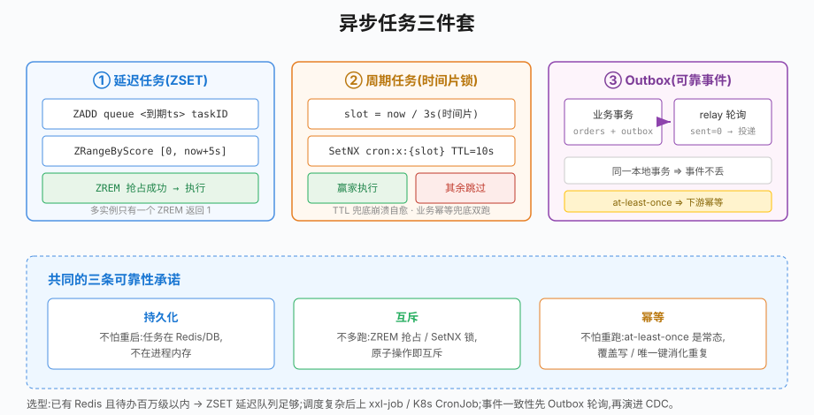

# 第30章 异步任务设计

## 场景

上一章用 Kafka 解决了"事件通知",但异步化之后新的问题来了:

> "订单 15 分钟未支付要自动关闭。总不能每秒扫一遍订单表吧?千万级数据扫不动,进程重启定时器还全丢。"

> "每天凌晨 2 点跑对账。部署了 3 个实例,结果对账跑了三遍,报表数字翻倍。"

> "下单接口里同步写订单表 + 发 Kafka 事件。Kafka 抖了一下,单创建成功了、事件却没发出去——下游积分服务永远不知道这笔单。"

这三类问题是异步系统的三大件:**延迟任务**(未来某时刻执行)、**周期任务**(多实例下不重复执行)、**可靠事件**(业务与消息的原子性)。

本章解决五个问题:

1. 延迟任务怎么实现?为什么不用数据库轮询?
2. 多实例怎么共享延迟队列且不重复消费?
3. 周期任务怎么防止多实例重复执行?
4. 定时任务挂了怎么自愈?
5. 业务写库和发消息的一致性怎么保证(Outbox)?

> 代码:`30-async-task/`,三个 example,基于 Redis 8(go-redis v9.22)与 MySQL 8.4。

---

## 问题

三类任务的共同诉求与不同形态:

| 类型 | 触发方式 | 典型场景 | 核心难点 |
|---|---|---|---|
| 延迟任务 | 未来某时刻 | 订单超时关闭、优惠券到期提醒 | 到期前持久化、到期及时感知 |
| 周期任务 | 固定间隔/时刻 | 对账、报表聚合、缓存预热 | 多实例防重复、失败自愈 |
| 可靠事件 | 业务发生后 | 下单事件通知下游 | 库与消息的原子性 |

朴素方案的缺陷:

- `time.AfterFunc`/内存定时器:进程重启全丢;多实例各跑各的
- 数据库轮询(`WHERE status='待支付' AND created_at<...`):大表慢查询;轮询间隔决定延迟上限;索引压力大
- 先写库再发消息:两步之间没有原子性,第二步失败即状态不一致

解法分别是:**Redis ZSET 延迟队列**、**时间片分布式锁**、**Outbox 事务性发件箱**。

---

## 实现

### 30.1 延迟队列:ZSET 按到期时间索引

> 代码:`30-async-task/example1-delayed-queue/`

Redis ZSET 的成员按 score 有序——把 **score 设为到期时间戳**,就得到一个按时间排序的任务队列。ZSET 底层是跳表(skiplist)+哈希表,`ZRangeByScore` 取区间、`ZAdd`/`ZRem` 都是 **O(log n)**(Redis 官方文档:https://redis.io/docs/data-types/sorted-sets/),所以"取最早到期任务"不会像数据库轮询那样随数据量变慢:

```go
payload, _ := json.Marshal(orderTask{OrderNo: "NO-DQ-0001", Action: "close_order"})
score := float64(time.Now().Add(15 * time.Minute).Unix())
rdb.ZAdd(ctx, "delay:order-close", redis.Z{Score: score, Member: string(payload)})
```

消费端循环扫描"已到期"的任务:

```go
now := float64(time.Now().Unix())
msgs, _ := rdb.ZRangeByScore(ctx, queueKey, &redis.ZRangeBy{
	Min: "-inf",
	Max: fmt.Sprintf("%f", now+bucket), // 提前量 bucket=5s,防边界漏单
})

for _, m := range msgs {
	// 关键:ZREM 原子删除当锁用。
	// 多实例同时扫到同一任务,只有一个 ZREM 返回 1 —— 天然防重复执行
	removed, _ := rdb.ZRem(ctx, queueKey, m).Result()
	if removed == 0 {
		continue // 已被其他实例抢走
	}
	closeOrder(m) // 执行业务;失败要降分重试或进死信
}
```

三个设计点:

- **提前量 bucket**:按 `now+5s` 取,避免"刚好这一刻到期"的任务因扫描间隙被漏到下一轮
- **ZREM 即抢占**:取出和删除一步原子完成,不需要额外分布式锁
- **执行失败的补偿**:`closeOrder` 失败要把任务塞回 ZSET(score 加退避),重试耗尽进死信

实测:订单 NO-DQ-0001 设 2 秒到期,消费端在 +2s 精确触发;另外两单 30 秒到期,继续留在队列。

### 30.2 周期任务:时间片锁防重复执行

> 代码:`30-async-task/example2-cron/`

单机 cron(robfig/cron 等)在多实例下会每个实例都跑一遍。解法:**让同一个周期的任务只有一把钥匙**。

```go
func runOnce(ctx context.Context, rdb *redis.Client, name string, now time.Time) {
	// 时间片 key:按秒对齐,所有实例对"同一周期"竞争同一把锁
	slot := now.Truncate(time.Second).Unix()
	lockKey := fmt.Sprintf("cron:aggregate:%d", slot)
	token := fmt.Sprintf("%s-%d", name, rand.Int63())

	ok, err := rdb.SetNX(ctx, lockKey, token, 10*time.Second).Result()
	if !ok {
		fmt.Printf("[%s] 本周期由其他实例执行,跳过\n", name)
		return // 没抢到直接放弃,周期任务不需要排队背压
	}
	defer releaseLock(ctx, rdb, lockKey, token) // Lua 校验 token 再删(第23章)
	doAggregate()
}
```

四个关键设计:

- **锁 key 带时间片**而非固定 key:即使某实例崩溃、锁被 TTL 释放,其他实例补跑拿到的也是"同一周期"语义,不会串周期
- **没抢到就跳过,不自旋**:周期任务的语义是"这周期有人做了就行",排队执行只会堆积
- **TTL 兜底 + 主动释放双保险**:持锁者崩溃 TTL 过期后下周期照常;正常路径 Lua 校验释放,不留死锁尾巴
- **业务幂等兜底**:极端情况(长 GC 导致锁过期、另一实例接手)可能双跑,聚合结果写带 slot 的 key 做覆盖写而非累加

实测:两个 worker 同时运行,每周期恰好一个执行(`[worker-a] 跳过`、`[worker-b] 执行聚合完成`)。

### 30.3 Outbox:业务数据与事件的原子写入

> 代码:`30-async-task/example3-outbox/`

"下单成功但事件丢了"的根因是**两个独立系统(MySQL/Kafka)没有事务**。Outbox 的洞察:别急着真发消息,**先把事件当作一行数据,和业务写在同一个本地事务里**。

```go
tx, _ := db.BeginTx(ctx, nil)
defer tx.Rollback()

// 业务数据
tx.Exec(`INSERT INTO orders (order_no, user_id, amount) VALUES (?,?,?)`, ...)
// 同一事务里写事件
tx.Exec(`INSERT INTO outbox (agg_type, agg_id, event_type, payload)
         VALUES ('order', ?, 'order.created', ?)`, ...)

tx.Commit()
// 要么都成,要么都回滚 —— 库里有了订单,outbox 必有对应事件
```

outbox 表的关键字段:

```sql
CREATE TABLE outbox (
	id BIGINT AUTO_INCREMENT PRIMARY KEY,
	event_type VARCHAR(64),
	payload JSON,
	sent TINYINT DEFAULT 0,          -- 投递标记
	retry_count INT DEFAULT 0,       -- 重试计数
	next_retry_at DATETIME,          -- 退避重试时间
	KEY idx_unsent (sent, next_retry_at) -- relay 扫描索引
);
```

后台 **relay**(中继)把 outbox 事件真正投递出去(Kafka/RPC),成功后标记 `sent=1`:

```go
rows := query(`SELECT id, payload FROM outbox
               WHERE sent=0 AND next_retry_at<=NOW() LIMIT 10`)
for _, ev := range rows {
	kafka.ProduceSync(ev.payload)          // 真实投递
	exec(`UPDATE outbox SET sent=1 WHERE id=?`, ev.ID)
}
```

一致性分析(面试高频):

- **业务成功 → 事件必达**:事件在事务里,不会漏
- **事件至少一次**:relay 标记 sent 前崩溃,重启后会重投 → 下游仍需幂等(呼应第29章铁律)
- **不会先于业务可见**:事件随事务提交才出现,不存在"事件先到、订单还没落库"

实测:`-role=business` 下单并同事务写 outbox;`-role=relay` 投递事件并把 `sent` 置 1。

---

## 原理

### 30.4.1 三种异步任务的选型地图



```
延迟任务:  业务触发 → ZSET(到期时间做score) → 扫描器抢占执行
周期任务:  cron 触发 → 时间片锁竞争 → 唯一赢家执行,其余跳过
可靠事件:  业务事务内写 outbox → relay 轮询 → 投递 MQ → 标记 sent
```

三者常被混为一谈,边界其实清晰:

- **延迟任务**有"确定的未来时刻",ZSET 的 score 就是这个时刻;Kafka 没有原生的按时间投递,硬造(暂停/恢复消费)复杂度极高——这是 ZSET 方案的生态位
- **周期任务**没有"任务实体",只有"时间到了该有人干活"的约定,核心是分布式互斥
- **Outbox** 不是独立任务系统,是保证"业务与事件原子性"的写侧模式

### 30.4.2 ZSET 方案 vs 专业延迟队列

| 维度 | Redis ZSET | RocketMQ 延迟消息 / 云厂商延迟队列 |
|---|---|---|
| 精确度 | 秒级(扫描+提前量) | 秒级~毫秒级 |
| 可靠性 | 依赖 Redis 持久化策略(AOF) | broker 持久化,更强 |
| 运维成本 | 零新增组件 | 新增中间件 |
| 海量堆积 | 内存成本高 | 磁盘友好 |

判断标准:**已有 Redis 且量级可控(百万以内待办)用 ZSET 足够**;延迟任务成为核心业务(金融、物流时效)时上专业队列。不要为了一个超时关单引入一整套 RocketMQ。

### 30.4.3 时间片锁的正确性论证

为什么"锁 key 带时间片 + SetNX"能防重复?

1. 同一周期 slot 对应唯一 key `cron:x:{slot}`
2. SetNX 是原子的:对同一 key 只有一个客户端成功 ⇒ 每周期至多一个执行者
3. 不同周期的 key 不同 ⇒ 周期间互不干扰,上一周期持锁不阻塞下一周期

失效场景与兜底:

- **持锁者执行超过 TTL**:锁过期,另一实例可能接手同 slot 双跑 ⇒ TTL 要显著大于最大执行时长,业务层幂等兜底(30.2 的覆盖写)
- **时钟不同步**:实例时钟偏差会让各自算出不同 slot ⇒ NTP 秒级同步足够;更严格做法由协调者下发周期号而非依赖本地时钟

### 30.4.4 Outbox 的 relay:轮询 vs CDC

relay 用轮询而不是监听 binlog(Canal/Debezium 等 CDC),是刻意的取舍:

- **轮询**:十行代码、零新增组件、秒级延迟,对绝大多数事件通知足够
- **CDC**:毫秒级延迟、不侵入业务库,但要维护一整套流处理设施

先轮询后 CDC 是合理演进路径。无论哪种,**relay 自身要支持多实例安全**(`SELECT ... FOR UPDATE SKIP LOCKED` 或按 id 分片认领),否则 relay 重复投递会放大下游幂等压力。

## 最佳实践

### 30.5.1 延迟队列工程化清单

- 任务 payload 只放 ID + 类型,业务数据以 ID 回查库——避免 ZSET 数据与库里不一致
- 抢占成功但业务失败的补偿:**降分重试**(score += 退避)或移入死信 ZSET;直接丢弃等于埋雷
- 大量同刻到期的任务会产生扫描尖峰:写入时对 score 加随机抖动(±30s)摊平
- 监控两个水位:队列长度(ZCARD)、最老任务滞留时长——后者更能反映消费能力不足

### 30.5.2 定时任务框架建议

自研 SetNX 方案适合简单场景;任务多、调度复杂后:

- **robfig/cron + 时间片锁**:Go 生态最常见组合,本章方案的工程化封装
- **xxl-job / ElasticJob**:中心化调度平台,有界面、分片广播、失败转移;代价是多一套运维
- **K8s CronJob**:集群内原生周期任务,并发策略(Allow/Forbid/Replace)替代分布式锁

### 30.5.3 Outbox 落地要点

- outbox 表会持续膨胀:投递完成后定期归档/清理(按 created_at 分区最省心)
- payload 只存事件必要字段,大对象传引用
- relay 的扫描批量与频率要可配置:事件洪峰时加大批量、缩短间隔
- 监控:未投递数(`sent=0` 计数)、最老未投递滞留时长——滞留增长说明 relay 跟不上或 MQ 故障

## 排障

### 30.6.1 延迟任务不触发或延迟很久

- 扫描器没起:确认消费循环活着(日志心跳)
- 提前量 bucket 太小:任务 score 在两次扫描之间"擦肩而过",调大 bucket 或缩短扫描间隔
- Redis 内存淘汰:ZSET key 被 maxmemory 策略逐出(allkeys-lru 下完全可能!)——延迟队列的 key 应放单独实例或用 noeviction + 监控

### 30.6.2 任务被执行了两次

- ZREM 抢占逻辑写错:先执行再删除,两实例都会执行——必须先 ZREM 成功再干活
- 业务执行超过预期后又重试:检查补偿逻辑是否把已成功任务重新入队
- 定时任务双跑:确认锁 key 是否带时间片;固定 key + 自旋等待在时钟偏差下会双跑

### 30.6.3 定时任务某天突然全部停摆

- 持锁实例崩溃且释放逻辑没跑:TTL 过期后会自愈,若长期停摆查 TTL 设置
- 所有实例系统时间被改:时间片错乱,NTP 检查
- Redis 连接池耗尽:定时任务与业务共用 Redis 时常见,给任务独立连接池

### 30.6.4 Outbox 事件堆积不投递

- relay 进程没起或崩溃:有 outbox 必须有 relay 存活监控
- `idx_unsent` 索引失效:表太大时 `WHERE sent=0` 变全表扫,确认走索引
- MQ 长时间故障:retry_count 涨、next_retry_at 退避到很远;MQ 恢复后考虑手动重置退避加速追平

### 30.6.5 下游说收到重复事件

Outbox 的 at-least-once 是设计使然:relay 投递成功但标记 sent 失败(MQ 与 DB 无事务),重启后重投。这不是 bug——下游必须幂等(第29章)。重复量异常才需要排查 relay 是否多实例无互斥运行。

## 面试题

**Q1:怎么实现一个分布式延迟队列?**

A:轻量方案用 Redis ZSET:score 存到期时间戳,消费循环 ZRangeByScore 取到期任务,ZREM 原子抢占防多实例重复,失败降分重试。要点:提前量防边界漏单、payload 只存 ID、Redis 淘汰策略要避开。量级大或可靠性要求高换 RocketMQ 延迟消息/云延迟队列。

**Q2:多实例部署下定时任务怎么防止重复执行?**

A:核心是同一周期只有一把钥匙:锁 key 携带时间片(如按秒对齐的 slot),SetNX 原子竞争,TTL 兜底 + Lua 校验主动释放。没抢到的直接跳过不排队。极端双跑(TTL 内长 GC)靠业务幂等兜底——结果写覆盖而非累加。

**Q3:Outbox 模式解决什么问题?它保证恰好一次吗?**

A:解决"业务写库与发消息无法原子"的问题:事件作为一行数据和业务同事务写入,后台 relay 轮询投递。它保证 at-least-once 而非 exactly-once——relay 投递成功但标记失败会重投,所以下游仍要幂等。价值是把"必丢消息"变成"可能重发",后者是可消化的。

**Q4:延迟任务的扫描方案和内存定时器相比,取舍是什么?**

A:内存定时器精度高、零网络开销,但不持久化(重启丢)、不能多实例共享;ZSET 反之。生产服务几乎必然多实例且会重启,持久化和共享是刚需,秒级精度损失可接受。可结合:本地 timer 做近场调度,ZSET 做可靠存储。

**Q5:outbox 表越积越多、查询变慢怎么治理?**

A:三步:确认 relay 扫描走 `idx_unsent` 索引;对已投递(sent=1)定期归档清理(按时间分区最省心);洪峰期调大 relay 批量与频率。根本是给 outbox 定容量预期——它是队列不是档案库。

**Q6:周期任务的执行记录要不要落库?**

A:要。至少记录每次执行的实例、耗时、结果。三个用途:排障(某天没跑是谁的责任)、审计(对账任务跑了没有)、容量规划(耗时趋势)。这也是自研 SetNX 方案和 xxl-job 这类平台的差距——平台送你执行历史界面。

## 小结

本章补齐了异步系统的三大件:

1. **延迟任务**:ZSET score 即到期时间,ZREM 即抢占,bucket 提前量防漏单
2. **周期任务**:时间片 SetNX 锁,每周期唯一执行者,TTL 兜底 + 业务幂等
3. **可靠事件**:Outbox 同事务写业务与事件,relay 轮询投递,at-least-once 下游幂等
4. **选型认知**:ZSET 够用到百万级待办;轮询够用到秒级延迟——先简单后复杂
5. **工程清单**:payload 只放 ID、score 抖动摊峰、outbox 归档、执行记录落库

**核心原则:**

> 异步任务的可靠性 = 持久化(不怕重启)+ 互斥(不多跑)+ 幂等(不怕重跑)。三者都来自同一个认识:分布式环境下,"恰好执行一次"是奢望,"至少一次 + 幂等"才是可以工程化的承诺。

至此微服务的"通信与协调"已经完整:gRPC 通信(25)、契约(26)、寻址(27)、配置(28)、事件(29)、异步任务(30)。下一章讲服务治理的最后一块拼图:限流熔断降级。

---

## 参考资料

> 本章基于 **Go 1.25**、go-redis v9.22.0、go-sql-driver/mysql v1.10.0、MySQL 8.4。API 以对应版本官方文档为准。

- Redis ZSET 命令参考:https://redis.io/docs/latest/commands/?group=sorted-set
- go-redis 文档:https://redis.uptrace.dev/
- Outbox 模式(microservices.io):https://microservices.io/patterns/data/transactional-outbox.html
- robfig/cron:https://github.com/robfig/cron
- xxl-job:https://www.xuxueli.com/xxl-job/
- Debezium(CDC 方案):https://debezium.io/documentation/
