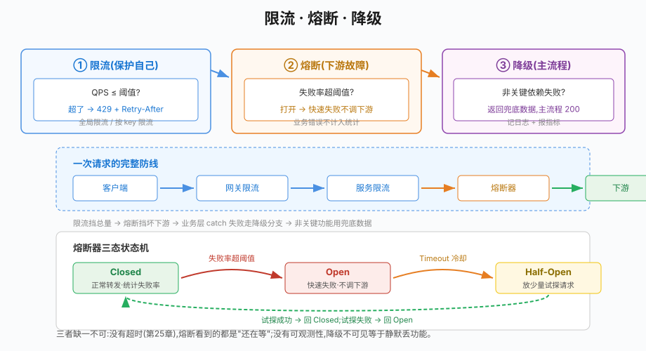

# 第31章 限流熔断降级

## 场景

微服务已经跑起来了,现在的问题是稳定:

> "大促开始 3 秒,订单接口 QPS 从 500 冲到 8000,数据库连接池被打穿,整站 500。"

> "支付网关挂了 30 秒,订单服务还在死命调它,每次等 5 秒超时。几十个实例的线程全被卡死,连不依赖支付的下单都跟着瘫痪。"

> "推荐服务抖了一下,订单详情页整个 5xx。可推荐只是锦上添花,凭什么让整个页面失败?"

三个痛点对应三个能力:**限流**(保护自己)、**熔断**(保护自己不拖累别人/不被坏下游拖垮)、**降级**(保护主流程不被非关键路径连累)。

本章解决五个问题:

1. 限流怎么实现?全局限流和按用户限流怎么选?
2. 令牌桶和漏桶什么区别?
3. 熔断的状态机是什么?阈值怎么设?
4. 哪些错误该计入熔断,哪些不该?
5. 降级和熔断怎么配合?

> 代码:`31-ratelimit-circuitbreaker/`,三个 example,基于 `golang.org/x/time`、`sony/gobreaker`、Gin。

---

## 问题

三个概念经常被混用,边界其实不同:

| | 保护谁 | 针对什么 | 手段 |
|---|---|---|---|
| 限流 | 保护自己 | 请求太多 | 拒绝超额请求(429) |
| 熔断 | 保护自己不拖累下游、不被坏下游拖垮 | 下游故障 | 快速失败,暂停调用 |
| 降级 | 保护主流程 | 非关键路径失败 | 返回兜底数据 |

- **限流**:自己的容量上限。请求超过了,与其排队把池子打满,不如快速拒绝
- **熔断**:下游持续失败时,不再傻等超时,直接快速失败(秒回),让下游有时间恢复;也避免故障在下游堆积时,自己这边线程/连接全被拖住
- **降级**:一个功能失败不该让整页失败。主数据照常返回,非关键数据用兜底方案

三者层层递进:限流挡在最外面,熔断在调用下游时生效,降级在功能层面兜底。

---

## 实现

### 31.1 限流:令牌桶与按 key 限流

> 代码:`31-ratelimit-circuitbreaker/example1-ratelimit/`

`golang.org/x/time/rate` 是官方维护的令牌桶实现。令牌桶允许**预支**(burst):突发的一批请求可以立刻通过,但长期速率被限定。

```go
// 全局限流:10 QPS,桶容量 20(允许瞬时突发 20 个)
globalLimiter := rate.NewLimiter(rate.Limit(10), 20)

// 请求里判断,超了就 429
if !globalLimiter.Allow() {
	c.JSON(429, gin.H{"message": "rate limited"})
	return
}
```

两个用法按场景选:

- **Allow()**:非阻塞,超了立刻返回失败。适合"超了就拒绝"的场景(如非核心接口)
- **Wait(ctx)**:阻塞等待令牌,可带超时。适合"必须完成、可以稍等"的场景(如批量任务)

**按 key 限流**(API 网关最常见):每个用户/商家独立配额,一个人刷接口不能影响别人:

```go
type keyedLimiter struct {
	mu     sync.Mutex
	limits map[string]*rate.Limiter
}

func (k *keyedLimiter) allow(key string) bool {
	k.mu.Lock()
	defer k.mu.Unlock()
	l, ok := k.limits[key]
	if !ok {
		l = rate.NewLimiter(2, 3) // 每人 2 QPS,桶 3
		k.limits[key] = l
	}
	return l.Allow()
}
```

> 注意:按 key 的 map 会无限增长——要定期清理过期 key,或用有上限的 LRU。生产实现常直接把 key 写进 Redis,利用 TTL 自动过期,天然支持多实例共享。

实测(30 并发打):

```
=== 单用户连发 12 次(per-user 配额 2QPS/桶3)===
200=3 429=9          # 桶 3 + 后续被限
=== 三个用户各发 6 次 ===
200=9 429=9          # 每人独立配额,全局 10QPS 兜底
```

### 31.2 熔断:三态状态机

> 代码:`31-ratelimit-circuitbreaker/example2-circuitbreaker/`

熔断器是典型的三态状态机(见 31.4 图):

- **Closed**:正常转发请求,统计失败率;失败率超阈值 → **Open**
- **Open**:直接快速失败,不调下游;等待 `Timeout` 冷却 → **Half-Open**
- **Half-Open**:放一个试探请求;成功 → Closed(下游恢复了),失败 → Open

```go
cb := gobreaker.NewCircuitBreaker(gobreaker.Settings{
	Name:        "payment-downstream",
	MaxRequests: 1, // 半开时放几个试探请求
	Interval:    10 * time.Second,
	Timeout:     3 * time.Second, // Open 多久后进 Half-Open
	ReadyToTrip: func(counts gobreaker.Counts) bool {
		// 5 个请求且失败率 ≥60% 才打开:避免单次抖动就熔断
		return counts.Requests >= 5 &&
			float64(counts.TotalFailures)/float64(counts.Requests) >= 0.6
	},
})

result, err := cb.Execute(func() (any, error) {
	return downstream.Call(ctx, req)
})
```

**关键:哪些错误该计入熔断?**

- 应该计入:下游超时、连接失败、5xx——这些是"下游故障"
- 不该计入:业务错误(如"库存不足"、参数校验失败)——下游正常,只是这笔生意做不成

gobreaker 用 `Settings.IsSuccessful` 区分:

```go
IsSuccessful: func(err error) bool {
	return err == nil || errors.Is(err, errBusiness) // 业务错误算"成功"
},
```

否则一个参数校验错误就会把熔断器打爆,把好端端的下游也掐断。

实测完整状态机(阶段2下游故障→open 快速失败,阶段3恢复后 half-open 试探→closed):

```
[09] open   失败: circuit breaker is open   # 熔断后直接拒绝,不调下游
...
[21] half-open  成功: resp[req-21]           # 半开试探成功
[22] closed  成功: resp[req-22]              # 回到正常
```

### 31.3 降级:非关键功能失败兜底

> 代码:`31-ratelimit-circuitbreaker/example3-degrade/`

降级的前提是**给功能分轻重**。订单详情页 = 关键数据(订单本体)+ 非关键数据(推荐/足迹/收藏数)。推荐失败,不该让整页 5xx:

```go
renderOrderDetail := func(userID int64, orderNo string) {
	// 关键数据:订单本体,失败就真失败
	fmt.Printf("订单 %s 金额 ¥199.00\n", orderNo)

	// 非关键数据:推荐。失败就降级为默认推荐
	recs, err := getRecommendation(ctx, userID) // 内部已包熔断器
	if err != nil {
		log.Printf("推荐服务降级: %v", err)
		recs = []string{"热销TOP", "新品推荐", "猜你喜欢"} // 兜底数据
	}
	fmt.Printf("推荐: %v\n", recs)
}
```

实测:推荐故障期间每次降级(前 2 次真实调用失败,第 3 次熔断打开直接降级更快),恢复后正常返回:

```
[降级]   推荐服务不可用,返回兜底推荐 (err=recommend service timeout)
[降级]   推荐服务不可用,返回兜底推荐 (err=circuit breaker is open)  # 熔断更快
[推荐]   [商品A 商品B 商品C]                                        # 恢复
```

**降级不是吞错误**:要打日志、要上报指标(降级次数、时长),否则恢复后没人知道期间发生了什么。

---## 原理

## 原理

### 31.4.1 令牌桶 vs 漏桶



| | 令牌桶 | 漏桶 |
|---|---|---|
| 模型 | 桶里存令牌,来一个请求取一个;令牌按速率补充 | 桶里存请求,按固定速率流出 |
| 突发 | 允许(burst 大小) | 不允许,恒定输出 |
| 特点 | 平滑限速 + 容忍突发 | 严格均匀,适合下游需要恒定 QPS 的场景 |

x/time/rate 是令牌桶。选型:一般 API 用令牌桶(允许突发的自然节奏);对下游有严格速率契约的批量任务用漏桶(或令牌桶 + Wait)。

### 31.4.2 熔断阈值怎么定

三个参数各有逻辑:

- **ReadyToTrip(打开条件)**:别对单次抖动反应过度。常用"连续 N 次失败"或"窗口内失败率 ≥ X%"。N 和 X 取决于下游的重要性和你的容忍度——支付网关 5 次内 3 次失败就该打开,推荐服务可以宽松些
- **Timeout(冷却时间)**:Open 持续多久。太短,下游还没恢复就反复试探,退化成超时重试;太长,下游早已恢复却一直被打回去。经验值 3~10 秒,配合指数退避递进
- **MaxRequests(Half-Open 试探数)**:1 最保守;下游恢复慢时可放大,但要防止"试探那一下又打爆它"

熔断最容易被忽视的原则:**失败率统计要按时间窗口**,而不是无限累计——否则一次老故障会让熔断器永远不闭合。

### 31.4.3 分布式限流的取舍

单机 `x/time/rate` 是进程内限流,多实例下每个实例各限各的,总量 = 实例数 × 单实例配额。要全局精确限流得上 Redis(固定窗口计数 / 令牌桶脚本 / 滑动窗口)。

取舍:

- 单机限流:零网络开销、够用、多实例按比例配置即可。**绝大多数场景够用**
- Redis 限流:全局精确,但每次请求多一次 RTT,且 Redis 故障时限流器失效(要带本地兜底)
- 网关限流(nginx/Kong/云 WAF):在入口处统一做,业务零侵入,最常用

### 31.4.4 三件套的协作时序

一次请求的完整防线:

```
客户端 → [网关限流] → [服务限流] → [熔断器] → 下游
                        │                       │
                        │                 失败/超时→快速失败
                        └── 429 拒绝 ──────────┘
        业务层:非关键依赖失败 → 降级兜底,主流程继续
```

限流挡总量、熔断挡坏下游、降级兜住功能——三者独立生效,缺一不可。熔断和降级常配合:熔断器快速失败 → 上层 catch 到错误走降级分支。

---

## 最佳实践

### 31.5.1 限流

- 限流配额按**实例**配置而非总量固定:多实例时每个实例设 `总QPS/实例数`,省去 Redis RTT
- 429 响应要有意义:带 `Retry-After` 头(客户端知道多久后再试),别让客户端无限重试
- 限流不是性能优化,是**容量保护**——如果经常触发,说明容量不够,要扩容而不是一味调高阈值
- 按 key 限流时清理过期 key(见 31.1),防止 map/Redis 无限增长

### 31.5.2 熔断

- 只有"下游故障类"错误计入熔断;业务错误用 `IsSuccessful` 排除(31.2)
- 熔断器**按下游隔离**:每个下游一个实例,别共用——支付挂了不该连累商品查询
- 熔断要配合超时:先有合理的调用超时(第25章),熔断才有意义;没有超时,熔断器看到的都是"还在等"
- 熔断状态要可观测:暴露 state 指标(closed/open/half-open),告警"open 持续过长"

### 31.5.3 降级

- 给功能分类:关键(下单/支付/余额)、非关键(推荐/足迹/收藏)。**分类写进代码注释**,降级点是评审重点
- 兜底数据要有意义:热销榜单、缓存快照,而不是空数组——空推荐比降级本身更伤转化
- 降级必须记日志 + 报指标:降级次数、持续时长,恢复后复盘
- 多级降级:推荐服务挂了→用昨日榜单;昨日榜单也挂了→用静态默认。逐级往下

---## 排障

## 排障

### 31.6.1 接口突然大量 429

- 先分清是全局还是按 key:看日志里被限的用户分布
- 检查是否压测/爬虫误伤:按 key 限流 + 用户白名单
- 检查限流参数是否随流量变化被调低过(配置热更新误操作——呼应第28章,限流阈值这种动态配置要谨慎)
- 若经常打满,是容量信号:扩容而不是调高阈值

### 31.6.2 熔断器频繁打开,下游明明没事

最常见原因:**把业务错误计入了熔断统计**。参数错误、库存不足这类错误也会让 `ReadyToTrip` 的失败率飙高。确认 `IsSuccessful` 是否正确排除了业务错误;再查是不是超时设置过短,导致正常慢请求都被判失败。

### 31.6.3 熔断打开后一直回不到 Closed

- Timeout 太短,半开试探频繁失败:下游需要更长恢复期 → 调大 Timeout 或做指数退避
- 下游是"假恢复"(能连但内部还烂):半开试探那 1 个请求也失败 → 保持 Open。排查下游真实健康度
- 失败率统计窗口被重置:Interval 与 ReadyToTrip 的窗口不一致,导致永远统计不齐

### 31.6.4 降级触发但没有日志

降级被"吞掉"了——catch 到错误直接返回兜底数据,没打日志没报指标。这是降级的常见反模式:降级本身不可见,恢复后无从复盘。补上降级计数与告警(降级比例超过阈值要报警,说明非关键依赖持续故障)。

### 31.6.5 限流器加了反而更不稳定

- 限流+重试组合成"重试风暴":客户端被 429 后立刻重试,循环打,把限流器打得更满 → 429 带 `Retry-After`,客户端指数退避
- Redis 限流器成为单点:Redis 抖一下,所有请求的限流判断都变慢 → 本地限流 + Redis 兜底,或网关层做
- 多个限流器叠加(网关+服务+单接口)没梳理清楚,用户被多层误伤 → 明确每层职责

---

## 面试题

**Q1:限流、熔断、降级的区别?**

A:限流保护自己(请求太多就拒绝);熔断保护自己不被坏下游拖垮(下游故障就快速失败);降级保护主流程(非关键功能失败用兜底数据)。针对对象不同:限流看总量、熔断看下游健康、降级看功能轻重。

**Q2:令牌桶和漏桶的区别?什么时候选哪个?**

A:令牌桶允许突发(burst),速率平滑;漏桶恒定输出,严格均匀。一般 API 限流用令牌桶(x/time/rate);下游对速率有严格契约、或需要固定消费节奏的批量任务用漏桶。

**Q3:熔断器的三态状态机讲一下。**

A:Closed 正常转发并按窗口统计失败率,超阈值转 Open;Open 直接快速失败,冷却 Timeout 后转 Half-Open;Half-Open 放少量试探请求,成功回 Closed,失败回 Open。核心是避免"每次失败都等超时"的雪崩,用快速失败保线程和连接。

**Q4:哪些错误应该计入熔断?为什么?**

A:下游故障类(超时、连接失败、5xx)计入;业务错误(参数校验失败、库存不足)不计入。因为熔断反映的是"下游健康度",业务错误是下游正常处理但生意做不成——计入会误杀健康的下游。

**Q5:单机限流和分布式限流怎么选?**

A:单机 x/time/rate 零开销、按实例配额,绝大多数够用;Redis 限流全局精确但多一次 RTT、Redis 是单点;网关限流入口统一、业务零侵入。优先网关或单机,只有"全局必须精确一致"(如秒杀总量)才上 Redis。

**Q6:降级的兜底数据怎么设计?**

A:兜底要有意义且有层次:首选"接近真实"的缓存快照或昨日数据,次选静态榜单,最后才是空。降级必须打日志、报指标、能告警——否则降级不可见,等于静默丢功能。

---

## 小结

本章把服务治理的三件套讲透了:

1. **限流**:令牌桶 + 按 key 限流,429 带 Retry-After,单机优先
2. **熔断**:三态状态机,业务错误不计入,按下游隔离,配合超时
3. **降级**:功能分轻重,非关键失败兜底,降级可观测
4. **原理**:令牌桶 vs 漏桶、熔断参数定法、三件套协作时序
5. **排障**:429 分析、熔断误报、重试风暴、降级不可见

**核心原则:**

> 限流熔断降级是"用快速失败换取局部故障"的工程哲学:宁可拒绝一部分请求,不让雪崩拖垮全部;宁可功能降级,不让整页失败。三个能力都要配超时(第25章)才有意义——超时是前提,限流熔断降级是手段,可观测(第45章告警)是闭环。

---

## 参考资料

> 本章基于 **Go 1.25**、golang.org/x/time v0.15、sony/gobreaker v1.0.0、Gin v1.12。API 以对应版本文档为准。

- golang.org/x/time/rate:https://pkg.go.dev/golang.org/x/time/rate
- sony/gobreaker:https://github.com/sony/gobreaker
- Sentinel 限流降级(Alibaba,Go 版):https://github.com/alibaba/sentinel-golang
- Resilience4j(参考实现,含状态机说明):https://resilience4j.readme.io/docs/circuitbreaker
- 令牌桶算法(维基):https://en.wikipedia.org/wiki/Token_bucket