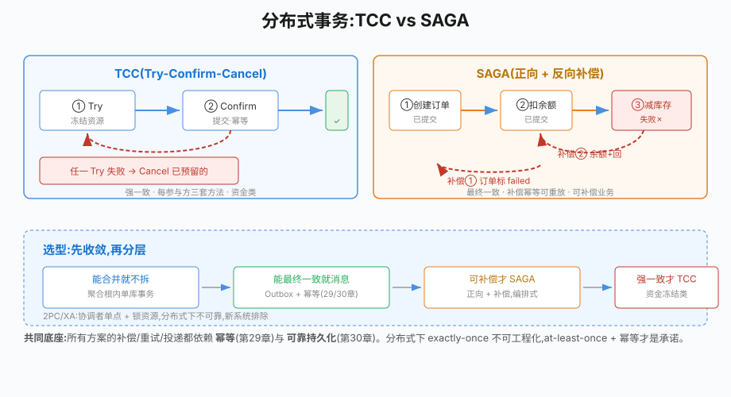

# 第32章 分布式事务

## 场景

单体应用里"扣余额 + 减库存 + 记订单"在一个数据库事务里搞定。微服务拆开后,这三件事分属三个服务、三个库:

> "下单 2 万单后对账发现少了 37 单库存——订单服务扣了库存,但账户服务扣款超时回滚了。两边数据对不上。"

> "先把订单状态改成已支付,再通知物流。改成功了,物流通知失败——钱付了,货没发。"

第19章的单库事务在这里帮不上忙:**事务边界被服务边界切开了**。本章解决五个问题:

1. 分布式事务有哪些方案?各自适用什么场景?
2. 2PC(XA)为什么在微服务里口碑差?
3. TCC 的三阶段是怎么保证可靠的?
4. SAGA 的补偿是怎么设计的?
5. 为什么说"消息最终一致 + 幂等"才是微服务的常态?

> 代码:`32-distributed-transaction/`,两个 example(TCC 转账、SAGA 下单),基于 MySQL 8.4,全部真实可跑。

---

## 问题

分布式事务的根因:**本地事务保证的 ACID 无法跨越服务边界**。一个操作跨 3 个库,要么引入分布式协调,要么接受"最终一致"。

按强度排序,主流方案:

| 方案 | 一致性 | 可靠性 | 复杂度 | 适用 |
|---|---|---|---|---|
| 2PC/XA | 强一致 | 协调者单点风险、锁资源 | 高(依赖 DB 支持) | 极少用 |
| TCC | 强一致(业务级) | 高,靠 Try 预留 | 高(要写三套逻辑) | 资金类强一致 |
| SAGA(编排) | 最终一致 | 高,靠补偿 | 中(要写补偿) | 下单/扣库存等可补偿 |
| 消息最终一致 | 最终一致 | 高,靠幂等 | 低(第29/30章已备好) | 绝大多数业务 |

核心洞察:**不是所有事务都需要强一致**。"扣款"必须强一致;"发通知"完全可以最终一致。方案选型的顺序应该是:先问"能不能接受最终一致",能就上消息方案,不能才考虑 TCC/SAGA。

---

## 实现

### 32.1 TCC:Try-Confirm-Cancel

> 代码:`32-distributed-transaction/example1-tcc/`

TCC 把每个参与方的操作拆成三个业务方法,核心思想是 **Try 阶段把资源预留好,让 Confirm 阶段必然成功**:

- **Try**:预留资源(转账里是冻结余额),不真正生效
- **Confirm**:提交(扣款),业务幂等可重试
- **Cancel**:补偿(释放冻结),把 Try 的预留回滚

协调者流程(example1 的 `Transfer`):

```go
func (c *TCCCoordinator) Transfer(ctx, fromID, toID, amount) error {
	// 阶段1:对所有参与方 Try
	tried := []int64{}
	for _, id := range []int64{fromID, toID} {
		if err := TryAccount(ctx, c.db, id, amount); err != nil {
			// 任一 Try 失败 → 对已成功的参与方执行 Cancel(补偿)
			for _, done := range tried {
				CancelAccount(ctx, c.db, done, amount)
			}
			return err
		}
		tried = append(tried, id)
	}

	// 阶段2:全部 Try 成功 → Confirm(幂等可重试)
	for _, id := range []int64{fromID, toID} {
		if err := ConfirmAccount(ctx, c.db, id, amount); err != nil {
			// Confirm 失败重试直到成功;重试耗尽走人工
		}
	}
	return nil
}
```

参与方(以账户 A 为例):

```go
// Try:冻结金额(balance-amount, frozen+amount),余额不足则影响行数为 0
UPDATE accounts SET balance=balance-?, frozen=frozen+? WHERE id=? AND balance>=?

// Confirm:提交,清 frozen(实际上 balance 在 Try 已扣)
UPDATE accounts SET frozen=frozen-? WHERE id=?

// Cancel:补偿,释放冻结回余额
UPDATE accounts SET balance=balance+?, frozen=frozen-? WHERE id=?
```

example1 实测三个场景:

```
场景1 成功:  A/B Try → Confirm,转账正确,A=97000 B=47000 冻结=0
场景2 失败:  A Try 成功,B Try 失败(不足) → Cancel A,A 恢复 100000 冻结=0
场景3 抖动:  A 的 Confirm 第一次失败 → 幂等重试成功
```

**TCC 为什么比 2PC 可靠**:Try/Confirm/Cancel 是业务代码,可以感知网络分区、可以重试、可以按业务语义设计"预留多少"。2PC 的 Prepare/Commit 是数据库 XA 协议,协调者宕机时参与者一直持有锁,可能死锁整个数据库。

**TCC 的代价**:每个参与方要写三套方法,还要保证 Confirm/Cancel 幂等、Try 的预留合理。业务越复杂,三套逻辑越难维护。所以 TCC 只用于真正的资金强一致场景。

### 32.2 SAGA:补偿式长事务

> 代码:`32-distributed-transaction/example2-saga/`

SAGA 放弃"预留",直接执行正操作,失败后用**补偿操作**回滚已提交的步骤。适合最终一致、可补偿的业务(下单/扣库存)——这些操作都有明确的"反向操作"(扣了加回、减了补上)。

编排式 SAGA:一个协调者依次调用步骤,失败反向补偿(example2 的 `PlaceOrder`):

```go
steps := []sagaStep{
	{name: "①创建订单", forward: createOrder, compensate: markOrderFailed},
	{name: "②扣余额",   forward: deductBalance, compensate: addBalanceBack},
	{name: "③减库存",   forward: deductInventory}, // 末步失败无需补偿自己
}

done := []int{}
for i, st := range steps {
	if err := st.forward(ctx); err != nil {
		// 反向补偿已成功的步骤
		for j := len(done) - 1; j >= 0; j-- {
			steps[done[j]].compensate(ctx)
		}
		return err
	}
	done = append(done, i)
}
```

example2 实测两条路径:

```
失败路径(库存异常):  ①②成功 → ③失败 → 补偿②(余额+回) → 补偿①(订单标 failed)
  => 余额 50000 不变,订单 failed,库存不变 —— 无脏账、无幽灵单
成功路径(-ok):       ①②③全成功 → 余额 47500,库存 8
```

**SAGA 的三个设计要点**:

1. **补偿操作必须幂等且可重试**:补偿本身也可能失败,要能重放(例子里 `markOrderFailed` 用 UPDATE 而非 DELETE,天然幂等)
2. **步骤要能"跳到失败步骤后继续"**:SAGA 文档里有 forward recovery 一说,但多数实现只做 backward recovery(本章)
3. **编排 vs 编舞**:编排(有协调者)好跟踪、好排障;编舞(消息互相触发)解耦但难观测。新手先编排

### 32.3 消息最终一致 + 幂等:微服务的默认方案

第29章的消息队列 + 第30章的 Outbox 组合,已经是分布式事务问题的"低配默认解":

```
订单服务:下单事务内 写订单 + 写 outbox(同一本地事务)
  → relay 投递到 Kafka(order.created)
  → 积分服务/物流服务消费,按业务 ID 幂等处理
```

为什么这是默认方案:

- **不引入协调者、不写补偿**:一致性由"outbox 同事务写入 + 消费幂等"保证
- **at-least-once 是常态**:消费端幂等消化重复(第29章),这是可工程化的承诺
- **削峰解耦顺手解决**:第29/30章的场景直接复用

判断标准:**能接受"事件最终到达且可能重复",就用消息方案**;只有真正强一致(扣款、库存扣减到不可回补)才升级 TCC/SAGA。

---## 原理

## 原理

### 32.4.1 为什么 2PC/XA 在微服务里口碑差



> **图解**：TCC 通过 Try/Confirm/Cancel 预留并确认资源，SAGA 通过补偿动作逆转业务步骤，消息最终一致则接受短暂不一致并依赖重试与幂等。选择取决于业务能否补偿及所需一致性。

2PC 的流程:协调者向所有参与者发 Prepare,全部返回"可提交"后再发 Commit,任一失败则回滚。

问题出在"协调者"这个角色上:

- **同步阻塞**:Prepare 后参与者必须持有锁等待协调者指令,期间不能做任何事
- **协调者单点**:协调者宕机,参与者一直挂着锁 → 数据库连接、表锁被无限占用,拖垮整个库
- **网络分区下无法决策**:协调者与某参与者失联,无法确定它是否已 Prepare——不能安全提交,也不能安全回滚

本质原因:2PC 把分布式问题"伪装"成本地事务,靠锁资源换取强一致,但分布式环境恰恰无法保证协调者永远可用。TCC 把"协调者决策"换成"业务幂等 + 补偿",把同步锁换成 Try 阶段的短暂预留,才避开了 2PC 的死亡陷阱。

### 32.4.2 TCC 的可靠性与幂等

TCC 的可靠性来自三处:

1. **Try 保证 Confirm 必然成功**:资源预留是"最坏情况下的 Commit 前提",Confirm 只是把预留落地,理论上不会失败
2. **Confirm/Cancel 幂等**:同一次 Try 的 Confirm 重试多次结果一致。example1 场景3 演示了 Confirm 首次失败后的重试
3. **协调者状态可恢复**:生产实现里协调者要把"进行中的事务"持久化,宕机后按状态机续跑(是 Try 了没 Confirm → 继续 Confirm;是 Try 了部分 Cancel → 补 Cancel)

TCC 的 Cancel 和 SAGA 的补偿有个哲学差异:Cancel 回滚的是"预留"(还没生效的资源),SAGA 回滚的是"已生效的操作"。前者语义更安全,代价是三套代码。

### 32.4.3 SAGA 补偿的顺序与幂等

补偿必须**严格反向**:先失败的后补偿(栈式)。原因是步骤间可能有依赖——比如②扣余额依赖①订单已创建,先补偿②会失败,所以必须从最近的成功步骤开始。

补偿幂等的两种做法:

- **UPDATE 语义幂等**(本章):`UPDATE order SET status='failed' WHERE order_no=?` 执行多次结果一样
- **状态机 + 已执行标记**:补偿前查"这步补偿做过没有",做过就跳过。适合补偿副作用复杂的场景

### 32.4.4 选型的本质:一致性强度 × 业务可补偿性

| 业务特征 | 推荐方案 |
|---|---|
| 必须强一致,且业务有天然"预留"语义(资金冻结) | TCC |
| 可接受最终一致,但有明确反向操作(扣库存→补库存) | SAGA |
| 可接受最终一致,且是"通知/积分/流水"类 | 消息 + Outbox + 幂等 |
| 根本没有跨服务写(只读/单一写入方) | 不需要分布式事务! |

最后一行的认知很重要:很多"分布式事务"问题,其实是**职责划分错误**——把一个聚合根拆到多个服务里去了。能合并就合并(单体优先,第33章前都值得重申),实在要拆才谈分布式事务。

---

## 最佳实践

### 32.5.1 先问"要不要分布式事务"

- 优先把相关写操作收敛到一个服务/一个库(领域聚合根),消灭跨服务写
- 跨服务写里,优先评估"最终一致能不能接受"——大促的积分、通知、浏览记录,没有用户在意强一致
- 只有"钱、库存、名额"这类不可再分的资源才谈 TCC/SAGA

### 32.5.2 TCC 实践

- Try 的预留要"刚好够":预留过大会造成资源浪费(冻结的钱不能花),过小 Confirm 可能失败(预留不够)
- Confirm/Cancel 必须幂等,且要能重试;协调者持久化进行中事务,支持崩溃恢复
- 预留的冻结资金要有"超时释放":冻结一直没 Confirm(协调者彻底丢失),要能人工解冻——冻结表带时间戳和兜底任务

### 32.5.3 SAGA 实践

- 补偿要能幂等重放,且补偿失败要有告警(最坏情况是补偿失败,要人工)
- 步骤里别放"不可补偿"的操作:如发短信(短信发出去了收不回)——发短信应该最后做,或者根本不进 SAGA
- 编排式优先:有协调者,事务状态、失败点、补偿进度都可视
- 步骤要短、要快:长步骤增大补偿窗口和冲突概率

### 32.5.4 消息最终一致实践

- Outbox 是写侧保证(第30章),幂等是读侧保证(第29章),两者都要
- 业务 ID 作为消息 key,消费端用唯一键 upsert 或去重表
- 监控消费延迟和 outbox 堆积(第29/30章已有)

---

## 排障

### 32.6.1 TCC 的 Cancel 失败,资金"冻结"了

场景:协调者 Try 成功一个、另一个失败,补偿时 Cancel 失败(网络问题)。冻结资金成了死账。

处理:冻结表要有超时兜底任务,定期扫描"Try 了但长时间没 Confirm 也没 Cancel"的预留,重试 Cancel 或人工解冻。Cancel 幂等(再次执行),重试即恢复。

### 32.6.2 SAGA 补偿失败

补偿失败是最坏情况,先保证不丢现场:

- 补偿操作要幂等可重放(再次执行无副作用)
- 记录补偿失败日志 + 告警,进入人工处理清单
- 常见根因:补偿步骤本身写错了(不是幂等 UPDATE)、下游在补偿时刻也故障了

### 32.6.3 "补偿了但账还是不对"

- 检查补偿顺序是否严格反向:非反向会导致依赖前置状态的补偿失败
- 检查是否误补偿了"根本没用 SAGA"的步骤:协调者只补偿 done 列表里的
- 补偿和正向操作是否共享了同一状态字段导致竞争:余额加减要基于当前值(`balance=balance+?`)而非绝对值

### 32.6.4 2PC/XA 事务挂起导致数据库锁死

存量系统用了 XA 才会遇到。现象:部分连接长时间 InnoDB 锁等待,`SHOW ENGINE INNODB STATUS` 看到 xa 事务。

处理:找协调者把挂起事务提交或回滚;长期看迁移到 TCC/SAGA。新系统不要再用 XA。

### 32.6.5 消息方案"事件重复"被当成 bug

at-least-once 的重复是设计,不是 bug(第29章)。判断是否异常的标准:**重复比例**。如果只是个别(再均衡、重试窗口)属于正常;如果成倍重复,查消费端是否漏了幂等、relay 是否多实例无互斥。

---

## 面试题

**Q1:分布式事务有哪些方案?怎么选?**

A:2PC/XA(强一致但协调者单点、锁资源,基本弃用)、TCC(Try/Confirm/Cancel,强一致,要写三套逻辑)、SAGA(正向操作+补偿,最终一致,要写补偿)、消息+Outbox+幂等(最终一致,成本最低)。选型:能接受最终一致就用消息方案;只有资金/库存等强一致且可预留才 TCC;可补偿用 SAGA。先收敛写操作,能不做就不做。

**Q2:TCC 的三阶段分别做什么?**

A:Try 预留资源(冻结),保证 Confirm 必然成功;Confirm 提交(真正生效),幂等可重试;Cancel 补偿(释放预留)。协调者先全部 Try,任一失败则对已成功的 Cancel;全成功后逐个 Confirm。

**Q3:为什么 2PC 在分布式环境里不可靠?**

A:Prepare 后参与者同步持有锁等待协调者;协调者宕机,参与者挂锁导致库死锁;网络分区下协调者无法判断参与者状态,既不能安全提交也不能安全回滚。分布式环境下协调者无法保证永远可用,同步阻塞式强一致成本过高。

**Q4:SAGA 的补偿和 TCC 的 Cancel 有什么区别?**

A:Cancel 回滚的是"预留"(还没生效的资源);SAGA 补偿回滚的是"已提交生效的操作"。SAGA 补偿要严格反向(栈式)、幂等可重放;补偿失败是最坏情况需人工。TCC 语义更安全但每个参与方要写三套方法。

**Q5:为什么说消息最终一致是微服务常态?**

A:绝大多数跨服务交互(通知、积分、流水、物流)可以接受"最终到达且可能重复"。Outbox 保证事件不丢(写侧)、消费幂等消化重复(读侧),成本远低于 TCC/SAGA。只有强一致业务才需要升级方案。at-least-once + 幂等是可工程化的承诺,exactly-once 在分布式下几乎无法实现。

**Q6:如何避免"为了分布式事务而分布式事务"?**

A:先收敛写操作:按领域聚合根把相关写放一个服务一个库,消灭跨服务写。很多"分布式事务"问题源于不合理的服务拆分。其次区分读/写职责、把非强一致操作异步化。最后才是方案选型:能消息就消息,可补偿才 SAGA,强一致可预留才 TCC,2PC/XA 直接排除。

---

## 小结

本章从"事务边界被服务切开"的痛点出发,走完了分布式事务的完整图谱:

1. **方案地图**:2PC/TCC/SAGA/消息最终一致,按一致性强度与可补偿性选型
2. **TCC**:Try 预留→Confirm 提交→Cancel 补偿,协调者失败回退,幂等重试
3. **SAGA**:正向步骤 + 严格反向补偿,订单场景完整演示
4. **消息最终一致**:Outbox + 幂等,微服务默认方案
5. **原理与排障**:2PC 为何弃用、补偿幂等设计、冻结死账、重复判定

**核心原则:**

> 分布式事务的第一原则是"能不分布式就不分布式"——先收敛写操作,再区分一致性需求,能最终一致就别强一致。真正需要时,按"消息→SAGA→TCC"的顺序从便宜到昂贵升级,而 2PC/XA 留给遗留系统。所有方案的共同底座依然是那两件事:**幂等**(第29章)与**可靠持久化**(第30章)。

至此,第四阶段"微服务开发"完结:通信(25)、契约(26)、寻址(27)、配置(28)、事件(29)、异步(30)、治理(31)、一致(32)。下一阶段进入云原生,把这些服务容器化、编排化。

---

## 参考资料

> 本章基于 **Go 1.25**、go-sql-driver/mysql v1.10.0、MySQL 8.4(InnoDB 本地事务)。方案对比以业界实践为准,API 以对应版本文档为准。

- microservices.io 事务模式:SAGA、TCC、Outbox:https://microservices.io/patterns/data/transactional-outbox.html
- 分布式事务理论(X/Open XA):https://en.wikipedia.org/wiki/X/Open_XA
- Seata(阿里分布式事务框架,AT/TCC/SAGA 实现):https://seata.io/
- DTM(Go 分布式事务框架,含 TCC/SAGA 示例):https://en.dtm.pub/
- 两阶段提交原理与缺陷:https://martinfowler.com/articles/patterns-of-distributed-systems/two-phase-commit.html
