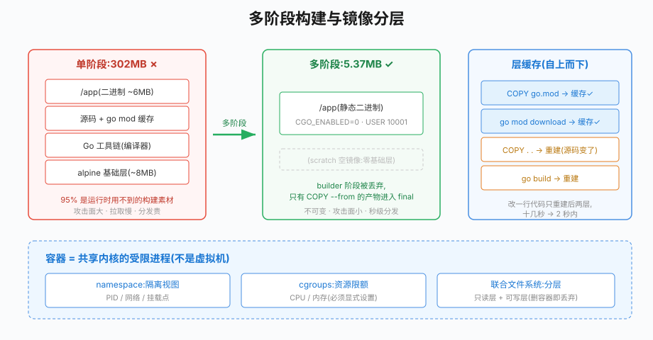

# 第33章 Docker实战

## 场景

第四阶段写完的电商微服务,部署一直是"ssh 到服务器 → git pull → go build → nohup 重启":

> "上周发版,一台机器构建时依赖下载失败,回滚花了 20 分钟。"

> "测试环境是 Go 1.24,我本机 1.25,同一个 bug 两边表现不一样。"

> "新同事入职第一天,光配环境就花了一下午。"

这三个问题的共同解法:**把应用和它的运行时环境打包成一个不可变的镜像**——构建一次,处处相同。

本章解决五个问题:

1. Go 应用怎么写出最小、安全的镜像?
2. 多阶段构建为什么能省 56 倍体积?
3. 多个容器怎么组成一个系统(compose 编排)?
4. 容器健康检查怎么做?scratch 镜像里的坑?
5. 生产镜像有哪些必须遵守的纪律?

> 代码:`33-docker/`,两个 example 全部实测。
>
> 前置:Docker 已安装(`docker version` 能看到 Server 版本)。

---

## 问题

传统部署方式的痛点:

- **环境漂移**:构建机、测试机、生产机的 Go 版本/系统库各不相同,"在我机器上是好的"
- **部署靠脚本**:git pull + build 的方式,构建失败、依赖损坏都可能发生在生产
- **不可回滚**:代码覆盖式部署,回滚等于再发一次
- **资源浪费**:每台机器手动配环境,依赖互相污染

容器把这三件事变成了**镜像问题**:

- Dockerfile 声明"怎么构建",产物是不可变镜像,天然可回滚(切回旧 tag)
- 镜像内自带运行时,环境绝对一致
- 构建发生在 CI(第38章),生产只做"拉镜像 → 起容器"

Go 是容器化收益最大的语言之一:静态编译、无运行时依赖,最终镜像可以小到几 MB。

---

## 实现

### 33.1 多阶段构建:302MB → 5.37MB

> 代码:`33-docker/example1-multistage/`

先看反面教材——单阶段构建(`Dockerfile.single`):

```dockerfile
# 反面教材:最终镜像里包含完整 Go 工具链、源码、模块缓存
FROM golang:1.25-alpine
WORKDIR /src
COPY . .
RUN CGO_ENABLED=0 go build -o /app .
ENTRYPOINT ["/app"]
```

构建结果是 **302MB**——里面 95% 是 Go 工具链和源码,运行时完全用不到。

多阶段构建(`Dockerfile`)把"构建环境"和"运行环境"分开:

```dockerfile
# ============ 阶段1:构建 ============
FROM golang:1.25-alpine AS builder
WORKDIR /src

# 先拷 go.mod/go.sum 再拷源码:依赖不变时,这一层走缓存,docker build 秒级完成
COPY go.mod go.sum* ./
RUN go mod download

COPY . .
# CGO_ENABLED=0:纯静态编译,不依赖 glibc,可跑在 scratch
# -trimpath:去掉本机路径,产物可复现
# -ldflags "-s -w":去掉符号表与调试信息,体积再减 30%
RUN CGO_ENABLED=0 go build -trimpath -ldflags "-s -w" -o /out/app .

# ============ 阶段2:运行 ============
FROM scratch        # 空镜像:最终镜像里只有我们的二进制
COPY --from=builder /out/app /app
EXPOSE 8080
USER 10001:10001    # 非 root 运行;scratch 无 /etc/passwd,直接写 UID
ENTRYPOINT ["/app"]
```

实测对比(同一份 Go 代码):

```
go-book-docker:single      302MB     ← 工具链+源码全在
go-book-docker:multistage  5.37MB    ← 只有一个静态二进制
```

逐行解释关键决策:

- **`CGO_ENABLED=0`**:Go 默认可能链接 CGO(如 net 包的 DNS 解析)。关掉后是纯静态二进制,能跑在 `scratch`(空镜像)里。这是 Go 容器化的第一原则
- **`COPY go.mod go.sum* ./` 在 `COPY . .` 之前**:Docker 每条指令是一层,改源码不会使"下载依赖"这层缓存失效。依赖不变时重新构建只要几秒
- **`go.sum*` 通配**:无依赖的小模块没有 go.sum,通配符避免构建失败
- **`USER 10001`**:容器默认以 root 运行是安全隐患(容器逃逸后就是宿主机 root)。scratch 没有 /etc/passwd,直接写数字 UID

运行验证:

```bash
$ docker build -t go-book-docker:multistage .
$ docker run -d --name go-book-app -p 8080:8080 go-book-docker:multistage
$ curl localhost:8080/healthz
ok
$ docker top go-book-app      # 确认进程 UID
UID     PID     CMD
10001   1874    /app
```

### 33.2 层缓存与 .dockerignore

镜像的每一层都是一个只读快照,`docker build` 会复用没有变化的层。利用好缓存的两条纪律:

1. **变化频率低的放前面**:依赖声明(go.mod)→ 依赖下载 → 源码 → 构建。改一行代码只重建最后两层
2. **`.dockerignore` 挡住无关文件**:`.git`、`*.md`、本地数据目录不进构建上下文——既加速构建,也避免把密钥/垃圾打进镜像

```text
# .dockerignore
.git
*.md
docker-compose*.yml
```

验证缓存效果:改一行 `main.go` 重新 build,日志里能看到 `go mod download` 层显示 `CACHED`,总耗时从十几秒降到 2 秒内。

### 33.3 docker compose:把容器组成系统

> 代码:`33-docker/example2-compose/`

单个容器只是进程,真实系统是"应用 + 依赖"的组合。docker compose 用一个 YAML 声明整组容器:

```yaml
services:
  app:
    build: .                      # 用当前目录 Dockerfile 构建
    ports:
      - "8081:8080"               # 宿主机 8081 -> 容器 8080
    environment:
      REDIS_ADDR: redis:6379      # 服务名当主机名!
    depends_on:
      redis:
        condition: service_healthy  # 等依赖"健康"而不是"进程存在"
    healthcheck:
      test: ["CMD", "/app", "-healthcheck"]
      interval: 5s
      timeout: 3s
      retries: 3

  redis:
    image: redis:8-alpine
    healthcheck:
      test: ["CMD", "redis-cli", "ping"]
      interval: 3s
      timeout: 3s
      retries: 5
```

三个值得咀嚼的设计:

- **服务名即主机名**:app 里连 `redis:6379` 而不是 IP。compose 给同一网络的容器内置 DNS,这也是 K8s Service 名字解析的原型(第35章)
- **`service_healthy` 才启动**:应用启动时 Redis 可能还没就绪。`depends_on` 只保证启动顺序,加 `condition: service_healthy` 才保证"依赖真正可用"。应用侧仍保留重试等待(双保险,不要赌基础设施时序)
- **healthcheck 定义健康**:间隔 5s、失败 3 次才标记 unhealthy。`docker compose ps` 能看到健康状态

实测(应用是 Redis 计数器服务):

```bash
$ docker compose up -d --build
$ docker compose ps
example2-compose-app-1     Up (healthy)
example2-compose-redis-1   Up (healthy)
$ curl localhost:8081/count
{"count":1,"redis":"redis:6379"}
$ curl localhost:8081/count
{"count":2,"redis":"redis:6379"}
```

---## 原理

## 原理

### 33.4.1 镜像分层与联合文件系统



> **图解**：左侧比较构建阶段与最终运行镜像，右侧展示 Dockerfile 指令形成的层和缓存复用。把变化少的依赖层放前面、源码层放后面，可以减少重复构建时间。

Docker 镜像由多个只读层堆叠,容器启动时在最上面加一个可写层:

```
容器可写层(丢弃即还原)
────────────────────
Dockerfile.layer5  ENTRYPOINT
Dockerfile.layer4  COPY --from=builder /out/app
Dockerfile.layer3  USER 10001
────────────────────
golang:1.25-alpine(builder 阶段,不进最终镜像)
```

三个推论:

- **层可缓存**:输入(Dockerfile 指令 + 拷贝的文件)不变,层直接复用——这是 33.2 缓存纪律的原理
- **层不可变**:镜像一旦构建,内容不会变。"修改配置文件"的旧式做法失效,必须重新构建镜像——不可变性正是回滚和一致性的来源
- **层可共享**:多个镜像共用同一基础层(如都基于 alpine),磁盘和拉取都省

### 33.4.2 容器是"受限的进程",不是虚拟机

`docker run` 做了什么:Linux 内核的 **namespace**(隔离视图:PID/网络/挂载点)+ **cgroups**(限额:CPU/内存)+ 联合文件系统,让一个进程"看起来"独占一台机器。

与虚拟机的本质区别:

| | 虚拟机 | 容器 |
|---|---|---|
| 内核 | 每个 VM 独立内核 | **共享宿主机内核** |
| 启动 | 分钟级 | 秒级(只是起一个进程) |
| 体积 | GB 级 | MB 级 |
| 隔离强度 | 强(硬件级虚拟化) | 中(共享内核,靠 namespace 隔离) |

理解"共享内核"很重要:容器内的 root 依赖内核的安全机制(user namespace、seccomp)才不等于宿主机 root,这正是 `USER 10001`、只读 rootfs 等纪律存在的原因。

### 33.4.3 为什么 Go 是容器的"天作之合"

- **静态编译**:CGO_ENABLED=0 后产物不依赖任何系统库,scratch/distroless 直接跑
- **单二进制**:没有"运行时 + 依赖树"(对比 Python 的 site-packages、Node 的 node_modules),镜像里没有意外的版本漂移
- **goroutine 调度不依赖容器 CPU 视图以外的机制**:但注意——Go 程序读 `GOMAXPROCS` 的历史行为是读 CPU 核数,容器 CPU limit 变化后不会自动感知(Go 1.25 已引入容器感知的 GOMAXPROCS)。K8s 部署时这直接影响吞吐,见第36章

---

## 最佳实践

### 33.5.1 镜像构建纪律

- **多阶段构建是默认**:builder 阶段随便用重的镜像,final 阶段用 scratch/distroless
- **固定版本,不用 latest**:`FROM golang:1.25-alpine` 而不是 `FROM golang`——latest 会漂移,今天和明天构建出的镜像不同,违反不可变原则
- **最小依赖安装**:alpine 里 `apk add --no-cache curl` 而不是先装后删(省一层)
- **镜像签名与扫描**:生产镜像过 `docker scout`/`trivy`(CVE 扫描)再推送;供应链安全从镜像开始
- **不把密钥打进镜像**:环境变量、K8s Secret(第36章)注入;`.dockerignore` 兜底防误拷

### 33.5.2 运行时纪律

- **非 root**:`USER 10001`;配合只读 rootfs(`--read-only`)更稳
- **显式资源限额**:compose 里 `deploy.resources.limits`、K8s 里 resources(第36章)——无限额的容器会吃光宿主机
- **健康检查必备**:liveness/readiness 的雏形;scratch 镜像没有 shell 工具,探针用应用自带子命令(33.3 的 `-healthcheck` 技法)
- **优雅退出**:容器收到 SIGTERM 要停接新流量、处理完存量再退出;`docker stop -t 10` 的 10 秒就是给优雅退出留的

### 33.5.3 compose 的定位

compose 适合**本地开发与集成测试**:一条命令拉起全套依赖。它不是生产编排工具——多机调度、自愈、滚动更新是 K8s 的职责(第34章起)。心法:**compose 管开发环境,K8s 管生产**,两者的 YAML 语义相近(compose 的服务名 ≈ K8s Service),迁移成本低。

---

## 排障

### 33.6.1 构建时报 `go.sum: not found`

`COPY go.mod go.sum ./` 在没有 go.sum 的模块上直接失败。用通配 `go.sum*`,或先本地 `go mod tidy` 生成后提交。注意:**有第三方依赖时 go.sum 必须进镜像**,否则构建不可复现。

### 33.6.2 scratch/alpine 镜像里程序起不来

两类典型错误:

- **`no such file or directory`**:CGO 没关,二进制动态链接了 glibc,而 scratch/alpine(musl)里没有。`CGO_ENABLED=0` 重编
- **证书错误**:HTTPS 调用报 `x509: certificate signed by unknown authority`——scratch 没有根证书。`COPY --from=builder /etc/ssl/certs/ca-certificates.crt /etc/ssl/certs/`(或改用 distroless)

### 33.6.3 healthcheck 一直 unhealthy

本章实测踩到的坑:scratch 里**没有 wget/curl**,`test: ["CMD", "wget", ...]` 永远失败。解法(按优先级):

1. 应用自带 healthcheck 子命令(33.3 技法,零依赖)
2. 换 distroless 镜像 + 内置 busybox 探针
3. 用 TCP 探测类工具镜像

排查命令:`docker inspect --format '{{json .State.Health}}' <容器>` 看 `Output` 字段的真实报错。

### 33.6.4 容器重启后数据丢了

容器可写层随容器删除而消失。`docker compose down` + `up` 后计数归零,就是这个原因——redis 容器没有挂载卷。给数据容器加卷:

```yaml
    volumes:
      - redis-data:/data
volumes:
  redis-data:
```

或者像本书 K8s 章节的做法:有状态服务(Redis/MySQL)用挂载,应用容器保持无状态。

### 33.6.5 端口映射了但连不上

按顺序查:容器起了吗(`docker ps` 的 STATUS)→ 端口映射方向对吗(`-p 8081:8080` 是宿主:容器)→ 应用监听的是 `0.0.0.0` 还是 `127.0.0.1`(容器内监听 127.0.0.1 时宿主机永远连不上,Go 里别写 `:8080` 以外的 localhost)→ 防火墙。

---

## 面试题

**Q1:多阶段构建为什么能减小镜像体积?**

A:构建工具链(Go 编译器、源码、模块缓存)只在 builder 阶段存在,final 阶段用 `COPY --from=builder` 只拷贝编译产物。Go 静态编译后 final 可以是 scratch,镜像从"工具链+源码+产物"缩小到"纯二进制"(实测 302MB → 5.37MB)。附带收益:运行时没有编译器与源码,攻击面更小。

**Q2:容器和虚拟机的区别?**

A:容器共享宿主机内核,用 namespace 隔离视图、cgroups 限制资源,本质是受限进程——秒级启动、MB 级体积、隔离强度中等。VM 硬件级虚拟化、独立内核,隔离强但重。容器逃逸类安全问题都源于共享内核,所以要非 root + 只读 rootfs 纵深防御。

**Q3:Docker 层缓存的原理?怎么利用?**

A:每条 Dockerfile 指令生成一层,层的内容可寻址缓存;输入(指令+文件)不变则复用。利用方式:低频变化的指令放前(依赖下载),高频的放后(源码拷贝、编译),配 .dockerignore 减少上下文噪声。实测改一行代码从十几秒降到 2 秒内。

**Q4:scratch、alpine、distroless 各适合什么场景?**

A:scratch 只有你的二进制,最小最安全,但没有任何调试工具、没有 CA 证书(要自己拷);alpine 有 shell 和包管理器,方便 exec 排查但体积大几 MB 且 musl 有 DNS 解析的历史差异;distroless 折中:有 libc/证书无 shell。原则:生产 scratch/distroless 为主,需要现场调试的场景加临时调试容器(k8s 的 ephemeral container)。

**Q5:容器的健康检查怎么做?为什么重要?**

A:compose 里 healthcheck + `service_healthy` 让依赖编排基于"真实健康"而非"进程存在";K8s 里演化为 liveness/readiness/startup 探针(第34章)。Go 服务的实践:应用自带 healthcheck 子命令(scratch 无工具)、探针检查真实依赖(如 Redis ping)、失败阈值和间隔按依赖恢复速度设置。

**Q6:怎么保证镜像构建的可复现?**

A:基础镜像固定版本+digest(`golang:1.25-alpine@sha256:...`)、`go.sum` 进镜像锁定依赖、`-trimpath` 消除路径差异、CI 里统一构建(第38章)而非开发机各自构建。可复现的意义:同一 commit 构建出的镜像二进制一致,安全审计和回滚才有锚点。

---

## 小结

本章把"应用如何打包"讲透:

1. **多阶段构建**:构建/运行分离,302MB → 5.37MB,`CGO_ENABLED=0` 是 Go 容器化第一原则
2. **层缓存**:依赖层前置 + .dockerignore,重建秒级
3. **compose 编排**:服务名 DNS、service_healthy 依赖、healthcheck 三件套
4. **原理**:分层/联合文件系统/不可变、容器=受限进程、Go 与容器的天然契合
5. **纪律**:固定版本、非 root、资源限额、优雅退出

**核心原则:**

> 镜像是一次性的、不可变的部署单元——它把"环境一致性"从运维问题变成构建问题。写 Dockerfile 时记住两个视角:构建时利用缓存求快,运行时最小化求安全。从下一章起,这些镜像将跑进 Kubernetes,compose 里学的"服务名解析、健康检查、依赖等待"都会在 K8s 里以更强的形态重现。

下一章进入 Kubernetes:容器只是起点,如何让几十上百个容器协同、自愈、伸缩,才是云原生的主战场。

---

## 参考资料

> 本章基于 **Docker Engine 29.5**、**golang:1.25-alpine**、**redis:8-alpine**、**docker compose v2**(Docker Desktop 内置)。命令行为以对应版本文档为准。

- Docker 官方文档:https://docs.docker.com/
- 多阶段构建:https://docs.docker.com/build/building/multi-stage/
- Compose 规范:https://compose-spec.io/
- distroless 镜像:https://github.com/GoogleContainerTools/distroless
- Go 官方容器指南:https://go.dev/doc/docker
- trivy 镜像漏洞扫描:https://trivy.dev/
