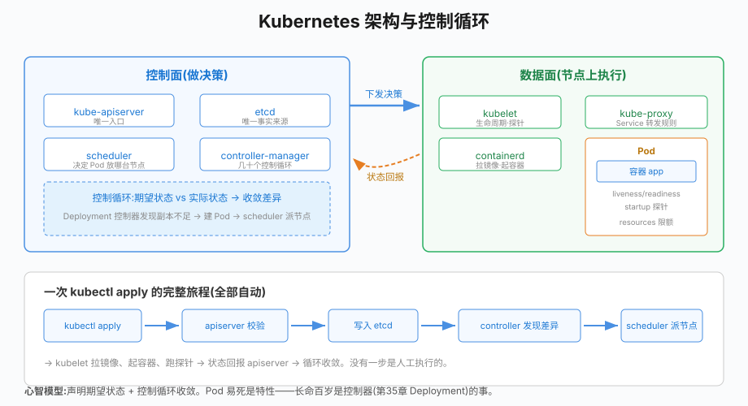

# 第34章 Kubernetes核心概念

## 场景

第33章的镜像已经就绪,但公司业务暴涨后,单机 compose 撑不住了:

> "双 11 凌晨,订单服务那台机器挂了,容器全灭,没有自动拉起——运维半夜手工救火。"

> "流量涨了 3 倍,扩容要登 8 台机器手动起容器;缩容又怕删错正在跑的。"

> "一个 Pod 占了 8G 内存没人管,整台机器都被拖垮了。"

单机容器编排(docker compose)的三大短板:**没有自愈**(容器挂了没人拉)、**没有调度**(不知道该放哪台机器)、**没有声明式状态**(只能一步步命令式操作)。

Kubernetes 解决的就是这三件事。本章用 minikube 单节点集群,把 K8s 最小的运行单元讲透。

本章解决五个问题:

1. K8s 的整体架构是什么?控制面和数据面各干什么?
2. Pod 是什么?为什么它是"鲸鱼群里的蜂箱"而不是"一个容器"?
3. 探针(liveness/readiness/startup)怎么用?
4. K8s 的自愈是怎么发生的?
5. resources 的 requests/limits 有什么讲究?

> 代码:`34-k8s-concepts/`,manifests + 1 个专用演示镜像,全部在 minikube(K8s v1.30)实测。
>
> ```bash
> minikube start --driver=docker          # 启动集群(第33章的 Docker 是驱动)
> kubectl get nodes                       # 确认 Ready
> minikube image load go-book-docker:multistage  # 把本地镜像喂进 minikube
> ```

---

## 问题

从 compose 到 K8s,需求升级对应能力升级:

| 需求 | compose | K8s |
|---|---|---|
| 容器挂了自动拉起 | ✗(restart 策略仅限本机 dockerd) | ✓ kubelet + 控制器 |
| 多机器调度 | ✗ 单机 | ✓ scheduler 按资源/亲和性分配节点 |
| 滚动更新/回滚 | ✗ 手工 | ✓ Deployment 内置(第35章) |
| 服务发现/负载均衡 | 单网络 DNS | Service/Ingress(第35章) |
| 配置/密钥管理 | env 文件 | ConfigMap/Secret(第36章) |
| 声明式 API | ✗ | ✓ 一切皆对象,desired state 驱动 |

K8s 的核心设计是**声明式 + 控制循环**:你提交"期望状态"(YAML 里的 `spec`),K8s 的各种控制器持续比较"期望 vs 实际",不断把实际状态向期望状态收敛。这不是命令式脚本("启动 3 个容器"),而是"维持 3 个副本"的持续承诺。

---

## 实现

### 34.1 架构:控制面与数据面



> **图解**：kubectl 把期望状态提交到 API Server 并存入 etcd；控制面计算差异，调度器选节点，节点 kubelet 创建容器并回报状态，形成持续收敛的控制循环。

- **控制面**(control plane,做出决策):
  - **kube-apiserver**:唯一入口。kubectl 的所有命令都是对它的 REST 调用;一切对象(etcd 里的数据)经它读写
  - **etcd**:集群的唯一事实来源,存所有对象的期望状态
  - **kube-scheduler**:决定新 Pod 放哪个节点(看 resources、亲和性、污点)
  - **kube-controller-manager**:跑着几十个控制器(Deployment、Node、Job……),每个都是一个控制循环
- **数据面**(每个节点上,执行决策):
  - **kubelet**:节点代理,管理本节点的容器生命周期、执行探针
  - **kube-proxy**:维护 Service 的转发规则(iptables/IPVS)
  - **容器运行时**(containerd):真正拉镜像、起容器

一次 `kubectl apply` 的完整旅程:提交 YAML → apiserver 校验入库(etcd)→ Deployment 控制器发现"期望 1 个 Pod,实际 0 个"→ 创建 Pod 对象 → scheduler 给它挑节点 → 目标节点的 kubelet 拉镜像、起容器、跑探针 → 状态回报 apiserver。**没有一步是人手动做的**。

### 34.2 Pod:最小可运行单元

> 代码:`34-k8s-concepts/manifests/pod.yaml`

Pod 是 K8s 的最小调度单元——**一个或多个容器的组合**,共享网络(同一 IP)和存储:

```yaml
apiVersion: v1
kind: Pod
metadata:
  name: pod-demo
  labels:
    app: demo        # 标签:一切关联(Service/Deployment)都靠它
spec:
  containers:
    - name: app
      image: go-book-docker:multistage
      imagePullPolicy: IfNotPresent
      ports:
        - containerPort: 8080
```

实测 Pod 的生命周期:

```
$ kubectl apply -f pod.yaml && kubectl get pods -w
NAME       READY   STATUS              AGE
pod-demo   0/1     Pending             0s    # 调度中
pod-demo   0/1     ContainerCreating   0s    # 拉镜像/建容器
pod-demo   1/1     Running             1s    # 就绪
```

两个必知的本质:

- **Pod 是易死的**:没有控制器管它,删了就没了(实测验证:`kubectl delete pod` 后不重建),节点故障它也不会搬家。"自愈"是**控制器**(下一章的 Deployment)给的,不是 Pod 自带的
- **为什么不是"容器"而是"Pod"**:一个 Pod 里的多个容器共享 localhost,适合"主容器 + 边车"(日志收集、代理)。绝大多数场景一个 Pod 一个容器即可

常用排障三件套(第40章的肌肉记忆从这里开始):

```bash
kubectl logs pod-demo          # 看日志(stdout/stderr)
kubectl exec pod-demo -- ls /  # 进容器执行命令
kubectl describe pod pod-demo  # 事件流:调度、拉镜像、探针失败全在这
```

### 34.3 探针:三个问题三张票

> 代码:`34-k8s-concepts/manifests/probes.yaml`

探针是 kubelet 定期对容器做的"体检",三种各司其职:

```yaml
startupProbe:      # ① 启动了吗?(给慢启动的应用留时间,通过前不跑 liveness)
  httpGet: {path: /healthz, port: 8080}
  periodSeconds: 2
  failureThreshold: 30       # 最多等 60s
readinessProbe:    # ② 能接流量吗?(不过 -> 从 Service endpoints 摘除,不重启)
  httpGet: {path: /healthz, port: 8080}
  periodSeconds: 5
livenessProbe:     # ③ 还活着吗?(失败 -> 重启容器,自愈的核心)
  httpGet: {path: /healthz, port: 8080}
  periodSeconds: 5
  failureThreshold: 3        # 连续 3 次失败才动手,防抖动误杀
```

口诀:**readiness 管"给不给流量",liveness 管"要不要重启"**。混用的后果:依赖未就绪(如数据库还没起)时用 liveness 判断,会把所有 Pod 陷入重启循环——这正是 CrashLoopBackOff 的常见成因(第40章细讲)。

探针方式除了 httpGet 还有 tcpSocket(只测端口通)、exec(执行命令看退出码)。原则:**探针要便宜且只反映容器自身健康**,别在探针里查数据库——依赖故障会滚雪球。

### 34.4 自愈实录:liveness 拉起假死应用

> 代码:`34-k8s-concepts/example1-pod/`、`manifests/selfheal.yaml`

口说无凭,做一个"会假死"的应用:`FLAKY=1` 时 `/healthz` 每隔 30 秒阻塞 20 秒(模拟死锁/泄漏),liveness 探针(超时 1s)必然失败:

```go
mux.HandleFunc("/healthz", func(w http.ResponseWriter, _ *http.Request) {
	if flaky.Load() {
		time.Sleep(10 * time.Second) // 假死:探针超时 => 判定失败
	}
	_, _ = w.Write([]byte("ok"))
})
```

打进镜像(`go-book-docker:flaky`)部署后,90 秒实录:

```
NAME       READY   STATUS              RESTARTS   AGE
selfheal   1/1     Running             0          0s
selfheal   1/1     Running             1 (1s ago)   17s   ← 第一次假死,探针失败,自动重启
selfheal   1/1     Running             2 (1s ago)   32s
selfheal   1/1     Running             3 (1s ago)   47s
selfheal   0/1     CrashLoopBackOff    3 (1s ago)   62s   ← 重启太频繁,进入退避
selfheal   1/1     Running             4 (26s ago)   87s
```

`kubectl describe` 里的证据链:

```
Last State:  Terminated
Reason:      Error
Exit Code:   2
Restart Count: 4
```

三个收获:

- **自愈闭环**:应用假死 → 探针失败 → kubelet 重启容器 → 恢复。全程无人值守
- **CrashLoopBackOff 不是错误,是保护**:重启间隔按 10s、20s、40s…指数退避(上限 5 分钟),防止坏应用无限快速重启拖垮节点。看到它先查 `describe` 的 Last State,别上来就 delete
- **重启 = 容器重建**:进程状态全丢,所以应用必须"无状态可重启"(内存里的数据要么持久化,要么允许丢)

### 34.5 resources:调度与限流的依据

> 代码:`probes.yaml` 尾部

```yaml
resources:
  requests:   # 调度承诺:scheduler 保证节点上至少有这么多
    cpu: 50m      # 500 毫核(0.05 核)
    memory: 32Mi
  limits:     # 硬顶:CPU 超限被限流(节流),内存超限被 OOMKill
    cpu: 200m
    memory: 64Mi
```

- **requests 决定"放哪"**:scheduler 只把 Pod 放进"剩余 requests 够用"的节点。所有 Pod 的 requests 之和决定节点承载密度
- **limits 决定"能跑到多猛"**:CPU 超限被节流(变慢,进程不死);内存超限直接 OOMKill(容器被杀,表现就是 RESTARTS 增长)
- 生产铁律:**requests ≈ 常态用量,limits 留突发余量**。requests 写太小会导致节点超卖,宿主机内存耗尽时 kubelet 优先驱逐"用量超过 requests"的 Pod

---

## 原理

### 34.6.1 声明式与控制循环

K8s 的一切都是"期望状态 + 控制循环":

```
用户提交 spec(期望) ──► etcd ──► 控制器 watch 到变化
                                      │
        实际状态 ◄── kubelet 执行 ◄── 计算差异(diff)
              │                        │
              └──── 状态回报 apiserver ─┘
```

每类资源配一个控制器,循环永不停歇:Deployment 控制器管副本数、Node 控制器管节点健康、Job 控制器管任务完成。这个设计的深远意义:**系统会自我修复**——任何偏离期望的状态(容器崩溃、节点宕机、误删)都会被下一个循环纠正。第35章的滚动更新/回滚,本质就是修改期望状态后让循环收敛。

### 34.6.2 探针的执行位置

探针是 **kubelet 在节点本地执行**的:HTTP 探针从节点网络栈发起,不经过 Service。这解释了两个现象:

- 探针挂了不影响别的 Pod 的流量(readiness 只是把自己从 endpoints 摘掉)
- 探针超时要明显小于 `periodSeconds`,否则一次慢查询就能占满整个探测周期

### 34.6.3 CrashLoopBackOff 的退避算法

重启退避从 10 秒起,每次翻倍,上限 5 分钟;期间只要有一次探针成功且容器稳定运行(默认 10 分钟),退避计时重置。这是 kubelet 对"坏应用"的保护:避免无限快速重启的 CPU/日志风暴。第40章的排障口诀"先 describe 再 delete"就源于此——直接 delete 只是重置退避,掩盖了故障根因。

---

## 最佳实践

### 34.7.1 Pod 使用纪律

- **不要裸跑 Pod**:没有自愈、没有滚动更新。生产一律用 Deployment(第35章);Pod 只用于调试(临时 exec 容器)和特殊控制器(Jobs/DS)
- **标签规划先行**:`app`、`version`、`env` 三个标签是 Service 选择器、监控聚合、灰度发布的地基,后补很痛
- **resources 必填**:没有 requests 的 Pod 是调度系统的"黑箱",节点超卖和 OOM 的头号来源
- **镜像策略**:生产用固定 tag 或 digest;`latest` 配 `IfNotPresent` 会让各节点版本不一致,配 `Always` 则每次调度都可能拉镜像(慢且不可控)

### 34.7.2 探针配置

- 探针只测自身,不测依赖(数据库挂了不该让全部 Pod 被 liveness 重启)
- liveness 的 `failureThreshold × periodSeconds` 要大于应用的最长恢复时间(如 GC 停顿),防误杀
- 慢启动应用必须有 startupProbe,否则启动期间被 liveness 杀进 CrashLoopBackOff
- readiness 与 liveness 的路径可以不同:readiness 查"能不能服务"(可含依赖检查),liveness 只查"进程没死锁"

### 34.7.3 本地开发心法

minikube 三板斧贯穿后续章节:

```bash
minikube image load <镜像>       # 本地镜像喂进集群(省 registry)
kubectl apply -f xxx.yaml       # 声明式提交
kubectl get pods -w             # 流式观察状态变化
```

`minikube image load` 解决了"本地构建的镜像集群拉不到"的问题(没有远端 registry 时);第38章会换成正规做法:CI 推镜像到 registry。

---

## 排障

### 34.8.1 Pod 一直 Pending

`scheduler` 没找到能放它的节点。`kubectl describe pod` 看 Events 末尾,常见原因:

- `Insufficient cpu/memory`:节点资源不够(或 requests 写太大)
- `node(s) had untolerated taint`:节点有污点(如 master 默认不跑业务 Pod)
- PersistentVolumeClaims 未绑定:存储还没就绪(第37章)

### 34.8.2 ImagePullBackOff

镜像拉不下来。describe 看 `Failed to pull image` 的具体原因:

- 镜像名拼错 / tag 不存在
- 私有仓库没配 `imagePullSecrets`
- minikube 本地镜像没 load(本书示例的解法见 34.7.3)

### 34.8.3 CrashLoopBackOff

先 `kubectl describe pod` 看 **Last State 的 Exit Code**,再 `kubectl logs --previous` 看上一次崩溃前的日志:

- Exit 1 且日志有 panic:应用代码问题
- Exit 137(=128+9,OOMKilled):内存超 limit,调大 limits 或排查泄漏
- 探针失败型:回看 34.3 的混用口诀

### 34.8.4 Pod Running 但流量打不进去

多半是 readiness 没过:`kubectl describe pod` 里 `Readiness probe failed`。Pod 正常 Running 但 READY 显示 `0/1` 就是从 endpoints 摘除了——检查应用是否监听了 `0.0.0.0`(第33章的老坑在 K8s 里同样存在)。

---

## 面试题

**Q1:Pod 是什么?和容器的区别?**

A:Pod 是 K8s 最小调度单元,包含一个或多个共享网络/存储的容器。容器是 Docker 层面的概念,Pod 是调度层面的封装——同 Pod 容器共享 localhost 与 volume,作为整体被调度、伸缩、销毁。多数场景一 Pod 一容器;多容器适合边车模式(日志/代理)。

**Q2:K8s 的架构组件及职责?**

A:控制面:apiserver(唯一入口)、etcd(唯一事实来源)、scheduler(调度决策)、controller-manager(各类控制循环)。数据面(每节点):kubelet(容器生命周期与探针)、kube-proxy(Service 转发)、containerd(运行时)。关键理解:一切经 apiserver,状态存 etcd,控制器收敛差异。

**Q3:liveness、readiness、startup 探针的区别?**

A:liveness 失败重启容器(自愈);readiness 失败摘除流量不重启(等待依赖);startup 给慢启动留时间(通过前暂停 liveness)。口诀:readiness 管流量,liveness 管重启。混用会导致依赖故障引发全量重启循环。

**Q4:K8s 的自愈是怎么实现的?**

A:两层:kubelet 层的探针重启(liveness 失败重建容器),控制器层的重建(Deployment 发现副本数不足,补建 Pod,甚至换节点)。另外 CrashLoopBackOff 的指数退避防止坏应用无限重启。演示实录:假死应用 90 秒内被 liveness 自动重启 4 次。

**Q5:requests 和 limits 分别影响什么?**

A:requests 是调度承诺与记账单位(scheduler 按它选节点、超卖判断),limits 是运行硬顶(CPU 超限节流,内存超限 OOMKill)。生产建议 requests≈常态用量、limits 留余量;不设 limits 只设 requests 会无限抢占,节点超卖。

**Q6:为什么生产不直接跑裸 Pod?**

A:裸 Pod 没有控制器:节点故障不重建、删了不恢复、更新要手工。控制器(Deployment)提供副本保持、滚动更新、回滚。Pod 适合调试和 Job 类一次性任务,长期运行的服务一律 Deployment(下一章)。

---

## 小结

本章搭建了 K8s 的概念地基:

1. **架构**:控制面决策(apiserver/etcd/scheduler/controllers)、数据面执行(kubelet/proxy/runtime)
2. **Pod**:最小单元、易死、无自愈;标签是关联一切的地基
3. **探针**:readiness 管流量、liveness 管重启、startup 护航慢启动
4. **自愈实录**:假死应用 90 秒被自动重启 4 次,亲历 CrashLoopBackOff 退避
5. **resources**:requests 调度、limits 硬顶,生产必填

**核心原则:**

> K8s 的心智模型是"声明期望状态 + 控制循环收敛":你不再命令系统做什么,而是告诉它"应该是什么样"。Pod 是易死的——这是特性不是缺陷,长命百岁是控制器的事。探针和 resources 是 Pod 质量的两道门槛:探针定生死,resources 定调度与限额。

下一章把 Pod 升级成 Deployment:副本管理、滚动更新、回滚、扩缩容,以及流量入口 Service。

---

## 参考资料

> 本章基于 **minikube v1.33**、**Kubernetes v1.30**、**kubectl v1.31**。API/字段以对应版本官方文档为准。

- Kubernetes 概念:Pod:https://kubernetes.io/docs/concepts/workloads/pods/
- 探针配置:https://kubernetes.io/docs/tasks/configure-pod-container/configure-liveness-readiness-startup-probes/
- 资源管理:https://kubernetes.io/docs/concepts/configuration/manage-resources-containers/
- minikube 入门:https://minikube.sigs.k8s.io/docs/start/
- kubectl 速查:https://kubernetes.io/docs/reference/kubectl/cheatsheet/
