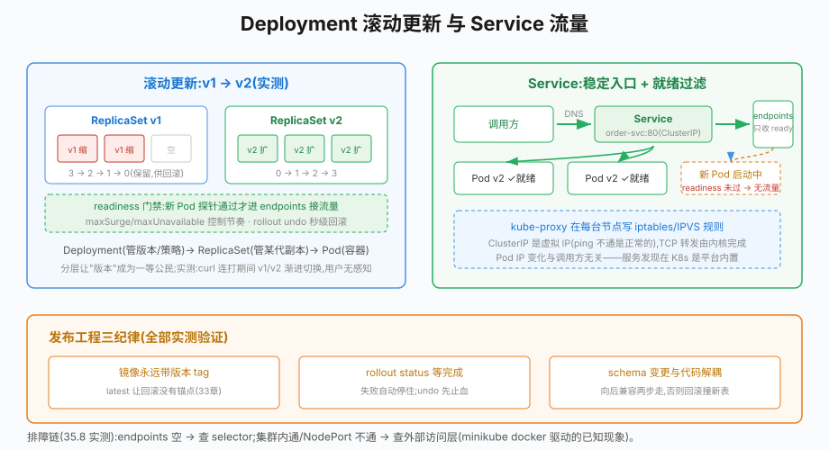

# 第35章 Deployment与Service

## 场景

第34章结尾说"Pod 易死是特性,长命百岁靠控制器"。现在把承诺兑现:

> "订单服务 3 个副本,其中 1 个所在节点挂了——谁负责补一个新实例?"

> "发新版能不能不中断服务?老版本有 bug,10 秒内回到上一版。"

> "流量涨了先扩到 10 个副本,过了峰值缩回来,能不能一条命令搞定?"

> "3 个 Pod 的 IP 一直在变,调用方写谁?其中 1 个还没就绪,流量会不会打过去?"

这四个问题分别对应本章的主角:**Deployment**(副本/自愈/滚动/回滚/伸缩)和 **Service**(稳定入口/负载均衡/就绪过滤)。

> 代码:`35-deployment-service/`,两个 manifest + 版本化演示镜像,全部 minikube 实测。

---

## 问题

裸 Pod 的四个无法胜任:

- **无自愈**:删了就没了(第34章实测),节点故障不搬家
- **无更新策略**:换镜像 = 手删重建,中断服务
- **无批量语义**:10 个副本要写 10 个 YAML、管 10 个 Pod
- **无稳定入口**:Pod IP 随重建变化,调用方无法配置

Deployment 提供**副本集管理 + 更新编排**,Service 提供**稳定的虚拟入口**。两者靠 label selector 关联——这是 K8s 对象协作的基本范式。

---

## 实现

### 35.1 Deployment:声明副本,控制器兜底

> 代码:`35-deployment-service/manifests/deployment.yaml`

```yaml
apiVersion: apps/v1
kind: Deployment
metadata:
  name: order
spec:
  replicas: 3                    # 期望副本数
  selector:
    matchLabels:
      app: order                 # 认领哪些 Pod(必须与 template 一致!)
  template:
    metadata:
      labels:
        app: order
    spec:
      containers:
        - name: app
          image: go-book-docker:order-v1
          readinessProbe:        # 没就绪的 Pod 不接流量
            httpGet: {path: /healthz, port: 8080}
            periodSeconds: 3
          resources:
            requests: {cpu: 50m, memory: 32Mi}
            limits:   {cpu: 200m, memory: 64Mi}
```

`selector.matchLabels` 与 `template.metadata.labels` 必须一致——这是 Deployment 认领 Pod 的唯一凭据,写错的话控制器"看不到"自己创建的 Pod,报 `selector does not match template labels`。

**自愈实测**:删掉一个 Pod,几秒内副本数自动回到 3:

```
$ kubectl get pods -l app=order --no-headers | wc -l   # 3
$ kubectl delete pod order-77984d8d7c-ch9w2
$ kubectl get pods -l app=order --no-headers | wc -l   # 依然是 3(新 Pod 顶替)
```

**扩缩容实测**:`kubectl scale deploy order --replicas=5`,4 秒后 5 个 Pod 就绪;缩回 1 也只需一条命令。生产上不会用命令式 scale,而是改 YAML 里的 replicas 再 apply(声明式,可审计)——或交给 HPA 自动伸缩(本章小结提)。

### 35.2 Service:稳定的虚拟入口

> 代码:`manifests/service.yaml`

Pod IP 会变,Service 给一组 Pod 一个**不变的虚拟 IP + DNS 名**:

```yaml
apiVersion: v1
kind: Service
metadata:
  name: order-svc
spec:
  type: ClusterIP            # 集群内入口(默认)
  selector:
    app: order               # 圈住带这个标签的"当前活着且就绪"的 Pod
  ports:
    - port: 80               # Service 端口
      targetPort: 8080       # 转发到容器端口
```

`kubectl get endpoints` 能看到 Service 实际圈住的 Pod:

```
NAME        ENDPOINTS
order-svc   10.244.0.35:8080,10.244.0.36:8080,10.244.0.37:8080
```

三个关键机制:

- **endpoints 自动维护**:Pod 创建/死亡/未就绪,列表实时增减。readiness 没过的 Pod 不会出现在这里——流量过滤靠它
- **DNS**:同 namespace 内直接用 `order-svc` 访问;跨 namespace 用 `order-svc.<ns>.svc.cluster.local`。第27章 etcd 手写的服务发现,在这里是内置能力
- **负载均衡**:ClusterIP 由 kube-proxy 在每个节点写 iptables/IPVS 规则实现(随机转发),不是额外的代理进程

集群内实测:

```
$ kubectl run ct --rm -i --restart=Never --image=curlimages/curl -- -s http://order-svc/info
{"uptime":"1m49s","version":"v1"}
```

### 35.3 滚动更新与回滚

> 演示镜像:`34-k8s-concepts/example1-pod/`,`-ldflags "-X main.version=v2"` 构建出 order-v2,`/info` 返回版本号

改镜像触发滚动更新:

```bash
$ kubectl set image deploy/order app=go-book-docker:order-v2
$ kubectl rollout status deploy/order --timeout=60s
deployment "order" successfully rolled out
```

背后发生的事:Deployment 创建**新 ReplicaSet**(v2),先扩 1 个新 Pod → 等它 readiness 通过 → 缩 1 个旧 Pod → 循环,直到新 RS 到 3、旧 RS 到 0。`maxSurge`(默认 25%,可多建)、`maxUnavailable`(默认 25%,可少活)控制节奏。

期间用 `curl` 连打 Service,能看到 v1/v2 渐进切换——**用户无感知**,因为每个新 Pod 都过了 readiness 才接流量。

回滚一条命令(秒级):

```bash
$ kubectl rollout undo deploy/order
$ kubectl rollout status deploy/order
deployment "order" successfully rolled out
$ kubectl get pods -o jsonpath='{range .items[*]}{.spec.containers[0].image}{"\n"}{end}'
go-book-docker:order-v1    # 全部回到 v1
go-book-docker:order-v1
go-book-docker:order-v1
$ kubectl rollout history deploy/order   # 每次变更有版本号
```

回滚的原理:旧 ReplicaSet 一直保留(默认 10 份历史),undo 就是把期望状态指回旧 RS。**前提是镜像 tag 可区分**——用 `latest` 的话回滚了也不知道滚到哪,这也是第33章"不用 latest"纪律的原因。

### 35.4 Service 的三种类型

| 类型 | 访问范围 | 用途 |
|---|---|---|
| ClusterIP(默认) | 集群内 | 服务间调用(本书微服务全部用它) |
| NodePort | 节点 IP:端口(30000-32767) | 临时演示/调试 |
| LoadBalancer | 云厂商 LB 外部 IP | 生产对外入口(云环境) |

流量从外部到 Pod 的完整链路:用户 → LoadBalancer(云 LB)→ NodePort → kube-proxy 规则 → Pod。生产入口更常见的形态是 **Ingress**(L7 路由,按域名/路径转发),本书篇幅取舍只在正文提概念——对外网关在第38章 CI/CD 部署时再实战。

### 35.5 实测记录:NodePort 打不通的一次

> 这是本章实验中真实踩到的环境坑,如实记录排查过程(它就是第40章的方法论预演)。

现象:minikube(docker 驱动)里 NodePort 已分配(`30421`),endpoints 正常,但宿主机 `curl 192.168.49.2:30421` TCP 能连、请求超时。

排查:① endpoints 有 IP → Pod 层正常;② 集群内 `kubectl run curl` 访问 `order-svc` 正常 → Service/kube-proxy 正常;③ 问题锁定在"宿主机 → minikube 虚拟网络"这一段——docker 驱动的 minikube 走的是容器网络,NodePort 的 iptables 规则对宿主机不一定可达。

解法:开发环境用 `kubectl port-forward svc/order-svc 18080:80`(本地端口直通 Service,稳定);要对外展示用 `minikube service order-svc`(自动开隧道)。生产 K8s 不存在这个问题——节点是真实的。

---
## 原理

### 35.6.1 Deployment → ReplicaSet → Pod 三层结构



> **图解**：Deployment 管理 ReplicaSet，ReplicaSet 维持 Pod 副本；Service 通过 selector 找到就绪的 Pod 并提供稳定入口。更新时新旧 ReplicaSet 并存，readiness 决定新 Pod 何时进入流量池。

```
Deployment(order)                # 管版本与更新策略
  └── ReplicaSet(order-v1)       # 管某一代的精确副本数(3)
        ├── Pod 1                # 真正的容器
        ├── Pod 2
        └── Pod 3
  └── ReplicaSet(order-v2:0)     # 滚动更新时新代,旧代缩到 0 但保留(回滚用)
```

每一层只干一件事:Deployment 管"哪一代该有多少",ReplicaSet 管"这一代的 Pod 活着几个",Pod 管容器。滚动更新 = 新旧两代 RS 的副本数此消彼长;回滚 = 把流量指回旧代。**分层让"版本"成为一等公民**——这是裸 Pod、甚至裸 ReplicaSet 都做不到的。

### 35.6.2 Service 的转发实现

Service 不是进程,是 apiserver 里的一条规则;真正干活的是每台节点的 **kube-proxy**:

- 监听 Service/Endpoints 变化 → 在节点上写 iptables/IPVS 规则
- 访问 ClusterIP 的包在节点上被 DNAT 改写目的地址,直接发往某个后端 Pod
- Endpoints 由专门的控制器维护(只收"ready"的 Pod),所以 readiness 探针是流量过滤的开关

这个设计解释了一个反直觉的事实:Service 的 ClusterIP 通常 ping 不通(ICMP 不走规则),但 TCP 一定通——排查时用 curl,不要用 ping。

### 35.6.3 就绪门禁:readiness 在发布里的角色

滚动更新"无感知"的关键链条:新 Pod 容器进程已启动 ≠ 能服务(可能还在初始化连接池)。readinessProbe 不过 → 不进 endpoints → Service 不转发。配合 `maxUnavailable=0`(激进)可实现零中断发布;代价是发布变慢——节奏与安全的权衡写进 spec 的 `strategy` 字段。

---

## 最佳实践

### 35.7.1 Deployment 配置

- **selector/template 标签必须严格一致**,且 selector 一旦上线不可改(它定义了控制器对既有 Pod 的所有权)
- **更新策略显式化**:`strategy.rollingUpdate.maxSurge/maxUnavailable` 按业务容忍度设;发布敏感服务用 `maxUnavailable: 0`
- **revisionHistoryLimit**(默认 10)保留够回滚用即可,太大刷屏
- 镜像永远带版本 tag;变更记录用 `kubectl rollout history` + CI 注释(第38章)

### 35.7.2 Service 配置

- 内部调用一律 ClusterIP + DNS 名,不要硬编码 Pod IP
- `port` 与 `targetPort` 语义不同:port 是调用方看到的,targetPort 是容器实际监听的;命名端口(targetPort 可写名字)可减少改错
- 会话保持(`sessionAffinity: ClientIP`)只在真正需要时开——默认随机转发才是负载均衡的意义
- 对外入口生产用 Ingress/网关,NodePort/LoadBalancer 的适用边界见 35.4

### 35.7.3 发布纪律

- 发布前跑 `kubectl apply --dry-run=server` 让 apiserver 先校验
- 发布后 `kubectl rollout status` 等待完成再宣布成功,失败自动停住(不会滚一半没人管)
- 回滚救急、根因靠日志:`rollout undo` 是止血药,不是治疗方案
- 数据库 schema 变更要与代码发布解耦(向后兼容两步走),否则回滚代码会撞坏新表结构——这是滚动更新体系里最容易翻车的一点

---

## 排障

### 35.8.1 Service 访问不通的排查链

固定五步(本章实测验证过):

1. `kubectl get endpoints <svc>` ——空?看 selector 是否匹配 Pod 标签
2. endpoints 有但连接失败 → Pod 本身:`kubectl get pods -l <selector>` + 探针状态
3. 集群内 curl `svc名` 通、NodePort 不通 → 外部访问层问题(见 35.5)
4. DNS 解析失败 → 检查 namespace 与 CoreDNS:`kubectl get pods -n kube-system | grep coredns`
5. 都正常但偶发失败 → 看是不是个别 Pod 未就绪被摘除后流量集中,或连接池没复用

### 35.8.2 滚动更新卡住

`kubectl rollout status` 长时间不动,`kubectl get pods` 看新 Pod 状态:

- 新 Pod Pending → 资源不够(第34章)
- 新 Pod Running 但 READY 0/1 → readiness 失败,看应用日志;十有八九是新版本连不上依赖(配置没同步、数据库没升级)
- ImagePullBackOff → 镜像 tag 不存在(拼写/没推送)

处理:`kubectl rollout undo` 先回滚止损,再修新版本。

### 35.8.3 回滚后服务仍异常

- 回滚的是 Deployment,不是数据库/缓存:如果新版本写过数据,回滚代码未必兼容(见 35.7.3)
- 回滚完成但 Pod 还是新镜像 → 确认 `rollout status` 是否真的完成;imagePullPolicy 是 IfNotPresent 且 tag 相同时,节点可能用旧缓存(镜像 tag 复用的坑)

### 35.8.4 扩容后新 Pod 一直不 Ready

新 Pod 与老 Pod 不可互换的典型:实例有本地状态(内存缓存、本地文件)、启动时强依赖预热。解决方向:把状态外置(Redis/DB)、启动预热拆分、或用 StatefulSet(有状态负载专用,本书点到为止)。

---

## 面试题

**Q1:Deployment、ReplicaSet、Pod 三者的关系?**

A:Deployment 管版本与发布策略,操纵 ReplicaSet;ReplicaSet 管某一代的副本数,操纵 Pod;Pod 是真正跑容器的单元。滚动更新是新旧 RS 副本数此消彼长,回滚是把期望指回旧 RS。分层使"版本"成为一等公民。

**Q2:Service 的 ClusterIP 是怎么实现负载均衡的?**

A:Service 是 apiserver 里的规则对象,kube-proxy 监听其变化并在每台节点写 iptables/IPVS 规则;访问 ClusterIP 的包被 DNAT 到某个就绪的 Pod。endpoints 只收 readiness 通过的 Pod,所以探针是流量过滤开关。Service 不是代理进程,没有单点。

**Q3:滚动更新的原理?如何做到无感知发布?**

A:创建新代 ReplicaSet,按 maxSurge/maxUnavailable 节奏扩新缩旧,每个新 Pod readiness 通过后才接流量(endpoints 过滤),全部就绪后旧代归零(保留用于回滚)。无感知的关键 = readiness 门禁 + 健康的启动 + 兼容的数据变更。

**Q4:滚动更新和回滚时要注意什么?**

A:镜像 tag 可区分(禁 latest);`rollout status` 等待完成;失败先 undo 止血;数据库 schema 向后兼容、与代码发布解耦;revisionHistoryLimit 留够历史;imagePullPolicy 与 tag 复用的坑(同 tag 更新内容,节点可能用旧缓存)。

**Q5:一个 Pod 重启后 IP 变了,调用方怎么不受影响?**

A:调用方永远面向 Service(DNS 名 + ClusterIP),kube-proxy 维护它到当前就绪 Pod 的转发。Pod IP 只在 endpoints 内部使用。这也是"服务发现"在 K8s 里的原生形态——第27章 etcd 手写的那套,在这里是平台内置。

**Q6:NodePort 和 LoadBalancer 的区别?生产对外用什么?**

A:NodePort 在每个节点开 30000-32767 端口,适合演示;LoadBalancer 在云上创建外部负载均衡器指向 NodePort,适合云生产;更常见的生产入口是 Ingress(按域名/路径做 L7 路由,一张证书管多个服务)。本地 minikube 的 NodePort 受容器网络限制,常直接 port-forward。

---

## 小结

本章把"服务如何长期运行"补完:

1. **Deployment**:selector 认领 Pod、自愈实测、scale 扩缩、滚动更新、秒级回滚
2. **Service**:稳定虚拟入口、endpoints 实时过滤就绪 Pod、kube-proxy 转发
3. **发布工程**:maxSurge/maxUnavailable 节奏、readiness 门禁、schema 解耦
4. **实测踩坑**:minikube docker 驱动 NodePort 不通的五步排查链(35.5)
5. **原理**:三层结构各司其职、转发规则的落地方式、就绪门禁在发布中的角色
6. **延伸**:命令式 `scale` 之外,生产扩缩容首选改 YAML 声明式提交;按指标自动伸缩用 HPA(CPU/内存阈值驱动 replicas),本书点到为止,思路与本章一致——仍是"改期望状态,控制器收敛"

**核心原则:**

> Deployment 解决"状态保持",Service 解决"寻址稳定",两者用 label selector 连接——这套"控制器 + 选择器"的组合拳贯穿整个 K8s。发布的一切安全感来自两处:readiness 门禁挡住"没准备好"的流量,保留的旧 ReplicaSet 撑起秒级回滚。而所有这些的前提,仍是第33章的不可变镜像与第34章的探针纪律。

下一章解决部署里的两类特殊数据:不敏感的配置(ConfigMap)与敏感的凭据(Secret),它们如何注入容器、如何热更新、有哪些安全边界。

---

## 参考资料

> 本章基于 **minikube v1.33**、**Kubernetes v1.30**。API 字段以对应版本文档为准。

- Deployment 概念:https://kubernetes.io/docs/concepts/workloads/controllers/deployment/
- Service 概念:https://kubernetes.io/docs/concepts/services-networking/service/
- 滚动更新策略:https://kubernetes.io/docs/concepts/workloads/controllers/deployment/#rolling-update-deployment
- kubectl rollout 命令:https://kubernetes.io/docs/reference/generated/kubectl/kubectl-commands#rollout
- Service/DNS 规范:https://kubernetes.io/docs/concepts/services-networking/dns-pod-service/
