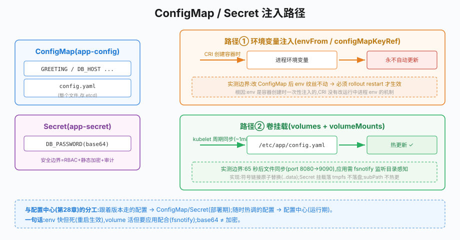

# 第36章 ConfigMap与Secret

## 场景

第35章的 Deployment 已经能自愈、滚动、回滚,但镜像里还有两个问题:

> "配置(超时时间、功能开关)写在代码里,改个超时要重新构建镜像、走一遍发布。"

> "数据库密码打进了镜像,安全审计直接不通过——而且换密码要重发所有服务。"

第28章讲过"配置与代码分离"是配置中心的价值;K8s 把这个思想做成了原生对象:**ConfigMap**(非敏感配置)与 **Secret**(敏感凭据)。本章解决五个问题:

1. ConfigMap/Secret 是什么?和 etcd 配置中心(第28章)是什么关系?
2. 两种注入方式(环境变量 vs 文件挂载)怎么选?
3. "热更新"的真实边界在哪?哪些方式改了必须重启?
4. Secret 的 base64 是加密吗?敏感数据的安全边界?
5. 这套机制和第28章的配置中心怎么配合?

> 代码:`36-configmap-secret/`,演示镜像 + manifest,全部 minikube 实测(含热更新边界实验)。

---

## 问题

配置写进镜像的三大痛:

- **变更即发布**:改配置要走完整构建/发布流程,响应慢
- **一套镜像无法多环境**:dev/staging/prod 的配置不同,只能靠环境变量硬塞、职责混乱
- **密钥入镜像**:镜像仓库人人可拉,密码、证书随镜像裸奔

K8s 的解法是**配置对象化**:ConfigMap/Secret 是集群里的独立对象,Pod 用引用的方式消费它们。镜像只含代码,配置与密钥由部署环境注入——这正是第33章"不可变镜像 + 环境注入"纪律的下半句。

---

## 实现

### 36.1 ConfigMap:两种注入路径

> 代码:`36-configmap-secret/manifests/demo.yaml`

ConfigMap 存键值对(key 可以是整个配置文件)。Pod 有两条消费路径:

```yaml
apiVersion: v1
kind: ConfigMap
metadata:
  name: app-config
data:
  GREETING: "hello-from-configmap"     # 简单键值 → 走环境变量
  DB_HOST: "mysql.data.svc.cluster.local"
  config.yaml: |                       # 整个文件 → 走卷挂载
    server:
      port: 8080
```

**路径一:环境变量注入**(启动时读取,Pod 内不可变):

```yaml
envFrom:                      # 整批注入:ConfigMap 每个 key 变一个环境变量
  - configMapRef: {name: app-config}
env:                          # 单个注入(可改名字)
  - name: LOG_LEVEL
    valueFrom: {configMapKeyRef: {name: app-config, key: LOG_LEVEL}}
```

**路径二:文件挂载**(挂为文件,支持热更新):

```yaml
volumeMounts:
  - name: config-file
    mountPath: /etc/app       # /etc/app/config.yaml 就是 ConfigMap 里的内容
    readOnly: true
volumes:
  - name: config-file
    configMap: {name: app-config}
```

应用侧(演示镜像 `/env` 与 `/file` 端点)实测两种注入的效果:

```
$ curl /env
{"db_host":"mysql.data.svc.cluster.local","greeting":"hello-from-configmap",...}

$ curl /file
server:
  port: 8080
```

**怎么选**:简单开关/地址用环境变量(应用读起来最简单);结构化配置(YAML/properties)或需要热更新的用文件挂载。Go 应用读文件挂载的惯用做法是用 viper/fsnotify 监听文件变化(第11/28章的组合在 K8s 里依然成立)。

### 36.2 热更新的真实边界(实测)

这是本章最重要的实验:修改 ConfigMap,观察两种注入方式各自的行为。

```bash
# 把挂载文件里的 port 8080→9090、timeout 3s→5s、开关 true→false
$ kubectl patch configmap app-config --type merge -p '{"data":{"config.yaml":"..."}}'
# 等 65 秒后(挂载卷由 kubelet 周期同步,官方文档说明最长可达 1 分钟+缓存)
$ curl /file
server:
  port: 9090        # ← 文件内容已经变了!
  timeout: 5s
features:
  newCheckout: false
$ curl /env | grep greeting
"greeting":"hello-from-configmap"    # ← 环境变量纹丝不动!
```

结论(背下来):

- **卷挂载会自动同步**(kubelet 周期性检查,通常几十秒内),但**应用要自己感知**(fsnotify 监听重启连接池/调整行为)
- **环境变量永不更新**:它只在容器启动时注入一次,改了 ConfigMap 必须**重启 Pod**(滚动重启 `kubectl rollout restart deploy/xxx`,第35章)才生效
- 符号链接的坑:挂载目录里的 `config.yaml` 实际是指向 `..data/config.yaml` 的符号链接,kubelet 通过原子替换实现同步——所以应用要用 fsnotify 监听目录而不是直接 open 固定 inode

### 36.3 Secret:敏感凭据的存放与边界

> 代码:`manifests/demo.yaml` 的 Secret 部分

Secret 与 ConfigMap 用法完全一致(envFrom/env/volume 都支持),区别在定位与部分行为:

```yaml
apiVersion: v1
kind: Secret
metadata:
  name: app-secret
type: Opaque
stringData:           # 明文写,K8s 负责 base64(比 data+手写 base64 可读)
  DB_PASSWORD: "s3creT-p4ss"
```

**base64 不是加密**——实测一行命令就还原:

```
$ kubectl get secret app-secret -o jsonpath='{.data.DB_PASSWORD}'
czNjcmVULXA0c3M=
$ echo czNjcmVULXA0c3M= | base64 -d
s3creT-p4ss
```

Secret 的真实安全边界由四层构成:

1. **RBAC**:谁能 `get/list` Secret(最小授权,默认 service account 未必能读)
2. **etcd 静态加密**:默认 Secret 明文存 etcd;开启 `EncryptionConfiguration` 后才落盘加密
3. **传输**:apiserver 通信本就是 TLS
4. **审计**:apiserver 审计日志记录谁读过 Secret

内部镜像仓库凭据这类 Secret 甚至有专用类型 `kubernetes.io/dockerconfigjson`,配合 `imagePullSecrets` 拉私有镜像(第38章 CI 推镜像时会用到)。

### 36.4 与配置中心(第28章)的分工

K8s ConfigMap 与 etcd 配置中心不是二选一,而是分层:

| 层 | 载体 | 变更频率 | 典型内容 |
|---|---|---|---|
| 部署期配置 | ConfigMap/Secret | 每次发布 | 端口、超时、依赖地址、账号密码 |
| 运行期配置 | 配置中心(etcd,第28章) | 随时热调 | 限流阈值、功能开关、日志级别 |

判断标准(呼应第28章的分类法):**跟着版本走的配置进 ConfigMap,随时调的配置进配置中心**。K8s 生态里也可以让配置中心地址本身写在 ConfigMap 里——部署期配置引导运行期配置。

---
## 原理

### 36.5.1 ConfigMap/Secret 的本质:被引用的数据对象



> **图解**：环境变量在容器创建时读取，更新后要重启 Pod；卷挂载由 kubelet 周期同步，应用可监听文件变化。两条路径的更新时机不同，不能把挂载文件更新等同于应用已加载配置。

两者都是 apiserver 里的数据对象(etcd 存储),Pod 通过**引用**消费:

```
ConfigMap(app-config)  ──envFrom──►  容器环境变量(启动时注入,不可变)
                       └─volume───►  /etc/app/ 卷文件(kubelet 周期同步,可热更)
Secret(app-secret)     ──同理────►   同上,内存态 tmpfs 挂载
```

一个安全细节:Secret 以卷挂载时落在 **tmpfs(内存文件系统)**,不落节点磁盘;环境变量方式则会出现在 `kubectl describe pod`、进程 `/proc/<pid>/environ` 里——**从泄露面考虑,文件挂载优于环境变量**。

### 36.5.2 kubelet 的同步机制

卷挂载的 ConfigMap 由 kubelet 以 periodic 方式同步(默认周期约 1 分钟,受 `--sync-frequency` 影响),更新采用**符号链接原子替换**:生成新版本目录 → 把 `..data` 链接切过去。这解释了两个实测现象:同步不是瞬时(秒级延迟属正常)、应用若用 inode 级监听会错过变更(监听目录即可)。

而环境变量是 **CRI 创建容器时注入**的,容器进程启动后没有任何机制能改它——这是"env 必须重启才生效"的根因,不是 K8s 偷懒。

### 36.5.3 Immutable ConfigMap/Secret

配置稳定后可以加 `immutable: true`:之后任何修改都被 apiserver 拒绝(只能删了重建)。收益有二:防误改(变更必须走 Git/CI,呼应第39章 GitOps)、显著降低 kubelet watch 压力(官方文档明确说明)。生产建议:配置稳定期打上 immutable,变更走"新建 → 改引用 → 滚动发布"的流程。

---

## 最佳实践

### 36.6.1 组织与命名

- 一个服务一组 ConfigMap/Secret,名字带用途:`order-config`、`order-secret`,别做"全集群大配置"
- 配置文件用 `data` 的文件型 key 存(整体挂载),零散开关用键值——与应用读取方式匹配
- `stringData` 写明文便于维护(K8s 转 base64),不要手工 base64 再贴进 `data`(除审计要求外)

### 36.6.2 注入方式

- 敏感信息用 Secret + **卷挂载**(tmpfs,泄露面小),少用环境变量(会进 describe/environ)
- 环境变量注入适合"读一次就不变"的配置;需要感知变更的用文件+fsnotify
- 大 ConfigMap 有 1MB 上限(etcd 对象限制);超大配置文件放对象存储,ConfigMap 里放地址

### 36.6.3 安全清单

- RBAC 最小授权:业务 ServiceAccount 默认不应有读 Secret 的权限
- 开启 etcd 静态加密(生产);开启审计日志记录 Secret 读取
- 密钥轮换:Secret 更新后 `rollout restart` 滚动生效(环境变量方式)或等同步(挂载方式);长期不换的密码等于没有密码
- 更进一步:外部密钥管理系统(Vault/云 KMS)+ External Secrets Operator,把"密钥的真实来源"移出集群,K8s 只做同步与注入

### 36.6.4 与发布流程集成

- ConfigMap 变更要驱动滚动重启:环境变量方式必须在 Pod spec 上加注解(如 `checksum/config`)或 `rollout restart`,否则改了不生效(第39章 GitOps 里会把这个校验自动化)
- 配置校验提前:用 initContainer 或 CI 阶段验证配置文件合法性,别让坏配置在运行时才炸

---

## 排障

### 36.7.1 改了 ConfigMap 但应用没变化

按注入方式分叉排查:

- **环境变量注入**:这是设计使然(36.2),`kubectl rollout restart deploy/xxx` 滚动重启
- **卷挂载**:等满 1 分钟了吗?应用有监听文件变化吗(fsnotify)?`kubectl exec <pod> -- cat /etc/app/config.yaml` 看容器内文件是否已同步——文件变了应用没反应,是应用侧问题;文件没变,是 ConfigMap 没改对

### 36.7.2 Pod 起不来,报 `CreateContainerConfigError`

引用的 ConfigMap/Secret 不存在(名字/namespace 打错)或 key 不存在。`kubectl describe pod` 会明确写 `configmap "xxx" not found`。预防:CI 里 `kubectl apply --dry-run=server` 先校验引用完整性。

### 36.7.3 挂载目录把应用文件"顶掉了"

`mountPath: /etc/app` 会**遮盖**镜像里 /etc/app 的全部原有内容。只想注入一个文件时,用 `items` + 具体 path(本章演示的做法),或 `subPath`(注意:subPath 挂载**不会**热更新——又一个边界)。

### 36.7.4 Secret 泄露的应急处理

泄露(误提交 Git/日志打印/人走了)后:轮换密钥 → 更新 Secret → 滚动重启消费方 → 审计日志回查读取记录 → Git 历史清理(filter-repo)并视同已泄露(不能假设没人拉过)。预防靠 RBAC + 审计 + CI 里扫 Secret(gitleaks 类工具,第38章)。

---

## 面试题

**Q1:ConfigMap 和 Secret 的区别?**

A:用法一致(env/envFrom/volume),定位不同:ConfigMap 存非敏感配置,Secret 存敏感凭据。行为差异:Secret 卷挂载用 tmpfs 不落盘、可开启 etcd 静态加密、受 RBAC 与审计更严格约束。共同的大坑:base64 都不是加密。

**Q2:修改 ConfigMap 后,环境变量和文件挂载分别怎么生效?**

A:环境变量在容器创建时注入一次,永不自动更新,必须滚动重启 Pod;文件挂载由 kubelet 周期同步(约 1 分钟内),应用需自行监听变化(fsnotify)并做相应处理。选型依据:要不要热更新。

**Q3:Secret 的 base64 是加密吗?真正的安全边界在哪?**

A:不是,base64 只是编码,一行命令可解码。真正的边界:RBAC 控制谁能读、etcd 静态加密保护落盘、TLS 保护传输、审计日志记录读取。卷挂载落 tmpfs 也减小泄露面。更高要求接 Vault/云 KMS,集群内只留同步副本。

**Q4:subPath 挂载和普通挂载的区别?**

A:subPath 把 ConfigMap 的某个 key 挂为指定路径的单个文件,不会遮盖目录;但 kubelet 的同步不会更新 subPath 挂载——放弃热更新。普通挂载整目录、可热更新、但会遮盖镜像内同目录内容。按"要不要热更、要不要保留镜像文件"选择。

**Q5:ConfigMap 有大小限制吗?超了怎么办?**

A:单个对象上限 1MB(etcd 限制)。超大配置文件放对象存储,ConfigMap 存地址与凭据引用;或拆分成多个 ConfigMap。这也是"配置对象化"与"配置文件管理"的分工边界。

**Q6:怎么让 ConfigMap 的变更自动触发应用滚动重启?**

A:环境变量注入方式,常用技巧是在 Pod spec 的注解里放 ConfigMap 内容的哈希(如 `checksum/config: <sha256>`),配置一变哈希变,触发 Deployment 滚动(第39章 GitOps 工具或 CI 里自动计算写入)。或者干脆约定 `kubectl rollout restart`。根因仍是:env 不热更,必须重启才生效。

---

## 小结

本章把部署里的两类特殊数据收进 K8s 体系:

1. **ConfigMap**:非敏感配置,环境变量(不可变)与文件挂载(可热更)两条路径
2. **热更新边界(实测)**:卷挂载 65 秒同步、env 纹丝不动必须重启——边界来自 kubelet 同步与 CRI 注入机制
3. **Secret**:base64≠加密;真实边界是 RBAC/静态加密/TLS/审计;文件挂载泄露面更小
4. **分层**:部署期配置进 ConfigMap/Secret,运行期配置进配置中心(第28章),职责清晰
5. **Immutable**:稳定配置加锁,防误改+省 watch

**核心原则:**

> 配置对象化的本质是"镜像只含代码"的下半句:"配置由环境注入"。两条注入路径的边界要刻进肌肉记忆:env 快但死(重启才生效),volume 活但要应用配合(fsnotify)。Secret 的安全不在 base64,在 RBAC、加密与审计。与第28章配置中心的分工一句话:跟着版本走的进 ConfigMap,随时调的进配置中心。

下一章 Helm:当服务多了、manifest 重复膨胀时,如何用模板和版本把部署工程化。

---

## 参考资料

> 本章基于 **minikube v1.33**、**Kubernetes v1.30**。行为细节(同步周期、上限)以对应版本文档为准。

- ConfigMap 概念:https://kubernetes.io/docs/concepts/configuration/configmap/
- Secret 概念:https://kubernetes.io/docs/concepts/configuration/secret/
- 卷挂载的 ConfigMap 自动同步说明:https://kubernetes.io/docs/tasks/configure-pod-container/configure-pod-configmap/
- etcd 静态加密:https://kubernetes.io/docs/tasks/administer-cluster/encrypt-data/
- External Secrets Operator:https://external-secrets.io/
