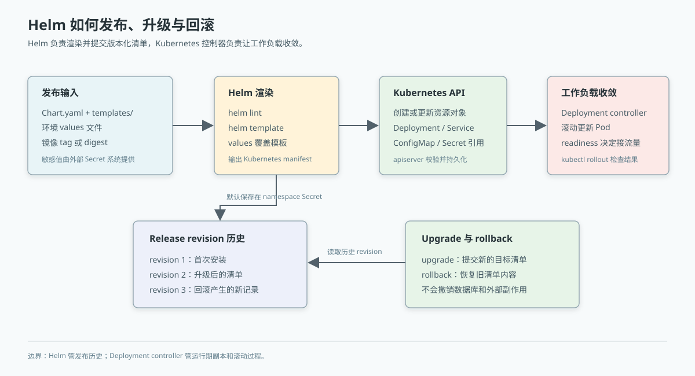

# 第37章 Helm实战

## 场景

第34-36章的 manifest 已经能跑,但服务一多 YAML 开始复制粘贴:

> "order、payment、inventory 三个 Deployment 写了三份,改一个资源限制要改三处,改漏了一处。"

> "dev 用 1 个副本、prod 用 10 个副本,我复制了两套目录。版本升级时两套都要改。"

> "kubectl apply 的顺序错了,Secret 还没创建 Deployment 就起来了,排查了半天。"

这不是 K8s API 的问题,是**部署清单缺少模板与版本管理**。Helm 把一组 K8s YAML 打成一个可参数化、可版本化、可回滚的 Chart。

本章解决五个问题:

1. Helm Chart 的目录结构和渲染模型是什么?
2. `values.yaml` 如何区分 dev/prod 配置?
3. 模板函数、命名、label 如何避免碰撞?
4. `helm install/upgrade/rollback` 如何形成发布闭环?
5. Helm 和 ConfigMap/Secret、Deployment 的边界是什么?

> 代码:`37-helm/order-chart/`,Helm v3.15、minikube(K8s v1.30)。v1/v2 演示镜像复用第34章的 Go 服务。

---

## 问题

裸 YAML 的维护成本:

- **重复**:每个环境一份几乎相同的 Deployment/Service
- **参数散落**:副本数、镜像 tag、资源限制直接写死在模板里
- **发布不可追踪**:`kubectl apply` 没有 release 版本历史,回滚要手工找旧 YAML
- **依赖顺序靠人**:ConfigMap/Secret/Deployment 的关系散落多个文件

Helm 的解法:

- Chart = 一组相关 K8s 资源的**可发布单元**
- values = 模板的**配置输入**
- templates = 输入渲染成 K8s YAML 的**函数**
- release = 某次安装/升级的**版本实例**,Helm 记录历史并支持 rollback

Helm 不是 K8s 控制器,它只负责**渲染与提交**。安装之后 Deployment/Service 仍由 K8s 控制器维护;Helm release 记录的是"当时提交了什么"。

---

## 实现

### 37.1 Chart 目录与第一次安装

> 代码:`37-helm/order-chart/`
>
> 除特别说明外,本章 Helm 命令均在 `05-云原生开发/37-helm/` 目录执行;准备镜像的 Docker 命令从仓库根目录执行。

最小 Chart 目录:

```
order-chart/
├── Chart.yaml            # Chart 元数据(version/appVersion)
├── values.yaml           # 默认参数
└── templates/
    ├── _helpers.tpl      # 公共命名与 labels
    ├── deployment.yaml
    ├── service.yaml
    ├── configmap.yaml
    ├── secret.yaml
    └── NOTES.txt          # 安装成功后的提示
```

`Chart.yaml` 的两个版本不要混淆:

```yaml
version: 0.2.0       # Chart 包本身版本,改模板就应该 bump
appVersion: "v1"     # 应用版本,展示信息,不自动替换镜像 tag
```

检查与渲染:

```bash
$ helm lint order-chart
1 chart(s) linted, 0 chart(s) failed

$ helm template order-v1 order-chart --set-string image.tag=order-v1
# 输出纯 K8s YAML,可以管道给 kubectl dry-run 校验
$ helm template order-v1 order-chart --set-string image.tag=order-v1 \
    | kubectl apply --dry-run=server -f -
```

先为 minikube 准备带版本号的镜像。下面从仓库根目录执行,镜像中的 `/info` 会分别返回 `v1` 和 `v2`:

```bash
docker build -f 05-云原生开发/34-k8s-concepts/example1-pod/Dockerfile \
    --build-arg VERSION=v1 -t go-book-docker:order-v1 \
    05-云原生开发/34-k8s-concepts/example1-pod
docker build -f 05-云原生开发/34-k8s-concepts/example1-pod/Dockerfile \
    --build-arg VERSION=v2 -t go-book-docker:order-v2 \
    05-云原生开发/34-k8s-concepts/example1-pod
minikube image load go-book-docker:order-v1
minikube image load go-book-docker:order-v2
```

镜像必须先进入集群节点的容器运行时。否则 Deployment 会出现 `ImagePullBackOff`;开发集群用 `minikube image load`,生产集群则从镜像仓库拉取。

安装:

回到 `05-云原生开发/37-helm/` 目录后执行 Helm 命令:

```bash
$ helm install order-v1 ./order-chart \
    -f ./order-chart/values-dev.yaml --set-string image.tag=order-v1
NAME: order-v1
STATUS: deployed
REVISION: 1

$ kubectl get deploy,svc,pods -l app.kubernetes.io/instance=order-v1
```

安装后 Helm 给每个资源加上 `app.kubernetes.io/instance: order-v1` label,一个 release 的资源可以整体查询、升级、删除。

### 37.2 values 与模板参数化

默认值:

```yaml
replicaCount: 2
image:
  repository: go-book-docker
  tag: order-v1
  pullPolicy: IfNotPresent
imagePullSecrets: [] # 私有镜像仓库凭据名,需预先建在目标 namespace
service:
  type: ClusterIP
  port: 80
  targetPort: 8080
config:
  logLevel: info
  environment: dev
secret:
  existingName: "" # 空值表示由本 Chart 创建演示 Secret
resources:
  requests: {cpu: 50m, memory: 32Mi}
  limits: {cpu: 200m, memory: 64Mi}
```

模板里通过 `.Values` 读取:

```yaml
spec:
  replicas: {{ .Values.replicaCount }}
  template:
    spec:
      containers:
        - name: order
          image: "{{ .Values.image.repository }}:{{ .Values.image.tag }}"
          resources:
            {{- toYaml .Values.resources | nindent 12 }}
```

仓库提供了 `values-dev.yaml` 和 `values-prod.yaml` 两个环境覆盖文件。优先级从低到高是 Chart 默认值、`-f` 文件、命令行参数:

```bash
# 默认 values.yaml
helm template order-v1 ./order-chart
# 环境文件覆盖默认值
helm template order-v1 ./order-chart -f ./order-chart/values-prod.yaml
# 命令行覆盖环境文件(最高优先级)
helm template order-v1 ./order-chart \
    -f ./order-chart/values-prod.yaml --set-string image.tag=order-v2
```

生产建议:把非敏感配置放在版本控制里,发布时只让 CI 覆盖不可变的镜像 tag 或 digest。Secret 不得写入 Git 中的 values 文件,也不要通过命令行参数传生产凭据。

### 37.3 模板命名与配置变更触发滚动

`templates/_helpers.tpl` 统一生成 fullname 与 labels:

```gotemplate
{{- define "order.fullname" -}}
{{- printf "%s-%s" .Release.Name (include "order.name" .) | trunc 63 | trimSuffix "-" }}
{{- end }}
```

不要直接写固定名字 `order-deploy`:同一集群装两次会冲突。用 release name 作为前缀,`order-v1-order` 与 `order-prod-order` 就能共存。

本 Chart 还给 Deployment 加了 checksum 注解:

```yaml
annotations:
  checksum/config: {{ include (print $.Template.BasePath "/configmap.yaml") . | sha256sum }}
  {{- if not .Values.secret.existingName }}
  checksum/secret: {{ include (print $.Template.BasePath "/secret.yaml") . | sha256sum }}
  {{- end }}
```

ConfigMap 内容变了,checksum 就变,Pod template 发生变化,Deployment 自动滚动——解决第36章的 env 注入"改了但不重启"问题。Chart 自己创建的演示 Secret 也用 checksum;引用外部 Secret 时,外部控制器负责更新 Secret,发布系统应在凭据轮换后触发滚动重启。**Helm 不会直接 watch ConfigMap 或 Secret,是 Pod template 的变化触发 Deployment 滚动。**

### 37.4 Upgrade 与 rollback

发布闭环:

```bash
# revision 1:dev values,v1
helm install order-v1 ./order-chart \
    -f ./order-chart/values-dev.yaml --set-string image.tag=order-v1

# revision 2:升级到 v2;--reuse-values 保留 revision 1 的环境配置
helm upgrade order-v1 ./order-chart \
    --reuse-values --set-string image.tag=order-v2 \
    --set replicaCount=3 --set config.logLevel=debug --wait --timeout 2m
kubectl rollout status deploy/order-v1-order --timeout=2m
kubectl get pods -l app.kubernetes.io/instance=order-v1

$ helm history order-v1
REVISION  STATUS      DESCRIPTION
1         superseded  Install complete
2         deployed    Upgrade complete

# revision 3:回滚到 revision 1
helm rollback order-v1 1
# Pod 镜像回到 order-v1,副本回到 1
kubectl rollout status deploy/order-v1-order --timeout=2m
kubectl run order-check --rm -i --restart=Never --image=curlimages/curl \
    -- curl -s http://order-v1-order/info
```

注意 rollback 产生**新的 revision 3**,不是把历史记录抹掉。这样发布历史仍然完整。`helm upgrade --wait` 会等待资源达到就绪条件,但最终仍要看 Deployment rollout 和应用端点;Helm 命令返回成功不等于业务指标已经恢复。

---

## 原理



> **图解**：上方从左到右是 Chart 与 values 经 Helm 渲染后提交给 API Server，再由 Kubernetes 控制器滚动 Pod；下方单列 Helm 的 revision 历史。回滚读取旧清单并生成新 revision，但不会撤销数据库或外部系统的副作用。

### 37.5 模板渲染与 release revision

一次 `helm install` 或 `helm upgrade` 可以拆成四步:

1. Helm 读取 Chart、环境 values、命令行覆盖项和 release 上下文。
2. Go template 与内置函数把模板渲染成 Kubernetes manifest。
3. Helm 调用 Kubernetes API 创建或更新对象,并把 release revision 存在目标 namespace 的 Secret 中(默认存储驱动)。
4. Deployment、Service 等 Kubernetes 控制器继续工作;Helm 不会常驻集群维持期望状态。

这解释了 Helm 与 Kubernetes 的边界:Helm 管"把哪个版本的清单交给集群",Deployment controller 管"让实际 Pod 收敛到清单里的期望状态"。`helm list/history/status` 读的是 release 记录;`kubectl get/describe` 读的是集群对象和控制器状态,两边排障信息互补。

Chart 的 `version`、`appVersion` 和镜像 tag 也有不同用途:

| 字段 | 表示什么 | 常见变更时机 |
|---|---|---|
| `Chart.yaml.version` | Chart 模板与默认值的包版本 | 模板、默认配置或依赖变化 |
| `Chart.yaml.appVersion` | Chart 所描述的应用版本元信息 | 应用发布版本变化 |
| `values.image.tag` | Kubernetes 实际拉取的容器镜像版本 | 每次应用构建发布 |

`appVersion` 不会自动改写 Deployment 的镜像字段;镜像引用来自 `.Values.image.repository` 和 `.Values.image.tag`。

### 37.6 rollback 的恢复范围

`helm rollback order-v1 1` 会把 release 的 Kubernetes manifest 回退到 revision 1 对应的内容,再创建新的 revision 记录。它适合恢复镜像、Deployment 参数、Service 或 ConfigMap 模板等 release 管理的状态。

rollback **不会**撤销数据库迁移、已经发出的消息、外部 API 调用或手工修改的云资源。版本发布要保持数据库变更向前兼容,并为不可逆操作准备独立补偿方案。Helm 回滚是清单回滚,不是跨系统事务。

---

## 最佳实践

### 37.7 环境值与发布输入

- values 文件保存环境差异,镜像版本由 CI 在发布时覆盖;正式环境优先使用不可变 tag 或 digest,避免 `latest`。
- 镜像仓库、namespace、release name 和环境命名保持稳定,让历史 revision 可读、可检索。
- 模板中对必要参数使用 `required` 或 `values.schema.json` 校验,把配置错误挡在渲染阶段。
- 固定 selector labels;Deployment selector 是不可变字段,升级时只扩展普通 metadata labels。
- 生产升级使用 `--wait --timeout` 明确等待边界,配合 rollout 检查和应用级健康验证。`--atomic` 可在 Helm 等待失败时触发回滚,但不能替代数据库兼容性设计。

### 37.8 Secret 与权限边界

Chart 默认值里的 `secret.dbPassword: change-me` 仅供本地演示,不得部署到生产。生产示例通过 `secret.existingName` 引用已经由 External Secrets、Secrets Store CSI Driver 或平台密钥系统创建的 Secret;外部 Secret 必须包含 `DB_PASSWORD` 键。

Kubernetes Secret 的值使用 Base64 编码不等于加密。限制 namespace RBAC,开启 etcd 静态加密,避免把 Secret 内容提交到 values 文件、CI 日志、命令行历史或 Helm manifest 输出中。应用通过环境变量读取 Secret 时,轮换后还要重启 Pod 才能看到新环境值。

Chart 默认值 `change-me` 和 `values-dev.yaml` 中的 `local-demo-only` 都是无效占位值;Helm release 默认以 Secret 保存 revision,有权限读取 release 历史的人也可能读到 Chart 渲染出的 Secret manifest,因此真实凭据不能进入 Chart 管理的 Secret 模板。

私有镜像仓库凭据也要在目标 namespace 预先创建为 Kubernetes `imagePullSecret`。Chart 通过 `imagePullSecrets` 引用 Secret 名称,流水线不把 registry 密码写进 values 或部署命令。

### 37.9 Chart 的版本管理

Chart 改模板时递增 `Chart.yaml.version`;应用镜像发布时更新 `appVersion` 元信息和镜像 tag。对外分发时用 `helm package` 打包,把 Chart 包与镜像 digest、Git commit 一起记录,便于追溯"哪个源码、哪个镜像、哪份部署模板"组成一次发布。

---

## 排障

### 37.10 渲染失败或字段类型不对

先本地渲染并查看报错位置,再由 API Server 校验 schema:

```bash
helm lint ./order-chart
helm template order-v1 ./order-chart -f ./order-chart/values-dev.yaml --debug
helm template order-v1 ./order-chart -f ./order-chart/values-dev.yaml \
    | kubectl apply --dry-run=server -f -
```

检查 values 的缩进、字段名和类型;尤其是数字、布尔值与字符串,需要字符串时用引号或 `--set-string`。

### 37.11 Release 升级卡住

```bash
helm status order-v1
helm history order-v1
kubectl get events --sort-by=.lastTimestamp
kubectl describe deploy order-v1-order
kubectl get pods -l app.kubernetes.io/instance=order-v1
```

`Pending-upgrade` 或 `Pending-rollback` 时,先确认是否有另一条 Helm 操作仍在运行,不要直接删除 release Secret。若 Pod 未就绪,沿着 Pod Events、容器日志、探针和资源限制定位原因。确认目标 revision 后再决定修复配置、重试升级或回滚。

### 37.12 `ImagePullBackOff`

用 `kubectl describe pod` 看事件中的仓库、tag 和认证错误。minikube 检查镜像是否已 `minikube image load`;生产检查仓库地址、imagePullSecrets、节点网络和 tag 是否存在。Chart 只生成镜像引用,不会替 CI 构建或推送镜像。

### 37.13 ConfigMap 改了但 Pod 未重启

确认 Pod template 上的 `checksum/config` 是否变化,然后查看新 ReplicaSet 和 rollout 状态。若把配置作为环境变量注入,容器必须重建才能读到新值;若引用的是外部 Secret,本 Chart 不会为外部 Secret 生成 checksum,凭据轮换流程需要显式触发 rollout。

### 37.14 升级报 selector 不可变

Deployment 的 `.spec.selector` 创建后不可修改。检查 `helm template` 是否因改了 release 名、chart fullname 或 selector labels 而改变选择器。保持 selector labels 稳定;确实要迁移资源身份时,设计新资源名和流量切换步骤,不要在生产直接删除 Deployment 规避错误。

---

## 面试题

**Q1:Helm Chart、release 和 revision 分别是什么?**

A:Chart 是可参数化的 Kubernetes 资源包;release 是某个 namespace 中安装出来的实例;revision 是该 release 每次安装、升级或回滚的历史版本。

**Q2:`Chart.yaml` 的 `version`、`appVersion` 和镜像 tag 有什么区别?**

A:`version` 标识 Chart 包;`appVersion` 是应用版本元信息;实际运行镜像由 values 中的 repository/tag 决定。更新 `appVersion` 本身不会替换 Deployment 镜像。

**Q3:为什么 ConfigMap 更新后 Pod 不一定重启?**

A:Helm 负责提交对象,不会监听 ConfigMap 变化。把渲染后配置的 checksum 放进 Pod template annotation,配置变化才会改变 Deployment 模板并触发滚动更新。环境变量引用的配置更新后也需要重建进程。

**Q4:Helm rollback 能回滚数据库 schema 吗?**

A:不能。rollback 恢复 release 管理的 Kubernetes manifest,无法撤销数据库迁移、消息和外部系统副作用。数据库变更应采用向前兼容和独立补偿策略。

**Q5:把生产密码放进 values 文件或 `--set` 是否安全?**

A:不安全。values 可能进入 Git、CI 日志或命令历史,渲染出的 Secret 也可能保存在 Helm release 记录中。生产应从外部密钥系统创建 Secret,Chart 只引用其名称,并限制 RBAC 与 etcd 访问。

**Q6:`helm upgrade --wait` 返回成功是否说明业务已恢复?**

A:它只等待 Kubernetes 资源满足 Helm 能判断的就绪条件。仍需检查 Deployment rollout、服务端点、业务探测与指标,以验证请求路径和依赖已经恢复。

---

## 小结

本章把重复 YAML 收敛为可复用、可追踪的 Helm 发布单元:

1. Chart 模板与 values 描述资源,release/revision 记录安装和变更历史。
2. `helm template`、`helm lint` 和 API Server dry-run 把错误前移到部署前。
3. 配置 checksum 让 ConfigMap 变化进入 Pod template,从而触发滚动更新。
4. Upgrade 与 rollback 管理 Kubernetes 清单,不负责回滚数据库和外部副作用。
5. Secret 通过外部密钥系统管理;CI 发布不可变镜像并记录 Chart、commit 和 digest。

**核心原则:**Helm 是 Kubernetes 资源的发布与版本管理工具,不是常驻控制器,也不是跨系统事务管理器。把环境差异写成 values,把敏感配置交给密钥系统,把发布结果关联到不可变镜像和 Chart 版本,升级与回滚才有可审计的边界。

下一章进入 GitLab CI/CD:流水线负责测试、构建、扫描并推送镜像,再用确定的镜像版本调用 Helm 完成发布。

---

## 参考资料

- Helm 文档:https://helm.sh/docs/
- Chart 开发者指南:https://helm.sh/docs/topics/charts/
- Helm 最佳实践:https://helm.sh/docs/chart_best_practices/
- Helm upgrade:https://helm.sh/docs/helm/helm_upgrade/
- Kubernetes Secret:https://kubernetes.io/docs/concepts/configuration/secret/
