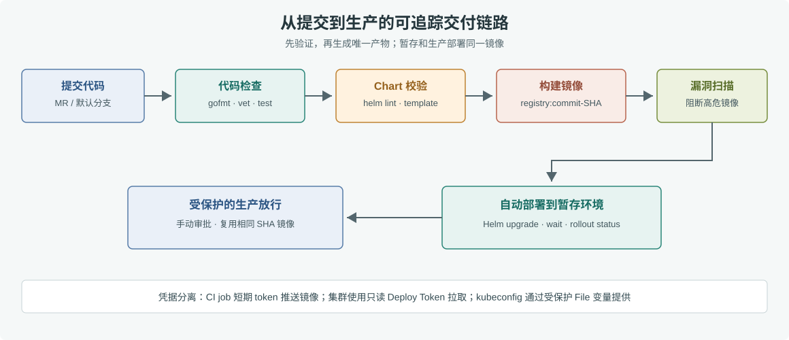

# 第 38 章 GitLab CI/CD

## 场景

订单服务已经有 Dockerfile、Kubernetes Chart 和暂存集群。每次发版仍要由值班同学依次执行 `go test`、构建镜像、推送仓库、修改 values，再手动跑 Helm。忙的时候最容易发生两类错误：镜像 tag 和源码提交对不上，或者暂存环境验证过的镜像到了生产又重新构建了一次。

我们要把这条链路交给 GitLab：合并请求先做代码和 Chart 检查；主干提交构建一个带提交 SHA 的镜像并扫描；同一个镜像自动发布到暂存环境；生产环境由有权限的人手动放行。

本章的完整配置在 [`38-gitlab-ci/gitlab-ci.yml`](./38-gitlab-ci/gitlab-ci.yml)。它针对本书的 Docker 示例服务和第 37 章 Helm Chart 编写。由于本仓库是书稿而不是待发布的业务服务，配置留在子目录中；接入自己的服务时，将它复制到业务仓库根目录并命名为 `.gitlab-ci.yml`，再调整服务路径、Chart 路径和变量。

## 问题

手工发布通常把几个不同责任混在一起：

- 开发者本机负责测试和构建，构建环境不一致时，同一提交可能得到不同产物。
- 镜像使用 `latest` 等可变 tag，出问题后难以证明集群运行的是哪个提交。
- CI 脚本把 kubeconfig、数据库密码直接写进仓库或命令行，日志和提交历史可能泄漏凭据。
- 一个拥有 Docker 特权的 Runner 同时执行外部贡献者的代码，恶意脚本可能越过容器边界影响宿主机。
- 暂存和生产分别重新构建镜像，生产拿到的产物不一定是已经验证过的那一份。

流水线要提供可追踪的产物和明确的权限边界。它不能取代代码评审，也不能让数据库迁移自动具备回滚能力。

## 实现

### 38.1 准备 Runner、仓库和集群

项目先启用 GitLab Container Registry，并准备三类执行环境：

| 用途 | Runner 要求 | 可以执行的任务 |
|---|---|---|
| Go 检查 | Linux Runner，可拉取 Go 镜像 | 格式检查、`go vet`、单元测试 |
| 镜像构建 | 受保护的 Docker Runner，支持 Docker-in-Docker | 只构建受信任主干的提交 |
| 集群发布 | 能访问 Kubernetes API 的部署 Runner | Helm 部署与 rollout 检查 |

Docker-in-Docker Runner 需要 TLS 客户端目录，并在 Runner 的 `config.toml` 中为 Docker executor 开启特权模式：

```toml
[[runners]]
  executor = "docker"
  [runners.docker]
    privileged = true
    volumes = ["/cache", "/certs/client"]
```

特权 Runner 只分配给可信项目和受保护分支，不能拿它运行来自 fork 的任意合并请求代码。GitLab 中注册 Runner tag `trusted-dind`，并把它设为受保护 Runner。部署 Runner 使用 tag `cluster-deploy`，其网络策略只开放到目标集群 API。

在 Kubernetes 中预先准备 `staging`、`production` namespace，以及应用运行时 Secret：`order-runtime-staging` 和 `order-runtime`。集群访问权限应限制在这两个 namespace。生产 values 引用的 `gitlab-registry` 镜像拉取 Secret 也要预先创建在 `production` namespace；暂存环境同样需要一个同名 Secret。

### 38.2 读取流水线



> **图解**：合并请求在前两关检查代码和 Helm 模板；主干提交继续构建并扫描以 commit SHA 标记的镜像，然后发布到暂存环境。生产发布复用同一镜像，并由受保护的手动任务放行，因此中间没有第二次构建。

流水线文件按职责拆成 `verify`、`validate`、`build`、`scan`、`deploy` 五个阶段。前四个阶段产生并验证一个镜像版本，部署阶段分为暂存自动发布和生产手动发布。

### 38.3 检查代码和 Chart

Go 检查进入 Docker 构建前完成。示例复用第 33 章的标准库服务：

```bash
cd 05-云原生开发/33-docker/example1-multistage
test -z "$(gofmt -l .)"
go vet ./...
go test ./...
```

Chart 检查不需要连到集群：

```bash
helm lint 05-云原生开发/37-helm/order-chart
helm template order 05-云原生开发/37-helm/order-chart \
  -f 05-云原生开发/37-helm/order-chart/values-dev.yaml \
  --set-string image.repository=registry.example.test/order \
  --set-string image.tag=ci-check
```

`helm lint` 发现 Chart 结构问题，`helm template` 则确认环境 values 和镜像覆盖可以成功渲染。生产发布不应该等到连集群后才发现拼写或模板错误。

### 38.4 构建并扫描不可变镜像

流水线用 `CI_COMMIT_SHA` 给镜像打 tag，例如：

```text
registry.gitlab.example.com/team/order:7bc6b86d...
```

同一个 SHA 永远对应同一次源码提交。暂存和生产部署覆盖同一组 `image.repository`、`image.tag`，生产不重新执行 `docker build`。

镜像构建后，Trivy 对仓库里的镜像做高危漏洞检查。示例把未修复漏洞排除在阻断条件之外；团队也可以按风险策略调整等级，但必须让扫描结果成为部署的前置条件，而不是只保存一份报告。

### 38.5 配置变量和密钥

在 GitLab CI/CD Variables 中设置：

| 变量 | 类型 | 说明 |
|---|---|---|
| `KUBE_CONFIG_STAGING` | File | 暂存集群 kubeconfig，Protected，环境范围设为 `staging` |
| `KUBE_CONFIG_PRODUCTION` | File | 生产集群 kubeconfig，Protected，环境范围设为 `production` |
| `IMAGE_PULL_SECRET_NAME` | 普通变量 | 镜像拉取 Secret 名称，示例值 `gitlab-registry` |

GitLab 预定义的 `CI_REGISTRY_USER` 和 `CI_REGISTRY_PASSWORD` 用于 CI job 推送镜像；不要复制到项目变量。流水线部署时只把 File 变量路径赋给 `KUBECONFIG`，不能 `cat` 到日志里。

Kubernetes 节点拉取私有镜像所用的凭据，与 CI job 的推送凭据不是一回事。集群侧应使用有 `read_registry` 权限的长期 Deploy Token，由外部密钥管理或受限的管理员流程写入 `kubernetes.io/dockerconfigjson` Secret。不要把短期 `CI_JOB_TOKEN` 当成集群长期拉取凭据，也不要在 Helm values 中保存密码。

完整 job 见 [`38-gitlab-ci/gitlab-ci.yml`](./38-gitlab-ci/gitlab-ci.yml)。将它接入业务仓库后，合并请求会运行代码与 Chart 校验；默认分支合并后才会构建、扫描和自动部署暂存环境。生产任务需要在 GitLab 中把 `production` Environment 标为 Protected，并限制允许部署的用户或组。

## 原理

GitLab Runner 读取 `.gitlab-ci.yml`，按 stage 和 job 依赖调度任务。job 通常运行在相互隔离的容器里，所以一个 job 的文件或本地 Docker 镜像不会自动出现在下一个 job；跨 job 传递产物应使用 artifact 或镜像仓库。本章将镜像推到 GitLab Registry，后续 job 按完整 tag 拉取和部署。

`needs` 把关键依赖显式连起来：代码检查通过后才能构建；扫描通过后才能部署；暂存成功后生产任务才出现。这样失败会停在责任明确的阶段，日志和 commit SHA 可以串成发布记录。

构建环境的特权是这条链路里风险最高的地方。Docker executor 的 `privileged = true` 会扩大 job 对宿主机的能力；因此 CI 配置必须同时限制 Runner 的项目范围、保护默认分支、禁用 fork pipeline 使用受保护变量，并把生产凭据限定到受保护的 production Environment。只写 YAML 里的 `rules` 不能替代 GitLab 平台侧权限设置。

`helm upgrade --install --atomic --wait` 会等 Kubernetes 资源就绪；超时失败时 Helm 会尝试回到上一个 release revision。它不会撤销数据库 schema 变更、已发消息或外部 API 副作用，所以服务升级仍要遵守向前兼容的数据库迁移策略。

## 最佳实践

- 镜像 tag 使用 commit SHA 或 digest。不要用 `latest` 表示一次发布，也不要在部署阶段重建镜像。
- 生产 job 配置为手动放行并绑定 Protected Environment；Runner、File 变量和环境范围一起限定访问权。
- 特权 Docker Runner 只接收可信分支任务；不可信代码的单测放到没有特权、没有生产变量的 Runner。
- 生产 kubeconfig 只授予所需 namespace 的发布权限；不同环境使用独立身份、独立变量和独立审计记录。
- K8s 私有镜像 Secret 使用只读 Deploy Token，且放在应用所在 namespace；镜像推送 token 不下发到集群。
- Registry 清理策略要保留生产当前版本和最近的可回滚版本，避免 Helm 回滚时旧镜像已经被删除。
- 应用镜像扫描、Chart 校验和发布记录都应保留结果。真实项目还可以增加 SBOM、签名、许可检查和变更审批。
- 数据库变更采用 expand-contract：先发布兼容新旧字段的代码，再迁移数据，最后移除旧字段；Helm rollback 不能代替数据恢复。

## 排障

### Job 一直 Pending

确认有 Runner 具备 job 的 tag 和 executor。主干构建使用受保护 `trusted-dind` tag，如果默认分支没有设为 Protected，Runner 会拒绝领取任务。部署 job 还要检查 `cluster-deploy` Runner 是否在线、网络是否可达。

### Docker 连不上 daemon

检查 job 与 dind service 的版本是否匹配、`DOCKER_HOST` 是否为 `tcp://docker:2376`、`DOCKER_TLS_CERTDIR` 和 `DOCKER_CERT_PATH` 是否一致。Runner `config.toml` 必须挂载 `/certs/client`，且只有专用受信任 Runner 开启 `privileged`。

### Push denied 或 `ImagePullBackOff`

CI 推送失败时确认项目启用了 Container Registry，以及 `CI_REGISTRY_IMAGE`、job token 权限和项目路径正确。CI 推送成功但 Pod 拉取失败时，检查目标 namespace 是否有 `gitlab-registry`、Secret 类型是否为 `kubernetes.io/dockerconfigjson`、Deploy Token 是否含 `read_registry` 权限。

### Helm 找不到 Chart 或 Pod 一直未就绪

从仓库根目录查看 `$HELM_CHART_DIR` 是否存在，先运行 `helm lint` 和 `helm template`。发布失败后查看 `helm status order -n staging`、`helm history order -n staging`、`kubectl describe pod` 与 Pod Events；镜像地址错误、Secret 缺失、readinessProbe 失败都会让 `--wait` 超时。

`--atomic` 自动回滚后，再比较失败 revision 与上一 revision 的 values 和镜像 tag。不要为了让流水线变绿直接移除 readinessProbe 或跳过 `--wait`，否则发布问题会转移到线上请求。

### 生产发布成功但业务错误

先判断是应用镜像、配置还是数据库兼容问题。Kubernetes rollout 成功只说明 Pod 达到就绪条件，不代表业务指标恢复。确认上一镜像仍在 Registry 后，可以使用 `helm history` 找出目标 revision，再经审批执行 `helm rollback`；数据迁移和已产生的外部副作用要单独处理。

## 面试题

**Q1：为什么镜像 tag 不应该使用 `latest`？**

A：`latest` 是可变引用，无法可靠对应源码提交；节点缓存和并发发布还会导致同一个 tag 指向不同内容。使用 commit SHA 或 digest 能追踪、复用和回滚同一个产物。

**Q2：GitLab job 之间如何共享构建产物？**

A：小型文件可通过 artifacts 传递；容器镜像应推到镜像仓库，后续 job 根据完整 tag 或 digest 拉取。job 容器相互隔离，不能假设本地文件系统或 Docker daemon 状态共享。

**Q3：启用 Docker-in-Docker 的主要安全风险是什么？**

A：特权容器拥有很强的宿主机访问能力，恶意 job 可能突破普通容器隔离。要使用专用受保护 Runner，只运行可信分支，不承载 fork 代码，并缩小 Runner 和变量的权限范围。

**Q4：为什么 Kubernetes 不直接复用 `CI_JOB_TOKEN` 拉镜像？**

A：job token 生命周期短，CI job 结束后可能过期，不适合作为节点长期拉取凭据。集群应使用有只读 Registry 权限的 Deploy Token 或等价的工作负载身份，并通过 Secret 管理。

**Q5：`helm upgrade --atomic --wait` 保证了什么，没保证什么？**

A：它等待 Kubernetes 资源就绪；超时会尝试回滚前一个 Helm revision。它不证明业务指标正常，也无法撤销数据库迁移、已投递消息或外部副作用。

**Q6：为什么生产环境还要手动放行？**

A：暂存成功是自动化信号，生产发布还涉及用户影响和变更窗口。Protected Environment 把最终授权限制给指定角色，同时保留谁在何时发布哪个 commit 的审计记录。

## 小结

本章把手工发版变成可审计的交付链路：

1. 合并请求运行格式检查、`go vet`、单元测试和 Helm Chart 校验。
2. 默认分支构建一次带 commit SHA 的镜像，扫描后推送 GitLab Registry。
3. 暂存环境自动部署，生产环境复用同一镜像并经过 Protected Environment 手动放行。
4. CI 用短期 job 凭据推送，Kubernetes 用只读 Deploy Token 拉取，两种身份各守各的边界。
5. `--atomic` 只覆盖 Helm 管理的 Kubernetes revision，不替代业务验证和数据库兼容策略。

下一章介绍 GitOps：把“流水线把变更推到集群”与“集群控制器从 Git 拉取期望状态”两种交付方式放在一起比较。

---

## 参考资料

- GitLab CI/CD 文档：https://docs.gitlab.com/ci/
- Docker-in-Docker：https://docs.gitlab.com/ci/docker/using_docker_build/
- GitLab Container Registry：https://docs.gitlab.com/user/packages/container_registry/
- Protected environments：https://docs.gitlab.com/ci/environments/protected_environments/
- Kubernetes imagePullSecrets：https://kubernetes.io/docs/tasks/configure-pod-container/pull-image-private-registry/
