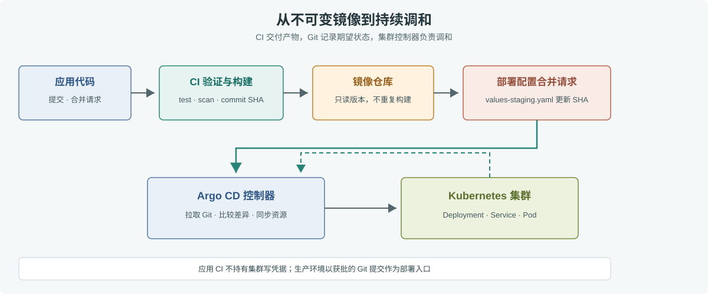

# 第 39 章 GitOps 思想

## 场景

第 38 章的订单服务已经能自动构建镜像、部署暂存环境。接下来要把同一版本发布到多个集群。若 CI 直接持有所有集群的管理员 kubeconfig，流水线一旦被改坏，影响范围就会从一次构建扩大到生产集群；如果有人临时执行 `kubectl edit`，集群状态又会和仓库里的配置分叉。

GitOps 把集群配置的 Git 仓库作为期望状态的来源：CI 负责验证代码并生成不可变镜像，环境配置经过代码评审后记录镜像版本，集群中的控制器持续比较 Git 与实际状态并执行同步。本章用 Argo CD 管理第 37 章的 Helm Chart。

## 问题

传统推送式发布由流水线主动连接集群，容易遇到几个问题：

- CI 需要保存并轮换集群凭据，凭据泄漏时攻击范围较大。
- 谁在什么时候改了线上 YAML，散落在 CI 日志和操作记录里，难以审查。
- 临时 `kubectl edit` 可能制造漂移；下次发布时又被旧配置覆盖。
- 生产回滚常常只改集群，不改仓库，Git 中的版本和真实运行状态不一致。

GitOps 也不是“Git 一有提交就无条件部署”。仓库权限、合并审批、镜像扫描、同步范围和 Secret 管理仍要设计；控制器只能忠实执行仓库里允许它管理的内容。

## 实现

### 39.1 把镜像版本放进环境配置

第 38 章构建并扫描镜像后，先在合并请求中更新 Chart 的暂存 values 文件。这个文件只放非敏感配置和镜像引用，不放数据库密码：

```yaml
# 05-云原生开发/37-helm/order-chart/values-staging.yaml
replicaCount: 2

image:
  repository: registry.example.com/acme/order
  tag: 7bc6b86d8c61 # 替换为已扫描镜像对应的完整 commit SHA
  pullPolicy: IfNotPresent

imagePullSecrets:
  - name: gitlab-registry

config:
  logLevel: info
  environment: staging

secret:
  existingName: order-runtime-staging
```

将完整配置保存在 [`37-helm/order-chart/values-staging.yaml`](./37-helm/order-chart/values-staging.yaml)，这样 Helm 和 Argo CD 都能从同一个 Chart 目录读取它。部署时要确认仓库地址、namespace 中的镜像拉取 Secret 和 `order-runtime-staging` Secret 已准备好。生产 values 应单独维护，不能把暂存 Secret 名称带进生产。

CI 可以在镜像扫描通过后准备一个配置分支，再由人审查并合并：

```bash
export IMAGE_REPOSITORY="registry.example.com/acme/order"
export IMAGE_TAG="7bc6b86d8c61a54f..." # 第 38 章构建并扫描通过的 commit SHA
VALUES="05-云原生开发/37-helm/order-chart/values-staging.yaml"

yq -i '.image.repository = strenv(IMAGE_REPOSITORY) | .image.tag = strenv(IMAGE_TAG)' "$VALUES"
git diff -- "$VALUES"
git switch -c "deploy/staging-${IMAGE_TAG:0:8}"
git add "$VALUES"
git commit -m "deploy staging order ${IMAGE_TAG:0:8}"
git push -u origin HEAD
```

随后在 GitLab 为这个分支创建合并请求。CI 身份只需能推送部署分支；主干仍受评审规则保护。`yq` 使用 Mike Farah 的 v4 语法，提交前应在流水线固定该工具版本。

### 39.2 让 Argo CD 持续同步

先将 Argo CD 安装到集群，并把 Git 仓库以只读凭据登记到 Argo CD。仓库应只授予它读取部署清单所需的权限。应用清单见 [`39-gitops/argocd-application.yaml`](./39-gitops/argocd-application.yaml)：

```yaml
apiVersion: argoproj.io/v1alpha1
kind: Application
metadata:
  name: order-staging
  namespace: argocd
spec:
  project: default
  source:
    repoURL: https://gitlab.example.com/team/go-book-from-me.git
    targetRevision: main
    path: 05-云原生开发/37-helm/order-chart
    helm:
      valueFiles:
        - values-staging.yaml
  destination:
    server: https://kubernetes.default.svc
    namespace: staging
  syncPolicy:
    automated:
      prune: true
      selfHeal: true
      allowEmpty: false
    syncOptions:
      - CreateNamespace=true
      - PruneLast=true
```

把 `repoURL` 改成自己的仓库地址，保存后执行：

```bash
kubectl apply -f 05-云原生开发/39-gitops/argocd-application.yaml
argocd app get order-staging --refresh
argocd app wait order-staging --sync --health --timeout 180
kubectl get deploy,pods,svc -n staging -l app.kubernetes.io/instance=order
```

若 Chart 的 release name 或标签和示例不同，应调整最后一条查询命令的 label selector。首次同步会创建 `staging` namespace 并安装 Chart。示例启用了自动修复和资源清理，所以从 Git 删除受管资源也可能删除集群对象；生产环境需先限制 Argo CD Project 可访问的仓库、namespace 和资源类型，并评估是否允许 `prune`。



> **图解**：上半部分是构建和审批：CI 把镜像推到仓库，部署分支通过合并请求记录新的 SHA；下半部分是集群控制器从 Git 拉取期望状态、比较并同步到集群。集群状态再反馈给控制器用于健康判断。集群访问凭据留在集群侧，应用 CI 不需要直接持有生产 kubeconfig。

### 39.3 回滚与 Secret

若新版本导致错误率上升，先在 Git 中把 values 的镜像 SHA 恢复为上一已验证版本，再提交一个回滚提交。Argo CD 会把该提交当成新的期望状态重新同步，完整保留“谁因为什么回滚”的记录。不要只在集群上执行 `kubectl set image`；启用 `selfHeal` 后，控制器会把这种手工变更改回 Git 中的版本。

密码、Token、私钥不应以明文进入普通 Git。小团队可以先把 Secret 放在集群中，通过受限的管理员流程创建；规模化环境再使用 External Secrets Operator 连接云密钥服务，或采用经过评审的密文方案。Argo CD 的只读仓库权限并不自动保护已提交的 Secret 明文。

## 原理

Argo CD Application 描述“从哪个仓库的哪个版本读取哪个目录，并部署到哪个集群和 namespace”。控制器周期性或按通知刷新 Git 修订版，把 Helm 模板渲染成 Kubernetes 资源，再与 API Server 中的实际对象比较。需要同步时，它向 API Server 提交变更，并读取 rollout 与资源健康状态。

这形成一个持续调和循环，而不是一次性的部署命令。`selfHeal` 让控制器修复仓库外的手工漂移；`prune` 让它清理 Git 中已移除的受管资源。前者减少配置分叉，后者提升清理完整性，但两者都扩大了“错误配置会持续生效”的范围。因此应先限制 Application 的 Project 和目标 namespace，再逐步启用自动修复和清理。

GitOps 与第 38 章 CI/CD 是互补关系：CI 验证代码、构建并扫描产物；GitOps CD 读取获批的环境配置并协调集群。将二者通过镜像 SHA 连接起来，可以追踪“哪个提交生成了正在运行的镜像”。

## 最佳实践

- 用 commit SHA 或镜像 digest 标识产物；禁止用 `latest` 作为部署版本。
- 暂存、预发和生产使用独立 values 与 Argo CD Application，生产变更经过明确评审。
- Argo CD 仓库凭据只读；限制 Project 的仓库、集群、namespace 和资源白名单。
- 先在非生产环境观察同步、健康和回滚，再为生产开启自动修复或 prune。
- 数据库迁移采用向前兼容的 expand-contract 流程；Git 回滚不能撤销外部副作用。
- 将 Secret 放在密钥管理系统或受控的密文流程中，限制谁能读取解密密钥。
- 保留同步历史、合并请求、镜像扫描报告和集群审计日志，形成完整变更链。

## 排障

### Application 一直 OutOfSync

执行 `argocd app diff order-staging` 查看差异。先确认 `targetRevision` 和 `path` 指向正确分支与 Chart，再检查 Helm values 是否被 Git 跟踪、渲染是否依赖缺失 Secret。不要先点同步掩盖渲染错误。

### 仓库无法拉取

查看 Argo CD 仓库凭据是否仍有效、网络是否能访问 GitLab、证书链是否可信，以及目标分支是否存在。只给读取权限；不要为了排障把个人管理员 Token 写进 Application YAML。

### 同步成功但 Pod 不健康

同步成功表示资源已提交给 API Server，不代表应用可以服务。按第 40 章检查 Pod Events、容器日志、探针、镜像拉取凭据和 Service EndpointSlice，再检查 Argo CD 的资源健康状态。

### 手工修改很快被覆盖

这是 `selfHeal` 的预期结果。确认差异后，回到 Git 创建修正提交；紧急情况下按组织的应急流程调整控制器策略，并在恢复后把最终状态写回仓库。

## 面试题

**Q1：GitOps 和传统 CI 推送部署的核心差别是什么？**

A：推送式部署由 CI 主动连接集群并执行变更；GitOps 控制器从集群内读取 Git 中的期望状态并持续调和。后者让变更审查与集群状态更容易关联，但仍需控制仓库权限和控制器范围。

**Q2：`selfHeal` 和 `prune` 分别做什么？**

A：`selfHeal` 修复仓库外造成的实际状态漂移；`prune` 清除 Git 配置中已删除的受管资源。它们都可能把错误配置持续应用到集群，因此应限制同步范围并审查删除风险。

**Q3：生产回滚为什么建议用 Git revert？**

A：revert 会在 Git 历史中留下可审查的新提交，并让控制器根据新期望状态调和集群；直接改集群会与 Git 分叉，还可能被自动修复覆盖。

**Q4：GitOps 能直接解决 Secret 管理吗？**

A：不能。普通 Git 中的明文 Secret 仍会进入提交历史。应使用密钥管理系统、External Secrets 或受控的密文方案，并限制解密权限。

**Q5：CI 和 GitOps 控制器如何关联代码版本与线上版本？**

A：CI 将提交 SHA 或 digest 作为不可变镜像标识；通过部署配置合并请求更新该标识。Argo CD 同步后，可以从环境配置追到镜像，再追到源码提交和扫描结果。

## 小结

1. CI 负责验证代码、构建和扫描不可变镜像；部署配置的变更经过 Git 审核。
2. Argo CD 持续比较 Git 期望状态与集群实际状态，并报告同步与健康结果。
3. `selfHeal` 和 `prune` 能减少漂移，也会持续执行错误配置，必须配合权限边界与评审。
4. 回滚通过新的 Git 提交恢复镜像版本；Secret、数据库迁移和外部副作用需要单独设计。

下一章转向集群现场：从 Pending、CrashLoopBackOff 到 Service 无 Endpoint，按证据逐层缩小故障范围。

## 参考资料

- Argo CD Getting Started：https://argo-cd.readthedocs.io/en/stable/getting_started/
- Argo CD declarative setup：https://argo-cd.readthedocs.io/en/stable/operator-manual/declarative-setup/
- Argo CD automated sync：https://argo-cd.readthedocs.io/en/stable/user-guide/auto_sync/
- Kubernetes Secret good practices：https://kubernetes.io/docs/concepts/security/secrets-good-practices/
