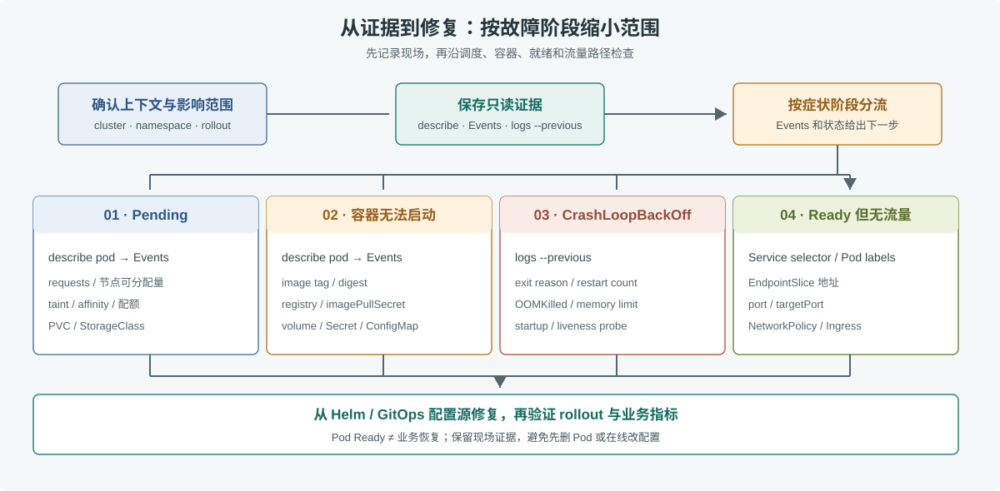

# 第 40 章 Kubernetes 故障排查

## 场景

订单服务刚完成一次发布，告警显示请求失败率升高。`kubectl get pods` 看见 Pod 都存在，但 READY 列是 `0/1`，用户仍然收不到订单状态。此时直接删 Pod 或重启 Deployment，可能让错误暂时消失，却丢掉容器退出前的日志和 Events。

本章建立一套从外到内的排查顺序：先确认集群和影响范围，再保存证据；然后按调度、启动、就绪和流量路径分类；最后只在配置源修复并验证。命令以第 35 章的 `order` Deployment 和 `order-svc` Service 为例。

## 问题

Pod 是状态对象，不是故障原因。`Pending`、`ImagePullBackOff`、`CrashLoopBackOff` 和 `Running 0/1` 分别指向不同阶段；Service 没有可用 EndpointSlice 时，即使容器正在运行，也不会有业务流量进入。

排障中容易造成二次事故的做法包括：只看 `kubectl get pods` 不看 Events；反复删除 Pod 导致线索消失；临时 `kubectl edit` 与 Helm 或 GitOps 管理冲突；把生产日志和配置导出到权限不受控的位置。

## 实现

### 40.1 先确认上下文，再保存现场

先验证当前 kubectl 指向哪个集群和 namespace。生产环境应使用只读权限开始调查：

```bash
kubectl config current-context
kubectl cluster-info
kubectl get deploy,rs,pods,svc -n staging -l app=order -o wide
kubectl get events -n staging --sort-by=.metadata.creationTimestamp
kubectl describe deploy order -n staging
kubectl rollout status deploy/order -n staging --timeout=60s
```

下面的采集脚本会把资源状态、Events、EndpointSlice 和最近容器日志保存到本地目录。它只运行 `get`、`describe`、`logs` 等读取命令，不会修改集群；日志可能含用户数据，应限制本地文件访问并按组织保留期限清理。

```bash
bash 05-云原生开发/40-k8s-troubleshooting/collect.sh staging 'app=order'
```

完整脚本见 [`40-k8s-troubleshooting/collect.sh`](./40-k8s-troubleshooting/collect.sh)。

### 40.2 按症状分流



> **图解**：先保存 Deployment、Pod、Service、EndpointSlice、Events 和前后两次容器日志，再按故障阶段分四路：未调度查资源和约束，容器未启动查镜像与挂载，反复退出查上一轮日志和探针，就绪但无流量查 EndpointSlice、端口和网络。最后从 Helm 或 GitOps 配置源修正，再验证 rollout 与业务指标。

| 症状 | 优先命令 | 常见方向 |
|---|---|---|
| `Pending` | `kubectl describe pod POD -n staging` | CPU/内存 requests、节点污点与亲和性、PVC、ResourceQuota |
| `ImagePullBackOff` | `kubectl describe pod POD -n staging` | 镜像 tag/digest、仓库可达性、同 namespace 的 `imagePullSecrets` |
| `CrashLoopBackOff` | `kubectl logs POD -n staging -c order --previous` | 启动参数、配置、OOMKilled、liveness/startupProbe |
| `Running` 但 `0/1` | `kubectl describe pod POD -n staging` | readinessProbe、应用监听地址与端口、依赖尚未就绪 |
| Pod Ready 但请求失败 | `kubectl get endpointslice -n staging -l kubernetes.io/service-name=order-svc -o wide` | Service selector、targetPort、NetworkPolicy、Ingress 或上游负载均衡 |

### 40.3 调度失败：`Pending`

先看 Pod Events 的最后几条原因，不要先扩容节点。若提示 `Insufficient cpu` 或 `Insufficient memory`，requests 是调度器放置 Pod 的依据；检查节点可分配量和现有 requests：

```bash
kubectl describe pod POD -n staging
kubectl get nodes
kubectl describe node NODE
kubectl get resourcequota,limitrange -n staging
kubectl get pvc -n staging
```

若 Events 提到 `node(s) had taint`、node selector 或 affinity，核对 Deployment 的调度约束与节点标签。PVC 卡在 `Pending` 时，沿 StorageClass、动态 provisioner 和云盘配额继续查。`kubectl top` 需要 metrics-server，且显示的是使用量，不等同于调度器按 requests 计算的可分配空间。

### 40.4 容器拉不起或不断重启

`ImagePullBackOff` 时，`describe pod` 中的 Events 会显示认证失败、镜像不存在或网络错误。检查完整镜像名和 SHA 是否已推送，`gitlab-registry` 是否存在于 Pod 所在 namespace，以及它是否具有只读拉取权限。

遇到 `CrashLoopBackOff`，先取当前日志和上一次退出日志：

```bash
kubectl logs POD -n staging -c order --timestamps --tail=300
kubectl logs POD -n staging -c order --previous --timestamps --tail=300
kubectl get pod POD -n staging -o jsonpath='{range .status.containerStatuses[*]}{.name}{" restart="}{.restartCount}{" last="}{.lastState.terminated.reason}{" exit="}{.lastState.terminated.exitCode}{"\n"}{end}'
```

`lastState.terminated.reason` 是 `OOMKilled` 时，结合容器内存 limit 和峰值使用量判断是否需要优化分配或调整资源；exit code 137 单独出现并不能证明一定是 OOM。若重启由探针触发，检查探针路径、端口和启动耗时：startupProbe 负责给慢启动留时间，readinessProbe 控制是否接流量，livenessProbe 失败会重启容器。把依赖短暂不可用设置成 liveness 失败，可能导致所有副本一起重启。

### 40.5 Pod 就绪但 Service 没有流量

依次检查标签选择、EndpointSlice、服务端口和网络策略：

```bash
kubectl get pods -n staging --show-labels -l app=order
kubectl get svc order-svc -n staging -o yaml
kubectl get endpointslice -n staging -l kubernetes.io/service-name=order-svc -o wide
kubectl describe networkpolicy -n staging
```

EndpointSlice 为空时，先检查 Pod 是否 Ready，再比较 Service selector 和 Pod labels。EndpointSlice 有地址而请求仍失败时，核对 `port` 到 `targetPort` 的映射、容器实际监听端口以及 NetworkPolicy。可以用 `kubectl port-forward svc/order-svc 18080:80 -n staging` 加 `curl -i http://127.0.0.1:18080/healthz` 暂时绕过 Ingress 和外部负载均衡；如果这一步成功，继续检查 Ingress、证书、DNS 和集群外链路。

### 40.6 从配置源修复并验证

如果 Helm 或第 39 章的 Argo CD 管理这些对象，不要在线上 `kubectl edit` 作为最终修复。修改 Chart 或环境 values，经过评审后发布；紧急止血也要记录命令、操作者、时间和集群，并尽快把最终状态补回声明式配置。

发布完成后检查控制器状态、所有副本和 Service 后端，再看业务指标：

```bash
kubectl rollout status deploy/order -n staging --timeout=120s
kubectl get deploy,rs,pods,svc -n staging -l app=order -o wide
kubectl get endpointslice -n staging -l kubernetes.io/service-name=order-svc -o wide
kubectl get events -n staging --sort-by=.metadata.creationTimestamp | tail -20
```

Pod Ready 只是流量准入条件，不代表订单成功率、延迟或下游依赖已经恢复；最终还要对照服务日志、指标和调用链确认用户路径。

## 原理

Kubernetes 控制器持续把实际状态调向期望状态，因此 Pod 重建后名称和 IP 可能变化。Deployment 的 Events 解释副本创建或调度过程；kubelet 和容器运行时的状态解释镜像、挂载、探针和退出原因；Service 与 EndpointSlice 反映哪些就绪地址能接流量。这些对象组成从期望副本到请求入口的诊断链。

排障命令也有不同视角：`get` 看当前摘要，`describe` 展开条件与 Events，`logs --previous` 读取已退出容器的最后一轮输出。先保存时间范围一致的证据，才能把发布变更、状态变化和业务告警对齐。

## 最佳实践

- 先确认 context、namespace 和对象身份；生产变更采用最小权限与双人复核。
- 排障第一步保存 Events、Pod 描述、当前日志和上一轮日志，再做重启或删除。
- 容器资源 requests/limits、startup/readiness/liveness 探针按实际负载设置，并用压测验证。
- 使用 SHA 或 digest，保留最近可回滚镜像和 Helm revision。
- 让服务具备可探测的健康端点、结构化日志和 request ID；健康端点不要泄露内部凭据。
- 用只读诊断身份采集信息；日志和诊断包按敏感数据保护，限制访问、传输和保留期。
- 通过 Helm 或 GitOps 配置源修复，避免持续调和控制器反复覆盖临时更改。
- 把“Pod Ready”和“业务恢复”分开验证，结合错误率、延迟和关键业务指标做结束判断。

## 排障

### `kubectl` 无权限或连错集群

先执行 `kubectl config current-context`，再检查当前身份是否能读取目标 namespace：

```bash
kubectl auth can-i get pods -n staging
kubectl auth can-i get events -n staging
```

若权限不足，通过集群管理员的标准流程获取只读诊断角色；不要为方便把个人 kubeconfig 复制到 CI 或共享目录。

### `kubectl logs` 找不到上一次日志

只有容器至少重启过一次才存在 `--previous` 日志；若 Pod 已被替换，旧 Pod 的日志可能已被节点运行时清理。尽早使用集中式日志系统按 Pod、容器、时间范围和 request ID 查询。

### 采集脚本中部分命令失败

脚本会保留每条命令的输出和错误信息。先确认本机 kubectl 版本与集群兼容、RBAC 允许读取对象，再按错误逐项补充只读权限。不要通过 `set -x` 打印带凭据的环境变量。

### 现场修复被控制器还原

如果对象由 Helm 或 Argo CD 管理，这是期望状态调和的结果。确认当前 Git 修订版和差异，在配置仓库提交修复。若是应急绕过，按团队流程暂停自动同步前先评估风险，并记录恢复时间和后续补交配置的负责人。

## 面试题

**Q1：Pod 是 `Pending` 时先看什么？**

A：看 `kubectl describe pod` 的 Events，判断是资源不足、污点/选择器约束、PVC 还是配额问题，再对照节点可分配资源和 Pod requests。

**Q2：`CrashLoopBackOff` 与应用日志如何关联？**

A：查看 `kubectl logs --previous`、容器 `lastState`、重启次数和 Events，确认退出原因、退出码、探针失败或 OOM。状态名表示重启退避，不是根因。

**Q3：Pod 显示 Running，为什么 Service 仍无法访问？**

A：Running 不等于 Ready。检查 Pod labels 与 Service selector、EndpointSlice、targetPort、NetworkPolicy 和 Ingress/外部负载均衡链路。

**Q4：为什么排障时不建议第一步删除 Pod？**

A：删除可能抹掉上一轮容器日志和 Events，也会重置退避时间；应先保存现场并确认控制器会按预期重建副本。

**Q5：GitOps 环境中线上紧急改值后会怎样？**

A：开启 selfHeal 后，控制器会把手工漂移恢复成 Git 里的期望状态。最终修复应提交到配置仓库，并核对紧急变更是否被覆盖。

## 小结

1. 先确认集群上下文和 namespace，再采集对象状态、Events 与容器日志。
2. `Pending` 查调度约束，拉取失败查镜像与凭据，重启查 previous logs、探针和资源，Ready 无流量查 EndpointSlice 和网络路径。
3. `Running`、Pod Ready、Service 有后端和业务恢复是不同的检查点。
4. 通过 Helm 或 GitOps 的配置源修复，并用 rollout、端点和业务指标确认结果。

至此，云原生阶段从容器打包、编排、配置、发布到持续调和与故障排查形成闭环。下一阶段进入 Prometheus、Grafana、链路追踪和告警体系。

## 参考资料

- Kubernetes Debugging Pods：https://kubernetes.io/docs/tasks/debug/debug-application/debug-pods/
- Kubernetes Debugging Services：https://kubernetes.io/docs/tasks/debug/debug-application/debug-service/
- Kubernetes Resource Management：https://kubernetes.io/docs/concepts/configuration/manage-resources-containers/
- Kubernetes Probes：https://kubernetes.io/docs/concepts/configuration/liveness-readiness-startup-probes/
