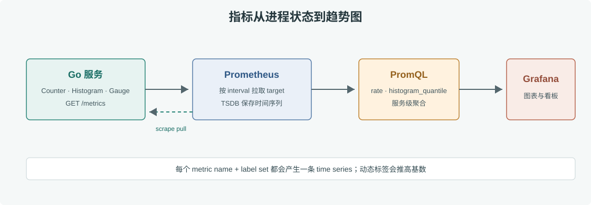

# 第 41 章 Prometheus 监控

## 场景

订单 API 的用户反馈“提交很慢”，但值班同学只有机器 CPU 图，不清楚慢在 Go 服务、数据库还是下游 RPC。我们需要能按服务、接口和状态码回答：请求量多少、错误率多高、尾延迟是否上升、进程是否快耗尽资源。

本章从 HTTP 服务暴露指标开始，使用 Prometheus 抓取，并把指标名、标签和采样周期按长期维护的方式设计。示例工程说明见 [`observability/README.md`](./observability/README.md)。

## 问题

只监控主机 CPU 和内存会错过业务故障；只看平均延迟会掩盖少数慢请求；把用户 ID 或原始 URL 当作标签，则会产生海量时间序列，拖垮 Prometheus。指标必须同时回答业务问题并控制基数。

## 实现

### 41.1 暴露 HTTP 指标

示例服务使用 `client_golang` 记录请求数、请求耗时、处理中请求数以及 Go runtime 指标。应用在 `:8080/metrics` 暴露采集端点，Prometheus 的 scrape 配置见 [`prometheus/prometheus.yml`](./observability/prometheus/prometheus.yml)。

```bash
cd 06-可观测性与稳定性/observability
docker compose up -d --build
curl -X POST http://localhost:8080/orders
curl http://localhost:8080/metrics | grep -E 'http_requests_total|http_request_duration'
```



> **图解**：Go 服务主动更新进程内的 Counter、Histogram 和 Gauge；Prometheus 按 scrape interval 从 `/metrics` 拉取快照并保存为带时间戳的样本。Grafana 查询 Prometheus 的数据，业务请求本身不会逐条推送到 Prometheus。

计数器累计请求数，查询时用 `rate()` 得到每秒变化量；Histogram 将观测值放进固定桶，可计算近似分位数；Gauge 表示可升可降的当前值，例如正在处理的请求数。工程中按稳定路由名记录标签，不能把 `/orders/12345` 的原始路径直接作为标签。

### 41.2 设计可行动的指标

订单服务至少保留四类信号：请求速率、5xx 比例、P95/P99 延迟、饱和度（CPU、内存、连接池和并发请求）。使用 Histogram 桶覆盖业务 SLO，例如 50ms、100ms、250ms、500ms、1s；不要只保留平均值。

启动 Prometheus 后访问 `http://localhost:9090/targets`，确认 `order-api` target 为 `UP`。再查询：

```promql
sum(rate(http_requests_total{route="orders"}[5m]))

sum(rate(http_requests_total{route="orders",code=~"5.."}[5m]))
/
clamp_min(sum(rate(http_requests_total{route="orders"}[5m])), 0.001)

histogram_quantile(0.95,
  sum by (le) (rate(http_request_duration_seconds_bucket{route="orders"}[5m])))
```

第一条是请求速率，第二条是 5xx 比例，第三条是近五分钟的 P95。没有请求时，错误率分母可能为零，查询表达式用 `clamp_min` 避免无穷值。

## 原理

Prometheus 以 pull 模型周期性抓取 target。每个样本由 metric name、label set、时间戳和值组成；同一指标名和标签组合就是一条 time series。Counter 重启后可能归零，因此 `rate()` 要在 PromQL 中先处理计数器重置。

Histogram 通过桶边界估算分位数，桶越细存储和计算成本越高。要计算跨实例 P95，先对 bucket rate 按 `le` 聚合，再调用 `histogram_quantile`；不能先对各 Pod 的 P95 求平均。

## 最佳实践

- 标签只使用有限集合：路由模板、HTTP method、状态码、服务名和环境名。
- 禁止把用户 ID、订单 ID、trace ID、原始 URL、异常文本放进 Prometheus label。
- 以 RED（速率、错误、耗时）观察服务，以 USE（利用率、饱和度、错误）观察资源。
- Histogram 桶围绕 SLO 设置，并通过实际流量校准；不要每个接口复制一套无意义的桶。
- 配置 target、rule 和 dashboard 都纳入 Git，监控配置也要 code review。
- 为 Prometheus 保留磁盘容量和 retention 策略；高基数先用 `topk` 和 TSDB 状态调查来源。

## 排障

### Target 显示 `DOWN`

访问 `/targets` 查看 scrape error。检查 Prometheus 到服务的网络、端口、路径、DNS 和应用是否监听 `0.0.0.0`。容器内的 `localhost` 指向 Prometheus 自己，不是被抓取的应用。

### 图表没有数据

先在 Prometheus Graph 直接查询指标名，确认服务端点实际暴露了该指标；再检查时间范围、job label 和标签过滤条件。Histogram 的 `_bucket`、`_sum`、`_count` 是不同序列，不要漏掉后缀。

### Prometheus 内存持续增长

检查 TSDB status、series 数量及高基数标签。常见根因是把动态 URL、异常 message 或用户标识当标签。先修指标埋点并限制保留时间，再评估扩容，不要只通过缩短 scrape interval 掩盖问题。

## 面试题

**Q1：Counter、Gauge 和 Histogram 分别适合什么数据？**

A：Counter 累加事件次数；Gauge 表示当前可升可降的状态；Histogram 汇总观测值并按桶保存分布，用于延迟分位数等分析。

**Q2：为什么不能把用户 ID 作为 label？**

A：每个不同标签组合都会产生新的 time series，用户 ID 数量随流量增长，会显著增加内存、磁盘和查询成本。高基数关联应交给日志或 Trace。

**Q3：Prometheus pull 模型的优点是什么？**

A：采集端控制频率并能直接判断 target 是否可达；服务不必实现复杂的持久化推送队列。跨网络或短生命周期任务可使用受控的 Pushgateway 等例外方案。

## 小结

1. 用 RED 指标描述请求体验，用 USE 信号定位资源饱和。
2. `rate()` 适用于 Counter；Histogram 在聚合桶后计算跨实例分位数。
3. 标签集合必须有限，避免动态值造成基数爆炸。
4. 先确认 target 和原始指标，再写 Grafana 查询或告警规则。

## 参考资料

- Prometheus instrumentation：https://prometheus.io/docs/practices/instrumentation/
- Prometheus metric types：https://prometheus.io/docs/concepts/metric_types/
- PromQL functions：https://prometheus.io/docs/prometheus/latest/querying/functions/
