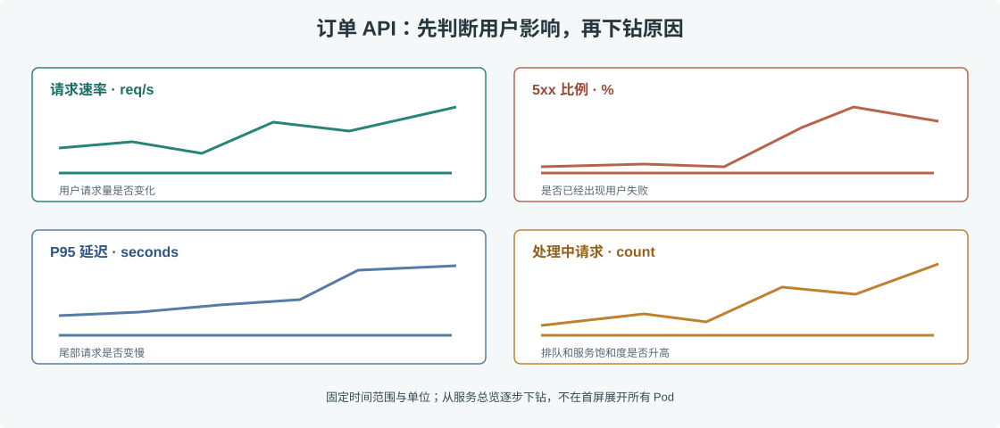

# 第 42 章 Grafana 看板设计

## 场景

接到“订单创建变慢”的电话后，值班同学打开十几个面板，才找到订单 API 的延迟图。生产看板应当把判断顺序排好：先知道用户是否受影响，再定位哪个服务和资源异常，最后给出可点击的诊断入口。

本章用第 41 章的订单指标制作一张可直接导入 Grafana 的 dashboard：[`order-api.json`](./observability/grafana/dashboards/order-api.json)。

## 问题

常见看板问题是把所有指标堆在一屏、单位标错、每个 Pod 单独画数百条线，或让图表阈值没有对应 SLO。Dashboard 的目标是帮助值班决策，不是展示所有能采集到的数据。

## 实现

### 42.1 用四个问题组织看板



> **图解**：首行显示请求量与错误率，回答“用户是否受影响”；第二行显示 P95 延迟与并发请求，帮助判断响应时间和饱和度。每张图按阅读顺序排列，避免把 Pod、接口和资源维度一次性全部展开。

启动本章示例工程后，Grafana 位于 `http://localhost:3000`，本地演示账号为 `admin` / `admin`；首次登录后应立即改掉默认密码。Provisioning 已自动导入 Prometheus datasource 和 dashboard；面板 JSON 也可从 **Dashboards → Import** 单独导入。

```promql
# 每秒请求数
sum(rate(http_requests_total{route="orders"}[5m]))

# 5xx 比例
sum(rate(http_requests_total{route="orders",code=~"5.."}[5m]))
/
clamp_min(sum(rate(http_requests_total{route="orders"}[5m])), 0.001)

# P95 延迟
histogram_quantile(0.95,
  sum by (le) (rate(http_request_duration_seconds_bucket{route="orders"}[5m])))
```

### 42.2 配好变量、单位和链接

生产看板应以 `service`、`environment` 和稳定的 `route` 为筛选变量。变量要限制选项，不应让一次查询展开几千个 Pod。延迟统一以秒保存、Grafana 设置为 milliseconds 展示；百分比明确设置 0 到 1 的单位格式。告警阈值和 SLO 使用同一口径。

面板可以链接到对应的日志查询或 Trace 搜索。将 `trace_id` 保存在日志字段并加入 Grafana data link，让用户从延迟尖峰跳到 Trace；不要为了方便把 trace ID 当 Prometheus 标签。

## 原理

Grafana 不负责采集时序数据，它通过 datasource 执行查询并把结果转换成图表。Dashboard JSON 保存查询、时间范围、面板单位、变量和布局，可像代码一样评审与部署。Datasource provisioning 描述数据源连接，但密码等凭据应放在 Secret 或环境配置中，不应提交到 Dashboard JSON。

Grafana 的图表只是聚合后的窗口。时间范围、step 和查询窗口会影响图形；比较不同环境前要确认同一单位、同一分位数算法和同一时间窗口。

## 最佳实践

- 第一屏回答用户影响：流量、错误率、延迟和可用副本。
- 以服务为主线组织 Overview，再提供单接口、单实例和依赖下钻。
- 图标题写清指标、过滤条件和单位；百分位标出 P95/P99，不写“响应时间”。
- 用模板变量控制服务与环境，默认值选最常用生产环境。
- Dashboard JSON 和 datasource provisioning 放入版本控制，避免只存在某个人的 Grafana 账户里。
- 关键面板链接到 runbook、日志和 trace 搜索，并检查链接传参是否正确。
- 面板数量和刷新间隔适度；自动刷新过快会放大 Prometheus 查询负担。

## 排障

### Dashboard 报 `No data`

先在 Prometheus 直接运行面板查询，区分无样本还是 Grafana datasource 错误。检查 job、route、environment 标签是否与实际暴露值完全一致，并确认 dashboard 时间范围覆盖最近抓取点。

### P95 看起来比单个 Pod 都低

确认查询先对 Histogram bucket 计数按 `le` 聚合，再计算分位数。对各 Pod 的 P95 求平均不能得到服务总体 P95。

### Dashboard 访问慢

在 Grafana Query Inspector 查看请求耗时与返回点数。缩小查询时间范围、降低刷新频率、限制变量结果，并优化 PromQL 的高基数选择器；不要先扩大 Grafana 实例掩盖慢查询。

## 面试题

**Q1：Dashboard 和告警规则有什么区别？**

A：Dashboard 支持人主动探索和定位；告警规则持续评估条件并触发通知。看板存在不代表有人及时查看，所以用户影响必须有明确告警。

**Q2：为什么重要看板要版本化？**

A：变更可以 code review、回滚并部署到多个环境；否则查询表达式和单位可能在 UI 中悄悄漂移。

**Q3：为什么一个 overview 不应该放全部 Pod 指标？**

A：高维序列让页面难以扫描，也增加查询开销。Overview 应先暴露整体症状，再按 service/route/instance 下钻。

## 小结

1. 按“用户影响 → 服务表现 → 资源与依赖”安排看板阅读顺序。
2. 统一单位、分位数和时间窗口，让趋势可比较。
3. 通过版本化 Dashboard、datasource 和 Runbook 链接保证看板可复现。

## 参考资料

- Grafana dashboards：https://grafana.com/docs/grafana/latest/dashboards/
- Grafana provisioning：https://grafana.com/docs/grafana/latest/administration/provisioning/
