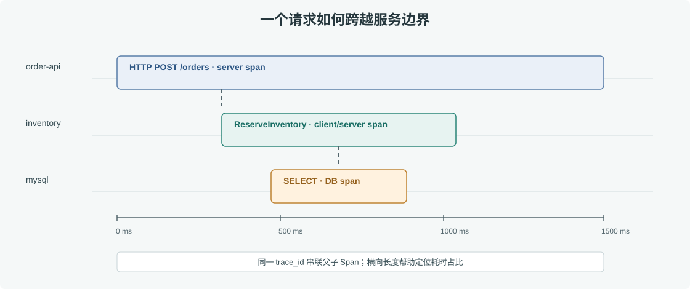

# 第 43 章 OpenTelemetry 链路追踪

## 场景

一个订单请求经过 API、库存和支付服务，用户看到超时。日志里三项服务都记录了错误，但无法确认它们是否属于同一请求，也不知道哪次 RPC 消耗了大部分时间。Trace 用统一的 trace ID 和有父子关系的 Span 还原一次调用路径。

示例服务把 OTLP trace 发给 OpenTelemetry Collector，再由 Collector 导出到 Tempo；配置位于 [`observability/otel/collector.yaml`](./observability/otel/collector.yaml)。

## 问题

仅靠日志搜索无法准确还原跨服务顺序；仅看总耗时又无法区分网络、数据库和业务计算。若没有传播 W3C Trace Context，服务间请求会变成互不关联的孤立 Span。

## 实现

### 43.1 创建 Provider 并优雅关闭

订单示例使用 OTLP/HTTP exporter 和 batch processor。`observability/app/main.go` 会创建全局 TracerProvider，并在进程退出时 flush 尚未导出的 Span：

```go
ctx, cancel := context.WithTimeout(context.Background(), 5*time.Second)
defer cancel()

exporter, err := otlptracehttp.New(ctx,
    otlptracehttp.WithEndpoint("otel-collector:4318"),
    otlptracehttp.WithInsecure(),
)
if err != nil {
    return err
}

tp := sdktrace.NewTracerProvider(
    sdktrace.WithBatcher(exporter),
    sdktrace.WithResource(resource.NewWithAttributes(
        semconv.SchemaURL,
        semconv.ServiceName("order-api"),
    )),
)
otel.SetTracerProvider(tp)
```

启用 Compose 示例后，创建几笔订单，再打开 Grafana 的 **Explore**，选择已配置的 Tempo datasource，按 service name 搜索 `order-api`。Tempo 的 `:3200` 是查询 API，浏览器界面由 Grafana 提供。



> **图解**：最上层 server Span 代表 HTTP 请求，下面的库存 RPC 与数据库查询是子 Span；Span 的起止时间和嵌套关系能看出耗时发生在哪一跳。W3C traceparent 在服务间传递同一 Trace ID，采样与属性应控制数据量和敏感信息。

图中库存和数据库 Span 展示了生产服务完成真实下游调用后应有的关系。本地示例只执行 HTTP 边界，因此能看到 `order-api` 根 Span；接入真实 gRPC client 和数据库 driver 后，再使用相应的 OpenTelemetry instrumentation 自动生成子 Span。

### 43.2 在边界创建 Span 并传播 Context

```go
tracer := otel.Tracer("order-api")
ctx, span := tracer.Start(r.Context(), "POST /orders",
    trace.WithSpanKind(trace.SpanKindServer),
)
defer span.End()

ctx, child := tracer.Start(ctx, "reserve inventory")
defer child.End()
resp, err := inventoryClient.Reserve(ctx, request)
```

下游 Go client 应使用 OpenTelemetry instrumentation，或在 HTTP/gRPC 边界注入和提取 W3C Trace Context。Context 必须随请求向下游传递，不能用 `context.Background()` 重新开一条无关链路。Span attribute 记录稳定、非敏感的信息，例如 `order.region`；避免记录 token、完整请求体和个人信息。

## 原理

Trace 由一个 Trace ID 和多个 Span 构成。Span 有自己的 Span ID、父 Span ID、开始/结束时间、属性、事件和状态。Context Propagation 通过 HTTP header 或 RPC metadata 将当前 Span 上下文传给下一跳。SDK 负责采样和缓冲，Collector 负责接收、处理与导出。

Head sampling 在请求入口决定是否记录整条链，成本低且容易保持父子一致；tail sampling 可在 Collector 汇总 Span 后按错误或慢请求保留，但需要额外内存、延迟和状态管理。示例工程使用简单 batch 导出，不启用 tail sampling。

## 最佳实践

- HTTP/gRPC 边界启用标准 instrumentation，跨服务透传 W3C Trace Context。
- 统一 resource attributes：service.name、service.version、deployment.environment.name。
- 对慢请求和错误请求保留足够采样率；流量很大时按目标成本评估 sampling 策略。
- Span 名使用稳定操作名，不能直接拼接订单 ID 或原始 URL。
- exporter 有超时、重试和队列上限；遥测故障不能阻塞业务请求。
- trace 属性不存密码、Token、支付资料和完整个人信息。
- 将 trace ID 写入结构化日志，让指标、Trace、日志可以相互跳转。

## 排障

### Tempo 查不到 Trace

检查应用 exporter endpoint 是否指向 Collector、OTLP/HTTP 使用 4318、Collector receiver 是否监听 `0.0.0.0`，并查看 Collector logs。确认 Span 在请求结束前调用 `End`，应用退出时执行 Provider `Shutdown`。

### 只看到根 Span

检查是否把同一个请求 Context 传给下游 client，以及 client instrumentation 是否启用。新的 `context.Background()` 会切断父子关系。

### Trace 导出拖慢服务

确认使用 batch processor 而非每个 Span 同步导出，并设置队列和超时上限。Collector 暂时不可达时，应丢弃或有界重试遥测数据，不能把业务线程无限阻塞。

## 面试题

**Q1：Trace ID 和 Span ID 有什么关系？**

A：一个 Trace ID 标识跨服务的一次完整请求；每个服务操作有独立 Span ID，并通过 parent span 连接成树。

**Q2：为什么 Trace 也需要采样？**

A：全量记录大流量请求会产生大量存储和传输成本。采样在成本、诊断覆盖率和高延迟/错误请求保留之间取舍。

**Q3：Collector 和 SDK 分别负责什么？**

A：SDK 在应用内创建、采样和导出遥测；Collector 在独立进程接收、处理并路由遥测，可避免应用直接耦合多个后端。

## 小结

1. 用 Span 树表示一次跨服务请求，把耗时定位到具体操作。
2. Context Propagation 是跨服务关联的前提，必须贯穿 HTTP/gRPC 调用链。
3. SDK 和 Collector 要设置有界缓冲与关闭 flush，避免遥测影响业务。

## 参考资料

- OpenTelemetry Go：https://opentelemetry.io/docs/languages/go/
- OpenTelemetry Collector：https://opentelemetry.io/docs/collector/
- W3C Trace Context：https://www.w3.org/TR/trace-context/
