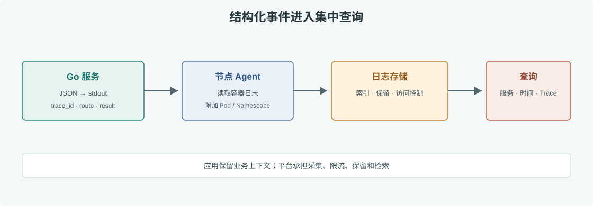

# 第 44 章 日志体系设计

## 场景

订单服务的 5xx 比例在一分钟内升高，Prometheus 只能告诉我们“错误变多了”，Trace 能告诉我们“慢在库存服务”，但值班同学还要看到具体错误码和请求上下文。结构化日志负责保留单次事件的细节，并通过 trace ID 与 Trace 关联。

## 问题

自由格式日志难以稳定检索；打印完整请求可能泄漏隐私；应用自己写文件会把轮转、磁盘容量和采集故障带回业务容器。生产服务应在 stdout 输出一条一条的 JSON，由平台采集与保留。

## 实现

### 44.1 使用 `slog` 输出结构化字段

```go
logger := slog.New(slog.NewJSONHandler(os.Stdout, &slog.HandlerOptions{
    Level: slog.LevelInfo,
}))

span := trace.SpanFromContext(ctx)
sc := span.SpanContext()
logger.InfoContext(ctx, "order accepted",
    "order_id", order.ID,
    "result", "accepted",
    "trace_id", sc.TraceID().String(),
    "span_id", sc.SpanID().String(),
)
```

应用代码示例在 [`observability/app/main.go`](./observability/app/main.go)。日志字段使用固定 key，时间采用 RFC3339Nano，错误使用 `ErrorContext` 并记录错误类别，不要把整段 stack trace 重复写在每一层。



> **图解**：应用将 JSON 日志写到 stdout/stderr，节点 Agent 读取容器运行时日志并附加 namespace、pod 和 container 元数据，再送往集中存储。应用提供业务事件与 trace ID，平台负责采集、索引、访问控制和保留期限。

### 44.2 统一字段与脱敏

一条订单日志可以包含 `timestamp`、`level`、`service.name`、`request_id`、`trace_id`、`route`、`status_code`、`duration_ms`、`error.kind` 和业务结果。用户邮箱、手机号、支付凭据、Authorization header 和完整请求 body 不应默认进入日志；确有排障必要时先做脱敏、字段级授权和保留期限评审。

本地 Compose 示例可运行 `docker compose logs -f order-api` 查看 JSON；Kubernetes 中先用 `kubectl logs`，生产环境再由节点 Agent 汇聚到 Loki 或 Elasticsearch。

## 原理

容器日志通常由运行时把 stdout/stderr 变成节点文件，采集 Agent 读取文件并添加 Kubernetes 元数据后写入日志后端。结构化字段适合过滤、聚合和跨系统关联；日志后端按时间与字段索引，不应承担无限期保存所有原始数据的职责。

指标回答“多常见”，Trace 回答“在哪一跳”，日志回答“这次发生了什么”。三者用 service、environment、route 和 trace ID 等有限字段连起来，才能形成完整诊断上下文。

## 最佳实践

- 一事件一行 JSON，写 stdout/stderr；不在容器内做多副本文件轮转。
- 统一字段名、时区、日志级别和错误类别，保证可检索。
- 记录 trace_id、request_id 和稳定业务 ID；不在指标标签中复制高基数字段。
- 对敏感字段采取默认拒绝、显式白名单与自动脱敏。
- 采集端配置缓冲区、丢弃策略、磁盘水位和限流，避免日志风暴拖垮节点。
- 按日志等级、合规要求和故障调查需要设定保留期与访问权限。
- 避免每层重复记录同一个错误；在错误被处理或返回边界记录足够上下文。

## 排障

### `kubectl logs` 没有日志

确认服务写的是 stdout/stderr，而不是容器文件；检查容器是否启动、namespace、Pod 和 container 名是否正确。已经退出的容器使用 `--previous`，更早日志需从集中式后端查询。

### 日志平台延迟或缺行

先看节点 Agent 状态和队列/磁盘水位，再核对后端写入拒绝、标签解析和采集时间范围。应用日志量突然增加时，应先定位错误循环或重试风暴，不要简单把采集 buffer 无限扩大。

### 通过 trace_id 查不到日志

检查应用是否从 Context 读取当前 SpanContext、日志管道是否保留了该字段，以及 Trace 与日志查询的时间范围、环境和 service 名是否一致。

## 面试题

**Q1：为什么容器应用通常写标准输出，而不自己轮转日志文件？**

A：stdout/stderr 与容器运行时和平台采集机制配合，可统一处理元数据、轮转和保留；进程内文件轮转容易与多副本和容器生命周期冲突。

**Q2：日志、指标和 Trace 各自适合回答什么？**

A：指标刻画总体趋势，Trace 还原单次跨服务路径，日志记录事件细节和错误上下文。三者应使用可关联字段。

**Q3：为什么不要默认记录完整请求体？**

A：请求体可能含个人信息、凭据或支付数据，增加隐私泄漏和日志成本风险。应按字段白名单采集最小必要信息。

## 小结

1. 使用固定 schema 的 JSON 日志，写入 stdout/stderr。
2. 将 trace ID 加入日志，三类遥测数据用服务和请求维度关联。
3. 对敏感字段默认脱敏，并限制采集、访问和保留。

## 参考资料

- Go `log/slog` 文档：https://pkg.go.dev/log/slog
- Kubernetes Logging Architecture：https://kubernetes.io/docs/concepts/cluster-administration/logging/
