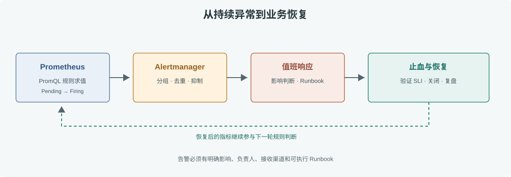

# 第 45 章 告警体系设计

## 场景

订单 API 的一个 Pod 重启了一次并不一定需要值班介入；如果用户连续十分钟无法提交订单，就应该触发可靠告警。好的告警围绕用户影响和可执行动作设计，而不是把每个指标越线都发成页面通知。

## 问题

告警太多会导致疲劳，太少会让故障晚发现；按瞬时值告警会被尖峰和缺样本误触发；没有 Runbook 的告警即使送达，也只把故障交给值班同学猜。

## 实现

### 45.1 从 SLO 派生告警

若订单创建月度可用性目标为 99.9%，先用错误预算思考多快消耗，再按影响程度分告警等级。示例规则见 [`prometheus/alerts.yml`](./observability/prometheus/alerts.yml)：5xx 比率连续 10 分钟超过阈值、P95 超过服务预算、或采集 target 持续不可达。规则应使用 `for` 抑制短暂尖峰，并提供摘要、描述和 Runbook 链接。



> **图解**：Prometheus 周期性计算规则，短暂尖峰由 `for` 窗口过滤；持续告警交由 Alertmanager 分组、去重并按 severity 路由。值班同学按 Runbook 判断用户影响、止血和恢复，最后关闭告警并补充事后记录。

### 45.2 配置通知路由

本地示例先在 Prometheus `/alerts` 检查规则是否进入 Pending/Firing。生产接 Alertmanager 后，将 `critical` 页面通知发给 on-call，将 `warning` 发送到团队工作流；Webhook URL 和 SMTP 密钥应由 Secret 注入，不写在仓库配置中。

```yaml
# Alertmanager 配置结构示意；将接收地址通过受控密钥管理配置
route:
  receiver: team-warning
  group_by: [alertname, service, environment]
  group_wait: 30s
  group_interval: 5m
  repeat_interval: 4h
  routes:
    - matchers:
        - severity="critical"
      receiver: oncall
      continue: false
receivers:
  - name: team-warning
  - name: oncall
```

上面只定义分组和路由骨架，尚未包含接收器的 transport 配置；接入值班平台时按其官方 schema 配置并通过密钥管理提供凭据。

## 原理

Prometheus 规则引擎按 evaluation interval 计算表达式。条件首次成立进入 Pending，持续满足 `for` 时间后变成 Firing；样本缺失时需要结合 `up`、`absent()` 或缺失策略判断是否是目标失联。

Alertmanager 对告警做分组、去重、抑制和静默。分组避免相同原因的每个 Pod 单独发消息；抑制可在集群整体不可达时压住大量下游次生告警。路由标签要稳定、有限，且 critical 告警必须到可唤醒值班人的渠道。

## 最佳实践

- 先定义用户可感知的 SLI/SLO，再从错误预算和故障模式设计告警。
- 每条 page 告警都写明影响、阈值、持续时间、负责人和 Runbook。
- 用 `for` 抑制瞬时尖峰；避免把 `for` 设得长到用户先发现问题。
- 告警表达式保持服务级聚合，避免每个 Pod、每个用户单独触发。
- 配置缺样本和 scrape failure 告警，防止静默失明。
- 定期演练通知链、静默、升级和轮值表；无行动的告警应删除或降级。
- Alertmanager 配置、规则和 Runbook 一起版本化，Secret 独立管理。

## 排障

### 规则没有进入 Firing

在 Prometheus `/rules` 查看表达式和 Pending 状态，再直接执行 PromQL。检查 `for` 时间、label matcher、rule evaluation 错误和样本缺失；不要只盯 Grafana 面板。

### 告警已 Firing 但没人收到

检查 Prometheus 到 Alertmanager 的配置和 target、Alertmanager route matcher、receiver 错误日志、静默和 inhibit 规则。用非生产测试告警验证完整通知路径。

### 同一故障收到大量通知

确认 `group_by` 是否包含过多动态标签，检查每 Pod 是否各自触发告警以及根因告警能否抑制下游症状。按 service、cluster、alertname 等稳定维度分组。

## 面试题

**Q1：Prometheus 告警的 Pending 与 Firing 有什么区别？**

A：条件刚满足后进入 Pending；持续满足 `for` 时长后才进入 Firing，避免短暂抖动立即通知。

**Q2：什么是告警疲劳？**

A：大量低价值、重复或不可行动的通知使值班同学忽略告警。通过 SLO 驱动、聚合、抑制和定期清理恢复信噪比。

**Q3：如何处理“没有数据”的情况？**

A：区分业务确实无流量、Prometheus 抓取失败和目标已消失；为 target 可达性与关键指标缺失设计独立检测，并明确 no-data 策略。

## 小结

1. 页面告警应代表持续的用户影响或快速消耗错误预算。
2. `for`、分组和抑制减少噪声，Runbook 与通知演练保证可行动。
3. 数据采集失败本身也需要告警，防止监控系统静默失明。

## 参考资料

- Prometheus alerting rules：https://prometheus.io/docs/prometheus/latest/configuration/alerting_rules/
- Alertmanager：https://prometheus.io/docs/alerting/latest/alertmanager/
