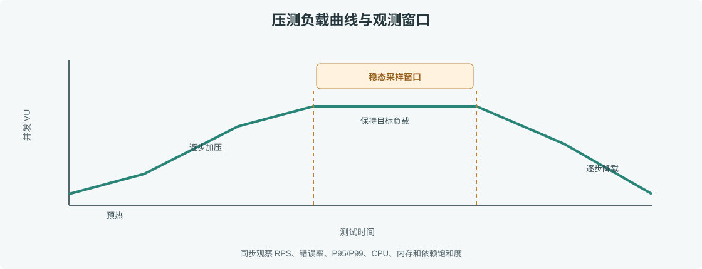

# 第 46 章 性能压测

## 场景

订单服务准备进入促销活动，开发环境里手工点几次接口都很快，但上线后并发升高时连接池耗尽、尾延迟超过用户等待预算。性能压测要在上线前回答：系统在目标流量下能否守住延迟和错误率，瓶颈出现在哪层。

## 问题

只报“每秒请求数”会掩盖错误和排队；用过高的压测并发冲击共享生产依赖会制造真实故障；短暂热身、冷缓存和稳定负载混在一起，结果无法复现。

## 实现

### 46.1 定义负载和阈值

示例使用 k6 脚本 [`load/order-api.js`](./observability/load/order-api.js) 压测 `/orders`。脚本先预热，再逐级增加 VU，设置请求失败率和 P95 threshold：

```bash
cd 06-可观测性与稳定性/observability
docker compose up -d --build
docker compose --profile load run --rm k6 run /scripts/order-api.js
```



> **图解**：负载先从低并发预热，再按阶段升到目标 VU 并保持一段时间，最后逐步降载。判断性能的窗口取稳定段，同时观察请求速率、失败率、P95/P99、CPU、内存和连接池，而不是只读总请求数。

### 46.2 设计可复现的实验

先写清实验卡：压测目标、版本 SHA、环境规格、数据规模、缓存状态、连接池配置、负载曲线和成功阈值。每轮只改变一个变量。到达 5xx、延迟或资源保护阈值时停止压测，不能为了得到更大的 RPS 越过安全边界。

本地结果用于比较改动趋势，不代表生产容量承诺。容量评估应使用接近生产的 CPU/内存配额、依赖版本和网络路径，并预留突发和故障降级余量。

## 原理

闭环压测器会等每个响应后再发下一请求，服务变慢时客户端发压也会自然下降，可能低估过载时的排队延迟；开放模型按预设到达率持续发请求，更适合模拟外部到达流量，但要监控压测器自身是否跟得上。

稳态延迟包含排队和服务时间。提高并发接近饱和时，少量资源瓶颈会让 P99 急剧上升；因此必须同时观察错误率、延迟分布、资源和下游依赖，不能用平均延迟判断容量。

## 最佳实践

- 先定义服务 SLO、目标到达率和停止条件，再启动压力。
- 使用独立压测环境和合成账户；生产压测必须经过变更、流量和依赖 owner 的授权流程。
- 记录压测工具、脚本版本、应用 SHA、机器规格、数据集和缓存预热状态。
- 分阶段加压，每阶段足够长以观察稳定态和 GC/连接池周期。
- 观察 P50/P95/P99、错误率、饱和度和下游延迟；定位先达到极限的组件。
- 对照单机与多副本结果，检查扩容是否受共享数据库或网络瓶颈限制。
- 每次优化通过相同实验复测，避免只凭直觉调整参数。

## 排障

### 压测端 CPU 满载

压测器本身成了瓶颈。增加压测机或分布式执行，并对照压测端 CPU、网络和丢包；不要把客户端限制误判成服务容量。

### RPS 增加但 P99 暴涨

查看 CPU throttling、GC pause、goroutine、数据库连接池等待、下游重试和队列长度。确认是否进入饱和区，必要时按停止阈值结束实验。

### 结果每轮差异很大

核对缓存命中、数据量、后台任务、Pod 规格、应用版本和预热；固化实验脚本并控制背景流量。只对可比条件下的结果做结论。

## 面试题

**Q1：为什么容量评估要看 P99，而不只是平均延迟？**

A：平均值会掩盖少数慢请求。用户超时和排队通常集中在分布尾部，P95/P99 更接近最差体验。

**Q2：闭环与开放模型压测有什么差别？**

A：闭环模型受响应速度影响，系统变慢时发压下降；开放模型按固定到达率持续施压，更适合验证排队与过载行为，但对压测端要求更高。

**Q3：压测时什么时候应该停止？**

A：达到预先约定的错误率、P99、资源或依赖保护阈值时停止；测试目的不是把真实共享系统打坏。

## 小结

1. 用明确的 SLO、目标流量和停止条件设计压测。
2. 记录实验条件并分阶段加压，关注尾延迟、错误和最先饱和的依赖。
3. 本地压测用于相对比较，生产容量结论需要接近生产环境的验证。

## 参考资料

- Grafana k6：https://grafana.com/docs/k6/latest/
- k6 thresholds：https://grafana.com/docs/k6/latest/using-k6/thresholds/
