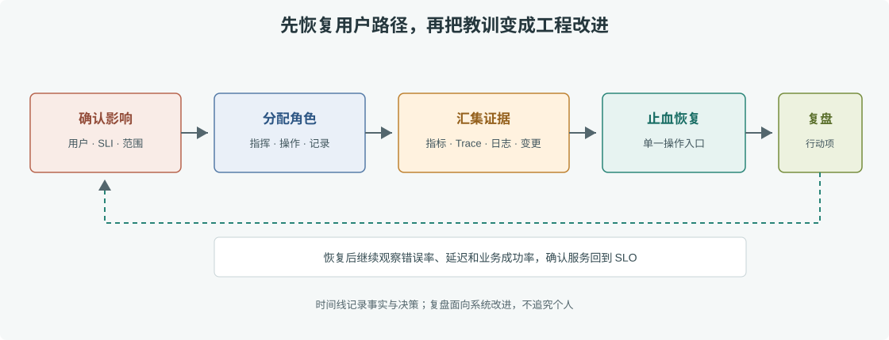

# 第 47 章 故障排查方法论

## 场景

促销期间订单创建错误率持续上升，客服、开发和运维同时在群里讨论。有人提议扩容，有人怀疑数据库，还有人准备回滚。没有共同的事实、负责人和时间线时，多人并行操作反而会扩大事故。

本章用一套固定的事故流程串起前面的指标、看板、Trace、日志和 Kubernetes 排查：先稳定用户影响，再由证据缩小范围；修复后持续观察并形成后续改进。

## 问题

故障排查不是猜根因比赛。常见失误包括多个操作者同时改生产、在没有记录时重启导致现场丢失、把相关性当根因、恢复后立刻关闭事件而没有确认错误预算回到正常。

## 实现

### 47.1 建立事故角色与时间线

设置一名 Incident Commander 负责协调，一名操作员执行变更，一名记录员记录时间线和决策。其他人提供证据，不直接在同一资源上并发操作。先明确：受影响用户、开始时间、主要 SLI、最近变更和止血负责人。



> **图解**：故障触发后先由指挥者划定影响和分配角色，团队同时保存指标、事件、日志和 Trace 证据；操作员通过回滚、限流或隔离依赖止血。恢复后继续观察 SLI，只有用户体验稳定才进入复盘和行动项阶段。

### 47.2 使用时间线缩小范围

```text
T-10m 订单创建 P95 从 180ms 升到 1.8s，5xx 仍正常
T-8m  数据库连接池等待升高，Pod CPU 正常
T-6m  新版本发布完成，订单 Trace 显示库存查询耗时占 1.4s
T-4m  暂停后续发布，库存服务限流恢复，订单 P95 开始回落
T+10m 错误率与延迟回到 SLO 内，保持观察
```

这条时间线提供假设而非证明。下一步用 Trace 确认慢在库存 RPC，用日志检查超时与重试，用部署记录确认版本变更；再通过只影响暂存或小流量的安全实验验证。若用户仍受影响，优先使用已验证的止血动作，不必等待完整根因分析。

## 原理

事故指挥把技术诊断、业务沟通和操作授权分开，减少冲突并保持可追踪。观测信号的作用不同：指标发现范围和趋势，Trace 比较调用耗时，日志说明具体失败，Kubernetes Events 解释调度与容器状态，变更记录提供时间关联。多来源证据越一致，根因判断越可靠。

稳定服务的首要目标是在约定时间内恢复用户路径。事后复盘再讨论为什么防线失效、哪些检测或回滚机制需要补齐；复盘目标是系统改进，不是寻找个人责任。

## 最佳实践

- 先止血，再根因；止血动作使用预先演练过且可回退的变更。
- 设定唯一 Incident Commander 和记录员，关键决策写入时间线。
- 统一时间窗口和时区，关联发布 SHA、SLI、Trace、日志与 K8s Events。
- 明确事故等级、用户影响、内部更新频率和对外沟通负责人。
- 恢复后观察完整业务周期，并确认错误率、延迟和队列回到正常。
- 复盘聚焦检测延迟、恢复耗时、缺失护栏和可自动化行动。
- 每个行动项有负责人、截止日期、验证方式；关闭前通过演练或监控证明有效。

## 排障

### 没有可复现的根因

保留“未知”比编造确定答案好。列出已知事实、排除项和未验证假设，补充日志、指标或故障注入实验，再安排后续调查。

### 一次事故同时出现多个告警

按依赖关系和时间线聚合，从最上游的用户影响或基础设施故障开始找主因。检查 Alertmanager 分组和抑制是否合理，减少同一根因的通知风暴。

### 回滚后症状仍未恢复

确认运行镜像 SHA、配置版本和数据库变更，检查是否有旧请求积压或下游重试风暴。回滚只改变部分运行代码，不会自动撤销 schema migration、消息投递和外部副作用。

## 面试题

**Q1：生产事故中为什么先止血再追根因？**

A：用户影响和错误预算持续扩大时，快速恢复可用路径比立即解释所有细节更重要。止血后仍需保留证据和安排根因分析。

**Q2：如何避免多人同时操作扩大事故？**

A：设 Incident Commander、单一变更执行人和记录员，统一声明当前假设与计划；其他人通过证据支持，不越权并发修改。

**Q3：一次无根因的事故能否复盘？**

A：可以。清楚记录事实、假设和证据缺口，围绕检测与恢复能力列行动项；未知应保留为未知，而不是选一个方便的解释。

## 小结

1. 建立统一角色、时间线和用户影响口径。
2. 先执行安全止血动作，再用指标、Trace、日志和变更记录验证根因。
3. 恢复后观察 SLI，并把复盘行动转成有负责人和验证方式的工程工作。

第六阶段至此把“采集信号”推进到“根据证据恢复服务”。下一阶段转向 Go 并发模型、性能瓶颈和秒杀场景。

## 参考资料

- Google SRE Workbook, Incident Response：https://sre.google/workbook/incident-response/
- Google SRE, Postmortem Culture：https://sre.google/sre-book/postmortem-culture/
