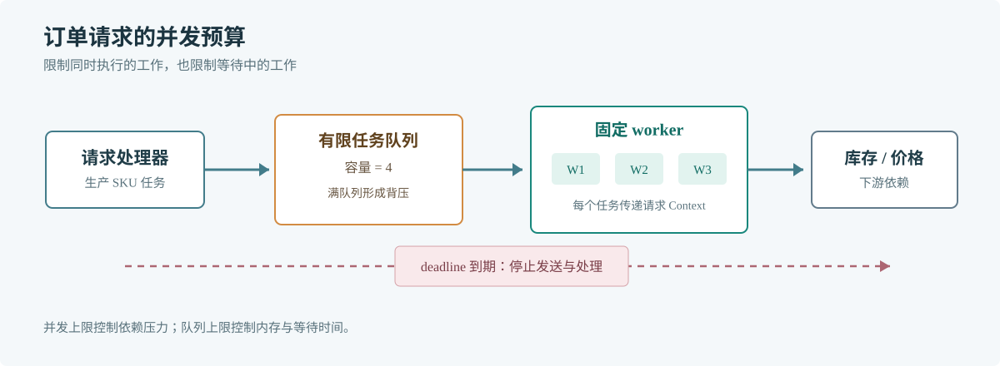

# 第 48 章 Goroutine

## 场景

订单接口要并行查询库存、价格和用户权益。下游调用变慢时，如果每个请求都无上限地启动 goroutine，等待中的任务会把连接、内存和调度队列一起堆高。

## 问题

Goroutine 创建成本低，不代表数量没有成本。无上限的并发没有限制任务数、等待时间、错误传播或客户端取消；高峰到来时，依赖处理不过来的工作仍会继续堆积。

## 实现

固定 worker 数限制同时执行的任务，有限队列限制等待量，Context 则覆盖请求取消和处理期限。

> **图解**：请求把任务放入容量有限的队列，固定数量的 worker 并行执行。队列满时生产者受到背压；Context 取消后发送和任务处理都能退出，因此并发数与等待任务数都有上限。

~~~go
package main

import (
    "context"
    "fmt"
    "sync"
    "time"
)

type Task struct{ SKU int }

func query(ctx context.Context, sku int) error {
    select {
    case <-time.After(120 * time.Millisecond):
        fmt.Printf("loaded sku=%d\n", sku)
        return nil
    case <-ctx.Done():
        return ctx.Err()
    }
}

func main() {
    ctx, cancel := context.WithTimeout(context.Background(), time.Second)
    defer cancel()
    jobs := make(chan Task, 4)
    const workers = 3
    var wg sync.WaitGroup
    for worker := 0; worker < workers; worker++ {
        wg.Add(1)
        go func(id int) {
            defer wg.Done()
            for {
                select {
                case <-ctx.Done():
                    return
                case task, ok := <-jobs:
                    if !ok {
                        return
                    }
                    if err := query(ctx, task.SKU); err != nil {
                        fmt.Printf("worker=%d stopped: %v\n", id, err)
                        return
                    }
                }
            }
        }(worker)
    }
send:
    for sku := 100; sku < 112; sku++ {
        select {
        case <-ctx.Done():
            break send
        case jobs <- Task{SKU: sku}:
        }
    }
    close(jobs)
    wg.Wait()
}
~~~

保存为 main.go 后运行 go run main.go。替换成数据库或 RPC 调用时，把同一个请求 Context 继续传给下游。

## 原理

Goroutine 是由 Go 运行时调度的执行单元，不是专属操作系统线程。它适合表达并发任务，但运行时不会替业务决定允许积压多少工作，也不知道结果何时已经无用。

工作池将并发上限变成显式配置；有限队列将突发流量转化为等待或拒绝。若到达速度长期高于消费速度，应限流、降级或扩容下游，而不是不断扩大队列。

## 最佳实践

- 每个 goroutine 都要说明由谁启动、何时结束、如何报告错误。
- 使用固定 worker 数或信号量限制昂贵操作的并发度。
- 传递请求 Context，并为外部依赖设置 deadline。
- 关闭任务队列前停止生产者；用 WaitGroup 等待 worker 退出。
- 观察队列长度、等待时间、活动 worker 数和取消数量。

## 排障

### Goroutine 数量持续上升

看 goroutine profile 中重复的栈，判断它们在等 channel、锁、网络 IO 还是定时器。增长趋势比某一时刻的绝对数量更有诊断价值。

### 请求取消后资源仍被占用

确认下游函数是否检查 Context，数据库和 RPC 是否调用带 Context 的 API。只在入口创建 Context、却没有向下传递，不会自动取消子任务。

### 内存增加但 CPU 不高

检查队列和等待中的 goroutine 数量。内存主要消耗在堆积的请求状态时，降低队列上限和设置入队超时通常比增加 CPU 更直接。

## 面试题

**Q1：Goroutine 数量是否可以无限增长？**

A：不可以。栈、堆引用、调度和等待资源都会随数量增加。服务需要给并发任务和排队设置上限。

**Q2：有缓冲 channel 为什么还需要容量上限？**

A：缓冲只允许有限数量的任务暂存。过大的缓冲会延迟暴露过载，并占用更多内存；它不能提升下游的长期处理能力。

## 小结

1. Goroutine 需要明确的所有者、取消路径和完成同步。
2. 并发数与排队量都应有上限，并通过指标观察。
3. 慢依赖场景下，背压和及时取消比启动更多 goroutine 更有效。
