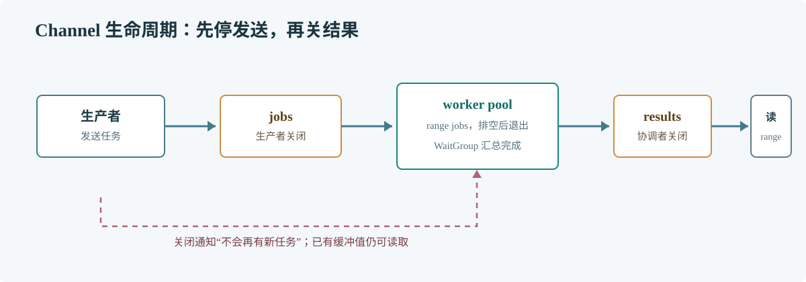

# 第 49 章 Channel

## 场景

促销订单要经过校验、扣减名额和写入结果三个步骤。每一步由独立 goroutine 处理时，团队需要明确任务如何传递、什么时候停止，以及谁负责关闭通道。

## 问题

向已关闭的 channel 发送会 panic；接收方提前退出可能让生产者永久阻塞；多个生产者争抢关闭权也会破坏任务生命周期。

## 实现

唯一生产者负责关闭 jobs；所有 worker 结束后，协调 goroutine 负责关闭 results。

> **图解**：生产者发送完任务后关闭 jobs，worker 用 range 排空队列并退出；WaitGroup 确认所有 worker 结束后，协调者再关闭 results。关闭权属于发送方，且必须发生在所有发送完成之后。

~~~go
package main

import (
    "fmt"
    "sync"
)

func main() {
    jobs := make(chan int, 4)
    results := make(chan int, 4)
    var workers sync.WaitGroup
    for id := 0; id < 2; id++ {
        workers.Add(1)
        go func(workerID int) {
            defer workers.Done()
            for job := range jobs {
                results <- job * job
                fmt.Printf("worker=%d handled job=%d\n", workerID, job)
            }
        }(id)
    }
    go func() {
        for job := 1; job <= 6; job++ {
            jobs <- job
        }
        close(jobs)
    }()
    go func() {
        workers.Wait()
        close(results)
    }()
    for result := range results {
        fmt.Println("result:", result)
    }
}
~~~

保存为 main.go 后执行 go run main.go。消费者可能提前退出时，还要给生产者加入 Context 取消分支。

## 原理

无缓冲 channel 的发送与接收需要同时就绪，因而建立同步点。带缓冲 channel 允许发送方先行，但容量耗尽后仍会阻塞。关闭表示不会再有新值，不代表缓冲区已清空；接收方可继续读完已有值。

关闭是发送方对“生产结束”的承诺。多个生产者共用一个 channel 时，应由协调者确认它们都已退出后再关闭。

## 最佳实践

- 由发送方或统一协调者关闭 channel，接收方通常只负责读取。
- 使用 range 排空已关闭的 channel。
- 将缓冲容量视为排队预算，结合任务大小与处理速度设定。
- 一条 channel 表达一个清晰的数据流，不用关闭来传递业务错误。
- 多路等待时用 select 加入 Context 取消分支。

## 排障

### 程序卡在发送或接收

查看 goroutine 栈中 channel send/receive 的位置，确认对应接收者仍会运行，且错误路径不会让上游永久等待。

### 出现 send on closed channel

搜索所有 close 调用，确定唯一关闭者，并保证它知道所有生产者已经结束。

### 关闭后仍有数据未处理

接收方会先读取缓冲里的值，缓冲为空后才结束。若业务仍缺数据，检查发送方是否提前返回。

## 面试题

**Q1：关闭 channel 后还能接收数据吗？**

A：可以。缓冲区已有数据仍可读；读空后，接收立即返回元素零值和 false。

**Q2：向 nil channel 收发会怎样？**

A：收发会永久阻塞。它可在 select 中临时禁用一个分支，但必须有重新赋值的控制路径。

## 小结

1. Channel 的缓冲容量决定允许暂存多少工作。
2. 关闭表示发送结束，由发送方或协调者负责。
3. 消费者提前退出时，要让上游能够取消或完成退出。
