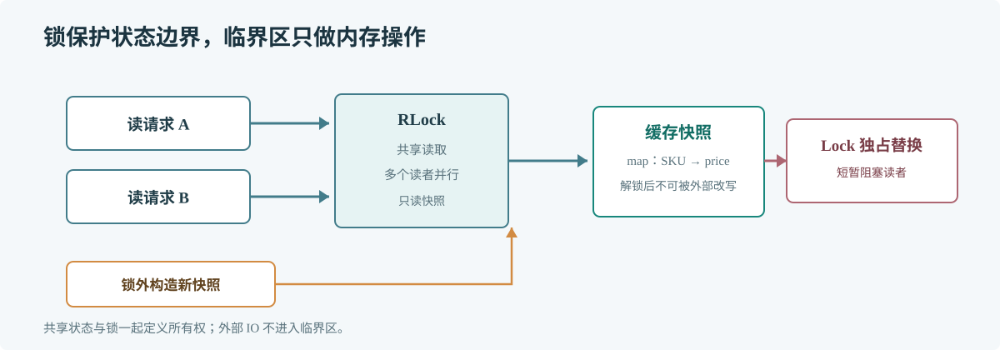

# 第 50 章 Mutex 与 RWMutex

## 场景

服务进程缓存商品价格，请求并发读取，后台任务定时刷新。直接共享 map 会触发并发读写错误；加锁时还要避免把慢 IO 放在临界区内。

## 问题

锁保护共享状态的不变量，而不只是某一行赋值。锁范围太小会留下数据竞争，范围太大则让请求排队。RWMutex 也不是所有读多写少场景的默认选择。

## 实现

先在锁外复制完整快照，发布新数据时再短暂持有写锁替换 map。

> **图解**：多个读者可以同时持有读锁，写者必须独占访问。刷新过程在锁外构建完整快照，只在替换时短暂持有写锁，降低读请求等待时间。

~~~go
package main

import (
    "fmt"
    "sync"
)

type PriceCache struct {
    mu     sync.RWMutex
    prices map[string]int64
}

func (c *PriceCache) Get(sku string) (int64, bool) {
    c.mu.RLock()
    price, ok := c.prices[sku]
    c.mu.RUnlock()
    return price, ok
}

func (c *PriceCache) Replace(next map[string]int64) {
    snapshot := make(map[string]int64, len(next))
    for sku, price := range next {
        snapshot[sku] = price
    }
    c.mu.Lock()
    c.prices = snapshot
    c.mu.Unlock()
}

func main() {
    cache := &PriceCache{prices: map[string]int64{"sku-1": 1299}}
    if price, ok := cache.Get("sku-1"); ok {
        fmt.Println("price in cents:", price)
    }
    cache.Replace(map[string]int64{"sku-1": 1199, "sku-2": 2599})
    _, ok := cache.Get("sku-2")
    fmt.Println("new sku exists:", ok)
}
~~~

## 原理

Mutex 同一时刻只允许一个 goroutine 持锁。RWMutex 允许多个读者并发访问，但写锁必须等待已有读者退出；写者等待期间，新读者也可能被挡住，以避免写操作长期饥饿。

所有访问共享数据的路径必须遵守同一同步策略。map 等引用类型还需考虑所有权，锁释放后不能让调用方继续修改内部数据。

## 最佳实践

- 优先使用 Mutex；仅在基准测试显示读锁有收益时采用 RWMutex。
- 临界区只做内存读写，不执行网络、磁盘或可能阻塞的调用。
- 不复制含锁的结构体；同步对象应通过指针共享。
- 明确锁保护哪些字段，避免一份状态被多把锁部分保护。
- 复制引用类型输入，避免锁外修改内部数据。

## 排障

### concurrent map read and map write

所有 map 访问必须由同一同步策略保护。逐一检查读写入口，或改用单 goroutine 所有权模型。

### 延迟在高读流量时变差

检查写锁持有时长、刷新是否在锁内执行以及 mutex profile 中的竞争栈。

### 锁顺序导致死锁

梳理 goroutine 获取多把锁的顺序并统一排序；避免持锁时调用未知回调或等待另一 goroutine。

## 面试题

**Q1：为什么读多写少也不一定该用 RWMutex？**

A：读临界区很短时，读锁状态维护和写者协调成本可能超过并行读取的收益，应按实际竞争用基准比较。

**Q2：解锁后返回 map 为什么仍可能有数据竞争？**

A：其他 goroutine 可在解锁后修改同一 map。安全返回值需要复制或明确转移所有权。

## 小结

1. 锁保护共享状态的完整不变量和访问路径。
2. 临界区保持短小，慢 IO 放在锁外。
3. RWMutex 是测量后的选择，不能只凭“读多写少”判断。
