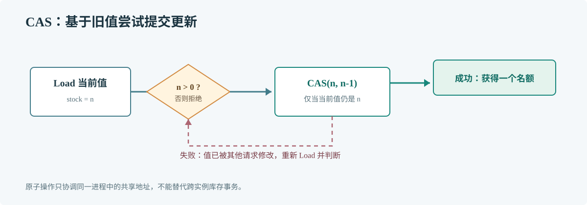

# 第 51 章 原子操作

## 场景

接口层要对一个商品设置进程内的临时名额。多个请求同时扣减时，普通的读取、判断、写回是多个步骤，可能让两个请求都认为自己拿到了最后一个名额。

## 问题

原子操作可让单个读改写动作不可分割，但不会自动保护一组相关字段，也不能替代跨进程协调。

## 实现

以下 CAS 循环说明进程内并发准入。真正的跨实例秒杀库存必须由 Redis Lua、数据库条件更新等共享存储负责。

> **图解**：请求先读取名额，只有名额大于零才尝试 CAS 替换；若其他请求先修改了值，CAS 失败后重新读取。成功的那次更新才获得名额，库存不会被扣成负数。

~~~go
package main

import (
    "fmt"
    "sync"
    "sync/atomic"
)

func tryTake(stock *atomic.Int64) bool {
    for {
        current := stock.Load()
        if current <= 0 {
            return false
        }
        if stock.CompareAndSwap(current, current-1) {
            return true
        }
    }
}

func main() {
    var stock atomic.Int64
    stock.Store(10)
    var sold atomic.Int64
    var wg sync.WaitGroup
    for request := 0; request < 100; request++ {
        wg.Add(1)
        go func() {
            defer wg.Done()
            if tryTake(&stock) {
                sold.Add(1)
            }
        }()
    }
    wg.Wait()
    fmt.Printf("sold=%d remaining=%d\n", sold.Load(), stock.Load())
}
~~~

## 原理

CAS（Compare-And-Swap）仅在内存值仍等于预期值时写入新值。竞争失败表示基于旧值的决策已失效，需要重新加载。原子变量不可能把“检查库存、创建订单、记录幂等键”跨多个系统变成一个事务。

## 最佳实践

- 原子操作适用于单字段计数、标志和指针发布。
- 业务不变量涉及多个字段时用锁，或重构为一个不可变状态。
- 进程内原子变量不能用于跨 Pod 的库存与限额。
- 不混用普通读写和原子读写访问同一变量。
- 高竞争下比较 CAS、锁和分片方案的实际成本。

## 排障

### 计数短暂变成负数

检查是否先 Add(-1) 再回滚，或存在非原子访问。严格准入应在同一原子边界内完成判断与扣减。

### 多实例压测仍然超卖

每个进程的状态彼此独立。将扣减与幂等控制移到 Redis Lua、事务数据库等共享协调点，并为订单设置唯一约束。

### 高竞争下 CPU 使用升高

采集 CPU profile 查看 CAS 重试和热点地址，再评估分片计数、批量更新或互斥锁。

## 面试题

**Q1：CAS 为什么要循环？**

A：比较期间值可能被其他 goroutine 修改。失败后要重新加载并基于新值判断。

**Q2：原子扣减能解决分布式超卖吗？**

A：不能。它只协调同一进程中的 goroutine，多个进程需要共享的原子操作或事务。

## 小结

1. 原子操作适合简单、单一状态的并发读改写。
2. CAS 失败后重新读取，不能把失败当作业务结果。
3. 秒杀库存的原子边界必须覆盖所有服务实例。
