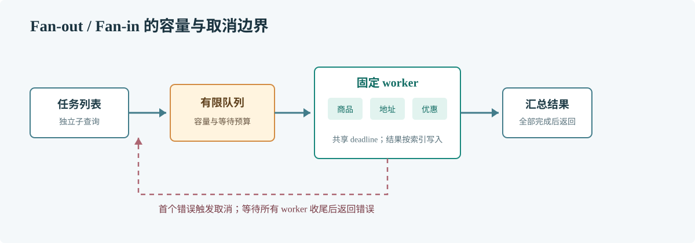

# 第 52 章 并发模式

## 场景

订单详情接口需要同时读取商品、地址和优惠信息。串行调用增加总延迟；无限并发又可能让依赖服务在流量高峰时过载。

## 问题

并发模式需要明确工作划分、并行上限、错误传播和取消语义。缺少这些约束时，部分请求失败后其他工作仍运行，消耗资源却无法形成完整响应。

## 实现

下面用固定 worker、有限任务队列和共享 Context 执行独立子任务。任一任务出错后取消其他工作，并等待 worker 收尾。

> **图解**：任务通过有限队列进入固定大小的 worker pool，worker 把结果交给汇总端。队列容量提供背压，错误触发取消信号，汇总端等待 worker 退出后再返回。

~~~go
package main

import (
    "context"
    "errors"
    "fmt"
    "sync"
)

type Task func(context.Context) (string, error)

func run(ctx context.Context, limit int, tasks []Task) ([]string, error) {
    ctx, cancel := context.WithCancel(ctx)
    defer cancel()
    jobs := make(chan int)
    results := make([]string, len(tasks))
    var wg sync.WaitGroup
    var once sync.Once
    var firstErr error
    for worker := 0; worker < limit; worker++ {
        wg.Add(1)
        go func() {
            defer wg.Done()
            for {
                select {
                case <-ctx.Done():
                    return
                case index, ok := <-jobs:
                    if !ok {
                        return
                    }
                    value, err := tasks[index](ctx)
                    if err != nil {
                        once.Do(func() { firstErr = err; cancel() })
                        return
                    }
                    results[index] = value
                }
            }
        }()
    }
send:
    for index := range tasks {
        select {
        case <-ctx.Done():
            break send
        case jobs <- index:
        }
    }
    close(jobs)
    wg.Wait()
    if firstErr != nil {
        return nil, firstErr
    }
    if err := ctx.Err(); err != nil {
        return nil, err
    }
    return results, nil
}

func main() {
    tasks := []Task{
        func(context.Context) (string, error) { return "product", nil },
        func(context.Context) (string, error) { return "address", nil },
        func(context.Context) (string, error) { return "", errors.New("coupon service unavailable") },
    }
    values, err := run(context.Background(), 2, tasks)
    fmt.Println("values:", values, "error:", err)
}
~~~

每个 Task 必须把 Context 传入 HTTP、数据库或 RPC 客户端；忽略取消的任务仍可能拖住 run 的返回。

## 原理

Worker pool 把并行度限定为固定数量，队列负责吸收有限突发。Fan-out/fan-in 适合相互独立的子查询，流水线适合有阶段依赖的数据流。两者都需要端到端截止时间和明确错误策略。

每个 worker 写入独立结果索引，因而不竞争同一个 slice 元素；若结果共用对象或 map，仍需同步保护。

## 最佳实践

- 按下游容量设置并发上限，区分每请求上限和全局依赖上限。
- 只并行彼此独立的工作；有依赖关系的步骤保持顺序。
- 定义部分成功是否可接受，以及返回哪些降级结果。
- 错误后确保取消能到达最深层 IO。
- 观察队列等待时间、拒绝数、任务耗时和取消数。

## 排障

### 并行后 P99 更差

检查扇出是否放大下游 QPS、连接池排队或锁竞争。并发减少单请求的串行耗时，却可能增加整体排队。

### 错误返回很慢

排查忽略 Context 的任务或没有截止时间的依赖调用。

### 结果偶发缺失或串位

确认任务索引对应结果位置，所有读取发生在 WaitGroup 完成之后，并检查共享对象的数据竞争。

## 面试题

**Q1：什么情况下不适合并行化？**

A：工作量很小、任务存在顺序依赖、下游容量有限或并发管理成本高于节省的延迟时。

**Q2：子任务失败后为什么还要等待其他 worker？**

A：需要确保共享状态和资源完成清理，且不让后台 goroutine 在请求返回后继续运行。

## 小结

1. 并发模式要同时定义边界、结果和取消。
2. 固定 worker 与有限队列提供可预测的负载上限。
3. 按端到端延迟和下游饱和度评估并行化。
